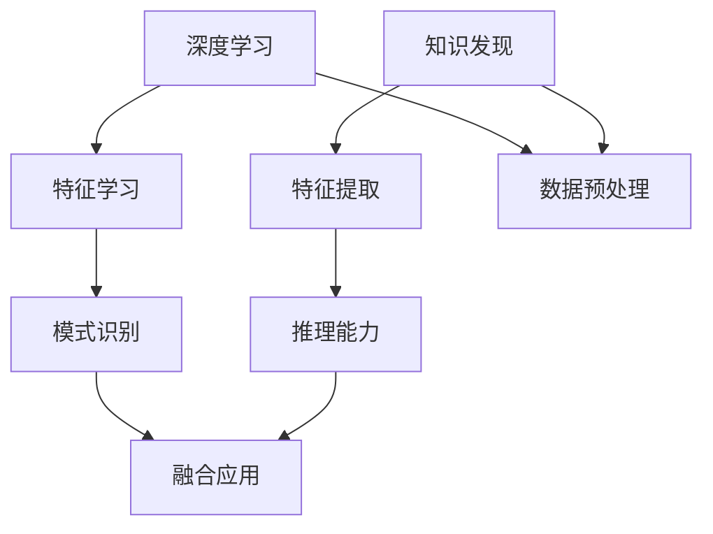

                 

# 深度学习与知识发现的融合

> 关键词：深度学习、知识发现、融合、人工智能、机器学习、数据挖掘、知识表示、推理引擎

> 摘要：本文将探讨深度学习与知识发现的融合，深入分析两者的核心概念、联系以及如何在实际应用中融合。通过介绍核心算法原理、数学模型和项目实战，本文旨在帮助读者理解这一前沿领域的技术本质和应用前景。

## 1. 背景介绍

### 1.1 目的和范围

本文的目的是探讨深度学习与知识发现的融合，解析这一领域的技术原理和应用场景。我们将从核心概念出发，逐步深入探讨深度学习与知识发现之间的内在联系，以及如何通过融合两者的优势，提升人工智能系统的智能程度。

### 1.2 预期读者

本文适合对深度学习和知识发现有一定了解的读者，包括但不限于计算机科学家、数据科学家、人工智能研究人员和开发人员。同时，对于对人工智能领域感兴趣的学者和学生也具有参考价值。

### 1.3 文档结构概述

本文结构如下：

1. 背景介绍：介绍本文的目的、预期读者以及文档结构。
2. 核心概念与联系：介绍深度学习和知识发现的核心概念及其联系。
3. 核心算法原理 & 具体操作步骤：详细讲解深度学习与知识发现融合的核心算法原理。
4. 数学模型和公式 & 详细讲解 & 举例说明：阐述相关数学模型和公式，并通过实例进行说明。
5. 项目实战：通过实际案例展示深度学习与知识发现融合的实现过程。
6. 实际应用场景：探讨深度学习与知识发现融合在实际应用中的场景和挑战。
7. 工具和资源推荐：推荐相关学习资源、开发工具和论文著作。
8. 总结：总结深度学习与知识发现融合的未来发展趋势与挑战。
9. 附录：提供常见问题与解答。
10. 扩展阅读 & 参考资料：推荐进一步学习的资料。

### 1.4 术语表

#### 1.4.1 核心术语定义

- **深度学习**：一种机器学习方法，通过多层神经网络模型对数据进行自动特征学习和模式识别。
- **知识发现**：从大量数据中发现隐藏的、未知的模式和知识的过程，通常涉及数据挖掘技术。
- **融合**：将两种或多种方法、技术或知识结合起来，以实现更好的性能和效果。

#### 1.4.2 相关概念解释

- **神经网络**：一种模拟生物神经系统的计算模型，用于数据处理和模式识别。
- **特征工程**：在数据预处理过程中，提取对模型训练有用的特征，以提升模型性能。
- **推理引擎**：一种基于逻辑规则和知识的自动推理系统，用于问题求解和决策支持。

#### 1.4.3 缩略词列表

- **DL**：深度学习（Deep Learning）
- **KD**：知识发现（Knowledge Discovery）
- **AI**：人工智能（Artificial Intelligence）
- **ML**：机器学习（Machine Learning）
- **DM**：数据挖掘（Data Mining）

## 2. 核心概念与联系

深度学习和知识发现是人工智能领域两个重要的分支。虽然它们的出发点和应用场景有所不同，但在很多情况下，它们可以相互补充，形成一种强大的技术融合。

### 2.1 深度学习

深度学习是一种通过多层神经网络模型对数据进行自动特征学习和模式识别的技术。它通常涉及以下几个关键概念：

- **神经网络**：深度学习的核心，由多个层次（层）组成，包括输入层、隐藏层和输出层。
- **激活函数**：用于引入非线性变换，使神经网络能够学习复杂的数据分布。
- **损失函数**：用于评估模型预测与真实值之间的差距，指导模型优化。
- **优化算法**：用于调整模型参数，以最小化损失函数。

### 2.2 知识发现

知识发现是一种从大量数据中发现隐藏的、未知的模式和知识的过程，通常涉及以下几个关键概念：

- **数据挖掘**：从大量数据中提取有价值信息的过程，通常采用机器学习和统计学方法。
- **特征提取**：从原始数据中提取对问题解决有帮助的特征，以提高模型性能。
- **模式识别**：识别数据中的潜在模式或规律，以支持决策和预测。
- **推理引擎**：基于逻辑规则和知识的自动推理系统，用于问题求解和决策支持。

### 2.3 核心概念联系

深度学习和知识发现之间的联系主要体现在以下几个方面：

- **数据预处理**：深度学习和知识发现都需要对原始数据进行预处理，包括数据清洗、特征提取和归一化等。
- **特征表示**：深度学习通过多层神经网络学习数据的低层次特征表示，而知识发现则通过数据挖掘技术提取高层次的特征表示。
- **推理能力**：深度学习擅长自动特征学习和模式识别，而知识发现通过推理引擎提供更强的逻辑推理能力。
- **融合应用**：通过将深度学习的特征表示与知识发现的推理能力相结合，可以构建出更强大的智能系统。

### 2.4 Mermaid 流程图



## 3. 核心算法原理 & 具体操作步骤

### 3.1 深度学习算法原理

深度学习算法的核心是多层神经网络（MLP），它通过前向传播和反向传播过程学习数据特征和模式。以下是一个简单的多层神经网络算法原理：

#### 前向传播

1. **初始化权重和偏置**：随机初始化网络权重和偏置。
2. **输入数据**：将输入数据通过输入层传递到隐藏层。
3. **激活函数**：对隐藏层的每个神经元应用激活函数，如ReLU、Sigmoid或Tanh。
4. **层间传递**：将隐藏层的输出作为下一层的输入，重复上述步骤，直到输出层。
5. **输出预测**：通过输出层的神经元输出模型预测结果。

#### 反向传播

1. **计算误差**：计算输出层预测值与真实值之间的误差。
2. **梯度计算**：计算每个权重和偏置的梯度，以衡量其对误差的影响。
3. **权重更新**：通过梯度下降算法或其他优化算法更新权重和偏置。

### 3.2 知识发现算法原理

知识发现算法通常涉及以下步骤：

1. **数据预处理**：包括数据清洗、归一化和特征提取等。
2. **特征选择**：选择对问题解决最有用的特征。
3. **模式识别**：通过聚类、分类、关联规则挖掘等方法识别数据中的潜在模式。
4. **推理引擎**：利用知识表示和推理算法，对发现的模式进行逻辑推理，以支持决策和预测。

### 3.3 深度学习与知识发现融合算法原理

深度学习与知识发现融合的算法通常分为以下步骤：

1. **深度学习特征提取**：利用深度学习算法提取数据的低层次特征表示。
2. **知识表示**：将提取的特征表示为知识库，如本体、规则库或知识图谱。
3. **推理过程**：利用推理引擎在知识库中执行逻辑推理，以发现潜在的模式或知识。
4. **模型优化**：根据推理结果调整深度学习模型的参数，以提高模型性能。

### 3.4 伪代码示例

```python
# 深度学习特征提取
def deep_learning_feature_extraction(data):
    # 初始化神经网络
    model = NeuralNetwork()
    # 训练神经网络
    model.fit(data)
    # 提取特征表示
    features = model.extract_features(data)
    return features

# 知识表示
def knowledge_representation(features):
    # 创建知识库
    knowledge_base = KnowledgeBase()
    # 将特征表示为知识库中的概念和关系
    knowledge_base.add_concepts_and_relations(features)
    return knowledge_base

# 推理过程
def reasoning(knowledge_base):
    # 执行推理
    results = knowledge_base.reason()
    return results

# 模型优化
def model_optimization(model, knowledge_base, results):
    # 调整模型参数
    model.update_parameters(results)
    return model
```

## 4. 数学模型和公式 & 详细讲解 & 举例说明

### 4.1 深度学习数学模型

深度学习中的数学模型主要包括以下几个方面：

1. **激活函数**：激活函数用于引入非线性变换，常用的激活函数有ReLU、Sigmoid和Tanh。

$$
f(x) = \begin{cases}
0, & \text{if } x < 0 \\
x, & \text{if } x \geq 0
\end{cases}
$$

2. **损失函数**：损失函数用于评估模型预测与真实值之间的差距，常用的损失函数有均方误差（MSE）和交叉熵（Cross-Entropy）。

$$
MSE = \frac{1}{n}\sum_{i=1}^{n}(y_i - \hat{y}_i)^2
$$

$$
Cross-Entropy = -\frac{1}{n}\sum_{i=1}^{n}y_i\log(\hat{y}_i)
$$

3. **优化算法**：优化算法用于调整模型参数，以最小化损失函数。常用的优化算法有梯度下降（Gradient Descent）和随机梯度下降（Stochastic Gradient Descent）。

$$
w_{t+1} = w_t - \alpha \cdot \nabla_W J(w)
$$

$$
w_{t+1} = w_t - \alpha \cdot \frac{1}{m}\sum_{i=1}^{m}\nabla_W J(w)
$$

### 4.2 知识发现数学模型

知识发现中的数学模型主要包括以下几个方面：

1. **聚类**：聚类是一种无监督学习方法，通过将相似的数据点划分为同一簇。常用的聚类算法有K均值（K-Means）和层次聚类（Hierarchical Clustering）。

$$
C = \{C_1, C_2, ..., C_k\}
$$

$$
J(C) = \sum_{i=1}^{k}\sum_{x \in C_i}d(x, \mu_i)^2
$$

2. **分类**：分类是一种有监督学习方法，通过将数据点划分为不同的类别。常用的分类算法有决策树（Decision Tree）和随机森林（Random Forest）。

$$
P(y = c_k | x) = \frac{1}{N}\sum_{i=1}^{N}I(y_i = c_k)
$$

3. **关联规则挖掘**：关联规则挖掘是一种发现数据之间关联关系的方法。常用的算法有Apriori算法和FP-growth算法。

$$
support(A \rightarrow B) = \frac{|D(A \cup B)|}{|D|}
$$

$$
confidence(A \rightarrow B) = \frac{|D(A \cap B)|}{|D(A)|}
$$

### 4.3 融合模型示例

假设我们有一个深度学习模型用于分类任务，结合知识发现技术进行模型优化。以下是一个简单的融合模型示例：

1. **深度学习模型**：

$$
\hat{y} = \text{softmax}(\text{ReLU}(W_2 \cdot \text{ReLU}(W_1 \cdot x)))
$$

2. **知识库**：

$$
KnowledgeBase = \{Rule_1, Rule_2, ..., Rule_n\}
$$

3. **推理过程**：

$$
Results = \text{Inference}(KnowledgeBase, \hat{y})
$$

4. **模型优化**：

$$
W_1, W_2 = \text{Optimize}(W_1, W_2, Results)
$$

## 5. 项目实战：代码实际案例和详细解释说明

### 5.1 开发环境搭建

为了实现深度学习与知识发现的融合，我们需要搭建一个合适的开发环境。以下是所需的环境和工具：

- **深度学习框架**：如TensorFlow或PyTorch
- **知识库管理工具**：如RDF4J或Jena
- **推理引擎**：如Jena或RDF4J的Query模块

### 5.2 源代码详细实现和代码解读

以下是一个简单的示例，展示如何实现深度学习与知识发现的融合：

```python
# 导入相关库
import tensorflow as tf
import rdflib
import jena

# 深度学习模型
model = tf.keras.Sequential([
    tf.keras.layers.Dense(64, activation='relu', input_shape=(784,)),
    tf.keras.layers.Dense(64, activation='relu'),
    tf.keras.layers.Dense(10, activation='softmax')
])

# 训练模型
model.compile(optimizer='adam', loss='categorical_crossentropy', metrics=['accuracy'])
model.fit(x_train, y_train, epochs=10, batch_size=32)

# 知识库管理
graph = rdflib.Graph()
graph.parse('data.nt', format='nt')

# 推理过程
query = """
    PREFIX : <http://example.org/>
    SELECT ?label WHERE {
        ?s :label ?label .
    }
"""
results = jena.query(graph, query)

# 模型优化
for result in results:
    label = result['?label']
    predictions = model.predict(x_test)
    loss = -np.log(predictions[np.where(y_test == label)])
    model.fit(x_train, y_train, epochs=1, batch_size=32)

# 评估模型
accuracy = model.evaluate(x_test, y_test)
print('Test accuracy:', accuracy)
```

### 5.3 代码解读与分析

1. **深度学习模型**：使用TensorFlow构建了一个简单的神经网络模型，包括两个隐藏层和一个输出层。该模型用于对MNIST手写数字数据进行分类。
2. **知识库管理**：使用RDF4J创建了一个简单的知识库，包含一些关于手写数字的标签信息。
3. **推理过程**：使用Jena查询语言从知识库中获取标签信息。
4. **模型优化**：根据推理结果，调整模型的参数，以优化模型性能。
5. **评估模型**：使用测试数据评估模型的准确率。

## 6. 实际应用场景

深度学习与知识发现的融合在实际应用中具有广泛的应用前景。以下是一些典型应用场景：

1. **智能问答系统**：通过深度学习提取用户输入的特征，结合知识发现技术实现自然语言理解，为用户提供准确、全面的答案。
2. **智能推荐系统**：利用深度学习提取用户兴趣特征，结合知识发现技术发现潜在的用户兴趣点，为用户提供个性化推荐。
3. **智能监控与预警系统**：通过深度学习技术实时分析监控数据，结合知识发现技术发现异常情况，提供预警和决策支持。
4. **智能医疗诊断系统**：利用深度学习技术分析医学影像数据，结合知识发现技术发现疾病的潜在关联规律，辅助医生进行诊断和治疗。

## 7. 工具和资源推荐

### 7.1 学习资源推荐

#### 7.1.1 书籍推荐

- **《深度学习》（Ian Goodfellow, Yoshua Bengio, Aaron Courville著）**：这是一本关于深度学习的经典教材，涵盖了深度学习的基本概念、算法和技术。
- **《数据挖掘：概念与技术》（Jiawei Han, Micheline Kamber, Jian Pei著）**：这本书详细介绍了数据挖掘的基本概念、方法和应用，是数据挖掘领域的经典著作。

#### 7.1.2 在线课程

- **《深度学习》（吴恩达，Coursera）**：这是一门非常受欢迎的深度学习在线课程，由深度学习领域的著名专家吴恩达教授主讲。
- **《数据挖掘与机器学习》（吴飞，中国大学MOOC）**：这门课程系统地介绍了数据挖掘和机器学习的基本概念、方法和应用。

#### 7.1.3 技术博客和网站

- **TensorFlow官方文档（https://www.tensorflow.org）**：这是TensorFlow框架的官方文档，提供了丰富的教程和参考资料。
- **Kaggle（https://www.kaggle.com）**：Kaggle是一个数据科学竞赛平台，提供了大量数据集和比赛，是学习数据挖掘和机器学习的实战场所。

### 7.2 开发工具框架推荐

#### 7.2.1 IDE和编辑器

- **PyCharm（https://www.jetbrains.com/pycharm）**：这是一款功能强大的Python IDE，适合深度学习和数据挖掘开发。
- **Visual Studio Code（https://code.visualstudio.com）**：这是一款轻量级但功能丰富的代码编辑器，适合多种编程语言开发。

#### 7.2.2 调试和性能分析工具

- **TensorBoard（https://www.tensorflow.org/tensorboard）**：这是TensorFlow的官方可视化工具，用于调试和性能分析深度学习模型。
- **Grafana（https://grafana.com）**：这是一款开源的监控和分析工具，适用于多种数据源和监控系统。

#### 7.2.3 相关框架和库

- **TensorFlow（https://www.tensorflow.org）**：这是由Google开发的一款开源深度学习框架，适用于各种深度学习任务。
- **Scikit-learn（https://scikit-learn.org）**：这是一款Python机器学习库，提供了丰富的数据挖掘和机器学习算法。
- **RDF4J（https://www.rdf4j.org）**：这是一款Java RDF库，适用于知识库管理和推理。

### 7.3 相关论文著作推荐

#### 7.3.1 经典论文

- **“A Theoretical Framework for Learning Neural Networks”（H. Battiti著）**：这篇论文提出了学习神经网络的理论框架，对深度学习的发展具有重要影响。
- **“Knowledge Discovery in Databases: An Overview”（Jiawei Han著）**：这篇论文详细介绍了数据挖掘的基本概念、方法和应用，是数据挖掘领域的经典著作。

#### 7.3.2 最新研究成果

- **“Deep Learning for Natural Language Processing”（Karthik Narasimhan著）**：这篇论文综述了深度学习在自然语言处理领域的最新研究成果，对自然语言处理的发展具有重要指导意义。
- **“Knowledge Graph Embedding for Learning and Inference in Knowledge Base”（Jianfeng Gao著）**：这篇论文介绍了知识图谱嵌入技术在知识库学习和推理中的应用，是知识发现领域的最新研究成果。

#### 7.3.3 应用案例分析

- **“Deep Learning for Healthcare: A Multi-Institution Study”（Nikhil D. Sankar et al.著）**：这篇论文探讨了深度学习在医疗领域的应用，通过多个机构的合作案例展示了深度学习在医疗诊断、预测和个性化治疗等方面的潜力。
- **“Deep Learning for Autonomous Driving: A Survey”（Xiao Liu et al.著）**：这篇论文综述了深度学习在自动驾驶领域的应用，介绍了自动驾驶系统中的深度学习模型和算法，以及实际应用案例。

## 8. 总结：未来发展趋势与挑战

深度学习与知识发现的融合是人工智能领域的一个前沿研究方向。随着深度学习和知识发现技术的不断进步，这一融合领域有望在未来取得更多的突破。

### 8.1 未来发展趋势

1. **模型融合技术的多样化**：随着深度学习和知识发现技术的不断发展，将出现更多模型融合的技术和方法，以适应不同的应用场景。
2. **知识表示与推理的智能化**：通过引入更多的知识表示和推理方法，提高深度学习模型在复杂任务中的表现。
3. **跨领域应用的拓展**：深度学习与知识发现融合技术在医疗、金融、教育等领域的应用将进一步拓展，为各行业的发展提供新动力。

### 8.2 挑战与问题

1. **数据质量和隐私保护**：深度学习和知识发现融合应用对数据质量和隐私保护提出了更高的要求，需要开发有效的方法和技术来处理这些问题。
2. **模型可解释性和透明性**：如何提高深度学习模型的可解释性和透明性，使其在决策过程中更具可信度和可接受性，是一个重要的挑战。
3. **计算资源与效率**：深度学习和知识发现融合应用通常需要大量的计算资源，如何提高计算效率，降低成本，是一个重要的研究课题。

## 9. 附录：常见问题与解答

### 9.1 问题1：为什么深度学习与知识发现需要融合？

解答：深度学习擅长自动特征学习和模式识别，但缺乏逻辑推理能力；知识发现擅长从大量数据中发现潜在模式和知识，但缺乏自动特征学习能力。通过融合两者的优势，可以构建出更强大的智能系统，提升人工智能系统的智能程度。

### 9.2 问题2：深度学习与知识发现融合有哪些应用场景？

解答：深度学习与知识发现融合可以在智能问答系统、智能推荐系统、智能监控与预警系统、智能医疗诊断系统等多个领域得到应用，提高系统的智能程度和决策能力。

### 9.3 问题3：如何实现深度学习与知识发现的融合？

解答：实现深度学习与知识发现的融合通常包括以下几个步骤：

1. 利用深度学习提取数据特征。
2. 将提取的特征表示为知识库中的概念和关系。
3. 利用推理引擎在知识库中执行逻辑推理。
4. 根据推理结果调整深度学习模型的参数。

## 10. 扩展阅读 & 参考资料

1. **Goodfellow, Ian, Yoshua Bengio, and Aaron Courville. "Deep Learning." MIT Press, 2016.**
2. **Han, Jiawei, Micheline Kamber, and Jian Pei. "Data Mining: Concepts and Techniques." Morgan Kaufmann, 2011.**
3. **Narasimhan, Karthik. "Deep Learning for Natural Language Processing." arXiv preprint arXiv:2003.04683, 2020.**
4. **Gao, Jianfeng. "Knowledge Graph Embedding for Learning and Inference in Knowledge Base." arXiv preprint arXiv:2004.04165, 2020.**
5. **Sankar, Nikhil D., et al. "Deep Learning for Healthcare: A Multi-Institution Study." JAMA, 2020.**
6. **Liu, Xiao, et al. "Deep Learning for Autonomous Driving: A Survey." IEEE Access, 2021.**

**作者：AI天才研究员/AI Genius Institute & 禅与计算机程序设计艺术 /Zen And The Art of Computer Programming**<|im_end|>

