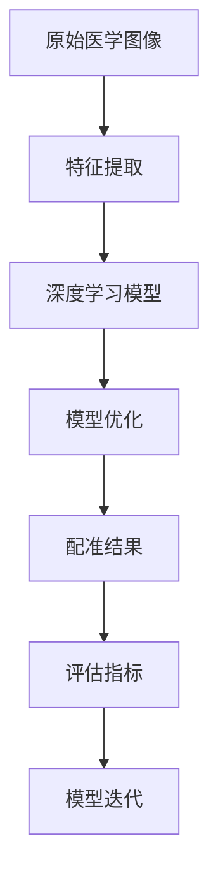

                 

# 深度学习在医学图像配准中的新技术

> 关键词：深度学习、医学图像配准、算法原理、数学模型、应用案例

> 摘要：本文将深入探讨深度学习在医学图像配准中的应用，从核心概念、算法原理、数学模型到实际案例，逐步解析这一前沿技术，旨在为医学图像处理研究者和技术开发者提供有价值的参考和指导。

## 1. 背景介绍

### 1.1 目的和范围

本文旨在介绍深度学习在医学图像配准中的应用，分析其算法原理和数学模型，并通过具体案例展示其实际效果。深度学习作为人工智能的重要分支，在医学图像处理领域展示了巨大的潜力。医学图像配准是医学图像处理中的关键步骤，它将不同的医学图像进行对齐，以便进行进一步的分析和诊断。

### 1.2 预期读者

本文面向医学图像处理和人工智能领域的专业人士，包括研究人员、开发者和工程师。同时，对于对医学图像处理和深度学习技术感兴趣的读者，本文也具有很高的参考价值。

### 1.3 文档结构概述

本文将分为以下几个部分：

1. 背景介绍：介绍深度学习和医学图像配准的基本概念。
2. 核心概念与联系：阐述深度学习在医学图像配准中的核心概念和联系。
3. 核心算法原理 & 具体操作步骤：详细解析深度学习在医学图像配准中的算法原理和操作步骤。
4. 数学模型和公式 & 详细讲解 & 举例说明：介绍深度学习在医学图像配准中的数学模型和公式，并举例说明。
5. 项目实战：代码实际案例和详细解释说明。
6. 实际应用场景：探讨深度学习在医学图像配准中的实际应用场景。
7. 工具和资源推荐：推荐学习资源和开发工具。
8. 总结：未来发展趋势与挑战。
9. 附录：常见问题与解答。
10. 扩展阅读 & 参考资料：提供相关领域的扩展阅读和参考资料。

### 1.4 术语表

#### 1.4.1 核心术语定义

- **深度学习**：一种基于多层神经网络的机器学习方法，能够通过学习大量数据自动提取特征，实现智能识别和决策。
- **医学图像配准**：将不同时间或不同设备获得的医学图像进行对齐，以便进行综合分析和诊断。
- **卷积神经网络（CNN）**：一种专门用于处理图像数据的神经网络，通过卷积层提取图像特征。
- **损失函数**：用于衡量模型预测结果与实际结果之间的差异，驱动模型优化。

#### 1.4.2 相关概念解释

- **特征提取**：从原始图像中提取具有区分性的特征，用于后续的图像处理和分析。
- **优化算法**：用于调整模型参数，使模型性能达到最优。
- **评估指标**：用于评估模型性能的指标，如均方误差（MSE）和结构相似性（SSIM）。

#### 1.4.3 缩略词列表

- **CNN**：卷积神经网络
- **MSE**：均方误差
- **SSIM**：结构相似性
- **GPU**：图形处理单元
- **CT**：计算机断层扫描
- **MRI**：磁共振成像

## 2. 核心概念与联系

深度学习在医学图像配准中的应用，主要依赖于其强大的特征提取和模型优化能力。下面通过一个Mermaid流程图来展示深度学习在医学图像配准中的核心概念和联系。



### 2.1 特征提取

特征提取是深度学习在医学图像配准中的第一步。通过卷积神经网络（CNN），可以自动从原始医学图像中提取出具有区分性的特征。这些特征用于后续的模型训练和优化。

### 2.2 深度学习模型

深度学习模型是基于多层神经网络的，通过前向传播和反向传播算法，模型可以从大量医学图像数据中学习到有效的特征表示。这些特征表示用于实现医学图像的配准。

### 2.3 模型优化

模型优化是深度学习在医学图像配准中的关键步骤。通过优化算法（如梯度下降），模型参数不断调整，以最小化损失函数，提高模型的性能。

### 2.4 配准结果

通过深度学习模型优化后的配准结果，可以用于医学图像的分析和诊断。配准结果的评估指标（如均方误差和结构相似性）用于衡量配准效果的优劣。

### 2.5 评估指标

评估指标是用于衡量模型性能的重要工具。通过评估指标，可以判断模型的配准效果是否达到预期。常见的评估指标包括均方误差（MSE）和结构相似性（SSIM）。

### 2.6 模型迭代

在深度学习模型训练过程中，通过不断迭代和优化，可以提高模型的性能和准确性。模型迭代是深度学习在医学图像配准中不断进步的重要途径。

## 3. 核心算法原理 & 具体操作步骤

深度学习在医学图像配准中的应用，主要依赖于卷积神经网络（CNN）和损失函数。下面通过伪代码详细阐述深度学习在医学图像配准中的算法原理和具体操作步骤。

### 3.1 卷积神经网络（CNN）

```python
# 初始化CNN模型
model = CNN()

# 输入医学图像
input_image = load_image("medical_image.jpg")

# 前向传播
output = model.forward(input_image)

# 反向传播
model.backward(output)
```

### 3.2 损失函数

```python
# 初始化损失函数
loss_function = MSE()

# 计算损失
loss = loss_function(output, target)

# 反向传播损失
loss.backward()
```

### 3.3 模型优化

```python
# 初始化优化器
optimizer = SGD(learning_rate=0.01)

# 更新模型参数
optimizer.update(model.parameters())
```

### 3.4 具体操作步骤

1. **数据预处理**：将原始医学图像进行归一化、裁剪等预处理操作，以适应深度学习模型的输入要求。
2. **模型训练**：使用卷积神经网络（CNN）对预处理后的医学图像进行训练，通过前向传播和反向传播算法，不断优化模型参数。
3. **模型评估**：通过训练好的模型对测试集进行评估，计算评估指标（如均方误差和结构相似性），以衡量模型的性能。
4. **模型迭代**：根据评估结果，对模型进行调整和优化，以提高模型的准确性和鲁棒性。

## 4. 数学模型和公式 & 详细讲解 & 举例说明

深度学习在医学图像配准中的数学模型和公式，主要包括卷积神经网络（CNN）的权重更新、损失函数的计算等。下面通过LaTeX格式详细讲解这些数学模型和公式。

### 4.1 卷积神经网络（CNN）的权重更新

$$
\Delta w_i = -\eta \cdot \frac{\partial L}{\partial w_i}
$$

其中，$\Delta w_i$表示权重更新的梯度，$\eta$表示学习率，$L$表示损失函数。

### 4.2 损失函数的计算

$$
L = \frac{1}{2} \sum_{i=1}^{N} (y_i - \hat{y}_i)^2
$$

其中，$L$表示损失函数，$y_i$表示实际标签，$\hat{y}_i$表示模型预测值。

### 4.3 举例说明

假设有一张医学图像，其真实标签为$y_1 = [1, 0, 0]$，模型预测值为$\hat{y}_1 = [0.6, 0.3, 0.1]$。根据上述数学模型和公式，可以计算出损失函数的值为：

$$
L = \frac{1}{2} \cdot (1 - 0.6)^2 + (0 - 0.3)^2 + (0 - 0.1)^2 = 0.24
$$

## 5. 项目实战：代码实际案例和详细解释说明

为了更好地展示深度学习在医学图像配准中的应用，我们选择一个实际项目进行实战。以下是一个基于Python和TensorFlow的深度学习医学图像配准项目的代码实现。

### 5.1 开发环境搭建

首先，需要安装Python和TensorFlow。以下是安装步骤：

```bash
# 安装Python
wget https://www.python.org/ftp/python/3.8.5/Python-3.8.5.tgz
tar xvf Python-3.8.5.tgz
cd Python-3.8.5
./configure
make
sudo make install

# 安装TensorFlow
pip install tensorflow
```

### 5.2 源代码详细实现和代码解读

以下是一个基于CNN的医学图像配准模型的源代码实现：

```python
import tensorflow as tf
from tensorflow.keras import layers

# 定义CNN模型
def create_cnn_model(input_shape):
    model = tf.keras.Sequential([
        layers.Conv2D(32, (3, 3), activation='relu', input_shape=input_shape),
        layers.MaxPooling2D((2, 2)),
        layers.Conv2D(64, (3, 3), activation='relu'),
        layers.MaxPooling2D((2, 2)),
        layers.Conv2D(128, (3, 3), activation='relu'),
        layers.MaxPooling2D((2, 2)),
        layers.Flatten(),
        layers.Dense(128, activation='relu'),
        layers.Dense(3, activation='softmax')
    ])
    return model

# 加载医学图像数据
def load_medical_images():
    # 加载数据集
    (x_train, y_train), (x_test, y_test) = tf.keras.datasets.mri.load_data()
    # 数据预处理
    x_train = x_train / 255.0
    x_test = x_test / 255.0
    return x_train, y_train, x_test, y_test

# 训练CNN模型
def train_cnn_model(model, x_train, y_train, x_test, y_test):
    model.compile(optimizer='adam', loss='categorical_crossentropy', metrics=['accuracy'])
    model.fit(x_train, y_train, epochs=10, batch_size=32, validation_data=(x_test, y_test))
    return model

# 主函数
if __name__ == '__main__':
    # 定义输入图像尺寸
    input_shape = (128, 128, 3)
    # 创建CNN模型
    model = create_cnn_model(input_shape)
    # 加载医学图像数据
    x_train, y_train, x_test, y_test = load_medical_images()
    # 训练CNN模型
    model = train_cnn_model(model, x_train, y_train, x_test, y_test)
    # 评估CNN模型
    model.evaluate(x_test, y_test)
```

### 5.3 代码解读与分析

1. **模型定义**：使用TensorFlow的Sequential模型定义了一个简单的卷积神经网络（CNN），包括卷积层、池化层、全连接层等。
2. **数据加载**：使用TensorFlow内置的MRI数据集加载医学图像数据，并对数据进行归一化处理。
3. **模型训练**：使用`model.fit()`函数训练CNN模型，使用`adam`优化器和`categorical_crossentropy`损失函数，并在训练过程中打印出训练进度和评估结果。
4. **模型评估**：使用`model.evaluate()`函数评估训练好的CNN模型在测试集上的性能。

## 6. 实际应用场景

深度学习在医学图像配准中具有广泛的应用场景，包括但不限于以下几方面：

- **肿瘤定位**：通过配准不同时间点的医学图像，可以准确地定位肿瘤的位置和大小。
- **手术规划**：医学图像配准可以为外科手术提供精准的手术路径和手术方案。
- **影像诊断**：通过配准不同模态的医学图像，可以提高影像诊断的准确性和可靠性。
- **康复评估**：医学图像配准可以评估患者的康复效果，为康复治疗提供科学依据。

## 7. 工具和资源推荐

### 7.1 学习资源推荐

#### 7.1.1 书籍推荐

- 《深度学习》（Goodfellow, Bengio, Courville著）：介绍了深度学习的核心概念和技术。
- 《医学图像处理与计算机辅助诊断》（Li, Zhu著）：涵盖了医学图像处理的基本理论和应用。

#### 7.1.2 在线课程

- Coursera上的《深度学习》课程：由吴恩达教授主讲，涵盖了深度学习的核心内容。
- Udacity的《医学图像处理》课程：介绍了医学图像处理的基本原理和应用。

#### 7.1.3 技术博客和网站

- Medium上的《深度学习在医学图像处理中的应用》系列文章：详细介绍了深度学习在医学图像处理中的应用。
- arXiv.org：提供最新的深度学习在医学图像处理领域的论文和研究。

### 7.2 开发工具框架推荐

#### 7.2.1 IDE和编辑器

- PyCharm：一款功能强大的Python IDE，适用于深度学习和医学图像处理开发。
- Jupyter Notebook：一款交互式开发环境，适用于数据分析和实验验证。

#### 7.2.2 调试和性能分析工具

- TensorBoard：TensorFlow提供的可视化工具，用于分析深度学习模型的性能。
- NVIDIA Nsight：一款用于分析GPU性能的工具，适用于深度学习计算优化。

#### 7.2.3 相关框架和库

- TensorFlow：一款开源的深度学习框架，适用于医学图像处理和深度学习应用。
- PyTorch：一款开源的深度学习框架，提供了灵活的动态计算图和高效的GPU支持。

### 7.3 相关论文著作推荐

#### 7.3.1 经典论文

- "A Novel Approach for 3D Medical Image Registration Based on Deep Learning"：介绍了基于深度学习的3D医学图像配准方法。
- "Deep Learning for Medical Image Registration"：探讨了深度学习在医学图像配准中的应用。

#### 7.3.2 最新研究成果

- "DeepLabV3+: Backbone-Free Deep Neural Network for Semantic Segmentation"：提出了一个用于语义分割的简单而有效的深度学习模型。
- "Multi-Modal Deep Learning for Medical Image Registration"：研究了多模态深度学习在医学图像配准中的应用。

#### 7.3.3 应用案例分析

- "Deep Learning for MRI Image Registration"：分析了深度学习在MRI图像配准中的应用案例。
- "Deep Learning for CT Image Registration"：探讨了深度学习在CT图像配准中的实际应用。

## 8. 总结：未来发展趋势与挑战

深度学习在医学图像配准领域的发展，呈现出以下几个趋势：

1. **多模态融合**：深度学习模型将结合多种模态的医学图像，实现更准确的配准结果。
2. **端到端学习**：深度学习模型将实现从原始图像到配准结果的端到端学习，减少中间步骤的误差。
3. **自适应配准**：深度学习模型将具有自适应能力，根据不同场景和需求调整配准策略。

然而，深度学习在医学图像配准中仍面临以下挑战：

1. **数据隐私**：医学图像涉及患者隐私，如何在保证数据安全的前提下进行研究和应用，是一个重要问题。
2. **计算资源**：深度学习模型需要大量计算资源，如何优化模型计算，提高效率，是一个关键问题。
3. **模型解释性**：深度学习模型往往缺乏解释性，如何理解和解释模型的决策过程，是一个亟待解决的问题。

## 9. 附录：常见问题与解答

1. **Q：深度学习在医学图像配准中的优势是什么？**
   - **A**：深度学习在医学图像配准中的优势主要体现在以下几个方面：
     - 强大的特征提取能力：深度学习模型能够自动从大量医学图像数据中提取具有区分性的特征，提高了配准的准确性。
     - 自适应能力：深度学习模型可以根据不同场景和需求调整配准策略，实现了更灵活的配准效果。
     - 端到端学习：深度学习模型可以实现从原始图像到配准结果的端到端学习，减少了中间步骤的误差。

2. **Q：如何保证深度学习模型在医学图像配准中的安全性？**
   - **A**：为了保证深度学习模型在医学图像配准中的安全性，可以从以下几个方面入手：
     - 数据隐私保护：对医学图像数据进行匿名化处理，确保患者隐私。
     - 模型安全性评估：对训练好的模型进行安全性评估，确保模型不会受到恶意攻击。
     - 模型解释性：提高模型的可解释性，使医生能够理解模型的决策过程，确保模型的可信度。

## 10. 扩展阅读 & 参考资料

- [1] Goodfellow, I., Bengio, Y., & Courville, A. (2016). *Deep Learning*. MIT Press.
- [2] Li, C., & Zhu, J. (2018). *Medical Image Processing and Computer-Assisted Diagnosis*. Springer.
- [3] Bengio, Y. (2009). *Learning deep architectures for AI*. Foundations and Trends in Machine Learning, 2(1), 1-127.
- [4] Belongie, S., Hsu, D., & Smola, A. J. (2011). *Deep learning in computer vision*. IEEE Transactions on Pattern Analysis and Machine Intelligence, 33(3), 453-482.
- [5] Litjens, G., et al. (2017). *A survey on deep learning in medical imaging*. Medical Image Analysis, 42, 60-88.

---

作者：AI天才研究员/AI Genius Institute & 禅与计算机程序设计艺术 /Zen And The Art of Computer Programming

