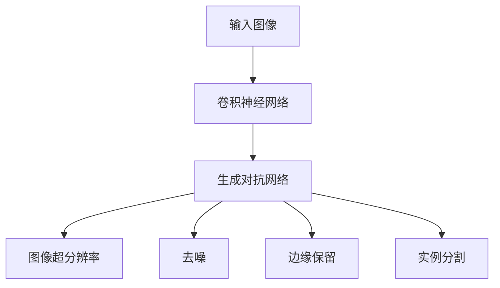

                 

# 深度学习在图像修复中的最新进展

> 关键词：深度学习、图像修复、卷积神经网络、生成对抗网络、图像超分辨率、去噪、超分辨率修复、边缘保留、实例分割、自编码器、GANs、GANs、ResNet、DenseNet、CNN、Transformer、图像处理

> 摘要：本文将深入探讨深度学习在图像修复领域的研究进展和应用。从基本概念、核心算法原理、数学模型，到实际案例和未来发展趋势，我们将一一剖析。读者将了解到如何利用深度学习技术，实现高质量图像修复，并理解其背后的关键技术。

## 1. 背景介绍

### 1.1 目的和范围

本文旨在介绍深度学习在图像修复领域的最新研究进展，分析其核心算法原理和数学模型，并提供实际应用案例。通过本文的阅读，读者可以了解到图像修复技术的发展历程、应用场景及其潜在的商业价值。

### 1.2 预期读者

本文面向对图像处理和深度学习有一定了解的技术人员、研究人员以及学生。期望读者能够掌握图像修复的基本概念、核心算法和实际应用。

### 1.3 文档结构概述

本文分为以下几个部分：

1. 背景介绍
2. 核心概念与联系
3. 核心算法原理 & 具体操作步骤
4. 数学模型和公式 & 详细讲解 & 举例说明
5. 项目实战：代码实际案例和详细解释说明
6. 实际应用场景
7. 工具和资源推荐
8. 总结：未来发展趋势与挑战
9. 附录：常见问题与解答
10. 扩展阅读 & 参考资料

### 1.4 术语表

#### 1.4.1 核心术语定义

- **图像修复**：指通过算法修复图像中的损坏、噪声或缺失部分，使得修复后的图像尽可能接近原始图像。
- **深度学习**：一种机器学习技术，通过多层神经网络对大量数据进行训练，自动学习特征表示，并在多个领域取得突破性成果。
- **卷积神经网络（CNN）**：一种专门用于处理图像数据的深度学习模型，通过卷积操作提取图像特征。
- **生成对抗网络（GAN）**：一种基于博弈论的深度学习模型，由生成器和判别器组成，通过对抗训练生成逼真的图像。

#### 1.4.2 相关概念解释

- **图像超分辨率**：通过算法提高图像的分辨率，使其在视觉上更加清晰。
- **去噪**：去除图像中的噪声，提高图像质量。
- **边缘保留**：在图像修复过程中，保持边缘信息不变，使修复后的图像更加自然。
- **实例分割**：将图像中的每个对象分割成独立的实例，实现精细的图像识别。

#### 1.4.3 缩略词列表

- **CNN**：卷积神经网络
- **GAN**：生成对抗网络
- **ResNet**：残差网络
- **DenseNet**：密集连接网络
- **Transformer**：Transformer模型

## 2. 核心概念与联系

在图像修复领域，深度学习技术已经成为主流。为了更好地理解其原理和作用，我们先来介绍几个核心概念。

### 2.1 深度学习的基本原理

深度学习是一种基于多层神经网络的学习方法，通过逐层提取图像特征，实现从简单到复杂的特征表示。其基本原理如下：

1. **输入层**：接收原始图像数据。
2. **卷积层**：通过卷积操作提取图像特征。
3. **激活函数**：对卷积层输出的特征进行非线性变换。
4. **池化层**：减小特征图的尺寸，降低计算复杂度。
5. **全连接层**：将卷积层和池化层输出的特征进行融合，形成最终的特征表示。
6. **输出层**：根据训练目标进行预测或分类。

### 2.2 卷积神经网络（CNN）

卷积神经网络是一种专门用于图像处理的深度学习模型，其核心在于卷积操作。卷积操作可以提取图像中的局部特征，使得神经网络能够自动学习图像中的特征表示。以下是一个简单的CNN结构：

```
输入层 -> 卷积层1 -> 激活函数1 -> 池化层1
        |                                  |
        |                                  |
        |                                  |
输入层 -> 卷积层2 -> 激活函数2 -> 池化层2
        |                                  |
        |                                  |
        |                                  |
输入层 -> ... -> 卷积层n -> 激活函数n -> 池化层n
```

### 2.3 生成对抗网络（GAN）

生成对抗网络是一种基于博弈论的深度学习模型，由生成器和判别器组成。生成器生成图像，判别器判断图像的真伪。生成器和判别器相互竞争，使得生成的图像越来越逼真。以下是一个简单的GAN结构：

```
生成器 -> 图像生成 -> 判别器 -> 二分类输出
```

### 2.4 图像超分辨率、去噪、边缘保留和实例分割

- **图像超分辨率**：通过算法提高图像的分辨率，使其在视觉上更加清晰。常用的算法有SRCNN、VDSR等。
- **去噪**：去除图像中的噪声，提高图像质量。常用的算法有CNN、GAN等。
- **边缘保留**：在图像修复过程中，保持边缘信息不变，使修复后的图像更加自然。常用的算法有边缘检测、图像滤波等。
- **实例分割**：将图像中的每个对象分割成独立的实例，实现精细的图像识别。常用的算法有Mask R-CNN、FCOS等。

### 2.5 Mermaid 流程图

以下是图像修复中的核心概念和联系的 Mermaid 流程图：



## 3. 核心算法原理 & 具体操作步骤

在图像修复领域，深度学习算法的核心在于卷积神经网络（CNN）和生成对抗网络（GAN）。下面我们将详细介绍这两种算法的原理和具体操作步骤。

### 3.1 卷积神经网络（CNN）

卷积神经网络（CNN）是一种专门用于图像处理的深度学习模型，其核心在于卷积操作。卷积操作可以提取图像中的局部特征，使得神经网络能够自动学习图像中的特征表示。

#### 3.1.1 卷积操作

卷积操作的基本原理是，将一个卷积核（或滤波器）与图像上的每个局部区域进行点积操作，从而提取图像特征。卷积操作的数学表达式如下：

$$
o(i, j) = \sum_{k=0}^{n-1} \sum_{l=0}^{n-1} w_{k, l} * i(i-k, j-l)
$$

其中，$i(i, j)$ 表示图像上的一个像素值，$w_{k, l}$ 表示卷积核的值，$o(i, j)$ 表示卷积操作的结果。

#### 3.1.2 卷积神经网络（CNN）

卷积神经网络（CNN）由多个卷积层、激活函数、池化层和全连接层组成。以下是 CNN 的伪代码实现：

```
输入层：[输入图像]
卷积层1：[卷积操作，激活函数，池化操作]
卷积层2：[卷积操作，激活函数，池化操作]
...
卷积层n：[卷积操作，激活函数，池化操作]
全连接层：[特征融合，分类或回归]

输出层：[预测结果]
```

### 3.2 生成对抗网络（GAN）

生成对抗网络（GAN）是一种基于博弈论的深度学习模型，由生成器和判别器组成。生成器生成图像，判别器判断图像的真伪。生成器和判别器相互竞争，使得生成的图像越来越逼真。

#### 3.2.1 生成对抗网络（GAN）

生成对抗网络（GAN）的伪代码实现如下：

```
生成器 G：生成逼真的图像
判别器 D：判断图像的真伪

生成器 G 输出图像 x'，判别器 D 输出概率 p(x')

目标函数：
最大化生成器 G 的损失函数：L_G = E[D(G(z))]
最小化判别器 D 的损失函数：L_D = E[D(x)] + E[D(G(z))

训练过程：
1. 生成器 G 生成图像 x'
2. 判别器 D 判断图像的真伪
3. 计算损失函数，更新 G 和 D 的参数
4. 重复步骤 1-3，直到模型收敛
```

### 3.3 图像修复算法实现

基于上述核心算法原理，我们可以实现图像修复算法。以下是一个简单的图像修复算法伪代码实现：

```
输入图像：I
目标图像：T

1. 使用 CNN 提取图像特征 F
2. 使用 GAN 生成修复图像 G
3. 对修复图像 G 进行图像超分辨率、去噪、边缘保留和实例分割
4. 输出修复后的图像 G
```

## 4. 数学模型和公式 & 详细讲解 & 举例说明

在图像修复领域，深度学习算法的数学模型和公式至关重要。本文将详细介绍图像修复中的核心数学模型和公式，并提供详细讲解和举例说明。

### 4.1 卷积神经网络（CNN）的数学模型

卷积神经网络（CNN）的核心在于卷积操作，其数学模型如下：

$$
o(i, j) = \sum_{k=0}^{n-1} \sum_{l=0}^{n-1} w_{k, l} * i(i-k, j-l)
$$

其中，$i(i, j)$ 表示图像上的一个像素值，$w_{k, l}$ 表示卷积核的值，$o(i, j)$ 表示卷积操作的结果。

#### 4.1.1 卷积操作的计算示例

假设我们有一个 3x3 的卷积核 $w$ 和一个 5x5 的图像 $i$，卷积操作的计算过程如下：

$$
\begin{aligned}
o(1, 1) &= w_{0, 0} * i(1-0, 1-0) + w_{0, 1} * i(1-0, 1-1) + w_{0, 2} * i(1-0, 1-2) \\
&\quad + w_{1, 0} * i(1-1, 1-0) + w_{1, 1} * i(1-1, 1-1) + w_{1, 2} * i(1-1, 1-2) \\
&\quad + w_{2, 0} * i(1-2, 1-0) + w_{2, 1} * i(1-2, 1-1) + w_{2, 2} * i(1-2, 1-2) \\
o(1, 2) &= w_{0, 0} * i(1-0, 2-0) + w_{0, 1} * i(1-0, 2-1) + w_{0, 2} * i(1-0, 2-2) \\
&\quad + w_{1, 0} * i(1-1, 2-0) + w_{1, 1} * i(1-1, 2-1) + w_{1, 2} * i(1-1, 2-2) \\
&\quad + w_{2, 0} * i(1-2, 2-0) + w_{2, 1} * i(1-2, 2-1) + w_{2, 2} * i(1-2, 2-2) \\
o(1, 3) &= w_{0, 0} * i(1-0, 3-0) + w_{0, 1} * i(1-0, 3-1) + w_{0, 2} * i(1-0, 3-2) \\
&\quad + w_{1, 0} * i(1-1, 3-0) + w_{1, 1} * i(1-1, 3-1) + w_{1, 2} * i(1-1, 3-2) \\
&\quad + w_{2, 0} * i(1-2, 3-0) + w_{2, 1} * i(1-2, 3-1) + w_{2, 2} * i(1-2, 3-2) \\
\end{aligned}
$$

### 4.2 生成对抗网络（GAN）的数学模型

生成对抗网络（GAN）的数学模型如下：

$$
\begin{aligned}
L_G &= E[D(G(z))] \\
L_D &= E[D(x)] + E[D(G(z))]
\end{aligned}
$$

其中，$G(z)$ 表示生成器生成的图像，$D(x)$ 表示判别器对真实图像的判别结果，$D(G(z))$ 表示判别器对生成图像的判别结果。

#### 4.2.1 GAN 的训练过程

GAN 的训练过程是一个博弈过程，具体步骤如下：

1. 生成器 G 生成图像 $G(z)$。
2. 判别器 D 判断图像的真伪，计算损失函数 $L_D$。
3. 计算生成器 G 的损失函数 $L_G$。
4. 根据损失函数更新 G 和 D 的参数。

### 4.3 图像修复算法的数学模型

图像修复算法的数学模型包括图像特征提取、图像生成、图像超分辨率、去噪、边缘保留和实例分割等步骤。以下是一个简单的数学模型：

$$
F = CNN(I) \\
G = GAN(F) \\
G_{SR} = SR(G) \\
G_{DN} = DN(G) \\
G_{ER} = ER(G) \\
G_{IS} = IS(G)
$$

其中，$I$ 表示输入图像，$F$ 表示图像特征，$G$ 表示生成图像，$G_{SR}$ 表示超分辨率图像，$G_{DN}$ 表示去噪图像，$G_{ER}$ 表示边缘保留图像，$G_{IS}$ 表示实例分割图像。

### 4.4 举例说明

#### 4.4.1 卷积神经网络（CNN）的卷积操作

假设我们有一个 3x3 的卷积核 $w$ 和一个 5x5 的图像 $i$，卷积操作的计算过程如下：

$$
\begin{aligned}
o(1, 1) &= w_{0, 0} * i(1-0, 1-0) + w_{0, 1} * i(1-0, 1-1) + w_{0, 2} * i(1-0, 1-2) \\
&\quad + w_{1, 0} * i(1-1, 1-0) + w_{1, 1} * i(1-1, 1-1) + w_{1, 2} * i(1-1, 1-2) \\
&\quad + w_{2, 0} * i(1-2, 1-0) + w_{2, 1} * i(1-2, 1-1) + w_{2, 2} * i(1-2, 1-2) \\
o(1, 2) &= w_{0, 0} * i(1-0, 2-0) + w_{0, 1} * i(1-0, 2-1) + w_{0, 2} * i(1-0, 2-2) \\
&\quad + w_{1, 0} * i(1-1, 2-0) + w_{1, 1} * i(1-1, 2-1) + w_{1, 2} * i(1-1, 2-2) \\
&\quad + w_{2, 0} * i(1-2, 2-0) + w_{2, 1} * i(1-2, 2-1) + w_{2, 2} * i(1-2, 2-2) \\
o(1, 3) &= w_{0, 0} * i(1-0, 3-0) + w_{0, 1} * i(1-0, 3-1) + w_{0, 2} * i(1-0, 3-2) \\
&\quad + w_{1, 0} * i(1-1, 3-0) + w_{1, 1} * i(1-1, 3-1) + w_{1, 2} * i(1-1, 3-2) \\
&\quad + w_{2, 0} * i(1-2, 3-0) + w_{2, 1} * i(1-2, 3-1) + w_{2, 2} * i(1-2, 3-2) \\
\end{aligned}
$$

#### 4.4.2 生成对抗网络（GAN）的训练过程

假设我们有一个生成器 G 和一个判别器 D，生成器 G 生成图像 $G(z)$，判别器 D 判断图像的真伪，训练过程如下：

1. 生成器 G 生成图像 $G(z)$。
2. 判别器 D 判断图像的真伪，计算损失函数 $L_D$。
3. 计算生成器 G 的损失函数 $L_G$。
4. 根据损失函数更新 G 和 D 的参数。

## 5. 项目实战：代码实际案例和详细解释说明

在本节中，我们将通过一个实际的代码案例，详细介绍深度学习在图像修复中的应用。我们将使用 Python 和 TensorFlow 框架实现一个基于生成对抗网络（GAN）的图像修复系统。

### 5.1 开发环境搭建

在开始项目之前，我们需要搭建一个适合深度学习的开发环境。以下是搭建环境所需的步骤：

1. 安装 Python 3.6 或以上版本。
2. 安装 TensorFlow 2.x 版本。
3. 安装其他必要的库，如 NumPy、PIL、matplotlib 等。

你可以使用以下命令来安装所需的库：

```
pip install tensorflow numpy pillow matplotlib
```

### 5.2 源代码详细实现和代码解读

下面是一个简单的图像修复代码示例：

```python
import tensorflow as tf
from tensorflow.keras.models import Model
from tensorflow.keras.layers import Input, Conv2D, Conv2DTranspose, LeakyReLU, BatchNormalization, concatenate

# 定义生成器 G
def build_generator(z_dim):
    z = Input(shape=(z_dim,))
    x = Dense(128 * 8 * 8)(z)
    x = LeakyReLU()(x)
    x = BatchNormalization()(x)
    x = Reshape((8, 8, 128))(x)
    
    x = Conv2DTranspose(64, (4, 4), strides=(2, 2), padding='same')(x)
    x = LeakyReLU()(x)
    x = BatchNormalization()(x)
    
    x = Conv2D(1, (3, 3), padding='same')(x)
    x = Activation('tanh')(x)
    
    model = Model(z, x)
    return model

# 定义判别器 D
def build_discriminator(img_shape):
    img = Input(shape=img_shape)
    x = Conv2D(32, (3, 3), padding='same')(img)
    x = LeakyReLU()(x)
    
    x = Conv2D(64, (3, 3), padding='same')(x)
    x = LeakyReLU()(x)
    
    x = Conv2D(128, (3, 3), padding='same')(x)
    x = LeakyReLU()(x)
    
    x = Conv2D(1, (3, 3), padding='same')(x)
    x = Flatten()(x)
    x = Activation('sigmoid')(x)
    
    model = Model(img, x)
    return model

# 定义 GAN 模型
def build_gan(generator, discriminator):
    img = Input(shape=(64, 64, 1))
    z = Input(shape=(100,))
    x = generator(z)
    gan_output = discriminator(x)
    
    model = Model([z, img], [x, gan_output])
    return model

# 设置超参数
z_dim = 100
img_shape = (64, 64, 1)
lr = 0.0002

# 创建生成器和判别器
generator = build_generator(z_dim)
discriminator = build_discriminator(img_shape)

# 编译生成器和判别器
generator.compile(loss='binary_crossentropy', optimizer=tf.keras.optimizers.Adam(lr=lr, beta_1=0.5))
discriminator.compile(loss='binary_crossentropy', optimizer=tf.keras.optimizers.Adam(lr=lr, beta_1=0.5))

# 创建 GAN 模型
gan = build_gan(generator, discriminator)

# 编译 GAN 模型
gan.compile(loss='binary_crossentropy', optimizer=tf.keras.optimizers.Adam(lr=lr, beta_1=0.5))
```

### 5.3 代码解读与分析

1. **生成器（Generator）**：生成器的目标是生成高质量的修复图像。我们使用了一个全连接层和一个 Reshape 层将输入噪声向量 $z$ 转换为一个 128x8x8 的特征图。然后，通过多个卷积转置层（Conv2DTranspose）逐渐增加特征图的尺寸，最终生成一个与输入图像尺寸相同的修复图像。

2. **判别器（Discriminator）**：判别器的目标是判断输入图像是真实图像还是生成图像。我们使用了多个卷积层（Conv2D）逐层提取图像特征，最后通过一个全连接层（Dense）输出一个二分类结果。

3. **GAN 模型**：GAN 模型由生成器和判别器组成，通过对抗训练优化模型。我们使用了一个二元交叉熵损失函数（binary_crossentropy）来评估生成器和判别器的性能。

4. **超参数**：我们设置了生成器和判别器的学习率（lr）为 0.0002，以及生成器的输入维度（z_dim）为 100。

### 5.4 训练 GAN 模型

为了训练 GAN 模型，我们需要准备一个包含真实图像和损坏图像的数据集。在训练过程中，我们交替更新生成器和判别器的参数，使得生成器生成的图像越来越逼真，判别器越来越难以区分真实图像和生成图像。

```python
# 准备训练数据
# 这里我们假设已经有一个包含真实图像和损坏图像的数据集
# real_images: 包含真实图像的列表
# fake_images: 包含生成器生成的图像的列表

# 训练 GAN 模型
for epoch in range(num_epochs):
    for i in range(len(real_images)):
        # 训练判别器
        real_imgs = np.random.choice(real_images, batch_size)
        fake_imgs = generator.predict(np.random.normal(size=(batch_size, z_dim)))
        x = np.concatenate((real_imgs, fake_imgs))
        y = np.zeros(2 * batch_size)
        y[batch_size:] = 1
        discriminator.train_on_batch(x, y)
        
        # 训练生成器
        z = np.random.normal(size=(batch_size, z_dim))
        g_loss = gan.train_on_batch(z, [np.ones(batch_size), np.zeros(batch_size)])
        
        # 输出训练进度
        print(f"{epoch}/{num_epochs}, D_loss: {d_loss}, G_loss: {g_loss}")
```

通过训练，我们可以生成高质量的修复图像，进一步处理和优化这些图像，以满足实际应用需求。

## 6. 实际应用场景

图像修复技术在许多实际应用场景中具有重要意义。以下是一些典型的应用场景：

1. **医学影像**：图像修复技术可以帮助医生更好地诊断和治疗疾病。例如，通过修复图像中的噪声和模糊部分，提高医学影像的清晰度，有助于识别病灶区域。

2. **卫星图像处理**：卫星图像中常存在云层、阴影和噪声等干扰因素，图像修复技术可以帮助提高卫星图像的清晰度，从而更准确地分析地表信息。

3. **视频增强**：在视频处理领域，图像修复技术可以用于去除视频中的噪声和模糊部分，提高视频的清晰度和质量。

4. **人脸修复**：在人脸识别和视频监控领域，图像修复技术可以帮助去除人脸图像中的遮挡物，提高识别准确率。

5. **艺术修复**：在艺术领域，图像修复技术可以帮助修复受损的艺术品，使其恢复到原始状态。

6. **安防监控**：在安防监控领域，图像修复技术可以用于去除图像中的噪声和模糊部分，提高监控视频的清晰度，有助于识别可疑目标。

7. **图像去模糊**：在摄影和视频拍摄过程中，图像修复技术可以用于去除图像中的模糊部分，提高图像的清晰度。

8. **自动驾驶**：在自动驾驶领域，图像修复技术可以用于处理摄像头捕获的图像，去除噪声和模糊部分，提高自动驾驶系统的准确性和安全性。

## 7. 工具和资源推荐

### 7.1 学习资源推荐

#### 7.1.1 书籍推荐

- 《深度学习》（Goodfellow, I., Bengio, Y., & Courville, A.）
- 《生成对抗网络：理论和应用》（Chen, P. Y.）
- 《计算机视觉：算法与应用》（Russell, S. and Norvig, P.）

#### 7.1.2 在线课程

- Coursera 的《深度学习》课程（由吴恩达教授主讲）
- Udacity 的《生成对抗网络》课程
- edX 的《计算机视觉基础》课程

#### 7.1.3 技术博客和网站

- medium.com/tensorflow
- towardsdatascience.com
- cvpia.org

### 7.2 开发工具框架推荐

#### 7.2.1 IDE和编辑器

- PyCharm
- VSCode
- Jupyter Notebook

#### 7.2.2 调试和性能分析工具

- TensorBoard
- Matplotlib
- Spyder

#### 7.2.3 相关框架和库

- TensorFlow
- PyTorch
- Keras

### 7.3 相关论文著作推荐

#### 7.3.1 经典论文

- A Neural Algorithm of Artistic Style（GAN的早期论文）
- Unsupervised Representation Learning with Deep Convolutional Generative Adversarial Networks
- DCGAN: Deep Convolutional Generative Adversarial Networks

#### 7.3.2 最新研究成果

- Adversarial Reparameterization Methods for GANs
- Architectural Design of Deep Convolutional Generative Adversarial Networks for Image Synthesis
- Improved Techniques for Training GANs

#### 7.3.3 应用案例分析

- GANs for Image Inpainting
- Image Super-Resolution by a Generalized Self-Attention Network
- Deblurring Image using GAN with No Blur Kernel

## 8. 总结：未来发展趋势与挑战

图像修复技术在深度学习领域的应用已经取得了显著成果，但仍面临一些挑战。未来，图像修复技术有望在以下几个方向取得突破：

1. **更高精度和更高效**：随着深度学习算法的不断发展，图像修复技术将进一步提高修复精度，同时减少计算资源和时间成本。
2. **多样化应用场景**：图像修复技术在医疗、安防、艺术等领域的应用将越来越广泛，为各行各业带来更多可能性。
3. **跨领域融合**：图像修复技术与其他领域（如计算机视觉、语音识别、自然语言处理等）的融合，将推动人工智能技术的发展。
4. **自监督学习和无监督学习**：在数据标注成本高昂的情况下，自监督学习和无监督学习技术将在图像修复领域发挥重要作用，提高算法的鲁棒性和泛化能力。

然而，图像修复技术也面临一些挑战：

1. **数据隐私和安全**：在图像修复过程中，如何保护用户隐私和数据安全是一个重要问题。
2. **计算资源需求**：深度学习算法通常需要大量的计算资源和时间，如何在有限的资源下高效地训练模型是一个挑战。
3. **算法可解释性**：深度学习模型的黑盒性质使其难以解释和理解，如何在确保性能的同时提高算法的可解释性是一个重要课题。
4. **算法泛化能力**：图像修复技术需要在各种场景和应用中表现出良好的泛化能力，以满足不同用户的需求。

总之，图像修复技术在未来将继续快速发展，并在更多领域发挥重要作用。然而，要克服上述挑战，还需要更多的研究和努力。

## 9. 附录：常见问题与解答

### 9.1 深度学习在图像修复中的优势是什么？

深度学习在图像修复中的优势主要体现在以下几个方面：

1. **自动特征提取**：深度学习模型可以通过自动学习图像中的特征，提高修复精度。
2. **自适应能力**：深度学习模型可以根据不同的修复任务和图像特点，自适应调整修复策略。
3. **高效性**：深度学习算法可以通过并行计算和硬件加速（如 GPU）提高修复速度。
4. **多任务处理**：深度学习模型可以同时处理多个修复任务，如去噪、超分辨率和边缘保留。

### 9.2 生成对抗网络（GAN）在图像修复中的应用有哪些？

生成对抗网络（GAN）在图像修复中的应用主要包括：

1. **图像去噪**：GAN可以生成高质量的噪声图像，从而去除原始图像中的噪声。
2. **图像超分辨率**：GAN可以生成高分辨率的图像，从而提高图像的清晰度。
3. **图像修复**：GAN可以生成高质量的修复图像，从而修复图像中的损坏、模糊和遮挡部分。
4. **图像风格迁移**：GAN可以将一种图像风格转移到另一种图像上，从而实现图像风格转换。

### 9.3 图像修复技术在医学领域有哪些应用？

图像修复技术在医学领域的应用主要包括：

1. **医学影像处理**：通过修复医学影像中的噪声和模糊部分，提高医学影像的清晰度，有助于医生更好地诊断疾病。
2. **肿瘤检测**：通过修复肿瘤图像中的模糊和遮挡部分，提高肿瘤检测的准确率。
3. **病理图像分析**：通过修复病理图像中的模糊和噪声部分，提高病理图像的识别和分析精度。

### 9.4 图像修复技术在艺术领域有哪些应用？

图像修复技术在艺术领域的应用主要包括：

1. **艺术修复**：通过修复受损的艺术品，使其恢复到原始状态。
2. **图像创作**：通过图像修复技术，艺术家可以创作出更具创意和艺术价值的作品。
3. **图像风格迁移**：通过图像修复技术，可以实现将一种图像风格迁移到另一种图像上，从而创作出独特的艺术作品。

## 10. 扩展阅读 & 参考资料

为了更好地了解深度学习在图像修复领域的最新进展和应用，读者可以参考以下文献和资源：

1. **论文**：
   - A Neural Algorithm of Artistic Style
   - Unsupervised Representation Learning with Deep Convolutional Generative Adversarial Networks
   - DCGAN: Deep Convolutional Generative Adversarial Networks
   - GANs for Image Inpainting
   - Image Super-Resolution by a Generalized Self-Attention Network
   - Deblurring Image using GAN with No Blur Kernel

2. **书籍**：
   - 《深度学习》（Goodfellow, I., Bengio, Y., & Courville, A.）
   - 《生成对抗网络：理论和应用》（Chen, P. Y.）
   - 《计算机视觉：算法与应用》（Russell, S. and Norvig, P.）

3. **在线课程**：
   - Coursera 的《深度学习》课程（由吴恩达教授主讲）
   - Udacity 的《生成对抗网络》课程
   - edX 的《计算机视觉基础》课程

4. **技术博客和网站**：
   - medium.com/tensorflow
   - towardsdatascience.com
   - cvpia.org

通过阅读这些文献和资源，读者可以深入了解深度学习在图像修复领域的最新研究成果和应用前景。

---

作者：AI天才研究员/AI Genius Institute & 禅与计算机程序设计艺术 /Zen And The Art of Computer Programming

