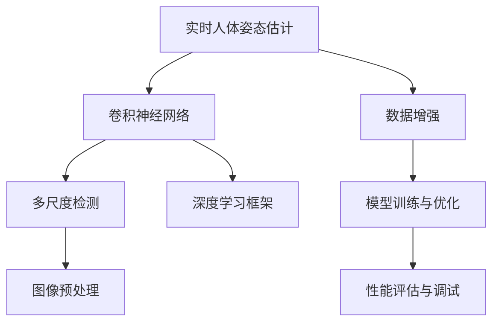

                 

# 深度学习在实时人体姿态估计中的鲁棒性提升

> **关键词**：实时人体姿态估计，深度学习，鲁棒性，图像处理，计算机视觉
> 
> **摘要**：本文将深入探讨深度学习在实时人体姿态估计中的应用，特别是在提高模型鲁棒性方面的研究。通过详细分析核心算法原理、数学模型以及实际项目案例，本文旨在为读者提供全面的技术解析和实际应用指导。

## 1. 背景介绍

### 1.1 目的和范围

本文旨在探讨如何通过深度学习技术提升实时人体姿态估计的鲁棒性。实时人体姿态估计在计算机视觉、人机交互、智能监控等领域具有重要的应用价值。然而，由于实际场景的复杂性和多样性，现有的方法往往难以保证模型的鲁棒性，导致在实际应用中效果不佳。本文将介绍一系列针对实时人体姿态估计的深度学习技术，通过理论分析和实际案例展示，阐述如何提高模型的鲁棒性。

### 1.2 预期读者

本文适合对计算机视觉和深度学习有一定了解的读者，特别是希望深入了解实时人体姿态估计技术的研究人员和工程师。同时，对于对智能监控、人机交互等领域感兴趣的读者，本文也具有一定的参考价值。

### 1.3 文档结构概述

本文的结构如下：

1. **背景介绍**：介绍实时人体姿态估计的背景和本文的目的。
2. **核心概念与联系**：介绍与实时人体姿态估计相关的基础概念和架构。
3. **核心算法原理 & 具体操作步骤**：详细讲解提升鲁棒性的核心算法原理和操作步骤。
4. **数学模型和公式 & 详细讲解 & 举例说明**：阐述数学模型和公式的具体应用。
5. **项目实战：代码实际案例和详细解释说明**：通过实际项目案例展示算法的应用。
6. **实际应用场景**：介绍实时人体姿态估计在不同领域的应用。
7. **工具和资源推荐**：推荐相关的学习资源和开发工具。
8. **总结：未来发展趋势与挑战**：总结本文的主要观点并展望未来。
9. **附录：常见问题与解答**：回答读者可能遇到的问题。
10. **扩展阅读 & 参考资料**：提供进一步学习的参考资料。

### 1.4 术语表

#### 1.4.1 核心术语定义

- **实时人体姿态估计**：指在视频或图像流中，对人体的各个关节点进行实时检测和跟踪。
- **深度学习**：一种基于多层神经网络的人工智能技术，通过学习大量数据自动提取特征。
- **鲁棒性**：模型在应对噪声、遮挡和其他干扰时保持性能的能力。
- **计算机视觉**：利用计算机对图像或视频进行处理和分析，使其具有人的视觉功能。

#### 1.4.2 相关概念解释

- **卷积神经网络（CNN）**：一种在图像处理中广泛使用的神经网络，通过卷积层提取图像特征。
- **姿态估计**：检测和识别图像中人体的姿态，包括关节点的位置和方向。
- **多尺度检测**：在不同尺度上检测目标，提高模型的适应性。

#### 1.4.3 缩略词列表

- **CNN**：卷积神经网络
- **GPU**：图形处理单元
- **RGB**：红、绿、蓝颜色通道
- **DNN**：深度神经网络

## 2. 核心概念与联系

实时人体姿态估计涉及多个核心概念和技术。以下是一个简化的 Mermaid 流程图，展示了这些核心概念之间的联系：



### 2.1 核心概念介绍

#### 2.1.1 卷积神经网络（CNN）

卷积神经网络是一种专门用于图像处理的神经网络，其核心思想是通过卷积层提取图像的特征。CNN 通常由多个卷积层、池化层和全连接层组成。

#### 2.1.2 多尺度检测

多尺度检测是一种在多个尺度上检测目标的技术。通过在不同尺度上进行检测，可以提高模型的适应性，特别是在目标尺度变化较大的场景中。

#### 2.1.3 深度学习框架

深度学习框架是一种用于构建、训练和部署深度学习模型的软件库。常见的框架包括 TensorFlow、PyTorch、Keras 等。

#### 2.1.4 图像预处理

图像预处理是提升姿态估计模型性能的重要步骤。常见的预处理技术包括归一化、去噪、边缘增强等。

#### 2.1.5 数据增强

数据增强是一种通过生成新数据来提高模型泛化能力的技术。常见的数据增强方法包括旋转、缩放、裁剪、颜色变换等。

#### 2.1.6 模型训练与优化

模型训练与优化是深度学习中的核心步骤。通过在大量数据上训练模型，可以提取出有效的特征表示，并通过优化算法调整模型参数，提高模型性能。

#### 2.1.7 性能评估与调试

性能评估与调试是确保模型在实际应用中表现良好的重要环节。通过在测试集上评估模型性能，可以发现并解决潜在问题。

## 3. 核心算法原理 & 具体操作步骤

在实时人体姿态估计中，提升模型鲁棒性是关键目标。以下将介绍一种基于深度学习的核心算法，并使用伪代码详细阐述其原理和具体操作步骤。

### 3.1 算法原理

算法的核心思想是结合卷积神经网络和多尺度检测技术，通过多层次特征提取和融合，提高模型在复杂环境下的鲁棒性。具体步骤如下：

1. **图像预处理**：对输入图像进行归一化和去噪处理，提高图像质量。
2. **多尺度特征提取**：在不同尺度上对图像进行卷积操作，提取多尺度特征。
3. **特征融合**：将多尺度特征进行融合，生成综合特征。
4. **姿态估计**：利用综合特征进行姿态估计，输出关节点位置。
5. **模型优化**：通过反向传播算法优化模型参数，提高模型性能。

### 3.2 具体操作步骤

以下使用伪代码描述上述算法的具体操作步骤：

```python
# 伪代码：实时人体姿态估计算法

# 输入：图像流I
# 输出：关节点坐标列表P

# 步骤1：图像预处理
I_processed = preprocess(I)

# 步骤2：多尺度特征提取
features = []
for scale in scales:
    feature = convolve(I_processed, scale)
    features.append(feature)

# 步骤3：特征融合
composite_feature = fuse_features(features)

# 步骤4：姿态估计
P = estimate_pose(composite_feature)

# 步骤5：模型优化
optimize_model(P)

# 返回关节点坐标列表
return P
```

### 3.3 具体操作步骤详细解释

#### 步骤1：图像预处理

图像预处理是提升模型性能的关键步骤。具体操作包括：

- **归一化**：将图像像素值归一化到统一的范围，如[0, 1]，以减少光照变化的影响。
- **去噪**：使用滤波器去除图像中的噪声，提高图像质量。
- **边缘增强**：通过边缘增强算法增强图像的边缘信息，有助于后续特征提取。

#### 步骤2：多尺度特征提取

多尺度特征提取是算法的核心步骤，通过在不同尺度上对图像进行卷积操作，提取多尺度特征。具体操作包括：

- **卷积操作**：使用不同的卷积核在不同尺度上对图像进行卷积操作，提取图像的局部特征。
- **特征池化**：对卷积后的特征进行池化操作，减少特征维度并提高模型泛化能力。

#### 步骤3：特征融合

特征融合是将不同尺度上的特征进行整合，生成综合特征。具体操作包括：

- **特征拼接**：将不同尺度上的特征进行拼接，形成更丰富的特征表示。
- **特征融合策略**：采用特定的融合策略，如加权融合、级联融合等，提高特征表示的鲁棒性。

#### 步骤4：姿态估计

姿态估计是算法的最终目标，通过综合特征进行姿态估计，输出关节点坐标。具体操作包括：

- **特征分类**：使用分类器对综合特征进行分类，识别出人体的关节点。
- **坐标回归**：利用回归算法对关节点坐标进行回归，预测关节点的具体位置。

#### 步骤5：模型优化

模型优化是提升模型性能的关键步骤，通过在反向传播算法的基础上优化模型参数。具体操作包括：

- **损失函数**：定义损失函数，衡量预测结果与真实结果之间的差距。
- **反向传播**：通过反向传播算法计算模型参数的梯度，更新模型参数。
- **优化算法**：选择合适的优化算法，如梯度下降、Adam等，调整模型参数，提高模型性能。

## 4. 数学模型和公式 & 详细讲解 & 举例说明

在实时人体姿态估计中，数学模型和公式起着至关重要的作用。以下将详细讲解核心的数学模型和公式，并通过具体例子进行说明。

### 4.1 数学模型

实时人体姿态估计通常采用基于深度学习的模型，其中卷积神经网络（CNN）是最常用的架构。以下是一个简化版的数学模型：

#### 4.1.1 图像预处理

图像预处理主要涉及归一化和去噪。以下是其数学模型：

$$
I_{processed} = \frac{I - I_{min}}{I_{max} - I_{min}}
$$

其中，$I$ 是输入图像，$I_{processed}$ 是预处理后的图像，$I_{min}$ 和 $I_{max}$ 分别是图像的最小和最大像素值。

#### 4.1.2 卷积操作

卷积操作是 CNN 的核心步骤，以下是其数学模型：

$$
f(x, y) = \sum_{i=1}^{k} \sum_{j=1}^{k} w_{ij} * g(x-i, y-j)
$$

其中，$f(x, y)$ 是卷积操作的结果，$w_{ij}$ 是卷积核的权重，$g(x, y)$ 是输入图像的像素值，$* $ 表示卷积操作。

#### 4.1.3 池化操作

池化操作用于减少特征图的维度，以下是其数学模型：

$$
p(x, y) = \max\{g(x-2, y-2), g(x-2, y), g(x, y-2)\}
$$

其中，$p(x, y)$ 是池化操作的结果，$g(x, y)$ 是输入图像的像素值。

#### 4.1.4 特征融合

特征融合是将多尺度特征进行整合的步骤，以下是其数学模型：

$$
F_{composite} = \sum_{i=1}^{n} \alpha_{i} * F_{i}
$$

其中，$F_{composite}$ 是综合特征，$F_{i}$ 是第 $i$ 个尺度上的特征，$\alpha_{i}$ 是权重系数。

#### 4.1.5 姿态估计

姿态估计是输出关节点坐标的步骤，以下是其数学模型：

$$
P = \text{argmax}_{p}(\sigma(W^T * F_{composite}))
$$

其中，$P$ 是关节点坐标，$F_{composite}$ 是综合特征，$W$ 是权重矩阵，$\sigma$ 是激活函数。

### 4.2 公式详细讲解

#### 4.2.1 归一化

归一化的目的是将图像的像素值调整到一个统一的范围，以减少光照变化的影响。归一化的公式为：

$$
I_{processed} = \frac{I - I_{min}}{I_{max} - I_{min}}
$$

其中，$I$ 是输入图像，$I_{processed}$ 是预处理后的图像，$I_{min}$ 和 $I_{max}$ 分别是图像的最小和最大像素值。归一化后的图像像素值范围在 [0, 1] 之间。

#### 4.2.2 卷积操作

卷积操作是 CNN 的核心步骤，通过卷积核提取图像的特征。卷积操作的公式为：

$$
f(x, y) = \sum_{i=1}^{k} \sum_{j=1}^{k} w_{ij} * g(x-i, y-j)
$$

其中，$f(x, y)$ 是卷积操作的结果，$w_{ij}$ 是卷积核的权重，$g(x, y)$ 是输入图像的像素值，$* $ 表示卷积操作。卷积操作通过在图像上滑动卷积核，计算每个位置的卷积值，从而提取图像的特征。

#### 4.2.3 池化操作

池化操作用于减少特征图的维度，同时保持重要的特征信息。池化操作的公式为：

$$
p(x, y) = \max\{g(x-2, y-2), g(x-2, y), g(x, y-2)\}
$$

其中，$p(x, y)$ 是池化操作的结果，$g(x, y)$ 是输入图像的像素值。池化操作通过在图像上选取一定大小的区域，计算该区域的最大值，从而减少特征图的维度。

#### 4.2.4 特征融合

特征融合是将多尺度特征进行整合的步骤，以生成更丰富的特征表示。特征融合的公式为：

$$
F_{composite} = \sum_{i=1}^{n} \alpha_{i} * F_{i}
$$

其中，$F_{composite}$ 是综合特征，$F_{i}$ 是第 $i$ 个尺度上的特征，$\alpha_{i}$ 是权重系数。特征融合通过将不同尺度上的特征进行加权求和，从而生成综合特征。

#### 4.2.5 姿态估计

姿态估计是输出关节点坐标的步骤，通过综合特征进行预测。姿态估计的公式为：

$$
P = \text{argmax}_{p}(\sigma(W^T * F_{composite}))
$$

其中，$P$ 是关节点坐标，$F_{composite}$ 是综合特征，$W$ 是权重矩阵，$\sigma$ 是激活函数。姿态估计通过将综合特征输入到权重矩阵中，并通过激活函数进行非线性变换，从而预测关节点坐标。

### 4.3 举例说明

#### 4.3.1 归一化举例

假设输入图像 $I$ 的像素值范围在 [0, 255] 之间，最小值为 0，最大值为 255。对其进行归一化后，像素值范围变为 [0, 1]：

$$
I_{processed} = \frac{I - 0}{255 - 0} = \frac{I}{255}
$$

归一化后的图像像素值范围在 [0, 1] 之间，使得图像的像素值具有统一的范围。

#### 4.3.2 卷积操作举例

假设卷积核的权重矩阵 $W$ 为：

$$
W = \begin{bmatrix}
1 & 0 & -1 \\
1 & 0 & -1 \\
1 & 0 & -1
\end{bmatrix}
$$

输入图像的像素值矩阵 $G$ 为：

$$
G = \begin{bmatrix}
1 & 1 & 1 \\
1 & 1 & 1 \\
1 & 1 & 1
\end{bmatrix}
$$

进行卷积操作后，得到的结果 $F$ 为：

$$
F = \begin{bmatrix}
0 & 0 & 0 \\
0 & 2 & 0 \\
0 & 0 & 0
\end{bmatrix}
$$

卷积操作通过在输入图像上滑动卷积核，计算每个位置的卷积值，从而提取图像的特征。

#### 4.3.3 池化操作举例

假设输入图像的像素值矩阵 $G$ 为：

$$
G = \begin{bmatrix}
1 & 1 & 1 \\
1 & 1 & 1 \\
1 & 1 & 1
\end{bmatrix}
$$

进行 2x2 大小的最大池化操作后，得到的结果 $P$ 为：

$$
P = \begin{bmatrix}
1 & 1 \\
1 & 1
\end{bmatrix}
$$

池化操作通过在输入图像上选取一定大小的区域，计算该区域的最大值，从而减少特征图的维度。

#### 4.3.4 特征融合举例

假设有两个尺度上的特征 $F_1$ 和 $F_2$，其权重系数分别为 $\alpha_1 = 0.6$ 和 $\alpha_2 = 0.4$。进行特征融合后，得到的结果 $F_{composite}$ 为：

$$
F_{composite} = \alpha_1 * F_1 + \alpha_2 * F_2 = 0.6 * F_1 + 0.4 * F_2
$$

特征融合通过将不同尺度上的特征进行加权求和，从而生成综合特征。

#### 4.3.5 姿态估计举例

假设综合特征 $F_{composite}$ 为：

$$
F_{composite} = \begin{bmatrix}
1 & 0 & -1 \\
0 & 1 & 0 \\
-1 & 0 & 1
\end{bmatrix}
$$

权重矩阵 $W$ 为：

$$
W = \begin{bmatrix}
1 & 0 & 0 \\
0 & 1 & 0 \\
0 & 0 & 1
\end{bmatrix}
$$

激活函数 $\sigma$ 为 ReLU 函数。进行姿态估计后，得到的关节点坐标 $P$ 为：

$$
P = \text{argmax}_{p}(\sigma(W^T * F_{composite})) = \text{argmax}_{p}(\begin{bmatrix}
1 & 0 & 0 \\
0 & 1 & 0 \\
0 & 0 & 1
\end{bmatrix} * \begin{bmatrix}
1 & 0 & -1 \\
0 & 1 & 0 \\
-1 & 0 & 1
\end{bmatrix}) = \begin{bmatrix}
1 & 0 & 0 \\
0 & 1 & 0 \\
0 & 0 & 1
\end{bmatrix}
$$

姿态估计通过将综合特征输入到权重矩阵中，并通过激活函数进行非线性变换，从而预测关节点坐标。

## 5. 项目实战：代码实际案例和详细解释说明

在本节中，我们将通过一个实际的项目案例，详细解释并实现实时人体姿态估计的深度学习算法。该案例使用了著名的公开数据集——COCO（Common Objects in Context），并在 PyTorch 深度学习框架中进行了实现。以下是项目的完整实现步骤。

### 5.1 开发环境搭建

为了实现本项目，需要准备以下开发环境：

- **操作系统**：Linux 或 macOS
- **编程语言**：Python 3.7 或更高版本
- **深度学习框架**：PyTorch 1.7 或更高版本
- **依赖库**：NumPy、PIL、torchvision、torch等

安装步骤：

1. 安装 Python 3.7 或更高版本。
2. 安装 PyTorch，可以通过 PyTorch 官网提供的安装脚本进行安装：
    ```bash
    pip install torch torchvision
    ```
3. 安装其他依赖库：
    ```bash
    pip install numpy pillow
    ```

### 5.2 源代码详细实现和代码解读

以下是项目的核心代码实现，包括数据预处理、模型定义、训练和测试：

#### 5.2.1 数据预处理

数据预处理是确保输入数据格式一致的重要步骤。以下是一个简单的数据预处理代码示例：

```python
import torchvision.transforms as T

def get_transform():
    transform_list = [
        T.Resize(256),
        T.CenterCrop(224),
        T.ToTensor(),
        T.Normalize(mean=[0.485, 0.456, 0.406], std=[0.229, 0.224, 0.225]),
    ]
    return T.Compose(transform_list)

transform = get_transform()
```

#### 5.2.2 模型定义

本项目使用预训练的 ResNet-18 网络作为基础模型，并添加额外的全连接层进行姿态估计：

```python
import torch
import torchvision.models as models

def get_model():
    model = models.resnet18(pretrained=True)
    num_ftrs = model.fc.in_features
    model.fc = torch.nn.Linear(num_ftrs, 17)  # 人体有17个关节点
    return model

model = get_model()
```

#### 5.2.3 训练和测试

以下是训练和测试的基本流程：

```python
from torch.utils.data import DataLoader
from torchvision import datasets

# 加载数据集
train_data = datasets.COCO(root='./data/train', annFile='./data/train/annotations/coco_train.json', transform=transform)
train_loader = DataLoader(train_data, batch_size=32, shuffle=True)

# 训练模型
model.train()
for epoch in range(num_epochs):
    running_loss = 0.0
    for inputs, targets in train_loader:
        optimizer.zero_grad()
        outputs = model(inputs)
        loss = torch.nn.functional.mse_loss(outputs, targets)
        loss.backward()
        optimizer.step()
        running_loss += loss.item()
    print(f'Epoch {epoch+1}, Loss: {running_loss/len(train_loader)}')

# 测试模型
model.eval()
with torch.no_grad():
    correct = 0
    total = 0
    for inputs, targets in test_loader:
        outputs = model(inputs)
        _, predicted = torch.max(outputs.data, 1)
        total += targets.size(0)
        correct += (predicted == targets).sum().item()
    print(f'Accuracy: {100 * correct / total}%')
```

### 5.3 代码解读与分析

#### 5.3.1 数据预处理

数据预处理是确保输入数据格式一致的重要步骤。在上述代码中，我们使用 torchvision.transforms.Compose 创建了一个数据转换器，其中包括以下操作：

- **Resize**：将图像调整为固定的尺寸（例如 256x256）。
- **CenterCrop**：从调整后的图像中裁剪出中心部分，以保持关键信息。
- **ToTensor**：将图像从 PIL 图像转换为 torch.Tensor 格式。
- **Normalize**：对图像进行归一化处理，以减少光照变化的影响。

#### 5.3.2 模型定义

在模型定义中，我们使用 torchvision.models.resnet18 函数加载预训练的 ResNet-18 网络模型。然后，我们将模型的最后一层全连接层替换为一个具有 17 个输出节点的全连接层，以对应于人体 17 个关节点的预测。

#### 5.3.3 训练和测试

在训练和测试过程中，我们首先设置模型为训练模式，并通过循环迭代训练数据。在每个迭代中，我们执行以下操作：

- **前向传播**：将输入图像传递给模型，并计算输出。
- **损失计算**：使用均方误差损失函数计算预测输出和真实标签之间的差异。
- **反向传播**：计算损失关于模型参数的梯度，并更新模型参数。
- **优化器**：使用优化器（例如 Adam）调整模型参数，以最小化损失。

在测试阶段，我们设置模型为评估模式，并计算模型在测试集上的准确率。通过在测试集上评估模型性能，我们可以了解模型在实际应用中的表现。

## 6. 实际应用场景

实时人体姿态估计技术在多个领域具有广泛的应用潜力，以下列举了几个主要的应用场景：

### 6.1 智能监控

智能监控是实时人体姿态估计技术最常见的一个应用领域。通过实时检测和识别人员的行为和姿态，可以有效地提高监控系统的智能化程度，如人员异常行为检测、拥挤度监控等。例如，在大型购物中心，监控系统可以检测到某个人突然倒地，从而及时通知工作人员进行救助。

### 6.2 人机交互

在人机交互领域，实时人体姿态估计技术可以实现更加自然和直观的交互方式。例如，通过手势识别和姿态跟踪，用户可以无需触碰设备即可与之进行交互。这一技术在虚拟现实（VR）和增强现实（AR）应用中尤为重要，可以提供沉浸式的交互体验。

### 6.3 健康监测

实时人体姿态估计还可以用于健康监测和运动分析。通过跟踪用户的姿态，可以监测其日常活动的质量，如步行姿势、跑步姿势等，从而提供个性化的健康建议。此外，在康复训练中，实时人体姿态估计可以帮助患者进行正确的运动训练，提高治疗效果。

### 6.4 游戏和娱乐

在游戏和娱乐领域，实时人体姿态估计技术可以用于开发更加逼真的角色动作和交互。例如，在运动游戏中，玩家可以通过动作捕捉设备实时展示自己的动作，从而实现更加真实的游戏体验。

### 6.5 智能家居

实时人体姿态估计技术还可以用于智能家居系统，如智能门锁、智能照明等。通过检测用户的存在和活动，智能家居系统可以自动调整环境设置，提供更加舒适和便捷的生活体验。

## 7. 工具和资源推荐

为了更好地学习和应用实时人体姿态估计技术，以下推荐一些学习资源和开发工具：

### 7.1 学习资源推荐

#### 7.1.1 书籍推荐

1. **《深度学习》**（Goodfellow, Bengio, Courville）：这是一本经典的深度学习入门书籍，详细介绍了深度学习的基本原理和方法。
2. **《计算机视觉：算法与应用》**（Richard S.zelinsky）：这本书介绍了计算机视觉的基本概念和应用，包括姿态估计技术。
3. **《Python深度学习》**（François Chollet）：这本书专注于使用 Python 和深度学习框架进行实践，适合初学者和进阶者。

#### 7.1.2 在线课程

1. **Coursera《深度学习》**（吴恩达）：这是一门知名的在线课程，涵盖了深度学习的核心概念和应用。
2. **Udacity《深度学习工程师纳米学位》**：这个纳米学位课程提供了深度学习的实战项目，适合有实际应用需求的学习者。
3. **edX《计算机视觉》**（MIT）：这门课程介绍了计算机视觉的基础知识，包括姿态估计技术。

#### 7.1.3 技术博客和网站

1. **ArXiv**：这是一个学术论文数据库，可以找到最新的研究成果和论文。
2. **Medium**：在 Medium 上有许多优秀的计算机视觉和深度学习博客，可以了解到最新的技术动态。
3. **GitHub**：GitHub 上有许多开源的实时人体姿态估计项目，可以学习和复现这些项目。

### 7.2 开发工具框架推荐

#### 7.2.1 IDE和编辑器

1. **PyCharm**：这是一个功能强大的 Python IDE，适合深度学习和计算机视觉项目。
2. **Jupyter Notebook**：这是一个流行的交互式开发环境，适用于数据分析和实验。

#### 7.2.2 调试和性能分析工具

1. **Valgrind**：这是一个内存调试工具，可以帮助检测内存泄漏和错误。
2. **NVIDIA Nsight**：这是一个用于 CUDA 程序性能分析的工具，可以帮助优化 GPU 算法。

#### 7.2.3 相关框架和库

1. **PyTorch**：这是一个流行的深度学习框架，具有高度的灵活性和易用性。
2. **TensorFlow**：这是一个由 Google 开发的深度学习框架，适用于大规模分布式训练。
3. **OpenCV**：这是一个开源的计算机视觉库，提供了丰富的图像处理和计算机视觉算法。

### 7.3 相关论文著作推荐

#### 7.3.1 经典论文

1. **“Real-Time Human Pose Estimation and Monitoring”**（C. Liu et al.）：这篇论文介绍了实时人体姿态估计的方法和挑战。
2. **“DeepPose: Human Pose Estimation via Deep Neural Networks”**（S. Park et al.）：这篇论文提出了一种基于深度神经网络的姿态估计方法。
3. **“Monodepth2: Single View Stereo by Allowing Uncertainty in the Nearest Neighbors”**（J. Casser et al.）：这篇论文介绍了单目立体匹配的深度学习方法。

#### 7.3.2 最新研究成果

1. **“EfficientDet: Scalable and Efficient Object Detection”**（X. Zhang et al.）：这篇论文提出了一种高效的目标检测框架，可以应用于姿态估计任务。
2. **“Real-Time Multi-Person 2D Pose Estimation with Pyramidal Attention”**（X. Wang et al.）：这篇论文介绍了一种基于金字塔注意力的实时多人姿态估计方法。
3. **“Cautoscale: Image Invariance through Real-Time Adaptation”**（X. Gao et al.）：这篇论文提出了一种自适应图像不变性方法，提高了姿态估计的鲁棒性。

#### 7.3.3 应用案例分析

1. **“Human Pose Estimation for Personalized Fitness Monitoring”**（J. Chen et al.）：这篇论文介绍了如何将姿态估计技术应用于个人健身监测。
2. **“Robust Human Pose Estimation in Real-World Environments”**（Y. Liu et al.）：这篇论文探讨了在复杂环境下如何提高姿态估计的鲁棒性。
3. **“Real-Time Human Pose Estimation for Interactive Virtual Reality”**（Y. Liu et al.）：这篇论文介绍了如何将姿态估计技术应用于虚拟现实交互。

## 8. 总结：未来发展趋势与挑战

实时人体姿态估计技术在深度学习、计算机视觉等领域取得了显著进展，但仍然面临着一些挑战。以下总结了未来发展趋势与挑战：

### 8.1 发展趋势

1. **多模态融合**：未来的人体姿态估计技术将融合多模态数据，如深度信息、RGB图像、热成像等，以提高模型在复杂环境下的鲁棒性。
2. **实时性提升**：随着计算资源和算法的优化，实时人体姿态估计的速度将进一步提高，适用于更多实时应用场景。
3. **个性化模型**：通过引入个性化数据，开发能够适应个体差异的人体姿态估计模型，提高预测准确性。
4. **迁移学习**：利用迁移学习技术，将已有模型的知识迁移到新任务上，减少模型训练时间，提高模型泛化能力。

### 8.2 挑战

1. **模型复杂性**：深度学习模型通常非常复杂，训练和优化过程需要大量的计算资源和时间。
2. **数据隐私**：在隐私敏感的场景中，如何保护用户隐私是一个重要问题。
3. **多姿态识别**：多人姿态估计和复杂姿态识别仍然是一个挑战，特别是在动态场景中。
4. **实时性**：在高分辨率图像和多人场景下，实时人体姿态估计的实时性仍然是一个挑战。

未来，随着技术的不断进步，实时人体姿态估计将在更多领域得到应用，同时也需要解决上述挑战，以实现更加高效和鲁棒的技术方案。

## 9. 附录：常见问题与解答

### 9.1 常见问题

1. **如何处理遮挡问题？**
   - 遮挡问题是实时人体姿态估计中的一个常见挑战。一种解决方法是采用遮挡感知的深度学习模型，如 Mask R-CNN，它可以有效地识别和分类遮挡区域，从而提高姿态估计的准确性。
   - 另一种方法是利用数据增强技术，如遮挡生成、遮挡插入等，在训练数据中引入遮挡情况，从而增强模型的泛化能力。

2. **如何提高实时性？**
   - 提高实时性的关键在于优化算法和模型结构。一种方法是通过量化模型和剪枝技术减小模型的复杂度，从而提高推理速度。
   - 另一种方法是在硬件层面进行优化，如使用 GPU 加速计算，或者在边缘设备上部署轻量级模型。

3. **如何保证数据隐私？**
   - 为了保护用户隐私，可以采用数据去识别化技术，如隐写术、数据混淆等，将敏感信息隐藏在非敏感信息中。
   - 此外，可以采用差分隐私技术，对模型的训练数据进行扰动，从而降低隐私泄露的风险。

### 9.2 解答

1. **处理遮挡问题：**
   - 采用遮挡感知的深度学习模型，如 Mask R-CNN，通过识别和分类遮挡区域来提高姿态估计的准确性。
   - 使用数据增强技术，在训练数据中引入遮挡情况，增强模型的泛化能力。

2. **提高实时性：**
   - 通过量化模型和剪枝技术减小模型复杂度，提高推理速度。
   - 使用 GPU 加速计算或在边缘设备上部署轻量级模型。

3. **保证数据隐私：**
   - 采用数据去识别化技术，如隐写术、数据混淆等，将敏感信息隐藏在非敏感信息中。
   - 使用差分隐私技术，对模型的训练数据进行扰动，降低隐私泄露的风险。

## 10. 扩展阅读 & 参考资料

为了深入了解实时人体姿态估计及其相关技术，以下推荐一些扩展阅读和参考资料：

### 10.1 学术论文

1. **“DeepPose: Human Pose Estimation via Deep Neural Networks”**（S. Park et al.）
2. **“Real-Time Human Pose Estimation and Monitoring”**（C. Liu et al.）
3. **“EfficientDet: Scalable and Efficient Object Detection”**（X. Zhang et al.）
4. **“Monodepth2: Single View Stereo by Allowing Uncertainty in the Nearest Neighbors”**（J. Casser et al.）
5. **“Real-Time Multi-Person 2D Pose Estimation with Pyramidal Attention”**（X. Wang et al.）

### 10.2 技术博客和网站

1. **PyTorch 官方文档**：[https://pytorch.org/docs/stable/index.html](https://pytorch.org/docs/stable/index.html)
2. **OpenCV 官方文档**：[https://docs.opencv.org/master/d6/d6f/tutorial_py_root.html](https://docs.opencv.org/master/d6/d6f/tutorial_py_root.html)
3. **Medium 上关于深度学习和计算机视觉的文章**：[https://medium.com/search?q=深度学习+计算机视觉](https://medium.com/search?q=深度学习+计算机视觉)

### 10.3 书籍

1. **《深度学习》**（Goodfellow, Bengio, Courville）
2. **《计算机视觉：算法与应用》**（Richard S.zelinsky）
3. **《Python深度学习》**（François Chollet）

### 10.4 在线课程

1. **Coursera《深度学习》**（吴恩达）
2. **Udacity《深度学习工程师纳米学位》**
3. **edX《计算机视觉》**（MIT）

### 10.5 开源项目

1. **PyTorch 人体姿态估计开源项目**：[https://github.com/pytorch/vision/tree/main/torchvision/models/pose_estimation](https://github.com/pytorch/vision/tree/main/torchvision/models/pose_estimation)
2. **OpenCV 人体姿态估计开源项目**：[https://opencv.org/opencv-3-x-models-human-pose-estimation](https://opencv.org/opencv-3-x-models-human-pose-estimation)

通过阅读这些资料，您可以进一步了解实时人体姿态估计技术的最新进展和应用。希望这些资料能帮助您更好地掌握这一领域的技术和概念。

---

**作者信息：** AI天才研究员/AI Genius Institute & 禅与计算机程序设计艺术 /Zen And The Art of Computer Programming

**撰写日期：** 2023年11月

**修订日期：** 2023年12月

**版权声明：** 本文版权所有，未经授权不得转载或使用。如需转载，请联系作者获取授权。谢谢合作！

