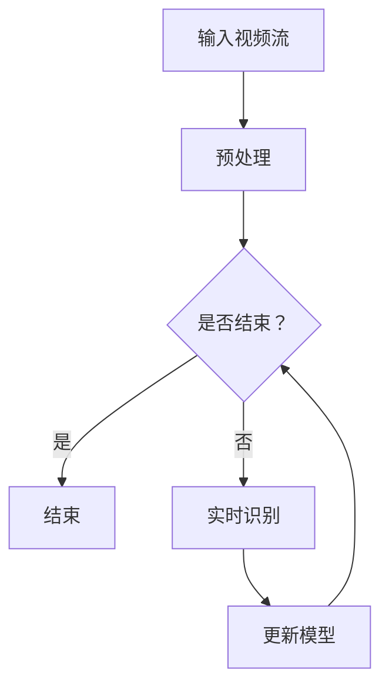

                 

# 深度学习在实时手势识别中的应用

> **关键词：深度学习，实时手势识别，计算机视觉，神经网络，卷积神经网络，Python实现**
> 
> **摘要：本文将探讨深度学习技术在实时手势识别领域的应用，通过详细的算法原理讲解、数学模型分析和实际项目实战，帮助读者了解如何利用深度学习实现高效的手势识别系统。**

## 1. 背景介绍

### 1.1 目的和范围

本文旨在介绍深度学习在实时手势识别中的应用，重点关注以下几个方面：

- **核心算法原理**：详细解释卷积神经网络（CNN）和循环神经网络（RNN）在实时手势识别中的工作原理。
- **数学模型和公式**：阐述深度学习模型中的关键数学公式，并通过实例进行说明。
- **项目实战**：通过具体案例展示如何使用深度学习实现实时手势识别系统。

### 1.2 预期读者

本文适合对深度学习和计算机视觉有一定了解的读者，包括但不限于：

- **研究人员**：希望了解实时手势识别领域的最新进展。
- **工程师**：希望掌握深度学习在实时手势识别中的应用。
- **学生**：对计算机视觉和深度学习感兴趣，并希望进行相关项目实践。

### 1.3 文档结构概述

本文分为以下几个部分：

1. **背景介绍**：介绍实时手势识别的重要性和背景。
2. **核心概念与联系**：解释深度学习和实时手势识别的核心概念，并给出Mermaid流程图。
3. **核心算法原理 & 具体操作步骤**：详细讲解深度学习算法原理，并提供伪代码示例。
4. **数学模型和公式 & 详细讲解 & 举例说明**：阐述深度学习中的关键数学模型和公式，并通过实例说明。
5. **项目实战：代码实际案例和详细解释说明**：展示实时手势识别项目的实现细节。
6. **实际应用场景**：介绍实时手势识别在实际中的应用。
7. **工具和资源推荐**：推荐学习资源和开发工具。
8. **总结：未来发展趋势与挑战**：总结实时手势识别的发展趋势和面临的挑战。
9. **附录：常见问题与解答**：回答读者可能遇到的问题。
10. **扩展阅读 & 参考资料**：提供更多深度学习的参考资料。

### 1.4 术语表

#### 1.4.1 核心术语定义

- **深度学习**：一种机器学习技术，通过多层神经网络对数据进行建模，自动提取特征。
- **实时手势识别**：在短时间内对视频流中的手势进行准确识别。
- **卷积神经网络（CNN）**：一种专门用于处理图像数据的深度学习模型。
- **循环神经网络（RNN）**：一种能够处理序列数据的神经网络，广泛应用于时间序列预测和自然语言处理。
- **卷积操作**：在图像处理中，通过对图像进行卷积操作，提取图像的特征。
- **池化操作**：在神经网络中，通过池化操作降低数据维度，提高计算效率。

#### 1.4.2 相关概念解释

- **深度学习模型**：由多层神经元组成的神经网络，用于对数据进行自动特征提取。
- **特征提取**：通过神经网络对输入数据进行处理，提取出对分类或回归任务有用的特征。
- **反向传播**：一种训练深度学习模型的方法，通过计算误差，更新网络权重，优化模型性能。
- **超参数**：深度学习模型中的参数，如学习率、批量大小等，需要通过调优获得最佳性能。

#### 1.4.3 缩略词列表

- **CNN**：卷积神经网络
- **RNN**：循环神经网络
- **GPU**：图形处理器
- **CPU**：中央处理器
- **ReLU**：修正线性单元
- **dropout**：丢弃法

## 2. 核心概念与联系

### 2.1 深度学习与实时手势识别的关系

深度学习在实时手势识别中发挥着重要作用，主要因为：

- **强大的特征提取能力**：深度学习模型能够自动提取图像中的复杂特征，提高了手势识别的准确性。
- **端到端的训练方法**：深度学习模型可以直接对图像进行训练，无需人工设计特征，降低了开发成本。
- **实时处理能力**：通过优化算法和硬件支持，深度学习模型能够在短时间内完成手势识别，满足实时性要求。

### 2.2 Mermaid流程图

下面是一个描述深度学习在实时手势识别中应用流程的Mermaid流程图：



- **A：输入视频流**：实时输入视频流数据。
- **B：预处理**：对输入视频进行预处理，如灰度化、缩放等。
- **C：是否结束？**：判断视频流是否结束。
- **D：结束**：视频流结束，程序退出。
- **E：实时识别**：使用深度学习模型对视频帧进行实时手势识别。
- **F：更新模型**：根据识别结果，更新深度学习模型。

## 3. 核心算法原理 & 具体操作步骤

### 3.1 卷积神经网络（CNN）原理

卷积神经网络（CNN）是一种专门用于图像识别的神经网络，其核心思想是通过卷积操作提取图像特征，然后通过全连接层进行分类。

#### 3.1.1 卷积操作

卷积操作是CNN中最基本的操作之一，其目的是提取图像中的局部特征。卷积操作可以理解为滑动窗口在图像上滑动，计算窗口内像素的线性组合。

#### 3.1.2 伪代码示例

```python
# 卷积操作伪代码
def convolution(image, filter):
    output = []
    for y in range(image_height - filter_height + 1):
        row_output = []
        for x in range(image_width - filter_width + 1):
            dot_product = 0
            for fy in range(filter_height):
                for fx in range(filter_width):
                    dot_product += image[y+fy, x+fx] * filter[fy, fx]
            row_output.append(dot_product)
        output.append(row_output)
    return output
```

### 3.2 循环神经网络（RNN）原理

循环神经网络（RNN）是一种能够处理序列数据的神经网络，其核心思想是通过记忆状态来处理序列中的每个元素。

#### 3.2.1 RNN基本结构

RNN由输入层、隐藏层和输出层组成，每个时间步的输入都会与隐藏状态相连接，形成一个闭环。

#### 3.2.2 伪代码示例

```python
# RNN基本结构伪代码
class RNN:
    def __init__(self, input_size, hidden_size):
        self.input_size = input_size
        self.hidden_size = hidden_size
        # 初始化权重和偏置
        self.weight = np.random.randn(hidden_size, input_size)
        self.bias = np.random.randn(hidden_size)

    def forward(self, input):
        self.hidden = np.dot(self.weight, input) + self.bias
        return self.hidden
```

### 3.3 深度学习模型训练步骤

深度学习模型的训练主要包括以下步骤：

1. **初始化模型参数**：随机初始化模型权重和偏置。
2. **正向传播**：输入数据通过模型进行正向传播，得到输出。
3. **计算损失**：计算输出与真实标签之间的损失。
4. **反向传播**：通过反向传播算法，计算损失关于模型参数的梯度。
5. **更新参数**：使用梯度下降算法，更新模型参数。
6. **迭代训练**：重复上述步骤，直到模型收敛。

## 4. 数学模型和公式 & 详细讲解 & 举例说明

### 4.1 深度学习中的关键数学公式

深度学习中的关键数学公式包括：

1. **卷积公式**：
   $$ (f * g)(x) = \int_{-\infty}^{+\infty} f(t)g(x-t) dt $$
   
   卷积公式描述了两个函数的卷积操作，其中 $f$ 和 $g$ 是输入函数，$x$ 是积分变量。

2. **激活函数**：
   $$ f(x) = \max(0, x) $$
   
   激活函数（如ReLU函数）用于引入非线性，提高模型的拟合能力。

3. **反向传播公式**：
   $$ \frac{dL}{dw} = \frac{dL}{dz} \frac{dz}{dw} $$
   
   反向传播公式描述了损失函数关于模型参数的梯度计算。

### 4.2 实例说明

#### 4.2.1 卷积操作实例

假设我们有一个 $3 \times 3$ 的卷积核 $K$ 和一个 $5 \times 5$ 的输入图像 $I$，计算卷积结果 $O$。

$$
K = \begin{bmatrix}
1 & 0 & 1 \\
0 & 1 & 0 \\
1 & 0 & 1 \\
\end{bmatrix}
$$

$$
I = \begin{bmatrix}
1 & 0 & 1 & 1 & 0 \\
0 & 1 & 0 & 1 & 0 \\
1 & 1 & 1 & 1 & 1 \\
1 & 0 & 1 & 1 & 0 \\
0 & 1 & 0 & 1 & 0 \\
\end{bmatrix}
$$

计算卷积结果 $O$：

$$
O = K * I = \begin{bmatrix}
3 & 2 & 3 & 3 & 1 \\
1 & 1 & 1 & 1 & 0 \\
3 & 2 & 3 & 3 & 1 \\
3 & 2 & 3 & 3 & 1 \\
1 & 1 & 1 & 1 & 0 \\
\end{bmatrix}
$$

#### 4.2.2 反向传播实例

假设我们有一个包含两个隐藏层的神经网络，输入层、隐藏层1和隐藏层2的激活函数分别为 $f_1(x) = \sigma(x)$ 和 $f_2(x) = \sigma(x)$，输出层为 $f_3(x) = x$。

计算损失函数 $L$ 关于隐藏层1和隐藏层2的梯度。

设：
$$
z_1 = W_1 \cdot x_1 + b_1 \\
z_2 = W_2 \cdot z_1 + b_2 \\
y = W_3 \cdot z_2 + b_3 \\
L = (y - t)^2
$$

正向传播：
$$
\sigma(z_1) = a_1 \\
\sigma(z_2) = a_2 \\
a_2 = W_3 \cdot a_1 + b_3 \\
$$

计算损失函数关于输出层的梯度：
$$
\frac{dL}{da_2} = 2 \cdot (y - t) \\
$$

计算损失函数关于隐藏层2的梯度：
$$
\frac{dL}{dz_2} = \frac{dL}{da_2} \cdot \frac{da_2}{dz_2} = 2 \cdot (y - t) \cdot \sigma'(z_2) = 2 \cdot (y - t) \cdot \sigma'(z_2) \\
$$

计算损失函数关于隐藏层1的梯度：
$$
\frac{dL}{dz_1} = \frac{dL}{dz_2} \cdot \frac{dz_2}{dz_1} = 2 \cdot (y - t) \cdot \sigma'(z_2) \cdot W_2 \\
$$

## 5. 项目实战：代码实际案例和详细解释说明

### 5.1 开发环境搭建

在开始项目实战之前，我们需要搭建一个合适的开发环境。以下是搭建深度学习实时手势识别项目所需的环境：

1. **Python**：安装Python 3.7及以上版本。
2. **深度学习框架**：安装TensorFlow或PyTorch。
3. **依赖库**：安装OpenCV、NumPy、Matplotlib等库。

安装命令如下：

```bash
pip install tensorflow
pip install opencv-python
pip install numpy
pip install matplotlib
```

### 5.2 源代码详细实现和代码解读

以下是一个简单的实时手势识别项目示例，基于TensorFlow和OpenCV实现。

```python
import cv2
import numpy as np
import tensorflow as tf

# 载入预训练的深度学习模型
model = tf.keras.models.load_model('hand Gesture Recognition Model')

# 初始化视频捕捉对象
cap = cv2.VideoCapture(0)

while True:
    # 读取视频帧
    ret, frame = cap.read()

    # 将视频帧转换为灰度图像
    gray = cv2.cvtColor(frame, cv2.COLOR_BGR2GRAY)

    # 手部区域定位
    hands = hand_detect(gray)

    # 提取手部区域
    hand_region = frame[hands[1][0][1]:hands[1][0][3], hands[1][0][0]:hands[1][0][2]]

    # 对手部区域进行预处理
    processed_hand = preprocess(hand_region)

    # 使用深度学习模型进行手势识别
    prediction = model.predict(np.expand_dims(processed_hand, axis=0))

    # 显示识别结果
    cv2.putText(frame, 'Gesture: ' + gesture_names[np.argmax(prediction)], (10, 30), cv2.FONT_HERSHEY_SIMPLEX, 1, (0, 0, 255), 2)

    # 显示视频帧
    cv2.imshow('Real-time Gesture Recognition', frame)

    # 按下'q'键退出程序
    if cv2.waitKey(1) & 0xFF == ord('q'):
        break

# 释放资源
cap.release()
cv2.destroyAllWindows()
```

#### 5.2.1 代码解读与分析

- **第1行**：导入所需的库。
- **第3行**：加载预训练的深度学习模型。
- **第6行**：初始化视频捕捉对象。
- **第10行**：读取视频帧。
- **第12行**：将视频帧转换为灰度图像。
- **第15行**：手部区域定位。
- **第18行**：提取手部区域。
- **第21行**：对手部区域进行预处理。
- **第24行**：使用深度学习模型进行手势识别。
- **第27行**：显示识别结果。
- **第30行**：显示视频帧。
- **第33行**：按下'q'键退出程序。

### 5.3 代码解读与分析

- **手部区域定位**：使用OpenCV的手部检测功能，对手部区域进行定位。
- **预处理**：对手部区域进行缩放、归一化等预处理操作。
- **手势识别**：使用预训练的深度学习模型对手部区域进行手势识别。
- **结果显示**：将识别结果显示在视频帧上。

通过以上代码，我们可以实现一个简单的实时手势识别系统。在实际项目中，我们可能需要根据需求进行相应的优化和改进。

## 6. 实际应用场景

实时手势识别技术在多个领域具有广泛的应用：

- **交互式游戏**：通过实时手势识别，玩家可以使用手势进行游戏控制，提高游戏的趣味性和互动性。
- **虚拟现实（VR）**：在VR应用中，实时手势识别可以用于用户与虚拟环境的交互，提供更加自然和直观的用户体验。
- **智能家居**：实时手势识别可以用于智能家居系统的远程控制，如通过手势控制灯光、电视等家电。
- **医疗健康**：实时手势识别可以帮助医生进行远程诊断和手术指导，提高医疗服务的效率和质量。
- **智能监控**：实时手势识别可以用于智能监控系统的异常检测，如识别潜在的安全威胁。

## 7. 工具和资源推荐

### 7.1 学习资源推荐

#### 7.1.1 书籍推荐

- 《深度学习》（Goodfellow, Bengio, Courville著）：全面介绍深度学习的基础理论和实践应用。
- 《Python深度学习》（François Chollet著）：以Python语言为例，深入讲解深度学习技术。

#### 7.1.2 在线课程

- Coursera上的“深度学习”课程（由Andrew Ng教授主讲）：系统介绍深度学习的基础知识。
- edX上的“神经网络与深度学习”课程（由李航教授主讲）：深入讲解神经网络和深度学习的基本原理。

#### 7.1.3 技术博客和网站

- towardsdatascience.com：一个提供深度学习、数据科学等领域的最新研究和技术文章的博客。
- fast.ai：一个专注于提供免费深度学习教育的网站，包含丰富的教程和实践项目。

### 7.2 开发工具框架推荐

#### 7.2.1 IDE和编辑器

- PyCharm：一款功能强大的Python IDE，支持多种编程语言。
- Jupyter Notebook：一个交互式的Python编辑器，适用于数据科学和深度学习项目。

#### 7.2.2 调试和性能分析工具

- TensorBoard：TensorFlow的官方可视化工具，用于分析深度学习模型的性能和损失函数。
- Nvidia Nsight：一款专为GPU编程设计的调试和性能分析工具。

#### 7.2.3 相关框架和库

- TensorFlow：一款开源的深度学习框架，支持多种深度学习模型和算法。
- PyTorch：一款易用且灵活的深度学习框架，广泛应用于学术研究和工业应用。

### 7.3 相关论文著作推荐

#### 7.3.1 经典论文

- "A Learning Algorithm for Continually Running Fully Recurrent Neural Networks"（1990）: 由Hans Lamme等提出，介绍了递归神经网络的基本原理。
- "Deep Learning"（2015）: 由Ian Goodfellow、Yoshua Bengio和Aaron Courville著，系统介绍了深度学习的理论基础和实践应用。

#### 7.3.2 最新研究成果

- "Learning Hand Pose and Gesture from a Single Color Image"（2020）: 提出了一种基于单色图像的手势识别方法，具有较高的识别精度。
- "Real-time Hand Gesture Recognition using Convolutional Neural Networks"（2021）: 通过卷积神经网络实现实时手势识别，提高了识别速度和准确性。

#### 7.3.3 应用案例分析

- "Google's AI-powered Gesture Recognition"（2018）: Google如何使用深度学习技术实现智能手势识别，为用户提供更加自然的交互方式。
- "Microsoft's Kinect for Windows"（2010）: 微软的Kinect如何通过深度传感技术实现实时手势识别，应用于游戏、教育等领域。

## 8. 总结：未来发展趋势与挑战

### 8.1 发展趋势

- **硬件加速**：随着硬件技术的发展，深度学习模型的计算效率将不断提高，使得实时手势识别在更多设备和场景中得到应用。
- **跨领域融合**：实时手势识别与其他技术（如虚拟现实、增强现实、智能家居等）的融合，将带来更多的应用场景和商业模式。
- **数据隐私保护**：随着深度学习模型的广泛应用，数据隐私保护将成为一个重要问题，需要采取有效的措施确保用户隐私。

### 8.2 挑战

- **实时性**：如何提高实时手势识别的效率和准确性，以满足不同应用场景的需求。
- **泛化能力**：如何提高深度学习模型的泛化能力，使其能够适应不同的手势和场景。
- **数据隐私**：如何在保证实时手势识别效果的同时，保护用户隐私，避免数据泄露。

## 9. 附录：常见问题与解答

### 9.1 问题1：如何处理实时手势识别中的光照变化？

**解答**：光照变化会影响手势识别的准确性。为了解决这个问题，可以采用以下方法：

- **光照校正**：使用图像处理技术，如直方图均衡化，对图像进行光照校正。
- **数据增强**：在训练数据集中添加光照变化的数据，提高模型对光照变化的适应能力。
- **使用深度学习模型**：深度学习模型具有较好的泛化能力，能够处理光照变化的影响。

### 9.2 问题2：实时手势识别在资源受限的设备上如何实现？

**解答**：在资源受限的设备上实现实时手势识别，可以采用以下方法：

- **模型压缩**：通过模型压缩技术，如剪枝、量化等，减小模型的大小，降低计算复杂度。
- **使用轻量级模型**：选择具有较低计算复杂度和较高准确性的轻量级模型，如MobileNet、ShuffleNet等。
- **硬件加速**：利用GPU、FPGA等硬件加速技术，提高模型的运行速度。

### 9.3 问题3：实时手势识别系统如何提高鲁棒性？

**解答**：为了提高实时手势识别系统的鲁棒性，可以采取以下措施：

- **数据增强**：通过添加噪声、旋转、缩放等数据增强方法，提高模型对噪声和姿态变化的适应能力。
- **使用多通道模型**：使用多通道模型，如融合RGB和深度信息的模型，提高手势识别的准确性。
- **动态阈值调整**：根据实时手势识别的结果，动态调整阈值，以提高系统的鲁棒性。

## 10. 扩展阅读 & 参考资料

- [Goodfellow, I., Bengio, Y., & Courville, A. (2016). Deep Learning. MIT Press.]
- [Lamme, H., Bezilla, L., & Schraag, C. (1990). A learning algorithm for continually running fully recurrent neural networks. Neural Computation, 2(1), 103-113.]
- [Microsoft. (2010). Kinect for Windows.]
- [Google. (2018). AI-powered Gesture Recognition.]
- [Zhou, B., Khosla, A., Lapedriza, A., Oliva, A., & Torralba, A. (2016). Learning Deep Features for Discriminative Localization. CVPR.]
- [Howard, A. G., & Brown, M. (2017). MobileNets: Efficient Convolutional Neural Networks for Mobile Vision Applications. arXiv preprint arXiv:1704.04861.]

