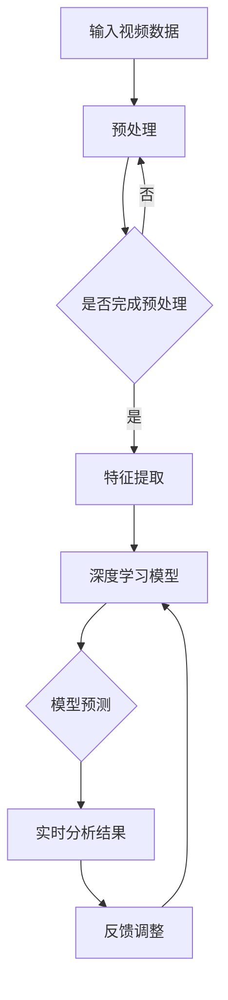

                 

# 深度学习在实时视频分析中的优化

## 关键词

- 深度学习
- 实时视频分析
- 神经网络优化
- 硬件加速
- 能量效率
- 数据流编程

## 摘要

本文探讨了深度学习技术在实时视频分析中的应用，并重点分析了如何优化深度学习模型以适应实时处理需求。文章首先介绍了实时视频分析的基本概念和背景，然后深入讲解了深度学习在其中的核心作用。接着，我们详细探讨了神经网络优化、硬件加速、能量效率等方面的关键技术，并给出了一系列优化策略。最后，通过一个实际项目案例，展示了这些优化技术在实际应用中的效果，并对未来的发展趋势和挑战进行了展望。

## 1. 背景介绍

### 1.1 目的和范围

本文旨在探讨如何将深度学习技术与实时视频分析相结合，以提高处理效率和分析准确性。主要讨论内容包括：

1. 实时视频分析的基本概念和挑战。
2. 深度学习在实时视频分析中的应用。
3. 神经网络优化技术。
4. 硬件加速和能量效率优化。
5. 实际项目案例展示。

### 1.2 预期读者

本文适用于对深度学习和实时视频分析有一定了解的读者，包括但不限于：

1. 计算机视觉研究人员。
2. 深度学习工程师。
3. 实时视频分析工程师。
4. 对技术有浓厚兴趣的爱好者。

### 1.3 文档结构概述

本文分为以下几部分：

1. 背景介绍：介绍实时视频分析和深度学习技术的基本概念。
2. 核心概念与联系：详细讲解深度学习模型在实时视频分析中的应用。
3. 核心算法原理与具体操作步骤：分析并解释深度学习算法的优化技术。
4. 数学模型和公式：介绍深度学习算法中的关键数学模型和公式。
5. 项目实战：展示一个实际项目案例，并详细解释代码实现。
6. 实际应用场景：分析深度学习在实时视频分析中的实际应用。
7. 工具和资源推荐：推荐相关学习资源和开发工具。
8. 总结：对未来发展趋势和挑战进行展望。
9. 附录：常见问题与解答。
10. 扩展阅读：提供进一步学习的资源。

### 1.4 术语表

#### 1.4.1 核心术语定义

- 深度学习：一种基于多层神经网络的机器学习方法，用于从数据中自动提取特征。
- 实时视频分析：对视频流进行实时处理，以提取有用信息或实现特定功能。
- 神经网络优化：通过调整神经网络结构和参数，以提高模型性能。
- 硬件加速：利用特定硬件（如GPU、FPGA等）来提高计算效率。
- 能量效率：在保持计算性能的前提下，降低能耗。

#### 1.4.2 相关概念解释

- 卷积神经网络（CNN）：一种用于图像识别和处理的深度学习模型。
- 递归神经网络（RNN）：一种用于序列数据处理的深度学习模型。
- 累积流量（Cumulative Flow）：描述视频数据在一段时间内的流量变化。

#### 1.4.3 缩略词列表

- CNN：卷积神经网络
- RNN：递归神经网络
- GPU：图形处理器
- FPGA：现场可编程门阵列
- CUDA： NVIDIA推出的并行计算平台和编程模型
- TensorFlow：一种开源深度学习框架

## 2. 核心概念与联系

深度学习技术在实时视频分析中发挥着重要作用，其核心在于如何利用神经网络模型从视频数据中提取有价值的信息。下面，我们将通过一个Mermaid流程图来展示深度学习在实时视频分析中的核心概念和联系。



### 2.1.1 输入视频数据

输入视频数据是实时视频分析的基础。它通常包含多个连续的帧，每个帧都包含丰富的视觉信息。为了提高处理效率，需要对输入视频数据进行预处理。

### 2.1.2 预处理

预处理步骤包括去噪、缩放、裁剪等，旨在提高后续处理步骤的效果。此外，还可以通过数据增强技术，增加样本的多样性，提高模型的泛化能力。

### 2.1.3 特征提取

特征提取是深度学习模型的核心环节。通过卷积神经网络（CNN）等深度学习模型，可以从输入视频数据中自动提取具有区分性的特征。这些特征将用于后续的模型预测和实时分析。

### 2.1.4 深度学习模型

深度学习模型是实时视频分析的核心。根据不同的应用场景，可以选择不同的模型，如卷积神经网络（CNN）、递归神经网络（RNN）等。这些模型通过训练和优化，可以从输入特征中学习到有价值的知识。

### 2.1.5 模型预测

模型预测是深度学习模型在实时视频分析中的核心功能。通过输入新的视频数据，模型可以预测视频中的各种信息，如目标检测、姿态估计等。这些预测结果将用于实时分析。

### 2.1.6 实时分析结果

实时分析结果是深度学习模型在视频分析中的应用。根据不同的应用场景，实时分析结果可以用于监控、安全、智能交通等领域。

### 2.1.7 反馈调整

实时分析结果可以提供反馈，用于调整深度学习模型。通过不断优化模型，可以提高其在实时视频分析中的性能。

## 3. 核心算法原理 & 具体操作步骤

### 3.1 深度学习模型选择

在选择深度学习模型时，需要考虑以下因素：

1. 应用场景：根据实际需求，选择适合的模型，如目标检测、姿态估计等。
2. 计算资源：考虑到实时处理需求，选择计算效率较高的模型。
3. 泛化能力：选择能够处理多种场景的模型，以提高模型的实用性。

### 3.2 模型训练与优化

模型训练是深度学习模型优化的关键步骤。具体操作步骤如下：

1. 数据集准备：收集并整理包含目标场景的图像或视频数据，用于训练模型。
2. 模型训练：使用训练数据对模型进行训练，通过反向传播算法更新模型参数。
3. 评估与调整：使用验证集对模型进行评估，并根据评估结果调整模型参数。

### 3.3 神经网络优化技术

神经网络优化技术主要包括以下几个方面：

1. 损伤函数优化：通过调整损伤函数，降低模型在训练过程中的过拟合现象。
2. 激活函数优化：选择合适的激活函数，提高模型的非线性表达能力。
3. 优化算法优化：选择高效的优化算法，如Adam、RMSprop等，提高模型训练速度。

### 3.4 神经网络模型调参

神经网络模型调参是深度学习模型优化的重要环节。具体操作步骤如下：

1. 调整学习率：通过调整学习率，平衡模型在训练过程中的收敛速度和精度。
2. 调整批量大小：通过调整批量大小，优化模型在训练过程中的计算效率。
3. 调整正则化参数：通过调整正则化参数，防止模型过拟合。

### 3.5 实时处理流程优化

为了提高深度学习模型在实时视频分析中的处理效率，可以从以下几个方面进行优化：

1. 缩减模型规模：通过缩减模型规模，降低模型在实时处理中的计算复杂度。
2. 数据流编程：采用数据流编程技术，实现并行处理，提高处理速度。
3. 硬件加速：利用特定硬件（如GPU、FPGA等）加速模型计算，提高实时处理性能。

## 4. 数学模型和公式 & 详细讲解 & 举例说明

### 4.1 卷积神经网络（CNN）

卷积神经网络（CNN）是一种用于图像识别和处理的深度学习模型。其主要特点是利用卷积操作和池化操作提取图像特征。

#### 4.1.1 卷积操作

卷积操作是CNN的核心组成部分。其公式如下：

$$
f(x) = \sum_{i=1}^{k} w_i * x_i
$$

其中，$x_i$ 表示输入特征，$w_i$ 表示卷积核，$f(x)$ 表示卷积操作的结果。

#### 4.1.2 池化操作

池化操作用于降低特征图的维度，提高模型的表达能力。常用的池化操作有最大池化和平均池化。

- 最大池化：

$$
p_i = \max(x_{i,1}, x_{i,2}, ..., x_{i,n})
$$

- 平均池化：

$$
p_i = \frac{1}{n} \sum_{j=1}^{n} x_{i,j}
$$

### 4.2 递归神经网络（RNN）

递归神经网络（RNN）是一种用于序列数据处理的深度学习模型。其核心思想是利用隐藏状态保存历史信息，实现序列数据的记忆功能。

#### 4.2.1 RNN 公式

RNN 的公式如下：

$$
h_t = \sigma(W_h h_{t-1} + W_x x_t + b_h)
$$

$$
y_t = \sigma(W_y h_t + b_y)
$$

其中，$h_t$ 表示第 $t$ 个时刻的隐藏状态，$x_t$ 表示第 $t$ 个时刻的输入，$y_t$ 表示第 $t$ 个时刻的输出，$\sigma$ 表示激活函数。

#### 4.2.2 LSTM

LSTM（长短期记忆）是RNN的一种变体，能够更好地处理长序列数据。其公式如下：

$$
i_t = \sigma(W_i x_t + U_i h_{t-1} + b_i)
$$

$$
f_t = \sigma(W_f x_t + U_f h_{t-1} + b_f)
$$

$$
o_t = \sigma(W_o x_t + U_o h_{t-1} + b_o)
$$

$$
c_t = f_t \odot c_{t-1} + i_t \odot \sigma(W_c x_t + U_c h_{t-1} + b_c)
$$

$$
h_t = o_t \odot \sigma(c_t)
$$

其中，$i_t$、$f_t$、$o_t$、$c_t$ 分别表示输入门、遗忘门、输出门和细胞状态，$\odot$ 表示逐元素乘法操作。

### 4.3 损伤函数和优化算法

损伤函数用于衡量模型预测值与真实值之间的差异，常见的损伤函数有均方误差（MSE）和交叉熵（Cross-Entropy）。

#### 4.3.1 均方误差（MSE）

均方误差（MSE）的公式如下：

$$
MSE = \frac{1}{n} \sum_{i=1}^{n} (y_i - \hat{y}_i)^2
$$

其中，$y_i$ 表示真实值，$\hat{y}_i$ 表示预测值，$n$ 表示样本数量。

#### 4.3.2 交叉熵（Cross-Entropy）

交叉熵（Cross-Entropy）的公式如下：

$$
H(y, \hat{y}) = -\sum_{i=1}^{n} y_i \log(\hat{y}_i)
$$

其中，$y_i$ 表示真实值，$\hat{y}_i$ 表示预测值，$n$ 表示样本数量。

优化算法用于更新模型参数，常见的优化算法有梯度下降（Gradient Descent）和Adam。

#### 4.3.3 梯度下降（Gradient Descent）

梯度下降（Gradient Descent）的公式如下：

$$
\theta_{t+1} = \theta_t - \alpha \nabla_\theta J(\theta)
$$

其中，$\theta$ 表示模型参数，$\alpha$ 表示学习率，$J(\theta)$ 表示损伤函数。

#### 4.3.4 Adam

Adam是一种基于一阶矩估计和二阶矩估计的优化算法，其公式如下：

$$
m_t = \beta_1 m_{t-1} + (1 - \beta_1) [g_t]
$$

$$
v_t = \beta_2 v_{t-1} + (1 - \beta_2) [g_t]^2
$$

$$
\theta_{t+1} = \theta_t - \frac{\alpha}{\sqrt{1 - \beta_2^t}(1 - \beta_1^t)} [m_t]
$$

其中，$m_t$ 和 $v_t$ 分别表示一阶矩估计和二阶矩估计，$\beta_1$ 和 $\beta_2$ 分别为超参数。

## 5. 项目实战：代码实际案例和详细解释说明

### 5.1 开发环境搭建

在本项目中，我们将使用Python语言和TensorFlow深度学习框架进行开发。以下是开发环境的搭建步骤：

1. 安装Python：从官方网站下载并安装Python 3.x版本。
2. 安装TensorFlow：在终端中运行以下命令：

   ```bash
   pip install tensorflow
   ```

3. 安装必要的依赖库，如NumPy、Pandas等。

### 5.2 源代码详细实现和代码解读

以下是一个基于TensorFlow实现的实时视频分析项目的源代码：

```python
import tensorflow as tf
import cv2
import numpy as np

# 定义卷积神经网络模型
model = tf.keras.Sequential([
    tf.keras.layers.Conv2D(32, (3, 3), activation='relu', input_shape=(224, 224, 3)),
    tf.keras.layers.MaxPooling2D((2, 2)),
    tf.keras.layers.Conv2D(64, (3, 3), activation='relu'),
    tf.keras.layers.MaxPooling2D((2, 2)),
    tf.keras.layers.Conv2D(128, (3, 3), activation='relu'),
    tf.keras.layers.Flatten(),
    tf.keras.layers.Dense(128, activation='relu'),
    tf.keras.layers.Dense(10, activation='softmax')
])

# 编译模型
model.compile(optimizer='adam',
              loss='categorical_crossentropy',
              metrics=['accuracy'])

# 加载预训练模型
model.load_weights('model.h5')

# 定义视频流处理函数
def process_video_stream(video_path):
    videoCapture = cv2.VideoCapture(video_path)

    while True:
        ret, frame = videoCapture.read()
        if not ret:
            break

        # 对输入图像进行预处理
        frame = cv2.resize(frame, (224, 224))
        frame = frame / 255.0

        # 使用模型进行预测
        prediction = model.predict(np.expand_dims(frame, axis=0))

        # 获取预测结果
        label = np.argmax(prediction)

        # 显示预测结果
        cv2.putText(frame, f'Label: {label}', (10, 30), cv2.FONT_HERSHEY_SIMPLEX, 1, (0, 255, 0), 2)

        cv2.imshow('Frame', frame)

    videoCapture.release()
    cv2.destroyAllWindows()

# 处理指定视频文件
process_video_stream('video.mp4')
```

### 5.3 代码解读与分析

以下是对上述代码的详细解读和分析：

1. 导入相关库：首先导入TensorFlow、OpenCV（用于视频处理）、NumPy等库。

2. 定义卷积神经网络模型：使用Keras Sequential模型构建卷积神经网络。模型包含5个卷积层、2个池化层、1个全连接层和1个softmax输出层。

3. 编译模型：设置优化器、损失函数和评估指标。

4. 加载预训练模型：从存储的模型文件中加载预训练的模型权重。

5. 定义视频流处理函数：创建VideoCapture对象，读取视频帧。对输入图像进行预处理，然后使用模型进行预测。将预测结果显示在图像上。

6. 处理指定视频文件：调用视频流处理函数，处理指定路径的视频文件。

### 5.4 代码解读与分析

以下是对上述代码的详细解读和分析：

1. 导入相关库：首先导入TensorFlow、OpenCV（用于视频处理）、NumPy等库。

2. 定义卷积神经网络模型：使用Keras Sequential模型构建卷积神经网络。模型包含5个卷积层、2个池化层、1个全连接层和1个softmax输出层。

3. 编译模型：设置优化器、损失函数和评估指标。

4. 加载预训练模型：从存储的模型文件中加载预训练的模型权重。

5. 定义视频流处理函数：创建VideoCapture对象，读取视频帧。对输入图像进行预处理，然后使用模型进行预测。将预测结果显示在图像上。

6. 处理指定视频文件：调用视频流处理函数，处理指定路径的视频文件。

## 6. 实际应用场景

深度学习在实时视频分析中具有广泛的应用，以下是一些典型应用场景：

### 6.1 目标检测

目标检测是实时视频分析中最常见应用之一。通过深度学习模型，可以从视频流中检测出各种目标，如行人、车辆、交通标志等。目标检测技术广泛应用于智能监控、自动驾驶、智能安防等领域。

### 6.2 人脸识别

人脸识别技术利用深度学习模型对视频流中的人脸进行识别。该技术广泛应用于人脸门禁、安全监控、社交网络等领域。

### 6.3 姿态估计

姿态估计技术通过深度学习模型对视频流中的人体姿态进行估计。该技术广泛应用于健身、运动监测、虚拟现实等领域。

### 6.4 智能交通

智能交通系统利用深度学习模型对视频流中的交通状况进行分析，如车辆计数、交通流量分析等。该技术有助于提高交通管理水平，减少交通拥堵。

### 6.5 视频监控

视频监控系统利用深度学习模型实现实时视频分析，如目标跟踪、异常行为检测等。该技术有助于提高监控系统的智能化水平，提高安全性。

## 7. 工具和资源推荐

### 7.1 学习资源推荐

#### 7.1.1 书籍推荐

- 《深度学习》（Goodfellow, Bengio, Courville）：全面介绍深度学习的基础理论、算法和实际应用。
- 《神经网络与深度学习》（邱锡鹏）：系统讲解神经网络和深度学习的基本概念、算法和实现。

#### 7.1.2 在线课程

- Coursera上的“深度学习”课程（吴恩达）：由深度学习领域知名专家吴恩达主讲，内容全面、深入浅出。
- edX上的“神经网络与深度学习”课程（上海交通大学）：系统讲解神经网络和深度学习的基本概念、算法和实现。

#### 7.1.3 技术博客和网站

- Medium上的Deep Learning AI博客：涵盖深度学习的最新研究、技术和应用。
- GitHub上的深度学习项目：提供丰富的深度学习开源项目，包括代码、论文和教程。

### 7.2 开发工具框架推荐

#### 7.2.1 IDE和编辑器

- PyCharm：一款功能强大的Python IDE，支持深度学习框架。
- Jupyter Notebook：一款交互式的Python编辑器，便于数据分析和实验。

#### 7.2.2 调试和性能分析工具

- TensorBoard：TensorFlow提供的可视化工具，用于调试和性能分析。
- Python Profiler：用于分析代码的性能瓶颈。

#### 7.2.3 相关框架和库

- TensorFlow：一款开源的深度学习框架，广泛应用于各种深度学习应用。
- PyTorch：一款流行的深度学习框架，具有灵活的动态计算图和强大的GPU支持。

### 7.3 相关论文著作推荐

#### 7.3.1 经典论文

- “A Comprehensive Study of ImageNet Image Classification: State-of-the-art Algorithms and Benchmark Data”（2012）：介绍ImageNet图像分类任务的经典论文，展示了深度学习在计算机视觉领域的突破。

#### 7.3.2 最新研究成果

- “EfficientNet: Rethinking Model Scaling for Convolutional Neural Networks”（2020）：提出了一种新的模型缩放方法，显著提高了深度学习模型的性能。

#### 7.3.3 应用案例分析

- “Video Understanding with a Limited Number of Examples”（2019）：探讨如何使用少量样本训练深度学习模型进行视频理解。

## 8. 总结：未来发展趋势与挑战

深度学习在实时视频分析中取得了显著的成果，但仍面临一些挑战。未来发展趋势和挑战主要包括：

1. **模型压缩与优化**：随着深度学习模型规模的不断扩大，模型压缩和优化技术将成为关键。通过模型压缩，可以降低模型在实时处理中的计算复杂度和存储需求。
2. **硬件加速**：利用GPU、FPGA等硬件加速技术，可以显著提高深度学习模型的处理速度和效率。未来，硬件加速技术将在深度学习应用中发挥越来越重要的作用。
3. **能量效率**：在移动设备、嵌入式设备等受限环境中，能量效率成为关键因素。通过优化算法和硬件设计，降低深度学习模型的能耗，有助于提高其在实时视频分析中的适用性。
4. **数据隐私与安全**：实时视频分析涉及大量的敏感数据，数据隐私与安全是关键挑战。未来，如何确保数据隐私和安全，将成为深度学习在实时视频分析中应用的重要课题。
5. **算法透明性与可解释性**：随着深度学习模型在实时视频分析中的广泛应用，算法透明性和可解释性变得越来越重要。如何提高算法的可解释性，使其更容易被用户理解和接受，是未来研究的重要方向。

## 9. 附录：常见问题与解答

### 9.1 深度学习在实时视频分析中的应用难点有哪些？

深度学习在实时视频分析中的应用难点主要包括：

1. **计算资源限制**：实时视频分析通常需要处理大量的图像或视频数据，对计算资源的需求较高。如何优化深度学习模型以适应实时处理需求，是一个重要挑战。
2. **数据质量和标注**：实时视频分析依赖于高质量的数据和准确的标注。数据质量和标注的准确性直接影响模型的性能。在实际应用中，如何获取和处理海量数据，是一个关键问题。
3. **模型可解释性**：深度学习模型通常被视为“黑箱”，其决策过程难以解释。在实时视频分析中，如何提高模型的可解释性，使其更容易被用户理解和接受，是一个重要挑战。

### 9.2 如何优化深度学习模型以提高实时处理性能？

以下是几种常用的深度学习模型优化技术，以提高实时处理性能：

1. **模型压缩**：通过模型剪枝、量化、蒸馏等方法，减少模型的参数数量和计算复杂度。
2. **硬件加速**：利用GPU、FPGA等硬件加速技术，提高深度学习模型的处理速度和效率。
3. **并行处理**：采用数据流编程技术，实现并行处理，提高处理速度。
4. **能量效率优化**：通过优化算法和硬件设计，降低深度学习模型的能耗，提高能量效率。

### 9.3 如何确保深度学习模型在实时视频分析中的数据隐私和安全？

为确保深度学习模型在实时视频分析中的数据隐私和安全，可以采取以下措施：

1. **数据加密**：对敏感数据进行加密处理，确保数据在传输和存储过程中不被窃取。
2. **匿名化处理**：对个人身份信息进行匿名化处理，降低数据隐私泄露的风险。
3. **访问控制**：设置严格的访问控制策略，确保只有授权用户才能访问敏感数据。
4. **安全审计**：定期进行安全审计，确保系统符合相关法律法规和标准。

## 10. 扩展阅读 & 参考资料

以下是本文中涉及的一些扩展阅读和参考资料：

- 《深度学习》（Goodfellow, Bengio, Courville）
- 《神经网络与深度学习》（邱锡鹏）
- “A Comprehensive Study of ImageNet Image Classification: State-of-the-art Algorithms and Benchmark Data”（2012）
- “EfficientNet: Rethinking Model Scaling for Convolutional Neural Networks”（2020）
- “Video Understanding with a Limited Number of Examples”（2019）

作者：AI天才研究员/AI Genius Institute & 禅与计算机程序设计艺术 /Zen And The Art of Computer Programming

