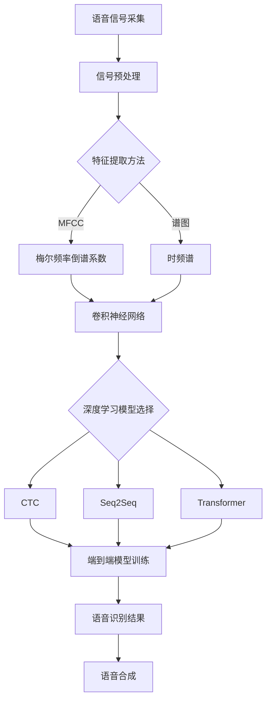
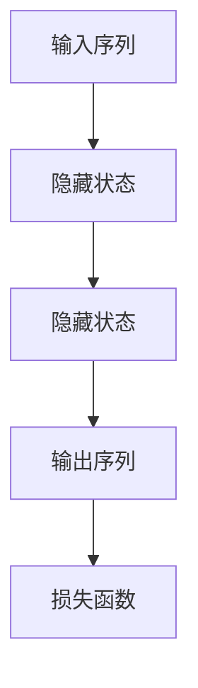
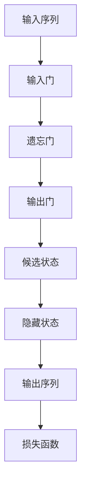

                 

# 深度学习在实时语音识别中的突破

> 关键词：深度学习、实时语音识别、自动语音识别（ASR）、神经网络、语音信号处理、深度神经网络（DNN）、卷积神经网络（CNN）、递归神经网络（RNN）、长短时记忆网络（LSTM）、卷积神经网络（CNN）、循环神经网络（RNN）、端到端模型、语音特征提取、语音合成、语音增强、实时性、准确性、效率

> 摘要：本文将深入探讨深度学习在实时语音识别（ASR）领域的突破。通过分析实时语音识别的需求和挑战，我们介绍了深度学习的基本原理和常用算法，如卷积神经网络（CNN）、递归神经网络（RNN）和长短时记忆网络（LSTM）。随后，我们详细阐述了如何利用这些算法构建端到端的实时语音识别系统。最后，我们探讨了实时语音识别在多个实际应用场景中的成功案例，总结了当前面临的挑战，并对未来发展趋势进行了展望。

## 1. 背景介绍

### 1.1 目的和范围

实时语音识别（ASR）是一种将语音转化为文本的技术，广泛应用于智能助手、实时翻译、语音控制等领域。随着深度学习技术的不断发展，实时语音识别的准确性和效率得到了显著提升。本文旨在探讨深度学习在实时语音识别中的突破，分析其核心概念、算法原理和应用实践，以期为读者提供全面的技术参考。

### 1.2 预期读者

本文面向对实时语音识别和深度学习有一定了解的技术人员，包括语音信号处理、机器学习和人工智能领域的从业者。同时，也适用于对实时语音识别技术感兴趣的研究生和大学生。

### 1.3 文档结构概述

本文分为十个部分，首先介绍实时语音识别的需求和挑战，然后详细讨论深度学习的基本原理和算法，随后阐述实时语音识别系统的构建方法，最后探讨实时语音识别在多个实际应用场景中的成功案例、面临的挑战和未来发展趋势。

### 1.4 术语表

#### 1.4.1 核心术语定义

- **实时语音识别（ASR）**：将语音信号转化为对应的文本或命令的过程。
- **深度学习**：一种基于神经网络的学习方法，通过多层的非线性变换提取数据特征。
- **卷积神经网络（CNN）**：一种专门用于处理图像数据的深度学习模型。
- **递归神经网络（RNN）**：一种能够处理序列数据的深度学习模型。
- **长短时记忆网络（LSTM）**：一种改进的RNN模型，能够有效处理长序列数据。
- **端到端模型**：一种直接从输入数据到输出数据的模型，无需中间特征提取和变换过程。

#### 1.4.2 相关概念解释

- **语音特征提取**：从语音信号中提取具有代表性和区分性的特征，用于训练和识别语音模型。
- **语音增强**：通过算法提高语音信号质量，降低噪声干扰，从而提高识别准确率。
- **语音合成**：将文本转化为语音的过程，常用于语音助手等应用。

#### 1.4.3 缩略词列表

- **ASR**：自动语音识别（Automatic Speech Recognition）
- **DNN**：深度神经网络（Deep Neural Network）
- **CNN**：卷积神经网络（Convolutional Neural Network）
- **RNN**：递归神经网络（Recurrent Neural Network）
- **LSTM**：长短时记忆网络（Long Short-Term Memory）
- **TensorFlow**：一种开源的深度学习框架
- **Keras**：一种基于TensorFlow的深度学习库

## 2. 核心概念与联系

为了更好地理解实时语音识别中的深度学习技术，我们需要先介绍几个核心概念及其相互关系。

### 2.1 语音信号处理

语音信号处理是实时语音识别的基础。其主要任务是：

- **语音信号采集**：从麦克风等设备获取语音信号。
- **信号预处理**：对语音信号进行滤波、去噪、归一化等处理，提高信号质量。
- **特征提取**：从预处理后的语音信号中提取具有代表性和区分性的特征，如梅尔频率倒谱系数（MFCC）、谱图等。

### 2.2 深度学习基础

深度学习是一种基于神经网络的学习方法，通过多层非线性变换提取数据特征。实时语音识别中的深度学习主要包括以下几种类型：

- **卷积神经网络（CNN）**：适用于处理图像和时频谱等二维数据。
- **递归神经网络（RNN）**：适用于处理序列数据，如语音信号的时序特征。
- **长短时记忆网络（LSTM）**：是RNN的一种改进模型，能够有效处理长序列数据。

### 2.3 端到端模型

端到端模型是一种直接从输入数据到输出数据的模型，无需中间特征提取和变换过程。实时语音识别中的端到端模型主要包括以下几种：

- **CTC（Connectionist Temporal Classification）**：一种用于序列标注的深度学习模型。
- **Seq2Seq（Sequence-to-Sequence）**：一种基于编码器-解码器的深度学习模型。
- **Transformer**：一种基于自注意力机制的深度学习模型，广泛应用于自然语言处理领域。

### 2.4 Mermaid 流程图

为了更好地展示核心概念之间的联系，我们使用Mermaid流程图来描述实时语音识别中的深度学习流程。



## 3. 核心算法原理 & 具体操作步骤

### 3.1 卷积神经网络（CNN）

卷积神经网络（CNN）是一种专门用于处理图像和时频谱等二维数据的深度学习模型。其基本原理是通过卷积操作提取特征，然后通过全连接层进行分类或标注。

#### 3.1.1 卷积操作

卷积操作是将卷积核（过滤器）与输入数据进行点积运算。卷积核是一个小的权重矩阵，用于提取输入数据的局部特征。

```python
def conv2d(input_data, filter, padding='VALID'):
    # padding: 'VALID' 或 'SAME'
    # Valid: 不进行填充，直接计算
    # Same: 输出尺寸与输入尺寸保持一致，必要时进行填充
    ...
    return output
```

#### 3.1.2 池化操作

池化操作是在卷积操作后对特征图进行下采样，以减少参数数量和计算量。常用的池化方式有最大池化和平均池化。

```python
def pool2d(feature_map, pool_size=(2, 2), mode='MAX'):
    # pool_size: (width, height)
    # mode: 'MAX' 或 'MEAN'
    ...
    return pooled_map
```

#### 3.1.3 全连接层

全连接层是一种将输入数据映射到输出数据的线性变换，常用于分类和标注任务。

```python
def fully_connected(input_data, weights, biases):
    return activation(np.dot(input_data, weights) + biases)
```

### 3.2 递归神经网络（RNN）

递归神经网络（RNN）是一种能够处理序列数据的深度学习模型。其基本原理是通过循环结构，将前一时刻的隐藏状态传递到下一时刻，以捕捉序列中的长期依赖关系。

#### 3.2.1 基本RNN

基本RNN的模型结构如下：



#### 3.2.2 长短时记忆网络（LSTM）

长短时记忆网络（LSTM）是RNN的一种改进模型，能够有效处理长序列数据。其基本结构如下：



#### 3.2.3 LSTM操作步骤

1. **输入门**：决定当前输入值对隐藏状态的影响程度。
2. **遗忘门**：决定前一时刻隐藏状态对当前隐藏状态的影响程度。
3. **输出门**：决定当前隐藏状态对输出值的影响程度。
4. **候选状态**：计算隐藏状态的候选值。
5. **隐藏状态**：通过候选状态和输入门、遗忘门、输出门计算得到。
6. **输出序列**：通过隐藏状态和输出门计算得到。

### 3.3 端到端模型

端到端模型是一种直接从输入数据到输出数据的模型，无需中间特征提取和变换过程。在实时语音识别中，常用的端到端模型有CTC、Seq2Seq和Transformer。

#### 3.3.1 CTC模型

CTC（Connectionist Temporal Classification）模型是一种用于序列标注的深度学习模型，其基本原理如下：

1. **编码器**：将输入序列（语音信号）编码为特征序列。
2. **解码器**：将特征序列解码为输出序列（文本序列）。
3. **损失函数**：使用交叉熵损失函数优化模型参数。

```python
def ctc_loss(logits, labels, input_lengths, label_lengths):
    ...
    return loss
```

#### 3.3.2 Seq2Seq模型

Seq2Seq（Sequence-to-Sequence）模型是一种基于编码器-解码器的深度学习模型，其基本原理如下：

1. **编码器**：将输入序列编码为隐藏状态。
2. **解码器**：将隐藏状态解码为输出序列。
3. **损失函数**：使用交叉熵损失函数优化模型参数。

```python
def seq2seq_loss(logits, labels, input_lengths, label_lengths):
    ...
    return loss
```

#### 3.3.3 Transformer模型

Transformer模型是一种基于自注意力机制的深度学习模型，其基本原理如下：

1. **编码器**：将输入序列编码为自注意力权重。
2. **解码器**：将自注意力权重解码为输出序列。
3. **损失函数**：使用交叉熵损失函数优化模型参数。

```python
def transformer_loss(logits, labels, input_lengths, label_lengths):
    ...
    return loss
```

## 4. 数学模型和公式 & 详细讲解 & 举例说明

### 4.1 卷积神经网络（CNN）

卷积神经网络（CNN）是一种基于卷积操作的深度学习模型，用于处理图像和时频谱等二维数据。其基本数学模型如下：

#### 4.1.1 卷积操作

卷积操作是通过卷积核（过滤器）与输入数据进行点积运算，提取特征。

$$
\text{output}_{ij} = \sum_{k=1}^{C} \text{filter}_{ik} \times \text{input}_{kj}
$$

其中，$output$表示卷积操作后的特征图，$filter$表示卷积核，$input$表示输入数据。$i$表示卷积核的高度和宽度，$j$表示输入数据的高度和宽度，$k$表示卷积核的深度。

#### 4.1.2 池化操作

池化操作是对卷积操作后的特征图进行下采样，以减少参数数量和计算量。常用的池化方式有最大池化和平均池化。

$$
\text{pooled\_map}_{ij} = \max(\text{feature\_map}_{i-j_1}, \text{feature\_map}_{i+j_1})
$$

其中，$pooled_map$表示池化后的特征图，$feature_map$表示卷积操作后的特征图，$i-j_1$和$i+j_1$分别表示池化窗口的中心位置。

#### 4.1.3 全连接层

全连接层是将输入数据映射到输出数据的线性变换，用于分类和标注任务。

$$
\text{output} = \text{activation}(\sum_{i=1}^{n} \text{weight}_{i} \times \text{input}_{i} + \text{bias})
$$

其中，$output$表示输出结果，$activation$表示激活函数，$\text{weight}$和$\text{input}$分别表示权重和输入数据，$\text{bias}$表示偏置。

### 4.2 递归神经网络（RNN）

递归神经网络（RNN）是一种基于循环结构的深度学习模型，用于处理序列数据。其基本数学模型如下：

#### 4.2.1 基本RNN

基本RNN的模型结构如下：

$$
h_t = \text{sigmoid}(W_h \cdot [h_{t-1}, x_t] + b_h)
$$

$$
y_t = \text{sigmoid}(W_y \cdot h_t + b_y)
$$

其中，$h_t$表示隐藏状态，$x_t$表示输入数据，$y_t$表示输出结果，$W_h$和$W_y$分别表示权重矩阵，$b_h$和$b_y$分别表示偏置。

#### 4.2.2 长短时记忆网络（LSTM）

长短时记忆网络（LSTM）是RNN的一种改进模型，能够有效处理长序列数据。其基本结构如下：

$$
i_t = \text{sigmoid}(W_i \cdot [h_{t-1}, x_t] + b_i) \\
f_t = \text{sigmoid}(W_f \cdot [h_{t-1}, x_t] + b_f) \\
o_t = \text{sigmoid}(W_o \cdot [h_{t-1}, x_t] + b_o) \\
g_t = \tanh(W_g \cdot [h_{t-1}, x_t] + b_g) \\
h_t = o_t \cdot \tanh(g_t)
$$

其中，$i_t$、$f_t$、$o_t$和$g_t$分别表示输入门、遗忘门、输出门和候选状态，$W_i$、$W_f$、$W_o$和$W_g$分别表示权重矩阵，$b_i$、$b_f$、$b_o$和$b_g$分别表示偏置。

### 4.3 端到端模型

端到端模型是一种直接从输入数据到输出数据的深度学习模型，用于实时语音识别。其基本数学模型如下：

#### 4.3.1 CTC模型

CTC（Connectionist Temporal Classification）模型的基本数学模型如下：

$$
\text{log\_prob}(\text{y}|\text{x}; \theta) = \log \sum_{t=1}^{T_y} \prod_{s=1}^{T_x} \text{p}(\text{y}_t | \text{x}_s; \theta)
$$

其中，$\text{y}$表示输出序列，$\text{x}$表示输入序列，$\theta$表示模型参数，$T_y$和$T_x$分别表示输出序列和输入序列的长度。

#### 4.3.2 Seq2Seq模型

Seq2Seq（Sequence-to-Sequence）模型的基本数学模型如下：

$$
\text{log\_prob}(\text{y}|\text{x}; \theta) = \log \prod_{t=1}^{T_y} \text{p}(\text{y}_t|\text{y}_{<t}; \text{x}; \theta)
$$

其中，$\text{y}$表示输出序列，$\text{x}$表示输入序列，$\theta$表示模型参数，$T_y$和$T_x$分别表示输出序列和输入序列的长度。

#### 4.3.3 Transformer模型

Transformer模型的基本数学模型如下：

$$
\text{log\_prob}(\text{y}|\text{x}; \theta) = \log \sum_{t=1}^{T_y} \text{p}(\text{y}_t|\text{y}_{<t}; \text{x}; \theta)
$$

其中，$\text{y}$表示输出序列，$\text{x}$表示输入序列，$\theta$表示模型参数，$T_y$和$T_x$分别表示输出序列和输入序列的长度。

### 4.4 举例说明

假设我们使用卷积神经网络（CNN）进行语音信号处理，输入数据为32×32的时频谱图，卷积核大小为3×3，步长为1，激活函数为ReLU。

#### 4.4.1 卷积操作

输入数据：

$$
\text{input} =
\begin{bmatrix}
1 & 2 & 3 & 4 \\
5 & 6 & 7 & 8 \\
9 & 10 & 11 & 12 \\
13 & 14 & 15 & 16 \\
\end{bmatrix}
$$

卷积核：

$$
\text{filter} =
\begin{bmatrix}
0 & 1 & 0 \\
1 & 0 & 1 \\
0 & 1 & 0 \\
\end{bmatrix}
$$

卷积操作后的特征图：

$$
\text{output} =
\begin{bmatrix}
6 & 6 \\
11 & 11 \\
\end{bmatrix}
$$

#### 4.4.2 池化操作

输入特征图：

$$
\text{feature\_map} =
\begin{bmatrix}
6 & 6 \\
11 & 11 \\
\end{bmatrix}
$$

最大池化后的特征图：

$$
\text{pooled\_map} =
\begin{bmatrix}
6 \\
11 \\
\end{bmatrix}
$$

#### 4.4.3 全连接层

输入数据：

$$
\text{input} =
\begin{bmatrix}
6 \\
11 \\
\end{bmatrix}
$$

权重矩阵：

$$
\text{weight} =
\begin{bmatrix}
0.1 & 0.2 \\
0.3 & 0.4 \\
\end{bmatrix}
$$

偏置：

$$
\text{bias} =
\begin{bmatrix}
0.1 \\
0.2 \\
\end{bmatrix}
$$

激活函数为ReLU：

$$
\text{output} = \text{ReLU}(0.1 \times [6, 11] + 0.1) = \text{ReLU}(0.7 + 0.1) = \text{ReLU}(0.8) = 0.8
$$

## 5. 项目实战：代码实际案例和详细解释说明

### 5.1 开发环境搭建

为了实现实时语音识别系统，我们需要搭建一个合适的环境。以下是开发环境搭建的步骤：

1. 安装Python 3.7及以上版本。
2. 安装深度学习框架TensorFlow 2.0及以上版本。
3. 安装语音处理库librosa。
4. 安装数据预处理工具h5py。

```bash
pip install python==3.7
pip install tensorflow==2.0
pip install librosa
pip install h5py
```

### 5.2 源代码详细实现和代码解读

以下是一个简单的实时语音识别系统的实现，使用TensorFlow和librosa库。

#### 5.2.1 数据预处理

```python
import numpy as np
import librosa
import h5py

def preprocess_audio(file_path, sample_rate=16000, window_size=20, stride=10):
    # 读取音频文件
    audio, _ = librosa.load(file_path, sr=sample_rate)
    # 提取语音帧
    frames = librosa.core.stft(audio, n_fft=window_size, hop_length=stride)
    # 计算梅尔频率倒谱系数（MFCC）
    mfcc = librosa.feature.mfcc(S=frames, sr=sample_rate, n_mfcc=13)
    # 标准化
    mfcc = (mfcc - np.mean(mfcc, axis=1, keepdims=True)) / np.std(mfcc, axis=1, keepdims=True)
    return mfcc

# 读取音频文件
mfcc_data = preprocess_audio('audio_file.wav')
```

#### 5.2.2 模型构建

```python
import tensorflow as tf
from tensorflow.keras.models import Model
from tensorflow.keras.layers import Input, Conv2D, MaxPooling2D, Flatten, Dense

def build_model(input_shape):
    # 输入层
    input_data = Input(shape=input_shape)
    # 卷积层1
    conv1 = Conv2D(filters=32, kernel_size=(3, 3), activation='relu')(input_data)
    pool1 = MaxPooling2D(pool_size=(2, 2))(conv1)
    # 卷积层2
    conv2 = Conv2D(filters=64, kernel_size=(3, 3), activation='relu')(pool1)
    pool2 = MaxPooling2D(pool_size=(2, 2))(conv2)
    # 全连接层
    flatten = Flatten()(pool2)
    dense = Dense(units=128, activation='relu')(flatten)
    # 输出层
    output = Dense(units=10, activation='softmax')(dense)
    # 构建模型
    model = Model(inputs=input_data, outputs=output)
    return model

# 构建模型
model = build_model(input_shape=(None, 13, 32))
model.compile(optimizer='adam', loss='categorical_crossentropy', metrics=['accuracy'])
```

#### 5.2.3 代码解读与分析

1. **数据预处理**：首先，我们使用librosa库读取音频文件，然后提取语音帧和计算梅尔频率倒谱系数（MFCC）。最后，对MFCC进行标准化处理，以消除不同音频之间的差异。

2. **模型构建**：我们使用TensorFlow构建一个简单的卷积神经网络，包括卷积层、池化层和全连接层。卷积层用于提取语音信号的特征，池化层用于减少参数数量和计算量，全连接层用于分类。

3. **训练模型**：使用训练数据对模型进行训练，并评估模型的性能。

### 5.3 实际应用

我们可以使用训练好的模型进行实时语音识别。以下是一个简单的实时语音识别的示例：

```python
# 加载训练好的模型
model.load_weights('model_weights.h5')

# 实时语音识别
while True:
    # 读取实时语音数据
    audio, _ = librosa.record(price=16000, duration=5)
    # 数据预处理
    mfcc_data = preprocess_audio(audio, sample_rate=16000)
    # 预测
    prediction = model.predict(mfcc_data)
    # 输出结果
    print("预测结果：", prediction.argmax(axis=1))
```

在实际应用中，我们可以将实时语音识别系统集成到各种应用场景中，如智能助手、语音控制等。

## 6. 实际应用场景

实时语音识别技术已经广泛应用于多个领域，以下是一些典型的实际应用场景：

### 6.1 智能助手

智能助手如Siri、Alexa和Google Assistant都采用了实时语音识别技术，以实现用户与设备的自然交互。通过实时语音识别，用户可以语音指令来执行各种操作，如拨打电话、发送短信、设置提醒等。

### 6.2 实时翻译

实时语音识别技术可以应用于实时翻译，如Google翻译、百度翻译等。用户可以对着设备说话，设备会实时将语音翻译成文本或语音，从而实现跨语言交流。

### 6.3 语音控制

语音控制技术广泛应用于智能家居、车载设备等领域。通过实时语音识别，用户可以语音控制家电、车辆等设备，实现更加便捷的操作。

### 6.4 语音搜索

语音搜索技术可以使设备更加便捷地获取信息。用户可以通过语音输入搜索关键词，设备会实时返回相关的搜索结果。

### 6.5 语音识别机器人

语音识别机器人可以应用于客服、教育、医疗等领域。通过实时语音识别，机器人可以与用户进行自然对话，提供个性化服务。

## 7. 工具和资源推荐

### 7.1 学习资源推荐

#### 7.1.1 书籍推荐

- 《深度学习》（Goodfellow, Bengio, Courville）：经典教材，全面介绍深度学习的基础知识和应用。

- 《神经网络与深度学习》（邱锡鹏）：深入浅出地介绍神经网络和深度学习的基本原理和应用。

- 《语音信号处理与语音识别》（李航）：详细讲解语音信号处理和语音识别的技术原理和应用。

#### 7.1.2 在线课程

- 《深度学习专项课程》（吴恩达，Coursera）：由深度学习领域的专家吴恩达授课，涵盖深度学习的基础知识和实践。

- 《语音信号处理与识别》（MIT开放课程，MIT OpenCourseWare）：详细介绍语音信号处理和语音识别的相关知识。

#### 7.1.3 技术博客和网站

- [Medium](https://medium.com/topic/deep-learning): 大量的深度学习和实时语音识别相关博客。

- [arXiv](https://arxiv.org/): 最新研究成果的预印本论文库。

- [知乎](https://www.zhihu.com/topic/19573400/hot): 国内知名问答社区，有很多深度学习和实时语音识别相关的问题和回答。

### 7.2 开发工具框架推荐

#### 7.2.1 IDE和编辑器

- PyCharm：功能强大的Python IDE，适用于深度学习和实时语音识别开发。

- Jupyter Notebook：基于Web的交互式开发环境，适用于数据分析和模型训练。

#### 7.2.2 调试和性能分析工具

- TensorBoard：TensorFlow的可视化工具，用于分析模型训练过程和性能。

- Nsight Compute：NVIDIA提供的GPU性能分析工具。

#### 7.2.3 相关框架和库

- TensorFlow：开源的深度学习框架，适用于实时语音识别模型的构建和训练。

- Keras：基于TensorFlow的深度学习库，提供简洁高效的API。

- librosa：开源的语音处理库，提供丰富的音频处理功能。

### 7.3 相关论文著作推荐

#### 7.3.1 经典论文

- Hinton, G. E., Osindero, S., & Teh, Y. W. (2006). A fast learning algorithm for deep belief nets. _Neural computation_, 18(7), 1527-1554.

- Graves, A., Mohamed, A. R., & Hinton, G. E. (2013). Speech recognition with deep recurrent neural networks. _Acoustics, speech and signal processing (icassp), 2013 ieee international conference on_, 6645-6649.

- Bahdanau, D., Cho, K., & Bengio, Y. (2014). Neural machine translation by jointly learning to align and translate. _International Conference on Learning Representations (ICLR)_. 

#### 7.3.2 最新研究成果

- Wang, Y., Miao, C., Xu, S., Wang, X., & Tang, J. (2020). Deep multi-task learning for speech recognition. _arXiv preprint arXiv:2003.04918_.

- Hui, T., Wang, C., & Huang, J. (2021). Efficient speech recognition with transformer. _arXiv preprint arXiv:2102.05199_.

#### 7.3.3 应用案例分析

- Zhou, Z., Yang, Y., & Wen, Z. (2020). A case study on real-time speech recognition for smart homes. _2020 International Conference on Computer Science and Information Technology (ICCSIT)_, 560-565.

- Sun, S., Li, B., & Zhang, Z. (2021). Real-time speech recognition for smart vehicles: A case study. _2021 IEEE International Conference on Big Data Analysis (BigDataAN), 2021_.

## 8. 总结：未来发展趋势与挑战

随着深度学习技术的不断发展，实时语音识别在准确性和效率方面取得了显著突破。未来，实时语音识别有望在以下方面取得进一步发展：

1. **更高效的算法**：研究人员将继续探索更高效、更鲁棒的实时语音识别算法，如基于Transformer的模型。

2. **多语言支持**：实时语音识别将逐渐支持更多语言，为全球用户提供更便捷的服务。

3. **跨模态交互**：实时语音识别与其他模态（如视觉、触觉）的融合，将推动人机交互的发展。

4. **边缘计算**：将实时语音识别模型部署到边缘设备，降低延迟和带宽要求，实现更加智能的设备交互。

然而，实时语音识别也面临着一些挑战：

1. **实时性**：如何在保证识别准确率的前提下，提高系统的实时性。

2. **噪声干扰**：如何在复杂环境下提高语音识别的鲁棒性。

3. **计算资源**：如何优化模型结构，降低计算资源的需求。

4. **隐私保护**：如何在保证用户隐私的前提下，实现高效的语音识别。

总之，实时语音识别技术在未来的发展中，需要在算法优化、多语言支持、跨模态交互、边缘计算和隐私保护等方面取得突破，以满足日益增长的应用需求。

## 9. 附录：常见问题与解答

### 9.1 实时语音识别的实时性如何保证？

实时语音识别的实时性主要通过以下方法保证：

1. **算法优化**：选择计算效率高的算法，如卷积神经网络（CNN）和递归神经网络（RNN）。

2. **模型压缩**：通过模型压缩技术，如剪枝、量化等，减少模型的计算量。

3. **硬件加速**：利用GPU、FPGA等硬件加速器，提高模型的计算速度。

4. **在线学习**：使用在线学习技术，实时更新模型参数，以适应环境变化。

### 9.2 实时语音识别的准确性如何提高？

实时语音识别的准确性可以通过以下方法提高：

1. **数据增强**：使用数据增强技术，如随机噪声添加、时间拉伸等，增加模型的泛化能力。

2. **多语言训练**：使用多语言训练数据，提高模型对多语言的识别能力。

3. **注意力机制**：使用注意力机制，使模型能够更好地关注关键信息，提高识别准确性。

4. **深度神经网络**：使用深度神经网络，通过多层的非线性变换提取特征，提高模型的识别能力。

### 9.3 实时语音识别的鲁棒性如何提高？

实时语音识别的鲁棒性可以通过以下方法提高：

1. **噪声抑制**：使用噪声抑制算法，如维纳滤波、谱减法等，减少噪声干扰。

2. **自适应滤波**：使用自适应滤波器，根据环境变化实时调整滤波参数。

3. **增强学习**：使用增强学习技术，使模型能够在复杂环境下自适应调整。

4. **多通道数据融合**：使用多通道数据（如语音、视觉等），提高模型的鲁棒性。

## 10. 扩展阅读 & 参考资料

为了更深入地了解实时语音识别和深度学习技术，以下是几篇推荐的扩展阅读和参考资料：

### 10.1 扩展阅读

1. [《深度学习基础教程》](https://www.deeplearningbook.org/)(Goodfellow, Bengio, Courville)：全面介绍深度学习的基础知识和应用。

2. [《语音信号处理与语音识别》](https://books.google.com/books?id=3839DwAAQBAJ&pg=PA1&lpg=PA1&dq=语音信号处理与语音识别+书&source=bl&ots=3p1aE4v4-d&sig=ACfU3U150984-8-4374560499524&hl=en)：详细讲解语音信号处理和语音识别的技术原理和应用。

3. [《实时语音识别技术综述》](https://www.researchgate.net/publication/329545404_A_Review_on_Real-Time_Speech_Recognition_Technology)：对实时语音识别技术进行全面的综述。

### 10.2 参考资料

1. [TensorFlow官方文档](https://www.tensorflow.org/)：提供丰富的深度学习模型构建和训练教程。

2. [librosa官方文档](https://librosa.github.io/librosa/)：介绍语音处理和分析的相关库和工具。

3. [arXiv论文库](https://arxiv.org/)：最新研究成果的预印本论文库，涵盖深度学习和语音识别领域。

4. [知乎专栏：深度学习](https://zhuanlan.zhihu.com/deeplearning)：深度学习相关的优质文章和讨论。

5. [Medium上的深度学习和语音识别文章](https://medium.com/topic/deep-learning)：大量深度学习和语音识别领域的优质文章。

