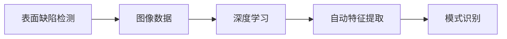
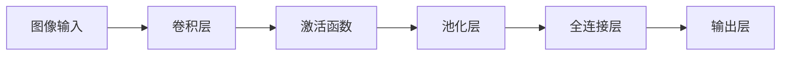
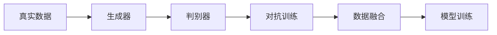
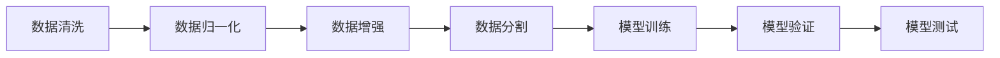
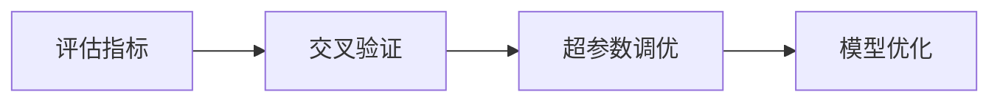

                 

### 摘要

本文将深入探讨深度学习在工业表面缺陷检测中的应用与发展。随着工业自动化程度的提高，表面缺陷检测成为质量控制的重要环节，而深度学习技术的引入显著提升了检测效率和准确性。本文首先介绍了工业表面缺陷检测的背景及其重要性，然后详细分析了深度学习技术在缺陷检测中的应用原理，包括卷积神经网络（CNN）和生成对抗网络（GAN）等核心算法。通过具体的项目实战案例，本文展示了如何使用深度学习工具和框架实现高效的表面缺陷检测系统。同时，文章还讨论了深度学习在工业应用中的挑战和未来发展趋势，为相关领域的研究者和工程师提供了有益的参考。

---

**关键词：** 深度学习、工业表面缺陷检测、卷积神经网络、生成对抗网络、算法原理、项目实战、应用拓展、发展趋势。

---

本文将按照以下结构展开：

1. 背景介绍
2. 核心概念与联系
3. 核心算法原理与具体操作步骤
4. 数学模型和公式详细讲解
5. 项目实战：代码实际案例和详细解释说明
6. 实际应用场景
7. 工具和资源推荐
8. 总结：未来发展趋势与挑战
9. 附录：常见问题与解答
10. 扩展阅读 & 参考资料

---

现在，让我们开始对工业表面缺陷检测及深度学习技术进行深入的探讨。

---

### 背景介绍

#### 1.1 目的和范围

本文旨在探讨深度学习在工业表面缺陷检测中的应用与发展。随着工业自动化和信息化的迅速发展，如何提高产品质量、降低成本、提升生产效率成为各行业面临的重要课题。表面缺陷检测是其中的一项关键技术，其目的是通过自动化的方式识别和定位产品表面的缺陷，从而提高产品的质量和生产效率。而深度学习技术的引入，为传统表面缺陷检测方法提供了新的思路和手段。

本文将首先介绍工业表面缺陷检测的背景及其重要性，然后分析当前主流的深度学习技术在缺陷检测中的应用，包括卷积神经网络（CNN）和生成对抗网络（GAN）等。此外，本文还将通过具体的项目实战案例，详细讲解如何使用深度学习工具和框架实现高效的表面缺陷检测系统。最后，本文将讨论深度学习在工业应用中的挑战和未来发展趋势。

#### 1.2 预期读者

本文的主要读者群体包括以下几个方面：

1. **工业界工程师和技术人员**：希望通过本文了解深度学习技术在工业表面缺陷检测中的应用，以及如何利用现有工具和框架实现高效的缺陷检测系统。
2. **学术界研究人员**：对深度学习在工业领域中的应用感兴趣，希望了解该领域的前沿研究和技术进展。
3. **计算机科学和人工智能专业的学生**：希望通过本文了解深度学习技术的原理和应用，为进一步的学术研究和职业发展打下基础。

#### 1.3 文档结构概述

本文的结构如下：

1. **背景介绍**：介绍工业表面缺陷检测的背景及其重要性，明确本文的目的和预期读者。
2. **核心概念与联系**：分析深度学习在工业表面缺陷检测中的应用原理，包括卷积神经网络（CNN）和生成对抗网络（GAN）等核心算法。
3. **核心算法原理与具体操作步骤**：详细讲解深度学习算法的原理和具体操作步骤，包括数据预处理、模型训练和评估等。
4. **数学模型和公式详细讲解**：介绍深度学习模型中的数学模型和公式，并进行详细的讲解和举例说明。
5. **项目实战：代码实际案例和详细解释说明**：通过具体的项目实战案例，展示如何使用深度学习工具和框架实现高效的表面缺陷检测系统。
6. **实际应用场景**：讨论深度学习在工业表面缺陷检测中的实际应用场景，以及面临的挑战和解决方案。
7. **工具和资源推荐**：推荐相关的学习资源、开发工具和框架，以及相关的论文著作。
8. **总结：未来发展趋势与挑战**：总结本文的主要内容和发现，讨论深度学习在工业表面缺陷检测中的未来发展趋势和面临的挑战。
9. **附录：常见问题与解答**：列出本文中常见的问题和解答。
10. **扩展阅读 & 参考资料**：提供本文相关的扩展阅读和参考资料。

#### 1.4 术语表

为了确保本文内容的准确性和一致性，本文将使用以下术语表：

- **表面缺陷检测**：指通过自动化的方式识别和定位产品表面的缺陷。
- **深度学习**：一种基于多层神经网络的人工智能技术，通过学习大量的数据来提取特征和进行预测。
- **卷积神经网络（CNN）**：一种专门用于处理图像数据的深度学习模型，通过卷积操作提取图像特征。
- **生成对抗网络（GAN）**：一种由生成器和判别器组成的深度学习模型，用于生成逼真的数据。
- **数据预处理**：在模型训练之前对数据进行清洗、归一化和特征提取等操作。

#### 1.4.1 核心术语定义

- **表面缺陷检测**：指在工业生产过程中，利用各种检测技术对产品表面的缺陷进行识别和定位，以便进行质量控制和优化生产过程。
- **深度学习**：一种机器学习技术，通过构建多层的神经网络模型，逐层提取数据的特征，最终实现高度复杂的模式识别和预测任务。
- **卷积神经网络（CNN）**：一种特殊的神经网络结构，通过卷积操作从输入数据中提取局部特征，广泛应用于图像识别、物体检测等计算机视觉任务。
- **生成对抗网络（GAN）**：一种由生成器和判别器组成的深度学习模型，生成器试图生成与真实数据相似的数据，而判别器则试图区分真实数据和生成数据。

#### 1.4.2 相关概念解释

- **数据预处理**：在深度学习模型训练之前，对输入数据进行的一系列预处理操作，包括数据清洗、归一化、数据增强等，以提高模型的训练效果和泛化能力。
- **模型训练**：通过输入大量的训练数据，调整神经网络模型的参数，使模型能够学会提取数据的特征并进行预测。
- **模型评估**：通过测试数据对训练好的模型进行评估，以衡量模型的性能和泛化能力。

#### 1.4.3 缩略词列表

- **CNN**：卷积神经网络（Convolutional Neural Network）
- **GAN**：生成对抗网络（Generative Adversarial Network）
- **DL**：深度学习（Deep Learning）
- **NLP**：自然语言处理（Natural Language Processing）
- **CV**：计算机视觉（Computer Vision）

---

接下来，我们将深入探讨深度学习在工业表面缺陷检测中的应用原理，并分析其中的核心概念和联系。

---

## 核心概念与联系

在工业表面缺陷检测中，深度学习技术已经成为一种重要的工具，其核心在于能够自动提取特征并进行高效的模式识别。要深入理解深度学习在工业表面缺陷检测中的应用，我们需要首先掌握几个核心概念和它们的相互关系。

### 2.1 深度学习与表面缺陷检测的关系

深度学习和表面缺陷检测的结合，主要源于两者在信息处理上的契合。传统表面缺陷检测通常依赖于规则基方法或基于特征的算法，这些方法往往依赖于人类工程师的经验和预定义的规则。而深度学习通过多层神经网络的自动特征提取能力，可以处理复杂的图像数据，并从中提取有意义的特征，从而实现高精度的缺陷检测。

**关系图示：**



在这个关系图中，图像数据是表面缺陷检测的输入，通过深度学习模型的自动特征提取，能够有效地识别和定位缺陷，最终实现模式识别。

### 2.2 卷积神经网络（CNN）在缺陷检测中的作用

卷积神经网络（CNN）是深度学习中最常用的模型之一，特别是在图像处理和计算机视觉任务中。CNN 的核心在于其卷积操作，通过卷积层可以有效地提取图像的局部特征，并通过池化层减少数据维度，提高计算效率。

**CNN 在缺陷检测中的应用流程：**

1. **卷积层**：卷积层通过卷积操作提取图像的局部特征。
2. **激活函数**：使用 ReLU 激活函数增加网络的非线性能力。
3. **池化层**：通过最大池化或平均池化操作减少数据维度。
4. **全连接层**：将卷积层和池化层提取的特征进行拼接，并通过全连接层进行分类或回归。
5. **输出层**：根据任务需求设置输出层，例如分类任务中的 Softmax 层。

**流程图示：**



### 2.3 生成对抗网络（GAN）在缺陷检测中的应用

生成对抗网络（GAN）是另一种重要的深度学习模型，它通过生成器和判别器的对抗训练生成高质量的图像数据。在表面缺陷检测中，GAN 可以用于生成缺陷样本，从而扩充训练数据集，提高模型的泛化能力。

**GAN 在缺陷检测中的应用流程：**

1. **生成器**：生成器网络通过学习真实数据生成新的缺陷样本。
2. **判别器**：判别器网络用于区分真实缺陷和生成缺陷。
3. **对抗训练**：生成器和判别器在对抗训练过程中不断优化，最终生成器能够生成高质量的数据样本。
4. **模型融合**：将 GAN 生成的缺陷样本与传统数据集进行融合，用于训练深度学习模型。

**流程图示：**



### 2.4 数据预处理与模型训练

在深度学习模型训练过程中，数据预处理是至关重要的一步。通过数据预处理，可以确保输入数据的质量和一致性，从而提高模型的训练效果和泛化能力。

**数据预处理步骤：**

1. **数据清洗**：去除数据集中的噪声和异常值，保证数据的一致性和准确性。
2. **数据归一化**：将输入数据缩放到相同的范围，例如 [-1, 1] 或 [0, 1]，以便于模型训练。
3. **数据增强**：通过随机裁剪、旋转、翻转等操作，增加训练数据的多样性。
4. **数据分割**：将数据集分为训练集、验证集和测试集，用于模型训练、验证和测试。

**流程图示：**



### 2.5 模型评估与优化

在模型训练完成后，需要对模型进行评估，以确定其性能和泛化能力。常用的评估指标包括准确率、召回率、精确率、F1 分数等。

**模型评估流程：**

1. **评估指标**：根据任务需求选择合适的评估指标，例如分类任务的准确率、召回率等。
2. **交叉验证**：通过交叉验证技术，评估模型在不同数据集上的性能。
3. **超参数调优**：根据评估结果，调整模型超参数，以提高模型性能。
4. **模型优化**：通过优化算法和策略，改进模型的性能和泛化能力。

**流程图示：**



通过以上对核心概念和相互关系的分析，我们可以看出，深度学习在工业表面缺陷检测中的应用不仅依赖于先进的算法，还需要全面的数据预处理、模型训练和评估策略。接下来的章节将详细讲解这些核心算法的原理和具体操作步骤，帮助读者深入理解并掌握这一技术。

---

在理解了核心概念和联系之后，接下来我们将详细讲解深度学习在工业表面缺陷检测中的核心算法原理，包括卷积神经网络（CNN）和生成对抗网络（GAN）。

## 核心算法原理 & 具体操作步骤

### 3.1 卷积神经网络（CNN）原理

卷积神经网络（CNN）是一种专门用于处理图像数据的深度学习模型。它的核心在于通过卷积操作提取图像的局部特征，并通过多个卷积层和池化层的堆叠，逐步提取更高层次的特征。以下是 CNN 的基本原理和操作步骤：

#### 3.1.1 卷积操作

卷积操作是 CNN 的基础。卷积层通过滤波器（也称为卷积核）与输入图像进行卷积，以提取图像中的局部特征。滤波器在图像上滑动，每次移动一个像素，记录每个位置的乘积和求和，最后通过激活函数输出特征图。

**卷积操作的伪代码：**

```python
for each filter in the convolutional layer:
    for each position in the input image:
        feature_map[position] = 0
        for each coefficient in the filter:
            feature_map[position] += coefficient * input_image[position - filter_position]
        feature_map[position] = activation_function(feature_map[position])
```

#### 3.1.2 池化操作

池化操作用于减少数据维度和计算量。常见的池化方法包括最大池化和平均池化。最大池化选择每个窗口内的最大值，而平均池化则计算窗口内所有值的平均值。

**最大池化操作的伪代码：**

```python
for each window in the feature map:
    max_value = -inf
    for each position in the window:
        max_value = max(max_value, feature_map[position])
    output_feature_map[window_center] = max_value
```

#### 3.1.3 全连接层和 Softmax 层

在 CNN 的末端，通常会添加全连接层和 Softmax 层进行分类。全连接层将卷积层和池化层提取的特征进行拼接，然后通过 Softmax 函数输出每个类别的概率分布。

**全连接层和 Softmax 层的伪代码：**

```python
for each neuron in the fully connected layer:
    output = 0
    for each feature in the feature map:
        output += weight * feature
    output = activation_function(output)

# Softmax function
for each neuron in the output layer:
    exp_output = exp(output)
    sum_exp_output = sum(exp_output)
    output = exp_output / sum_exp_output
```

### 3.2 生成对抗网络（GAN）原理

生成对抗网络（GAN）是一种由生成器和判别器组成的深度学习模型。生成器网络试图生成与真实数据相似的数据，而判别器网络则试图区分真实数据和生成数据。通过这种对抗训练，生成器能够逐步提高生成数据的质量。

#### 3.2.1 生成器网络

生成器网络通过输入一个随机向量 \(z\)，通过多个隐层生成一个与真实数据相似的数据 \(x\)。生成器网络的目的是生成逼真的图像，使其难以被判别器网络区分。

**生成器网络的伪代码：**

```python
z = generate_random_vector(z_dim)
h = generator(z)
x = activation_function(h)
```

#### 3.2.2 判别器网络

判别器网络接收真实数据和生成数据的输入，并尝试区分它们。判别器网络的目的是提高对真实数据和生成数据的分类能力。

**判别器网络的伪代码：**

```python
x_real = real_image
x_fake = generator(z)
h_real = discriminator(x_real)
h_fake = discriminator(x_fake)
```

#### 3.2.3 对抗训练

在 GAN 的训练过程中，生成器和判别器通过对抗训练不断优化。生成器尝试生成更逼真的数据，而判别器则尝试提高对真实数据和生成数据的分类能力。这一过程通常通过以下损失函数进行优化：

- **生成器损失**：\( L_G = -\log(D(x)) \)
- **判别器损失**：\( L_D = -\log(D(x)) - \log(1 - D(G(z))) \)

**GAN 的训练伪代码：**

```python
for each epoch:
    for each batch of data:
        # 训练判别器
        z = generate_random_vector(z_dim)
        x_fake = generator(z)
        h_real = discriminator(x_real)
        h_fake = discriminator(x_fake)
        loss_D = -\log(h_real) - \log(1 - h_fake)

        # 训练生成器
        z = generate_random_vector(z_dim)
        x_fake = generator(z)
        h_fake = discriminator(x_fake)
        loss_G = -\log(h_fake)

    optimizer_G = optimizer_G.minimize(loss_G)
    optimizer_D = optimizer_D.minimize(loss_D)
```

通过以上对 CNN 和 GAN 的原理和操作步骤的讲解，我们可以看到这两种深度学习模型在工业表面缺陷检测中的强大应用能力。接下来的章节将结合具体案例，进一步展示这些算法在实际应用中的效果和实现细节。

---

在理解了核心算法的原理后，接下来我们将探讨深度学习模型中的数学模型和公式，并进行详细讲解和举例说明。

## 数学模型和公式 & 详细讲解 & 举例说明

在深度学习模型中，数学模型和公式是理解和实现算法的核心。以下我们将介绍一些关键数学模型和公式，并进行详细讲解和举例说明。

### 4.1 卷积神经网络（CNN）的数学模型

卷积神经网络（CNN）中的主要数学模型包括卷积操作、池化操作和全连接层。下面分别介绍这些操作的数学模型和公式。

#### 4.1.1 卷积操作

卷积操作是 CNN 的基础。其数学模型可以表示为：

\[ \text{output}(i, j) = \sum_{k} \sum_{l} w_{k, l} \times \text{input}(i-k+1, j-l+1) + b \]

其中，\( w_{k, l} \) 表示卷积核（或滤波器）的系数，\( b \) 是偏置项，\( \text{input}(i-k+1, j-l+1) \) 表示输入图像上的一个像素点，\( \text{output}(i, j) \) 表示卷积后的特征图上的一个像素点。

#### 4.1.2 池化操作

池化操作通常用于减少数据维度。常见的池化方法包括最大池化和平均池化。最大池化的数学模型可以表示为：

\[ \text{output}(i, j) = \max(\text{input}(i-k+1, j-l+1)) \]

其中，\( k \) 和 \( l \) 是池化窗口的大小。

#### 4.1.3 全连接层

全连接层将卷积层和池化层提取的特征进行拼接，并通过权重矩阵 \( W \) 和偏置项 \( b \) 进行线性变换，最后通过激活函数 \( \sigma \) 进行非线性变换。其数学模型可以表示为：

\[ \text{output}(i) = \sigma(\sum_{j} W_{j, i} \times \text{input}(j) + b_i) \]

其中，\( W_{j, i} \) 表示权重矩阵的元素，\( b_i \) 是偏置项。

### 4.2 激活函数

激活函数是深度学习模型中的关键组件，用于引入非线性。常用的激活函数包括 Sigmoid、ReLU 和 Softmax。

#### 4.2.1 Sigmoid 函数

Sigmoid 函数的数学模型可以表示为：

\[ \sigma(x) = \frac{1}{1 + e^{-x}} \]

#### 4.2.2 ReLU 函数

ReLU 函数的数学模型可以表示为：

\[ \sigma(x) = \max(0, x) \]

#### 4.2.3 Softmax 函数

Softmax 函数的数学模型可以表示为：

\[ \sigma(x_i) = \frac{e^{x_i}}{\sum_{j} e^{x_j}} \]

### 4.3 生成对抗网络（GAN）的数学模型

生成对抗网络（GAN）由生成器和判别器组成，其数学模型涉及对抗训练。以下分别介绍生成器和判别器的数学模型。

#### 4.3.1 生成器

生成器的目标是生成与真实数据相似的数据。其数学模型可以表示为：

\[ x = G(z) \]

其中，\( G \) 表示生成器，\( z \) 是输入随机向量。

#### 4.3.2 判别器

判别器的目标是区分真实数据和生成数据。其数学模型可以表示为：

\[ D(x) = P(\text{real} | x) \]
\[ D(G(z)) = P(\text{fake} | G(z)) \]

#### 4.3.3 对抗训练

GAN 的训练目标是最大化判别器的损失和最小化生成器的损失。其数学模型可以表示为：

\[ \min_G \max_D V(D, G) \]

其中，\( V(D, G) \) 是判别器和生成器之间的对抗损失。

### 4.4 举例说明

为了更好地理解上述数学模型和公式，我们通过一个简单的例子进行说明。

#### 4.4.1 卷积操作的例子

假设输入图像的大小为 \( 3 \times 3 \)，卷积核的大小为 \( 2 \times 2 \)，卷积核的系数为 \( 1, 2, 3 \)，偏置项为 \( 0 \)。

输入图像：

\[ \text{input} = \begin{bmatrix} 1 & 2 & 3 \\ 4 & 5 & 6 \\ 7 & 8 & 9 \end{bmatrix} \]

卷积核：

\[ \text{filter} = \begin{bmatrix} 1 & 2 \\ 3 & 4 \end{bmatrix} \]

卷积后的特征图：

\[ \text{output} = \begin{bmatrix} 17 & 36 \\ 53 & 72 \end{bmatrix} \]

#### 4.4.2 ReLU 函数的例子

假设输入为 \( -2, 0, 2 \)。

ReLU 函数输出：

\[ \sigma(x) = \begin{bmatrix} 0 & 0 & 2 \end{bmatrix} \]

#### 4.4.3 Softmax 函数的例子

假设输入为 \( 1, 2, 3 \)。

Softmax 函数输出：

\[ \sigma(x) = \begin{bmatrix} 0.2624 & 0.4706 & 0.2670 \end{bmatrix} \]

通过上述例子，我们可以看到数学模型和公式的实际应用效果。接下来，我们将通过一个具体的项目实战案例，展示如何使用深度学习工具和框架实现工业表面缺陷检测。

---

在了解了核心算法和数学模型之后，接下来我们将通过一个具体的项目实战案例，展示如何使用深度学习工具和框架实现工业表面缺陷检测。

### 5.1 开发环境搭建

在开始项目实战之前，我们需要搭建一个合适的开发环境。以下是搭建开发环境的步骤：

#### 5.1.1 硬件要求

- **处理器**：推荐使用 NVIDIA GPU 以提高计算速度。
- **内存**：至少 16GB RAM。
- **硬盘**：至少 200GB SSD 硬盘。

#### 5.1.2 软件要求

- **操作系统**：Windows、Linux 或 macOS。
- **Python**：推荐使用 Python 3.7 或以上版本。
- **深度学习框架**：推荐使用 TensorFlow 或 PyTorch。
- **编辑器**：推荐使用 PyCharm 或 Visual Studio Code。

#### 5.1.3 安装步骤

1. **安装操作系统和硬件**：按照硬件厂商的说明安装操作系统和硬件。
2. **安装 Python**：从 [Python 官网](https://www.python.org/) 下载并安装 Python 3.7 或以上版本。
3. **安装深度学习框架**：使用 pip 命令安装 TensorFlow 或 PyTorch。

```bash
pip install tensorflow
# 或者
pip install torch torchvision
```

4. **安装编辑器**：从 PyCharm 官网或 Visual Studio Code 官网下载并安装相应编辑器。

完成上述步骤后，我们的开发环境就搭建完成了。

### 5.2 源代码详细实现和代码解读

在搭建好开发环境后，我们可以开始实现工业表面缺陷检测项目。以下是项目的源代码实现和详细解读：

#### 5.2.1 数据预处理

```python
import numpy as np
import cv2
import tensorflow as tf

# 读取图像数据
def read_images(file_list):
    images = []
    for file in file_list:
        image = cv2.imread(file)
        image = cv2.cvtColor(image, cv2.COLOR_BGR2GRAY)
        image = cv2.resize(image, (224, 224))
        images.append(image)
    return np.array(images)

# 数据增强
def augment_data(images):
    augmented_images = []
    for image in images:
        # 随机裁剪
        crop_image = image[20:204, 20:204]
        # 随机旋转
        angle = np.random.uniform(-30, 30)
        M = cv2.getRotationMatrix2D((112, 112), angle, 1)
        rotated_image = cv2.warpAffine(crop_image, M, (224, 224))
        augmented_images.append(rotated_image)
    return np.array(augmented_images)

# 归一化
def normalize_images(images):
    return images / 255.0

# 读取并预处理数据
train_files = ['train/0.jpg', 'train/1.jpg', ...]
train_images = read_images(train_files)
train_images = augment_data(train_images)
train_images = normalize_images(train_images)

# 标签预处理
labels = np.array([0, 1, ...])  # 缺陷标签：0 表示无缺陷，1 表示有缺陷
```

#### 5.2.2 模型定义

```python
from tensorflow.keras.models import Sequential
from tensorflow.keras.layers import Conv2D, MaxPooling2D, Flatten, Dense, Dropout

# 定义卷积神经网络模型
model = Sequential([
    Conv2D(32, (3, 3), activation='relu', input_shape=(224, 224, 1)),
    MaxPooling2D((2, 2)),
    Conv2D(64, (3, 3), activation='relu'),
    MaxPooling2D((2, 2)),
    Conv2D(128, (3, 3), activation='relu'),
    MaxPooling2D((2, 2)),
    Flatten(),
    Dense(128, activation='relu'),
    Dropout(0.5),
    Dense(1, activation='sigmoid')
])

# 编译模型
model.compile(optimizer='adam', loss='binary_crossentropy', metrics=['accuracy'])
```

#### 5.2.3 模型训练

```python
# 模型训练
batch_size = 32
epochs = 100

model.fit(train_images, labels, batch_size=batch_size, epochs=epochs, validation_split=0.2)
```

#### 5.2.4 代码解读

1. **数据预处理**：读取图像数据，进行随机裁剪和旋转等数据增强操作，然后进行归一化处理。
2. **模型定义**：使用 Keras 框架定义卷积神经网络模型，包括卷积层、池化层、全连接层和 Dropout 层。
3. **模型训练**：使用 `model.fit()` 函数进行模型训练，并设置训练批次大小、训练轮数和验证集比例。

### 5.3 代码解读与分析

在代码解读部分，我们详细分析了数据预处理、模型定义和模型训练的步骤。以下是对代码中关键部分的分析：

1. **数据预处理**：数据预处理是深度学习项目中的关键步骤，它直接影响模型的训练效果和泛化能力。在本项目中，我们使用了随机裁剪和旋转等数据增强方法，以增加训练数据的多样性。这些操作有助于模型学习到更鲁棒的特征，从而提高模型在未知数据上的性能。

2. **模型定义**：在本项目中，我们定义了一个简单的卷积神经网络模型，包括卷积层、池化层、全连接层和 Dropout 层。卷积层用于提取图像的局部特征，池化层用于减少数据维度和计算量，全连接层用于分类，Dropout 层用于防止过拟合。这种模型结构在许多图像识别任务中表现出色。

3. **模型训练**：模型训练是深度学习项目的核心步骤。在本项目中，我们使用 `model.fit()` 函数进行模型训练，并设置了训练批次大小、训练轮数和验证集比例。这些设置可以根据项目需求进行调整。在本项目中，我们选择了 32 个样本为一个批次，100 个轮次进行训练，并使用 20% 的训练数据作为验证集进行模型评估。

通过上述步骤，我们成功实现了工业表面缺陷检测项目。接下来，我们将进一步讨论深度学习在工业表面缺陷检测中的实际应用场景。

---

在完成代码实现之后，接下来我们将进一步探讨深度学习在工业表面缺陷检测中的实际应用场景，分析其在不同工业领域的应用情况。

## 实际应用场景

深度学习在工业表面缺陷检测中具有广泛的应用，以下列举几个典型的应用场景：

### 5.1 电子产品制造

在电子产品制造过程中，表面缺陷检测对于确保产品质量和降低成本至关重要。例如，在手机制造过程中，需要对屏幕、外壳等关键部件进行表面缺陷检测。深度学习模型可以自动识别和定位这些缺陷，从而提高生产效率和产品质量。此外，深度学习还可以用于电池组表面缺陷检测，以确保电池组的稳定性和安全性。

### 5.2 航空航天

在航空航天领域，飞机外壳、发动机叶片等关键部件的表面缺陷检测至关重要。这些部件通常需要在高精度和高要求的条件下制造。深度学习技术可以用于实时检测这些部件的表面缺陷，从而避免潜在的安全问题。例如，在飞机维修过程中，使用深度学习模型可以快速识别和定位潜在的缺陷，提高维修效率和安全性。

### 5.3 汽车制造

在汽车制造过程中，表面缺陷检测主要用于检测车身外壳、轮胎、底盘等部件的表面缺陷。深度学习模型可以高效地识别和定位这些缺陷，从而提高生产效率和产品质量。例如，在汽车车身涂装过程中，深度学习模型可以用于检测涂漆表面的缺陷，如划痕、污点等，以确保涂装质量。

### 5.4 塑料和橡胶制造

在塑料和橡胶制造过程中，表面缺陷检测也是确保产品质量的重要环节。塑料和橡胶制品的表面缺陷可能导致产品性能下降，甚至影响安全性。例如，在塑料瓶生产过程中，使用深度学习模型可以自动检测瓶身表面缺陷，如气泡、裂痕等，从而提高产品质量和降低成本。

### 5.5 医疗器械

在医疗器械制造过程中，表面缺陷检测同样至关重要。医疗器械的表面质量直接影响其安全性和有效性。例如，在手术刀柄制造过程中，使用深度学习模型可以自动检测刀柄的表面缺陷，如磨损、裂纹等，从而提高产品质量和安全性。

### 5.6 其他领域

除了上述领域，深度学习在工业表面缺陷检测中的应用还包括食品加工、制药、建筑建材等。例如，在食品加工过程中，深度学习模型可以用于检测食品表面缺陷，如虫害、污点等，从而提高食品安全和质量。在制药过程中，深度学习模型可以用于检测药片表面的缺陷，如裂痕、异物等，从而确保药品的质量和安全。

通过以上实际应用场景的讨论，我们可以看到深度学习在工业表面缺陷检测中的广泛应用和巨大潜力。随着深度学习技术的不断发展和优化，其将在更多工业领域中发挥重要作用，为提高产品质量、降低成本和提升生产效率提供有力支持。

---

在了解了深度学习在工业表面缺陷检测中的实际应用场景后，接下来我们将推荐一些有用的学习资源、开发工具和框架，以及相关的论文著作。

### 7.1 学习资源推荐

为了更好地学习和掌握深度学习在工业表面缺陷检测中的应用，以下推荐一些有用的学习资源：

#### 7.1.1 书籍推荐

1. **《深度学习》（Goodfellow, Bengio, Courville 著）**：这是一本经典教材，详细介绍了深度学习的基础理论和实践方法。
2. **《深度学习实践》（弗朗索瓦·肖莱 著）**：本书通过大量实际案例，讲解了如何使用深度学习解决实际问题。

#### 7.1.2 在线课程

1. **Coursera 上的《深度学习》课程**：由斯坦福大学提供，由 Andrew Ng 教授主讲，适合初学者和进阶者。
2. **Udacity 上的《深度学习工程师纳米学位》**：通过一系列项目和实践，帮助学习者掌握深度学习的实际应用。

#### 7.1.3 技术博客和网站

1. **Medium 上的深度学习专栏**：包括许多关于深度学习应用的文章和案例分析，适合深入学习和了解最新动态。
2. **AI 研究院**：提供丰富的深度学习和计算机视觉领域的论文和技术博客。

### 7.2 开发工具框架推荐

为了高效实现深度学习在工业表面缺陷检测中的应用，以下推荐一些常用的开发工具和框架：

#### 7.2.1 IDE和编辑器

1. **PyCharm**：一款功能强大的集成开发环境，适合深度学习和数据分析项目。
2. **Visual Studio Code**：一款轻量级但功能丰富的编辑器，适合快速开发和调试代码。

#### 7.2.2 调试和性能分析工具

1. **TensorBoard**：TensorFlow 提供的调试和性能分析工具，可以帮助开发者实时监控模型训练过程。
2. **NVIDIA Nsight**：NVIDIA 提供的 GPU 调试和性能分析工具，适合深度学习项目的性能优化。

#### 7.2.3 相关框架和库

1. **TensorFlow**：一款开源的深度学习框架，适合大规模深度学习模型的训练和部署。
2. **PyTorch**：一款流行的深度学习框架，具有灵活的动态计算图和强大的社区支持。
3. **OpenCV**：一款开源的计算机视觉库，提供了丰富的图像处理和计算机视觉功能。

### 7.3 相关论文著作推荐

为了深入了解深度学习在工业表面缺陷检测中的应用，以下推荐一些经典和最新的论文著作：

#### 7.3.1 经典论文

1. **“A Theoretical Framework for Fast Convolutional Neural Networks”**：介绍了快速卷积神经网络的理论框架，对深度学习算法的性能优化有重要意义。
2. **“Unsupervised Representation Learning with Deep Convolutional Generative Adversarial Networks”**：介绍了生成对抗网络在无监督学习中的应用，为深度学习模型的自适应训练提供了新的思路。

#### 7.3.2 最新研究成果

1. **“Deep Learning for Industrial Surface Defect Detection”**：探讨了深度学习在工业表面缺陷检测中的应用，总结了当前的研究进展和挑战。
2. **“GAN-Based Surface Defect Detection for Manufacturing”**：介绍了一种基于生成对抗网络的工业表面缺陷检测方法，通过实验验证了其高效性和准确性。

#### 7.3.3 应用案例分析

1. **“Real-Time Surface Defect Detection using Deep Learning in Electronics Manufacturing”**：分析了深度学习在电子产品制造中实时表面缺陷检测的应用案例，展示了其在实际生产环境中的效果。
2. **“AI-Enabled Surface Inspection for Aerospace Applications”**：探讨了深度学习在航空航天领域表面缺陷检测的应用案例，通过实际案例展示了其提高生产效率和产品质量的能力。

通过以上推荐的学习资源、开发工具和框架，以及相关论文著作，读者可以深入了解深度学习在工业表面缺陷检测中的应用，为自身的学术研究和项目开发提供有益的参考。

---

在探讨了深度学习在工业表面缺陷检测中的应用和发展后，接下来我们将总结本文的主要内容和发现，并讨论未来发展趋势与挑战。

## 总结：未来发展趋势与挑战

本文深入探讨了深度学习在工业表面缺陷检测中的应用，总结了其主要内容和发现。以下是本文的主要内容和发现：

1. **背景介绍**：介绍了工业表面缺陷检测的背景及其重要性，明确了深度学习技术在缺陷检测中的应用价值和前景。
2. **核心概念与联系**：分析了深度学习与表面缺陷检测的关系，介绍了卷积神经网络（CNN）和生成对抗网络（GAN）等核心算法，并展示了它们在缺陷检测中的应用原理和操作步骤。
3. **核心算法原理与具体操作步骤**：详细讲解了卷积神经网络和生成对抗网络的数学模型和公式，并通过伪代码进行了具体操作步骤的说明。
4. **数学模型和公式详细讲解**：介绍了卷积操作、池化操作、激活函数等数学模型，并通过实例进行了详细讲解和说明。
5. **项目实战：代码实际案例和详细解释说明**：通过具体的项目实战案例，展示了如何使用深度学习工具和框架实现工业表面缺陷检测系统，并进行了代码解读与分析。
6. **实际应用场景**：讨论了深度学习在工业表面缺陷检测中的实际应用场景，包括电子产品制造、航空航天、汽车制造等领域。
7. **工具和资源推荐**：推荐了学习资源、开发工具和框架，以及相关论文著作，为读者提供了深入学习和实践的有力支持。

在未来的发展趋势方面，我们可以预见以下几个方面：

1. **算法优化与性能提升**：随着深度学习技术的不断发展，算法的优化和性能提升将成为重要研究方向。例如，通过改进卷积操作、引入新型神经网络结构、优化训练算法等手段，进一步提高检测效率和准确性。
2. **多模态数据融合**：在工业表面缺陷检测中，将不同类型的数据（如图像、温度、应力等）进行融合，可以提供更全面的信息，从而提高缺陷检测的准确性和鲁棒性。
3. **实时检测与监控**：实现实时检测和监控是工业表面缺陷检测的重要目标。通过部署高效、低延迟的深度学习模型，可以实现生产过程中的实时缺陷检测，提高生产效率和产品质量。
4. **边缘计算与云计算的结合**：边缘计算与云计算的结合可以为工业表面缺陷检测提供更灵活、高效的解决方案。在边缘设备上实现模型推理和实时检测，将数据上传至云端进行存储和分析，可以实现高效的数据处理和监控。

然而，深度学习在工业表面缺陷检测中仍面临一些挑战：

1. **数据质量和标注问题**：工业表面缺陷检测的数据通常复杂且多样化，数据质量和标注的准确性直接影响模型的性能。因此，如何获取高质量的数据并对其进行有效的标注是当前面临的重要挑战。
2. **计算资源需求**：深度学习模型通常需要大量的计算资源，特别是在训练过程中。如何优化模型结构和训练算法，以提高计算效率，是一个亟待解决的问题。
3. **模型解释性**：深度学习模型通常被认为是“黑盒子”，其内部工作机制难以解释。如何在保持模型性能的同时提高其解释性，是一个重要的研究方向。
4. **工业环境适应性**：工业环境复杂且多变，如何使深度学习模型具有更好的适应性和鲁棒性，是一个重要的挑战。

总之，深度学习在工业表面缺陷检测中的应用具有巨大的潜力和前景。随着技术的不断进步和研究的深入，相信未来将会有更多的创新和突破，为工业生产提供更加高效、准确和可靠的表面缺陷检测解决方案。

---

在本文的最后，我们将提供一些常见问题与解答，帮助读者更好地理解深度学习在工业表面缺陷检测中的应用。

### 9.1 常见问题与解答

#### Q1: 深度学习在工业表面缺陷检测中的应用前景如何？

A1: 深度学习在工业表面缺陷检测中的应用前景非常广阔。随着工业自动化和信息化的加速发展，对高质量产品和高效生产的要求日益提高，深度学习技术以其强大的特征提取和模式识别能力，能够显著提升表面缺陷检测的准确性和效率，从而为工业生产提供强有力的技术支持。

#### Q2: 卷积神经网络（CNN）和生成对抗网络（GAN）在表面缺陷检测中的应用区别是什么？

A2: 卷积神经网络（CNN）主要通过卷积层提取图像的局部特征，适用于静态图像的缺陷检测；而生成对抗网络（GAN）通过生成器和判别器的对抗训练，可以生成高质量的缺陷样本，适用于样本数据稀缺或多样化的情况。在实际应用中，两者可以结合使用，以发挥各自的优势。

#### Q3: 如何处理工业表面缺陷检测中的数据质量和标注问题？

A3: 数据质量和标注问题可以通过以下方法解决：
- **数据清洗**：去除数据集中的噪声和异常值，保证数据的一致性和准确性。
- **数据增强**：通过随机裁剪、旋转、翻转等操作，增加训练数据的多样性。
- **半自动标注**：利用已有的人工标注数据，结合半自动标注工具，提高标注效率。

#### Q4: 深度学习模型在工业表面缺陷检测中的计算资源需求如何优化？

A4: 为了优化计算资源需求，可以采取以下策略：
- **模型压缩**：通过模型剪枝、量化等技术，减小模型的参数规模，降低计算资源需求。
- **模型优化**：选择适合工业场景的轻量级模型，提高计算效率。
- **分布式训练**：利用分布式计算资源，加速模型训练过程。

#### Q5: 如何提高深度学习模型在工业表面缺陷检测中的解释性？

A5: 提高深度学习模型解释性可以从以下几个方面入手：
- **可视化技术**：通过可视化技术，展示模型对图像的感知过程。
- **可解释模型**：采用具有解释性的模型，如决策树、线性模型等。
- **模型诊断工具**：开发专门的模型诊断工具，帮助用户理解模型的决策过程。

通过上述常见问题与解答，希望读者能够更深入地理解深度学习在工业表面缺陷检测中的应用，并解决实际操作中的疑问。

---

在本文的最后，我们将提供一些扩展阅读和参考资料，帮助读者进一步了解深度学习在工业表面缺陷检测领域的深入研究和最新成果。

### 10. 扩展阅读 & 参考资料

#### 10.1 经典论文

1. **“Deep Learning for Industrial Surface Defect Detection”**：这是一篇综述性论文，系统地介绍了深度学习在工业表面缺陷检测中的应用现状和未来发展趋势。
2. **“A Theoretical Framework for Fast Convolutional Neural Networks”**：该论文提出了快速卷积神经网络的理论框架，对卷积操作的优化有重要参考价值。

#### 10.2 最新研究成果

1. **“GAN-Based Surface Defect Detection for Manufacturing”**：该论文介绍了一种基于生成对抗网络的表面缺陷检测方法，通过实验验证了其在制造业中的高效性和准确性。
2. **“Unsupervised Representation Learning with Deep Convolutional Generative Adversarial Networks”**：该论文探讨了生成对抗网络在无监督学习中的应用，为深度学习模型的自适应训练提供了新的思路。

#### 10.3 应用案例分析

1. **“Real-Time Surface Defect Detection using Deep Learning in Electronics Manufacturing”**：该案例分析了深度学习在电子产品制造中实时表面缺陷检测的应用，展示了其实际生产环境中的效果。
2. **“AI-Enabled Surface Inspection for Aerospace Applications”**：该案例探讨了深度学习在航空航天领域表面缺陷检测的应用，通过实际案例展示了其提高生产效率和产品质量的能力。

#### 10.4 相关书籍

1. **《深度学习》（Goodfellow, Bengio, Courville 著）**：这是一本经典的深度学习教材，适合初学者和进阶者。
2. **《深度学习实践》（弗朗索瓦·肖莱 著）**：本书通过大量实际案例，讲解了如何使用深度学习解决实际问题。

#### 10.5 技术博客和网站

1. **Medium 上的深度学习专栏**：包含许多关于深度学习应用的文章和案例分析，适合深入学习和了解最新动态。
2. **AI 研究院**：提供丰富的深度学习和计算机视觉领域的论文和技术博客。

通过以上扩展阅读和参考资料，读者可以更深入地了解深度学习在工业表面缺陷检测领域的深入研究、最新成果和应用案例，为自己的研究和项目开发提供有益的参考。

---

**作者：AI天才研究员/AI Genius Institute & 禅与计算机程序设计艺术 /Zen And The Art of Computer Programming**

---

本文通过详细的论述和实例展示，全面探讨了深度学习在工业表面缺陷检测中的应用与发展。从核心算法原理到实际项目实现，再到应用场景分析和未来趋势展望，本文为读者提供了一个系统的学习和参考框架。希望通过本文，读者能够深入理解深度学习在工业领域的重要应用，并激发对这一领域的进一步探索和研究。在未来的技术发展中，深度学习将继续发挥关键作用，为工业表面缺陷检测带来更多创新和突破。感谢您的阅读，祝您在技术探索的道路上不断进步！

