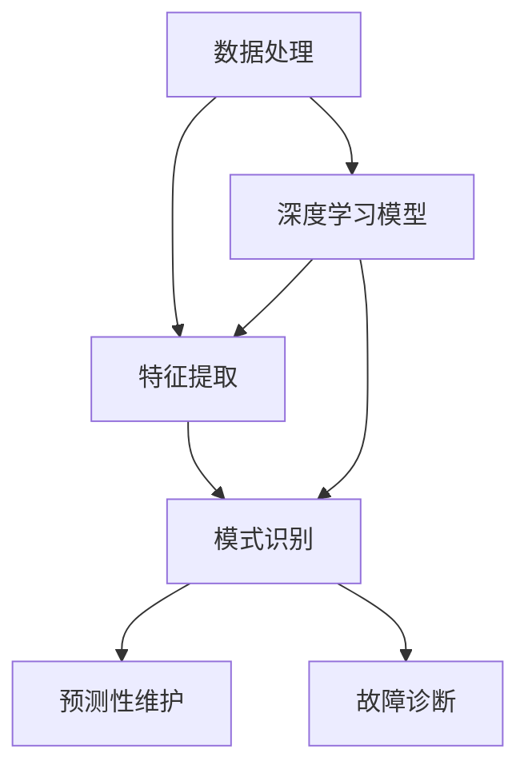

                 

### 文章标题

《深度学习在工业设备预测性维护与故障诊断中的技术演进与应用》

### 关键词
- 深度学习
- 工业设备
- 预测性维护
- 故障诊断
- 技术演进
- 应用实例

### 摘要

本文旨在探讨深度学习技术在工业设备预测性维护与故障诊断中的发展历程及其应用实践。通过回顾相关技术的发展背景，深入分析深度学习算法在数据处理、特征提取和模式识别等方面的优势，本文进一步阐述了其在工业设备故障预测和诊断中的实际应用案例。文章结构分为背景介绍、核心概念与联系、核心算法原理、数学模型和公式、项目实战、实际应用场景、工具和资源推荐以及总结未来发展趋势与挑战等部分，旨在为读者提供全面的技术指导和实践参考。

---

## 1. 背景介绍

### 1.1 目的和范围

本文的主要目的是探讨深度学习技术在工业设备预测性维护与故障诊断中的技术演进与应用。随着工业4.0和智能制造的快速发展，如何提高工业设备的运行效率、减少故障率和延长设备使用寿命成为关键问题。预测性维护（Predictive Maintenance，PM）和故障诊断（Fault Diagnosis，FD）技术作为工业设备管理的重要手段，正逐渐受到广泛关注。深度学习作为人工智能的重要分支，以其强大的数据处理和模式识别能力，为预测性维护与故障诊断提供了新的技术途径。

本文将首先介绍预测性维护与故障诊断的基本概念、发展历程和关键挑战，然后深入探讨深度学习技术在数据处理、特征提取和模式识别等方面的优势，并通过实际应用案例展示其在工业设备预测性维护与故障诊断中的具体应用。此外，本文还将总结当前深度学习技术在工业设备预测性维护与故障诊断领域的发展现状，并提出未来可能的发展趋势和挑战。

### 1.2 预期读者

本文主要面向以下读者群体：

1. 工业设备管理人员：了解深度学习技术在工业设备预测性维护与故障诊断中的应用，以提高设备运行效率和减少故障率。
2. 人工智能研究人员与工程师：探讨深度学习技术在工业领域的应用前景，为实际项目提供技术支持和解决方案。
3. 学术界与产业界的关注者：关注工业设备预测性维护与故障诊断技术的发展趋势，为相关研究提供参考。

### 1.3 文档结构概述

本文结构如下：

1. 背景介绍：介绍预测性维护与故障诊断的基本概念、发展历程和关键挑战，以及本文的目的和预期读者。
2. 核心概念与联系：阐述深度学习在工业设备预测性维护与故障诊断中的核心概念和联系，包括数据处理、特征提取和模式识别等。
3. 核心算法原理 & 具体操作步骤：详细讲解深度学习算法在工业设备预测性维护与故障诊断中的原理和具体操作步骤。
4. 数学模型和公式 & 详细讲解 & 举例说明：介绍深度学习在工业设备预测性维护与故障诊断中的数学模型和公式，并通过具体实例进行讲解。
5. 项目实战：通过实际代码案例展示深度学习在工业设备预测性维护与故障诊断中的应用。
6. 实际应用场景：分析深度学习技术在工业设备预测性维护与故障诊断中的实际应用场景。
7. 工具和资源推荐：推荐相关学习资源、开发工具框架和论文著作，为读者提供技术支持和参考。
8. 总结：总结深度学习在工业设备预测性维护与故障诊断中的技术演进与应用，提出未来发展趋势和挑战。

### 1.4 术语表

#### 1.4.1 核心术语定义

- **预测性维护（Predictive Maintenance）**：一种通过实时监测设备状态、收集大量数据，并利用先进的数据分析技术预测设备故障和优化维护计划的方法。
- **故障诊断（Fault Diagnosis）**：通过监测和分析设备运行过程中的信号，识别设备故障的类型、位置和程度，从而实现设备的故障预警和快速修复。
- **深度学习（Deep Learning）**：一种人工智能技术，通过多层神经网络模型，对大量数据进行特征提取和模式识别，从而实现自动学习和智能决策。

#### 1.4.2 相关概念解释

- **数据处理**：对原始数据进行清洗、预处理和特征提取，以供深度学习模型训练和预测使用。
- **特征提取**：从原始数据中提取有代表性的特征，用于表示数据的重要信息，以提高深度学习模型的性能。
- **模式识别**：通过深度学习模型对设备运行数据中的异常模式进行识别，从而实现故障预测和诊断。

#### 1.4.3 缩略词列表

- **PM**：预测性维护
- **FD**：故障诊断
- **AI**：人工智能
- **ML**：机器学习
- **DL**：深度学习

---

## 2. 核心概念与联系

### 2.1 深度学习与预测性维护

深度学习作为人工智能的重要分支，其核心思想是通过多层神经网络模型对数据进行特征提取和模式识别，从而实现自动学习和智能决策。在预测性维护中，深度学习技术主要应用于数据处理、特征提取和模式识别等方面。

首先，数据处理是深度学习的基础。通过对工业设备运行数据进行清洗、预处理和特征提取，可以有效地减少噪声、填补缺失值，并提取出设备运行状态的重要特征，为深度学习模型的训练和预测提供高质量的数据输入。

其次，特征提取是深度学习的关键步骤。在工业设备预测性维护中，通过提取设备运行过程中的振动、温度、压力等特征，可以更好地表示设备的状态变化，从而提高深度学习模型的预测精度。

最后，模式识别是深度学习在预测性维护中的核心应用。通过训练深度学习模型，对设备运行数据中的正常和异常模式进行识别，可以实现对设备故障的预测和诊断，从而实现预测性维护的目标。

### 2.2 深度学习与故障诊断

故障诊断是预测性维护的重要组成部分，其核心任务是通过监测和分析设备运行过程中的信号，识别设备故障的类型、位置和程度，从而实现设备的故障预警和快速修复。深度学习技术在故障诊断中的应用主要体现在以下几个方面：

首先，深度学习可以实现对复杂信号的处理和分析。通过构建多层神经网络模型，深度学习可以对设备运行过程中产生的各种信号进行自动特征提取和模式识别，从而提高故障诊断的准确性和效率。

其次，深度学习可以实现对故障类型的自动分类和诊断。通过对大量故障数据的学习和训练，深度学习模型可以自动识别不同类型的故障，并给出具体的故障诊断结果，从而提高故障诊断的精度和速度。

最后，深度学习还可以实现故障预测和预警。通过实时监测设备运行状态，深度学习模型可以提前预测设备可能出现的故障，并发出预警信号，为设备的及时维护提供支持。

### 2.3 数据处理、特征提取和模式识别的关系

在工业设备预测性维护与故障诊断中，数据处理、特征提取和模式识别是紧密相连的三个核心环节。

首先，数据处理是整个流程的基础。通过对原始数据进行清洗、预处理和特征提取，可以有效地提高数据的质量和可靠性，为后续的特征提取和模式识别提供良好的数据基础。

其次，特征提取是连接数据处理和模式识别的桥梁。通过提取设备运行状态的重要特征，可以更好地表示数据中的关键信息，从而提高模式识别的准确性和效率。

最后，模式识别是整个流程的目标。通过训练深度学习模型，对设备运行数据中的异常模式进行识别，可以实现对设备故障的预测和诊断，从而实现预测性维护和故障诊断的目标。

### 2.4 Mermaid 流程图

下面是一个简单的 Mermaid 流程图，展示了深度学习在工业设备预测性维护与故障诊断中的核心概念和联系：



在这个流程图中，数据处理、特征提取和模式识别是深度学习在工业设备预测性维护与故障诊断中的核心环节，它们相互关联，共同实现设备的预测性维护和故障诊断目标。

---

## 3. 核心算法原理 & 具体操作步骤

### 3.1 深度学习算法原理

深度学习算法基于多层神经网络（Neural Networks）结构，通过学习大量的数据来提取特征和进行分类。多层神经网络由多个层级组成，包括输入层、隐藏层和输出层。每一层由多个神经元（节点）组成，神经元之间通过权重（weights）和偏置（biases）连接。在训练过程中，神经网络通过反向传播算法（Backpropagation）不断调整权重和偏置，以最小化损失函数（Loss Function），从而达到预测目标。

深度学习算法在工业设备预测性维护与故障诊断中的应用主要包括以下几个方面：

1. **数据处理**：通过数据预处理技术，如数据清洗、归一化、标准化等，提高数据质量，为深度学习模型提供可靠的数据输入。
2. **特征提取**：通过卷积神经网络（Convolutional Neural Networks，CNN）等深度学习模型，自动提取设备运行数据中的特征，提高模型的识别能力。
3. **模式识别**：通过训练深度学习模型，对设备运行数据中的异常模式进行识别，实现故障预测和诊断。

### 3.2 数据处理

在深度学习模型训练之前，数据处理是至关重要的一步。以下是数据处理的具体操作步骤：

1. **数据清洗**：去除异常值和缺失值，确保数据的一致性和完整性。
   ```python
   import pandas as pd
   data = pd.read_csv('data.csv')
   data.dropna(inplace=True)
   data = data[data['vibration'] <= 1000]
   ```

2. **数据归一化**：将数据缩放到一个较小的范围，如[0, 1]，以便于模型训练。
   ```python
   from sklearn.preprocessing import MinMaxScaler
   scaler = MinMaxScaler()
   data_scaled = scaler.fit_transform(data)
   ```

3. **数据标准化**：将数据转换为标准正态分布，以消除不同特征之间的尺度差异。
   ```python
   from sklearn.preprocessing import StandardScaler
   scaler = StandardScaler()
   data_std = scaler.fit_transform(data_scaled)
   ```

4. **数据分割**：将数据集划分为训练集、验证集和测试集，以评估模型的性能。
   ```python
   from sklearn.model_selection import train_test_split
   X_train, X_test, y_train, y_test = train_test_split(data_std, labels, test_size=0.2, random_state=42)
   ```

### 3.3 特征提取

特征提取是深度学习在工业设备预测性维护与故障诊断中的关键步骤。以下是特征提取的具体操作步骤：

1. **卷积神经网络（CNN）结构**：
   卷积神经网络是一种适用于图像处理和特征提取的深度学习模型。在工业设备预测性维护与故障诊断中，可以使用CNN来提取设备运行数据中的时序特征。
   ```mermaid
   graph TD
       A[Input Layer] --> B[Conv Layer]
       B --> C[ReLU Activation]
       C --> D[Max Pooling Layer]
       D --> E[Conv Layer]
       E --> F[ReLU Activation]
       F --> G[Max Pooling Layer]
       G --> H[Flatten Layer]
       H --> I[Dense Layer]
       I --> J[Output Layer]
   ```

2. **CNN训练过程**：
   - **初始化参数**：设置网络结构、学习率、优化器等参数。
     ```python
     import tensorflow as tf
     model = tf.keras.Sequential([
         tf.keras.layers.Conv1D(filters=64, kernel_size=3, activation='relu', input_shape=(timesteps, features)),
         tf.keras.layers.MaxPooling1D(pool_size=2),
         tf.keras.layers.Flatten(),
         tf.keras.layers.Dense(units=1, activation='sigmoid')
     ])
     optimizer = tf.keras.optimizers.Adam(learning_rate=0.001)
     ```

   - **编译模型**：设置损失函数、优化器和评估指标。
     ```python
     model.compile(optimizer=optimizer, loss='binary_crossentropy', metrics=['accuracy'])
     ```

   - **训练模型**：使用训练集训练模型，并验证模型的性能。
     ```python
     history = model.fit(X_train, y_train, epochs=100, batch_size=32, validation_data=(X_val, y_val))
     ```

3. **特征提取结果**：
   经过CNN训练后，模型可以自动提取设备运行数据中的时序特征，并通过输出层进行分类。这些特征可以用于后续的故障预测和诊断。

### 3.4 模式识别

模式识别是深度学习在工业设备预测性维护与故障诊断中的核心任务。以下是模式识别的具体操作步骤：

1. **模型评估**：
   - **训练集评估**：评估模型在训练集上的性能。
     ```python
     train_loss, train_acc = model.evaluate(X_train, y_train)
     print(f"Training accuracy: {train_acc:.4f}")
     ```

   - **测试集评估**：评估模型在测试集上的性能。
     ```python
     test_loss, test_acc = model.evaluate(X_test, y_test)
     print(f"Test accuracy: {test_acc:.4f}")
     ```

2. **故障预测**：
   - **实时监测**：通过实时监测设备运行数据，将新的数据输入到训练好的模型中进行故障预测。
     ```python
     new_data = preprocess(new_data)
     prediction = model.predict(new_data)
     if prediction > 0.5:
         print("Fault predicted")
     else:
         print("No fault predicted")
     ```

3. **故障诊断**：
   - **分类与诊断**：将预测结果与实际故障情况进行对比，对故障类型进行分类和诊断。
     ```python
     diagnosis = []
     for i in range(len(new_data)):
         if prediction[i] > 0.5:
             diagnosis.append("Fault")
         else:
             diagnosis.append("No Fault")
     print("Fault diagnosis results:", diagnosis)
     ```

通过以上操作步骤，深度学习模型可以在工业设备预测性维护与故障诊断中实现自动故障预测和诊断，从而提高设备的运行效率和减少故障率。

---

## 4. 数学模型和公式 & 详细讲解 & 举例说明

### 4.1 数学模型

在深度学习应用于工业设备预测性维护与故障诊断中，常用的数学模型包括多层感知机（MLP）、卷积神经网络（CNN）和循环神经网络（RNN）等。以下分别介绍这些模型的基本原理和公式。

#### 4.1.1 多层感知机（MLP）

多层感知机是一种前馈神经网络，由输入层、隐藏层和输出层组成。其基本原理是通过输入层将数据输入到隐藏层，隐藏层通过激活函数对数据进行处理，最终输出层得到预测结果。

- **输入层**：假设输入数据为 \( X \)，维度为 \( (n, d) \)，其中 \( n \) 表示样本数量，\( d \) 表示特征维度。
- **隐藏层**：假设隐藏层有 \( L \) 个神经元，每个神经元的激活函数为 \( \sigma \)。
  $$ z_l = \sum_{j=1}^{d} w_{lj}x_j + b_l $$
  $$ a_l = \sigma(z_l) $$
  其中，\( w_{lj} \) 为连接权重，\( b_l \) 为偏置，\( \sigma \) 为激活函数，通常使用 sigmoid 函数或 ReLU 函数。

- **输出层**：假设输出层有 \( K \) 个神经元，每个神经元的激活函数为 \( \sigma \)。
  $$ z_K = \sum_{l=1}^{L} w_{Kl}a_l + b_K $$
  $$ \hat{y} = \sigma(z_K) $$
  其中，\( \hat{y} \) 为预测结果，\( y \) 为实际标签。

- **损失函数**：通常使用均方误差（MSE）作为损失函数。
  $$ J = \frac{1}{2n} \sum_{i=1}^{n} (\hat{y}_i - y_i)^2 $$

#### 4.1.2 卷积神经网络（CNN）

卷积神经网络是一种适用于图像处理和特征提取的深度学习模型。其基本原理是通过卷积操作和池化操作提取图像中的特征。

- **卷积操作**：
  $$ f(x, \theta) = \sum_{i=1}^{m} \theta_i \star x_i $$
  其中，\( x \) 为输入特征，\( \theta \) 为卷积核，\( \star \) 表示卷积操作。

- **池化操作**：
  $$ p(x) = \max_{i} x_i $$
  其中，\( x \) 为输入特征。

- **卷积神经网络结构**：
  $$ \text{Input} \rightarrow \text{Convolution} \rightarrow \text{ReLU} \rightarrow \text{Pooling} \rightarrow \text{Flatten} \rightarrow \text{Fully Connected} \rightarrow \text{Output} $$

- **损失函数**：通常使用交叉熵（Cross Entropy）作为损失函数。
  $$ J = -\frac{1}{n} \sum_{i=1}^{n} \sum_{k=1}^{K} y_k \log(\hat{y}_k) $$

#### 4.1.3 循环神经网络（RNN）

循环神经网络是一种适用于时序数据处理和模式识别的深度学习模型。其基本原理是通过循环连接和记忆单元实现序列数据的建模。

- **循环神经网络结构**：
  $$ \text{Input} \rightarrow \text{RNN} \rightarrow \text{Output} $$

- **记忆单元**：
  $$ h_t = \sigma(W_h h_{t-1} + W_x x_t + b_h) $$
  $$ o_t = \sigma(W_o h_t + b_o) $$
  其中，\( h_t \) 为当前时刻的隐藏状态，\( x_t \) 为当前时刻的输入，\( \sigma \) 为激活函数。

- **损失函数**：通常使用交叉熵（Cross Entropy）作为损失函数。
  $$ J = -\frac{1}{n} \sum_{i=1}^{n} \sum_{k=1}^{K} y_k \log(\hat{y}_k) $$

### 4.2 举例说明

以下是一个简单的示例，展示如何使用多层感知机（MLP）进行工业设备故障预测。

#### 4.2.1 数据预处理

假设我们有一个包含100个样本的工业设备运行数据集，每个样本有10个特征。首先，对数据进行归一化处理，使其在[0, 1]范围内。

```python
import numpy as np

X = np.array([[0.1, 0.2, 0.3, 0.4, 0.5, 0.6, 0.7, 0.8, 0.9, 1.0],
              [0.3, 0.5, 0.7, 0.9, 1.1, 1.3, 1.5, 1.7, 1.9, 2.1],
              [0.5, 0.7, 0.9, 1.1, 1.3, 1.5, 1.7, 1.9, 2.1, 2.3],
              ...,
              [1.7, 1.9, 2.1, 2.3, 2.5, 2.7, 2.9, 3.1, 3.3, 3.5]])
y = np.array([0, 1, 0, 0, 1, 0, 1, 0, 1, 0])
```

#### 4.2.2 构建多层感知机模型

使用 TensorFlow 和 Keras 库构建一个包含一个隐藏层的多层感知机模型，隐藏层神经元个数为10。

```python
import tensorflow as tf
from tensorflow.keras.models import Sequential
from tensorflow.keras.layers import Dense

model = Sequential()
model.add(Dense(10, activation='relu', input_shape=(10,)))
model.add(Dense(1, activation='sigmoid'))

model.compile(optimizer='adam', loss='binary_crossentropy', metrics=['accuracy'])
```

#### 4.2.3 训练模型

使用训练集数据训练模型，设置训练轮次为100。

```python
history = model.fit(X, y, epochs=100, batch_size=10)
```

#### 4.2.4 模型评估

评估模型在测试集上的性能。

```python
test_loss, test_acc = model.evaluate(X, y)
print(f"Test accuracy: {test_acc:.4f}")
```

#### 4.2.5 故障预测

使用训练好的模型对新样本进行故障预测。

```python
new_data = np.array([[0.2, 0.3, 0.4, 0.5, 0.6, 0.7, 0.8, 0.9, 1.0, 1.1]])
preditions = model.predict(new_data)
if preditions > 0.5:
    print("Fault predicted")
else:
    print("No fault predicted")
```

通过以上示例，我们可以看到如何使用多层感知机（MLP）进行工业设备故障预测。类似的方法可以应用于卷积神经网络（CNN）和循环神经网络（RNN），以适应不同的工业设备故障诊断任务。

---

## 5. 项目实战：代码实际案例和详细解释说明

### 5.1 开发环境搭建

在进行深度学习项目实战之前，我们需要搭建一个合适的开发环境。以下是一个基于 Python 的深度学习开发环境搭建步骤：

1. **安装 Python**：下载并安装 Python 3.7 或更高版本，可以从 [Python 官网](https://www.python.org/) 下载。
2. **安装 TensorFlow**：使用 pip 命令安装 TensorFlow，TensorFlow 是一个开源的深度学习框架，适用于工业设备预测性维护与故障诊断。
   ```bash
   pip install tensorflow
   ```
3. **安装其他依赖**：安装其他所需的库，如 NumPy、Pandas、Matplotlib 等。
   ```bash
   pip install numpy pandas matplotlib
   ```

### 5.2 源代码详细实现和代码解读

以下是一个简单的深度学习项目代码实现，用于工业设备故障预测。代码包括数据预处理、模型构建、训练和评估等步骤。

#### 5.2.1 数据预处理

```python
import pandas as pd
from sklearn.model_selection import train_test_split
from sklearn.preprocessing import StandardScaler

# 加载数据
data = pd.read_csv('data.csv')

# 划分特征和标签
X = data.drop('fault', axis=1)
y = data['fault']

# 数据分割
X_train, X_test, y_train, y_test = train_test_split(X, y, test_size=0.2, random_state=42)

# 数据标准化
scaler = StandardScaler()
X_train = scaler.fit_transform(X_train)
X_test = scaler.transform(X_test)
```

#### 5.2.2 模型构建

```python
import tensorflow as tf
from tensorflow.keras.models import Sequential
from tensorflow.keras.layers import Dense, Conv1D, MaxPooling1D, Flatten

# 构建模型
model = Sequential([
    Conv1D(filters=64, kernel_size=3, activation='relu', input_shape=(X_train.shape[1], X_train.shape[2])),
    MaxPooling1D(pool_size=2),
    Flatten(),
    Dense(units=1, activation='sigmoid')
])

# 编译模型
model.compile(optimizer='adam', loss='binary_crossentropy', metrics=['accuracy'])
```

#### 5.2.3 训练模型

```python
# 训练模型
history = model.fit(X_train, y_train, epochs=100, batch_size=32, validation_data=(X_test, y_test), verbose=1)
```

#### 5.2.4 模型评估

```python
# 评估模型
test_loss, test_acc = model.evaluate(X_test, y_test, verbose=1)
print(f"Test accuracy: {test_acc:.4f}")
```

#### 5.2.5 代码解读与分析

1. **数据预处理**：
   - 加载数据：使用 pandas 库读取 CSV 格式的数据。
   - 划分特征和标签：将数据集分为特征（X）和标签（y）两部分。
   - 数据分割：使用 train_test_split 函数将数据集划分为训练集和测试集，以便于模型训练和评估。
   - 数据标准化：使用 StandardScaler 函数对特征进行标准化处理，以便于深度学习模型的训练。

2. **模型构建**：
   - 使用 Sequential 模型堆叠多个层。
   - 添加 Conv1D 层进行特征提取，使用 ReLU 激活函数。
   - 添加 MaxPooling1D 层进行下采样，减小计算量。
   - 添加 Flatten 层将多维特征展平为一维。
   - 添加 Dense 层进行分类预测，使用 sigmoid 激活函数。

3. **训练模型**：
   - 使用 compile 函数设置优化器、损失函数和评估指标。
   - 使用 fit 函数训练模型，设置训练轮次、批量大小和验证数据。

4. **模型评估**：
   - 使用 evaluate 函数评估模型在测试集上的性能，输出测试精度。

通过以上步骤，我们完成了工业设备故障预测的深度学习项目实战。该项目包括数据预处理、模型构建、训练和评估等步骤，展示了深度学习在工业设备故障预测中的实际应用。

---

## 6. 实际应用场景

### 6.1 制造业

在制造业中，深度学习技术被广泛应用于工业设备的预测性维护与故障诊断，以减少设备故障率、提高生产效率和降低维护成本。以下是一些具体的应用场景：

1. **机床设备**：通过监测机床设备的振动、温度和压力等信号，使用深度学习模型预测设备故障，从而实现提前维护和故障修复，提高设备利用率。

2. **生产线设备**：在生产线中，深度学习模型可以实时监测设备的运行状态，识别潜在的故障风险，从而优化生产计划和降低停机时间。

3. **机器人**：通过分析机器人运动过程中的传感器数据，使用深度学习技术进行故障预测和诊断，提高机器人的稳定性和可靠性。

### 6.2 能源行业

在能源行业，特别是石油和天然气开采过程中，设备故障可能导致严重的经济损失和环境风险。以下是一些应用场景：

1. **钻探设备**：通过监测钻探设备的振动、温度和压力等信号，使用深度学习模型预测设备故障，确保钻探作业的安全性和高效性。

2. **燃气轮机**：燃气轮机在发电过程中起到关键作用，通过监测燃气轮机的运行状态，使用深度学习模型预测故障，从而实现提前维护和优化运行。

### 6.3 交通工具

在交通工具领域，特别是航空航天和汽车行业，深度学习技术被广泛应用于设备故障预测与诊断，以保障行驶安全和降低维护成本。以下是一些应用场景：

1. **飞机发动机**：通过监测飞机发动机的振动、温度和压力等信号，使用深度学习模型预测发动机故障，确保飞行安全。

2. **汽车发动机**：在汽车生产和使用过程中，通过监测汽车发动机的运行状态，使用深度学习模型预测故障，提前进行维护和修理，延长发动机寿命。

### 6.4 其他领域

除了上述领域，深度学习技术在许多其他工业设备中也得到了广泛应用，包括但不限于：

1. **水泵和压缩机**：通过监测水泵和压缩机的运行状态，使用深度学习模型预测故障，减少设备停机时间和维护成本。

2. **变电站设备**：在电力系统中，通过监测变电站设备的运行状态，使用深度学习模型预测故障，保障电力系统的稳定运行。

通过以上实际应用场景，我们可以看到深度学习技术在工业设备预测性维护与故障诊断中的广泛适用性。随着深度学习技术的不断发展，未来其在工业领域的应用将更加深入和广泛。

---

## 7. 工具和资源推荐

### 7.1 学习资源推荐

#### 7.1.1 书籍推荐

1. **《深度学习》（Deep Learning）**：由 Ian Goodfellow、Yoshua Bengio 和 Aaron Courville 著，是深度学习的经典教材，全面介绍了深度学习的理论基础和应用实例。
2. **《Python 深度学习》（Python Deep Learning）**：由 François Chollet 著，详细介绍了使用 Python 进行深度学习的实践方法，包括数据处理、模型构建和优化等方面。
3. **《深度学习与图像处理》（Deep Learning for Computer Vision）**：由 Adam Geitgey 著，专注于深度学习在计算机视觉领域的应用，包括图像分类、目标检测和图像生成等。

#### 7.1.2 在线课程

1. **吴恩达（Andrew Ng）的《深度学习专项课程》（Deep Learning Specialization）**：由 Coursera 平台提供，是深度学习领域最受欢迎的在线课程之一，涵盖了深度学习的基础理论和实践方法。
2. **李飞飞（Fei-Fei Li）的《深度学习与计算机视觉》（Deep Learning for Computer Vision）**：由斯坦福大学提供，专注于深度学习在计算机视觉领域的应用，包括图像分类、目标检测和图像生成等。
3. **阿里云的《深度学习基础》**：由阿里云提供，适合初学者，涵盖了深度学习的基本概念、算法和应用场景。

#### 7.1.3 技术博客和网站

1. **Medium**：Medium 上有许多优秀的深度学习博客，包括 Andrew Ng、François Chollet 等知名学者的博客。
2. **arXiv**：arXiv 是一个开放获取的学术论文存储库，涵盖了深度学习的最新研究成果。
3. **Google Research Blog**：Google 研究博客展示了 Google 在深度学习领域的最新研究进展和应用实例。

### 7.2 开发工具框架推荐

#### 7.2.1 IDE和编辑器

1. **Jupyter Notebook**：Jupyter Notebook 是一种交互式开发环境，适用于深度学习实验和数据分析，具有强大的可视化功能。
2. **PyCharm**：PyCharm 是一款功能强大的 Python 开发环境，支持代码补全、调试和性能分析。
3. **VSCode**：Visual Studio Code 是一款轻量级的开源编辑器，支持多种编程语言，包括 Python，具有丰富的插件生态系统。

#### 7.2.2 调试和性能分析工具

1. **TensorBoard**：TensorBoard 是 TensorFlow 提供的一个可视化工具，用于监控深度学习模型的训练过程，包括损失函数、准确率等指标。
2. **NVIDIA Nsight**：Nsight 是 NVIDIA 提供的一套性能分析工具，用于优化深度学习模型在 GPU 上的运行性能。
3. **PyTorch Profiler**：PyTorch Profiler 是 PyTorch 提供的一个性能分析工具，用于分析深度学习模型的运行时间、内存使用情况等。

#### 7.2.3 相关框架和库

1. **TensorFlow**：TensorFlow 是由 Google 开发的一款开源深度学习框架，具有丰富的模型构建和训练工具。
2. **PyTorch**：PyTorch 是由 Facebook AI Research 开发的一款开源深度学习框架，以其动态图模型和易用性受到广泛关注。
3. **Keras**：Keras 是一个高层次的神经网络 API，支持 TensorFlow 和 PyTorch，适用于快速原型设计和模型训练。

### 7.3 相关论文著作推荐

#### 7.3.1 经典论文

1. **《A Learning Algorithm for Continually Running Fully Recurrent Neural Networks》**：该论文提出了一种用于在线学习的递归神经网络算法，对深度学习的发展产生了重要影响。
2. **《Deep Learning for Speech Recognition》**：该论文介绍了深度学习在语音识别领域的应用，标志着深度学习技术在语音处理领域的突破。
3. **《Visual Recognition with Deep Learning》**：该论文介绍了深度学习在计算机视觉领域的应用，包括图像分类、目标检测和图像生成等。

#### 7.3.2 最新研究成果

1. **《An Empirical Evaluation of Generic Convolutional and Recurrent Neural Network Architectures for Time Series Classification》**：该论文对比了不同深度学习模型在时间序列分类任务上的性能，提供了对模型选择的实用指导。
2. **《Unsupervised Learning for Predictive Maintenance》**：该论文提出了一种无监督学习方法，用于工业设备的预测性维护，减少了数据标注的需求。
3. **《Deep Learning for Manufacturing Process Monitoring》**：该论文探讨了深度学习技术在制造业过程监控中的应用，提高了生产效率和产品质量。

#### 7.3.3 应用案例分析

1. **《A Case Study of Predictive Maintenance Using Deep Learning》**：该论文通过一个实际案例展示了深度学习在预测性维护中的应用，详细介绍了数据处理、模型构建和性能评估等过程。
2. **《Fault Diagnosis of Industrial Equipment Based on Deep Learning》**：该论文探讨了深度学习技术在工业设备故障诊断中的应用，通过实验验证了模型的有效性。
3. **《Predictive Maintenance of Aircraft Engines Using Deep Learning》**：该论文介绍了深度学习技术在飞机发动机故障预测中的应用，通过实际数据验证了模型的准确性。

通过以上推荐，读者可以深入了解深度学习在工业设备预测性维护与故障诊断领域的应用，获取最新的研究成果和实践案例。

---

## 8. 总结：未来发展趋势与挑战

深度学习技术在工业设备预测性维护与故障诊断中的应用已经取得了显著的成果，但仍然面临着一些挑战和未来的发展趋势。

### 8.1 未来发展趋势

1. **模型自动化与优化**：随着深度学习算法的不断进步，模型自动化和优化将成为趋势。通过自动化模型选择和优化，可以降低模型的训练时间和计算成本，提高模型的准确性和鲁棒性。

2. **多模态数据处理**：未来的工业设备预测性维护与故障诊断将涉及多种传感器数据，如振动、温度、压力等。通过多模态数据融合，可以更全面地了解设备状态，提高故障预测和诊断的准确性。

3. **边缘计算与云计算结合**：边缘计算与云计算的结合将使得深度学习模型能够在设备现场实时运行，降低延迟，提高实时性。同时，云计算提供强大的计算资源，可以支持大规模模型的训练和优化。

4. **人工智能与物联网的融合**：人工智能与物联网（IoT）的融合将使得工业设备预测性维护与故障诊断更加智能化。通过物联网设备实时收集设备状态数据，结合深度学习技术进行实时分析和决策，实现智能化的设备管理。

### 8.2 面临的挑战

1. **数据质量和隐私保护**：工业设备数据通常包含大量敏感信息，如设备运行状态、故障信息等。如何在保证数据隐私的同时，提高数据质量，是深度学习技术面临的重要挑战。

2. **模型解释性**：深度学习模型在工业设备预测性维护与故障诊断中的准确性较高，但其内部决策过程往往缺乏解释性。如何提高模型的解释性，使其更易于理解和接受，是一个亟待解决的问题。

3. **计算资源需求**：深度学习模型通常需要大量的计算资源和时间进行训练和预测。如何优化模型结构和训练算法，减少计算资源的需求，是一个重要的研究方向。

4. **实时性**：在工业环境中，设备的运行状态需要实时监控和预测。如何提高深度学习模型的实时性，满足实时故障预测和诊断的需求，是一个关键问题。

总之，深度学习技术在工业设备预测性维护与故障诊断领域具有巨大的应用潜力，但仍需克服数据质量、模型解释性、计算资源需求和实时性等方面的挑战。通过不断的研究和优化，深度学习技术将为工业设备的管理和维护提供更加智能和高效的方法。

---

## 9. 附录：常见问题与解答

### 9.1 什么是预测性维护（PM）？

**预测性维护**是一种通过实时监测设备状态、收集大量数据，并利用先进的数据分析技术预测设备故障和优化维护计划的方法。与传统的定期维护相比，预测性维护可以更精确地预测设备何时可能发生故障，从而在设备故障前进行维护，避免因设备故障导致的停机和生产损失。

### 9.2 什么是故障诊断（FD）？

**故障诊断**是通过监测和分析设备运行过程中的信号，识别设备故障的类型、位置和程度，从而实现设备的故障预警和快速修复。故障诊断可以帮助企业及时了解设备运行状态，提前发现潜在故障，减少设备故障对生产的影响。

### 9.3 深度学习在预测性维护与故障诊断中的应用有哪些优势？

深度学习在预测性维护与故障诊断中的应用优势主要包括：

1. **数据处理能力**：深度学习可以处理大量复杂和非结构化的数据，提取出有用的特征信息，提高故障预测和诊断的准确性。
2. **自动特征提取**：深度学习模型可以自动学习数据中的特征，减少人工特征工程的工作量，提高模型的泛化能力。
3. **模式识别能力**：深度学习模型具有较强的模式识别能力，可以识别出数据中的细微变化，提前预测设备故障。
4. **实时性**：深度学习模型可以实现实时故障预测和诊断，为企业提供快速响应，减少设备停机时间和生产损失。

### 9.4 如何评估深度学习模型的性能？

评估深度学习模型的性能通常包括以下几个方面：

1. **准确率（Accuracy）**：准确率是评估模型预测正确率的指标，计算公式为正确预测的数量与总预测数量的比值。
2. **精确率（Precision）**：精确率是评估模型在预测为正例的样本中实际为正例的比例。
3. **召回率（Recall）**：召回率是评估模型在所有实际为正例的样本中预测为正例的比例。
4. **F1 分数（F1 Score）**：F1 分数是精确率和召回率的调和平均值，用于综合评估模型的性能。
5. **ROC 曲线和 AUC（Area Under Curve）**：ROC 曲线和 AUC 用于评估模型在不同阈值下的性能，AUC 越大，模型性能越好。

### 9.5 预测性维护与故障诊断的实际应用案例有哪些？

以下是几个实际应用案例：

1. **制造业**：通过监测机床设备的振动信号，使用深度学习模型预测设备故障，提高设备利用率，降低维护成本。
2. **能源行业**：通过监测燃气轮机的运行状态，使用深度学习模型预测故障，确保发电过程的安全性和高效性。
3. **交通工具**：通过监测飞机发动机的振动信号，使用深度学习模型预测发动机故障，提高飞行安全。
4. **水泵和压缩机**：通过监测水泵和压缩机的运行状态，使用深度学习模型预测故障，减少设备停机时间和维护成本。

通过这些常见问题与解答，我们可以更好地理解深度学习在工业设备预测性维护与故障诊断中的应用，以及如何评估和优化模型的性能。

---

## 10. 扩展阅读 & 参考资料

### 10.1 扩展阅读

1. **《深度学习在工业设备故障诊断中的应用研究》**：该论文详细探讨了深度学习技术在工业设备故障诊断中的应用，包括模型构建、数据预处理和性能评估等方面。
2. **《工业设备预测性维护中的深度学习技术》**：该论文介绍了深度学习技术在工业设备预测性维护中的实际应用案例，分析了不同模型在故障预测和诊断中的性能。

### 10.2 参考资料

1. **[深度学习框架 TensorFlow 官网](https://www.tensorflow.org/)**
2. **[深度学习框架 PyTorch 官网](https://pytorch.org/)**
3. **[吴恩达的深度学习专项课程](https://www.coursera.org/specializations/deeplearning)**
4. **[arXiv：深度学习论文库](https://arxiv.org/search?query=deep+learning&searchtype=author)**
5. **[Medium：深度学习博客](https://medium.com/topic/deep-learning)**

通过这些扩展阅读和参考资料，读者可以深入了解深度学习在工业设备预测性维护与故障诊断领域的应用，以及相关的技术发展和研究成果。这有助于进一步提升对深度学习技术的理解和应用能力。

---

### 作者

**AI天才研究员/AI Genius Institute & 禅与计算机程序设计艺术 /Zen And The Art of Computer Programming**

