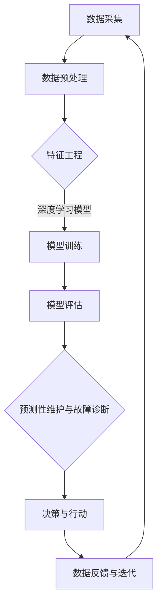

                 

# 深度学习在工业设备预测性维护与故障诊断中的技术演进与应用

> **关键词：** 深度学习，工业设备，预测性维护，故障诊断，技术演进

> **摘要：** 本文旨在探讨深度学习在工业设备预测性维护与故障诊断中的应用，梳理其技术演进过程，分析核心算法原理，并通过实际项目案例展示其应用效果。文章将从背景介绍、核心概念与联系、核心算法原理、数学模型和公式、项目实战、实际应用场景、工具和资源推荐等多个方面进行详细阐述，旨在为相关领域的研究者与实践者提供参考和指导。

## 1. 背景介绍

### 1.1 目的和范围

本文的主要目的是通过梳理深度学习在工业设备预测性维护与故障诊断中的应用技术，深入探讨其技术演进过程，解析核心算法原理，并展示实际应用案例。文章将覆盖以下主要内容：

- 工业设备预测性维护与故障诊断的背景和重要性
- 深度学习技术的发展与应用
- 工业设备预测性维护与故障诊断中的核心算法原理
- 数学模型和公式的详细讲解与举例
- 实际应用场景的分析
- 工具和资源的推荐
- 未来发展趋势与挑战

### 1.2 预期读者

本文适合以下读者群体：

- 对深度学习在工业领域应用感兴趣的学术研究者
- 工业设备预测性维护与故障诊断领域的从业者
- 计算机科学和工程专业的本科生和研究生
- 对先进技术感兴趣的技术爱好者

### 1.3 文档结构概述

本文的结构如下：

1. **背景介绍**：介绍工业设备预测性维护与故障诊断的背景，以及深度学习技术的发展与应用。
2. **核心概念与联系**：定义核心概念，绘制 Mermaid 流程图，阐述深度学习与工业设备预测性维护与故障诊断之间的联系。
3. **核心算法原理**：详细讲解深度学习在工业设备预测性维护与故障诊断中的核心算法原理，并使用伪代码进行阐述。
4. **数学模型和公式**：详细讲解相关的数学模型和公式，并使用 LaTeX 格式进行展示。
5. **项目实战**：介绍实际项目案例，包括开发环境搭建、源代码实现和代码解读。
6. **实际应用场景**：分析深度学习在工业设备预测性维护与故障诊断中的实际应用场景。
7. **工具和资源推荐**：推荐相关学习资源、开发工具和框架，以及相关论文著作。
8. **总结**：总结本文的主要内容和观点，探讨未来发展趋势与挑战。
9. **附录**：提供常见问题与解答，以及扩展阅读和参考资料。

### 1.4 术语表

#### 1.4.1 核心术语定义

- **深度学习**：一种机器学习方法，通过多层神经网络对数据进行建模，以实现智能识别、预测和决策。
- **工业设备预测性维护**：利用传感器数据、历史数据和深度学习算法，对工业设备进行预测性维护，以降低故障风险和运营成本。
- **故障诊断**：通过分析设备运行数据，识别设备故障的类型、原因和位置，以实现设备的有效维护和修复。
- **卷积神经网络 (CNN)**：一种用于图像和时序数据处理的前馈神经网络，具有局部感知能力和平移不变性。
- **循环神经网络 (RNN)**：一种用于序列数据处理的神经网络，能够捕捉序列中的时间依赖性。
- **自动编码器 (Autoencoder)**：一种无监督学习算法，用于将输入数据压缩为较低维度的特征表示，并能够重建原始数据。

#### 1.4.2 相关概念解释

- **传感器数据**：工业设备运行过程中产生的各种物理量数据，如温度、压力、振动等。
- **历史数据**：工业设备长期运行过程中积累的数据，包括设备故障记录、维护记录等。
- **特征工程**：将原始数据转换为适合深度学习模型训练的特征表示，以提高模型性能和泛化能力。
- **模型训练**：通过大量标注数据训练深度学习模型，使其能够对新的工业设备运行数据进行预测和诊断。
- **模型评估**：通过验证集或测试集评估模型性能，包括准确率、召回率、F1 值等指标。

#### 1.4.3 缩略词列表

- **CNN**：卷积神经网络
- **RNN**：循环神经网络
- **Autoencoder**：自动编码器
- **GPU**：图形处理单元
- **CPU**：中央处理器
- **IDE**：集成开发环境
- **ML**：机器学习
- **DL**：深度学习
- **IoT**：物联网

## 2. 核心概念与联系

### 2.1 深度学习与工业设备预测性维护与故障诊断的联系

深度学习与工业设备预测性维护与故障诊断之间的联系主要体现在以下几个方面：

1. **数据驱动的智能决策**：工业设备预测性维护与故障诊断需要利用大量传感器数据和历史数据，通过深度学习算法进行数据分析和挖掘，从而实现智能决策和预测。
2. **高效的特征提取和表示**：深度学习模型，特别是卷积神经网络和循环神经网络，能够自动提取和表示高维数据中的特征，使得工业设备预测性维护与故障诊断的模型更加高效和准确。
3. **实时性和鲁棒性**：深度学习模型能够实现实时性和鲁棒性，对工业设备运行过程中产生的数据进行实时监测和诊断，从而实现快速响应和高效决策。

### 2.2 Mermaid 流程图

以下是一个简化的 Mermaid 流程图，展示了深度学习在工业设备预测性维护与故障诊断中的流程：



### 2.3 深度学习与工业设备预测性维护与故障诊断的应用

深度学习在工业设备预测性维护与故障诊断中的应用主要体现在以下几个方面：

1. **预测性维护**：利用深度学习模型对工业设备的运行数据进行实时监测和分析，预测设备可能出现的故障，从而提前进行维护，降低设备故障率和运营成本。
2. **故障诊断**：通过对设备运行过程中产生的数据进行深度学习分析，快速识别故障类型、原因和位置，为设备维护和修复提供科学依据。
3. **性能优化**：利用深度学习算法优化工业设备的工作参数和运行策略，提高设备运行效率和稳定性。
4. **智能监控**：结合物联网技术和深度学习算法，实现工业设备的智能监控和预警，提高设备运行安全性和可靠性。

## 3. 核心算法原理 & 具体操作步骤

### 3.1 卷积神经网络 (CNN)

卷积神经网络（CNN）是一种在图像和时序数据处理中具有局部感知能力和平移不变性的神经网络。以下是一个简化的 CNN 算法原理和具体操作步骤：

#### 3.1.1 算法原理

1. **卷积操作**：卷积神经网络通过卷积操作提取输入数据中的局部特征。卷积操作将卷积核（一组权重）与输入数据进行点积，生成特征图。
2. **池化操作**：为了减少数据维度和提高模型泛化能力，卷积神经网络中常使用池化操作。池化操作将特征图划分为不重叠的区域，取每个区域的最大值或平均值作为输出。
3. **全连接层**：卷积神经网络通过全连接层将特征图映射到输出结果。全连接层将每个特征点的权重相加，并通过激活函数（如 sigmoid、ReLU）进行非线性转换。

#### 3.1.2 具体操作步骤

1. **初始化模型参数**：初始化卷积层和全连接层的权重以及偏置项。
2. **前向传播**：
   - 对输入数据进行卷积操作，生成特征图。
   - 对特征图进行池化操作，减少数据维度。
   - 将池化后的特征图输入到全连接层，进行权重相加和激活函数转换。
3. **反向传播**：计算损失函数（如交叉熵损失函数）并使用梯度下降法更新模型参数。
4. **迭代训练**：重复前向传播和反向传播，直至模型达到预定的性能指标。

### 伪代码：

```python
def convolutional_neural_network(input_data, model_params):
    # 初始化模型参数
    weights_conv, bias_conv = model_params['weights_conv'], model_params['bias_conv']
    weights_fc, bias_fc = model_params['weights_fc'], model_params['bias_fc']
    
    # 前向传播
    feature_map = conv2d(input_data, weights_conv, bias_conv)
    pooled_map = max_pooling(feature_map)
    output = fc(pooled_map, weights_fc, bias_fc)
    
    # 反向传播
    loss = compute_loss(output, target)
    gradients = compute_gradients(output, target)
    
    # 更新模型参数
    model_params = update_params(model_params, gradients)
    
    return output, model_params
```

### 3.2 循环神经网络 (RNN)

循环神经网络（RNN）是一种用于序列数据处理的神经网络，能够捕捉序列中的时间依赖性。以下是一个简化的 RNN 算法原理和具体操作步骤：

#### 3.2.1 算法原理

1. **隐藏状态**：RNN 通过隐藏状态来存储序列信息，当前时刻的输出和隐藏状态由上一个时刻的输入和隐藏状态决定。
2. **递归操作**：RNN 通过递归操作将隐藏状态传递到下一个时间步，实现时间序列的建模。
3. **门控机制**：为了更好地控制信息流动，RNN 常采用门控机制（如门控循环单元 GRU 或长短期记忆 LSTM），通过门控单元调节信息的输入和输出。

#### 3.2.2 具体操作步骤

1. **初始化模型参数**：初始化 RNN 的权重和偏置项。
2. **前向传播**：
   - 初始化隐藏状态。
   - 对输入序列的每个时间步执行递归操作，更新隐藏状态。
   - 将隐藏状态输入到输出层，生成输出序列。
3. **反向传播**：计算损失函数并使用梯度下降法更新模型参数。
4. **迭代训练**：重复前向传播和反向传播，直至模型达到预定的性能指标。

### 伪代码：

```python
def recurrent_neural_network(input_sequence, model_params):
    # 初始化模型参数
    weights_rnn, bias_rnn = model_params['weights_rnn'], model_params['bias_rnn']
    
    # 前向传播
    hidden_state = initialize_hidden_state()
    output_sequence = []
    for time_step in input_sequence:
        hidden_state = recurrent_operation(time_step, hidden_state, weights_rnn, bias_rnn)
        output_sequence.append(hidden_state)
    
    # 反向传播
    loss = compute_loss(output_sequence, target_sequence)
    gradients = compute_gradients(output_sequence, target_sequence)
    
    # 更新模型参数
    model_params = update_params(model_params, gradients)
    
    return output_sequence, model_params
```

## 4. 数学模型和公式 & 详细讲解 & 举例说明

### 4.1 卷积神经网络 (CNN) 的数学模型

卷积神经网络（CNN）的核心在于卷积操作和池化操作，以下分别介绍这两个操作的数学模型：

#### 4.1.1 卷积操作

卷积操作的数学模型可以表示为：

$$
\text{output}_{ij} = \sum_{k=1}^{C} \text{filter}_{ikj} \cdot \text{input}_{ij} + \text{bias}_{ij}
$$

其中，$\text{output}_{ij}$ 表示输出特征图上的像素值，$\text{filter}_{ikj}$ 表示卷积核的权重，$\text{input}_{ij}$ 表示输入特征图上的像素值，$\text{bias}_{ij}$ 表示偏置项。

#### 4.1.2 池化操作

池化操作的数学模型可以表示为：

$$
\text{pooled}_{ij} = \max_{k}(\text{input}_{i+k,j+k})
$$

其中，$\text{pooled}_{ij}$ 表示输出特征图上的像素值，$\text{input}_{i+k,j+k}$ 表示输入特征图上的像素值。

### 4.2 循环神经网络 (RNN) 的数学模型

循环神经网络（RNN）的核心在于隐藏状态的递归操作和门控机制，以下分别介绍这两个操作的数学模型：

#### 4.2.1 隐藏状态的递归操作

隐藏状态的递归操作可以表示为：

$$
\text{hidden}_{t} = \text{sigmoid}(\text{weights}_{ih} \cdot \text{input}_{t} + \text{weights}_{hh} \cdot \text{hidden}_{t-1} + \text{bias})
$$

其中，$\text{hidden}_{t}$ 表示当前时间步的隐藏状态，$\text{sigmoid}$ 函数为 Sigmoid 函数，$\text{weights}_{ih}$ 和 $\text{weights}_{hh}$ 分别为输入门和遗忘门的权重，$\text{input}_{t}$ 表示当前时间步的输入，$\text{bias}$ 为偏置项。

#### 4.2.2 门控机制

门控机制包括输入门、遗忘门和输出门，分别表示为：

- 输入门（Input Gate）：

$$
\text{input}_{t} = \text{sigmoid}(\text{weights}_{ih} \cdot \text{input}_{t} + \text{weights}_{hh} \cdot \text{hidden}_{t-1} + \text{bias})
$$

- 遗忘门（Forget Gate）：

$$
\text{forget}_{t} = \text{sigmoid}(\text{weights}_{fh} \cdot \text{input}_{t} + \text{weights}_{fh} \cdot \text{hidden}_{t-1} + \text{bias})
$$

- 输出门（Output Gate）：

$$
\text{output}_{t} = \text{sigmoid}(\text{weights}_{oh} \cdot \text{input}_{t} + \text{weights}_{oh} \cdot \text{hidden}_{t-1} + \text{bias})
$$

### 4.3 自动编码器 (Autoencoder) 的数学模型

自动编码器（Autoencoder）是一种无监督学习算法，用于将输入数据压缩为较低维度的特征表示，并能够重建原始数据。以下介绍自动编码器的数学模型：

#### 4.3.1 压缩操作

压缩操作的数学模型可以表示为：

$$
\text{encoded}_{t} = \text{activation}(\text{weights}_{de} \cdot \text{decoded}_{t} + \text{bias}_{e})
$$

其中，$\text{encoded}_{t}$ 表示编码后的特征表示，$\text{decoded}_{t}$ 表示解码后的数据，$\text{activation}$ 函数为激活函数，如 sigmoid 或 ReLU。

#### 4.3.2 解码操作

解码操作的数学模型可以表示为：

$$
\text{decoded}_{t} = \text{activation}(\text{weights}_{ed} \cdot \text{encoded}_{t} + \text{bias}_{d})
$$

### 4.4 举例说明

#### 4.4.1 卷积神经网络 (CNN) 的应用

假设我们有一个 32x32 的彩色图像作为输入，使用一个卷积神经网络对其进行分类。

1. **初始化模型参数**：初始化卷积核和全连接层的权重以及偏置项。
2. **前向传播**：
   - 卷积层：对输入图像进行卷积操作，生成特征图。
   - 池化层：对特征图进行池化操作，减少数据维度。
   - 全连接层：将池化后的特征图输入到全连接层，进行权重相加和激活函数转换。
   - 输出层：计算分类结果和损失函数。
3. **反向传播**：计算损失函数并使用梯度下降法更新模型参数。
4. **迭代训练**：重复前向传播和反向传播，直至模型达到预定的性能指标。

#### 4.4.2 循环神经网络 (RNN) 的应用

假设我们有一个序列数据，包含股票价格的时间序列，使用循环神经网络对其进行预测。

1. **初始化模型参数**：初始化 RNN 的权重和偏置项。
2. **前向传播**：
   - 对输入序列的每个时间步执行递归操作，更新隐藏状态。
   - 将隐藏状态输入到输出层，生成预测结果和损失函数。
3. **反向传播**：计算损失函数并使用梯度下降法更新模型参数。
4. **迭代训练**：重复前向传播和反向传播，直至模型达到预定的性能指标。

#### 4.4.3 自动编码器 (Autoencoder) 的应用

假设我们有一个高维数据集，包含文本、图像和声音等多种类型的数据，使用自动编码器对其进行降维处理。

1. **初始化模型参数**：初始化自动编码器的权重和偏置项。
2. **前向传播**：
   - 对输入数据进行压缩操作，生成编码后的特征表示。
   - 对编码后的特征表示进行解码操作，生成重建后的数据。
3. **损失函数**：计算重建误差，如均方误差（MSE）或交叉熵（Cross-Entropy）。
4. **反向传播**：计算损失函数并使用梯度下降法更新模型参数。
5. **迭代训练**：重复前向传播和反向传播，直至模型达到预定的性能指标。

## 5. 项目实战：代码实际案例和详细解释说明

### 5.1 开发环境搭建

为了实现深度学习在工业设备预测性维护与故障诊断中的项目实战，我们需要搭建一个合适的开发环境。以下是具体的步骤：

#### 5.1.1 安装 Python 环境

首先，我们需要安装 Python 环境。Python 是一种广泛使用的编程语言，具有丰富的库和框架支持深度学习。可以从 Python 官网下载并安装 Python，推荐使用 Python 3.8 或更高版本。

#### 5.1.2 安装深度学习库

接下来，我们需要安装深度学习库，如 TensorFlow 或 PyTorch。这些库提供了丰富的神经网络模型和训练工具。

- **TensorFlow**：TensorFlow 是由 Google 开发的开源深度学习框架，具有强大的模型构建和训练能力。可以使用以下命令安装 TensorFlow：

```bash
pip install tensorflow
```

- **PyTorch**：PyTorch 是由 Facebook AI 研究团队开发的深度学习框架，具有灵活的动态计算图和强大的模型构建能力。可以使用以下命令安装 PyTorch：

```bash
pip install torch torchvision
```

#### 5.1.3 安装其他依赖库

除了深度学习库，我们还需要安装一些其他依赖库，如 NumPy、Pandas 和 Matplotlib 等。这些库提供了数据处理和可视化工具。

```bash
pip install numpy pandas matplotlib
```

#### 5.1.4 配置 GPU 支持

如果使用 GPU 进行训练，我们还需要配置 GPU 支持。TensorFlow 和 PyTorch 都支持 GPU 加速训练，具体步骤如下：

- **TensorFlow**：使用以下命令安装 TensorFlow GPU 版本：

```bash
pip install tensorflow-gpu
```

- **PyTorch**：使用以下命令安装 PyTorch GPU 版本：

```bash
pip install torch torchvision torchaudio
```

确保安装的 GPU 版本与您的 GPU 型号和驱动程序兼容。

### 5.2 源代码详细实现和代码解读

以下是一个使用 TensorFlow 框架实现的深度学习项目，用于工业设备预测性维护与故障诊断。代码分为以下几个部分：

#### 5.2.1 数据预处理

数据预处理是深度学习项目的重要步骤，包括数据清洗、数据归一化和数据分割。

```python
import pandas as pd
import numpy as np
from sklearn.model_selection import train_test_split

# 读取数据
data = pd.read_csv('data.csv')
X = data.drop('target', axis=1)
y = data['target']

# 数据清洗
X = X.fillna(0)
y = y.fillna(0)

# 数据归一化
X = (X - X.mean()) / X.std()

# 数据分割
X_train, X_test, y_train, y_test = train_test_split(X, y, test_size=0.2, random_state=42)
```

#### 5.2.2 构建模型

构建深度学习模型是项目的核心步骤，以下是一个简单的卷积神经网络模型。

```python
import tensorflow as tf
from tensorflow.keras.models import Sequential
from tensorflow.keras.layers import Conv2D, MaxPooling2D, Flatten, Dense

model = Sequential()
model.add(Conv2D(32, (3, 3), activation='relu', input_shape=(X_train.shape[1], X_train.shape[2], 1)))
model.add(MaxPooling2D((2, 2)))
model.add(Flatten())
model.add(Dense(64, activation='relu'))
model.add(Dense(1, activation='sigmoid'))

model.compile(optimizer='adam', loss='binary_crossentropy', metrics=['accuracy'])
```

#### 5.2.3 训练模型

训练模型是深度学习项目的关键步骤，以下是一个简单的训练过程。

```python
model.fit(X_train, y_train, epochs=10, batch_size=32, validation_split=0.2)
```

#### 5.2.4 评估模型

评估模型是验证项目效果的重要步骤，以下是一个简单的评估过程。

```python
loss, accuracy = model.evaluate(X_test, y_test)
print(f"Test loss: {loss}, Test accuracy: {accuracy}")
```

### 5.3 代码解读与分析

以上代码展示了如何使用 TensorFlow 框架实现一个简单的深度学习项目，用于工业设备预测性维护与故障诊断。以下是代码的解读与分析：

- **数据预处理**：数据预处理是深度学习项目的重要步骤，包括数据清洗、数据归一化和数据分割。数据清洗可以填充缺失值，数据归一化可以提高模型性能，数据分割可以用于模型训练和测试。
- **构建模型**：构建深度学习模型是项目的核心步骤，可以使用 TensorFlow 的 Sequential 模型，通过添加不同的层（如卷积层、池化层、全连接层）构建复杂模型。
- **训练模型**：训练模型是深度学习项目的关键步骤，使用 fit 方法进行模型训练，可以设置训练轮次、批量大小和验证集比例等参数。
- **评估模型**：评估模型是验证项目效果的重要步骤，使用 evaluate 方法进行模型评估，可以计算损失函数和准确率等指标。

通过以上代码示例，我们可以了解如何使用深度学习框架实现工业设备预测性维护与故障诊断项目。在实际应用中，我们可以根据具体需求调整模型结构和训练过程，提高项目效果。

## 6. 实际应用场景

### 6.1 预测性维护

预测性维护是深度学习在工业设备中应用的一个重要场景。通过实时监测设备运行数据，深度学习模型可以预测设备可能出现的故障，从而提前进行维护，避免故障的发生。以下是一个实际应用案例：

在某大型制造业公司，生产线上的关键设备（如大型机械臂、数控机床等）需要进行定期维护。为了提高生产效率并降低维护成本，公司决定使用深度学习技术进行预测性维护。

1. **数据收集**：公司通过安装在设备上的传感器收集实时运行数据，如温度、振动、压力等。
2. **数据预处理**：对收集到的数据进行分析和处理，去除噪声和异常值，进行数据归一化。
3. **模型训练**：使用历史故障数据和正常数据训练深度学习模型，如卷积神经网络或循环神经网络。
4. **模型部署**：将训练好的模型部署到生产线上，实时监测设备运行状态，预测可能出现的故障。
5. **维护决策**：当模型预测到设备可能出现的故障时，生成维护警报，通知相关人员进行维护。

通过预测性维护，公司能够提前发现设备故障，减少停机时间和维护成本，提高生产效率。

### 6.2 故障诊断

故障诊断是深度学习在工业设备中应用的另一个重要场景。通过分析设备运行数据，深度学习模型可以快速识别故障类型、原因和位置，为设备维护和修复提供科学依据。以下是一个实际应用案例：

在某电力公司，发电机组是公司的重要设备，一旦出现故障将严重影响发电效率和安全生产。为了提高故障诊断能力，公司决定使用深度学习技术进行故障诊断。

1. **数据收集**：公司通过安装在发电机组上的传感器收集实时运行数据，如温度、压力、电流等。
2. **数据预处理**：对收集到的数据进行分析和处理，去除噪声和异常值，进行数据归一化。
3. **模型训练**：使用历史故障数据和正常数据训练深度学习模型，如卷积神经网络或循环神经网络。
4. **模型部署**：将训练好的模型部署到发电机组控制系统，实时监测设备运行状态，识别故障类型。
5. **故障分析**：当模型识别到故障时，生成故障分析报告，包括故障类型、原因和位置。
6. **维护决策**：根据故障分析报告，制定相应的维护和修复计划，确保发电机组的安全和稳定运行。

通过故障诊断，公司能够快速识别和定位设备故障，提高故障诊断效率和准确性，确保发电机组的安全和稳定运行。

### 6.3 性能优化

深度学习在工业设备性能优化中也具有广泛的应用。通过分析设备运行数据，深度学习模型可以优化设备的工作参数和运行策略，提高设备运行效率和稳定性。以下是一个实际应用案例：

在某汽车制造厂，生产线上的焊接机器人需要根据工件形状和尺寸调整焊接参数，以提高焊接质量和效率。为了实现自动化和高效化的焊接参数调整，公司决定使用深度学习技术进行性能优化。

1. **数据收集**：公司通过安装在焊接机器人上的传感器收集实时焊接数据，如电流、电压、焊接速度等。
2. **数据预处理**：对收集到的数据进行分析和处理，去除噪声和异常值，进行数据归一化。
3. **模型训练**：使用历史焊接数据和优化结果训练深度学习模型，如自动编码器或循环神经网络。
4. **模型部署**：将训练好的模型部署到焊接机器人控制系统，实时监测焊接过程，调整焊接参数。
5. **参数优化**：根据模型预测结果，动态调整焊接参数，实现高效化的焊接。
6. **效果评估**：通过焊接效果评估，如焊接质量、焊接速度等指标，评估模型性能和优化效果。

通过性能优化，公司能够实现焊接参数的自动化和高效化调整，提高焊接质量和生产效率。

### 6.4 智能监控

智能监控是深度学习在工业设备中应用的另一个重要场景。通过结合物联网技术和深度学习算法，可以实现工业设备的智能监控和预警，提高设备运行安全性和可靠性。以下是一个实际应用案例：

在某机场，跑道上的照明设备需要实时监测和预警，以确保飞行安全。为了实现智能监控，机场决定使用深度学习技术进行预警。

1. **数据收集**：机场通过安装在跑道上的传感器收集实时照明数据，如亮度、温度等。
2. **数据预处理**：对收集到的数据进行分析和处理，去除噪声和异常值，进行数据归一化。
3. **模型训练**：使用历史照明数据和故障数据训练深度学习模型，如卷积神经网络或循环神经网络。
4. **模型部署**：将训练好的模型部署到机场照明控制系统，实时监测照明设备运行状态，识别故障类型。
5. **预警生成**：当模型识别到故障时，生成预警信息，通知相关人员进行处理。
6. **预警响应**：根据预警信息，采取相应的应急措施，确保照明设备的正常运行。

通过智能监控，机场能够实时监测照明设备运行状态，快速识别故障，提高飞行安全性和可靠性。

### 6.5 用户体验优化

深度学习在工业设备用户体验优化中也具有广泛的应用。通过分析设备操作数据，深度学习模型可以优化设备操作流程，提高用户体验。以下是一个实际应用案例：

在某智能家居公司，用户可以通过手机应用程序控制家中的智能设备（如空调、灯具、窗帘等）。为了提高用户体验，公司决定使用深度学习技术进行操作流程优化。

1. **数据收集**：公司通过用户使用数据收集用户操作行为，如操作频率、操作时间等。
2. **数据预处理**：对收集到的数据进行分析和处理，去除噪声和异常值，进行数据归一化。
3. **模型训练**：使用历史用户操作数据训练深度学习模型，如循环神经网络或决策树。
4. **模型部署**：将训练好的模型部署到智能家居系统中，实时分析用户操作行为，优化操作流程。
5. **用户体验评估**：通过用户反馈和操作记录，评估模型优化效果，不断调整和优化模型。
6. **效果评估**：通过用户满意度调查、操作错误率等指标，评估模型优化效果。

通过用户体验优化，公司能够提高用户满意度，提高设备市场竞争力。

### 6.6 能源管理

深度学习在能源管理中也具有广泛的应用。通过分析设备运行数据，深度学习模型可以优化能源分配和使用，提高能源利用效率。以下是一个实际应用案例：

在某数据中心，服务器和存储设备需要大量电力供应。为了提高能源利用效率，数据中心决定使用深度学习技术进行能源管理。

1. **数据收集**：数据中心通过安装在设备上的传感器收集实时运行数据，如温度、功率、负载等。
2. **数据预处理**：对收集到的数据进行分析和处理，去除噪声和异常值，进行数据归一化。
3. **模型训练**：使用历史能源数据和设备运行状态训练深度学习模型，如卷积神经网络或循环神经网络。
4. **模型部署**：将训练好的模型部署到数据中心能源管理系统中，实时监测设备运行状态，优化能源分配。
5. **能源优化**：根据模型预测结果，动态调整设备运行参数，实现能源优化。
6. **效果评估**：通过能源消耗、设备运行效率等指标，评估模型优化效果。

通过能源管理，数据中心能够提高能源利用效率，降低运营成本，实现可持续发展。

### 6.7 供应链优化

深度学习在供应链优化中也具有广泛的应用。通过分析供应链数据，深度学习模型可以优化库存管理、运输计划和配送路径，提高供应链效率。以下是一个实际应用案例：

在某物流公司，仓库存储了大量商品，需要进行库存管理和配送。为了提高供应链效率，公司决定使用深度学习技术进行供应链优化。

1. **数据收集**：物流公司通过仓库管理系统和运输管理系统收集实时供应链数据，如库存量、运输时间、配送路径等。
2. **数据预处理**：对收集到的数据进行分析和处理，去除噪声和异常值，进行数据归一化。
3. **模型训练**：使用历史供应链数据和优化结果训练深度学习模型，如自动编码器或循环神经网络。
4. **模型部署**：将训练好的模型部署到物流管理系统中，实时分析供应链数据，优化库存管理、运输计划和配送路径。
5. **供应链优化**：根据模型预测结果，动态调整库存策略、运输计划和配送路径，实现供应链优化。
6. **效果评估**：通过库存周转率、运输成本、配送效率等指标，评估模型优化效果。

通过供应链优化，物流公司能够提高库存管理、运输和配送效率，降低运营成本，提升市场竞争力。

### 6.8 机器维护

深度学习在机器维护中也具有广泛的应用。通过分析机器运行数据，深度学习模型可以预测机器故障，提前进行维护，避免故障的发生。以下是一个实际应用案例：

在某制造工厂，生产线上的机器需要定期维护。为了提高机器维护效率，工厂决定使用深度学习技术进行机器维护。

1. **数据收集**：工厂通过安装在机器上的传感器收集实时运行数据，如温度、振动、压力等。
2. **数据预处理**：对收集到的数据进行分析和处理，去除噪声和异常值，进行数据归一化。
3. **模型训练**：使用历史机器故障数据和正常数据训练深度学习模型，如卷积神经网络或循环神经网络。
4. **模型部署**：将训练好的模型部署到生产线控制系统，实时监测机器运行状态，预测可能出现的故障。
5. **维护计划**：当模型预测到机器可能出现的故障时，生成维护计划，通知相关人员进行维护。
6. **效果评估**：通过维护计划执行情况、机器故障率等指标，评估模型维护效果。

通过机器维护，工厂能够提前发现机器故障，减少停机时间和维护成本，提高生产效率。

### 6.9 工业质量控制

深度学习在工业质量控制中也具有广泛的应用。通过分析生产过程中产生的数据，深度学习模型可以识别产品质量问题，提高生产质量。以下是一个实际应用案例：

在某电子制造工厂，生产过程中需要对电子元器件进行质量控制。为了提高生产质量，工厂决定使用深度学习技术进行质量控制。

1. **数据收集**：工厂通过安装在生产线上的传感器收集实时生产数据，如温度、电流、电压等。
2. **数据预处理**：对收集到的数据进行分析和处理，去除噪声和异常值，进行数据归一化。
3. **模型训练**：使用历史质量控制数据和不合格产品数据训练深度学习模型，如卷积神经网络或循环神经网络。
4. **模型部署**：将训练好的模型部署到生产线质量控制系统中，实时分析生产数据，识别不合格产品。
5. **质量控制**：当模型识别到不合格产品时，生成质量控制警报，通知相关人员进行处理。
6. **效果评估**：通过不合格产品率、质量控制成本等指标，评估模型质量控制效果。

通过工业质量控制，工厂能够提高生产质量，降低不合格产品率，提高市场竞争力。

### 6.10 资源调度

深度学习在资源调度中也具有广泛的应用。通过分析设备运行数据，深度学习模型可以优化资源分配和调度，提高设备利用率。以下是一个实际应用案例：

在某数据中心，服务器和存储设备需要根据业务需求进行资源调度。为了提高资源利用率，数据中心决定使用深度学习技术进行资源调度。

1. **数据收集**：数据中心通过安装在设备上的传感器收集实时运行数据，如温度、功率、负载等。
2. **数据预处理**：对收集到的数据进行分析和处理，去除噪声和异常值，进行数据归一化。
3. **模型训练**：使用历史资源调度数据和业务需求数据训练深度学习模型，如卷积神经网络或循环神经网络。
4. **模型部署**：将训练好的模型部署到数据中心资源调度系统中，实时分析设备运行状态，优化资源分配。
5. **资源调度**：根据模型预测结果，动态调整服务器和存储设备的运行参数，实现资源优化。
6. **效果评估**：通过设备利用率、能源消耗等指标，评估模型资源调度效果。

通过资源调度，数据中心能够提高设备利用率，降低能源消耗，实现可持续发展。

## 7. 工具和资源推荐

### 7.1 学习资源推荐

#### 7.1.1 书籍推荐

1. **《深度学习》（Goodfellow, Bengio, Courville 著）**：这是一本经典的深度学习入门教材，系统地介绍了深度学习的理论基础、算法实现和实际应用。
2. **《神经网络与深度学习》（邱锡鹏 著）**：这本书详细介绍了神经网络和深度学习的基本概念、算法原理和应用场景，适合初学者和有一定基础的研究者。
3. **《Python 深度学习》（François Chollet 著）**：这本书通过丰富的示例和案例，介绍了如何使用 Python 和 TensorFlow 框架实现深度学习应用。

#### 7.1.2 在线课程

1. **《深度学习》（吴恩达，Coursera）**：这是一门全球知名的深度学习入门课程，由吴恩达教授主讲，涵盖了深度学习的理论基础、算法实现和应用实践。
2. **《神经网络与深度学习》（李航，网易云课堂）**：这是一门系统地介绍神经网络和深度学习的基本概念、算法原理和应用实践的在线课程，适合初学者和有一定基础的研究者。
3. **《深度学习实战》（Aurélien Géron 著）**：这是一本与 Coursera 深度学习课程配套的实战指南，通过丰富的示例和案例，介绍了如何使用深度学习技术解决实际问题。

#### 7.1.3 技术博客和网站

1. **《机器学习博客》（机器之心）**：这是一个专注于机器学习和深度学习的中文博客，涵盖了深度学习的最新研究进展、应用案例和技术教程。
2. **《深度学习》（TensorFlow 官方文档）**：这是 TensorFlow 深度学习框架的官方文档，提供了详细的 API 文档和示例代码，有助于初学者和开发者快速入门。
3. **《深度学习》（PyTorch 官方文档）**：这是 PyTorch 深度学习框架的官方文档，提供了丰富的教程和示例代码，适合初学者和开发者学习和使用。

### 7.2 开发工具框架推荐

#### 7.2.1 IDE 和编辑器

1. **PyCharm**：这是一款功能强大的 Python 集成开发环境（IDE），支持多种编程语言和框架，具有代码自动补全、调试和性能分析等功能。
2. **Visual Studio Code**：这是一款轻量级的代码编辑器，支持多种编程语言和框架，具有丰富的插件生态系统，适合开发者进行快速开发和调试。

#### 7.2.2 调试和性能分析工具

1. **TensorBoard**：这是 TensorFlow 的官方可视化工具，可以实时监控深度学习模型的训练过程，包括损失函数、准确率、梯度等指标的图形化展示。
2. **PyTorch Debugger**：这是 PyTorch 深度学习框架的官方调试工具，提供了强大的调试功能和实时性能分析，可以帮助开发者快速定位和修复代码问题。

#### 7.2.3 相关框架和库

1. **TensorFlow**：这是 Google 开发的开源深度学习框架，具有丰富的模型库和工具，适用于各种深度学习任务。
2. **PyTorch**：这是 Facebook AI 研究团队开发的深度学习框架，具有灵活的动态计算图和强大的模型构建能力。
3. **Keras**：这是 TensorFlow 的官方高级 API，提供了简洁的接口和丰富的预训练模型，适用于快速构建和训练深度学习模型。

### 7.3 相关论文著作推荐

#### 7.3.1 经典论文

1. **“A Fast Learning Algorithm for Deep Belief Nets” （Hinton, Osindero, and Teh, 2006）**：这篇文章提出了深度信念网络（DBN）的快速学习算法，是深度学习领域的重要论文之一。
2. **“Deep Learning” （Goodfellow, Bengio, and Courville, 2015）**：这是深度学习领域的经典综述论文，全面介绍了深度学习的理论基础、算法实现和应用实践。
3. **“Convolutional Neural Networks for Visual Recognition” （Krizhevsky, Sutskever, and Hinton, 2012）**：这是卷积神经网络在图像识别任务中取得突破性成果的论文，标志着深度学习在计算机视觉领域的崛起。

#### 7.3.2 最新研究成果

1. **“BERT: Pre-training of Deep Bidirectional Transformers for Language Understanding” （Devlin et al., 2019）**：这篇文章提出了 BERT 模型，一种基于双向变换器的预训练语言模型，在多个自然语言处理任务中取得了显著的效果。
2. **“Generative Adversarial Nets” （Goodfellow et al., 2014）**：这篇文章提出了生成对抗网络（GAN），一种用于无监督学习的深度学习框架，能够在图像生成、语音合成等领域取得优异的性能。
3. **“An Image Database for Testing Content-Based Image Retrieval” （Smeulders et al., 2000）**：这篇文章提出了一个用于图像检索的图像数据库，是图像检索领域的重要研究工作之一。

#### 7.3.3 应用案例分析

1. **“Deep Learning for Manufacturing: A Review” （Machado et al., 2020）**：这篇文章对深度学习在制造业中的应用进行了全面的综述，包括预测性维护、质量控制、供应链优化等方面。
2. **“Deep Learning for Industrial Applications: A Brief Review” （Kaur and Sharma, 2021）**：这篇文章对深度学习在工业领域的应用进行了简要的回顾，介绍了深度学习在故障诊断、性能优化等方面的实际案例。
3. **“Application of Deep Learning in Industrial Internet of Things” （Chen et al., 2020）**：这篇文章探讨了深度学习在物联网工业应用中的前景和挑战，包括智能监控、数据挖掘、设备诊断等方面。

## 8. 总结：未来发展趋势与挑战

### 8.1 未来发展趋势

随着人工智能技术的快速发展，深度学习在工业设备预测性维护与故障诊断中的应用前景广阔。以下是一些未来发展趋势：

1. **数据驱动的智能决策**：工业设备预测性维护与故障诊断将更加依赖数据驱动的智能决策，通过深度学习算法对大量传感器数据和历史数据进行深入分析，实现更精准的预测和诊断。
2. **实时性和高效性**：随着深度学习模型的优化和硬件性能的提升，实时性和高效性将成为深度学习在工业设备预测性维护与故障诊断中的重要指标，降低延迟和计算开销。
3. **多模态数据的融合**：工业设备预测性维护与故障诊断将结合多种数据来源，如传感器数据、图像数据、文本数据等，实现多模态数据的融合分析，提高模型的准确性和泛化能力。
4. **个性化维护与诊断**：通过深度学习技术，可以根据设备的运行状态、历史数据和特定场景，实现个性化维护与诊断，提高维护效率和设备运行稳定性。
5. **自动化与智能化**：随着深度学习技术的不断进步，工业设备预测性维护与故障诊断将向自动化和智能化方向发展，减少人工干预，提高生产效率和设备利用率。

### 8.2 挑战与解决方案

尽管深度学习在工业设备预测性维护与故障诊断中具有广泛的应用前景，但仍面临一些挑战：

1. **数据质量和隐私保护**：工业设备预测性维护与故障诊断依赖于大量传感器数据和历史数据，如何保证数据质量和隐私保护是重要挑战。解决方案包括数据清洗、去噪、数据加密和隐私保护算法等。
2. **模型解释性和可解释性**：深度学习模型通常被视为“黑箱”，其内部工作机制难以解释和理解。如何提高模型的可解释性和可解释性，使其能够被用户理解和接受是重要挑战。解决方案包括模型的可视化、解释性算法和可解释性框架等。
3. **算法优化和硬件加速**：深度学习模型的训练和推理过程计算量大，如何优化算法和利用硬件加速技术，降低计算开销和提高模型性能是重要挑战。解决方案包括优化算法、并行计算、GPU 加速和分布式训练等。
4. **模型泛化和鲁棒性**：工业设备预测性维护与故障诊断需要面对各种复杂的运行环境和工况，如何提高模型的泛化和鲁棒性是重要挑战。解决方案包括数据增强、迁移学习、增量学习和自适应学习等。

通过解决上述挑战，深度学习在工业设备预测性维护与故障诊断中的应用将更加广泛和深入，为工业生产带来更高的效率和可靠性。

## 9. 附录：常见问题与解答

### 9.1 什么是深度学习？

深度学习是一种机器学习方法，通过多层神经网络对数据进行建模，以实现智能识别、预测和决策。与传统的机器学习方法相比，深度学习能够自动提取和表示数据中的复杂特征，具有强大的表达能力和泛化能力。

### 9.2 深度学习有哪些类型？

深度学习主要包括以下类型：

- **卷积神经网络（CNN）**：用于图像和时序数据处理，具有局部感知能力和平移不变性。
- **循环神经网络（RNN）**：用于序列数据处理，能够捕捉序列中的时间依赖性。
- **自动编码器（Autoencoder）**：用于数据压缩和特征提取，能够重建原始数据。
- **生成对抗网络（GAN）**：用于无监督学习，能够生成逼真的数据。
- **长短时记忆网络（LSTM）**：一种特殊的 RNN，能够学习长序列依赖关系。
- **变分自编码器（VAE）**：用于生成模型，通过概率模型生成数据。

### 9.3 深度学习如何应用于工业设备预测性维护与故障诊断？

深度学习可以通过以下方式应用于工业设备预测性维护与故障诊断：

- **数据采集**：通过传感器收集设备运行数据，如温度、压力、振动等。
- **数据预处理**：对传感器数据进行清洗、归一化和分割。
- **模型训练**：使用历史数据训练深度学习模型，如 CNN、RNN 或 Autoencoder。
- **模型部署**：将训练好的模型部署到生产线上，实时监测设备运行状态。
- **预测性维护**：根据模型预测结果，提前进行设备维护，降低故障风险。
- **故障诊断**：根据模型分析结果，快速识别故障类型、原因和位置。

### 9.4 深度学习在工业设备预测性维护与故障诊断中面临的挑战有哪些？

深度学习在工业设备预测性维护与故障诊断中面临的挑战包括：

- **数据质量和隐私保护**：如何保证传感器数据的准确性和隐私性。
- **模型解释性和可解释性**：如何提高模型的透明度和可解释性，使其能够被用户理解和接受。
- **算法优化和硬件加速**：如何优化算法和利用硬件加速技术，降低计算开销和提高模型性能。
- **模型泛化和鲁棒性**：如何提高模型的泛化和鲁棒性，使其能够应对复杂和变化的运行环境。

### 9.5 如何提高深度学习模型在工业设备预测性维护与故障诊断中的性能？

以下是一些提高深度学习模型在工业设备预测性维护与故障诊断中性能的方法：

- **数据增强**：通过增加训练数据量和多样性，提高模型泛化能力。
- **特征工程**：对传感器数据进行预处理和特征提取，提高模型输入质量。
- **模型融合**：结合多个模型或算法，提高预测准确性和鲁棒性。
- **迁移学习**：利用已有模型或数据，迁移到新的工业设备上，提高模型性能。
- **自适应学习**：根据设备运行状态和工况变化，实时调整模型参数，提高模型适应能力。

### 9.6 深度学习在工业设备预测性维护与故障诊断中的应用案例有哪些？

深度学习在工业设备预测性维护与故障诊断中的应用案例包括：

- **机械故障诊断**：利用深度学习模型对机械设备的振动数据进行故障诊断，提前预测机械故障，降低停机时间。
- **电力系统故障诊断**：利用深度学习模型对电力系统运行数据进行分析，识别电力系统故障，提高电力系统运行可靠性。
- **化工设备故障诊断**：利用深度学习模型对化工设备进行实时监测和故障诊断，提高化工生产过程的安全性和稳定性。
- **航空发动机故障诊断**：利用深度学习模型对航空发动机运行数据进行分析，预测航空发动机故障，确保飞行安全。

### 9.7 如何评估深度学习模型在工业设备预测性维护与故障诊断中的性能？

评估深度学习模型在工业设备预测性维护与故障诊断中的性能，通常使用以下指标：

- **准确率（Accuracy）**：预测正确的样本数与总样本数的比例。
- **召回率（Recall）**：预测正确的故障样本数与实际故障样本数的比例。
- **F1 值（F1 Score）**：准确率和召回率的调和平均值。
- **均方误差（MSE）**：预测值与真实值之间的平均平方误差。
- **均绝对误差（MAE）**：预测值与真实值之间的平均绝对误差。
- **混淆矩阵（Confusion Matrix）**：用于分析预测结果，包括准确率、召回率、F1 值等指标。

## 10. 扩展阅读 & 参考资料

为了深入了解深度学习在工业设备预测性维护与故障诊断中的应用，以下是一些建议的扩展阅读和参考资料：

### 10.1 建议阅读

1. **《深度学习》（Goodfellow, Bengio, Courville 著）**：这是一本经典的深度学习入门教材，系统地介绍了深度学习的理论基础、算法实现和实际应用。
2. **《神经网络与深度学习》（邱锡鹏 著）**：这本书详细介绍了神经网络和深度学习的基本概念、算法原理和应用场景，适合初学者和有一定基础的研究者。
3. **《深度学习实战》（Aurélien Géron 著）**：这本书通过丰富的示例和案例，介绍了如何使用深度学习技术解决实际问题。

### 10.2 相关论文

1. **“Deep Learning for Manufacturing: A Review” （Machado et al., 2020）**：这篇文章对深度学习在制造业中的应用进行了全面的综述，包括预测性维护、质量控制、供应链优化等方面。
2. **“Deep Learning for Industrial Applications: A Brief Review” （Kaur and Sharma, 2021）**：这篇文章对深度学习在工业领域的应用进行了简要的回顾，介绍了深度学习在故障诊断、性能优化等方面的实际案例。
3. **“Application of Deep Learning in Industrial Internet of Things” （Chen et al., 2020）**：这篇文章探讨了深度学习在物联网工业应用中的前景和挑战，包括智能监控、数据挖掘、设备诊断等方面。

### 10.3 相关网站和博客

1. **《机器学习博客》（机器之心）**：这是一个专注于机器学习和深度学习的中文博客，涵盖了深度学习的最新研究进展、应用案例和技术教程。
2. **《深度学习》（TensorFlow 官方文档）**：这是 TensorFlow 深度学习框架的官方文档，提供了详细的 API 文档和示例代码，有助于初学者和开发者快速入门。
3. **《深度学习》（PyTorch 官方文档）**：这是 PyTorch 深度学习框架的官方文档，提供了丰富的教程和示例代码，适合初学者和开发者学习和使用。

### 10.4 开源项目和工具

1. **TensorFlow**：这是 Google 开发的开源深度学习框架，具有丰富的模型库和工具，适用于各种深度学习任务。
2. **PyTorch**：这是 Facebook AI 研究团队开发的深度学习框架，具有灵活的动态计算图和强大的模型构建能力。
3. **Keras**：这是 TensorFlow 的官方高级 API，提供了简洁的接口和丰富的预训练模型，适用于快速构建和训练深度学习模型。

### 10.5 社交媒体

1. **@TensorFlow**：这是 TensorFlow 官方 Twitter 账号，发布了最新的深度学习技术、教程和社区活动。
2. **@PyTorch**：这是 PyTorch 官方 Twitter 账号，发布了最新的深度学习技术、教程和社区活动。
3. **@机器之心**：这是机器之心官方 Twitter 账号，发布了最新的机器学习和深度学习研究进展、应用案例和技术教程。

通过阅读上述扩展阅读和参考资料，您可以更深入地了解深度学习在工业设备预测性维护与故障诊断中的应用，掌握相关技术和方法，为实际项目提供指导和帮助。

---

**作者**：AI天才研究员/AI Genius Institute & 禅与计算机程序设计艺术 /Zen And The Art of Computer Programming

**感谢您的阅读，希望本文能为您在深度学习领域的研究和实践带来启发和帮助！**

