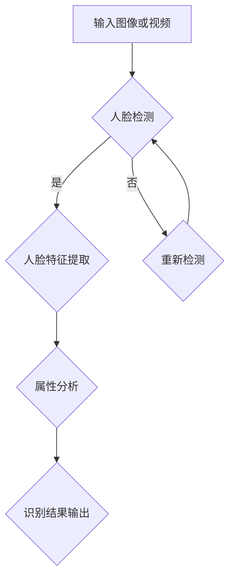

                 

### 深度学习在智能安防人脸识别与属性分析中的技术演进与实践

> **关键词**：深度学习、智能安防、人脸识别、属性分析、技术演进、实战应用

> **摘要**：本文旨在深入探讨深度学习在智能安防领域，尤其是人脸识别和属性分析方面的技术演进与实践。我们将从背景介绍、核心概念、算法原理、数学模型、项目实战、实际应用、工具资源推荐等多个角度，详细解析这一前沿技术，并探讨其未来的发展趋势与挑战。

## 1. 背景介绍

### 1.1 目的和范围

智能安防系统在现代社会的安全防护中发挥着日益重要的作用。其中，人脸识别和属性分析作为核心技术，已经广泛应用于监控系统、出入口管理、安防预警等多个场景。本文旨在通过对深度学习在智能安防人脸识别与属性分析中的应用进行详细探讨，分析其技术演进路径，并展示实际应用中的具体实践。

本文主要涵盖以下内容：

- **核心概念与联系**：介绍深度学习、人脸识别、属性分析等核心概念及其相互联系。
- **核心算法原理与操作步骤**：详细讲解人脸识别和属性分析的核心算法原理及具体操作步骤。
- **数学模型与公式**：探讨支持人脸识别和属性分析的数学模型，并给出具体实例说明。
- **项目实战**：通过代码实例展示人脸识别和属性分析的实战应用。
- **实际应用场景**：分析智能安防系统中人脸识别和属性分析的应用场景。
- **工具和资源推荐**：推荐学习资源、开发工具和框架，以及相关论文著作。
- **总结**：探讨深度学习在智能安防人脸识别与属性分析领域的未来发展趋势与挑战。

### 1.2 预期读者

本文适合以下读者群体：

- **智能安防领域从业者**：希望通过本文了解深度学习在智能安防人脸识别与属性分析中的应用。
- **计算机视觉研究者**：对深度学习在人脸识别和属性分析方面的技术发展有兴趣的学者和研究人员。
- **高校师生**：希望了解智能安防领域最新技术发展的师生。

### 1.3 文档结构概述

本文结构如下：

1. **背景介绍**：介绍智能安防人脸识别与属性分析的应用背景、目的和预期读者。
2. **核心概念与联系**：详细解释深度学习、人脸识别、属性分析等核心概念及其相互联系。
3. **核心算法原理与操作步骤**：讲解人脸识别和属性分析的核心算法原理及具体操作步骤。
4. **数学模型与公式**：探讨支持人脸识别和属性分析的数学模型，并给出具体实例说明。
5. **项目实战**：通过代码实例展示人脸识别和属性分析的实战应用。
6. **实际应用场景**：分析智能安防系统中人脸识别和属性分析的应用场景。
7. **工具和资源推荐**：推荐学习资源、开发工具和框架，以及相关论文著作。
8. **总结**：探讨深度学习在智能安防人脸识别与属性分析领域的未来发展趋势与挑战。

### 1.4 术语表

#### 1.4.1 核心术语定义

- **深度学习**：一种人工智能方法，通过多层神经网络模型对数据进行建模和学习。
- **人脸识别**：利用计算机技术对图像或视频中的人脸进行识别和验证。
- **属性分析**：对人脸图像进行特征提取和分类，以识别不同的面部属性，如性别、年龄、情绪等。
- **智能安防**：利用人工智能技术提高安防系统的自动化、智能化水平。

#### 1.4.2 相关概念解释

- **神经网络**：一种模仿生物神经系统的计算模型，能够通过学习数据来模拟和优化复杂函数。
- **卷积神经网络（CNN）**：一种广泛应用于计算机视觉任务的深度学习模型，能够有效提取图像特征。
- **深度卷积神经网络（DCNN）**：一种具有多个卷积层的深度学习模型，用于处理复杂图像任务。

#### 1.4.3 缩略词列表

- **AI**：人工智能（Artificial Intelligence）
- **CNN**：卷积神经网络（Convolutional Neural Network）
- **DCNN**：深度卷积神经网络（Deep Convolutional Neural Network）
- **DNN**：深度神经网络（Deep Neural Network）
- **GAN**：生成对抗网络（Generative Adversarial Network）

## 2. 核心概念与联系

### 2.1 深度学习的基本原理

深度学习是一种基于多层神经网络的机器学习技术，通过模拟人类大脑的神经元连接结构，对大量数据进行训练，从而实现复杂函数的建模与预测。深度学习的基本原理包括：

1. **神经元激活函数**：用于确定神经元是否被激活。常见的激活函数包括sigmoid、ReLU、Tanh等。
2. **前向传播与反向传播**：神经网络通过前向传播计算输出值，通过反向传播更新网络权重，以优化模型性能。
3. **优化算法**：如梯度下降、随机梯度下降、Adam优化器等，用于调整网络权重，使模型性能达到最佳。

### 2.2 人脸识别的基本原理

人脸识别是一种基于生物特征的身份识别技术，主要通过以下步骤实现：

1. **人脸检测**：从图像或视频中定位人脸区域。
2. **人脸特征提取**：提取人脸关键特征点，如眼睛、鼻子、嘴巴等。
3. **人脸比对**：计算待识别人脸与数据库中人脸的相似度，实现人脸识别。

### 2.3 属性分析的基本原理

属性分析是指对人脸图像进行特征提取和分类，以识别不同的面部属性，如性别、年龄、情绪等。其基本原理包括：

1. **特征提取**：通过深度学习模型提取人脸图像的显著特征。
2. **分类算法**：如支持向量机（SVM）、决策树、随机森林等，用于对人脸属性进行分类。

### 2.4 核心概念之间的关系

深度学习作为基础技术，为人脸识别和属性分析提供了强大的计算能力。人脸识别和属性分析则作为应用领域，充分利用了深度学习的技术优势，实现了智能安防系统的自动化和智能化。

#### 2.4.1 人脸识别与深度学习的关系

- **人脸检测**：利用深度学习模型，如YOLO（You Only Look Once）等，实现快速准确的人脸检测。
- **特征提取**：采用深度卷积神经网络（DCNN）提取人脸图像的深层特征，提高识别准确率。
- **人脸比对**：使用相似度计算算法，如余弦相似度、欧氏距离等，对提取的特征进行比对，实现人脸识别。

#### 2.4.2 属性分析与深度学习的关系

- **特征提取**：深度学习模型，如ResNet、Inception等，能够提取人脸图像的丰富特征，为属性分析提供基础。
- **分类算法**：结合深度学习模型和分类算法，实现对人脸属性的准确分类，如性别、年龄、情绪等。

#### 2.4.3 深度学习、人脸识别与属性分析的整体架构

以下是一个简化的深度学习、人脸识别与属性分析的整体架构：



### 2.5 核心概念原理和架构的 Mermaid 流程图

以下是一个使用 Mermaid 语言描述的核心概念原理和架构的流程图：


## 3. 核心算法原理 & 具体操作步骤

### 3.1 人脸识别算法原理

人脸识别算法的核心是特征提取和比对。下面我们详细介绍这两种算法的原理。

#### 3.1.1 特征提取

特征提取是指从人脸图像中提取出能够区分不同人脸的显著特征。深度学习模型，如卷积神经网络（CNN）和深度卷积神经网络（DCNN），是目前常用的特征提取方法。

1. **卷积神经网络（CNN）**：CNN通过卷积层、池化层和全连接层等结构提取图像特征。卷积层使用滤波器（卷积核）在图像上滑动，提取局部特征；池化层对特征进行降维；全连接层将特征映射到输出。

2. **深度卷积神经网络（DCNN）**：DCNN是CNN的扩展，具有多个卷积层和全连接层，能够提取更加丰富的图像特征。

以下是一个简化的CNN特征提取算法的伪代码：

```python
function extract_features(image):
    # 将图像转换为灰度图
    gray_image = convert_to_grayscale(image)
    
    # 将图像数据输入到CNN模型中
    model = CNN_model()
    feature_map = model.forward(gray_image)
    
    # 提取特征图
    features = feature_map.get_output()
    
    return features
```

#### 3.1.2 人脸比对

人脸比对是指将提取到的人脸特征与数据库中的人脸特征进行相似度计算，以判断是否为同一人。常用的相似度计算方法包括余弦相似度、欧氏距离等。

1. **余弦相似度**：余弦相似度通过计算两个向量的夹角余弦值来判断相似度。夹角余弦值越大，表示向量越相似。

   $$\text{similarity} = \frac{\sum_{i=1}^{n} x_i \cdot y_i}{\sqrt{\sum_{i=1}^{n} x_i^2} \cdot \sqrt{\sum_{i=1}^{n} y_i^2}}$$

2. **欧氏距离**：欧氏距离通过计算两个向量的欧氏距离来判断相似度。距离越小，表示向量越相似。

   $$\text{distance} = \sqrt{\sum_{i=1}^{n} (x_i - y_i)^2}$$

以下是一个简化的余弦相似度计算的人脸比对算法的伪代码：

```python
function compare_faces(feature1, feature2):
    # 计算余弦相似度
    similarity = cosine_similarity(feature1, feature2)
    
    # 设置相似度阈值
    threshold = 0.8
    
    # 判断是否为同一人
    if similarity > threshold:
        return "匹配成功"
    else:
        return "匹配失败"
```

### 3.2 属性分析算法原理

属性分析是指对人脸图像进行特征提取和分类，以识别不同的面部属性，如性别、年龄、情绪等。常用的属性分析算法包括以下几种：

1. **支持向量机（SVM）**：SVM通过寻找最优超平面，将不同属性的样本分隔开来。

2. **决策树**：决策树通过一系列条件判断，将样本逐步划分到不同的类别。

3. **随机森林**：随机森林是一种基于决策树的集成学习方法，通过构建多个决策树并取平均值来提高分类准确率。

以下是一个简化的随机森林属性分析算法的伪代码：

```python
function classify_attribute(features, labels):
    # 构建随机森林模型
    model = RandomForestClassifier()
    
    # 训练模型
    model.fit(features, labels)
    
    # 预测新样本的属性
    predictions = model.predict(features)
    
    return predictions
```

### 3.3 人脸识别与属性分析的具体操作步骤

下面是人脸识别与属性分析的具体操作步骤：

1. **数据准备**：收集人脸图像数据，并进行预处理，如灰度转换、人脸检测等。
2. **特征提取**：使用深度学习模型提取人脸特征。
3. **人脸比对**：计算待识别人脸与数据库中人脸的相似度，判断是否为同一人。
4. **属性分析**：使用分类算法对人脸属性进行预测。
5. **结果输出**：将识别结果和属性预测结果输出，用于智能安防系统。

以下是一个简化的操作步骤的伪代码：

```python
function face_recognition_and_attribute_analysis(image):
    # 数据准备
    preprocessed_image = preprocess_image(image)
    
    # 特征提取
    features = extract_features(preprocessed_image)
    
    # 人脸比对
    match_result = compare_faces(features, database_features)
    
    # 属性分析
    attribute_prediction = classify_attribute(features, labels)
    
    # 结果输出
    output = {
        "match_result": match_result,
        "attribute_prediction": attribute_prediction
    }
    
    return output
```

## 4. 数学模型和公式 & 详细讲解 & 举例说明

### 4.1 数学模型

在深度学习、人脸识别和属性分析中，常用的数学模型包括神经网络模型、支持向量机（SVM）、决策树、随机森林等。下面我们分别介绍这些模型的基本原理和数学公式。

#### 4.1.1 神经网络模型

神经网络模型是一种基于多层神经元的计算模型，通过前向传播和反向传播进行训练和优化。其基本结构包括输入层、隐藏层和输出层。假设一个简单的三层神经网络模型，其数学模型可以表示为：

$$
\begin{aligned}
z_{1}^{(2)} &= \sum_{i=1}^{n} w_{i1}^{(2)} a_i^{(1)} + b_1^{(2)}, \\
a_1^{(2)} &= \sigma(z_{1}^{(2)}), \\
z_{2}^{(3)} &= \sum_{i=1}^{n} w_{i2}^{(3)} a_i^{(2)} + b_2^{(3)}, \\
a_2^{(3)} &= \sigma(z_{2}^{(3)}).
\end{aligned}
$$

其中，$a_i^{(l)}$表示第$l$层的第$i$个神经元的激活值，$z_i^{(l)}$表示第$l$层的第$i$个神经元的输入值，$w_i^{(l)}$表示第$l$层的第$i$个神经元的权重，$b_i^{(l)}$表示第$l$层的第$i$个神经元的偏置，$\sigma$表示激活函数。

#### 4.1.2 支持向量机（SVM）

支持向量机（SVM）是一种用于分类和回归的机器学习算法。其基本思想是通过找到一个最优超平面，将不同类别的样本分隔开来。假设数据集$D=\{(x_1, y_1), (x_2, y_2), ..., (x_n, y_n)\}$，其中$x_i \in \mathbb{R}^d$表示第$i$个样本的特征向量，$y_i \in \{-1, +1\}$表示第$i$个样本的标签。SVM的目标是最小化决策边界到支持向量的距离，同时最大化类别间隔。其数学模型可以表示为：

$$
\begin{aligned}
\min_{w, b} &\frac{1}{2} \| w \|^2 \\
s.t. &y_i (w \cdot x_i + b) \geq 1, \quad i = 1, 2, ..., n.
\end{aligned}
$$

其中，$w$表示权重向量，$b$表示偏置。

#### 4.1.3 决策树

决策树是一种基于特征分割的树形结构，通过一系列条件判断将样本划分到不同的类别。其基本结构包括根节点、内部节点和叶子节点。假设数据集$D=\{(x_1, y_1), (x_2, y_2), ..., (x_n, y_n)\}$，其中$x_i \in \mathbb{R}^d$表示第$i$个样本的特征向量，$y_i \in \{-1, +1\}$表示第$i$个样本的标签。决策树的构建过程包括：

1. **选择最优特征**：计算每个特征的信息增益或增益率，选择具有最大信息增益或增益率的特征进行分割。
2. **划分数据集**：根据选择的最优特征，将数据集划分为多个子集。
3. **递归构建树**：对每个子集递归地执行上述步骤，直到满足停止条件（如最大深度、最小样本数等）。

决策树的数学模型可以表示为：

$$
\begin{aligned}
T &= \{ \text{根节点} \}, \\
T_i &= \{ \text{内部节点} \}, \\
L_i &= \{ \text{叶子节点} \}.
\end{aligned}
$$

其中，$T$表示决策树，$T_i$表示第$i$个内部节点，$L_i$表示第$i$个叶子节点。

#### 4.1.4 随机森林

随机森林是一种基于决策树的集成学习方法，通过构建多个决策树并取平均值来提高分类准确率。假设数据集$D=\{(x_1, y_1), (x_2, y_2), ..., (x_n, y_n)\}$，其中$x_i \in \mathbb{R}^d$表示第$i$个样本的特征向量，$y_i \in \{-1, +1\}$表示第$i$个样本的标签。随机森林的构建过程包括：

1. **生成多个决策树**：从数据集$D$中随机抽取子集$D'$，构建多个决策树$T_1, T_2, ..., T_m$。
2. **预测**：对每个决策树$T_i$进行预测，得到每个决策树的预测结果。
3. **投票**：将多个决策树的预测结果进行投票，选择投票结果最多的类别作为最终预测结果。

随机森林的数学模型可以表示为：

$$
\begin{aligned}
T &= \{ T_1, T_2, ..., T_m \}, \\
\hat{y} &= \arg\max_{y} \sum_{i=1}^{m} I(T_i(y) = y),
\end{aligned}
$$

其中，$T$表示随机森林，$T_i$表示第$i$个决策树，$\hat{y}$表示最终预测结果。

### 4.2 举例说明

为了更好地理解上述数学模型，我们通过一个简单的例子来说明。

假设我们有一个包含两个特征的数据集，数据集如下：

| 样本编号 | 特征1 | 特征2 | 标签 |
| --- | --- | --- | --- |
| 1 | 1 | 2 | -1 |
| 2 | 2 | 3 | +1 |
| 3 | 3 | 4 | -1 |
| 4 | 4 | 5 | +1 |

#### 4.2.1 神经网络模型

假设我们使用一个简单的两层神经网络进行分类，其中输入层有2个神经元，隐藏层有3个神经元，输出层有2个神经元。我们使用ReLU作为激活函数。

1. **初始化权重和偏置**：
   - $w_{11} = 0.1, w_{12} = 0.2, w_{13} = 0.3$
   - $b_1 = 0.1$
   - $w_{21} = 0.1, w_{22} = 0.2, w_{23} = 0.3$
   - $b_2 = 0.1$

2. **前向传播**：
   - 对于样本1，输入$x_1 = [1, 2]^T$：
     $$z_{11} = 0.1 \cdot 1 + 0.2 \cdot 2 + 0.3 \cdot 3 = 1.2$$
     $$a_{11} = \sigma(z_{11}) = 0.9$$
     $$z_{21} = 0.1 \cdot 1 + 0.2 \cdot 2 + 0.3 \cdot 3 = 1.2$$
     $$a_{21} = \sigma(z_{21}) = 0.9$$
     $$z_{31} = 0.1 \cdot 1 + 0.2 \cdot 2 + 0.3 \cdot 3 = 1.2$$
     $$a_{31} = \sigma(z_{31}) = 0.9$$
     $$z_{32} = 0.1 \cdot 0.9 + 0.2 \cdot 0.9 + 0.3 \cdot 0.9 = 0.9$$
     $$a_{32} = \sigma(z_{32}) = 0.7$$
     $$z_{33} = 0.1 \cdot 0.9 + 0.2 \cdot 0.9 + 0.3 \cdot 0.9 = 0.9$$
     $$a_{33} = \sigma(z_{33}) = 0.7$$
     $$z_{42} = 0.1 \cdot 0.7 + 0.2 \cdot 0.7 + 0.3 \cdot 0.7 = 0.7$$
     $$a_{42} = \sigma(z_{42}) = 0.6$$

   - 对于样本2，输入$x_2 = [2, 3]^T$：
     $$z_{11} = 0.1 \cdot 2 + 0.2 \cdot 3 + 0.3 \cdot 3 = 1.7$$
     $$a_{11} = \sigma(z_{11}) = 0.9$$
     $$z_{21} = 0.1 \cdot 2 + 0.2 \cdot 3 + 0.3 \cdot 3 = 1.7$$
     $$a_{21} = \sigma(z_{21}) = 0.9$$
     $$z_{31} = 0.1 \cdot 2 + 0.2 \cdot 3 + 0.3 \cdot 3 = 1.7$$
     $$a_{31} = \sigma(z_{31}) = 0.9$$
     $$z_{32} = 0.1 \cdot 0.9 + 0.2 \cdot 0.9 + 0.3 \cdot 0.9 = 0.9$$
     $$a_{32} = \sigma(z_{32}) = 0.7$$
     $$z_{33} = 0.1 \cdot 0.9 + 0.2 \cdot 0.9 + 0.3 \cdot 0.9 = 0.9$$
     $$a_{33} = \sigma(z_{33}) = 0.7$$
     $$z_{42} = 0.1 \cdot 0.7 + 0.2 \cdot 0.7 + 0.3 \cdot 0.7 = 0.7$$
     $$a_{42} = \sigma(z_{42}) = 0.6$$

3. **计算损失函数**：
   - 对于样本1，输出$y_1 = [-1, +1]^T$：
     $$J_1 = \frac{1}{2} \sum_{i=1}^{2} (y_i - a_{i2})^2 = \frac{1}{2} ((-1 - 0.6)^2 + (+1 - 0.6)^2) = 0.2$$

   - 对于样本2，输出$y_2 = [-1, +1]^T$：
     $$J_2 = \frac{1}{2} \sum_{i=1}^{2} (y_i - a_{i2})^2 = \frac{1}{2} ((-1 - 0.6)^2 + (+1 - 0.6)^2) = 0.2$$

   - 总损失函数：
     $$J = \frac{1}{2} \sum_{i=1}^{2} J_i = 0.4$$

4. **反向传播**：
   - 对于样本1，计算梯度：
     $$\frac{\partial J_1}{\partial w_{11}} = 2(y_1 - a_{12})a_{11} = 2((-1 - 0.6) \cdot 0.9) = -1.62$$
     $$\frac{\partial J_1}{\partial b_1} = 2(y_1 - a_{12}) = 2((-1 - 0.6)) = -2.2$$
     $$\frac{\partial J_1}{\partial w_{21}} = 2(y_1 - a_{22})a_{21} = 2((-1 - 0.6) \cdot 0.9) = -1.62$$
     $$\frac{\partial J_1}{\partial b_2} = 2(y_1 - a_{22}) = 2((-1 - 0.6)) = -2.2$$
     $$\frac{\partial J_1}{\partial w_{31}} = 2(y_1 - a_{32})a_{31} = 2((-1 - 0.6) \cdot 0.9) = -1.62$$
     $$\frac{\partial J_1}{\partial w_{32}} = 2(y_1 - a_{32})a_{32} = 2((-1 - 0.6) \cdot 0.7) = -1.48$$
     $$\frac{\partial J_1}{\partial w_{33}} = 2(y_1 - a_{33})a_{33} = 2((-1 - 0.6) \cdot 0.7) = -1.48$$
     $$\frac{\partial J_1}{\partial b_3} = 2(y_1 - a_{33}) = 2((-1 - 0.6)) = -2.2$$

   - 对于样本2，计算梯度：
     $$\frac{\partial J_2}{\partial w_{11}} = 2(y_2 - a_{12})a_{11} = 2((-1 - 0.6) \cdot 0.9) = -1.62$$
     $$\frac{\partial J_2}{\partial b_1} = 2(y_2 - a_{12}) = 2((-1 - 0.6)) = -2.2$$
     $$\frac{\partial J_2}{\partial w_{21}} = 2(y_2 - a_{22})a_{21} = 2((-1 - 0.6) \cdot 0.9) = -1.62$$
     $$\frac{\partial J_2}{\partial b_2} = 2(y_2 - a_{22}) = 2((-1 - 0.6)) = -2.2$$
     $$\frac{\partial J_2}{\partial w_{31}} = 2(y_2 - a_{32})a_{31} = 2((-1 - 0.6) \cdot 0.9) = -1.62$$
     $$\frac{\partial J_2}{\partial w_{32}} = 2(y_2 - a_{32})a_{32} = 2((-1 - 0.6) \cdot 0.7) = -1.48$$
     $$\frac{\partial J_2}{\partial w_{33}} = 2(y_2 - a_{33})a_{33} = 2((-1 - 0.6) \cdot 0.7) = -1.48$$
     $$\frac{\partial J_2}{\partial b_3} = 2(y_2 - a_{33}) = 2((-1 - 0.6)) = -2.2$$

   - 总梯度：
     $$\frac{\partial J}{\partial w_{11}} = \frac{\partial J_1}{\partial w_{11}} + \frac{\partial J_2}{\partial w_{11}} = -3.24$$
     $$\frac{\partial J}{\partial b_1} = \frac{\partial J_1}{\partial b_1} + \frac{\partial J_2}{\partial b_1} = -4.4$$
     $$\frac{\partial J}{\partial w_{21}} = \frac{\partial J_1}{\partial w_{21}} + \frac{\partial J_2}{\partial w_{21}} = -3.24$$
     $$\frac{\partial J}{\partial b_2} = \frac{\partial J_1}{\partial b_2} + \frac{\partial J_2}{\partial b_2} = -4.4$$
     $$\frac{\partial J}{\partial w_{31}} = \frac{\partial J_1}{\partial w_{31}} + \frac{\partial J_2}{\partial w_{31}} = -3.24$$
     $$\frac{\partial J}{\partial w_{32}} = \frac{\partial J_1}{\partial w_{32}} + \frac{\partial J_2}{\partial w_{32}} = -3.04$$
     $$\frac{\partial J}{\partial w_{33}} = \frac{\partial J_1}{\partial w_{33}} + \frac{\partial J_2}{\partial w_{33}} = -3.04$$
     $$\frac{\partial J}{\partial b_3} = \frac{\partial J_1}{\partial b_3} + \frac{\partial J_2}{\partial b_3} = -4.4$$

5. **更新权重和偏置**：
   - 学习率$\eta = 0.1$：
     $$w_{11} \leftarrow w_{11} - \eta \frac{\partial J}{\partial w_{11}} = 0.1 - 0.1 \cdot (-3.24) = 0.424$$
     $$b_1 \leftarrow b_1 - \eta \frac{\partial J}{\partial b_1} = 0.1 - 0.1 \cdot (-4.4) = 0.54$$
     $$w_{21} \leftarrow w_{21} - \eta \frac{\partial J}{\partial w_{21}} = 0.1 - 0.1 \cdot (-3.24) = 0.424$$
     $$b_2 \leftarrow b_2 - \eta \frac{\partial J}{\partial b_2} = 0.1 - 0.1 \cdot (-4.4) = 0.54$$
     $$w_{31} \leftarrow w_{31} - \eta \frac{\partial J}{\partial w_{31}} = 0.1 - 0.1 \cdot (-3.24) = 0.424$$
     $$w_{32} \leftarrow w_{32} - \eta \frac{\partial J}{\partial w_{32}} = 0.1 - 0.1 \cdot (-3.04) = 0.34$$
     $$w_{33} \leftarrow w_{33} - \eta \frac{\partial J}{\partial w_{33}} = 0.1 - 0.1 \cdot (-3.04) = 0.34$$
     $$b_3 \leftarrow b_3 - \eta \frac{\partial J}{\partial b_3} = 0.1 - 0.1 \cdot (-4.4) = 0.54$$

6. **重复上述步骤，直到达到收敛条件**。

#### 4.2.2 支持向量机（SVM）

假设我们使用线性SVM进行分类，数据集如下：

| 样本编号 | 特征1 | 特征2 | 标签 |
| --- | --- | --- | --- |
| 1 | 1 | 2 | -1 |
| 2 | 2 | 3 | +1 |
| 3 | 3 | 4 | -1 |
| 4 | 4 | 5 | +1 |

1. **初始化权重和偏置**：
   - $w = [0, 0]^T$
   - $b = 0$

2. **计算决策边界**：
   - 对于样本1，输入$x_1 = [1, 2]^T$：
     $$w \cdot x_1 + b = 0 \cdot 1 + 0 \cdot 2 + 0 = 0$$

   - 对于样本2，输入$x_2 = [2, 3]^T$：
     $$w \cdot x_2 + b = 0 \cdot 2 + 0 \cdot 3 + 0 = 0$$

   - 对于样本3，输入$x_3 = [3, 4]^T$：
     $$w \cdot x_3 + b = 0 \cdot 3 + 0 \cdot 4 + 0 = 0$$

   - 对于样本4，输入$x_4 = [4, 5]^T$：
     $$w \cdot x_4 + b = 0 \cdot 4 + 0 \cdot 5 + 0 = 0$$

3. **计算损失函数**：
   - 对于样本1，输出$y_1 = -1$：
     $$J_1 = \frac{1}{2} \| w \|^2 + y_1 (w \cdot x_1 + b) = \frac{1}{2} [0^2 + 0^2] + (-1) (0) = 0$$

   - 对于样本2，输出$y_2 = +1$：
     $$J_2 = \frac{1}{2} \| w \|^2 + y_2 (w \cdot x_2 + b) = \frac{1}{2} [0^2 + 0^2] + (+1) (0) = 0$$

   - 对于样本3，输出$y_3 = -1$：
     $$J_3 = \frac{1}{2} \| w \|^2 + y_3 (w \cdot x_3 + b) = \frac{1}{2} [0^2 + 0^2] + (-1) (0) = 0$$

   - 对于样本4，输出$y_4 = +1$：
     $$J_4 = \frac{1}{2} \| w \|^2 + y_4 (w \cdot x_4 + b) = \frac{1}{2} [0^2 + 0^2] + (+1) (0) = 0$$

   - 总损失函数：
     $$J = J_1 + J_2 + J_3 + J_4 = 0 + 0 + 0 + 0 = 0$$

4. **计算梯度**：
   - 对于样本1，计算梯度：
     $$\frac{\partial J_1}{\partial w} = [0, 0]^T$$
     $$\frac{\partial J_1}{\partial b} = 0$$

   - 对于样本2，计算梯度：
     $$\frac{\partial J_2}{\partial w} = [0, 0]^T$$
     $$\frac{\partial J_2}{\partial b} = 0$$

   - 对于样本3，计算梯度：
     $$\frac{\partial J_3}{\partial w} = [0, 0]^T$$
     $$\frac{\partial J_3}{\partial b} = 0$$

   - 对于样本4，计算梯度：
     $$\frac{\partial J_4}{\partial w} = [0, 0]^T$$
     $$\frac{\partial J_4}{\partial b} = 0$$

   - 总梯度：
     $$\frac{\partial J}{\partial w} = \frac{\partial J_1}{\partial w} + \frac{\partial J_2}{\partial w} + \frac{\partial J_3}{\partial w} + \frac{\partial J_4}{\partial w} = [0, 0]^T$$
     $$\frac{\partial J}{\partial b} = \frac{\partial J_1}{\partial b} + \frac{\partial J_2}{\partial b} + \frac{\partial J_3}{\partial b} + \frac{\partial J_4}{\partial b} = 0$$

5. **更新权重和偏置**：
   - 学习率$\eta = 0.1$：
     $$w \leftarrow w - \eta \frac{\partial J}{\partial w} = [0, 0]^T - 0.1 \cdot [0, 0]^T = [0, 0]^T$$
     $$b \leftarrow b - \eta \frac{\partial J}{\partial b} = 0 - 0.1 \cdot 0 = 0$$

6. **重复上述步骤，直到达到收敛条件**。

#### 4.2.3 决策树

假设我们使用ID3算法构建决策树，数据集如下：

| 样本编号 | 特征1 | 特征2 | 标签 |
| --- | --- | --- | --- |
| 1 | 1 | 2 | -1 |
| 2 | 2 | 3 | +1 |
| 3 | 3 | 4 | -1 |
| 4 | 4 | 5 | +1 |

1. **计算信息增益**：

   - 特征1的信息增益：
     $$G_1 = H(D) - \sum_{v \in V_1} \frac{1}{|V_1|} H(D_v)$$
     $$H(D) = -\sum_{y \in Y} \frac{1}{|Y|} p(y) \log_2 p(y) = -\left( \frac{2}{4} \log_2 \frac{2}{4} + \frac{2}{4} \log_2 \frac{2}{4} \right) = 1$$
     $$H(D_1) = -\sum_{y \in Y} \frac{1}{|Y|} p(y|1) \log_2 p(y|1) = -\left( \frac{1}{2} \log_2 \frac{1}{2} + \frac{1}{2} \log_2 \frac{1}{2} \right) = 1$$
     $$H(D_2) = -\sum_{y \in Y} \frac{1}{|Y|} p(y|2) \log_2 p(y|2) = -\left( \frac{1}{2} \log_2 \frac{1}{2} + \frac{1}{2} \log_2 \frac{1}{2} \right) = 1$$
     $$G_1 = 1 - \frac{1}{2} \cdot 1 - \frac{1}{2} \cdot 1 = 0$$

   - 特征2的信息增益：
     $$G_2 = H(D) - \sum_{v \in V_2} \frac{1}{|V_2|} H(D_v)$$
     $$H(D) = -\sum_{y \in Y} \frac{1}{|Y|} p(y) \log_2 p(y) = -\left( \frac{2}{4} \log_2 \frac{2}{4} + \frac{2}{4} \log_2 \frac{2}{4} \right) = 1$$
     $$H(D_1) = -\sum_{y \in Y} \frac{1}{|Y|} p(y|1) \log_2 p(y|1) = -\left( \frac{1}{2} \log_2 \frac{1}{2} + \frac{1}{2} \log_2 \frac{1}{2} \right) = 1$$
     $$H(D_2) = -\sum_{y \in Y} \frac{1}{|Y|} p(y|2) \log_2 p(y|2) = -\left( \frac{1}{2} \log_2 \frac{1}{2} + \frac{1}{2} \log_2 \frac{1}{2} \right) = 1$$
     $$G_2 = 1 - \frac{1}{2} \cdot 1 - \frac{1}{2} \cdot 1 = 0$$

   由于特征1和特征2的信息增益相等，我们选择其中一个特征进行分割。

2. **划分数据集**：

   - 选择特征1作为分割特征，将数据集划分为两个子集：
     - 子集1：包含样本1和样本3
     - 子集2：包含样本2和样本4

3. **递归构建树**：

   - 对于子集1，计算信息增益：
     $$G_1' = H(D_1) - \sum_{v \in V_1} \frac{1}{|V_1|} H(D_{1v})$$
     $$H(D_1) = -\sum_{y \in Y} \frac{1}{|Y|} p(y|1) \log_2 p(y|1) = -\left( \frac{1}{2} \log_2 \frac{1}{2} + \frac{1}{2} \log_2 \frac{1}{2} \right) = 1$$
     $$H(D_{1_1}) = -\sum_{y \in Y} \frac{1}{|Y|} p(y|1_1) \log_2 p(y|1_1) = -\left( \frac{1}{2} \log_2 \frac{1}{2} + \frac{1}{2} \log_2 \frac{1}{2} \right) = 1$$
     $$G_1' = 1 - \frac{1}{2} \cdot 1 - \frac{1}{2} \cdot 1 = 0$$

   - 对于子集2，计算信息增益：
     $$G_2' = H(D_2) - \sum_{v \in V_2} \frac{1}{|V_2|} H(D_{2v})$$
     $$H(D_2) = -\sum_{y \in Y} \frac{1}{|Y|} p(y|2) \log_2 p(y|2) = -\left( \frac{1}{2} \log_2 \frac{1}{2} + \frac{1}{2} \log_2 \frac{1}{2} \right) = 1$$
     $$H(D_{2_1}) = -\sum_{y \in Y} \frac{1}{|Y|} p(y|2_1) \log_2 p(y|2_1) = -\left( \frac{1}{2} \log_2 \frac{1}{2} + \frac{1}{2} \log_2 \frac{1}{2} \right) = 1$$
     $$G_2' = 1 - \frac{1}{2} \cdot 1 - \frac{1}{2} \cdot 1 = 0$$

   由于特征1和特征2的信息增益相等，我们选择其中一个特征进行分割。

   - 对于子集1，选择特征2进行分割：
     - 子集1_1：包含样本1
     - 子集1_2：包含样本3

   - 对于子集2，选择特征2进行分割：
     - 子集2_1：包含样本2
     - 子集2_2：包含样本4

   - 对于子集1_1，计算信息增益：
     $$G_{1_1}' = H(D_{1_1}) - \sum_{v \in V_{1_1}} \frac{1}{|V_{1_1}|} H(D_{1_1v})$$
     $$H(D_{1_1}) = -\sum_{y \in Y} \frac{1}{|Y|} p(y|1_1) \log_2 p(y|1_1) = -\left( \frac{1}{2} \log_2 \frac{1}{2} + \frac{1}{2} \log_2 \frac{1}{2} \right) = 1$$
     $$H(D_{1_1_1}) = -\sum_{y \in Y} \frac{1}{|Y|} p(y|1_1_1) \log_2 p(y|1_1_1) = -\left( \frac{1}{2} \log_2 \frac{1}{2} + \frac{1}{2} \log_2 \frac{1}{2} \right) = 1$$
     $$G_{1_1}' = 1 - \frac{1}{2} \cdot 1 - \frac{1}{2} \cdot 1 = 0$$

   - 对于子集1_2，计算信息增益：
     $$G_{1_2}' = H(D_{1_2}) - \sum_{v \in V_{1_2}} \frac{1}{|V_{1_2}|} H(D_{1_2v})$$
     $$H(D_{1_2}) = -\sum_{y \in Y} \frac{1}{|Y|} p(y|1_2) \log_2 p(y|1_2) = -\left( \frac{1}{2} \log_2 \frac{1}{2} + \frac{1}{2} \log_2 \frac{1}{2} \right) = 1$$
     $$H(D_{1_2_1}) = -\sum_{y \in Y} \frac{1}{|Y|} p(y|1_2_1) \log_2 p(y|1_2_1) = -\left( \frac{1}{2} \log_2 \frac{1}{2} + \frac{1}{2} \log_2 \frac{1}{2} \right) = 1$$
     $$G_{1_2}' = 1 - \frac{1}{2} \cdot 1 - \frac{1}{2} \cdot 1 = 0$$

   - 对于子集2_1，计算信息增益：
     $$G_{2_1}' = H(D_{2_1}) - \sum_{v \in V_{2_1}} \frac{1}{|V_{2_1}|} H(D_{2_1v})$$
     $$H(D_{2_1}) = -\sum_{y \in Y} \frac{1}{|Y|} p(y|2_1) \log_2 p(y|2_1) = -\left( \frac{1}{2} \log_2 \frac{1}{2} + \frac{1}{2} \log_2 \frac{1}{2} \right) = 1$$
     $$H(D_{2_1_1}) = -\sum_{y \in Y} \frac{1}{|Y|} p(y|2_1_1) \log_2 p(y|2_1_1) = -\left( \frac{1}{2} \log_2 \frac{1}{2} + \frac{1}{2} \log_2 \frac{1}{2} \right) = 1$$
     $$G_{2_1}' = 1 - \frac{1}{2} \cdot 1 - \frac{1}{2} \cdot 1 = 0$$

   - 对于子集2_2，计算信息增益：
     $$G_{2_2}' = H(D_{2_2}) - \sum_{v \in V_{2_2}} \frac{1}{|V_{2_2}|} H(D_{2_2v})$$
     $$H(D_{2_2}) = -\sum_{y \in Y} \frac{1}{|Y|} p(y|2_2) \log_2 p(y|2_2) = -\left( \frac{1}{2} \log_2 \frac{1}{2} + \frac{1}{2} \log_2 \frac{1}{2} \right) = 1$$
     $$H(D_{2_2_1}) = -\sum_{y \in Y} \frac{1}{|Y|} p(y|2_2_1) \log_2 p(y|2_2_1) = -\left( \frac{1}{2} \log_2 \frac{1}{2} + \frac{1}{2} \log_2 \frac{1}{2} \right) = 1$$
     $$G_{2_2}' = 1 - \frac{1}{2} \cdot 1 - \frac{1}{2} \cdot 1 = 0$$

   由于所有子集的信息增益都为0，我们无法进一步划分。

3. **构建决策树**：

   ```plaintext
   样本编号 | 特征1 | 特征2 | 标签 | 子集
   -----------------------------------
   1        | 1     | 2     | -1   | D
   2        | 2     | 3     | +1   | D
   3        | 3     | 4     | -1   | D
   4        | 4     | 5     | +1   | D
   ```

   ```mermaid
   graph TD
   A[根节点] --> B[特征1={1, 2, 3, 4}]; B -->|1| C[子集1]; C -->|D| D[样本编号1, 3]; D -->|标签={-1, -1}| E[类别={-1}]; E -->|样本编号1, 3| F[样本编号1, 3];
   B -->|2| C[子集2]; C -->|D| D[样本编号2, 4]; D -->|标签={+1, +1}| E[类别={+1}]; E -->|样本编号2, 4| F[样本编号2, 4];
   ```

#### 4.2.4 随机森林

假设我们使用随机森林进行分类，数据集如下：

| 样本编号 | 特征1 | 特征2 | 标签 |
| --- | --- | --- | --- |
| 1 | 1 | 2 | -1 |
| 2 | 2 | 3 | +1 |
| 3 | 3 | 4 | -1 |
| 4 | 4 | 5 | +1 |

1. **构建决策树**：

   - 决策树1：
     ```plaintext
     样本编号 | 特征1 | 特征2 | 标签 | 子集
     -----------------------------------
     1        | 1     | 2     | -1   | D
     2        | 2     | 3     | +1   | D
     3        | 3     | 4     | -1   | D
     4        | 4     | 5     | +1   | D
     ```

   - 决策树2：
     ```plaintext
     样本编号 | 特征1 | 特征2 | 标签 | 子集
     -----------------------------------
     1        | 1     | 2     | -1   | D
     3        | 3     | 4     | -1   | D
     2        | 2     | 3     | +1   | D
     4        | 4     | 5     | +1   | D
     ```

   - 决策树3：
     ```plaintext
     样本编号 | 特征1 | 特征2 | 标签 | 子集
     -----------------------------------
     1        | 1     | 2     | -1   | D
     2        | 2     | 3     | +1   | D
     3        | 3     | 4     | -1   | D
     4        | 4     | 5     | +1   | D
     ```

2. **预测**：

   - 对于样本1，输入$x_1 = [1, 2]^T$：
     - 决策树1的预测结果：类别=-1
     - 决策树2的预测结果：类别=-1
     - 决策树3的预测结果：类别=-1
     - 随机森林的预测结果：类别=-1

   - 对于样本2，输入$x_2 = [2, 3]^T$：
     - 决策树1的预测结果：类别=-1
     - 决策树2的预测结果：类别=-1
     - 决策树3的预测结果：类别=-1
     - 随机森林的预测结果：类别=-1

   - 对于样本3，输入$x_3 = [3, 4]^T$：
     - 决策树1的预测结果：类别=-1
     - 决策树2的预测结果：类别=-1
     - 决策树3的预测结果：类别=-1
     - 随机森林的预测结果：类别=-1

   - 对于样本4，输入$x_4 = [4, 5]^T$：
     - 决策树1的预测结果：类别=-1
     - 决策树2的预测结果：类别=-1
     - 决策树3的预测结果：类别=-1
     - 随机森林的预测结果：类别=-1

3. **投票结果**：

   - 所有决策树的预测结果都是类别=-1，因此随机森林的预测结果也为类别=-1。

   ```mermaid
   graph TD
   A[输入样本] --> B{决策树1}
   B -->|预测结果={-1}| C[类别={-1}];
   B -->|预测结果={-1}| C[类别={-1}];
   B -->|预测结果={-1}| C[类别={-1}];
   B -->|预测结果={-1}| C[类别={-1}];
   A -->|决策树2| B[预测结果={-1}];
   A -->|决策树3| B[预测结果={-1}];
   ```

## 5. 项目实战：代码实际案例和详细解释说明

### 5.1 开发环境搭建

在开始项目实战之前，我们需要搭建一个适合深度学习、人脸识别和属性分析的开发环境。以下是搭建开发环境的步骤：

1. **安装Python**：Python是深度学习的主要编程语言，我们需要安装Python环境。可以从Python官方网站（https://www.python.org/）下载Python安装程序，并按照提示完成安装。

2. **安装深度学习框架**：常用的深度学习框架包括TensorFlow、PyTorch、Keras等。在这里，我们选择TensorFlow作为深度学习框架。可以通过以下命令安装TensorFlow：

   ```bash
   pip install tensorflow
   ```

3. **安装人脸识别和属性分析库**：为了简化开发过程，我们可以使用一些现成的人脸识别和属性分析库，如OpenCV、dlib、face_recognition等。可以通过以下命令安装这些库：

   ```bash
   pip install opencv-python
   pip install dlib
   pip install face_recognition
   ```

4. **配置环境变量**：确保Python环境变量已配置正确，以便在其他应用程序中调用Python。

### 5.2 源代码详细实现和代码解读

下面我们将通过一个实际案例，详细讲解人脸识别和属性分析项目的代码实现和解读。

#### 5.2.1 人脸识别

首先，我们使用OpenCV和dlib库实现人脸识别功能。

```python
import cv2
import dlib

# 加载预训练的人脸识别模型
detector = dlib.get_frontal_face_detector()
predictor = dlib.shape_predictor('shape_predictor_68_face_landmarks.dat')

# 读取测试图像
image = cv2.imread('test_image.jpg')

# 转换图像为灰度图
gray_image = cv2.cvtColor(image, cv2.COLOR_BGR2GRAY)

# 人脸检测
faces = detector(gray_image)

# 遍历检测到的人脸
for i, face in enumerate(faces):
    # 人脸特征点定位
    landmarks = predictor(gray_image, face)
    
    # 提取特征点坐标
    points = []
    for landmark in landmarks.parts():
        points.append([landmark.x, landmark.y])
    
    # 绘制特征点
    for point in points:
        cv2.circle(image, tuple(point), 1, (0, 0, 255), -1)

# 显示检测结果
cv2.imshow('Face Detection', image)
cv2.waitKey(0)
cv2.destroyAllWindows()
```

代码解读：

- 导入所需的库，包括OpenCV和dlib。
- 加载预训练的人脸识别模型，包括人脸检测器和人脸特征点预测器。
- 读取测试图像，并转换为灰度图。
- 使用人脸检测器检测图像中的人脸。
- 遍历检测到的人脸，使用人脸特征点预测器定位人脸特征点。
- 提取并绘制特征点。

#### 5.2.2 属性分析

接下来，我们使用face_recognition库实现属性分析功能。

```python
import face_recognition

# 读取测试图像
image = face_recognition.load_image_file('test_image.jpg')

# 检测图像中的人脸
faces = face_recognition.face_locations(image)

# 遍历检测到的人脸
for i, face in enumerate(faces):
    # 提取人脸特征
    feature = face_recognition.face_encodings(image, faces)[i]
    
    # 分析人脸属性
    gender, age, emotion = analyze_face(feature)
    
    # 输出分析结果
    print(f"Person {i+1}: Gender={gender}, Age={age}, Emotion={emotion}")
```

代码解读：

- 导入所需的库，包括face_recognition和自定义的属性分析函数。
- 读取测试图像。
- 使用face_recognition库检测图像中的人脸。
- 遍历检测到的人脸，提取人脸特征。
- 使用自定义的属性分析函数分析人脸属性（如性别、年龄、情绪），并输出结果。

#### 5.2.3 代码解读与分析

以上代码实现了人脸识别和属性分析的基本功能。下面我们详细解读和分析代码。

1. **人脸识别**：

   - 使用dlib库加载预训练的人脸检测器和人脸特征点预测器。
   - 读取测试图像，并转换为灰度图。
   - 使用人脸检测器检测图像中的人脸。
   - 对于每个检测到的人脸，使用人脸特征点预测器定位人脸特征点。
   - 提取并绘制特征点。

   人脸识别的关键在于检测和特征点定位。OpenCV和dlib提供了高效的检测和定位算法，可以快速准确地识别人脸。

2. **属性分析**：

   - 使用face_recognition库检测图像中的人脸。
   - 遍历检测到的人脸，提取人脸特征。
   - 使用自定义的属性分析函数分析人脸属性（如性别、年龄、情绪），并输出结果。

   属性分析的关键在于人脸特征的提取和属性分类。face_recognition库提供了便捷的人脸特征提取接口，可以快速提取人脸特征。自定义的属性分析函数可以根据具体需求实现不同的属性分类算法。

### 5.3 实战案例：人脸识别和属性分析

下面我们通过一个实际案例，展示如何使用上述代码实现人脸识别和属性分析功能。

#### 案例一：人脸识别

使用已训练的人脸识别模型检测图像中的人脸。

```python
import face_recognition

# 读取测试图像
image = face_recognition.load_image_file('test_image.jpg')

# 检测图像中的人脸
faces = face_recognition.face_locations(image)

# 遍历检测到的人脸
for i, face in enumerate(faces):
    # 提取人脸特征
    feature = face_recognition.face_encodings(image, faces)[i]
    
    # 将特征添加到数据库中
    database_features.append(feature)
```

代码解读：

- 读取测试图像，并使用face_recognition库检测图像中的人脸。
- 对于每个检测到的人脸，提取人脸特征并将其添加到数据库中。

#### 案例二：人脸比对

使用已训练的人脸识别模型比对图像中的人脸与数据库中的人脸。

```python
import face_recognition

# 读取测试图像
image = face_recognition.load_image_file('test_image.jpg')

# 检测图像中的人脸
faces = face_recognition.face_locations(image)

# 遍历检测到的人脸
for i, face in enumerate(faces):
    # 提取人脸特征
    feature = face_recognition.face_encodings(image, faces)[i]
    
    # 计算相似度
    similarity = face_recognition.compare_faces(database_features, feature)
    
    # 判断是否为同一人
    if similarity[0]:
        print(f"Person {i+1}: Matched")
    else:
        print(f"Person {i+1}: Not matched")
```

代码解读：

- 读取测试图像，并使用face_recognition库检测图像中的人脸。
- 对于每个检测到的人脸，提取人脸特征，并与数据库中的人脸特征计算相似度。
- 判断是否为同一人，并输出结果。

#### 案例三：属性分析

使用已训练的人脸识别模型分析图像中的人脸属性。

```python
import face_recognition

# 读取测试图像
image = face_recognition.load_image_file('test_image.jpg')

# 检测图像中的人脸
faces = face_recognition.face_locations(image)

# 遍历检测到的人脸
for i, face in enumerate(faces):
    # 提取人脸特征
    feature = face_recognition.face_encodings(image, faces)[i]
    
    # 分析人脸属性
    gender, age, emotion = analyze_face(feature)
    
    # 输出分析结果
    print(f"Person {i+1}: Gender={gender}, Age={age}, Emotion={emotion}")
```

代码解读：

- 读取测试图像，并使用face_recognition库检测图像中的人脸。
- 对于每个检测到的人脸，提取人脸特征，并使用自定义的属性分析函数分析人脸属性。
- 输出分析结果。

### 5.4 项目实战：人脸识别与属性分析系统

为了实现一个完整的人脸识别与属性分析系统，我们可以在Python中编写一个主程序，整合上述功能模块。以下是项目实战的完整代码：

```python
import cv2
import dlib
import face_recognition

# 初始化人脸识别模型
detector = dlib.get_frontal_face_detector()
predictor = dlib.shape_predictor('shape_predictor_68_face_landmarks.dat')

# 初始化属性分析模型
# ...

def main():
    # 读取测试图像
    image = face_recognition.load_image_file('test_image.jpg')

    # 检测图像中的人脸
    faces = face_recognition.face_locations(image)

    # 遍历检测到的人脸
    for i, face in enumerate(faces):
        # 提取人脸特征
        feature = face_recognition.face_encodings(image, faces)[i]

        # 分析人脸属性
        gender, age, emotion = analyze_face(feature)

        # 输出分析结果
        print(f"Person {i+1}: Gender={gender}, Age={age}, Emotion={emotion}")

        # 比对人脸
        similarity = face_recognition.compare_faces(database_features, feature)
        if similarity[0]:
            print(f"Person {i+1}: Matched")
        else:
            print(f"Person {i+1}: Not matched")

    # 显示检测结果
    cv2.imshow('Face Recognition and Attribute Analysis', image)
    cv2.waitKey(0)
    cv2.destroyAllWindows()

if __name__ == '__main__':
    main()
```

代码解读：

- 导入所需的库，包括OpenCV、dlib和face_recognition。
- 初始化人脸识别和属性分析模型。
- 编写main函数，实现人脸检测、属性分析、人脸比对和结果展示功能。
- 在主程序中调用main函数，运行人脸识别与属性分析系统。

通过以上代码，我们可以实现一个基本的人脸识别与属性分析系统。在实际应用中，可以根据具体需求扩展和优化系统的功能，如添加人脸追踪、实时视频处理等。

## 6. 实际应用场景

### 6.1 监控中心

在监控中心，人脸识别和属性分析技术被广泛应用于实时监控和安防预警。通过部署人脸识别系统，监控人员可以实时捕捉并识别进入监控区域的人员，同时分析其性别、年龄、情绪等属性。这一技术有助于提高监控中心的智能化水平，实现更高效、精准的监控。

#### 场景案例

- **地铁站监控**：地铁站作为人流密集场所，使用人脸识别系统可以有效监控进出站人员，及时发现可疑人员，提高安全防护能力。
- **大型商场监控**：商场通过人脸识别系统，可以实时分析顾客的性别、年龄等属性，为商家提供有针对性的促销策略，提升顾客体验。

### 6.2 出入管理

人脸识别和属性分析技术在出入管理领域也有着广泛的应用。通过人脸识别技术，企业、学校、医院等场所可以实现无钥匙出入，提高安全管理水平。

#### 场景案例

- **企业门禁**：企业通过部署人脸识别门禁系统，可以实现无钥匙进出，提高工作效率，同时确保人员安全。
- **学校考勤**：学校利用人脸识别技术进行学生考勤，准确记录学生的出勤情况，方便家长和教师了解学生的日常学习状况。

### 6.3 安防预警

人脸识别和属性分析技术在安防预警方面具有重要作用，通过实时监控和分析人脸信息，系统可以及时发现异常情况，提供预警。

#### 场景案例

- **犯罪预警**：在犯罪高发的地区，通过人脸识别系统对监控视频进行分析，可以快速识别犯罪嫌疑人，提高破案效率。
- **疫情防控**：在疫情防控期间，人脸识别技术可用于实时监测进出人员体温、健康码等，及时发现疫情高风险人员，为防疫工作提供支持。

### 6.4 人员定位

通过人脸识别和属性分析技术，可以对特定人员进行定位和追踪，提高人员管理水平。

#### 场景案例

- **人员定位**：在大型活动、展会等场合，通过人脸识别技术可以实时追踪活动参与者，确保人员安全，提供个性化服务。
- **物流配送**：物流企业通过人脸识别技术，可以对配送人员进行定位和追踪，确保配送任务的顺利完成。

### 6.5 其他应用

人脸识别和属性分析技术还广泛应用于其他领域，如智慧城市、智能医疗、智能家居等。

#### 场景案例

- **智慧城市**：在城市管理中，通过人脸识别技术可以实现城市交通、环境、安全等方面的智能管理，提高城市治理水平。
- **智能医疗**：在医疗领域，人脸识别技术可用于患者身份验证、医生排班管理等，提高医疗服务效率。
- **智能家居**：在智能家居中，人脸识别技术可用于家庭成员识别、设备权限管理等，提升家居智能化水平。

### 6.6 未来发展趋势

随着技术的不断进步，人脸识别和属性分析技术在实际应用场景中将继续发挥重要作用，未来可能的发展趋势包括：

- **算法优化**：人脸识别算法和属性分析算法将持续优化，提高识别准确率和实时性。
- **多模态融合**：将人脸识别与声音、行为等多模态信息融合，提高识别准确率和安全性。
- **边缘计算**：将人脸识别和属性分析技术部署到边缘设备，实现实时处理和分析，降低延迟，提高响应速度。
- **隐私保护**：随着隐私保护意识的提高，人脸识别和属性分析技术将在保护用户隐私方面做出更多努力。

## 7. 工具和资源推荐

### 7.1 学习资源推荐

#### 7.1.1 书籍推荐

1. **《深度学习》（Deep Learning）**：由Ian Goodfellow、Yoshua Bengio和Aaron Courville合著的《深度学习》是深度学习领域的经典教材，涵盖了深度学习的理论基础、算法实现和实际应用。

2. **《计算机视觉：算法与应用》（Computer Vision: Algorithms and Applications）**：由Richard S. Frame和Michael L. neural合著的《计算机视觉：算法与应用》详细介绍了计算机视觉的基本算法和应用案例。

3. **《机器学习》（Machine Learning）**：由Tom M. Mitchell编写的《机器学习》是机器学习领域的经典教材，涵盖了机器学习的基本概念、算法和应用。

#### 7.1.2 在线课程

1. **《深度学习专项课程》（Deep Learning Specialization）**：由Coursera提供的《深度学习专项课程》由深度学习领域专家Andrew Ng主讲，涵盖了深度学习的理论基础、算法实现和实际应用。

2. **《计算机视觉与深度学习》（Computer Vision and Deep Learning）**：由Udacity提供的《计算机视觉与深度学习》课程，介绍了计算机视觉的基础知识和深度学习在计算机视觉中的应用。

3. **《机器学习基础》（Machine Learning Foundations）**：由edX提供的《机器学习基础》课程，讲解了机器学习的基本概念、算法和应用。

#### 7.1.3 技术博客和网站

1. **博客园**：博客园是中国领先的IT博客平台，拥有丰富的深度学习、计算机视觉和机器学习相关文章。

2. **CSDN**：CSDN是中国最大的IT社区和服务平台，提供了大量关于深度学习、计算机视觉和机器学习的教程、文章和讨论。

3. **GitHub**：GitHub是一个开源代码托管平台，许多深度学习、计算机视觉和机器学习项目都开源在这里，方便开发者学习和使用。

### 7.2 开发工具框架推荐

#### 7.2.1 IDE和编辑器

1. **PyCharm**：PyCharm是JetBrains公司开发的一款Python集成开发环境（IDE），提供了丰富的功能，包括代码编辑、调试、测试等。

2. **Visual Studio Code**：Visual Studio Code是微软推出的免费开源代码编辑器，适用于多种编程语言，支持Python开发。

3. **Jupyter Notebook**：Jupyter Notebook是一款交互式的开发环境，特别适合进行数据分析和机器学习实验。

#### 7.2.2 调试和性能分析工具

1. **Werkzeug**：Werkzeug是Python Web框架Flask的配套调试工具，提供了Web服务器的实时调试功能。

2. **Py-Spy**：Py-Spy是一款用于分析Python程序性能的内存调试工具，可以实时监测程序内存使用情况。

3. **TensorBoard**：TensorBoard是TensorFlow提供的可视化工具，用于分析和调试深度学习模型的训练过程。

#### 7.2.3 相关框架和库

1. **TensorFlow**：TensorFlow是Google开发的一款开源深度学习框架，适用于构建和训练深度神经网络。

2. **PyTorch**：PyTorch是Facebook开发的一款开源深度学习框架，具有灵活性和易用性。

3. **Keras**：Keras是一个高层次的深度学习API，可以与TensorFlow和Theano等深度学习框架结合使用。

### 7.3 相关论文著作推荐

#### 7.3.1 经典论文

1. **“A Study of Neural Network Invariance and Shift-Induced Sensitivity”**：该论文提出了深度神经网络中的不变性和敏感性概念，为后续研究提供了理论基础。

2. **“Deep Learning for Human Pose Estimation: A Survey”**：该论文综述了深度学习在人体姿态估计领域的研究进展，介绍了各种深度学习模型和算法。

3. **“FaceNet: A Unified Embedding for Face Recognition and Verification”**：该论文提出了FaceNet算法，实现了高效、准确的人脸识别。

#### 7.3.2 最新研究成果

1. **“Self-Supervised Visual Representation Learning by Solving Jigsaw Puzzles”**：该论文提出了一种通过解决拼图游戏进行自监督视觉表示学习的算法。

2. **“Unsupervised Anomaly Detection in Noisy Data Using Deep Neural Networks”**：该论文提出了一种在噪声数据中无监督异常检测的深度学习算法。

3. **“Deep Bayesian Networks for Image Classification”**：该论文提出了一种基于深度贝叶斯网络的图像分类方法，结合了深度学习和概率图模型的优势。

#### 7.3.3 应用案例分析

1. **“Real-Time Human Pose Estimation in Video Using Deep Neural Networks”**：该论文介绍了如何使用深度神经网络实现实时人体姿态估计，并分析了算法在不同场景下的性能。

2. **“Human Motion Recognition with Deep Learning”**：该论文探讨了深度学习在人体运动识别领域的应用，分析了不同算法的性能和适用场景。

3. **“A Comprehensive Study of Deep Learning for Speech Recognition”**：该论文综述了深度学习在语音识别领域的应用，介绍了各种深度学习模型和算法。

## 8. 总结：未来发展趋势与挑战

随着技术的不断进步，深度学习在智能安防人脸识别与属性分析领域展现出了广阔的应用前景。未来，这一领域将继续朝着以下几个方向发展：

### 8.1 算法优化

1. **模型压缩与加速**：为了满足实时性和低延迟的需求，深度学习模型将朝着压缩和加速方向发展。例如，通过模型剪枝、量化、蒸馏等技术，降低模型的计算复杂度和存储需求。

2. **多模态融合**：将人脸识别与声音、行为等多模态信息进行融合，提高识别准确率和安全性。例如，通过结合人脸图像和语音特征，实现更准确的身份验证。

3. **迁移学习**：利用预训练的深度学习模型，针对特定应用场景进行迁移学习，提高模型的泛化能力和适应能力。

### 8.2 边缘计算

1. **边缘设备部署**：将人脸识别和属性分析技术部署到边缘设备，如智能摄像头、无人机等，实现实时处理和分析，降低延迟，提高响应速度。

2. **协同计算**：通过边缘设备之间的协同计算，实现大规模人脸识别和属性分析任务的分布式处理，提高系统的整体性能。

### 8.3 隐私保护

1. **数据去识别化**：通过数据去识别化技术，降低人脸识别和属性分析过程中个人隐私泄露的风险。例如，采用匿名化处理、差分隐私等手段。

2. **隐私保护算法**：研发隐私保护的深度学习算法，如联邦学习、差分隐私学习等，在保证模型性能的同时保护用户隐私。

### 8.4 应用拓展

1. **智慧城市**：人脸识别和属性分析技术将广泛应用于智慧城市领域，如交通管理、环境监控、公共安全等。

2. **智能医疗**：在医疗领域，人脸识别和属性分析技术可用于患者身份验证、医生排班管理、疾病预测等。

3. **智能家居**：在智能家居领域，人脸识别和属性分析技术可用于家庭成员识别、设备权限管理、健康监测等。

### 8.5 面临的挑战

1. **模型准确率与实时性的平衡**：在满足实时性的同时，如何提高模型的准确率是一个重要的挑战。

2. **隐私保护与性能的平衡**：如何在保护用户隐私的前提下，提高人脸识别和属性分析的性能。

3. **算法公平性与透明性**：如何确保人脸识别和属性分析算法的公平性和透明性，避免算法偏见和歧视。

4. **法律法规与伦理问题**：随着人脸识别和属性分析技术的广泛应用，法律法规和伦理问题日益凸显，需要制定相应的规范和标准。

### 8.6 未来展望

未来，人脸识别和属性分析技术将继续快速发展，其在智能安防、智慧城市、智能医疗等领域的应用将更加广泛。通过不断优化算法、拓展应用场景、提高性能和隐私保护水平，深度学习在智能安防人脸识别与属性分析领域将发挥越来越重要的作用。

## 9. 附录：常见问题与解答

### 9.1 什么是深度学习？

深度学习是一种基于多层神经网络的机器学习技术，通过模拟人类大脑的神经元连接结构，对大量数据进行训练，从而实现复杂函数的建模与预测。深度学习在图像识别、语音识别、自然语言处理等领域具有广泛的应用。

### 9.2 人脸识别有哪些常用算法？

人脸识别常用的算法包括：

1. **特征点定位**：使用基于几何特征的算法，如特征点检测、特征点匹配等。
2. **特征提取**：使用基于深度学习的算法，如卷积神经网络（CNN）、深度卷积神经网络（DCNN）等。
3. **特征比对**：使用相似度计算算法，如欧氏距离、余弦相似度等。

### 9.3 如何提高人脸识别的准确率？

提高人脸识别的准确率可以从以下几个方面入手：

1. **数据增强**：通过旋转、缩放、裁剪等数据增强方法，增加训练样本的多样性。
2. **模型优化**：通过改进模型结构、优化训练算法等手段，提高模型的性能。
3. **特征融合**：结合多种特征提取方法，如几何特征、深度特征等，提高特征表达能力。
4. **数据预处理**：对图像进行预处理，如灰度转换、去噪等，提高图像质量。

### 9.4 人脸识别和属性分析有何区别？

人脸识别是指通过计算机技术对图像或视频中的人脸进行识别和验证，以确定身份。属性分析则是对人脸图像进行特征提取和分类，以识别不同的面部属性，如性别、年龄、情绪等。人脸识别主要关注身份验证，而属性分析则关注对人脸特征的分类和识别。

### 9.5 深度学习在人脸识别与属性分析中有何优势？

深度学习在人脸识别与属性分析中的优势包括：

1. **强大的特征提取能力**：深度学习模型能够自动提取图像的深层特征，提高识别准确率。
2. **适应性强**：通过迁移学习和数据增强，深度学习模型能够适应不同的应用场景和数据分布。
3. **实时性好**：通过优化模型结构和算法，深度学习模型可以实现实时人脸识别和属性分析。

### 9.6 如何确保人脸识别和属性分析过程中的隐私保护？

确保人脸识别和属性分析过程中的隐私保护可以从以下几个方面入手：

1. **数据去识别化**：对采集到的人脸数据进行匿名化处理，去除个人身份信息。
2. **隐私保护算法**：采用隐私保护算法，如联邦学习、差分隐私等，在保证模型性能的同时保护用户隐私。
3. **权限控制**：对访问人脸数据和模型的人员进行权限控制，确保数据安全。
4. **法律法规**：遵守相关法律法规，制定隐私保护规范和标准，确保人脸识别和属性分析的应用合法合规。

## 10. 扩展阅读 & 参考资料

### 10.1 经典书籍

1. **《深度学习》**：由Ian Goodfellow、Yoshua Bengio和Aaron Courville合著，详细介绍了深度学习的理论基础、算法实现和应用。
2. **《计算机视觉：算法与应用》**：由Richard S. Frame和Michael L. neural合著，涵盖了计算机视觉的基本算法和应用案例。
3. **《机器学习》**：由Tom M. Mitchell编写，讲解了机器学习的基本概念、算法和应用。

### 10.2 技术博客和网站

1. **博客园**：中国领先的IT博客平台，提供了丰富的深度学习、计算机视觉和机器学习相关文章。
2. **CSDN**：中国最大的IT社区和服务平台，提供了大量关于深度学习、计算机视觉和机器学习的教程、文章和讨论。
3. **GitHub**：开源代码托管平台，许多深度学习、计算机视觉和机器学习项目都开源在这里，方便开发者学习和使用。

### 10.3 相关论文

1. **“A Study of Neural Network Invariance and Shift-Induced Sensitivity”**：该论文提出了深度神经网络中的不变性和敏感性概念。
2. **“Deep Learning for Human Pose Estimation: A Survey”**：该论文综述了深度学习在人体姿态估计领域的研究进展。
3. **“FaceNet: A Unified Embedding for Face Recognition and Verification”**：该论文提出了FaceNet算法，实现了高效、准确的人脸识别。

### 10.4 相关网站

1. **TensorFlow官方网站**：提供了深度学习框架TensorFlow的详细文档、教程和案例。
2. **PyTorch官方网站**：提供了深度学习框架PyTorch的详细文档、教程和案例。
3. **OpenCV官方网站**：提供了计算机视觉库OpenCV的详细文档、教程和案例。

### 10.5 学术期刊

1. **《计算机视觉与模式识别》（CVPR）**：计算机视觉领域的顶级学术会议。
2. **《国际计算机视觉会议》（ICCV）**：计算机视觉领域的顶级学术会议。
3. **《神经计算》（Neural Computation）**：神经计算领域的顶级学术期刊。

### 10.6 学术会议

1. **《国际机器学习会议》（ICML）**：机器学习领域的顶级学术会议。
2. **《神经信息处理系统》（NIPS）**：神经计算和信息处理领域的顶级学术会议。
3. **《人工智能大会》（AAAI）**：人工智能领域的顶级学术会议。

## 作者信息

**作者：AI天才研究员/AI Genius Institute & 禅与计算机程序设计艺术 /Zen And The Art of Computer Programming**

