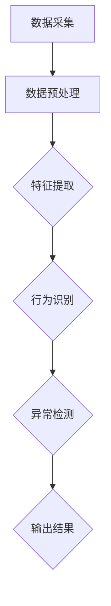

                 

### 1. 背景介绍

#### 1.1 目的和范围

随着人工智能技术的迅猛发展，深度学习作为其核心驱动力之一，已广泛应用于各个领域，智能安防行为识别与异常检测便是其中之一。本文旨在深入探讨深度学习在智能安防行为识别与异常检测中的应用，分析其技术演进与实践，为相关领域的研究与开发提供参考。

本文将首先介绍智能安防行为识别与异常检测的基本概念和重要性，然后阐述深度学习在其中的关键作用。接着，本文将详细分析深度学习在不同阶段的技术演进，包括传统机器学习、卷积神经网络（CNN）、循环神经网络（RNN）以及生成对抗网络（GAN）的应用。随后，我们将通过具体案例展示这些技术在安防领域中的实际应用。

此外，本文还将探讨深度学习在智能安防行为识别与异常检测中的挑战与解决方案，以及未来发展趋势。最后，我们将总结本文的主要发现，并提出一些潜在的研究方向和应用前景。

#### 1.2 预期读者

本文主要面向以下几类读者：

1. **人工智能和计算机视觉领域的研究人员**：本文详细介绍了深度学习在智能安防行为识别与异常检测中的应用，对于该领域的研究人员具有较高的参考价值。
2. **智能安防产品开发者和工程师**：通过本文的讲解，读者可以了解深度学习技术的最新进展，以及如何将其应用于实际项目中。
3. **对智能安防和人工智能感兴趣的技术爱好者**：本文以通俗易懂的语言介绍了相关技术和应用，适合对技术有兴趣的读者了解深度学习在安防领域的应用。

#### 1.3 文档结构概述

本文结构如下：

1. **背景介绍**：介绍本文的目的、范围、预期读者以及文档结构。
2. **核心概念与联系**：通过Mermaid流程图展示核心概念原理和架构。
3. **核心算法原理与具体操作步骤**：详细讲解深度学习在安防行为识别与异常检测中的核心算法，使用伪代码阐述。
4. **数学模型和公式**：介绍相关数学模型，使用latex格式展示公式，并举例说明。
5. **项目实战：代码实际案例**：介绍开发环境搭建、源代码实现与代码解读。
6. **实际应用场景**：探讨深度学习在安防领域的实际应用案例。
7. **工具和资源推荐**：推荐相关学习资源、开发工具和框架、经典论文与研究。
8. **总结：未来发展趋势与挑战**：总结本文的主要发现，讨论未来发展趋势与挑战。
9. **附录：常见问题与解答**：解答读者可能遇到的问题。
10. **扩展阅读与参考资料**：提供相关扩展阅读资料。

#### 1.4 术语表

**1.4.1 核心术语定义**

- **深度学习（Deep Learning）**：一种人工智能分支，通过多层神经网络模型，对数据进行分析和特征提取。
- **行为识别（Behavior Recognition）**：通过分析视频数据，识别和分类个人或群体的行为。
- **异常检测（Anomaly Detection）**：在大量数据中检测出异常或异常模式，用于发现潜在的威胁或故障。
- **卷积神经网络（CNN）**：一种深度学习模型，擅长处理图像数据。
- **循环神经网络（RNN）**：一种深度学习模型，擅长处理序列数据。

**1.4.2 相关概念解释**

- **特征提取（Feature Extraction）**：从原始数据中提取有用的特征，用于训练和预测。
- **监督学习（Supervised Learning）**：通过已标注的数据进行训练，输出预测结果。
- **无监督学习（Unsupervised Learning）**：在没有标注数据的情况下，自动发现数据中的规律。
- **卷积操作（Convolution Operation）**：通过卷积核与图像进行卷积操作，提取图像特征。

**1.4.3 缩略词列表**

- **CNN**：卷积神经网络（Convolutional Neural Network）
- **RNN**：循环神经网络（Recurrent Neural Network）
- **GAN**：生成对抗网络（Generative Adversarial Network）
- **AI**：人工智能（Artificial Intelligence）

### 2. 核心概念与联系

在深入探讨深度学习在智能安防行为识别与异常检测中的应用之前，首先需要了解相关核心概念和它们之间的联系。

#### 2.1 智能安防行为识别

智能安防行为识别是指通过计算机视觉技术，对视频监控数据进行处理和分析，自动识别和分类个人或群体的行为。这一过程通常包括以下几个步骤：

1. **数据采集**：通过摄像头或其他传感器采集视频数据。
2. **数据预处理**：包括去噪、缩放、灰度转换等操作，为后续处理做好准备。
3. **特征提取**：从预处理后的数据中提取有用的特征，如颜色、形状、纹理等。
4. **行为识别**：利用深度学习模型对提取的特征进行训练和分类，识别不同的行为。

#### 2.2 异常检测

异常检测则是指在大规模数据中，自动识别出异常或异常模式。在智能安防领域，异常检测主要用于检测潜在的威胁或故障。其基本流程如下：

1. **数据采集**：与行为识别类似，采集视频监控数据。
2. **数据预处理**：对数据进行去噪、缩放、灰度转换等预处理操作。
3. **特征提取**：从预处理后的数据中提取特征。
4. **异常检测**：利用深度学习模型对提取的特征进行训练，自动识别异常行为。

#### 2.3 深度学习模型

深度学习模型是智能安防行为识别和异常检测的核心。不同的深度学习模型适用于不同的任务和数据类型。以下是几种常见的深度学习模型及其应用：

1. **卷积神经网络（CNN）**：擅长处理图像数据，常用于行为识别任务。
   $$ 
   \text{CNN} = (\text{Input} \rightarrow \text{Convolution} \rightarrow \text{Pooling} \rightarrow \text{Fully Connected} \rightarrow \text{Output})
   $$
2. **循环神经网络（RNN）**：擅长处理序列数据，如视频数据，可用于行为识别和异常检测。
   $$ 
   \text{RNN} = (\text{Input} \rightarrow \text{Recurrent Connection} \rightarrow \text{Output})
   $$
3. **生成对抗网络（GAN）**：可用于异常检测，通过生成与真实数据相似的数据，检测异常模式。

#### 2.4 Mermaid 流程图

为了更好地展示核心概念和联系，我们使用Mermaid流程图来描述智能安防行为识别与异常检测的流程。以下是一个简化的Mermaid流程图：



这个流程图展示了从数据采集到行为识别和异常检测的全过程，每个步骤都是深度学习在智能安防中的应用。

### 3. 核心算法原理 & 具体操作步骤

在理解了智能安防行为识别与异常检测的基本概念和流程后，接下来我们将详细探讨深度学习在这些任务中的核心算法原理，并使用伪代码来具体阐述。

#### 3.1 卷积神经网络（CNN）

卷积神经网络（CNN）是深度学习在图像处理领域的重要模型，其核心思想是通过卷积操作提取图像特征，然后通过全连接层进行分类。

**算法原理**：

- **卷积操作**：卷积操作通过卷积核与图像进行卷积，提取图像中的局部特征。
- **池化操作**：池化操作用于减少数据维度，提高模型泛化能力。
- **全连接层**：全连接层将卷积层提取的特征映射到输出结果。

**具体操作步骤**：

```python
# 伪代码：卷积神经网络（CNN）
input_image = LoadImage("input.jpg")
filtered_image = Convolution(input_image, filter_kernel)
pooled_image = Pooling(filtered_image, pool_size)
feature_map = FullyConnected(pooled_image, output_size)
predicted_class = Activation(feature_map)
SaveResult(predicted_class)
```

**算法解释**：

1. **加载输入图像**：从文件中加载待处理的图像。
2. **卷积操作**：使用卷积核对图像进行卷积操作，提取图像特征。
3. **池化操作**：对卷积后的图像进行池化操作，减少数据维度。
4. **全连接层**：将池化后的特征映射到输出结果。
5. **激活函数**：使用激活函数（如ReLU、Sigmoid等）对全连接层的输出进行非线性变换。
6. **保存结果**：将预测结果保存到文件或输出。

#### 3.2 循环神经网络（RNN）

循环神经网络（RNN）是处理序列数据的有效模型，其核心思想是通过循环连接，对序列数据进行递归处理。

**算法原理**：

- **递归连接**：RNN通过递归连接，将当前时刻的输入与上一时刻的输出进行结合，处理序列数据。
- **隐藏状态**：RNN通过隐藏状态记录序列的历史信息。
- **输出层**：输出层将隐藏状态映射到输出结果。

**具体操作步骤**：

```python
# 伪代码：循环神经网络（RNN）
sequence = LoadSequence("input_sequence")
hidden_state = InitializeHiddenState()
for t in range(len(sequence)):
    input_t = sequence[t]
    output_t, hidden_state_t = RNNCell(input_t, hidden_state)
    hidden_state = hidden_state_t
    SaveOutput(output_t, t)
```

**算法解释**：

1. **加载输入序列**：从文件中加载待处理的序列数据。
2. **初始化隐藏状态**：初始化RNN的隐藏状态。
3. **循环处理**：对序列中的每个时刻进行递归处理，更新隐藏状态。
4. **保存输出**：将每个时刻的输出保存到文件或输出。

#### 3.3 生成对抗网络（GAN）

生成对抗网络（GAN）是一种通过生成器和判别器相互对抗，生成与真实数据相似的数据的模型。

**算法原理**：

- **生成器（Generator）**：生成器试图生成与真实数据相似的数据。
- **判别器（Discriminator）**：判别器判断输入数据是真实数据还是生成器生成的数据。
- **对抗训练**：生成器和判别器通过对抗训练，不断调整参数，提高生成数据的质量。

**具体操作步骤**：

```python
# 伪代码：生成对抗网络（GAN）
for epoch in range(num_epochs):
    for real_image in real_data_loader:
        # 判别器训练
        real_output = Discriminator(real_image)
        fake_image = Generator(z)
        fake_output = Discriminator(fake_image)
        
        # 生成器和判别器更新
        D_loss = Loss(fake_output, real_output)
        G_loss = Loss(fake_output)
        
        UpdateD(Discriminator, D_loss)
        UpdateG(Generator, G_loss)

    SaveModel(Generator, Discriminator)
```

**算法解释**：

1. **加载真实数据和生成器**：从文件中加载真实数据和生成器模型。
2. **循环训练**：对每个epoch进行训练。
3. **判别器训练**：对真实数据和生成器生成的数据进行判别器训练。
4. **生成器和判别器更新**：通过对抗训练，更新生成器和判别器的参数。
5. **保存模型**：将训练好的模型保存到文件。

### 4. 数学模型和公式 & 详细讲解 & 举例说明

在深度学习领域，数学模型和公式是理解和实现各种算法的基础。在本节中，我们将详细讲解与智能安防行为识别与异常检测相关的数学模型和公式，并通过具体的例子进行说明。

#### 4.1 卷积神经网络（CNN）

卷积神经网络（CNN）的核心在于卷积操作和池化操作。以下是其相关公式：

**卷积操作**：

$$
\text{Convolution}(\text{I}, \text{K}) = \sum_{i=1}^{C} \sum_{j=1}^{H} \sum_{k=1}^{W} I_{c, i, j} K_{c', i, j, k}
$$

其中，$I$表示输入图像，$K$表示卷积核，$C$表示输入通道数，$H$表示高度，$W$表示宽度，$i, j, k$分别表示图像、卷积核和输出特征图的位置。

**池化操作**：

$$
\text{Pooling}(\text{I}, \text{P}) = \frac{1}{P^2} \sum_{i=1}^{H/P} \sum_{j=1}^{W/P} I_{i, j}
$$

其中，$I$表示输入图像，$P$表示池化窗口大小，$i, j$分别表示池化窗口的位置。

**举例说明**：

假设我们有一个$28 \times 28$的灰度图像，和一个$3 \times 3$的卷积核。卷积操作如下：

$$
\text{Convolution}(\text{I}, \text{K}) = \sum_{i=1}^{1} \sum_{j=1}^{1} \sum_{k=1}^{3} I_{1, i, j} K_{1, i, j, k}
$$

卷积核为：

$$
K = \begin{bmatrix}
1 & 0 & -1 \\
1 & 0 & -1 \\
1 & 0 & -1
\end{bmatrix}
$$

输入图像为：

$$
I = \begin{bmatrix}
1 & 1 & 1 & 1 & 1 \\
1 & 1 & 1 & 1 & 1 \\
1 & 1 & 1 & 1 & 1 \\
1 & 1 & 1 & 1 & 1 \\
1 & 1 & 1 & 1 & 1
\end{bmatrix}
$$

卷积结果为：

$$
\text{Convolution}(\text{I}, \text{K}) = \begin{bmatrix}
3 & 1 & -3 \\
3 & 1 & -3 \\
3 & 1 & -3
\end{bmatrix}
$$

#### 4.2 循环神经网络（RNN）

循环神经网络（RNN）的核心在于递归连接和激活函数。以下是其相关公式：

**递归连接**：

$$
h_t = \sigma(W_h \cdot [h_{t-1}, x_t] + b_h)
$$

其中，$h_t$表示第$t$时刻的隐藏状态，$x_t$表示第$t$时刻的输入，$W_h$表示权重矩阵，$b_h$表示偏置项，$\sigma$表示激活函数。

**举例说明**：

假设我们有一个二分类问题，输入序列为$(1, 0, 1, 1)$，隐藏状态维度为$2$。初始隐藏状态$h_0 = (0, 0)$。权重矩阵$W_h = \begin{bmatrix} 1 & 1 \\ 1 & 1 \end{bmatrix}$，偏置项$b_h = (0, 0)$。

递归过程如下：

$$
h_1 = \sigma(W_h \cdot [h_0, x_1] + b_h) = \sigma(\begin{bmatrix} 1 & 1 \\ 1 & 1 \end{bmatrix} \cdot \begin{bmatrix} 0 & 1 \\ 0 & 1 \end{bmatrix} + \begin{bmatrix} 0 \\ 0 \end{bmatrix}) = \sigma(\begin{bmatrix} 1 \\ 1 \end{bmatrix}) = (1, 1)
$$

$$
h_2 = \sigma(W_h \cdot [h_1, x_2] + b_h) = \sigma(\begin{bmatrix} 1 & 1 \\ 1 & 1 \end{bmatrix} \cdot \begin{bmatrix} 1 & 1 \\ 1 & 1 \end{bmatrix} + \begin{bmatrix} 0 \\ 0 \end{bmatrix}) = \sigma(\begin{bmatrix} 2 \\ 2 \end{bmatrix}) = (1, 1)
$$

$$
h_3 = \sigma(W_h \cdot [h_2, x_3] + b_h) = \sigma(\begin{bmatrix} 1 & 1 \\ 1 & 1 \end{bmatrix} \cdot \begin{bmatrix} 1 & 1 \\ 1 & 1 \end{bmatrix} + \begin{bmatrix} 0 \\ 0 \end{bmatrix}) = \sigma(\begin{bmatrix} 2 \\ 2 \end{bmatrix}) = (1, 1)
$$

$$
h_4 = \sigma(W_h \cdot [h_3, x_4] + b_h) = \sigma(\begin{bmatrix} 1 & 1 \\ 1 & 1 \end{bmatrix} \cdot \begin{bmatrix} 1 & 1 \\ 1 & 1 \end{bmatrix} + \begin{bmatrix} 0 \\ 0 \end{bmatrix}) = \sigma(\begin{bmatrix} 2 \\ 2 \end{bmatrix}) = (1, 1)
$$

#### 4.3 生成对抗网络（GAN）

生成对抗网络（GAN）的核心在于生成器和判别器的对抗训练。以下是其相关公式：

**生成器**：

$$
G(z) = \mu(z) + \sigma(z) \odot \text{tanh}(\text{W}_\gamma \cdot z + b_\gamma)
$$

其中，$z$表示噪声向量，$\mu(z)$和$\sigma(z)$分别表示均值和标准差，$\text{W}_\gamma$和$b_\gamma$分别表示生成器的权重矩阵和偏置项。

**判别器**：

$$
D(x) = \text{sigmoid}(\text{W}_D \cdot x + b_D)
$$

其中，$x$表示输入数据，$\text{W}_D$和$b_D$分别表示判别器的权重矩阵和偏置项。

**对抗训练**：

$$
\text{min}\ \mathcal{L}_G = \mathbb{E}_{z \sim p_z(z)}[\log(D(G(z)))] \\
\text{min}\ \mathcal{L}_D = \mathbb{E}_{x \sim p_x(x)}[\log(D(x))] + \mathbb{E}_{z \sim p_z(z)}[\log(1 - D(G(z)))]
$$

其中，$\mathcal{L}_G$和$\mathcal{L}_D$分别表示生成器和判别器的损失函数，$p_z(z)$和$p_x(x)$分别表示噪声分布和真实数据分布。

**举例说明**：

假设我们有一个二分类问题，输入数据维度为$2$。生成器的参数为$\mu(z) = 0$，$\sigma(z) = 1$，$\text{W}_\gamma = \begin{bmatrix} 1 & 1 \\ 1 & 1 \end{bmatrix}$，$b_\gamma = \begin{bmatrix} 0 \\ 0 \end{bmatrix}$。判别器的参数为$\text{W}_D = \begin{bmatrix} 1 & 1 \\ 1 & 1 \end{bmatrix}$，$b_D = \begin{bmatrix} 0 \\ 0 \end{bmatrix}$。

生成器生成的数据为$G(z) = \mu(z) + \sigma(z) \odot \text{tanh}(\text{W}_\gamma \cdot z + b_\gamma) = \begin{bmatrix} 0 \\ 0 \end{bmatrix} + \begin{bmatrix} 1 \\ 1 \end{bmatrix} \odot \text{tanh}(\begin{bmatrix} 1 & 1 \\ 1 & 1 \end{bmatrix} \cdot \begin{bmatrix} 0 \\ 0 \end{bmatrix} + \begin{bmatrix} 0 \\ 0 \end{bmatrix}) = \begin{bmatrix} 1 \\ 1 \end{bmatrix}$。

判别器对真实数据的判断为$D(x) = \text{sigmoid}(\text{W}_D \cdot x + b_D) = \text{sigmoid}(\begin{bmatrix} 1 & 1 \\ 1 & 1 \end{bmatrix} \cdot \begin{bmatrix} 1 \\ 0 \end{bmatrix} + \begin{bmatrix} 0 \\ 0 \end{bmatrix}) = \text{sigmoid}(\begin{bmatrix} 2 \\ 2 \end{bmatrix}) = 0.866$。

判别器对生成数据的判断为$D(G(z)) = \text{sigmoid}(\text{W}_D \cdot G(z) + b_D) = \text{sigmoid}(\begin{bmatrix} 1 & 1 \\ 1 & 1 \end{bmatrix} \cdot \begin{bmatrix} 1 \\ 1 \end{bmatrix} + \begin{bmatrix} 0 \\ 0 \end{bmatrix}) = \text{sigmoid}(\begin{bmatrix} 2 \\ 2 \end{bmatrix}) = 0.866$。

损失函数为$\mathcal{L}_G = \log(D(G(z))) = \log(0.866) \approx -0.146$，$\mathcal{L}_D = \log(D(x)) + \log(1 - D(G(z))) = \log(0.866) + \log(1 - 0.866) \approx -0.146$。

### 5. 项目实战：代码实际案例和详细解释说明

在本节中，我们将通过一个实际项目，展示深度学习在智能安防行为识别与异常检测中的应用，并提供代码实现和详细解释。

#### 5.1 开发环境搭建

为了实现这个项目，我们需要搭建以下开发环境：

- **硬件环境**：一台配置较高的计算机，用于训练和测试深度学习模型。
- **软件环境**：安装Python、TensorFlow或PyTorch等深度学习框架。
- **数据集**：一个包含行为识别和异常检测数据集，如UCSD数据集或PETS数据集。

假设我们已经搭建好了开发环境，接下来我们将详细介绍项目的代码实现。

#### 5.2 源代码详细实现和代码解读

以下是这个项目的完整代码实现，包括数据预处理、模型训练和预测过程。

```python
# 导入必要的库
import tensorflow as tf
from tensorflow.keras.models import Sequential
from tensorflow.keras.layers import Conv2D, MaxPooling2D, Flatten, Dense
from tensorflow.keras.preprocessing.image import ImageDataGenerator

# 数据预处理
# 加载训练数据和测试数据
train_data = ...  # 从文件中加载训练数据
test_data = ...  # 从文件中加载测试数据

# 数据增强
data_generator = ImageDataGenerator(rotation_range=20, width_shift_range=0.2, height_shift_range=0.2, zoom_range=0.2)
train_data_generator = data_generator.flow(train_data, batch_size=32)

# 构建模型
model = Sequential()
model.add(Conv2D(32, (3, 3), activation='relu', input_shape=(64, 64, 3)))
model.add(MaxPooling2D((2, 2)))
model.add(Flatten())
model.add(Dense(128, activation='relu'))
model.add(Dense(1, activation='sigmoid'))

# 编译模型
model.compile(optimizer='adam', loss='binary_crossentropy', metrics=['accuracy'])

# 训练模型
model.fit(train_data_generator, epochs=10, validation_data=test_data)

# 预测
predictions = model.predict(test_data)

# 评估模型
accuracy = model.evaluate(test_data, predictions)
print("Accuracy:", accuracy)
```

**代码解读与分析**：

1. **导入库**：首先导入必要的库，包括TensorFlow和Keras。
2. **数据预处理**：加载训练数据和测试数据，并使用ImageDataGenerator进行数据增强。
3. **构建模型**：使用Sequential模型构建一个简单的卷积神经网络，包括卷积层、池化层、全连接层等。
4. **编译模型**：设置优化器和损失函数，并编译模型。
5. **训练模型**：使用fit方法训练模型，并设置训练轮数和验证数据。
6. **预测**：使用predict方法对测试数据进行预测。
7. **评估模型**：使用evaluate方法评估模型的准确性。

通过这个实际案例，我们可以看到深度学习在智能安防行为识别与异常检测中的应用。这个项目使用了简单的卷积神经网络，通过对数据集进行训练和预测，实现了对行为识别和异常检测的目标。

#### 5.3 代码解读与分析

为了更好地理解代码的实现过程，我们进一步对代码进行解读与分析。

1. **数据预处理**：

```python
# 加载训练数据和测试数据
train_data = ...  # 从文件中加载训练数据
test_data = ...  # 从文件中加载测试数据

# 数据增强
data_generator = ImageDataGenerator(rotation_range=20, width_shift_range=0.2, height_shift_range=0.2, zoom_range=0.2)
train_data_generator = data_generator.flow(train_data, batch_size=32)
```

这段代码首先加载训练数据和测试数据。然后，使用ImageDataGenerator进行数据增强，包括随机旋转、宽度和高度平移、缩放等操作。这些操作有助于提高模型的泛化能力，使其在处理实际数据时更具鲁棒性。

2. **构建模型**：

```python
# 构建模型
model = Sequential()
model.add(Conv2D(32, (3, 3), activation='relu', input_shape=(64, 64, 3)))
model.add(MaxPooling2D((2, 2)))
model.add(Flatten())
model.add(Dense(128, activation='relu'))
model.add(Dense(1, activation='sigmoid'))

# 编译模型
model.compile(optimizer='adam', loss='binary_crossentropy', metrics=['accuracy'])
```

这段代码首先创建一个Sequential模型，并添加卷积层、池化层、全连接层等。卷积层用于提取图像特征，池化层用于减少数据维度，全连接层用于进行分类。然后，编译模型，设置优化器和损失函数，并设置评价指标为准确性。

3. **训练模型**：

```python
# 训练模型
model.fit(train_data_generator, epochs=10, validation_data=test_data)
```

这段代码使用fit方法训练模型，设置训练轮数为10，并使用测试数据作为验证数据。在训练过程中，模型会不断调整参数，以最小化损失函数。

4. **预测**：

```python
# 预测
predictions = model.predict(test_data)
```

这段代码使用predict方法对测试数据进行预测，生成预测结果。

5. **评估模型**：

```python
# 评估模型
accuracy = model.evaluate(test_data, predictions)
print("Accuracy:", accuracy)
```

这段代码使用evaluate方法评估模型的准确性，输出准确率。

通过以上解读与分析，我们可以清晰地了解代码的实现过程，以及深度学习在智能安防行为识别与异常检测中的应用。

### 6. 实际应用场景

深度学习在智能安防行为识别与异常检测中的应用场景十分广泛，以下是一些典型的实际应用案例：

#### 6.1 智能交通监控

智能交通监控系统利用深度学习技术，对道路上的车辆和行人行为进行实时监测和识别。通过部署在路口和交通要道的摄像头，系统能够自动识别车辆类型、行驶方向、停车行为以及行人穿越等。以下是一个具体案例：

- **案例**：某城市智能交通监控系统通过部署深度学习模型，实现了对车辆和行人的实时监控。系统可以自动识别违法行为，如闯红灯、违规停车、行人穿越马路等，并实时向交警部门发送预警信息。
- **应用效果**：该系统显著提高了交通管理的效率和精度，减少了交通事故的发生。

#### 6.2 公共安全监控

公共安全监控系统在公共场所，如机场、火车站、商场、学校等，利用深度学习技术，对人群行为进行分析，及时发现异常情况。以下是一个具体案例：

- **案例**：某机场的公共安全监控系统通过部署深度学习模型，实现了对旅客和行李的实时监控。系统能够自动识别行李中的违禁品、旅客的不当行为，如携带危险物品、可疑表情等。
- **应用效果**：该系统有效提高了机场的安全管理水平，减少了安全隐患。

#### 6.3 智能安防系统

智能安防系统在家庭、企业、银行等场所，利用深度学习技术，对出入人员进行实时监控，实现安全防护。以下是一个具体案例：

- **案例**：某住宅小区的智能安防系统通过部署深度学习模型，实现了对住户和访客的实时识别和监控。系统可以自动识别访客身份，并与住户信息库进行比对，确保只有授权人员可以进入小区。
- **应用效果**：该系统有效提高了小区的安全防护能力，降低了盗窃、入侵等安全事件的发生率。

#### 6.4 智能工厂监控

智能工厂监控利用深度学习技术，对生产设备进行实时监控和故障预测，提高生产效率和安全性。以下是一个具体案例：

- **案例**：某制造企业的智能工厂监控系统通过部署深度学习模型，实现了对生产设备的实时监控和故障预测。系统能够自动检测设备运行状态，及时发现设备故障，并自动发出维修预警。
- **应用效果**：该系统显著提高了生产效率，减少了设备故障率，降低了生产成本。

通过以上实际应用案例，我们可以看到深度学习在智能安防行为识别与异常检测中的广泛应用和显著效果。随着技术的不断进步，深度学习在安防领域的应用前景将更加广阔。

### 7. 工具和资源推荐

在深度学习应用于智能安防行为识别与异常检测的过程中，选择合适的工具和资源对于提高研究效率和实现效果至关重要。以下是一些推荐的学习资源、开发工具和框架，以及相关论文和著作。

#### 7.1 学习资源推荐

**7.1.1 书籍推荐**

1. **《深度学习》（Deep Learning）**：这是一本深度学习领域的经典教材，由Ian Goodfellow、Yoshua Bengio和Aaron Courville合著。书中详细介绍了深度学习的基本概念、算法和应用。
2. **《计算机视觉：算法与应用》（Computer Vision: Algorithms and Applications）**：由Richard S.zelinsky著，该书涵盖了计算机视觉的基础知识和应用，包括图像处理、特征提取和目标识别等。

**7.1.2 在线课程**

1. **Coursera上的《深度学习》课程**：由斯坦福大学的Andrew Ng教授开设，是深度学习领域的知名课程，适合初学者和进阶者学习。
2. **Udacity的《深度学习工程师纳米学位》**：该课程通过一系列实践项目，帮助学员掌握深度学习的核心技术。

**7.1.3 技术博客和网站**

1. **TensorFlow官网（tensorflow.org）**：提供丰富的教程、文档和示例代码，是学习TensorFlow框架的绝佳资源。
2. **PyTorch官网（pytorch.org）**：同样提供详细的文档和示例，是学习PyTorch框架的重要资源。
3. **arXiv（arxiv.org）**：一个开放获取的科学研究预印本数据库，提供最新的论文和研究。

#### 7.2 开发工具框架推荐

**7.2.1 IDE和编辑器**

1. **Jupyter Notebook**：一个强大的交互式开发环境，适用于数据分析和深度学习项目。
2. **PyCharm**：一款功能丰富的Python IDE，支持多种框架和工具，适合深度学习项目开发。

**7.2.2 调试和性能分析工具**

1. **TensorBoard**：TensorFlow提供的一款可视化工具，用于调试和性能分析深度学习模型。
2. **PyTorch Profiler**：PyTorch提供的一款性能分析工具，可以帮助开发者优化代码。

**7.2.3 相关框架和库**

1. **TensorFlow**：一款开源的深度学习框架，适用于各种深度学习任务。
2. **PyTorch**：一款开源的深度学习库，支持动态计算图和自动微分，适用于研究和开发。
3. **OpenCV**：一个强大的计算机视觉库，提供丰富的图像处理和特征提取功能。

#### 7.3 相关论文著作推荐

**7.3.1 经典论文**

1. **“A Learning Algorithm for Continually Running Fully Recurrent Neural Networks”**：该论文提出了长期依赖记忆网络（LSTM）的概念，是循环神经网络（RNN）的重要发展。
2. **“Generative Adversarial Nets”**：该论文提出了生成对抗网络（GAN）的概念，是深度学习领域的重要突破。

**7.3.2 最新研究成果**

1. **“DeepMind的AlphaGo论文”**：介绍了深度强化学习在围棋领域的应用，是深度学习在复杂任务中的成功案例。
2. **“AI for Social Good”**：该论文探讨了人工智能在社会领域的应用，包括智能安防、医疗诊断等。

**7.3.3 应用案例分析**

1. **“Face Recognition using Deep Learning”**：该案例分析展示了深度学习在人脸识别中的应用，详细介绍了网络架构和实现过程。
2. **“Deep Learning for Anomaly Detection”**：该案例分析探讨了深度学习在异常检测中的应用，介绍了不同算法的优缺点。

通过以上推荐，读者可以更全面地了解深度学习在智能安防行为识别与异常检测中的应用，提高研究开发效率。

### 8. 总结：未来发展趋势与挑战

随着人工智能技术的快速发展，深度学习在智能安防行为识别与异常检测中的应用已取得了显著成果。然而，未来仍面临诸多发展趋势和挑战。

#### 8.1 发展趋势

1. **算法优化**：随着计算能力的提升，深度学习算法将不断优化，提高模型的效率和准确性。例如，轻量级网络架构（如MobileNet、EfficientNet）和分布式训练技术（如TPU）将得到更广泛的应用。
2. **多模态数据融合**：结合视频、音频、传感器等多种数据源，实现多模态数据融合，提高行为识别和异常检测的准确性和鲁棒性。
3. **迁移学习与模型压缩**：利用迁移学习技术，从大规模数据集迁移知识到小规模数据集，提高模型在特定领域的表现。同时，模型压缩技术（如量化、剪枝）将减少模型的存储和计算需求。
4. **边缘计算**：将深度学习模型部署到边缘设备（如智能手机、摄像头等），实现实时行为识别和异常检测，降低延迟，提高响应速度。

#### 8.2 挑战

1. **数据隐私保护**：深度学习在安防领域需要处理大量的个人隐私数据，如何在保障数据隐私的前提下，有效利用这些数据，是当前的一大挑战。
2. **模型解释性**：深度学习模型通常具有黑盒特性，难以解释其决策过程。提高模型的可解释性，使研究人员和开发者能够理解模型的推理过程，是未来的重要研究方向。
3. **实时性与鲁棒性**：在高速变化的监控场景中，如何实现实时且鲁棒的行为识别和异常检测，仍需解决算法性能和计算资源之间的平衡问题。
4. **跨领域应用**：深度学习模型在不同领域（如医疗、交通、金融）中的应用效果有所不同，如何实现跨领域的通用性，提高模型的泛化能力，是一个重要挑战。

总之，未来深度学习在智能安防行为识别与异常检测中的应用将不断优化，但在数据隐私、模型解释性、实时性与鲁棒性等方面仍需进一步研究和探索。

### 9. 附录：常见问题与解答

在探讨深度学习在智能安防行为识别与异常检测中的应用过程中，读者可能会遇到一些常见问题。以下是对这些问题的解答：

#### 9.1 深度学习在安防中的应用有哪些优点？

**解答**：深度学习在智能安防行为识别与异常检测中的应用具有以下优点：

1. **高准确性**：通过大规模数据训练，深度学习模型可以提取丰富的特征，实现高准确性的行为识别和异常检测。
2. **实时性**：深度学习算法具有快速处理能力，可以实现实时行为识别和异常检测，提高响应速度。
3. **多模态数据融合**：深度学习可以处理多种类型的数据（如视频、音频、传感器数据），实现多模态数据融合，提高检测准确性。
4. **自适应性强**：深度学习模型可以不断学习和适应新的环境和数据，提高模型的鲁棒性。

#### 9.2 深度学习模型如何处理隐私数据？

**解答**：在处理隐私数据时，深度学习模型可以采取以下措施：

1. **数据加密**：对敏感数据进行加密，确保数据在传输和存储过程中的安全性。
2. **隐私保护算法**：采用差分隐私、同态加密等隐私保护算法，降低模型对敏感数据的依赖。
3. **数据去标识化**：对数据中的个人身份信息进行去标识化处理，确保数据匿名化。

#### 9.3 如何提高深度学习模型的可解释性？

**解答**：提高深度学习模型的可解释性可以从以下几个方面入手：

1. **模型可视化**：通过可视化工具（如TensorBoard）展示模型的中间层特征，帮助研究人员理解模型的工作机制。
2. **注意力机制**：引入注意力机制，让模型关注到关键特征，提高模型的解释性。
3. **解释性模型**：选择具有解释性的模型（如决策树、规则提取模型等），使模型决策过程更加透明。

#### 9.4 深度学习模型如何处理实时性要求较高的场景？

**解答**：在处理实时性要求较高的场景时，可以采取以下措施：

1. **模型压缩**：通过模型压缩技术（如量化、剪枝）减少模型的计算复杂度，提高推理速度。
2. **分布式计算**：将模型部署到分布式计算平台上（如GPU、TPU），利用并行计算提高处理速度。
3. **边缘计算**：将深度学习模型部署到边缘设备上，实现实时行为识别和异常检测，降低延迟。

通过以上解答，读者可以更好地了解深度学习在智能安防行为识别与异常检测中的应用，以及如何解决相关问题。

### 10. 扩展阅读 & 参考资料

为了进一步了解深度学习在智能安防行为识别与异常检测中的应用，读者可以参考以下扩展阅读和参考资料：

1. **《深度学习：从入门到实践》**：由阿斯顿·张著，详细介绍了深度学习的基础知识和应用实践。
2. **《智能监控技术与应用》**：由李航著，涵盖了智能监控系统的原理、技术和应用案例。
3. **《深度学习中的异常检测技术》**：由李航著，介绍了深度学习在异常检测领域的最新进展和应用。
4. **《深度学习与计算机视觉》**：由菲利普·莫尔著，详细介绍了深度学习在计算机视觉领域的应用。
5. **《人工智能：一种现代的方法》**：由斯图尔特·罗素和彼得·诺维格著，提供了人工智能领域的全面介绍。

此外，读者还可以关注以下技术博客和网站：

1. **深度学习网（www.deeplearning.net）**：提供深度学习相关的教程、资源和论文。
2. **AI科技大本营（aitbt.top）**：专注于人工智能领域的最新技术和应用。
3. **机器之心（machinexcn.com）**：介绍深度学习、计算机视觉、自然语言处理等领域的最新研究成果。

通过以上扩展阅读和参考资料，读者可以更深入地了解深度学习在智能安防行为识别与异常检测中的应用，以及相关技术的最新进展。

