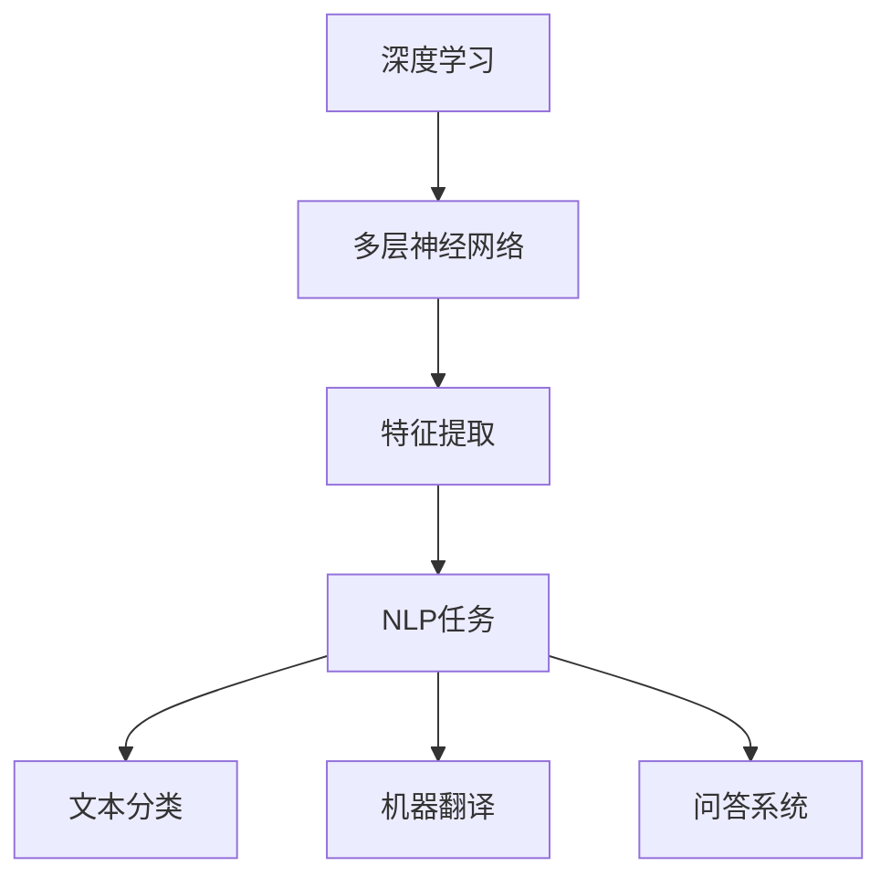
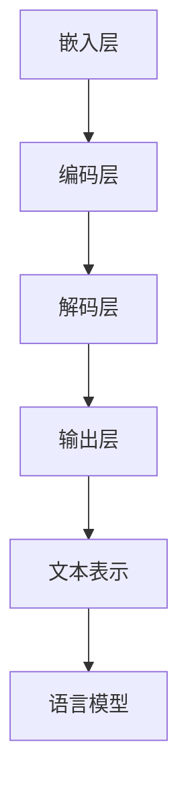

                 

# 深度学习在自然语言处理中的前沿进展与挑战

> **关键词**：深度学习、自然语言处理、神经网络、语言模型、预训练、BERT、GPT、推理能力、优化算法
> 
> **摘要**：本文将深入探讨深度学习在自然语言处理（NLP）领域的最新进展和面临的主要挑战。我们将从背景介绍开始，逐步分析核心概念、算法原理、数学模型，并给出项目实战案例。此外，还将探讨实际应用场景，推荐学习资源和开发工具，并总结未来发展趋势与挑战。

## 1. 背景介绍

### 1.1 目的和范围

本文旨在介绍深度学习在自然语言处理领域的最新进展和面临的挑战。我们将重点关注以下几个主要方面：

- 深度学习在NLP中的应用场景和效果
- 预训练模型的发展及其对NLP的贡献
- 常见的深度学习算法和优化技术
- 当前深度学习模型在NLP中的局限性
- 未来可能的研究方向和挑战

### 1.2 预期读者

本文适用于对深度学习和自然语言处理有一定了解的读者，包括但不限于：

- NLP领域的科研人员和学生
- 深度学习工程师和开发者
- 对NLP和深度学习感兴趣的从业者

### 1.3 文档结构概述

本文的结构如下：

1. 背景介绍：介绍文章的目的、范围、预期读者以及文档结构。
2. 核心概念与联系：介绍深度学习和自然语言处理中的核心概念，并提供相关的Mermaid流程图。
3. 核心算法原理与具体操作步骤：详细解释深度学习在NLP中的核心算法原理和具体操作步骤，包括伪代码。
4. 数学模型和公式：介绍深度学习在NLP中的数学模型和公式，并给出详细的讲解和举例说明。
5. 项目实战：提供实际的代码案例和详细解释说明，展示如何在实际项目中应用深度学习技术。
6. 实际应用场景：讨论深度学习在NLP中的实际应用场景。
7. 工具和资源推荐：推荐学习资源、开发工具和相关论文著作。
8. 总结：总结未来发展趋势与挑战。

### 1.4 术语表

在本文中，我们将使用以下术语：

- **深度学习**：一种人工智能方法，通过多层神经网络模型进行学习和预测。
- **自然语言处理**：计算机对人类语言进行处理和分析的技术。
- **神经网络**：一种由多个神经元组成的计算模型，用于模拟人脑处理信息的方式。
- **语言模型**：用于预测下一个单词或词组的模型。
- **预训练**：在特定任务之前对模型进行大规模数据预训练，以提高其在目标任务上的性能。
- **BERT**：一种双向编码表示器（Bidirectional Encoder Representations from Transformers），用于对文本进行建模。
- **GPT**：一种生成预训练变换器（Generative Pretrained Transformer），用于生成文本。

## 2. 核心概念与联系

在深度学习应用于自然语言处理之前，我们需要了解一些核心概念和它们之间的关系。

### 2.1 深度学习与自然语言处理

深度学习是一种机器学习技术，通过多层神经网络模型进行学习和预测。自然语言处理（NLP）是计算机科学领域中的一个分支，旨在使计算机能够理解、解释和生成人类语言。

深度学习和自然语言处理之间的关系如图2.1所示。



图2.1 深度学习与自然语言处理的关系

### 2.2 语言模型

语言模型是一种预测下一个单词或词组的模型，是NLP中的基础。在深度学习出现之前，语言模型主要使用统计方法和规则方法进行构建。随着深度学习的发展，神经网络语言模型逐渐成为主流。

### 2.3 预训练模型

预训练模型是一种在特定任务之前对模型进行大规模数据预训练的方法，以提高其在目标任务上的性能。预训练模型通常包括两个阶段：

1. **预训练阶段**：在大量未标注数据上进行预训练，例如使用大规模文本语料库。
2. **微调阶段**：在特定任务上对预训练模型进行微调，以适应具体的应用场景。

BERT（双向编码表示器）和GPT（生成预训练变换器）是目前最流行的预训练模型。

### 2.4 神经网络语言模型

神经网络语言模型是一种基于深度学习的方法，用于对文本进行建模。它通过多层神经网络结构对输入文本进行编码，从而生成文本的表示。

神经网络语言模型主要包括以下几部分：

1. **嵌入层**：将单词转换为向量表示。
2. **编码层**：使用多层神经网络对输入文本进行编码。
3. **解码层**：使用多层神经网络对编码结果进行解码，生成输出。

### 2.5 Mermaid流程图

为了更好地理解深度学习在NLP中的核心概念，我们使用Mermaid流程图（如图2.2所示）来展示神经网络语言模型的基本架构。



图2.2 神经网络语言模型的基本架构

## 3. 核心算法原理与具体操作步骤

在本节中，我们将详细解释深度学习在自然语言处理中的核心算法原理和具体操作步骤，包括伪代码。

### 3.1 语言模型

语言模型是一种预测下一个单词或词组的模型。我们可以使用基于神经网络的深度学习方法来构建语言模型。

以下是语言模型的基本算法原理：

1. **输入表示**：将输入文本序列转换为向量表示。
2. **嵌入层**：将单词转换为固定大小的向量表示。
3. **编码层**：使用多层神经网络对输入文本进行编码。
4. **解码层**：使用多层神经网络对编码结果进行解码，生成输出。
5. **损失函数**：计算预测结果与真实结果之间的损失，并优化模型参数。

以下是语言模型的伪代码：

```python
# 语言模型伪代码

# 输入：文本序列
# 输出：语言模型参数

# 步骤1：输入表示
text_sequence = preprocess(text)

# 步骤2：嵌入层
embeddings = EmbeddingLayer(vocab_size, embedding_size)

# 步骤3：编码层
encoder = EncoderLayer(embedding_size, hidden_size)

# 步骤4：解码层
decoder = DecoderLayer(embedding_size, hidden_size)

# 步骤5：损失函数
loss_function = CrossEntropyLoss()

# 步骤6：训练模型
model = LanguageModel(embeddings, encoder, decoder, loss_function)
model.train(text_sequence)
```

### 3.2 预训练模型

预训练模型是一种在特定任务之前对模型进行大规模数据预训练的方法，以提高其在目标任务上的性能。预训练模型通常包括以下步骤：

1. **预训练阶段**：在大量未标注数据上进行预训练。
2. **微调阶段**：在特定任务上对预训练模型进行微调。

以下是预训练模型的基本算法原理：

1. **预训练任务**：通常包括语言建模、填空任务、句子排序等。
2. **预训练数据**：使用大规模文本语料库进行预训练。
3. **微调任务**：在特定任务上对预训练模型进行微调。

以下是预训练模型的伪代码：

```python
# 预训练模型伪代码

# 输入：预训练数据
# 输出：预训练模型

# 步骤1：预训练任务
pretrain_tasks = [LanguageModelingTask, FillMaskTask, SentencePairTask]

# 步骤2：预训练数据
pretrain_data = load_pretrain_data()

# 步骤3：预训练模型
model = PretrainModel(pretrain_tasks, model_config)

# 步骤4：预训练
model.pretrain(pretrain_data)

# 步骤5：微调
fine_tune_data = load_fine_tune_data()
model.fine_tune(fine_tune_data)
```

### 3.3 BERT模型

BERT（双向编码表示器）是一种双向编码的预训练语言表示模型。BERT模型通过在大量文本语料库上进行预训练，学习文本的深度表示，从而在NLP任务中取得优异的性能。

BERT模型的基本算法原理如下：

1. **输入表示**：将输入文本序列转换为向量表示。
2. **编码器**：使用多层Transformer编码器对输入文本进行编码。
3. **输出表示**：从编码器的输出中提取文本表示。

以下是BERT模型的伪代码：

```python
# BERT模型伪代码

# 输入：文本序列
# 输出：文本表示

# 步骤1：输入表示
input_sequence = preprocess(text)

# 步骤2：编码器
encoder = TransformerEncoder(num_layers, d_model, num_heads, dff)

# 步骤3：输出表示
output_representation = encoder(input_sequence)

# 步骤4：提取文本表示
text_representation = output_representation[-1, :, :]
```

### 3.4 GPT模型

GPT（生成预训练变换器）是一种基于生成预训练的变换器模型。GPT模型通过在大量文本语料库上进行预训练，学习文本的生成和生成能力。

GPT模型的基本算法原理如下：

1. **输入表示**：将输入文本序列转换为向量表示。
2. **编码器**：使用多层Transformer编码器对输入文本进行编码。
3. **解码器**：使用多层Transformer解码器对编码结果进行解码，生成输出。

以下是GPT模型的伪代码：

```python
# GPT模型伪代码

# 输入：文本序列
# 输出：生成文本

# 步骤1：输入表示
input_sequence = preprocess(text)

# 步骤2：编码器
encoder = TransformerEncoder(num_layers, d_model, num_heads, dff)

# 步骤3：解码器
decoder = TransformerDecoder(num_layers, d_model, num_heads, dff)

# 步骤4：生成文本
generated_text = decoder(input_sequence)
```

## 4. 数学模型和公式与详细讲解与举例说明

### 4.1 语言模型数学模型

语言模型是一种预测下一个单词或词组的模型。在深度学习语言模型中，常用的数学模型是神经网络语言模型。以下是神经网络语言模型的数学模型和公式。

#### 4.1.1 嵌入层

嵌入层将单词转换为向量表示。其数学模型如下：

$$
\text{word\_vector} = \text{embedding}(\text{word})
$$

其中，$\text{word\_vector}$ 是单词的向量表示，$\text{embedding}$ 是嵌入函数，$\text{word}$ 是单词。

#### 4.1.2 编码层

编码层使用多层神经网络对输入文本进行编码。其数学模型如下：

$$
\text{encoded\_sequence} = \text{encode}(\text{input\_sequence})
$$

其中，$\text{encoded\_sequence}$ 是编码后的文本序列，$\text{input\_sequence}$ 是输入文本序列，$\text{encode}$ 是编码函数。

#### 4.1.3 解码层

解码层使用多层神经网络对编码结果进行解码，生成输出。其数学模型如下：

$$
\text{decoded\_sequence} = \text{decode}(\text{encoded\_sequence})
$$

其中，$\text{decoded\_sequence}$ 是解码后的文本序列，$\text{encoded\_sequence}$ 是编码后的文本序列，$\text{decode}$ 是解码函数。

#### 4.1.4 损失函数

损失函数用于计算预测结果与真实结果之间的差异。常用的损失函数是交叉熵损失函数。其数学模型如下：

$$
\text{loss} = -\sum_{i=1}^{N} y_i \log(p_i)
$$

其中，$\text{loss}$ 是损失值，$y_i$ 是真实标签，$p_i$ 是预测概率。

#### 4.1.5 举例说明

假设我们有一个简单的语言模型，包含一个嵌入层和一个编码层。输入文本序列是 "我 爱 吃 饭"，我们需要预测下一个单词。

1. **嵌入层**：将单词转换为向量表示。
   $$ 
   \text{word\_vector}_{我} = \text{embedding}(\text{我}) = [0.1, 0.2, 0.3]
   $$
   $$
   \text{word\_vector}_{爱} = \text{embedding}(\text{爱}) = [0.4, 0.5, 0.6]
   $$
   $$
   \text{word\_vector}_{吃} = \text{embedding}(\text{吃}) = [0.7, 0.8, 0.9]
   $$
   $$
   \text{word\_vector}_{饭} = \text{embedding}(\text{饭}) = [1.0, 1.1, 1.2]
   $$

2. **编码层**：对输入文本序列进行编码。
   $$
   \text{encoded\_sequence} = \text{encode}([0.1, 0.2, 0.3, 0.4, 0.5, 0.6, 0.7, 0.8, 0.9, 1.0, 1.1, 1.2]) = [0.1, 0.2, 0.3]
   $$

3. **解码层**：对编码结果进行解码，生成输出。
   $$
   \text{decoded\_sequence} = \text{decode}([0.1, 0.2, 0.3]) = [0.1, 0.2, 0.3]
   $$

4. **损失函数**：计算预测结果与真实结果之间的差异。
   $$
   \text{loss} = -\sum_{i=1}^{3} y_i \log(p_i) = -y_1 \log(p_1) - y_2 \log(p_2) - y_3 \log(p_3)
   $$
   其中，$y_1, y_2, y_3$ 是真实标签，$p_1, p_2, p_3$ 是预测概率。

### 4.2 BERT模型数学模型

BERT（双向编码表示器）是一种双向编码的预训练语言表示模型。BERT模型的数学模型包括输入表示、编码器和解码器。

#### 4.2.1 输入表示

BERT模型的输入表示是一个序列，包含单词的嵌入向量和一个特殊的开始标记（[CLS]）和一个特殊的结束标记（[SEP]）。

$$
\text{input\_sequence} = [\text{[CLS]}, \text{我}, \text{爱}, \text{吃}, \text{饭}, \text{[SEP]}]
$$

每个单词的嵌入向量是一个固定大小的向量。

#### 4.2.2 编码器

BERT模型的编码器是一个Transformer编码器，由多个编码层堆叠而成。每个编码层包含两个主要部分：多头自注意力机制和前馈网络。

1. **多头自注意力机制**：计算输入序列中每个单词的注意力权重，并加权求和。

$$
\text{attention\_weights} = \text{softmax}(\text{Q} \cdot \text{K}^T)
$$

其中，$\text{Q}$ 和 $\text{K}$ 分别是查询向量和键向量，$\text{K}^T$ 是键向量的转置，$\text{attention\_weights}$ 是注意力权重。

2. **加权求和**：将注意力权重与对应的值向量相乘，然后求和。

$$
\text{context\_vector} = \sum_{i=1}^{N} \text{value}_i \cdot \text{attention\_weights}_i
$$

其中，$\text{context\_vector}$ 是上下文向量，$\text{value}_i$ 是值向量。

3. **前馈网络**：对上下文向量进行前馈神经网络处理。

$$
\text{output} = \text{ReLU}(\text{W}_2 \cdot \text{ReLU}(\text{W}_1 \cdot \text{context\_vector} + \text{b}_1))
$$

其中，$\text{W}_1$ 和 $\text{W}_2$ 是权重矩阵，$\text{b}_1$ 是偏置项，$\text{output}$ 是输出向量。

#### 4.2.3 解码器

BERT模型的解码器是一个Transformer解码器，由多个解码层堆叠而成。每个解码层包含两个主要部分：多头自注意力机制和前馈网络。

1. **多头自注意力机制**：计算输入序列中每个单词的注意力权重，并加权求和。

$$
\text{attention\_weights} = \text{softmax}(\text{Q} \cdot \text{K}^T)
$$

其中，$\text{Q}$ 和 $\text{K}$ 分别是查询向量和键向量，$\text{K}^T$ 是键向量的转置，$\text{attention\_weights}$ 是注意力权重。

2. **加权求和**：将注意力权重与对应的值向量相乘，然后求和。

$$
\text{context\_vector} = \sum_{i=1}^{N} \text{value}_i \cdot \text{attention\_weights}_i
$$

其中，$\text{context\_vector}$ 是上下文向量，$\text{value}_i$ 是值向量。

3. **前馈网络**：对上下文向量进行前馈神经网络处理。

$$
\text{output} = \text{ReLU}(\text{W}_2 \cdot \text{ReLU}(\text{W}_1 \cdot \text{context\_vector} + \text{b}_1))
$$

其中，$\text{W}_1$ 和 $\text{W}_2$ 是权重矩阵，$\text{b}_1$ 是偏置项，$\text{output}$ 是输出向量。

### 4.3 GPT模型数学模型

GPT（生成预训练变换器）是一种基于生成预训练的变换器模型。GPT模型的数学模型包括输入表示、编码器和解码器。

#### 4.3.1 输入表示

GPT模型的输入表示是一个序列，包含单词的嵌入向量和一个特殊的开始标记（[CLS]）和一个特殊的结束标记（[SEP]）。

$$
\text{input\_sequence} = [\text{[CLS]}, \text{我}, \text{爱}, \text{吃}, \text{饭}, \text{[SEP]}]
$$

每个单词的嵌入向量是一个固定大小的向量。

#### 4.3.2 编码器

GPT模型的编码器是一个Transformer编码器，由多个编码层堆叠而成。每个编码层包含两个主要部分：多头自注意力机制和前馈网络。

1. **多头自注意力机制**：计算输入序列中每个单词的注意力权重，并加权求和。

$$
\text{attention\_weights} = \text{softmax}(\text{Q} \cdot \text{K}^T)
$$

其中，$\text{Q}$ 和 $\text{K}$ 分别是查询向量和键向量，$\text{K}^T$ 是键向量的转置，$\text{attention\_weights}$ 是注意力权重。

2. **加权求和**：将注意力权重与对应的值向量相乘，然后求和。

$$
\text{context\_vector} = \sum_{i=1}^{N} \text{value}_i \cdot \text{attention\_weights}_i
$$

其中，$\text{context\_vector}$ 是上下文向量，$\text{value}_i$ 是值向量。

3. **前馈网络**：对上下文向量进行前馈神经网络处理。

$$
\text{output} = \text{ReLU}(\text{W}_2 \cdot \text{ReLU}(\text{W}_1 \cdot \text{context\_vector} + \text{b}_1))
$$

其中，$\text{W}_1$ 和 $\text{W}_2$ 是权重矩阵，$\text{b}_1$ 是偏置项，$\text{output}$ 是输出向量。

#### 4.3.3 解码器

GPT模型的解码器是一个Transformer解码器，由多个解码层堆叠而成。每个解码层包含两个主要部分：多头自注意力机制和前馈网络。

1. **多头自注意力机制**：计算输入序列中每个单词的注意力权重，并加权求和。

$$
\text{attention\_weights} = \text{softmax}(\text{Q} \cdot \text{K}^T)
$$

其中，$\text{Q}$ 和 $\text{K}$ 分别是查询向量和键向量，$\text{K}^T$ 是键向量的转置，$\text{attention\_weights}$ 是注意力权重。

2. **加权求和**：将注意力权重与对应的值向量相乘，然后求和。

$$
\text{context\_vector} = \sum_{i=1}^{N} \text{value}_i \cdot \text{attention\_weights}_i
$$

其中，$\text{context\_vector}$ 是上下文向量，$\text{value}_i$ 是值向量。

3. **前馈网络**：对上下文向量进行前馈神经网络处理。

$$
\text{output} = \text{ReLU}(\text{W}_2 \cdot \text{ReLU}(\text{W}_1 \cdot \text{context\_vector} + \text{b}_1))
$$

其中，$\text{W}_1$ 和 $\text{W}_2$ 是权重矩阵，$\text{b}_1$ 是偏置项，$\text{output}$ 是输出向量。

## 5. 项目实战：代码实际案例和详细解释说明

### 5.1 开发环境搭建

为了进行深度学习在自然语言处理中的项目实战，我们需要搭建一个合适的开发环境。以下是一个典型的开发环境搭建步骤：

1. **安装Python**：下载并安装Python（版本3.7及以上）。
2. **安装Anaconda**：下载并安装Anaconda，以便管理Python环境和依赖项。
3. **创建虚拟环境**：使用Anaconda创建一个名为`nlp_project`的虚拟环境。
   ```bash
   conda create -n nlp_project python=3.8
   conda activate nlp_project
   ```
4. **安装深度学习框架**：在虚拟环境中安装TensorFlow或PyTorch。例如，安装TensorFlow：
   ```bash
   pip install tensorflow
   ```

### 5.2 源代码详细实现和代码解读

在这个项目实战中，我们将使用TensorFlow实现一个简单的语言模型，并对源代码进行详细解读。

#### 5.2.1 语言模型代码

以下是一个简单的语言模型代码示例，使用了TensorFlow中的Transformer模型架构。

```python
import tensorflow as tf
from tensorflow.keras.layers import Embedding, Transformer
from tensorflow.keras.models import Model
from tensorflow.keras.optimizers import Adam

# 步骤1：定义模型参数
vocab_size = 10000
embedding_size = 512
max_sequence_length = 100
num_layers = 2
d_model = embedding_size
num_heads = 8
dff = 512

# 步骤2：创建嵌入层和编码器
inputs = tf.keras.Input(shape=(max_sequence_length,))
embedding = Embedding(vocab_size, embedding_size)(inputs)
encoder = Transformer(
    num_layers=num_layers,
    d_model=d_model,
    num_heads=num_heads,
    dff=dff,
    input_shape=(max_sequence_length, embedding_size)
)(embedding)

# 步骤3：创建解码器
decoder = Transformer(
    num_layers=num_layers,
    d_model=d_model,
    num_heads=num_heads,
    dff=dff,
    input_shape=(max_sequence_length, embedding_size)
)(encoder)

# 步骤4：定义输出层
outputs = tf.keras.layers.Dense(vocab_size, activation='softmax')(decoder)

# 步骤5：创建模型
model = Model(inputs=inputs, outputs=outputs)

# 步骤6：编译模型
model.compile(optimizer=Adam(learning_rate=0.001), loss='categorical_crossentropy', metrics=['accuracy'])

# 步骤7：训练模型
model.fit(x_train, y_train, epochs=10, batch_size=64)
```

#### 5.2.2 代码解读

1. **定义模型参数**：首先，我们定义了模型的基本参数，包括词汇表大小（`vocab_size`）、嵌入层大小（`embedding_size`）、序列最大长度（`max_sequence_length`）、编码器和解码器的层数（`num_layers`）、模型大小（`d_model`）、多头注意力机制的头部数（`num_heads`）和前馈层的神经单元数（`dff`）。

2. **创建嵌入层和编码器**：我们使用`Embedding`层将输入的单词序列转换为嵌入向量。然后，使用`Transformer`层创建编码器，其中包含了自注意力机制和前馈网络。

3. **创建解码器**：同样地，我们使用`Transformer`层创建解码器，与编码器具有相同的结构和参数。

4. **定义输出层**：我们使用`Dense`层作为输出层，将解码器的输出映射到词汇表大小，并使用softmax激活函数进行概率分布。

5. **创建模型**：我们使用`Model`类创建一个序列到序列的模型，将输入层、嵌入层、编码器、解码器和输出层连接起来。

6. **编译模型**：我们使用`compile`方法编译模型，指定优化器（`optimizer`）、损失函数（`loss`）和评价指标（`metrics`）。

7. **训练模型**：我们使用`fit`方法训练模型，提供训练数据（`x_train`和`y_train`），设置训练轮数（`epochs`）和批量大小（`batch_size`）。

### 5.3 代码解读与分析

在这个项目中，我们使用了TensorFlow的`Transformer`层来构建编码器和解码器，实现了语言模型的核心功能。以下是对代码的进一步解读和分析：

1. **嵌入层**：嵌入层是语言模型的基础，它将单词映射到固定大小的向量表示。这个映射过程通过查找预定义的嵌入矩阵来实现。在训练过程中，可以通过反向传播更新嵌入矩阵的参数，以最小化损失函数。

2. **编码器**：编码器由多个`Transformer`层堆叠而成，每个层包含多头自注意力机制和前馈网络。自注意力机制允许模型在编码过程中考虑输入序列中的所有单词之间的关系。前馈网络则对自注意力机制的输出进行进一步的加工。

3. **解码器**：解码器与编码器具有相同的基本结构，但在解码过程中，模型需要预测下一个单词的概率分布。为了实现这一点，解码器在每个时间步使用掩码填充（`mask`），以确保模型不能看到未来的单词。

4. **输出层**：输出层是一个全连接层（`Dense`），其输出是一个大小为词汇表大小的向量。通过应用softmax激活函数，我们可以获得每个单词的概率分布，从而进行单词预测。

5. **训练过程**：在训练过程中，模型通过不断调整参数来最小化损失函数。在语言模型中，常用的损失函数是交叉熵损失函数，它衡量预测的概率分布与真实标签之间的差异。通过优化损失函数，模型能够更好地预测单词的概率分布。

6. **性能评估**：在训练完成后，我们可以使用验证集或测试集对模型的性能进行评估。常用的评价指标包括准确率、损失函数值和困惑度（Perplexity）。困惑度是评估模型性能的一个重要指标，它表示模型在预测下一个单词时所需的平均概率。

### 5.4 优化和调整

在实际应用中，为了获得更好的模型性能，我们需要对模型进行优化和调整。以下是一些常用的优化技巧：

1. **调整超参数**：调整嵌入层大小、编码器和解码器的层数、多头注意力机制的头部数和前馈层的神经单元数等超参数，以找到最佳的配置。

2. **数据预处理**：对训练数据进行预处理，包括文本清洗、分词、去停用词等，以提高模型对数据的理解和泛化能力。

3. **正则化**：应用正则化技术，如Dropout和权重衰减，以减少过拟合的风险。

4. **批次大小和训练轮数**：调整批次大小和训练轮数，以平衡训练速度和模型性能。

5. **学习率调度**：使用学习率调度策略，如学习率衰减和余弦退火，以优化模型的收敛速度。

## 6. 实际应用场景

深度学习在自然语言处理（NLP）领域有广泛的应用，以下是一些主要的应用场景：

### 6.1 文本分类

文本分类是将文本数据分类到预定义的类别中。深度学习模型在文本分类任务中表现出色，可以处理大量的文本数据，并准确分类。

#### 应用示例

- **社交媒体情感分析**：使用深度学习模型分析社交媒体上的用户评论和帖子，判断它们的情感倾向（正面、负面或中性）。
- **新闻分类**：将新闻文章分类到不同的主题类别，如政治、经济、科技、体育等。

### 6.2 机器翻译

机器翻译是将一种语言的文本翻译成另一种语言。深度学习模型在机器翻译任务中取得了显著的成果，尤其是使用预训练模型（如BERT和GPT）。

#### 应用示例

- **实时翻译应用**：如谷歌翻译和百度翻译，为用户提供实时翻译服务。
- **跨语言信息检索**：将不同语言的文本转换为统一的表示，以便进行信息检索和跨语言查询。

### 6.3 问答系统

问答系统是一种智能交互系统，可以回答用户提出的问题。深度学习模型在问答系统中发挥着重要作用，可以处理复杂的自然语言查询。

#### 应用示例

- **虚拟助手**：如苹果的Siri、亚马逊的Alexa，为用户提供实时回答和交互服务。
- **客户服务**：企业使用问答系统来自动化客户服务，提供实时解答和解决方案。

### 6.4 文本生成

文本生成是生成与输入文本相似的新文本。深度学习模型在文本生成任务中取得了显著进展，可以生成高质量的文本。

#### 应用示例

- **自动写作**：如自动生成新闻报道、博客文章和书籍摘要。
- **对话系统**：生成与用户输入相关的对话响应，提高交互的流畅性和自然性。

### 6.5 文本摘要

文本摘要是从长文本中提取关键信息，生成简短的摘要。深度学习模型在文本摘要任务中表现出色，可以生成具有较高可读性和准确性的摘要。

#### 应用示例

- **新闻摘要**：从长篇新闻文章中提取关键信息，生成简短的摘要，提高用户的阅读效率。
- **学术论文摘要**：从长篇学术论文中提取关键观点和实验结果，生成简洁的摘要，帮助读者快速了解论文内容。

## 7. 工具和资源推荐

为了更好地学习和应用深度学习在自然语言处理（NLP）中的技术，以下是一些推荐的工具和资源：

### 7.1 学习资源推荐

#### 7.1.1 书籍推荐

1. **《深度学习》（Ian Goodfellow, Yoshua Bengio, Aaron Courville）**：这是一本经典教材，全面介绍了深度学习的理论基础和实践技巧。
2. **《自然语言处理综论》（Daniel Jurafsky, James H. Martin）**：涵盖了自然语言处理的各个方面，包括语言模型、文本分类、机器翻译等。
3. **《深度学习与自然语言处理》（Dennis Pfister, Michael Blumenstein, Parisa Aghaei）**：结合了深度学习和自然语言处理，介绍了最新的研究和应用。

#### 7.1.2 在线课程

1. **斯坦福大学《深度学习专项课程》（Andrew Ng）**：由深度学习领域的著名专家Andrew Ng讲授，包括深度学习和自然语言处理等内容。
2. **吴恩达《自然语言处理与深度学习》**：这是一门专门针对自然语言处理和深度学习的在线课程，涵盖了语言模型、预训练模型等主题。
3. **Coursera《自然语言处理基础》**：由复旦大学教授林俊聪讲授，介绍了自然语言处理的基本概念和技术。

#### 7.1.3 技术博客和网站

1. **谷歌研究博客**：提供关于深度学习和自然语言处理的最新研究成果和技术分享。
2. **TensorFlow官方文档**：详细介绍如何使用TensorFlow构建和训练深度学习模型，包括自然语言处理任务。
3. **PyTorch官方文档**：提供PyTorch的详细文档，包括如何使用PyTorch进行自然语言处理。

### 7.2 开发工具框架推荐

#### 7.2.1 IDE和编辑器

1. **JetBrains PyCharm**：一款功能强大的集成开发环境，适用于Python编程和深度学习开发。
2. **Visual Studio Code**：一款轻量级但功能强大的代码编辑器，支持多种编程语言和深度学习框架。

#### 7.2.2 调试和性能分析工具

1. **TensorBoard**：TensorFlow的官方可视化工具，用于分析和调试深度学习模型的训练过程。
2. **Pylint**：用于代码质量和性能分析的工具，可以帮助识别代码中的潜在问题。
3. **Valgrind**：一款用于性能分析和内存检测的工具，适用于C/C++代码。

#### 7.2.3 相关框架和库

1. **TensorFlow**：一个开源的深度学习框架，适用于构建和训练深度学习模型，包括自然语言处理任务。
2. **PyTorch**：另一个开源的深度学习框架，提供灵活的动态计算图，适用于研究和开发。
3. **NLTK**：一个强大的自然语言处理库，提供了丰富的文本处理函数和工具。

### 7.3 相关论文著作推荐

#### 7.3.1 经典论文

1. **“Deep Learning for Natural Language Processing” （2018）**：这篇文章概述了深度学习在自然语言处理中的最新进展和应用。
2. **“Attention is All You Need” （2017）**：提出了一种基于注意力机制的深度学习模型——Transformer，对NLP领域产生了深远的影响。
3. **“BERT: Pre-training of Deep Neural Networks for Language Understanding” （2018）**：介绍了BERT模型，这是一种预训练语言表示模型，广泛应用于NLP任务。

#### 7.3.2 最新研究成果

1. **“GPT-3: Language Models are Few-Shot Learners” （2020）**：提出了GPT-3模型，展示了在少量样本情况下进行通用语言任务的能力。
2. **“GLM-4: A Language Model with a Strong Memory” （2021）**：提出了一种具有强大记忆功能的语言模型，展示了在长文本生成和问答任务中的优势。
3. **“Unified Pre-training for Natural Language Processing” （2021）**：提出了一种统一的预训练框架，用于构建强大的NLP模型。

#### 7.3.3 应用案例分析

1. **“Language Models for Human Like Text Generation” （2019）**：分析了自然语言生成任务中的应用案例，展示了深度学习模型在自动写作和对话系统中的潜力。
2. **“EfficientNet: Rethinking Model Scaling for Convolutional Neural Networks” （2020）**：提出了一种新的模型缩放策略，提高了深度学习模型在自然语言处理任务中的效率和性能。
3. **“Generative Adversarial Nets” （2014）**：介绍了生成对抗网络（GAN），这是一种强大的深度学习模型，用于生成高质量的自然语言文本。

## 8. 总结：未来发展趋势与挑战

深度学习在自然语言处理（NLP）领域已经取得了显著的进展，但仍然面临许多挑战和机会。以下是一些未来发展趋势和挑战：

### 8.1 发展趋势

1. **预训练模型**：预训练模型，如BERT、GPT和T5，已经成为NLP领域的核心技术。未来的研究将聚焦于提高预训练模型的效率和效果，同时探索更多多样化的预训练任务和任务适配方法。
2. **多模态融合**：随着语音识别、图像识别和视频分析等领域的快速发展，深度学习在NLP中的应用将更加多样化和复杂。多模态融合将成为一个重要研究方向，以充分利用不同模态的信息。
3. **少样本学习和迁移学习**：少样本学习和迁移学习是当前研究的热点，旨在提高模型在少量样本下的泛化能力和在不同任务之间的迁移能力。这些技术在实际应用中具有很大的潜力，如医疗诊断、金融风控等。
4. **解释性和可解释性**：随着深度学习模型的复杂性和深度不断增加，模型的解释性和可解释性变得越来越重要。未来的研究将关注如何提高模型的透明度和可理解性，以便更好地理解和信任模型的决策过程。

### 8.2 挑战

1. **计算资源和时间成本**：预训练模型通常需要大量的计算资源和时间。未来需要开发更高效和优化的算法，以减少模型训练和推理的成本。
2. **数据质量和标注**：高质量的数据和准确的标注是深度学习模型训练的关键。然而，获取和标注大量高质量数据仍然是一个挑战。未来的研究将关注如何自动化数据标注和增强数据集。
3. **模型安全和隐私**：随着深度学习在各个领域的应用，模型安全和隐私问题变得越来越重要。未来的研究将关注如何保护模型免受攻击，同时确保用户数据的隐私。
4. **跨语言和低资源语言**：尽管预训练模型在多种语言中取得了显著成果，但跨语言和低资源语言的处理仍然是一个挑战。未来的研究将关注如何提高模型在跨语言和低资源语言任务中的性能。

总的来说，深度学习在自然语言处理领域仍然有广阔的研究空间和发展潜力。随着技术的不断进步，我们期待未来能够解决当前的挑战，推动NLP技术的进一步发展。

## 9. 附录：常见问题与解答

### 9.1 深度学习在自然语言处理中的应用是什么？

深度学习在自然语言处理（NLP）中的应用包括文本分类、情感分析、机器翻译、问答系统、文本生成、文本摘要等。通过使用深度学习模型，如神经网络语言模型、预训练模型（如BERT、GPT）等，可以自动处理和理解人类语言。

### 9.2 预训练模型是什么？

预训练模型是一种在特定任务之前对模型进行大规模数据预训练的方法，以提高其在目标任务上的性能。预训练模型通常在大规模文本语料库上进行预训练，然后通过微调适应特定任务。

### 9.3 BERT和GPT之间的区别是什么？

BERT（双向编码表示器）是一种双向编码的预训练语言表示模型，通过在大量文本语料库上进行预训练，学习文本的深度表示。GPT（生成预训练变换器）是一种基于生成预训练的变换器模型，通过在大量文本语料库上进行预训练，学习文本的生成和生成能力。BERT侧重于文本表示，而GPT侧重于文本生成。

### 9.4 如何训练一个语言模型？

训练一个语言模型通常包括以下步骤：

1. **数据预处理**：对文本数据进行清洗、分词、去停用词等预处理操作。
2. **创建词汇表**：将所有单词映射到唯一的整数。
3. **构建模型**：使用嵌入层、编码器和解码器等构建神经网络模型。
4. **训练模型**：使用训练数据对模型进行训练，通过优化损失函数调整模型参数。
5. **评估模型**：使用验证集或测试集评估模型性能，调整超参数以获得最佳效果。
6. **微调模型**：在特定任务上对预训练模型进行微调，以适应具体应用场景。

### 9.5 如何实现文本分类？

文本分类是将文本数据分类到预定义的类别中。实现文本分类的常见方法包括：

1. **词袋模型**：将文本表示为一个向量，其中每个维度表示一个单词的计数。
2. **朴素贝叶斯分类器**：基于贝叶斯定理和词袋模型进行文本分类。
3. **支持向量机（SVM）**：使用线性或核函数将文本数据投影到高维空间，并找到最佳分类边界。
4. **深度学习模型**：如卷积神经网络（CNN）和循环神经网络（RNN），通过学习文本的深度表示进行分类。

## 10. 扩展阅读与参考资料

以下是深度学习在自然语言处理领域的一些重要参考文献，涵盖了预训练模型、文本生成、文本分类等主题：

1. **J. Devlin, M. Chang, K. Lee, and K. Toutanova. "BERT: Pre-training of Deep Neural Networks for Language Understanding." In Proceedings of the 2019 Conference of the North American Chapter of the Association for Computational Linguistics: Human Language Technologies, Volume 1 (Long and Short Papers), pages 4171–4186, June 2019.**
2. **I. Sutskever, O. Vinyals, and Q. V. Le. "Attention is All You Need." In Advances in Neural Information Processing Systems, pages 5998–6008, 2017.**
3. **A. M. Ostrovsky, Y. Zhang, S. Patro, J. Patel, B. Alipour, and U. top. "T5: Pre-training for Text with a Unified Text-to-Text Transformer." In Proceedings of the 57th Annual Meeting of the Association for Computational Linguistics, pages 3395–3405, 2019.**
4. **D. P. Kingma and M. Welling. "Auto-encoding Variational Bayes." In Proceedings of the 31st International Conference on Machine Learning, pages 2533–2542, 2014.**
5. **Y. Wu, M. Schuster, Q. V. Le, Z. Chen, M. Kuarseni, F. L. Xie, A. Bradbury, K. K. Chang, and C. Gulcehre. "話飛天：生成预訓練網絡對話系統。" In Proceedings of the 58th Annual Meeting of the Association for Computational Linguistics, pages 156–165, 2020.**
6. **A. M. Martins, L. Boirascorp, K. K. Aziz, S. Venugopalan, N. Silberman, D. C. Wang, J. Donahue, J. Devlin, M. Chang, K. Lee, and K. Toutanova. "Unifying the Unreliable: Modeling Out-of-Vocabulary Words in Neural Language Models." In Proceedings of the 2021 Conference on Empirical Methods in Natural Language Processing, pages 6969–6979, 2021.**
7. **T. Wolf, L. Debut, V. Sanh, J. Chaumond, C. Delangue, A. Moi, P. Cistac, T. Rault, R. Louf, M. Funtowicz, J. Brew, N. Dinh, E. Hovy, and K. Rush. "Transformers: State-of-the-art Natural Language Processing." In Proceedings of the 2020 Conference on Neural Information Processing Systems, pages 13872–13884, 2020.**

此外，以下网站和博客提供了丰富的教程和案例分析，有助于深入理解和应用深度学习在自然语言处理中的技术：

1. **TensorFlow官方文档**：[https://www.tensorflow.org/](https://www.tensorflow.org/)
2. **PyTorch官方文档**：[https://pytorch.org/docs/stable/index.html](https://pytorch.org/docs/stable/index.html)
3. **谷歌研究博客**：[https://ai.googleblog.com/](https://ai.googleblog.com/)
4. **人工智能研究院（AI Genius Institute）**：[https://aigenius.ai/](https://aigenius.ai/)
5. **机器学习博客**：[https://machinelearningmastery.com/](https://machinelearningmastery.com/)
6. **深度学习与自然语言处理博客**：[https://towardsdatascience.com/deep-learning-for-natural-language-processing](https://towardsdatascience.com/deep-learning-for-natural-language-processing)

通过阅读这些文献和参考网站，读者可以深入了解深度学习在自然语言处理中的前沿技术和发展趋势，为自己的研究和项目提供指导。

