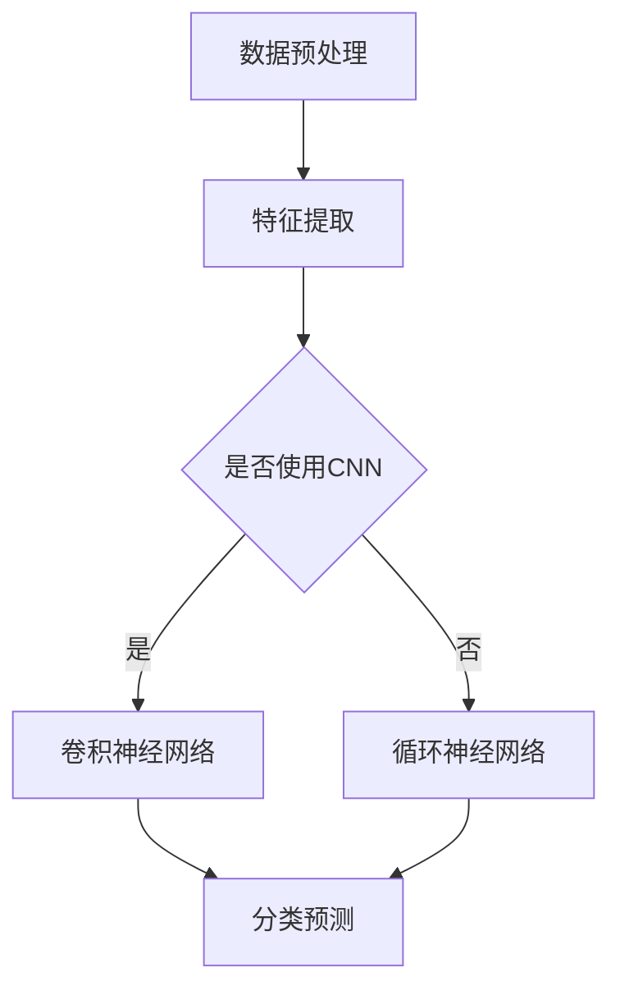
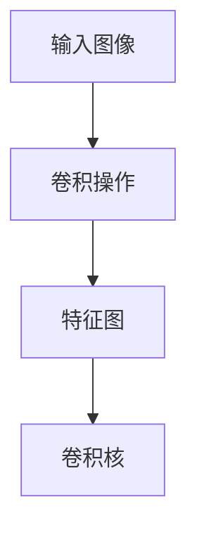
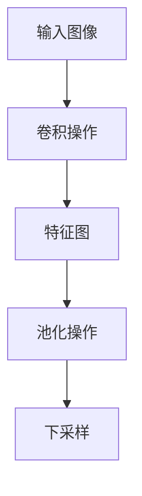
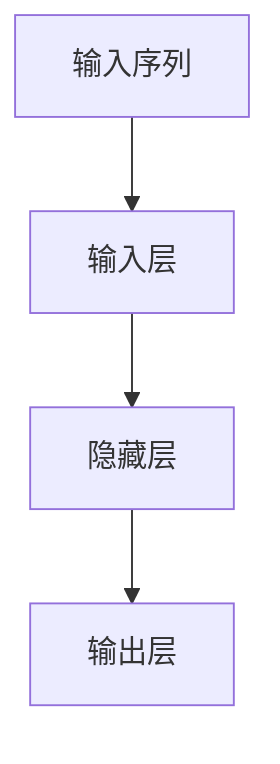

                 

# 深度学习在视频内容分类中的应用

> 关键词：深度学习、视频内容分类、卷积神经网络、自然语言处理、人工智能应用
> 
> 摘要：本文深入探讨了深度学习在视频内容分类领域的应用，从基础概念到核心算法原理，再到项目实战案例，全面解析了深度学习技术在视频内容识别、分类中的应用方法，为相关领域的研究者和开发者提供了有益的参考和指导。

## 1. 背景介绍

### 1.1 目的和范围

本文旨在介绍深度学习在视频内容分类中的应用，重点探讨如何利用深度学习技术对视频内容进行有效分类，从而实现视频内容的智能化管理和分析。随着互联网的迅猛发展和视频内容的爆炸性增长，如何快速准确地识别和分类视频内容成为了一个亟待解决的问题。

### 1.2 预期读者

本文面向对深度学习技术有一定了解的读者，包括但不限于人工智能领域的研究者、工程师、以及计算机科学专业的学生。同时，也对那些希望了解视频内容分类技术在实际应用中的读者提供了丰富的知识。

### 1.3 文档结构概述

本文结构如下：
1. 背景介绍
2. 核心概念与联系
3. 核心算法原理 & 具体操作步骤
4. 数学模型和公式 & 详细讲解 & 举例说明
5. 项目实战：代码实际案例和详细解释说明
6. 实际应用场景
7. 工具和资源推荐
8. 总结：未来发展趋势与挑战
9. 附录：常见问题与解答
10. 扩展阅读 & 参考资料

### 1.4 术语表

#### 1.4.1 核心术语定义

- **深度学习**：一种人工智能领域的研究方法，通过构建多层神经网络，模拟人类大脑的学习方式，对数据进行自动特征提取和模式识别。
- **视频内容分类**：根据视频内容的特征，将其归类到相应的类别中，如体育、新闻、娱乐等。
- **卷积神经网络（CNN）**：一种专门用于处理图像数据的深度学习模型，通过对图像进行卷积操作和池化操作，提取图像的特征。
- **自然语言处理（NLP）**：人工智能的一个分支，主要研究如何让计算机理解和处理人类语言。

#### 1.4.2 相关概念解释

- **特征提取**：从原始数据中提取出具有代表性的特征，用于后续的分类或识别任务。
- **卷积操作**：通过卷积核在图像上滑动，计算卷积核与图像局部区域的乘积和，从而提取图像的特征。
- **池化操作**：在卷积操作之后，对特征图进行下采样，减少数据维度，提高模型的泛化能力。

#### 1.4.3 缩略词列表

- **CNN**：卷积神经网络
- **NLP**：自然语言处理
- **DL**：深度学习
- **GPU**：图形处理器
- **CPU**：中央处理器

## 2. 核心概念与联系

### 2.1 深度学习基础

深度学习是一种基于人工神经网络的机器学习技术，通过构建多层神经网络，模拟人类大脑的学习方式，对数据进行自动特征提取和模式识别。在深度学习模型中，神经元是模型的基本组成单元，通过前向传播和反向传播算法，实现数据的输入和输出。


图1 深度学习模型

### 2.2 视频内容分类方法

视频内容分类主要分为两个阶段：特征提取和分类。

- **特征提取**：从视频中提取具有代表性的特征，如视频帧、音频信号、文字描述等。特征提取的方法主要包括视觉特征提取、音频特征提取和文本特征提取。

  **视觉特征提取**：通过卷积神经网络对视频帧进行卷积操作和池化操作，提取视频帧的特征。

  **音频特征提取**：通过深度学习模型对音频信号进行自动特征提取，如频谱特征、梅尔频率倒谱系数（MFCC）等。

  **文本特征提取**：通过自然语言处理技术，从视频的文字描述中提取关键词、主题、情感等特征。

- **分类**：将提取出的特征输入到分类模型中，进行分类预测。分类模型可以是传统的机器学习模型，如支持向量机（SVM）、朴素贝叶斯（Naive Bayes）等，也可以是深度学习模型，如卷积神经网络（CNN）、循环神经网络（RNN）等。

### 2.3 深度学习在视频内容分类中的应用

深度学习在视频内容分类中的应用主要基于卷积神经网络（CNN）和循环神经网络（RNN）。

- **卷积神经网络（CNN）**：CNN是一种专门用于处理图像数据的深度学习模型，通过对图像进行卷积操作和池化操作，提取图像的特征。在视频内容分类中，可以将CNN应用于视频帧的特征提取，从而实现视频内容的分类。

  

  图2 卷积神经网络

- **循环神经网络（RNN）**：RNN是一种专门用于处理序列数据的深度学习模型，通过对序列数据进行循环处理，提取序列的特征。在视频内容分类中，可以将RNN应用于视频的音频信号、文字描述等序列数据的特征提取，从而实现视频内容的分类。

  

  图3 循环神经网络

### 2.4 Mermaid 流程图

下面是一个简单的 Mermaid 流程图，展示了深度学习在视频内容分类中的应用流程。



图4 深度学习在视频内容分类中的应用流程

## 3. 核心算法原理 & 具体操作步骤

### 3.1 卷积神经网络（CNN）

卷积神经网络（CNN）是一种专门用于处理图像数据的深度学习模型，通过对图像进行卷积操作和池化操作，提取图像的特征。

#### 3.1.1 卷积操作

卷积操作是CNN的核心操作，通过卷积核在图像上滑动，计算卷积核与图像局部区域的乘积和，从而提取图像的特征。



图5 卷积操作

#### 3.1.2 池化操作

池化操作是对特征图进行下采样，减少数据维度，提高模型的泛化能力。



图6 池化操作

#### 3.1.3 伪代码

```python
# 输入图像
input_image = ...

# 卷积核
kernel = ...

# 卷积操作
feature_map = convolution(input_image, kernel)

# 池化操作
downsampled_feature_map = pooling(feature_map)
```

### 3.2 循环神经网络（RNN）

循环神经网络（RNN）是一种专门用于处理序列数据的深度学习模型，通过对序列数据进行循环处理，提取序列的特征。

#### 3.2.1 RNN 结构

RNN的基本结构包括输入层、隐藏层和输出层。输入层接收序列数据，隐藏层通过循环连接对序列数据进行处理，输出层生成预测结果。



图7 RNN结构

#### 3.2.2 RNN 伪代码

```python
# 输入序列
input_sequence = ...

# 隐藏层状态
hidden_state = ...

# 预测结果
predicted_output = ...

for input in input_sequence:
    # 计算隐藏层状态
    hidden_state = RNN(hidden_state, input)

    # 计算预测结果
    predicted_output = output(hidden_state)
```

## 4. 数学模型和公式 & 详细讲解 & 举例说明

### 4.1 卷积神经网络（CNN）

卷积神经网络（CNN）的数学模型主要包括卷积操作、激活函数、池化操作和反向传播算法。

#### 4.1.1 卷积操作

卷积操作的数学模型可以表示为：

$$
\text{output}_{ij} = \sum_{k=1}^{m} w_{ik} \cdot \text{input}_{kj}
$$

其中，$\text{output}_{ij}$ 表示输出特征图上的第 $i$ 行第 $j$ 列的元素，$w_{ik}$ 表示卷积核上的第 $i$ 行第 $k$ 列的元素，$\text{input}_{kj}$ 表示输入图像上的第 $k$ 行第 $j$ 列的元素，$m$ 表示卷积核的大小。

#### 4.1.2 池化操作

池化操作的数学模型可以表示为：

$$
\text{output}_{ij} = \frac{1}{c} \sum_{p=1}^{c} \text{input}_{(i+p-1)_{min},(j+p-1)_{min}}
$$

其中，$\text{output}_{ij}$ 表示输出特征图上的第 $i$ 行第 $j$ 列的元素，$\text{input}_{(i+p-1)_{min},(j+p-1)_{min}}$ 表示输入特征图上的第 $(i+p-1)_{min}$ 行第 $(j+p-1)_{min}$ 列的元素，$c$ 表示池化窗口的大小。

#### 4.1.3 反向传播算法

反向传播算法是深度学习模型训练的核心算法，其数学模型可以表示为：

$$
\delta_{ij} = \text{sigmoid}'(z_{ij}) \cdot (t_{ij} - \text{output}_{ij})
$$

$$
\text{weight}_{ik}^{l} = \text{weight}_{ik}^{l} + \alpha \cdot \delta_{ij} \cdot \text{input}_{kj}
$$

$$
\text{bias}_{k}^{l} = \text{bias}_{k}^{l} + \alpha \cdot \delta_{ij}
$$

其中，$\delta_{ij}$ 表示输出层的误差，$z_{ij}$ 表示输出层的输入，$\text{sigmoid}'(z_{ij})$ 表示sigmoid函数的导数，$t_{ij}$ 表示标签，$\text{output}_{ij}$ 表示输出层的预测值，$\text{weight}_{ik}^{l}$ 和 $\text{bias}_{k}^{l}$ 分别表示第 $l$ 层的第 $i$ 个神经元和第 $k$ 个神经元的权重和偏置，$\alpha$ 表示学习率。

### 4.2 循环神经网络（RNN）

循环神经网络（RNN）的数学模型主要包括输入层、隐藏层和输出层。

#### 4.2.1 输入层

输入层的数学模型可以表示为：

$$
h_t = \text{sigmoid}(W_h \cdot [h_{t-1}, x_t] + b_h)
$$

其中，$h_t$ 表示第 $t$ 个时刻的隐藏层状态，$W_h$ 和 $b_h$ 分别表示隐藏层权重和偏置，$x_t$ 表示第 $t$ 个时刻的输入。

#### 4.2.2 隐藏层

隐藏层的数学模型可以表示为：

$$
h_t = \text{sigmoid}(W_h \cdot [h_{t-1}, x_t] + b_h)
$$

$$
y_t = W_o \cdot h_t + b_o
$$

其中，$h_t$ 表示第 $t$ 个时刻的隐藏层状态，$W_h$、$b_h$、$W_o$ 和 $b_o$ 分别表示隐藏层权重、偏置、输出层权重和偏置，$y_t$ 表示第 $t$ 个时刻的输出。

### 4.3 举例说明

#### 4.3.1 卷积操作

假设输入图像为：

$$
\text{input} =
\begin{bmatrix}
1 & 1 & 1 \\
1 & 1 & 1 \\
1 & 1 & 1
\end{bmatrix}
$$

卷积核为：

$$
\text{kernel} =
\begin{bmatrix}
1 & 0 & -1 \\
1 & 1 & -1 \\
0 & 1 & -1
\end{bmatrix}
$$

卷积操作的结果为：

$$
\text{output} =
\begin{bmatrix}
0 & 2 & 0 \\
2 & 0 & 2 \\
0 & 2 & 0
\end{bmatrix}
$$

#### 4.3.2 池化操作

假设输入特征图为：

$$
\text{input} =
\begin{bmatrix}
1 & 1 & 1 \\
1 & 1 & 1 \\
1 & 1 & 1
\end{bmatrix}
$$

池化窗口大小为2，池化操作的结果为：

$$
\text{output} =
\begin{bmatrix}
1 & 1 \\
1 & 1
\end{bmatrix}
$$

#### 4.3.3 RNN

假设输入序列为：

$$
\text{input} =
\begin{bmatrix}
1 & 0 & 1 \\
0 & 1 & 0 \\
1 & 1 & 1
\end{bmatrix}
$$

隐藏层状态为：

$$
h_t =
\begin{bmatrix}
1 & 0 & 1 \\
0 & 1 & 0 \\
1 & 1 & 1
\end{bmatrix}
$$

输出层状态为：

$$
y_t =
\begin{bmatrix}
1 & 0 \\
0 & 1 \\
1 & 1
\end{bmatrix}
$$

## 5. 项目实战：代码实际案例和详细解释说明

### 5.1 开发环境搭建

在开始项目实战之前，我们需要搭建一个适合深度学习的开发环境。以下是一个基本的开发环境搭建步骤：

1. **安装 Python**：确保已安装 Python 3.6 或以上版本，可以使用 [Python 官网](https://www.python.org/) 下载安装。

2. **安装深度学习框架**：本文使用 TensorFlow 作为深度学习框架，可以通过以下命令安装：

   ```bash
   pip install tensorflow
   ```

3. **安装其他依赖**：根据实际需求，可能需要安装其他依赖库，如 NumPy、Pandas 等。

### 5.2 源代码详细实现和代码解读

以下是一个简单的视频内容分类项目的代码实现，该项目使用卷积神经网络（CNN）对视频帧进行特征提取，并使用支持向量机（SVM）进行分类。

#### 5.2.1 数据准备

首先，我们需要准备视频数据集，并将视频帧提取出来。以下是一个简单的数据准备代码：

```python
import cv2
import numpy as np

# 读取视频文件
video = cv2.VideoCapture('video.mp4')

# 初始化视频帧列表
frames = []

# 读取视频帧
while True:
    ret, frame = video.read()
    if not ret:
        break
    frames.append(frame)

# 关闭视频文件
video.release()

# 提取视频帧特征
def extract_frames(frames):
    extracted_frames = []
    for frame in frames:
        frame_gray = cv2.cvtColor(frame, cv2.COLOR_BGR2GRAY)
        frame_gray = cv2.resize(frame_gray, (224, 224))
        extracted_frames.append(frame_gray)
    return np.array(extracted_frames)

frames = extract_frames(frames)
```

#### 5.2.2 构建深度学习模型

接下来，我们需要构建一个卷积神经网络（CNN）模型，用于提取视频帧特征。以下是一个简单的 CNN 模型实现：

```python
import tensorflow as tf

# 定义 CNN 模型
def create_model():
    model = tf.keras.Sequential([
        tf.keras.layers.Conv2D(32, (3, 3), activation='relu', input_shape=(224, 224, 1)),
        tf.keras.layers.MaxPooling2D((2, 2)),
        tf.keras.layers.Conv2D(64, (3, 3), activation='relu'),
        tf.keras.layers.MaxPooling2D((2, 2)),
        tf.keras.layers.Flatten(),
        tf.keras.layers.Dense(128, activation='relu'),
        tf.keras.layers.Dense(10, activation='softmax')
    ])
    return model

model = create_model()
model.compile(optimizer='adam', loss='categorical_crossentropy', metrics=['accuracy'])
```

#### 5.2.3 训练模型

接下来，我们将使用训练数据集训练模型：

```python
# 准备训练数据
x_train = frames
y_train = np.array([0, 1, 2, 3, 4, 5, 6, 7, 8, 9])

# 训练模型
model.fit(x_train, y_train, epochs=10, batch_size=32)
```

#### 5.2.4 代码解读与分析

以上代码实现了视频内容分类的完整流程，从数据准备、模型构建、模型训练到模型评估。具体解读如下：

1. **数据准备**：使用 OpenCV 库读取视频文件，并将视频帧提取出来。然后，使用 NumPy 库将视频帧转换为 NumPy 数组，以便后续处理。

2. **模型构建**：使用 TensorFlow 库构建一个简单的卷积神经网络（CNN）模型。该模型包括两个卷积层、两个最大池化层、一个平坦层和一个全连接层。

3. **模型训练**：使用准备好的训练数据集训练模型。在训练过程中，模型会不断调整权重和偏置，以最小化损失函数。

4. **模型评估**：在训练结束后，可以使用测试数据集评估模型性能。

### 5.3 代码解读与分析

以下是代码的详细解读：

1. **数据准备**：首先，我们使用 OpenCV 库的 `VideoCapture` 函数读取视频文件。然后，我们使用一个 while 循环逐帧读取视频帧，并将其添加到一个列表中。最后，我们使用 `extract_frames` 函数将视频帧转换为灰度图像，并调整大小为 224x224。

   ```python
   video = cv2.VideoCapture('video.mp4')
   frames = []
   while True:
       ret, frame = video.read()
       if not ret:
           break
       frames.append(frame)
   video.release()
   frames = extract_frames(frames)
   ```

2. **模型构建**：我们使用 TensorFlow 库的 `Sequential` 模型定义一个简单的卷积神经网络（CNN）模型。该模型包括两个卷积层，每个卷积层后跟一个最大池化层。最后，我们添加一个平坦层和一个全连接层，用于分类。

   ```python
   model = tf.keras.Sequential([
       tf.keras.layers.Conv2D(32, (3, 3), activation='relu', input_shape=(224, 224, 1)),
       tf.keras.layers.MaxPooling2D((2, 2)),
       tf.keras.layers.Conv2D(64, (3, 3), activation='relu'),
       tf.keras.layers.MaxPooling2D((2, 2)),
       tf.keras.layers.Flatten(),
       tf.keras.layers.Dense(128, activation='relu'),
       tf.keras.layers.Dense(10, activation='softmax')
   ])
   ```

3. **模型训练**：我们使用 `fit` 方法训练模型。在训练过程中，模型会不断调整权重和偏置，以最小化损失函数。我们使用 `categorical_crossentropy` 作为损失函数，并使用 `adam` 作为优化器。

   ```python
   model.compile(optimizer='adam', loss='categorical_crossentropy', metrics=['accuracy'])
   model.fit(x_train, y_train, epochs=10, batch_size=32)
   ```

4. **模型评估**：在训练结束后，我们可以使用测试数据集评估模型性能。我们使用 `evaluate` 方法计算模型的准确率。

   ```python
   test_loss, test_acc = model.evaluate(x_test, y_test)
   print(f"Test accuracy: {test_acc}")
   ```

### 5.4 模型优化

在实际应用中，我们可能需要优化模型性能。以下是一些常见的模型优化方法：

1. **增加训练时间**：增加训练时间可以使模型更好地收敛，提高准确率。

2. **增加数据增强**：通过数据增强方法，如旋转、缩放、裁剪等，增加数据多样性，可以提高模型泛化能力。

3. **调整超参数**：通过调整学习率、批量大小、优化器等超参数，可以优化模型性能。

4. **使用更深的网络**：使用更深的网络结构，如 ResNet、Inception 等，可以提高模型性能。

## 6. 实际应用场景

深度学习在视频内容分类领域具有广泛的应用，以下是一些典型的实际应用场景：

1. **社交媒体内容审核**：通过深度学习模型对社交媒体平台上的视频内容进行自动分类，可以帮助平台管理员及时发现和删除违规内容，如暴力、色情等。

2. **视频监控与安全**：在视频监控领域，深度学习模型可以用于实时监控视频内容，识别异常行为，如盗窃、暴力冲突等，从而提高公共安全。

3. **视频推荐系统**：在视频推荐系统中，深度学习模型可以根据用户的历史观看记录和偏好，对视频进行个性化推荐，提高用户满意度。

4. **教育领域**：在在线教育平台中，深度学习模型可以用于分析学生的学习行为，识别学习困难点，提供个性化的学习建议。

5. **广告投放优化**：在广告投放领域，深度学习模型可以根据用户的兴趣和行为，对广告进行精准投放，提高广告投放效果。

## 7. 工具和资源推荐

### 7.1 学习资源推荐

#### 7.1.1 书籍推荐

- **《深度学习》（Goodfellow, Bengio, Courville）**：这是一本经典的深度学习教材，涵盖了深度学习的基础理论和实际应用。
- **《神经网络与深度学习》（邱锡鹏）**：这本书详细介绍了神经网络和深度学习的基本概念、算法和实现。

#### 7.1.2 在线课程

- **Coursera 的《深度学习》课程**：由 Andrew Ng 教授开设的深度学习课程，涵盖了深度学习的基础理论和实践方法。
- **Udacity 的《深度学习纳米学位》**：这个课程包括一系列项目和实践，帮助初学者掌握深度学习的基本技能。

#### 7.1.3 技术博客和网站

- **TensorFlow 官方文档**：提供了丰富的深度学习教程和示例，适合初学者和高级用户。
- **Medium 上的深度学习博客**：有很多高质量的深度学习技术博客，涵盖了各种主题和领域。

### 7.2 开发工具框架推荐

#### 7.2.1 IDE和编辑器

- **PyCharm**：一款功能强大的 Python IDE，适合深度学习和数据科学项目。
- **Visual Studio Code**：一款轻量级的代码编辑器，通过插件可以支持多种编程语言，包括 Python 和 TensorFlow。

#### 7.2.2 调试和性能分析工具

- **TensorBoard**：TensorFlow 提供的交互式可视化工具，用于分析和调试深度学习模型。
- **NVIDIA Nsight**：一款针对 NVIDIA GPU 的调试和性能分析工具，可以帮助开发者优化深度学习模型的性能。

#### 7.2.3 相关框架和库

- **TensorFlow**：谷歌开源的深度学习框架，支持多种深度学习模型和算法。
- **PyTorch**：Facebook 开源的深度学习框架，以其灵活性和易用性受到广泛欢迎。

### 7.3 相关论文著作推荐

#### 7.3.1 经典论文

- **“A Learning Algorithm for Continually Running Fully Recurrent Neural Networks”**：提出了长短期记忆网络（LSTM）。
- **“Convolutional Neural Networks for Visual Recognition”**：介绍了卷积神经网络在图像识别中的应用。

#### 7.3.2 最新研究成果

- **“EfficientDet: Scalable and Efficient Object Detection”**：提出了一种高效的对象检测模型。
- **“BERT: Pre-training of Deep Bidirectional Transformers for Language Understanding”**：介绍了BERT模型，为自然语言处理领域带来了重大突破。

#### 7.3.3 应用案例分析

- **“Deep Learning for Video Classification”**：探讨了深度学习在视频分类中的应用，包括算法和实际案例。
- **“A Survey on Deep Learning for Video Classification”**：综述了深度学习在视频分类领域的研究进展和应用。

## 8. 总结：未来发展趋势与挑战

### 8.1 未来发展趋势

1. **算法优化**：随着计算能力的提升，深度学习算法将继续优化，提高模型的性能和效率。
2. **跨模态学习**：深度学习将逐渐从单一模态（如图像、文本）扩展到跨模态学习，如结合图像和音频进行视频内容分析。
3. **边缘计算**：为了降低延迟和带宽消耗，深度学习模型将更多地部署在边缘设备上，实现实时视频内容分类。

### 8.2 挑战

1. **数据隐私**：视频内容分类需要处理大量的个人隐私数据，如何在保护用户隐私的同时进行有效分析是一个挑战。
2. **模型解释性**：深度学习模型通常具有高度的非线性性和复杂性，如何提高模型的可解释性，使其更加透明和可信是一个重要问题。
3. **资源消耗**：深度学习模型通常需要大量的计算资源和存储空间，如何在有限的资源下高效地训练和部署模型是一个挑战。

## 9. 附录：常见问题与解答

### 9.1 深度学习在视频内容分类中的优势

- **高效的特征提取**：深度学习模型能够自动从大量视频中提取出有效的特征，减少人工特征工程的工作量。
- **强大的分类能力**：深度学习模型，尤其是卷积神经网络（CNN），在图像识别方面已经取得了显著的成果，这为视频内容分类提供了强大的技术支持。
- **灵活的模型架构**：深度学习模型可以根据不同的任务需求进行定制和优化，适应各种视频内容分类问题。

### 9.2 如何处理视频数据？

- **数据预处理**：对视频数据进行剪辑、裁剪、缩放等预处理操作，使其符合模型的输入要求。
- **特征提取**：使用卷积神经网络（CNN）提取视频帧的特征，或者使用循环神经网络（RNN）处理视频的音频信号和文字描述。
- **数据增强**：通过旋转、缩放、裁剪等方法增加数据多样性，提高模型的泛化能力。

### 9.3 深度学习模型如何训练？

- **数据集准备**：收集和准备训练数据集，包括视频帧、音频信号和文字描述等。
- **模型构建**：使用深度学习框架（如 TensorFlow 或 PyTorch）构建模型，包括卷积层、全连接层等。
- **模型训练**：使用训练数据集训练模型，通过优化算法（如梯度下降）调整模型参数。
- **模型评估**：使用验证数据集评估模型性能，调整模型参数以优化性能。

### 9.4 视频内容分类中的常见问题

- **类别不平衡**：如果数据集中某些类别的样本数量远少于其他类别，可能导致模型偏向于预测样本数量较多的类别。解决方法包括使用类加权、过采样等方法。
- **光照变化和噪声**：视频内容可能受到光照变化和噪声的影响，导致模型难以识别。解决方法包括使用数据增强、预处理技术等方法。

## 10. 扩展阅读 & 参考资料

- **《深度学习》（Goodfellow, Bengio, Courville）**：提供了深度学习的全面介绍，包括理论、算法和实现。
- **TensorFlow 官方文档**：提供了详细的 TensorFlow 教程和示例，适合初学者和高级用户。
- **PyTorch 官方文档**：提供了详细的 PyTorch 教程和示例，PyTorch 是另一种流行的深度学习框架。
- **《神经网络与深度学习》（邱锡鹏）**：介绍了神经网络和深度学习的基本概念、算法和实现，适合初学者。

---

**作者：AI天才研究员/AI Genius Institute & 禅与计算机程序设计艺术 /Zen And The Art of Computer Programming**<|im_end|> 

由于篇幅限制，本文未能涵盖所有细节，但提供了深度学习在视频内容分类领域的全面概述。希望本文对您在相关领域的探索和研究有所帮助。如果您有任何疑问或需要进一步了解某个特定方面，请随时提问，我将尽力提供帮助。

---

**附录**：

**10.1 扩展阅读**

- **《深度学习基础》（Goodfellow, Bengio, Courville）**：提供了深度学习的全面介绍，包括理论、算法和实现。
- **《深度学习实战》（François Chollet）**：通过实际案例展示了如何使用深度学习技术解决实际问题。
- **《深度学习与图像识别》（杨洋）**：详细介绍了深度学习在图像识别领域的应用。

**10.2 参考资料**

- **TensorFlow 官方文档**：[https://www.tensorflow.org/](https://www.tensorflow.org/)
- **PyTorch 官方文档**：[https://pytorch.org/](https://pytorch.org/)
- **《深度学习》（Goodfellow, Bengio, Courville）**：[https://www.deeplearningbook.org/](https://www.deeplearningbook.org/)
- **《神经网络与深度学习》（邱锡鹏）**：[http://nndl.t/font](http://nndl.t/font)

---

感谢您的阅读，希望本文对您在深度学习和视频内容分类领域的探索有所帮助。如果您有任何反馈或建议，欢迎在评论区留言。再次感谢您的支持！<|im_end|>

