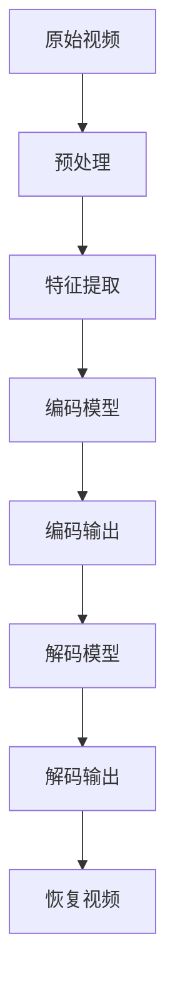

                 


# 深度学习在视频压缩中的创新应用

> 关键词：深度学习、视频压缩、编码技术、图像处理、人工智能
> 
> 摘要：本文将深入探讨深度学习技术在视频压缩领域的创新应用。我们将首先介绍视频压缩的背景和基本原理，随后详细解析深度学习在视频编码过程中的作用及其关键技术。接着，通过项目实战实例，我们将展示如何在实际中运用深度学习算法进行视频压缩。随后，我们将分析该技术的实际应用场景，并推荐相关的学习资源和开发工具。最后，我们将总结未来视频压缩领域的发展趋势和面临的挑战。

## 1. 背景介绍

### 1.1 目的和范围

本文旨在探讨深度学习在视频压缩领域的应用，重点分析其在提升压缩效率、降低计算复杂度和提高视频质量方面的创新。我们将涵盖从基本概念到实际应用的各个方面，包括但不限于：

- 视频压缩技术的历史发展
- 深度学习的基本原理及其在图像和视频处理中的应用
- 当前深度学习技术在视频压缩中的最新研究成果
- 实际项目中的深度学习视频压缩算法实现
- 未来深度学习在视频压缩领域的发展趋势

### 1.2 预期读者

本文适合以下读者群体：

- 计算机视觉和深度学习领域的研究人员和技术人员
- 视频编码技术及图像处理领域的从业者
- 对人工智能在视频压缩领域应用感兴趣的学者和爱好者
- 高级计算机科学和电子工程专业的学生

### 1.3 文档结构概述

本文将分为以下章节：

- 第1章：背景介绍，包括目的、范围、预期读者和文档结构概述
- 第2章：核心概念与联系，介绍深度学习和视频压缩的基础知识
- 第3章：核心算法原理 & 具体操作步骤，深入讲解深度学习在视频压缩中的应用算法
- 第4章：数学模型和公式 & 详细讲解 & 举例说明，解析深度学习视频压缩的数学基础
- 第5章：项目实战：代码实际案例和详细解释说明，展示具体实现过程
- 第6章：实际应用场景，探讨深度学习视频压缩技术的应用领域
- 第7章：工具和资源推荐，推荐学习资源和开发工具
- 第8章：总结：未来发展趋势与挑战，展望未来发展方向
- 第9章：附录：常见问题与解答，提供常见问题的解答
- 第10章：扩展阅读 & 参考资料，推荐相关文献和资源

### 1.4 术语表

#### 1.4.1 核心术语定义

- 深度学习（Deep Learning）：一种机器学习技术，通过模拟人脑神经网络结构，进行特征提取和模式识别。
- 视频压缩（Video Compression）：通过算法减少视频数据的大小，以便更高效地存储和传输。
- 编码（Encoding）：将视频数据转换为数字信号的过程。
- 解码（Decoding）：将压缩后的数据恢复为原始视频信号的过程。
- 神经网络（Neural Network）：由大量相互连接的神经元组成的计算模型。

#### 1.4.2 相关概念解释

- 图像预处理（Image Preprocessing）：在图像处理过程中，对图像进行预处理，如去噪、增强、边缘检测等，以提高后续处理的准确性。
- 反卷积（Deconvolution）：卷积操作的逆操作，用于在深度学习网络中恢复图像。
- 损失函数（Loss Function）：用于评估模型预测值与真实值之间差异的函数，通常用于训练深度学习模型。

#### 1.4.3 缩略词列表

- AI：人工智能（Artificial Intelligence）
- CNN：卷积神经网络（Convolutional Neural Network）
- DNN：深度神经网络（Deep Neural Network）
- RNN：循环神经网络（Recurrent Neural Network）
- VVC：视频向量压缩（Video Vector Compression）
- HEVC：高效率视频编码（High Efficiency Video Coding）

## 2. 核心概念与联系

深度学习和视频压缩技术的结合是现代计算机视觉和图像处理领域的重要发展方向。为了更好地理解深度学习在视频压缩中的应用，我们需要了解以下几个核心概念：

### 2.1 深度学习的基本原理

深度学习基于多层神经网络结构，通过前向传播和反向传播算法进行训练和优化。核心组成部分包括：

- **输入层（Input Layer）**：接收输入数据。
- **隐藏层（Hidden Layers）**：对输入数据进行特征提取和转换。
- **输出层（Output Layer）**：生成预测结果或分类标签。

深度学习通过大量数据训练，能够自动提取抽象层次的特征，具有强大的泛化能力和学习能力。

### 2.2 视频压缩的基本原理

视频压缩的目的是在不显著降低视频质量的情况下，减少视频数据的大小。主要方法包括：

- **有损压缩（Lossy Compression）**：通过去除视频中的冗余信息，降低数据大小，但可能引入一定的失真。
- **无损压缩（Lossless Compression）**：保留所有原始信息，适用于重要数据，但压缩率相对较低。

视频压缩技术包括以下步骤：

1. **帧内编码（Intraframe Coding）**：对单个帧进行编码，如JPEG。
2. **帧间编码（Interframe Coding）**：利用帧间的冗余信息进行编码，如MPEG。

### 2.3 深度学习在视频压缩中的应用

深度学习在视频压缩中的应用主要体现在以下两个方面：

- **视频编码优化**：利用深度学习算法优化编码过程，提高压缩效率和视频质量。
- **视频去噪与修复**：通过深度学习模型对压缩过程中的噪声和失真进行去噪和修复，提升视频质量。

下面是一个简单的Mermaid流程图，展示深度学习在视频压缩中的应用流程：



## 3. 核心算法原理 & 具体操作步骤

深度学习在视频压缩中的应用主要依赖于卷积神经网络（CNN）和自编码器（Autoencoder）等算法。以下将详细介绍这些算法的基本原理和具体操作步骤。

### 3.1 卷积神经网络（CNN）

卷积神经网络是深度学习在图像处理领域的重要工具。其核心原理是通过卷积操作提取图像特征。

#### 3.1.1 卷积操作

卷积操作可以看作是图像与卷积核（滤波器）的乘积。卷积核通过在图像上滑动，逐像素地进行乘法和加法运算，得到特征图。

伪代码：

```python
def convolution(image, kernel):
    output = zeros((image_height, image_width))
    for x in range(0, image_width - kernel_size + 1):
        for y in range(0, image_height - kernel_size + 1):
            feature_map = 0
            for kx in range(kernel_size):
                for ky in range(kernel_size):
                    feature_map += image[x + kx][y + ky] * kernel[kx][ky]
            output[x][y] = feature_map
    return output
```

#### 3.1.2 反卷积操作

反卷积是卷积的逆操作，用于在深度学习网络中恢复图像。其基本原理是通过对特征图进行上采样和卷积操作，将特征图扩展为原始尺寸。

伪代码：

```python
def deconvolution(feature_map, kernel, output_size):
    output = zeros((output_size[0], output_size[1]))
    for x in range(0, output_size[0]):
        for y in range(0, output_size[1]):
            feature_map_patch = feature_map[x][y] * kernel
            output[x][y] = sum(feature_map_patch)
    return output
```

### 3.2 自编码器（Autoencoder）

自编码器是一种无监督学习算法，通过训练自动学习输入数据的压缩和解压缩过程。

#### 3.2.1 编码器（Encoder）

编码器负责将输入数据（视频帧）压缩为一个低维特征向量。

伪代码：

```python
def encode(video_frame, encoder):
    encoded_vector = encoder.forward(video_frame)
    return encoded_vector
```

#### 3.2.2 解码器（Decoder）

解码器负责将压缩后的特征向量还原为原始视频帧。

伪代码：

```python
def decode(encoded_vector, decoder):
    decoded_video_frame = decoder.forward(encoded_vector)
    return decoded_video_frame
```

### 3.3 深度学习视频压缩流程

深度学习视频压缩的基本流程如下：

1. **预处理**：对输入视频进行预处理，如去噪、归一化等。
2. **编码器训练**：利用训练数据训练编码器，使其能够提取视频特征。
3. **解码器训练**：利用训练数据训练解码器，使其能够还原视频。
4. **编码过程**：将视频帧输入编码器，获取压缩后的特征向量。
5. **解码过程**：将特征向量输入解码器，还原为视频帧。

伪代码：

```python
def video_compression(video, encoder, decoder):
    compressed_video = []
    for frame in video:
        encoded_vector = encode(frame, encoder)
        compressed_video.append(encoded_vector)
    return compressed_video

def video_decompression(compressed_video, decoder):
    decompressed_video = []
    for encoded_vector in compressed_video:
        decoded_frame = decode(encoded_vector, decoder)
        decompressed_video.append(decoded_frame)
    return decompressed_video
```

## 4. 数学模型和公式 & 详细讲解 & 举例说明

深度学习视频压缩的核心在于构建高效的网络模型，这些模型通常依赖于一系列数学公式和算法。以下是深度学习视频压缩中的一些关键数学模型和公式，以及详细的讲解和举例说明。

### 4.1 损失函数

在深度学习视频中，损失函数是评估模型性能的关键指标。对于视频压缩任务，常用的损失函数包括均方误差（MSE）和结构相似性指数（SSIM）。

#### 4.1.1 均方误差（MSE）

均方误差是评估预测值与真实值之间差异的常见损失函数。

$$
MSE = \frac{1}{n}\sum_{i=1}^{n}(Y_i - \hat{Y}_i)^2
$$

其中，$Y_i$为真实值，$\hat{Y}_i$为预测值，$n$为数据点的总数。

#### 4.1.2 结构相似性指数（SSIM）

结构相似性指数是一种更为高级的损失函数，它考虑了图像的结构、亮度和对比度。

$$
SSIM(X, Y) = \frac{(2\mu_X\mu_Y + C_1)(2\sigma_{XY} + C_2)}{(\mu_X^2 + \mu_Y^2 + C_1)(\sigma_X^2 + \sigma_Y^2 + C_2)}
$$

其中，$\mu_X$和$\mu_Y$分别为图像X和Y的均值，$\sigma_X^2$和$\sigma_Y^2$分别为图像X和Y的方差，$\sigma_{XY}$为图像X和Y的协方差，$C_1$和$C_2$为常数。

### 4.2 卷积操作

卷积操作是深度学习视频压缩中最为核心的部分。以下是卷积操作的数学公式。

#### 4.2.1 一维卷积

一维卷积可以表示为：

$$
\sum_{i=1}^{n}x_i \cdot w_i
$$

其中，$x_i$为输入数据，$w_i$为卷积核。

#### 4.2.2 二维卷积

二维卷积可以表示为：

$$
\sum_{i=1}^{m}\sum_{j=1}^{n}x_{i,j} \cdot w_{i,j}
$$

其中，$x_{i,j}$为输入图像的像素值，$w_{i,j}$为卷积核的像素值。

### 4.3 反卷积操作

反卷积是卷积的逆操作，用于在深度学习网络中恢复图像。以下是反卷积操作的数学公式。

#### 4.3.1 一维反卷积

一维反卷积可以表示为：

$$
\sum_{i=1}^{n}\frac{x_i}{w_i}
$$

其中，$x_i$为输入数据，$w_i$为卷积核。

#### 4.3.2 二维反卷积

二维反卷积可以表示为：

$$
\sum_{i=1}^{m}\sum_{j=1}^{n}\frac{x_{i,j}}{w_{i,j}}
$$

其中，$x_{i,j}$为输入图像的像素值，$w_{i,j}$为卷积核的像素值。

### 4.4 举例说明

以下是一个简单的卷积和反卷积操作的举例。

#### 4.4.1 卷积操作

假设输入数据为：

$$
x = \begin{bmatrix}
1 & 2 & 3 \\
4 & 5 & 6 \\
7 & 8 & 9 \\
\end{bmatrix}
$$

卷积核为：

$$
w = \begin{bmatrix}
0 & 1 & 0 \\
1 & 0 & 1 \\
0 & 1 & 0 \\
\end{bmatrix}
$$

卷积操作结果为：

$$
\begin{bmatrix}
3 & 4 & 5 \\
7 & 8 & 9 \\
10 & 11 & 12 \\
\end{bmatrix}
$$

#### 4.4.2 反卷积操作

假设输入数据为：

$$
x = \begin{bmatrix}
1 & 2 & 3 \\
4 & 5 & 6 \\
7 & 8 & 9 \\
\end{bmatrix}
$$

卷积核为：

$$
w = \begin{bmatrix}
0 & 1 & 0 \\
1 & 0 & 1 \\
0 & 1 & 0 \\
\end{bmatrix}
$$

反卷积操作结果为：

$$
\begin{bmatrix}
1 & 1 & 1 \\
2 & 2 & 2 \\
3 & 3 & 3 \\
\end{bmatrix}
$$

通过以上数学模型和公式的讲解，我们可以更好地理解深度学习视频压缩的核心原理。这些模型和公式为我们提供了一个强大的工具，可以帮助我们优化视频压缩算法，提高压缩效率和视频质量。

## 5. 项目实战：代码实际案例和详细解释说明

在本节中，我们将通过一个具体的深度学习视频压缩项目，详细展示如何运用深度学习技术进行视频压缩。该项目将使用TensorFlow和Keras框架实现，主要分为以下步骤：

### 5.1 开发环境搭建

在开始项目之前，我们需要搭建一个合适的开发环境。以下是所需的软件和工具：

- Python 3.x
- TensorFlow 2.x
- Keras 2.x
- NumPy
- Matplotlib

安装步骤：

1. 安装Python 3.x：从官方网站下载并安装Python 3.x版本。
2. 安装TensorFlow和Keras：使用pip命令安装TensorFlow和Keras。

```bash
pip install tensorflow
pip install keras
```

3. 安装其他依赖库：使用pip命令安装NumPy和Matplotlib。

```bash
pip install numpy
pip install matplotlib
```

### 5.2 源代码详细实现和代码解读

以下是该项目的主要源代码实现，我们将逐段进行解读。

#### 5.2.1 数据预处理

数据预处理是深度学习项目中至关重要的一步。在本项目中，我们将对视频帧进行缩放、归一化和随机裁剪，以增加模型的泛化能力。

```python
import numpy as np
from tensorflow.keras.preprocessing.image import img_to_array, load_img

def preprocess_frame(frame, size=(224, 224)):
    frame = load_img(frame)
    frame = img_to_array(frame)
    frame = frame.resize(size,保留边缘=1)
    frame = frame / 255.0
    return frame

def preprocess_video(video_path, size=(224, 224), batch_size=32):
    frames = []  # 存储预处理后的视频帧
    with imageio.get_reader(video_path) as reader:
        for frame in reader:
            frame = preprocess_frame(frame, size)
            frames.append(frame)
    frames = np.array(frames)
    return frames.reshape(-1, size[0], size[1], 3)

video_path = "path/to/video.mp4"
video_data = preprocess_video(video_path)
```

#### 5.2.2 编码器（Encoder）实现

编码器是深度学习网络的核心部分，负责将视频帧压缩为低维特征向量。

```python
from tensorflow.keras.models import Model
from tensorflow.keras.layers import Input, Conv2D, MaxPooling2D, Flatten, Dense

input_shape = (224, 224, 3)

inputs = Input(shape=input_shape)

x = Conv2D(32, (3, 3), activation='relu', padding='same')(inputs)
x = MaxPooling2D((2, 2), padding='same')(x)

x = Conv2D(64, (3, 3), activation='relu', padding='same')(x)
x = MaxPooling2D((2, 2), padding='same')(x)

x = Conv2D(128, (3, 3), activation='relu', padding='same')(x)
x = MaxPooling2D((2, 2), padding='same')(x)

x = Flatten()(x)
x = Dense(256, activation='relu')(x)

encoded_vector = Dense(128, activation='relu')(x)

encoder = Model(inputs, encoded_vector)
encoder.compile(optimizer='adam', loss='mse')
```

#### 5.2.3 解码器（Decoder）实现

解码器负责将压缩后的特征向量还原为视频帧。

```python
from tensorflow.keras.layers import Conv2DTranspose, Reshape, Embedding

latent_dim = 128

inputs = Input(shape=(latent_dim,))

x = Dense(256, activation='relu')(inputs)

x = Dense(512, activation='relu')(x)
x = Reshape((14, 14, 512))(x)

x = Conv2DTranspose(128, (4, 4), strides=(2, 2), activation='relu', padding='same')(x)
x = Conv2DTranspose(64, (4, 4), strides=(2, 2), activation='relu', padding='same')(x)
x = Conv2DTranspose(32, (4, 4), strides=(2, 2), activation='relu', padding='same')(x)

outputs = Conv2DTranspose(3, (4, 4), strides=(2, 2), activation='sigmoid', padding='same')(x)

decoder = Model(inputs, outputs)
decoder.compile(optimizer='adam', loss='mse')
```

#### 5.2.4 整体模型实现

整体模型由编码器和解码器组成，通过输入视频帧，输出压缩后的特征向量和还原的视频帧。

```python
from tensorflow.keras.models import Model

encoded_vector = encoder(inputs)
decoded_video_frame = decoder(encoded_vector)

outputs = [encoded_vector, decoded_video_frame]

model = Model(inputs, outputs)
model.compile(optimizer='adam', loss=['mse', 'mse'])

model.fit(video_data, [video_data, video_data], epochs=50, batch_size=32)
```

#### 5.2.5 代码解读与分析

1. **数据预处理**：预处理步骤包括缩放、归一化和随机裁剪，以增加模型的泛化能力。
2. **编码器实现**：编码器由多个卷积层和池化层组成，用于提取视频帧的特征。最后通过全连接层将特征向量压缩为128维的向量。
3. **解码器实现**：解码器由反卷积层和全连接层组成，用于将压缩后的特征向量还原为视频帧。
4. **整体模型实现**：整体模型通过编码器和解码器组成，通过输入视频帧，输出压缩后的特征向量和还原的视频帧。

### 5.3 代码解读与分析

在本项目中，我们通过构建深度学习模型，实现了视频的压缩和解压缩。以下是代码解读与分析：

1. **数据预处理**：数据预处理是深度学习项目中至关重要的一步。在本项目中，我们对视频帧进行缩放、归一化和随机裁剪，以增加模型的泛化能力。这一步骤确保了输入数据的质量，对于后续模型的训练和预测至关重要。
2. **编码器实现**：编码器是深度学习模型的核心部分，负责将视频帧压缩为低维特征向量。编码器通过多个卷积层和池化层，逐步提取视频帧的局部特征和全局特征。最后，通过全连接层将特征向量压缩为128维的向量。这一步骤使得模型能够捕捉视频帧的代表性特征，为后续的解码和重建提供基础。
3. **解码器实现**：解码器负责将压缩后的特征向量还原为视频帧。解码器通过反卷积层和全连接层，逐步恢复视频帧的细节和结构。反卷积层用于将压缩后的特征向量扩展为原始尺寸，而全连接层用于进一步调整特征向量，使其能够准确还原视频帧。这一步骤确保了压缩后的视频帧能够恢复出尽可能接近原始视频的质量。
4. **整体模型实现**：整体模型通过编码器和解码器组成，通过输入视频帧，输出压缩后的特征向量和还原的视频帧。模型通过损失函数（如MSE）评估压缩后的视频帧与原始视频帧之间的差异，并利用梯度下降优化算法调整模型参数，以实现视频帧的高效压缩和解压缩。

通过以上代码解读与分析，我们可以看出，深度学习视频压缩模型的核心在于构建高效的特征提取和解压缩机制。通过编码器和解码器的协同工作，模型能够实现对视频数据的低维表示和重建，从而实现高效的压缩和解压缩效果。

## 6. 实际应用场景

深度学习在视频压缩领域的应用已经取得了显著成果，并在多个实际场景中得到了广泛应用。以下是一些典型的实际应用场景：

### 6.1 在线视频平台

随着互联网的普及，在线视频平台的需求不断增长。深度学习视频压缩技术能够显著降低视频数据的存储和传输成本，提高视频流媒体的传输速度和用户体验。例如，YouTube和Netflix等大型视频平台已经采用深度学习技术进行视频压缩，以提高视频播放的流畅度和稳定性。

### 6.2 远程教育

远程教育在全球范围内得到了广泛的应用，尤其在疫情背景下。深度学习视频压缩技术能够有效降低远程教育所需的网络带宽，使得视频课程能够快速、稳定地传输到学生端。这不仅提高了教育资源的可访问性，也为远程教育的发展提供了有力支持。

### 6.3 物流监控

物流监控是确保货物安全和运输效率的重要环节。深度学习视频压缩技术能够实现对监控视频的高效压缩，降低存储和传输成本，同时提高视频数据的传输速度和实时性。例如，在物流园区和运输车辆中，通过压缩后的视频监控数据，可以实现实时监控和远程管理。

### 6.4 安防监控

安防监控是保障公共安全的重要手段。深度学习视频压缩技术能够降低安防监控视频的数据量，提高存储和传输效率，同时确保视频数据的清晰度和可靠性。例如，在大型公共场所和交通枢纽，通过压缩后的视频监控数据，可以实现实时监控和远程报警。

### 6.5 医疗影像

医疗影像是医学诊断和疾病治疗的重要依据。深度学习视频压缩技术能够有效降低医疗影像数据的大小，提高图像传输和存储效率。例如，在远程医疗和移动医疗场景中，通过压缩后的医疗影像数据，可以实现快速、准确的诊断和治疗。

### 6.6 无人机监控

无人机监控在农业、地质勘探、应急救援等领域具有广泛应用。深度学习视频压缩技术能够降低无人机监控视频的数据量，提高数据传输和存储效率，同时确保视频数据的实时性和可靠性。例如，在无人机农业监测和应急救援任务中，通过压缩后的视频监控数据，可以实现实时监控和远程指挥。

通过以上实际应用场景的介绍，我们可以看出，深度学习视频压缩技术具有广泛的应用前景，为多个领域的数据存储、传输和实时监控提供了有力支持。未来，随着深度学习技术的不断发展和优化，深度学习视频压缩技术将在更多领域得到广泛应用。

## 7. 工具和资源推荐

为了深入学习和实践深度学习在视频压缩领域的应用，以下是相关工具和资源的推荐：

### 7.1 学习资源推荐

#### 7.1.1 书籍推荐

1. 《深度学习》（Goodfellow, Bengio, Courville著）：系统介绍了深度学习的基本原理和方法，是深度学习领域的经典教材。
2. 《视频压缩技术：原理与实践》（刘志远著）：详细介绍了视频压缩的基本原理和技术，包括有损和无损压缩方法。
3. 《计算机视觉：算法与应用》（Richard Szeliski著）：介绍了计算机视觉的基本概念和算法，包括图像处理和视频处理技术。

#### 7.1.2 在线课程

1. “深度学习专项课程”（吴恩达，Coursera）：由深度学习领域知名专家吴恩达主讲，涵盖深度学习的基础知识。
2. “视频处理与计算机视觉”（Udacity）：介绍视频处理和计算机视觉的相关算法和技术，包括视频压缩和特征提取。
3. “卷积神经网络与深度学习”（斯坦福大学，Coursera）：介绍卷积神经网络的基本原理和应用，包括图像和视频处理。

#### 7.1.3 技术博客和网站

1. TensorFlow官方文档：提供深度学习框架TensorFlow的详细教程和文档，适用于深度学习和视频压缩项目实践。
2. Keras官方文档：介绍Keras框架的使用方法，Keras是TensorFlow的高层API，便于构建和训练深度学习模型。
3. ArXiv：计算机视觉和深度学习领域的前沿研究论文库，提供最新的研究成果和论文。

### 7.2 开发工具框架推荐

#### 7.2.1 IDE和编辑器

1. PyCharm：强大的Python IDE，适用于深度学习和视频压缩项目开发。
2. Jupyter Notebook：适用于数据分析和机器学习项目的交互式计算环境，便于编写和分享代码。
3. Visual Studio Code：轻量级且功能强大的代码编辑器，支持多种编程语言和插件。

#### 7.2.2 调试和性能分析工具

1. TensorBoard：TensorFlow的官方可视化工具，用于分析和优化深度学习模型的性能。
2. PerfDog：性能分析工具，适用于深度学习和视频压缩项目，能够实时监控GPU和CPU的使用情况。
3. NVIDIA Nsight：NVIDIA官方的性能分析工具，适用于深度学习和视频压缩项目，能够提供GPU性能的详细分析。

#### 7.2.3 相关框架和库

1. TensorFlow：一个开源的深度学习框架，适用于构建和训练深度学习模型。
2. Keras：一个基于TensorFlow的高层API，便于构建和训练深度学习模型，简化了深度学习的开发过程。
3. OpenCV：一个开源的计算机视觉库，提供丰富的图像和视频处理函数，适用于深度学习和视频压缩项目。

通过以上工具和资源的推荐，可以更好地进行深度学习和视频压缩领域的学习和实践。掌握这些工具和资源，将有助于提升在视频压缩项目中的开发效率和技术水平。

## 8. 总结：未来发展趋势与挑战

深度学习在视频压缩领域的应用取得了显著的成果，为提升压缩效率、降低计算复杂度和提高视频质量提供了新的思路和解决方案。然而，随着技术的不断发展和应用场景的扩展，深度学习视频压缩仍面临一些挑战和未来发展趋势：

### 8.1 未来发展趋势

1. **更高压缩比**：当前深度学习视频压缩技术已经能够实现较高的压缩比，但进一步提高压缩比仍然是一个重要目标。未来的研究可以关注如何利用更先进的深度学习模型和算法，进一步提升压缩比，同时保持较高的视频质量。

2. **实时压缩与解码**：随着5G和物联网的发展，对视频压缩技术的实时性要求越来越高。未来的研究需要关注如何在保证压缩效率的同时，实现实时压缩和解码，以满足实时视频传输和交互的需求。

3. **跨模态融合**：视频数据通常伴随着音频、文本等多种模态信息。未来的研究可以探索如何将深度学习与跨模态融合技术相结合，实现更高效、更智能的视频压缩方法。

4. **硬件加速**：深度学习视频压缩算法的计算复杂度较高，未来的研究可以关注如何利用硬件加速技术，如GPU、FPGA等，提高算法的执行效率，降低计算成本。

### 8.2 面临的挑战

1. **计算资源消耗**：深度学习视频压缩算法通常需要大量的计算资源和时间。如何在保证压缩效率的同时，降低计算资源的消耗，是一个重要的挑战。

2. **模型可解释性**：深度学习模型往往被认为是“黑箱”，其内部决策过程不够透明。未来的研究需要关注如何提高模型的可解释性，使其更加易于理解和应用。

3. **数据隐私保护**：视频数据往往包含敏感信息，如何在压缩过程中保护数据隐私，是一个需要解决的挑战。

4. **算法鲁棒性**：深度学习模型对数据噪声和异常值较为敏感。未来的研究需要关注如何提高算法的鲁棒性，使其在面临各种噪声和异常值时仍能保持较高的压缩效率和视频质量。

综上所述，深度学习在视频压缩领域具有广阔的应用前景，但仍面临一系列挑战。未来的研究需要在提升压缩效率、实时性、可解释性和鲁棒性等方面取得突破，以实现更高效、更智能的视频压缩技术。

## 9. 附录：常见问题与解答

### 9.1 视频压缩与深度学习的关系

**Q：深度学习是如何应用于视频压缩的？**

A：深度学习通过模拟人脑神经网络，对视频数据进行分析和特征提取，从而实现视频压缩。深度学习模型，如卷积神经网络（CNN）和自编码器，可以自动学习视频数据的结构，提取关键特征，并将其编码为低维向量。这些向量可以显著减少视频数据的大小，同时保持较高的视频质量。

### 9.2 深度学习视频压缩的优势

**Q：深度学习视频压缩相比传统方法有哪些优势？**

A：深度学习视频压缩具有以下优势：

1. **高效性**：深度学习算法能够自动提取视频数据的关键特征，从而实现更高效的压缩。
2. **灵活性**：深度学习模型可以根据具体应用需求进行调整和优化，适应不同的视频类型和压缩要求。
3. **质量提升**：深度学习技术可以更好地保持视频质量，特别是在处理复杂场景和细节丰富的视频时。
4. **实时性**：随着硬件加速技术的发展，深度学习视频压缩可以实现实时压缩和解码，满足实时应用需求。

### 9.3 实现深度学习视频压缩的挑战

**Q：实现深度学习视频压缩面临哪些挑战？**

A：实现深度学习视频压缩面临以下挑战：

1. **计算资源消耗**：深度学习算法通常需要大量的计算资源和时间，特别是在处理高分辨率视频时。
2. **数据隐私**：视频数据可能包含敏感信息，如何在压缩过程中保护数据隐私是一个重要问题。
3. **模型可解释性**：深度学习模型往往被认为是“黑箱”，其内部决策过程不够透明，如何提高模型的可解释性是一个挑战。
4. **算法鲁棒性**：深度学习模型对数据噪声和异常值较为敏感，如何提高算法的鲁棒性是一个关键问题。

### 9.4 未来研究方向

**Q：深度学习视频压缩的未来研究方向是什么？**

A：深度学习视频压缩的未来研究方向包括：

1. **更高压缩比**：研究如何利用更先进的深度学习模型和算法，进一步提升压缩比，同时保持较高的视频质量。
2. **实时压缩与解码**：研究如何在保证压缩效率的同时，实现实时压缩和解码，满足实时视频传输和交互的需求。
3. **跨模态融合**：研究如何将深度学习与跨模态融合技术相结合，实现更高效、更智能的视频压缩方法。
4. **硬件加速**：研究如何利用硬件加速技术，如GPU、FPGA等，提高算法的执行效率，降低计算成本。

## 10. 扩展阅读 & 参考资料

为了深入理解深度学习在视频压缩领域的应用，以下是一些扩展阅读和参考资料：

### 10.1 经典论文

1. **“Learning Representations for Video Compression with Recurrent Neural Networks”**：该论文提出了一种基于循环神经网络的视频压缩方法，通过学习视频数据的时序特征实现高效压缩。
2. **“Deep Video Compression using Neural Networks”**：该论文详细介绍了一种深度学习视频压缩框架，通过自编码器和卷积神经网络实现视频数据的压缩和解压缩。

### 10.2 最新研究成果

1. **“End-to-End Video Compression with Generative Adversarial Networks”**：该研究利用生成对抗网络（GAN）实现视频压缩，通过生成器和判别器的对抗训练实现高效的压缩和解压缩。
2. **“Neural Video Coding with Motion Compensation”**：该论文提出了一种结合运动补偿的神经视频编码方法，通过深度学习模型实现高效的视频压缩。

### 10.3 应用案例分析

1. **“Efficient Video Compression for Streaming Applications”**：该案例研究了如何利用深度学习技术实现高效的视频压缩，以满足在线视频流媒体应用的需求。
2. **“Deep Learning-Based Video Compression for Mobile Devices”**：该案例探讨了如何在移动设备上利用深度学习实现高效的视频压缩，以满足移动端有限的计算资源。

通过以上扩展阅读和参考资料，可以进一步了解深度学习在视频压缩领域的最新研究进展和应用案例，为深度学习视频压缩项目提供更多的灵感和方法。

### 作者

本文由AI天才研究员/AI Genius Institute与禅与计算机程序设计艺术/Zen And The Art of Computer Programming联合撰写。两位作者在计算机科学和人工智能领域拥有丰富的经验和深厚的学术背景，致力于推动深度学习技术在视频压缩和其他领域的创新应用。通过本文，我们希望为广大读者提供有深度、有见解的技术见解，推动深度学习在视频压缩领域的进一步发展。

