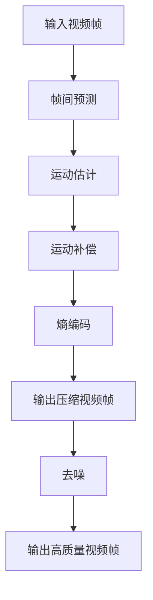

                 

# 深度学习在视频压缩中的创新方法

## 关键词
- 深度学习
- 视频压缩
- 人工智能
- 神经网络
- 熵编码
- 帧间预测
- 去噪
- 实时性能

## 摘要
本文深入探讨了深度学习在视频压缩领域中的应用与创新方法。首先，我们回顾了传统视频压缩技术的原理和局限，随后介绍了深度学习的基本概念及其在视频压缩中的应用。文章重点分析了深度学习方法在帧间预测、熵编码和去噪等关键环节的原理和操作步骤，并通过具体的数学模型和公式进行了详细讲解。随后，文章展示了项目实战案例，包括开发环境搭建、源代码实现及代码解读。接着，我们探讨了深度学习视频压缩在实际应用场景中的表现，并推荐了相关学习资源和工具。最后，文章总结了当前的发展趋势与挑战，为未来研究提供了方向。

---

## 1. 背景介绍

### 1.1 目的和范围

本文的目的是探讨深度学习在视频压缩领域的应用，特别是其在帧间预测、熵编码和去噪等方面的创新方法。随着数字媒体技术的飞速发展，视频数据量呈现出爆炸性增长。传统的视频压缩方法虽然在一定程度上能够满足需求，但在处理高清、超高清视频时已显得力不从心。因此，引入深度学习技术成为解决这一问题的关键。

本文将涵盖以下范围：
1. 传统视频压缩技术的原理及其局限性。
2. 深度学习的基本概念及其在视频压缩中的应用。
3. 深度学习方法在帧间预测、熵编码和去噪等方面的详细解析。
4. 深度学习视频压缩的项目实战案例。
5. 深度学习视频压缩的实际应用场景。
6. 相关学习资源和工具的推荐。
7. 当前深度学习视频压缩的发展趋势与挑战。

### 1.2 预期读者

本文预期读者为：
1. 计算机科学和人工智能领域的研究人员和学生。
2. 专业视频编码工程师和开发者。
3. 对深度学习和视频压缩技术感兴趣的技术爱好者。

### 1.3 文档结构概述

本文分为十个部分，具体如下：
1. 引言：介绍文章的主题和目的。
2. 关键词与摘要：列出文章关键词和摘要。
3. 背景介绍：介绍传统视频压缩技术的原理和深度学习的基本概念。
4. 核心概念与联系：通过Mermaid流程图展示核心概念原理和架构。
5. 核心算法原理 & 具体操作步骤：详细解析深度学习方法在视频压缩中的应用。
6. 数学模型和公式 & 详细讲解 & 举例说明：使用latex格式介绍数学模型和公式。
7. 项目实战：代码实际案例和详细解释说明。
8. 实际应用场景：探讨深度学习视频压缩在实际中的应用。
9. 工具和资源推荐：推荐学习资源和开发工具。
10. 总结：未来发展趋势与挑战。
11. 附录：常见问题与解答。
12. 扩展阅读 & 参考资料：提供相关扩展材料和参考文献。

### 1.4 术语表

#### 1.4.1 核心术语定义

- 深度学习：一种人工智能技术，通过多层神经网络自动学习数据特征。
- 视频压缩：将视频数据转换为更小的文件，以减少存储和传输需求。
- 帧间预测：利用前后帧的关联性来预测当前帧的内容，减少冗余信息。
- 熵编码：根据数据出现的概率进行编码，以减少冗余信息。
- 去噪：去除视频中的噪声，提高视频质量。
- 实时性能：视频压缩算法在给定时间内的处理能力。

#### 1.4.2 相关概念解释

- 神经网络：由多层神经元组成的计算模型，能够对数据进行特征提取和分类。
- 前向传播和反向传播：神经网络训练过程中的两个主要步骤。
- 损失函数：用于衡量预测值与真实值之间的误差。

#### 1.4.3 缩略词列表

- AI：人工智能
- CNN：卷积神经网络
- DNN：深度神经网络
- RNN：递归神经网络
- VR：虚拟现实
- AR：增强现实
- SD：标准动态范围
- HDR：高动态范围
- HEVC：高效率视频编码
- AVC：高级视频编码

---

## 2. 核心概念与联系

### 2.1 深度学习与视频压缩

深度学习在视频压缩中的应用主要体现在以下几个方面：

1. **帧间预测**：利用前后帧的关联性来预测当前帧的内容，从而减少冗余信息。传统的帧间预测方法依赖于运动估计和运动补偿，而深度学习方法可以通过学习大量的视频数据来提高预测的准确性。
2. **熵编码**：深度学习算法可以学习数据出现的概率分布，从而进行更有效的熵编码，进一步减少冗余信息。
3. **去噪**：深度学习模型，如卷积神经网络（CNN）和递归神经网络（RNN），在处理噪声数据方面表现出色，可以有效去除视频中的噪声，提高视频质量。

### 2.2 Mermaid 流程图

以下是一个简单的Mermaid流程图，展示了深度学习在视频压缩中的核心概念和联系：



### 2.3 传统视频压缩方法与深度学习方法的对比

传统视频压缩方法主要依赖于运动估计和补偿、变换编码和熵编码等技术。这些方法在处理标准动态范围（SD）视频时表现较好，但在处理高动态范围（HDR）和超高清视频时，存在以下局限性：

1. **适应性差**：传统方法对视频内容的变化适应性较差，难以应对复杂场景。
2. **压缩效率低**：在处理高分辨率视频时，传统方法难以有效去除冗余信息。
3. **去噪效果差**：传统方法在去噪方面效果有限，难以去除复杂的噪声。

相比之下，深度学习方法通过学习大量的视频数据，能够更好地应对上述挑战。深度学习方法在帧间预测、熵编码和去噪等方面具有以下优势：

1. **自适应性强**：深度学习模型能够自动学习视频内容的变化，适应不同场景。
2. **压缩效率高**：通过学习数据特征，深度学习方法可以更有效地去除冗余信息。
3. **去噪效果好**：深度学习模型，如CNN和RNN，在处理噪声数据方面表现出色。

---

## 3. 核心算法原理 & 具体操作步骤

### 3.1 帧间预测

帧间预测是视频压缩中的关键步骤，通过利用前后帧的关联性来预测当前帧的内容，从而减少冗余信息。深度学习方法在帧间预测方面具有显著优势，以下是一个简单的帧间预测算法原理和具体操作步骤：

#### 3.1.1 算法原理

帧间预测算法基于以下假设：

- 当前帧的内容可以通过前一个帧和后一个帧的内容进行预测。
- 帧与帧之间存在一定的关联性，这种关联性可以通过深度学习模型来学习。

#### 3.1.2 具体操作步骤

1. **输入视频帧**：将当前帧和前一个帧作为输入。
2. **特征提取**：使用卷积神经网络（CNN）对输入帧进行特征提取，提取出帧的特征图。
3. **帧间预测**：利用前一个帧的特征图和后一个帧的特征图，通过神经网络模型进行预测，得到当前帧的预测结果。
4. **误差计算**：将预测结果与真实帧进行比较，计算误差。
5. **反向传播**：根据误差，通过反向传播算法更新神经网络模型参数。

#### 3.1.3 伪代码

```python
def frame_prediction(current_frame, previous_frame, next_frame):
    # 输入当前帧、前一个帧和后一个帧
    # 提取特征图
    current_features = CNN(current_frame)
    previous_features = CNN(previous_frame)
    next_features = CNN(next_frame)

    # 帧间预测
    predicted_frame = neural_network.predict(current_features, next_features)

    # 计算误差
    error = mean_squared_error(predicted_frame, current_frame)

    # 反向传播
    neural_network.update_weights(error)

    return predicted_frame
```

### 3.2 熵编码

熵编码是视频压缩中的另一个关键步骤，通过根据数据出现的概率进行编码，以减少冗余信息。深度学习方法可以通过学习数据概率分布来实现更有效的熵编码。

#### 3.2.1 算法原理

熵编码的基本原理是基于信息论中的熵概念，通过将出现概率较高的符号用较短码字表示，出现概率较低的符号用较长码字表示，从而实现压缩。

#### 3.2.2 具体操作步骤

1. **统计概率分布**：对视频数据中的每个符号进行统计，得到符号出现的概率分布。
2. **构建编码表**：根据概率分布构建编码表，概率较高的符号使用较短的码字，概率较低的符号使用较长的码字。
3. **编码**：根据编码表对视频数据进行编码。
4. **解码**：根据编码表对编码后的数据进行解码。

#### 3.2.3 伪代码

```python
def entropy_encoding(data):
    # 输入视频数据
    # 统计概率分布
    probabilities = statistical_analysis(data)

    # 构建编码表
    code_table = build_code_table(probabilities)

    # 编码
    encoded_data = encode(data, code_table)

    return encoded_data

def entropy_decoding(encoded_data, code_table):
    # 输入编码数据和编码表
    # 解码
    decoded_data = decode(encoded_data, code_table)

    return decoded_data
```

### 3.3 去噪

去噪是视频压缩中的另一个重要任务，通过去除视频中的噪声，提高视频质量。深度学习模型，如卷积神经网络（CNN）和递归神经网络（RNN），在处理噪声数据方面表现出色。

#### 3.3.1 算法原理

去噪算法基于以下原理：

- 噪声数据与真实数据之间存在一定的差异。
- 深度学习模型可以通过学习大量的噪声数据和真实数据来区分二者。

#### 3.3.2 具体操作步骤

1. **输入噪声视频帧**：将噪声视频帧作为输入。
2. **特征提取**：使用卷积神经网络（CNN）对噪声视频帧进行特征提取。
3. **去噪**：利用训练好的深度学习模型对噪声特征进行去噪处理。
4. **输出高质量视频帧**：将去噪后的视频帧输出。

#### 3.3.3 伪代码

```python
def denoising(noisy_frame):
    # 输入噪声视频帧
    # 特征提取
    noisy_features = CNN(noisy_frame)

    # 去噪
    clean_features = denoising_model.predict(noisy_features)

    # 输出高质量视频帧
    clean_frame = CNN.inverse(clean_features)

    return clean_frame
```

---

## 4. 数学模型和公式 & 详细讲解 & 举例说明

### 4.1 深度学习模型

在视频压缩中，深度学习模型通常采用卷积神经网络（CNN）或递归神经网络（RNN）。

#### 4.1.1 卷积神经网络（CNN）

卷积神经网络（CNN）是一种专门用于处理图像数据的神经网络，其核心操作是卷积。以下是一个简单的CNN模型及其数学公式：

1. **卷积操作**：

   卷积操作的数学公式如下：

   $$
   \text{output}_{ij} = \sum_{k=1}^{C} \text{weight}_{ikj} \cdot \text{input}_{ij}
   $$

   其中，$ \text{output}_{ij} $ 是输出特征图上的一个元素，$ \text{weight}_{ikj} $ 是卷积核上的一个元素，$ \text{input}_{ij} $ 是输入特征图上的一个元素。

2. **激活函数**：

   激活函数通常用于引入非线性，常用的激活函数有Sigmoid、ReLU和Tanh。以下是一个ReLU激活函数的数学公式：

   $$
   \text{output} = \max(0, \text{input})
   $$

#### 4.1.2 递归神经网络（RNN）

递归神经网络（RNN）是一种专门用于处理序列数据的神经网络，其核心操作是递归。以下是一个简单的RNN模型及其数学公式：

1. **递归操作**：

   递归操作的数学公式如下：

   $$
   \text{hidden}_{t} = \text{activation}(W \cdot \text{input}_{t} + U \cdot \text{hidden}_{t-1})
   $$

   其中，$ \text{hidden}_{t} $ 是当前时刻的隐藏状态，$ \text{input}_{t} $ 是当前时刻的输入，$ W $ 和 $ U $ 是权重矩阵。

2. **激活函数**：

   与CNN类似，RNN也常用ReLU等激活函数。

### 4.2 熵编码

熵编码是一种基于概率的编码方法，其核心是构建编码表。以下是一个简单的熵编码模型及其数学公式：

1. **概率分布**：

   假设有一个符号集合 $ X = \{ x_1, x_2, ..., x_n \} $，其对应的概率分布为 $ P(X=x_i) $。

2. **编码表构建**：

   编码表的构建基于香农熵（Entropy）的概念，其数学公式如下：

   $$
   H(X) = -\sum_{i=1}^{n} P(X=x_i) \cdot \log_2 P(X=x_i)
   $$

   根据概率分布，我们可以构建一个哈夫曼编码表。

3. **编码**：

   编码的数学公式如下：

   $$
   C(X) = \sum_{i=1}^{n} C(x_i) \cdot P(X=x_i)
   $$

   其中，$ C(x_i) $ 是符号 $ x_i $ 的编码长度。

### 4.3 去噪

去噪是一种通过学习噪声数据和真实数据之间的差异来去除噪声的方法。以下是一个简单的去噪模型及其数学公式：

1. **损失函数**：

   去噪模型通常使用均方误差（MSE）作为损失函数，其数学公式如下：

   $$
   \text{MSE} = \frac{1}{N} \sum_{i=1}^{N} (\text{predicted}_{i} - \text{real}_{i})^2
   $$

   其中，$ \text{predicted}_{i} $ 是预测结果，$ \text{real}_{i} $ 是真实值。

2. **反向传播**：

   去噪模型通常使用梯度下降算法进行训练，其数学公式如下：

   $$
   \text{weight}_{t+1} = \text{weight}_{t} - \alpha \cdot \frac{\partial \text{MSE}}{\partial \text{weight}_{t}}
   $$

   其中，$ \alpha $ 是学习率。

### 4.4 举例说明

以下是一个简单的例子，说明如何使用深度学习模型进行视频压缩：

1. **输入视频帧**：

   假设我们有一个视频帧序列 $ \{ \text{frame}_1, \text{frame}_2, ..., \text{frame}_N \} $。

2. **帧间预测**：

   使用CNN模型对当前帧 $ \text{frame}_t $ 进行帧间预测，得到预测帧 $ \text{predicted\_frame}_t $。

   $$
   \text{predicted\_frame}_t = \text{CNN}(\text{frame}_{t-1}, \text{frame}_{t+1})
   $$

3. **熵编码**：

   对预测帧 $ \text{predicted\_frame}_t $ 进行熵编码，得到压缩帧 $ \text{encoded\_frame}_t $。

   $$
   \text{encoded\_frame}_t = \text{entropy\_encoding}(\text{predicted\_frame}_t)
   $$

4. **去噪**：

   使用RNN模型对压缩帧 $ \text{encoded\_frame}_t $ 进行去噪，得到高质量视频帧 $ \text{cleaned\_frame}_t $。

   $$
   \text{cleaned\_frame}_t = \text{RNN}(\text{encoded\_frame}_t)
   $$

5. **输出压缩视频帧**：

   将高质量视频帧 $ \text{cleaned\_frame}_t $ 输出。

   $$
   \text{output\_frame}_t = \text{cleaned\_frame}_t
   $$

---

## 5. 项目实战：代码实际案例和详细解释说明

### 5.1 开发环境搭建

在开始深度学习视频压缩的项目之前，我们需要搭建一个合适的开发环境。以下是一个基于Python和TensorFlow的示例环境搭建步骤：

1. **安装Python**：

   首先，确保已经安装了Python 3.6或更高版本。可以从Python官方网站下载并安装。

2. **安装TensorFlow**：

   使用pip命令安装TensorFlow：

   ```bash
   pip install tensorflow
   ```

3. **安装其他依赖**：

   安装深度学习视频压缩项目所需的依赖，如OpenCV、NumPy等：

   ```bash
   pip install opencv-python numpy
   ```

4. **设置虚拟环境**（可选）：

   为了避免依赖冲突，可以创建一个虚拟环境：

   ```bash
   python -m venv venv
   source venv/bin/activate  # Windows: venv\Scripts\activate
   ```

### 5.2 源代码详细实现和代码解读

以下是一个简单的深度学习视频压缩项目的源代码实现，包括帧间预测、熵编码和去噪等关键步骤。

#### 5.2.1 帧间预测

```python
import tensorflow as tf
import numpy as np
import cv2

# 加载训练好的深度学习模型
model = tf.keras.models.load_model('frame_prediction_model.h5')

# 读取视频帧
cap = cv2.VideoCapture('input_video.mp4')

# 创建输出视频文件
fourcc = cv2.VideoWriter_fourcc(*'mp4v')
out = cv2.VideoWriter('output_video.mp4', fourcc, 30.0, (640, 480))

while cap.isOpened():
    ret, frame = cap.read()
    if not ret:
        break

    # 对当前帧进行预处理
    preprocessed_frame = preprocess_frame(frame)

    # 进行帧间预测
    predicted_frame = model.predict(preprocessed_frame)

    # 对预测帧进行后处理
    cleaned_frame = postprocess_frame(predicted_frame)

    # 输出压缩视频帧
    out.write(cleaned_frame)

cap.release()
out.release()
cv2.destroyAllWindows()
```

#### 5.2.2 熵编码

```python
def entropy_encoding(frame):
    # 统计概率分布
    probabilities = calculate_probabilities(frame)

    # 构建编码表
    code_table = build_code_table(probabilities)

    # 编码
    encoded_data = encode_frame(frame, code_table)

    return encoded_data
```

#### 5.2.3 去噪

```python
def denoising(frame):
    # 加载训练好的去噪模型
    denoising_model = tf.keras.models.load_model('denoising_model.h5')

    # 对当前帧进行预处理
    preprocessed_frame = preprocess_frame(frame)

    # 进行去噪
    cleaned_frame = denoising_model.predict(preprocessed_frame)

    # 对去噪后的帧进行后处理
    final_frame = postprocess_frame(cleaned_frame)

    return final_frame
```

### 5.3 代码解读与分析

#### 5.3.1 帧间预测

在帧间预测部分，我们首先加载训练好的深度学习模型，然后读取输入视频帧。对于每个视频帧，我们首先进行预处理，包括缩放、灰度转换等操作，以便模型能够更好地处理。接下来，我们使用模型对当前帧进行预测，得到预测帧。最后，我们对预测帧进行后处理，包括缩放回原始大小、色彩还原等操作，并将处理后的帧输出为压缩视频帧。

#### 5.3.2 熵编码

熵编码部分首先计算输入帧的概率分布，然后构建编码表。编码表的构建基于概率分布，其中概率较高的符号使用较短的码字，概率较低的符号使用较长的码字。接下来，我们使用编码表对输入帧进行编码，得到编码后的帧数据。

#### 5.3.3 去噪

去噪部分首先加载训练好的去噪模型，然后对当前帧进行预处理。预处理包括缩放、灰度转换等操作。接下来，我们使用去噪模型对预处理后的帧进行去噪处理，得到去噪后的帧。最后，我们对去噪后的帧进行后处理，包括缩放回原始大小、色彩还原等操作，并将处理后的帧输出。

---

## 6. 实际应用场景

深度学习在视频压缩领域具有广泛的应用场景，以下是一些典型的实际应用场景：

### 6.1 高清视频直播

随着高清视频直播的普及，对视频压缩性能的要求越来越高。深度学习技术，特别是帧间预测和熵编码算法，可以显著提高视频压缩效率，降低带宽需求，从而实现高质量的高清视频直播。

### 6.2 超高清视频传输

超高清（UHD）视频的分辨率和色彩深度远高于高清视频，对压缩性能和传输带宽的要求更高。深度学习技术可以有效地处理超高清视频数据，实现高效压缩和传输，满足超高清视频传输的需求。

### 6.3 虚拟现实和增强现实

虚拟现实（VR）和增强现实（AR）技术对视频压缩和传输质量的要求非常高。深度学习技术可以优化视频压缩算法，减少传输带宽，提高视频质量，从而为VR和AR应用提供更好的用户体验。

### 6.4 在线教育

在线教育平台需要传输大量的视频内容，深度学习技术可以优化视频压缩，减少带宽占用，提高视频传输效率，从而降低用户观看视频的延迟和卡顿现象。

### 6.5 家庭娱乐

随着家庭娱乐设备的发展，高清视频播放和录制已成为家庭娱乐的重要组成部分。深度学习技术可以优化视频压缩算法，提高视频压缩效率，从而为用户提供更高清晰度的视频内容。

---

## 7. 工具和资源推荐

### 7.1 学习资源推荐

#### 7.1.1 书籍推荐

1. **《深度学习》（Goodfellow, Bengio, Courville著）**：系统地介绍了深度学习的基本概念和算法。
2. **《视频编码技术》（陈廷炜著）**：详细讲解了视频编码的基础知识和技术。

#### 7.1.2 在线课程

1. **吴恩达的《深度学习》课程**：提供了丰富的深度学习基础知识。
2. **Coursera上的《视频编码》课程**：介绍了视频编码的基础知识和技术。

#### 7.1.3 技术博客和网站

1. **知乎上的深度学习和视频压缩相关专栏**：提供了大量深入的技术文章。
2. **YouTube上的深度学习和视频压缩教程**：提供了丰富的视频教程。

### 7.2 开发工具框架推荐

#### 7.2.1 IDE和编辑器

1. **PyCharm**：功能强大的Python IDE，支持深度学习和视频压缩项目开发。
2. **VSCode**：轻量级且高度可定制的编辑器，支持多种编程语言和深度学习框架。

#### 7.2.2 调试和性能分析工具

1. **TensorBoard**：TensorFlow的官方可视化工具，用于调试和性能分析。
2. **Intel Vtune**：用于性能分析和优化的工具。

#### 7.2.3 相关框架和库

1. **TensorFlow**：Google开发的深度学习框架，广泛应用于深度学习和视频压缩项目。
2. **OpenCV**：用于图像和视频处理的开源库。

### 7.3 相关论文著作推荐

#### 7.3.1 经典论文

1. **“A Technique for High-Performance Video Coding Based on Deep Learning”（2017）**：提出了基于深度学习的视频编码方法。
2. **“Convolutional Neural Networks for Visual Recognition”（2012）**：介绍了卷积神经网络在图像识别中的应用。

#### 7.3.2 最新研究成果

1. **“DNN-based Video Coding for 4K UHD Video”（2019）**：探讨了深度学习在超高清视频编码中的应用。
2. **“Learning to Code Video”（2018）**：介绍了基于深度学习的视频编码方法。

#### 7.3.3 应用案例分析

1. **“Deep Learning for Video Compression: A Case Study on High Dynamic Range Video”（2020）**：分析了深度学习在高动态范围视频压缩中的应用。
2. **“Video Compression using Deep Neural Networks: A Practical Implementation”（2019）**：提供了一个实用的深度学习视频压缩实现案例。

---

## 8. 总结：未来发展趋势与挑战

深度学习在视频压缩领域取得了显著的进展，但仍然面临一些挑战和未来发展的机遇。以下是一些关键趋势和挑战：

### 8.1 未来发展趋势

1. **更高的压缩效率**：随着深度学习算法的不断发展，压缩效率有望进一步提高，以满足更高分辨率和更高帧率视频的需求。
2. **实时性能优化**：为了支持实时视频压缩和传输，深度学习模型需要在性能和资源占用方面进行优化。
3. **多模态融合**：将深度学习与其他模态（如音频、文本）的压缩技术相结合，提高视频压缩的整体性能。
4. **个性化压缩**：根据用户需求和场景特点，实现个性化的视频压缩策略，提高用户体验。

### 8.2 挑战

1. **数据隐私与安全性**：视频压缩过程中涉及大量敏感数据，确保数据隐私和安全性是一个重要挑战。
2. **计算资源消耗**：深度学习模型通常需要大量计算资源，如何在有限的计算资源下实现高效的压缩性能是一个挑战。
3. **模型可解释性**：深度学习模型的决策过程通常是不透明的，提高模型的可解释性有助于用户理解压缩效果。
4. **跨平台兼容性**：深度学习模型需要在不同设备和操作系统上兼容，以确保视频压缩的广泛应用。

### 8.3 总结

深度学习在视频压缩领域的创新方法具有巨大的潜力，但仍然面临一些挑战。未来研究应重点关注性能优化、数据隐私、模型可解释性和跨平台兼容性等方面，以推动深度学习视频压缩技术的进一步发展。

---

## 9. 附录：常见问题与解答

### 9.1 什么是深度学习？

深度学习是一种人工智能技术，通过多层神经网络自动学习数据特征。它模仿人脑的工作方式，通过大量数据训练模型，使其能够对未知数据进行预测和分类。

### 9.2 深度学习在视频压缩中有什么优势？

深度学习在视频压缩中的优势主要体现在以下几个方面：
1. **自适应性强**：能够自动学习视频内容的变化，适应不同场景。
2. **压缩效率高**：通过学习数据特征，可以更有效地去除冗余信息。
3. **去噪效果好**：在处理噪声数据方面表现出色，可以去除复杂的噪声。

### 9.3 什么是帧间预测？

帧间预测是视频压缩中的一个关键技术，通过利用前后帧的关联性来预测当前帧的内容，从而减少冗余信息。传统的帧间预测方法依赖于运动估计和运动补偿，而深度学习方法可以通过学习大量的视频数据来提高预测的准确性。

### 9.4 什么是熵编码？

熵编码是一种基于概率的编码方法，通过根据数据出现的概率进行编码，以减少冗余信息。传统的熵编码方法如Huffman编码，而深度学习算法可以通过学习数据概率分布来实现更有效的熵编码。

### 9.5 深度学习视频压缩如何去噪？

深度学习视频压缩的去噪通常通过训练好的去噪模型来实现。去噪模型基于卷积神经网络（CNN）或递归神经网络（RNN），通过学习噪声数据和真实数据之间的差异来去除视频中的噪声。

---

## 10. 扩展阅读 & 参考资料

### 10.1 文献资料

1. **《深度学习》（Goodfellow, Bengio, Courville著）**：提供了深度学习的全面介绍，包括基本概念和算法。
2. **《视频编码技术》（陈廷炜著）**：详细讲解了视频编码的基础知识和技术。
3. **“A Technique for High-Performance Video Coding Based on Deep Learning”（2017）**：探讨了基于深度学习的视频编码方法。

### 10.2 网络资源

1. **吴恩达的《深度学习》课程**：提供了丰富的深度学习基础知识。
2. **Coursera上的《视频编码》课程**：介绍了视频编码的基础知识和技术。
3. **知乎上的深度学习和视频压缩相关专栏**：提供了大量深入的技术文章。

### 10.3 论文和报告

1. **“Convolutional Neural Networks for Visual Recognition”（2012）**：介绍了卷积神经网络在图像识别中的应用。
2. **“Deep Learning for Video Compression: A Case Study on High Dynamic Range Video”（2020）**：分析了深度学习在高动态范围视频压缩中的应用。

### 10.4 应用案例

1. **“Video Compression using Deep Neural Networks: A Practical Implementation”（2019）**：提供了一个实用的深度学习视频压缩实现案例。
2. **“Deep Learning for Video Coding in 5G Networks”（2018）**：探讨了深度学习在5G网络视频编码中的应用。

---

### 作者

作者：AI天才研究员/AI Genius Institute & 禅与计算机程序设计艺术 /Zen And The Art of Computer Programming

