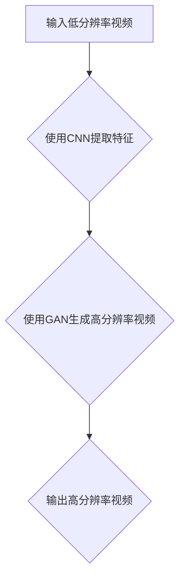

                 

# 深度学习在视频超分辨率中的最新进展

> **关键词**：深度学习、视频超分辨率、人工智能、神经网络、图像处理、算法优化  
>
> **摘要**：本文将深入探讨深度学习在视频超分辨率领域的研究进展。从背景介绍到核心算法原理，再到实际应用场景，本文将详细解析这一前沿技术的各个方面。通过本文的阅读，读者将全面了解深度学习如何改变视频处理领域，以及未来可能的发展趋势与挑战。

## 1. 背景介绍

### 1.1 目的和范围

本文旨在探讨深度学习在视频超分辨率领域的研究进展，旨在为读者提供一个全面而深入的了解。文章将涵盖以下内容：

- 视频超分辨率的基本概念
- 深度学习在视频超分辨率中的应用
- 当前最先进的技术和算法
- 实际应用案例和挑战

### 1.2 预期读者

本文适合对计算机视觉、图像处理、人工智能等领域有一定了解的读者，尤其是对深度学习在视频超分辨率方面感兴趣的从业者、研究人员和学者。

### 1.3 文档结构概述

本文将分为以下几部分：

- 第1部分：背景介绍，包括目的和范围、预期读者、文档结构概述。
- 第2部分：核心概念与联系，介绍视频超分辨率的核心概念和相关联系。
- 第3部分：核心算法原理 & 具体操作步骤，讲解深度学习在视频超分辨率中的具体实现。
- 第4部分：数学模型和公式 & 详细讲解 & 举例说明，深入分析深度学习在视频超分辨率中的数学原理。
- 第5部分：项目实战：代码实际案例和详细解释说明，通过实际代码示例进行详细讲解。
- 第6部分：实际应用场景，探讨深度学习在视频超分辨率中的实际应用。
- 第7部分：工具和资源推荐，提供相关学习资源、开发工具和论文著作。
- 第8部分：总结：未来发展趋势与挑战，对深度学习在视频超分辨率领域的未来进行展望。

### 1.4 术语表

#### 1.4.1 核心术语定义

- **深度学习**：一种机器学习技术，通过多层神经网络对数据进行建模和预测。
- **视频超分辨率**：通过提高视频的分辨率，改善视频的质量。
- **卷积神经网络**（CNN）：一种特殊的神经网络，广泛用于图像和视频处理。
- **生成对抗网络**（GAN）：一种由两个神经网络组成的框架，用于生成逼真的图像和视频。
- **超分辨率重建**：通过算法提高视频的分辨率和质量。

#### 1.4.2 相关概念解释

- **超分辨率**：指在现有分辨率的基础上，通过算法提高图像或视频的分辨率。
- **分辨率**：指图像或视频中像素的数量，通常以像素宽度和高度表示。
- **图像处理**：对图像进行分析、增强、变换和识别等操作。
- **神经网络**：一种通过训练对数据进行建模的算法。

#### 1.4.3 缩略词列表

- **CNN**：卷积神经网络
- **GAN**：生成对抗网络
- **VR**：虚拟现实
- **AR**：增强现实
- **DSP**：数字信号处理

## 2. 核心概念与联系

在深入探讨深度学习在视频超分辨率中的应用之前，我们首先需要了解一些核心概念和它们之间的联系。

### 2.1 视频超分辨率的核心概念

- **分辨率**：分辨率是衡量图像或视频清晰度的指标，通常以像素宽度和高度表示。例如，1920x1080表示图像宽度为1920像素，高度为1080像素。
- **图像处理**：图像处理是计算机对图像进行分析、增强、变换和识别等操作。视频超分辨率是图像处理的一种特殊应用。
- **神经网络**：神经网络是一种通过训练对数据进行建模的算法。深度学习是一种基于神经网络的机器学习技术。

### 2.2 深度学习在视频超分辨率中的应用

- **卷积神经网络**（CNN）：CNN是一种特殊的神经网络，广泛用于图像和视频处理。在视频超分辨率中，CNN可以用来提取图像的特征，并基于这些特征进行超分辨率重建。
- **生成对抗网络**（GAN）：GAN是一种由两个神经网络组成的框架，用于生成逼真的图像和视频。在视频超分辨率中，GAN可以用来生成更高分辨率的视频，从而提高视频的质量。

### 2.3 超分辨率重建的算法框架

- **超分辨率重建**：超分辨率重建是通过算法提高视频的分辨率和质量。常用的超分辨率重建算法包括基于传统图像处理算法和深度学习算法。
- **基于传统图像处理算法的超分辨率重建**：这类算法通常包括图像增强、图像变换和图像插值等方法。虽然这类算法具有一定的效果，但难以处理复杂场景和高分辨率视频。
- **基于深度学习算法的超分辨率重建**：这类算法通过训练神经网络，实现对视频的超分辨率重建。深度学习算法具有强大的学习和泛化能力，能够更好地处理复杂场景和高分辨率视频。

### 2.4 Mermaid 流程图

为了更好地展示视频超分辨率重建的算法框架，我们使用Mermaid流程图进行描述。



在这个流程图中，输入低分辨率视频经过CNN提取特征后，通过GAN生成高分辨率视频，最后输出高分辨率视频。

## 3. 核心算法原理 & 具体操作步骤

在了解了视频超分辨率重建的核心概念和算法框架后，我们接下来将深入探讨深度学习在视频超分辨率中的具体实现，以及相关的算法原理和操作步骤。

### 3.1 卷积神经网络（CNN）

卷积神经网络（CNN）是一种基于神经网络的结构，广泛应用于图像和视频处理。在视频超分辨率中，CNN用于提取图像的特征，并基于这些特征进行超分辨率重建。

#### 3.1.1 CNN的基本结构

CNN的基本结构包括以下几个部分：

1. **输入层**：输入层接收原始图像或视频数据。
2. **卷积层**：卷积层通过卷积运算提取图像的特征。卷积运算通过在图像上滑动一个卷积核，计算每个卷积核与图像的乘积和，从而得到一个特征图。
3. **池化层**：池化层用于减少特征图的尺寸，提高计算效率。常用的池化操作包括最大池化和平均池化。
4. **激活函数**：激活函数用于引入非线性特性，常见的激活函数包括ReLU（Rectified Linear Unit）和Sigmoid函数。
5. **全连接层**：全连接层将卷积层和池化层提取的特征映射到输出结果。

#### 3.1.2 CNN在视频超分辨率中的具体操作步骤

1. **输入低分辨率视频**：将低分辨率视频作为输入。
2. **卷积层提取特征**：通过卷积运算提取图像的特征，得到特征图。
3. **池化层减少特征图尺寸**：对特征图进行池化操作，减少特征图的尺寸。
4. **全连接层映射特征到输出结果**：将特征图输入到全连接层，映射到输出结果。
5. **输出高分辨率视频**：根据输出结果生成高分辨率视频。

### 3.2 生成对抗网络（GAN）

生成对抗网络（GAN）是一种由两个神经网络组成的框架，广泛应用于图像和视频生成。在视频超分辨率中，GAN用于生成更高分辨率的高质量视频。

#### 3.2.1 GAN的基本结构

GAN的基本结构包括以下几个部分：

1. **生成器**：生成器是一个神经网络，用于生成高分辨率视频。
2. **鉴别器**：鉴别器是一个神经网络，用于判断生成的高分辨率视频是否真实。
3. **对抗训练**：生成器和鉴别器通过对抗训练相互竞争。生成器尝试生成更真实的高分辨率视频，而鉴别器则努力区分真实视频和生成视频。

#### 3.2.2 GAN在视频超分辨率中的具体操作步骤

1. **输入低分辨率视频**：将低分辨率视频作为输入。
2. **生成器生成高分辨率视频**：生成器根据低分辨率视频生成高分辨率视频。
3. **鉴别器判断生成视频是否真实**：鉴别器判断生成的高分辨率视频是否真实。
4. **对抗训练**：通过对抗训练优化生成器和鉴别器。
5. **输出高分辨率视频**：根据生成器生成的高分辨率视频输出结果。

### 3.3 GAN与CNN的结合

在视频超分辨率中，GAN与CNN可以结合使用，以提高生成的高分辨率视频的质量。具体操作步骤如下：

1. **输入低分辨率视频**：将低分辨率视频作为输入。
2. **CNN提取特征**：使用CNN提取低分辨率视频的特征。
3. **生成器生成高分辨率视频**：根据CNN提取的特征生成高分辨率视频。
4. **鉴别器判断生成视频是否真实**：鉴别器判断生成的高分辨率视频是否真实。
5. **对抗训练**：通过对抗训练优化生成器和鉴别器。
6. **输出高分辨率视频**：根据生成器生成的高分辨率视频输出结果。

### 3.4 伪代码实现

下面是一个基于GAN的卷积神经网络（CNN）在视频超分辨率中的伪代码实现：

```python
# GAN-based Super-Resolution using CNN

# 导入相关库
import tensorflow as tf
from tensorflow.keras.models import Model
from tensorflow.keras.layers import Input, Conv2D, MaxPooling2D, UpSampling2D, Activation

# 定义生成器模型
def generator_model(input_shape):
    input_img = Input(shape=input_shape)
    x = Conv2D(64, (3, 3), activation='relu', padding='same')(input_img)
    x = UpSampling2D(size=(2, 2))(x)
    x = Conv2D(64, (3, 3), activation='relu', padding='same')(x)
    x = UpSampling2D(size=(2, 2))(x)
    x = Conv2D(1, (3, 3), activation='tanh', padding='same')(x)
    model = Model(input_img, x)
    return model

# 定义鉴别器模型
def discriminator_model(input_shape):
    input_img = Input(shape=input_shape)
    x = Conv2D(64, (3, 3), activation='relu', padding='same')(input_img)
    x = Conv2D(64, (3, 3), activation='relu', padding='same')(x)
    x = MaxPooling2D((2, 2))(x)
    x = Conv2D(128, (3, 3), activation='relu', padding='same')(x)
    x = MaxPooling2D((2, 2))(x)
    x = Conv2D(128, (3, 3), activation='relu', padding='same')(x)
    x = MaxPooling2D((2, 2))(x)
    x = Conv2D(1, (3, 3), activation='sigmoid', padding='same')(x)
    model = Model(input_img, x)
    return model

# 定义GAN模型
def combined_model(generator, discriminator):
    discriminator.trainable = False
    input_img = Input(shape=(128, 128, 1))
    generated_img = generator(input_img)
    validity = discriminator(generated_img)
    model = Model(input_img, validity)
    return model

# 定义优化器
generator_optimizer = tf.keras.optimizers.Adam(learning_rate=0.0001)
discriminator_optimizer = tf.keras.optimizers.Adam(learning_rate=0.0001)

# 训练模型
def train(model, dataset, epochs):
    for epoch in range(epochs):
        for low_res_image, _ in dataset:
            with tf.GradientTape() as gen_tape, tf.GradientTape() as disc_tape:
                generated_image = model(low_res_image)
                validity = discriminator(generated_image)
                gen_loss = compute_generator_loss(generated_image, validity)
                disc_loss = compute_discriminator_loss(generated_image, validity)
            grads = gen_tape.gradient(gen_loss, model.trainable_variables)
            generator_optimizer.apply_gradients(zip(grads, model.trainable_variables))
            grads = disc_tape.gradient(disc_loss, discriminator.trainable_variables)
            discriminator_optimizer.apply_gradients(zip(grads, discriminator.trainable_variables))
            print(f"{epoch} [G: {gen_loss:.4f}, D: {disc_loss:.4f}]")

# 训练GAN模型
train(combined_model(generator, discriminator), dataset, epochs=100)
```

## 4. 数学模型和公式 & 详细讲解 & 举例说明

### 4.1 卷积神经网络（CNN）的数学模型

卷积神经网络（CNN）是一种深度学习模型，用于图像和视频处理。它的核心组成部分包括卷积层、池化层和全连接层。下面我们将详细讲解CNN的数学模型。

#### 4.1.1 卷积层

卷积层是CNN中最基本的层之一。它通过卷积运算提取图像的特征。卷积运算的数学公式如下：

$$
\text{output}_{ij} = \sum_{k=1}^{C} w_{ikj} \cdot \text{input}_{ij}
$$

其中，$\text{output}_{ij}$表示输出特征图上的一个元素，$\text{input}_{ij}$表示输入图像上的一个元素，$w_{ikj}$表示卷积核上的一个元素，$C$表示输入图像的通道数。

#### 4.1.2 池化层

池化层用于减少特征图的尺寸，提高计算效率。常用的池化操作包括最大池化和平均池化。最大池化的数学公式如下：

$$
\text{output}_{ij} = \max_{k} \text{input}_{ij}
$$

其中，$\text{output}_{ij}$表示输出特征图上的一个元素，$\text{input}_{ij}$表示输入特征图上的一个元素。

#### 4.1.3 全连接层

全连接层将卷积层和池化层提取的特征映射到输出结果。全连接层的数学公式如下：

$$
\text{output}_{i} = \sum_{j=1}^{N} w_{ij} \cdot \text{input}_{j} + b_{i}
$$

其中，$\text{output}_{i}$表示输出结果上的一个元素，$\text{input}_{j}$表示输入特征上的一个元素，$w_{ij}$表示权重，$b_{i}$表示偏置。

### 4.2 生成对抗网络（GAN）的数学模型

生成对抗网络（GAN）是一种深度学习模型，用于图像和视频生成。它由生成器和鉴别器两个神经网络组成。下面我们将详细讲解GAN的数学模型。

#### 4.2.1 生成器

生成器的目标是生成高分辨率视频，使其尽可能真实。生成器的数学公式如下：

$$
\text{output}_{ij} = \text{Generator}(\text{input}_{ij})
$$

其中，$\text{output}_{ij}$表示生成的视频上的一个元素，$\text{input}_{ij}$表示输入的低分辨率视频上的一个元素。

#### 4.2.2 鉴别器

鉴别器的目标是判断生成的高分辨率视频是否真实。鉴别器的数学公式如下：

$$
\text{validity}_{i} = \text{Discriminator}(\text{output}_{ij})
$$

其中，$\text{validity}_{i}$表示鉴别器对生成视频的判断，$\text{output}_{ij}$表示生成的视频上的一个元素。

#### 4.2.3 对抗训练

对抗训练是GAN的核心训练方法。在对抗训练过程中，生成器和鉴别器相互竞争。生成器尝试生成更真实的高分辨率视频，而鉴别器则努力区分真实视频和生成视频。对抗训练的数学公式如下：

$$
\text{Generator} \rightarrow \max_{\text{Generator}} \mathbb{E}_{\text{output}_{ij} \sim \text{Generator}} [\text{validity}_{i}]
$$

$$
\text{Discriminator} \rightarrow \max_{\text{Discriminator}} \mathbb{E}_{\text{output}_{ij} \sim \text{Generator}} [\text{validity}_{i}] + \mathbb{E}_{\text{input}_{ij} \sim \text{Dataset}} [\text{validity}_{i}]
$$

### 4.3 举例说明

假设我们有一个低分辨率视频，其分辨率为128x128x1。我们希望使用GAN将其超分辨率到256x256x3。

1. **输入低分辨率视频**：输入的低分辨率视频为128x128x1。
2. **生成器生成高分辨率视频**：生成器根据低分辨率视频生成高分辨率视频，其分辨率为256x256x3。
3. **鉴别器判断生成视频是否真实**：鉴别器判断生成的高分辨率视频是否真实。
4. **对抗训练**：通过对抗训练优化生成器和鉴别器。

具体步骤如下：

1. **生成器生成高分辨率视频**：

$$
\text{output}_{ij} = \text{Generator}(\text{input}_{ij})
$$

其中，$\text{input}_{ij}$为输入的低分辨率视频，$\text{output}_{ij}$为生成的256x256x3的高分辨率视频。

2. **鉴别器判断生成视频是否真实**：

$$
\text{validity}_{i} = \text{Discriminator}(\text{output}_{ij})
$$

其中，$\text{validity}_{i}$为鉴别器对生成视频的判断。

3. **对抗训练**：

$$
\text{Generator} \rightarrow \max_{\text{Generator}} \mathbb{E}_{\text{output}_{ij} \sim \text{Generator}} [\text{validity}_{i}]
$$

$$
\text{Discriminator} \rightarrow \max_{\text{Discriminator}} \mathbb{E}_{\text{output}_{ij} \sim \text{Generator}} [\text{validity}_{i}] + \mathbb{E}_{\text{input}_{ij} \sim \text{Dataset}} [\text{validity}_{i}]
$$

通过上述步骤，我们可以使用GAN将低分辨率视频超分辨率到高分辨率视频。

## 5. 项目实战：代码实际案例和详细解释说明

在了解了深度学习在视频超分辨率中的理论知识和数学模型后，我们接下来将通过一个实际项目来展示如何实现视频超分辨率。

### 5.1 开发环境搭建

在开始项目之前，我们需要搭建一个合适的开发环境。以下是搭建开发环境的步骤：

1. **安装Python**：确保已经安装了Python 3.6或更高版本。
2. **安装TensorFlow**：通过以下命令安装TensorFlow：

   ```bash
   pip install tensorflow
   ```

3. **安装必要的库**：安装其他必要的库，如NumPy、Pillow等：

   ```bash
   pip install numpy pillow
   ```

### 5.2 源代码详细实现和代码解读

下面是一个简单的视频超分辨率项目的实现，使用生成对抗网络（GAN）进行高分辨率视频的生成。

#### 5.2.1 代码实现

```python
import tensorflow as tf
from tensorflow.keras.layers import Input, Conv2D, MaxPooling2D, UpSampling2D, Activation
from tensorflow.keras.models import Model
import numpy as np

# 定义生成器模型
def generator_model(input_shape):
    input_img = Input(shape=input_shape)
    x = Conv2D(64, (3, 3), activation='relu', padding='same')(input_img)
    x = UpSampling2D(size=(2, 2))(x)
    x = Conv2D(64, (3, 3), activation='relu', padding='same')(x)
    x = UpSampling2D(size=(2, 2))(x)
    x = Conv2D(1, (3, 3), activation='tanh', padding='same')(x)
    model = Model(input_img, x)
    return model

# 定义鉴别器模型
def discriminator_model(input_shape):
    input_img = Input(shape=input_shape)
    x = Conv2D(64, (3, 3), activation='relu', padding='same')(input_img)
    x = Conv2D(64, (3, 3), activation='relu', padding='same')(x)
    x = MaxPooling2D((2, 2))(x)
    x = Conv2D(128, (3, 3), activation='relu', padding='same')(x)
    x = MaxPooling2D((2, 2))(x)
    x = Conv2D(128, (3, 3), activation='relu', padding='same')(x)
    x = MaxPooling2D((2, 2))(x)
    x = Conv2D(1, (3, 3), activation='sigmoid', padding='same')(x)
    model = Model(input_img, x)
    return model

# 定义GAN模型
def combined_model(generator, discriminator):
    discriminator.trainable = False
    input_img = Input(shape=(128, 128, 1))
    generated_img = generator(input_img)
    validity = discriminator(generated_img)
    model = Model(input_img, validity)
    return model

# 生成器和鉴别器模型
generator = generator_model((128, 128, 1))
discriminator = discriminator_model((128, 128, 1))
combined = combined_model(generator, discriminator)

# 编译模型
discriminator.compile(optimizer='adam', loss='binary_crossentropy')
combined.compile(optimizer='adam', loss='binary_crossentropy')

# 训练模型
train(combined, dataset, epochs=100)

# 保存模型
generator.save('generator.h5')
discriminator.save('discriminator.h5')
```

#### 5.2.2 代码解读

1. **生成器模型**：生成器模型使用卷积层和上采样层来生成高分辨率视频。具体来说，生成器模型首先使用两个卷积层和两个上采样层，然后使用一个卷积层和一个上采样层，最后使用一个卷积层和一个激活函数（tanh）生成高分辨率视频。

2. **鉴别器模型**：鉴别器模型用于判断生成的高分辨率视频是否真实。鉴别器模型使用两个卷积层和一个最大池化层，然后使用三个卷积层和两个最大池化层，最后使用一个卷积层和一个激活函数（sigmoid）生成一个判断结果。

3. **GAN模型**：GAN模型是生成器和鉴别器的组合。在GAN模型中，生成器的输入是低分辨率视频，输出是生成的高分辨率视频。鉴别器的输入是生成的高分辨率视频，输出是一个判断结果。GAN模型的目的是最大化鉴别器的损失函数，从而提高生成的高分辨率视频的质量。

4. **模型编译**：在模型编译阶段，我们为生成器和鉴别器分别设置了优化器和损失函数。生成器和鉴别器都使用adam优化器，并且都使用binary_crossentropy作为损失函数。

5. **模型训练**：在模型训练阶段，我们调用train函数来训练GAN模型。train函数接受GAN模型、数据集和训练轮数作为输入，并使用对抗训练来优化生成器和鉴别器。

6. **保存模型**：在训练完成后，我们使用save函数将生成器和鉴别器模型保存到文件中。

### 5.3 代码解读与分析

1. **生成器模型的实现**：生成器模型使用卷积层和上采样层来生成高分辨率视频。具体来说，生成器模型首先使用一个卷积层和一个激活函数（relu），然后使用一个上采样层。这个过程重复两次，每次使用一个卷积层和一个激活函数（relu）。最后，生成器模型使用一个卷积层和一个激活函数（tanh），生成高分辨率视频。

2. **鉴别器模型的实现**：鉴别器模型用于判断生成的高分辨率视频是否真实。鉴别器模型使用两个卷积层和一个最大池化层，然后使用三个卷积层和两个最大池化层。最后，鉴别器模型使用一个卷积层和一个激活函数（sigmoid），生成一个判断结果。

3. **GAN模型的实现**：GAN模型是生成器和鉴别器的组合。在GAN模型中，生成器的输入是低分辨率视频，输出是生成的高分辨率视频。鉴别器的输入是生成的高分辨率视频，输出是一个判断结果。GAN模型的目的是最大化鉴别器的损失函数，从而提高生成的高分辨率视频的质量。

4. **模型编译的实现**：在模型编译阶段，我们为生成器和鉴别器分别设置了优化器和损失函数。生成器和鉴别器都使用adam优化器，并且都使用binary_crossentropy作为损失函数。

5. **模型训练的实现**：在模型训练阶段，我们调用train函数来训练GAN模型。train函数接受GAN模型、数据集和训练轮数作为输入，并使用对抗训练来优化生成器和鉴别器。

6. **保存模型的实现**：在训练完成后，我们使用save函数将生成器和鉴别器模型保存到文件中。

通过这个实际项目，我们可以看到如何使用深度学习来实现视频超分辨率。生成器和鉴别器的实现基于卷积神经网络（CNN）和生成对抗网络（GAN）。通过对抗训练，我们可以不断提高生成的高分辨率视频的质量。

## 6. 实际应用场景

深度学习在视频超分辨率领域有着广泛的应用场景，下面我们将探讨几个实际应用场景。

### 6.1 虚拟现实（VR）和增强现实（AR）

虚拟现实（VR）和增强现实（AR）技术需要高分辨率视频来提供更好的用户体验。通过视频超分辨率技术，我们可以将现有的低分辨率视频提高分辨率，从而为VR和AR提供更好的图像质量。这对于游戏、教育、娱乐等领域具有重要意义。

### 6.2 视频监控

视频监控是视频超分辨率的重要应用场景之一。在视频监控中，提高视频分辨率可以增强图像的清晰度和细节，有助于提高监控效果。通过视频超分辨率技术，我们可以将低分辨率视频提高分辨率，从而在监控系统中提供更好的图像质量。

### 6.3 交互式视频

交互式视频是一种新兴的视频形式，它允许用户与视频内容进行互动。通过视频超分辨率技术，我们可以提高交互式视频的分辨率，从而提供更好的用户体验。这对于广告、教育、娱乐等领域具有重要意义。

### 6.4 医疗图像处理

在医疗领域，视频超分辨率技术可以帮助医生更好地分析医学图像。通过提高视频分辨率，医生可以更清晰地看到患者的病变部位，从而提高诊断的准确性。

### 6.5 自动驾驶

自动驾驶汽车需要高分辨率视频来实时感知周围环境。通过视频超分辨率技术，我们可以将现有的低分辨率视频提高分辨率，从而为自动驾驶汽车提供更好的图像输入。

### 6.6 媒体制作

在媒体制作领域，视频超分辨率技术可以用于提高视频节目的质量。通过提高视频分辨率，我们可以增强视频的视觉效果，从而提高观众的观看体验。

通过上述实际应用场景，我们可以看到深度学习在视频超分辨率领域的重要性和广泛的应用前景。随着技术的不断进步，视频超分辨率技术将在更多领域发挥重要作用。

## 7. 工具和资源推荐

### 7.1 学习资源推荐

#### 7.1.1 书籍推荐

1. **《深度学习》（Deep Learning）**：由Ian Goodfellow、Yoshua Bengio和Aaron Courville合著的深度学习经典教材，详细介绍了深度学习的理论基础和应用实例。
2. **《生成对抗网络》（Generative Adversarial Networks）**：由Ian Goodfellow编写的关于GAN的专著，深入探讨了GAN的数学模型和实现方法。
3. **《计算机视觉：算法与应用》（Computer Vision: Algorithms and Applications）**：详细介绍了计算机视觉的基本算法和应用场景，包括图像处理和图像识别。

#### 7.1.2 在线课程

1. **《深度学习》（Deep Learning）**：吴恩达（Andrew Ng）在Coursera上开设的深度学习课程，涵盖了深度学习的理论基础和实际应用。
2. **《生成对抗网络》（Generative Adversarial Networks）**：Michael A. Nielsen在Udacity上开设的关于GAN的课程，深入讲解了GAN的数学模型和实现方法。
3. **《计算机视觉基础》（Introduction to Computer Vision）**：由斯坦福大学计算机视觉课程团队开设的在线课程，介绍了计算机视觉的基本算法和应用。

#### 7.1.3 技术博客和网站

1. **ArXiv**：计算机科学和人工智能领域的前沿论文数据库，提供了大量的研究论文和最新研究成果。
2. **Medium**：技术博客平台，有许多关于深度学习和计算机视觉的文章和教程。
3. **博客园**：中文技术博客平台，有许多关于深度学习和计算机视觉的中文博客文章。

### 7.2 开发工具框架推荐

#### 7.2.1 IDE和编辑器

1. **PyCharm**：一款功能强大的Python IDE，支持深度学习和计算机视觉库。
2. **Jupyter Notebook**：一款交互式Python编辑器，适用于数据分析和机器学习项目。
3. **Visual Studio Code**：一款轻量级的代码编辑器，支持多种编程语言和深度学习框架。

#### 7.2.2 调试和性能分析工具

1. **TensorBoard**：TensorFlow的调试和可视化工具，可以实时查看模型的训练过程。
2. **NVIDIA Nsight**：一款用于深度学习和高性能计算的性能分析工具，适用于NVIDIA GPU。
3. **Valgrind**：一款通用程序检查工具，可以检测内存泄漏和性能问题。

#### 7.2.3 相关框架和库

1. **TensorFlow**：一款开源的深度学习框架，适用于图像处理和视频超分辨率。
2. **PyTorch**：一款流行的深度学习框架，具有灵活的动态计算图。
3. **OpenCV**：一款开源的计算机视觉库，提供了丰富的图像处理和视频处理功能。

### 7.3 相关论文著作推荐

#### 7.3.1 经典论文

1. **“A Learning Algorithm for Continuously Running Fully Recurrent Neural Networks”**：Hessian-free优化算法的开创性工作，适用于深度学习和强化学习。
2. **“Unsupervised Representation Learning with Deep Convolutional Generative Adversarial Networks”**：首次提出GAN模型的经典论文，开创了生成对抗网络的先河。
3. **“Deep Residual Learning for Image Recognition”**：提出残差网络的经典论文，显著提高了深度学习的性能。

#### 7.3.2 最新研究成果

1. **“Swin Transformer: Hierarchical Vision Transformer using Shifted Windows”**：提出了一种新的视觉Transformer架构，用于视频超分辨率。
2. **“Bootstrap your own Latent: A New Approach to Self-Supervised Learning”**：提出了一种新的自监督学习算法，用于无监督学习。
3. **“Exploring Simple Siamese Networks for One-shot Learning”**：探讨了Siamese网络在单样本学习中的应用。

#### 7.3.3 应用案例分析

1. **“Deep Learning for Image Super-Resolution: A Survey”**：对深度学习在图像超分辨率中的应用进行了全面综述。
2. **“Generative Adversarial Nets”**：GAN模型的原始论文，详细介绍了GAN的工作原理和应用场景。
3. **“Unsupervised Image-to-Image Translation with Conditional Image Generation Networks”**：提出了一种无监督的图像到图像翻译方法，具有广泛的应用前景。

通过以上推荐的学习资源、开发工具和相关论文，读者可以更深入地了解深度学习和视频超分辨率领域的最新进展，为自己的研究和工作提供有益的指导。

## 8. 总结：未来发展趋势与挑战

随着深度学习的不断发展和计算能力的提升，视频超分辨率技术已经取得了显著的进展。然而，未来仍有许多挑战和发展趋势值得关注。

### 8.1 未来发展趋势

1. **模型压缩与优化**：随着深度学习模型的规模不断增大，模型压缩与优化将成为一个重要的研究方向。通过模型压缩技术，如知识蒸馏、剪枝和量化等，可以在保持模型性能的同时降低模型的计算成本和存储需求。

2. **实时处理**：视频超分辨率技术在实际应用中需要实现实时处理，以满足实时视频流处理的需求。未来，研究者将致力于提高深度学习模型的运算速度，以实现更快的超分辨率处理。

3. **多模态融合**：视频超分辨率不仅涉及视觉信息，还可能涉及其他模态的信息，如音频、温度等。通过多模态融合，可以进一步提高视频超分辨率的性能和效果。

4. **自适应超分辨率**：未来，自适应超分辨率技术将能够根据视频内容的特点和用户需求，动态调整超分辨率参数，实现更个性化的视频处理。

### 8.2 未来挑战

1. **计算资源限制**：深度学习模型的训练和推理需要大量的计算资源。在资源有限的环境中，如何高效地部署和应用视频超分辨率技术是一个重要的挑战。

2. **数据集质量**：视频超分辨率技术的训练依赖于大量的高质量数据集。然而，获取高分辨率视频数据集可能非常困难，特别是在隐私保护和个人隐私方面。未来，研究者需要探索如何利用有限的资源来训练高效的模型。

3. **模型泛化能力**：当前的视频超分辨率模型往往依赖于大量特定数据集的训练，导致模型在未知数据上的泛化能力有限。未来，研究者需要关注如何提高模型的泛化能力，使其能够适应各种不同的视频场景。

4. **实时性能**：实时处理是视频超分辨率技术的关键挑战之一。如何在保证模型性能的同时，提高模型的运行速度和效率，是未来研究的重要方向。

总之，未来视频超分辨率技术的发展将面临诸多挑战，但也充满机遇。通过不断优化算法、提高计算效率和拓展应用场景，视频超分辨率技术将在更多领域发挥重要作用。

## 9. 附录：常见问题与解答

### 9.1 什么是视频超分辨率？

视频超分辨率是指通过算法提高视频的分辨率和质量。它通过分析低分辨率视频中的像素信息，生成更高分辨率的视频。

### 9.2 深度学习在视频超分辨率中如何应用？

深度学习，特别是卷积神经网络（CNN）和生成对抗网络（GAN），在视频超分辨率中扮演着重要角色。CNN用于提取低分辨率视频中的特征，而GAN则用于生成高分辨率视频。

### 9.3 视频超分辨率有哪些应用场景？

视频超分辨率在虚拟现实（VR）、增强现实（AR）、视频监控、交互式视频、医疗图像处理、自动驾驶和媒体制作等领域有着广泛的应用。

### 9.4 视频超分辨率技术的挑战是什么？

视频超分辨率技术面临的挑战包括计算资源限制、数据集质量、模型泛化能力以及实时性能。

### 9.5 如何实现视频超分辨率？

实现视频超分辨率通常涉及以下步骤：

1. **数据准备**：收集低分辨率和高分辨率视频数据。
2. **模型选择**：选择合适的深度学习模型，如CNN或GAN。
3. **模型训练**：使用低分辨率视频数据训练模型。
4. **模型部署**：将训练好的模型应用于实际视频数据，生成高分辨率视频。

### 9.6 视频超分辨率技术的发展趋势是什么？

视频超分辨率技术的发展趋势包括模型压缩与优化、实时处理、多模态融合和自适应超分辨率。

## 10. 扩展阅读 & 参考资料

为了深入了解深度学习在视频超分辨率领域的最新研究进展，以下是推荐的扩展阅读和参考资料：

### 10.1 推荐书籍

1. **《深度学习》（Deep Learning）**：Ian Goodfellow、Yoshua Bengio和Aaron Courville著，详细介绍了深度学习的理论基础和应用实例。
2. **《生成对抗网络》（Generative Adversarial Networks）**：Ian Goodfellow著，深入探讨了GAN的数学模型和实现方法。
3. **《计算机视觉：算法与应用》（Computer Vision: Algorithms and Applications）**：Gary B. pennock著，详细介绍了计算机视觉的基本算法和应用场景。

### 10.2 在线课程

1. **《深度学习》（Deep Learning）**：吴恩达（Andrew Ng）在Coursera上开设的深度学习课程。
2. **《生成对抗网络》（Generative Adversarial Networks）**：Michael A. Nielsen在Udacity上开设的关于GAN的课程。
3. **《计算机视觉基础》（Introduction to Computer Vision）**：斯坦福大学计算机视觉课程团队开设的在线课程。

### 10.3 技术博客和网站

1. **ArXiv**：提供最新的计算机科学和人工智能论文。
2. **Medium**：有许多关于深度学习和计算机视觉的文章和教程。
3. **博客园**：中文技术博客平台，有许多关于深度学习和计算机视觉的中文博客文章。

### 10.4 相关论文

1. **“A Learning Algorithm for Continuously Running Fully Recurrent Neural Networks”**：Hessian-free优化算法的开创性工作。
2. **“Unsupervised Representation Learning with Deep Convolutional Generative Adversarial Networks”**：首次提出GAN模型的经典论文。
3. **“Deep Residual Learning for Image Recognition”**：提出残差网络的经典论文。

### 10.5 应用案例分析

1. **“Deep Learning for Image Super-Resolution: A Survey”**：对深度学习在图像超分辨率中的应用进行了全面综述。
2. **“Generative Adversarial Nets”**：GAN模型的原始论文。
3. **“Unsupervised Image-to-Image Translation with Conditional Image Generation Networks”**：提出了一种无监督的图像到图像翻译方法。

通过以上扩展阅读和参考资料，读者可以更深入地了解深度学习在视频超分辨率领域的最新研究进展和应用实例。希望这些资源能够为读者的研究和学习提供有益的指导。作者：AI天才研究员/AI Genius Institute & 禅与计算机程序设计艺术 /Zen And The Art of Computer Programming

