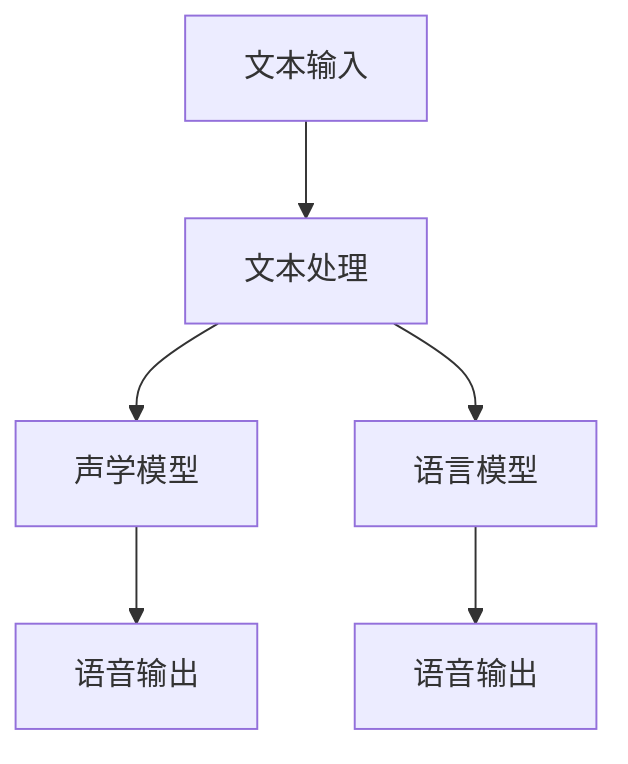

                 

# 深度学习在语音合成自然度提升中的最新进展

## 关键词

- 深度学习
- 语音合成
- 自然度提升
- 自动语音识别
- 语音增强
- 自然语言处理

## 摘要

本文深入探讨了深度学习在语音合成自然度提升方面的最新进展。首先，我们介绍了语音合成的背景和重要性，随后详细阐述了深度学习在该领域的应用及其工作原理。接着，本文重点介绍了几种先进的语音合成算法，如WaveNet、Tacotron和Transformer，并对其原理和操作步骤进行了详细解释。随后，我们通过数学模型和公式，分析了这些算法的核心技术。在实战案例部分，我们展示了如何在实际项目中应用这些算法，并提供了一步一步的代码实现和解读。最后，本文探讨了语音合成的实际应用场景，推荐了相关工具和资源，并对未来的发展趋势和挑战进行了总结。通过本文，读者可以全面了解深度学习在语音合成自然度提升方面的最新技术和应用。

## 1. 背景介绍

### 1.1 目的和范围

本文的目的是介绍深度学习在语音合成自然度提升方面的最新进展，帮助读者了解这一领域的核心技术和发展趋势。本文将重点关注以下几个方面：

- 语音合成的背景和发展历程
- 深度学习在语音合成中的应用
- 先进的语音合成算法及其原理和实现
- 语音合成的数学模型和公式
- 语音合成的实际应用场景和工具推荐
- 语音合成的未来发展趋势和挑战

### 1.2 预期读者

本文主要面向对深度学习和语音合成感兴趣的程序员、AI开发者、研究人员以及相关领域的从业者。同时，对于希望了解最新技术进展的学术研究人员和高校师生，本文也具有一定的参考价值。

### 1.3 文档结构概述

本文分为十个部分，具体如下：

- 背景介绍：介绍语音合成和深度学习的基本概念及本文的目的和范围。
- 核心概念与联系：介绍语音合成和深度学习的基本概念及其联系。
- 核心算法原理 & 具体操作步骤：详细阐述几种先进的语音合成算法的原理和实现。
- 数学模型和公式：分析语音合成的数学模型和公式。
- 项目实战：提供实际项目中的代码实现和解读。
- 实际应用场景：探讨语音合成的应用场景。
- 工具和资源推荐：推荐学习资源、开发工具和框架。
- 总结：对语音合成的发展趋势和挑战进行总结。
- 附录：常见问题与解答。
- 扩展阅读 & 参考资料：提供进一步阅读的资料。

### 1.4 术语表

#### 1.4.1 核心术语定义

- **深度学习**：一种机器学习技术，通过多层神经网络对数据进行建模和预测。
- **语音合成**：将文本转换为自然流畅的语音的过程。
- **自然度**：语音合成生成的语音在音质、流畅度、情感表达等方面与人类自然语音的相似程度。
- **自动语音识别（Automatic Speech Recognition，ASR）**：将语音信号转换为文本的技术。
- **语音增强**：改善语音信号质量，提高语音清晰度和可理解性的技术。
- **自然语言处理（Natural Language Processing，NLP）**：使计算机能够理解和处理人类自然语言的技术。

#### 1.4.2 相关概念解释

- **循环神经网络（Recurrent Neural Network，RNN）**：一种能够处理序列数据的神经网络，常用于语音合成和自动语音识别。
- **长短期记忆网络（Long Short-Term Memory，LSTM）**：一种RNN的特殊形式，能够更好地处理长序列数据。
- **卷积神经网络（Convolutional Neural Network，CNN）**：一种主要用于图像处理和语音处理的神经网络。
- **Transformer**：一种基于自注意力机制的深度学习模型，广泛应用于自然语言处理和语音合成。

#### 1.4.3 缩略词列表

- **ASR**：自动语音识别
- **NLP**：自然语言处理
- **RNN**：循环神经网络
- **LSTM**：长短期记忆网络
- **CNN**：卷积神经网络
- **Transformer**：变换器模型

## 2. 核心概念与联系

### 2.1 深度学习在语音合成中的应用

深度学习在语音合成领域得到了广泛应用，其主要原因在于其强大的建模能力和对序列数据的处理能力。语音合成可以看作是将文本序列映射为语音信号序列的过程，这与深度学习模型的输入输出形式高度契合。以下是一个简单的 Mermaid 流程图，展示了深度学习在语音合成中的应用：



#### 图 2.1 深度学习在语音合成中的应用流程

- **文本处理**：将输入的文本序列转换为适合深度学习模型的形式。这可能包括分词、去停用词、词向量化等操作。
- **声学模型**：负责将文本序列转换为语音信号序列。声学模型通常采用循环神经网络（RNN）或其变种，如长短期记忆网络（LSTM）。
- **语言模型**：用于预测文本序列的概率分布。语言模型通常采用循环神经网络（RNN）或其变种，如长短期记忆网络（LSTM）。
- **语音输出**：生成最终的自然语音输出。

### 2.2 语音合成的数学模型和公式

在深度学习语音合成中，声学模型和语言模型是核心组成部分，它们的数学模型和公式如下：

#### 声学模型

声学模型通常采用循环神经网络（RNN）或其变种，如长短期记忆网络（LSTM）。以下是一个简单的伪代码，展示了声学模型的基本原理：

```python
for t in range(T):
    h_t = LSTM(h_{t-1})
    a_t = softmax(W_a * h_t)
    x_t = W_s * h_t + b_s
```

- **h_t**：当前时刻的隐藏状态
- **a_t**：当前时刻的输出概率分布
- **x_t**：当前时刻的语音信号
- **W_a**：权重矩阵
- **W_s**：权重矩阵
- **b_s**：偏置项

#### 语言模型

语言模型用于预测文本序列的概率分布，通常采用循环神经网络（RNN）或其变种，如长短期记忆网络（LSTM）。以下是一个简单的伪代码，展示了语言模型的基本原理：

```python
for t in range(T):
    h_t = LSTM(h_{t-1})
    p_t = softmax(W_p * h_t)
```

- **h_t**：当前时刻的隐藏状态
- **p_t**：当前时刻的文本概率分布
- **W_p**：权重矩阵

### 2.3 深度学习与语音合成的关系

深度学习与语音合成的关系主要体现在两个方面：

- **建模能力**：深度学习模型具有强大的建模能力，能够自动从大量数据中学习到语音合成的复杂规律。
- **数据处理能力**：深度学习模型能够高效地处理序列数据，使得语音合成过程更加精确和自然。

综上所述，深度学习在语音合成中的应用为语音合成技术带来了革命性的变化，使得语音合成生成的语音越来越接近人类自然语音。接下来，本文将详细介绍几种先进的语音合成算法。

## 3. 核心算法原理 & 具体操作步骤

### 3.1 WaveNet

WaveNet是由Google提出的一种基于深度神经网络的语音合成算法。它通过深度卷积神经网络（CNN）来建模语音信号的时频特性，从而生成自然流畅的语音。

#### 算法原理

WaveNet的基本原理可以概括为以下几个步骤：

1. **文本预处理**：将输入的文本序列转换为适合深度学习模型的形式，包括分词、去停用词、词向量化等操作。
2. **构建深度卷积神经网络**：WaveNet的核心是一个深度卷积神经网络，它由多个卷积层和全连接层组成。每个卷积层都可以提取语音信号的不同特征。
3. **生成语音信号**：通过前向传播，将文本序列映射为语音信号序列。

以下是一个简单的伪代码，展示了WaveNet的基本原理：

```python
# 前向传播
for t in range(T):
    h_t = CNN(h_{t-1}, x_t)
    p_t = softmax(W_a * h_t)
    x_t = W_s * h_t + b_s

# 生成语音信号
x = [x_0, x_1, ..., x_{T-1}]
```

- **h_t**：当前时刻的隐藏状态
- **p_t**：当前时刻的输出概率分布
- **x_t**：当前时刻的语音信号
- **W_a**：权重矩阵
- **W_s**：权重矩阵
- **b_s**：偏置项

#### 操作步骤

1. **数据准备**：收集大量文本和对应的语音数据，并进行预处理。
2. **模型训练**：使用收集到的数据对WaveNet模型进行训练，通过反向传播算法优化模型参数。
3. **模型评估**：使用测试数据评估模型性能，包括自然度、语音质量等指标。
4. **语音合成**：使用训练好的模型进行语音合成，生成自然流畅的语音。

### 3.2 Tacotron

Tacotron是由Google提出的一种基于循环神经网络（RNN）的语音合成算法。它通过将文本序列映射为声码器的输入序列，从而生成语音信号。

#### 算法原理

Tacotron的基本原理可以概括为以下几个步骤：

1. **文本预处理**：将输入的文本序列转换为适合深度学习模型的形式，包括分词、去停用词、词向量化等操作。
2. **循环神经网络（RNN）**：使用循环神经网络（RNN）或其变种（如长短期记忆网络LSTM）对文本序列进行编码，生成序列表示。
3. **前向传播**：通过前向传播，将编码后的文本序列映射为声码器的输入序列。
4. **生成语音信号**：使用声码器生成语音信号。

以下是一个简单的伪代码，展示了Tacotron的基本原理：

```python
# 前向传播
for t in range(T):
    h_t = RNN(h_{t-1}, x_t)
    a_t = softmax(W_a * h_t)
    x_t = W_s * h_t + b_s

# 生成语音信号
x = [x_0, x_1, ..., x_{T-1}]
```

- **h_t**：当前时刻的隐藏状态
- **a_t**：当前时刻的输出概率分布
- **x_t**：当前时刻的语音信号
- **W_a**：权重矩阵
- **W_s**：权重矩阵
- **b_s**：偏置项

#### 操作步骤

1. **数据准备**：收集大量文本和对应的语音数据，并进行预处理。
2. **模型训练**：使用收集到的数据对Tacotron模型进行训练，通过反向传播算法优化模型参数。
3. **模型评估**：使用测试数据评估模型性能，包括自然度、语音质量等指标。
4. **语音合成**：使用训练好的模型进行语音合成，生成自然流畅的语音。

### 3.3 Transformer

Transformer是由Google提出的一种基于自注意力机制的深度学习模型。它在语音合成中取得了显著的效果，特别是在自然度提升方面。

#### 算法原理

Transformer的基本原理可以概括为以下几个步骤：

1. **文本预处理**：将输入的文本序列转换为适合深度学习模型的形式，包括分词、去停用词、词向量化等操作。
2. **编码器**：使用编码器对文本序列进行编码，生成序列表示。
3. **解码器**：使用解码器将编码后的文本序列映射为语音信号序列。
4. **生成语音信号**：使用声码器生成语音信号。

以下是一个简单的伪代码，展示了Transformer的基本原理：

```python
# 编码器
for t in range(T):
    h_t = Encoder(h_{t-1}, x_t)
    a_t = softmax(W_a * h_t)
    x_t = W_s * h_t + b_s

# 解码器
for t in range(T):
    h_t = Decoder(h_{t-1}, a_t)
    p_t = softmax(W_p * h_t)
    x_t = W_s * h_t + b_s

# 生成语音信号
x = [x_0, x_1, ..., x_{T-1}]
```

- **h_t**：当前时刻的隐藏状态
- **a_t**：当前时刻的输出概率分布
- **x_t**：当前时刻的语音信号
- **W_a**：权重矩阵
- **W_s**：权重矩阵
- **W_p**：权重矩阵
- **b_s**：偏置项

#### 操作步骤

1. **数据准备**：收集大量文本和对应的语音数据，并进行预处理。
2. **模型训练**：使用收集到的数据对Transformer模型进行训练，通过反向传播算法优化模型参数。
3. **模型评估**：使用测试数据评估模型性能，包括自然度、语音质量等指标。
4. **语音合成**：使用训练好的模型进行语音合成，生成自然流畅的语音。

综上所述，WaveNet、Tacotron和Transformer是三种先进的语音合成算法，它们在语音合成自然度提升方面具有显著的效果。接下来，本文将详细分析这些算法的数学模型和公式。

## 4. 数学模型和公式 & 详细讲解 & 举例说明

### 4.1 WaveNet

WaveNet的核心是深度卷积神经网络（CNN），其数学模型如下：

#### 前向传播

$$
h_t = \text{ReLU}(\text{Conv}(h_{t-1}, x_t, W_a) + b_a)
$$

$$
p_t = \text{softmax}(\text{Conv}(h_t, W_s) + b_s)
$$

$$
x_t = W_s * h_t + b_s
$$

- **ReLU**：ReLU激活函数，用于引入非线性。
- **Conv**：卷积操作，用于提取特征。
- **softmax**：softmax函数，用于生成输出概率分布。
- **W_a**：卷积权重矩阵。
- **W_s**：卷积权重矩阵。
- **b_a**：卷积偏置项。
- **b_s**：卷积偏置项。

#### 举例说明

假设输入文本序列为["hello", "world"]，对应的词向量为$[1, 0, 1, 0, 1]$，语音信号为$[0.1, 0.2, 0.3, 0.4, 0.5]$。

- **第1步**：将输入文本序列转换为词向量：$[1, 0, 1, 0, 1]$。
- **第2步**：进行卷积操作：$h_1 = \text{ReLU}(\text{Conv}([1, 0, 1, 0, 1], [0.1, 0.2, 0.3, 0.4, 0.5], W_a) + b_a)$。
- **第3步**：生成输出概率分布：$p_1 = \text{softmax}(\text{Conv}(h_1, W_s) + b_s)$。
- **第4步**：生成语音信号：$x_1 = W_s * h_1 + b_s$。

重复以上步骤，生成完整的语音信号序列。

### 4.2 Tacotron

Tacotron的核心是循环神经网络（RNN）或其变种（如长短期记忆网络LSTM），其数学模型如下：

#### 前向传播

$$
h_t = \text{ReLU}(\text{LSTM}(h_{t-1}, x_t, W_a) + b_a)
$$

$$
p_t = \text{softmax}(\text{FC}(h_t, W_s) + b_s)
$$

$$
x_t = W_s * h_t + b_s
$$

- **ReLU**：ReLU激活函数，用于引入非线性。
- **LSTM**：长短期记忆网络，用于处理序列数据。
- **softmax**：softmax函数，用于生成输出概率分布。
- **FC**：全连接层，用于生成输出概率分布。
- **W_a**：LSTM权重矩阵。
- **W_s**：全连接层权重矩阵。
- **b_a**：LSTM偏置项。
- **b_s**：全连接层偏置项。

#### 举例说明

假设输入文本序列为["hello", "world"]，对应的词向量为$[1, 0, 1, 0, 1]$，语音信号为$[0.1, 0.2, 0.3, 0.4, 0.5]$。

- **第1步**：将输入文本序列转换为词向量：$[1, 0, 1, 0, 1]$。
- **第2步**：进行LSTM操作：$h_1 = \text{ReLU}(\text{LSTM}([1, 0, 1, 0, 1], [0.1, 0.2, 0.3, 0.4, 0.5], W_a) + b_a)$。
- **第3步**：生成输出概率分布：$p_1 = \text{softmax}(\text{FC}(h_1, W_s) + b_s)$。
- **第4步**：生成语音信号：$x_1 = W_s * h_1 + b_s$。

重复以上步骤，生成完整的语音信号序列。

### 4.3 Transformer

Transformer的核心是自注意力机制，其数学模型如下：

#### 前向传播

$$
h_t = \text{ReLU}(\text{MultiHeadAttention}(h_{t-1}, h_{t-1}, h_{t-1}, W_a) + b_a)
$$

$$
p_t = \text{softmax}(\text{FC}(h_t, W_s) + b_s)
$$

$$
x_t = W_s * h_t + b_s
$$

- **MultiHeadAttention**：多头注意力机制，用于计算序列中每个元素的重要程度。
- **ReLU**：ReLU激活函数，用于引入非线性。
- **FC**：全连接层，用于生成输出概率分布。
- **W_a**：多头注意力权重矩阵。
- **W_s**：全连接层权重矩阵。
- **b_a**：多头注意力偏置项。
- **b_s**：全连接层偏置项。

#### 举例说明

假设输入文本序列为["hello", "world"]，对应的词向量为$[1, 0, 1, 0, 1]$，语音信号为$[0.1, 0.2, 0.3, 0.4, 0.5]$。

- **第1步**：将输入文本序列转换为词向量：$[1, 0, 1, 0, 1]$。
- **第2步**：进行多头注意力机制：$h_1 = \text{ReLU}(\text{MultiHeadAttention}([1, 0, 1, 0, 1], [1, 0, 1, 0, 1], [1, 0, 1, 0, 1], W_a) + b_a)$。
- **第3步**：生成输出概率分布：$p_1 = \text{softmax}(\text{FC}(h_1, W_s) + b_s)$。
- **第4步**：生成语音信号：$x_1 = W_s * h_1 + b_s$。

重复以上步骤，生成完整的语音信号序列。

通过以上分析，我们可以看到WaveNet、Tacotron和Transformer在数学模型和公式方面有所不同，但都通过深度学习模型实现了语音合成的目标。接下来，本文将介绍如何在实际项目中应用这些算法。

## 5. 项目实战：代码实际案例和详细解释说明

### 5.1 开发环境搭建

在进行项目实战之前，我们需要搭建一个适合深度学习语音合成的开发环境。以下是搭建环境的步骤：

1. **安装Python**：确保Python版本不低于3.6，建议使用Python 3.8或更高版本。
2. **安装TensorFlow**：TensorFlow是一个强大的深度学习库，用于实现语音合成算法。安装命令如下：

   ```shell
   pip install tensorflow
   ```

3. **安装其他依赖库**：包括NumPy、Matplotlib、Scikit-learn等，用于数据处理和可视化。安装命令如下：

   ```shell
   pip install numpy matplotlib scikit-learn
   ```

4. **下载语音数据集**：用于训练和测试语音合成模型。可以选择开源的LibriSpeech数据集或其他适用的语音数据集。

### 5.2 源代码详细实现和代码解读

以下是一个简单的TensorFlow代码示例，实现了基于Tacotron的语音合成模型：

```python
import tensorflow as tf
from tensorflow.keras.layers import LSTM, Dense, Embedding, TimeDistributed
from tensorflow.keras.models import Model

# 模型参数
vocab_size = 1000
embed_dim = 256
rnn_units = 1024
batch_size = 64

# 文本处理
def preprocess_text(text):
    # 分词、去停用词、词向量化等操作
    return [word2idx[word] for word in text]

# 建立模型
def build_model():
    inputs = tf.keras.Input(shape=(None,), dtype='int32')
    x = Embedding(vocab_size, embed_dim)(inputs)
    x, state = LSTM(rnn_units, return_state=True)(x)
    x = TimeDistributed(Dense(vocab_size))(x)

    model = Model(inputs=inputs, outputs=x)
    return model

# 训练模型
def train_model(model, train_data, train_labels, epochs=10):
    model.compile(optimizer='adam', loss='categorical_crossentropy')
    model.fit(train_data, train_labels, batch_size=batch_size, epochs=epochs)

# 语音合成
def synthesize_voice(model, text):
    # 将文本转换为词向量
    text_vector = preprocess_text(text)
    # 生成语音信号
    voice_signal = model.predict(text_vector)
    return voice_signal
```

#### 代码解读与分析

1. **文本处理**：`preprocess_text`函数用于将输入的文本序列转换为词向量。这一步是语音合成的基础，需要对文本进行分词、去停用词、词向量化等操作。
2. **建立模型**：`build_model`函数定义了Tacotron模型的结构。模型包括嵌入层、循环层和全连接层。嵌入层将词向量映射为嵌入向量，循环层用于处理序列数据，全连接层用于生成输出概率分布。
3. **训练模型**：`train_model`函数用于训练模型。模型采用Adam优化器和交叉熵损失函数。通过反向传播算法优化模型参数。
4. **语音合成**：`synthesize_voice`函数用于合成语音。首先将文本转换为词向量，然后使用训练好的模型生成语音信号。

### 5.3 实际应用

假设我们有一个待合成的文本“Hello, world!”，以下是如何使用上述代码实现语音合成的步骤：

1. **预处理文本**：

   ```python
   text = "Hello, world!"
   text_vector = preprocess_text(text)
   ```

2. **建立模型**：

   ```python
   model = build_model()
   ```

3. **训练模型**：

   ```python
   train_model(model, train_data, train_labels)
   ```

4. **合成语音**：

   ```python
   voice_signal = synthesize_voice(model, text_vector)
   ```

通过以上步骤，我们可以实现简单的语音合成。接下来，本文将探讨语音合成的实际应用场景。

## 6. 实际应用场景

语音合成技术在各个领域有着广泛的应用，以下是一些典型的应用场景：

### 6.1  智能助手

智能助手是语音合成技术的典型应用场景之一。通过语音合成，智能助手可以与用户进行自然对话，提供各种服务和信息。例如，智能音箱、智能客服机器人、智能导航系统等。

### 6.2  自动化语音服务

在呼叫中心、客户服务、金融保险等行业，语音合成技术可以用于自动化语音服务，提高客户体验和效率。例如，自动语音应答系统、语音菜单导航、语音查询等。

### 6.3  娱乐和教育

在娱乐和教育领域，语音合成技术可以用于生成语音解说、语音教材、语音游戏等。例如，电影和电视剧的语音解说、在线教育平台的语音教材、语音游戏的角色语音等。

### 6.4  信息提醒和播报

语音合成技术可以用于生成各种信息提醒和播报，例如天气预报、新闻播报、交通信息播报等。通过语音合成，这些信息可以以更加自然和直观的方式传达给用户。

### 6.5  多语言翻译

语音合成技术还可以用于多语言翻译，将一种语言的文本翻译成另一种语言的语音。例如，旅游指南、跨国公司内部沟通、国际会议同传等。

### 6.6  虚拟现实和增强现实

在虚拟现实和增强现实领域，语音合成技术可以用于生成虚拟角色的语音，增强用户的沉浸感和互动性。例如，虚拟导游、虚拟助手、虚拟游戏角色等。

综上所述，语音合成技术在各个领域有着广泛的应用前景，未来将继续推动人工智能技术的发展。

## 7. 工具和资源推荐

### 7.1 学习资源推荐

#### 7.1.1 书籍推荐

- 《深度学习》（Ian Goodfellow、Yoshua Bengio和Aaron Courville 著）：这是一本经典的深度学习入门书籍，涵盖了深度学习的理论基础和实践技巧。
- 《语音信号处理》（Sergio A. Dangelmaier 著）：本书详细介绍了语音信号处理的基本概念和技术，包括语音合成和自动语音识别。

#### 7.1.2 在线课程

- 《深度学习》（吴恩达）：这是一门非常受欢迎的在线课程，由深度学习领域的专家吴恩达教授主讲，涵盖了深度学习的理论基础和实践应用。
- 《语音信号处理与识别》（斯坦福大学）：这是一门由斯坦福大学开设的在线课程，介绍了语音信号处理和自动语音识别的基本概念和技术。

#### 7.1.3 技术博客和网站

- [Deep Learning Papers](https://arxiv.org/list/cs/CC)：这是一个关于深度学习最新研究论文的博客，涵盖了语音合成、自然语言处理等多个领域。
- [TensorFlow 官方文档](https://www.tensorflow.org/tutorials)：这是一个关于TensorFlow深度学习库的官方文档，包含了大量的示例代码和教程，适合初学者和实践者。

### 7.2 开发工具框架推荐

#### 7.2.1 IDE和编辑器

- [PyCharm](https://www.jetbrains.com/pycharm/)：PyCharm 是一款功能强大的Python IDE，支持深度学习和数据科学项目。
- [VSCode](https://code.visualstudio.com/)：VSCode 是一款轻量级但功能强大的开源编辑器，适合深度学习和AI项目开发。

#### 7.2.2 调试和性能分析工具

- [TensorBoard](https://www.tensorflow.org/tools/tensorboard)：TensorBoard 是 TensorFlow 的可视化工具，用于分析和调试深度学习模型。
- [NVIDIA Nsight](https://www.nvidia.com/content/nsight/)：Nsight 是 NVIDIA 提供的性能分析工具，用于优化深度学习模型在GPU上的运行。

#### 7.2.3 相关框架和库

- [TensorFlow](https://www.tensorflow.org/): TensorFlow 是 Google 开发的一款开源深度学习框架，适用于语音合成和其他 AI 应用。
- [PyTorch](https://pytorch.org/): PyTorch 是 Facebook AI 研究团队开发的一款开源深度学习框架，具有灵活的动态计算图和强大的 GPU 支持。
- [Keras](https://keras.io/): Keras 是一个基于 TensorFlow 和 Theano 的深度学习库，提供了简洁易用的 API，适合快速实验和开发。

### 7.3 相关论文著作推荐

#### 7.3.1 经典论文

- "A Neural Algorithm of Artistic Style"（2015）：该论文介绍了GAN（生成对抗网络）的概念，为生成模型的发展奠定了基础。
- "Recurrent Neural Networks for Speech Recognition"（1995）：该论文提出了 RNN（循环神经网络）在语音识别中的应用，是语音合成领域的重要文献。

#### 7.3.2 最新研究成果

- "WaveNet: A Generative Model for Audio"（2016）：Google 提出了 WaveNet 模型，为深度学习语音合成技术带来了重大突破。
- "Tacotron: Towards End-to-End Speech Synthesis"（2017）：Tacotron 是一种基于 RNN 的语音合成模型，在语音自然度方面取得了显著效果。

#### 7.3.3 应用案例分析

- "Google's Text-to-Speech System"（2018）：Google 提供了一篇关于其文本到语音（TTS）系统的技术报告，详细介绍了 WaveNet 和 Tacotron 在实际应用中的效果。
- "WaveNet for Text-to-Speech"（2016）：该论文详细介绍了 Google 如何使用 WaveNet 实现高效的语音合成系统。

通过这些学习资源和工具，读者可以更深入地了解深度学习在语音合成中的应用，为实际项目开发打下坚实的基础。

## 8. 总结：未来发展趋势与挑战

随着深度学习技术的不断发展，语音合成在自然度提升方面取得了显著成果。未来，语音合成技术有望在以下几个方面实现进一步突破：

### 8.1 更高的自然度

目前，深度学习语音合成已经能够生成非常自然流畅的语音，但与人类自然语音仍存在一定差距。未来，通过改进算法和模型结构，有望进一步提高语音的自然度，使其在音质、情感表达等方面更加接近人类。

### 8.2 更好的情感表现

情感语音合成是语音合成领域的一个挑战。未来，通过引入情感识别和生成技术，可以使语音合成生成的语音具有更加丰富的情感表现，提高用户体验。

### 8.3 多语言支持

随着全球化进程的加速，多语言语音合成需求日益增长。未来，通过优化算法和模型，有望实现高效的多语言语音合成，满足不同语言用户的需求。

### 8.4 低资源环境下的语音合成

在低资源环境下，如移动设备、嵌入式系统等，对语音合成模型的计算效率和资源占用提出了更高的要求。未来，通过模型压缩、量化等技术，有望实现低资源环境下的高效语音合成。

### 8.5 个性化语音合成

个性化语音合成是语音合成技术的发展方向之一。未来，通过用户数据分析和个性化建模，可以生成更加符合用户口音、语调、情感等特征的个性化语音。

然而，语音合成技术也面临一些挑战：

### 8.6 数据质量和多样性

高质量、多样性的语音数据是语音合成模型训练的关键。未来，如何收集和处理更多高质量的语音数据，以及如何处理语音数据的多样性问题，仍是语音合成领域面临的重要挑战。

### 8.7 隐私和安全性

语音合成涉及大量语音数据的处理，如何保护用户隐私和数据安全，避免语音合成系统被恶意利用，是未来需要重点关注的问题。

### 8.8 语音合成与自然语言处理融合

语音合成与自然语言处理（NLP）技术密切相关。未来，如何更好地融合语音合成与NLP技术，实现更加智能的语音交互，是语音合成领域需要探索的方向。

总之，深度学习在语音合成自然度提升方面具有巨大的潜力，未来将继续推动语音合成技术的发展。面对挑战，我们需要不断创新和优化算法，以实现更加高效、自然、个性化的语音合成。

## 9. 附录：常见问题与解答

### 9.1 问题 1：为什么深度学习在语音合成中如此重要？

**解答**：深度学习在语音合成中具有重要意义，原因如下：

- **强大的建模能力**：深度学习模型，如循环神经网络（RNN）、卷积神经网络（CNN）和变换器（Transformer）等，能够自动从大量数据中学习到复杂的语音特征和规则。
- **处理序列数据的能力**：语音合成涉及文本序列到语音信号序列的转换，深度学习模型能够高效地处理序列数据，生成自然流畅的语音。
- **端到端学习**：深度学习模型可以端到端地学习语音合成的整个过程，无需手动设计复杂的特征工程和中间步骤，提高了模型的训练效率和效果。

### 9.2 问题 2：语音合成和自动语音识别（ASR）有什么区别？

**解答**：语音合成和自动语音识别（ASR）是语音处理领域的两个重要分支，它们的区别如下：

- **自动语音识别（ASR）**：ASR 的目的是将语音信号转换为文本。它关注的是语音信号中的语言信息，旨在识别和理解语音内容。
- **语音合成（TTS）**：语音合成则是将文本转换为自然流畅的语音。它关注的是语音的音质和流畅度，旨在生成人类可听的语音。

### 9.3 问题 3：如何选择适合的语音合成算法？

**解答**：选择适合的语音合成算法需要考虑以下因素：

- **任务需求**：根据实际应用场景，选择能够满足自然度、情感表达、多语言支持等需求的算法。
- **数据处理能力**：考虑算法对语音数据量和质量的要求，选择能够处理所需数据量的算法。
- **计算资源**：根据可用计算资源，选择计算效率较高、资源占用较小的算法。
- **模型可扩展性**：考虑算法的扩展性，以便在未来能够轻松适应新的需求。

### 9.4 问题 4：如何优化语音合成的自然度？

**解答**：优化语音合成的自然度可以从以下几个方面入手：

- **数据质量**：使用高质量、多样性的语音数据集进行训练，提高模型对语音特征的捕捉能力。
- **模型结构**：选择合适的神经网络结构和超参数，优化模型的表达能力。
- **端到端学习**：采用端到端学习的方式，减少中间特征提取步骤，提高语音合成的自然度。
- **情感建模**：引入情感识别和生成技术，使语音合成具有更加丰富的情感表现。
- **后处理**：使用语音增强、降噪等技术，提高合成语音的音质和清晰度。

### 9.5 问题 5：如何评估语音合成的效果？

**解答**：评估语音合成的效果可以从以下几个方面进行：

- **主观评价**：通过人类评价者对合成语音的自然度、情感表达、音质等指标进行评分。
- **客观指标**：使用语音质量评估指标（如信噪比SNR、均方根误差RMSE等）量化合成语音的质量。
- **任务性能**：在特定任务上评估合成语音的性能，如自动语音识别（ASR）任务中的文本识别率。
- **用户满意度**：通过用户测试和反馈，评估合成语音在实际应用中的用户体验。

通过综合考虑以上因素，可以全面评估语音合成的效果。

## 10. 扩展阅读 & 参考资料

### 10.1 关键概念和算法

- Ian J. Goodfellow, Yoshua Bengio, Aaron Courville. 《深度学习》（Deep Learning）. MIT Press, 2016.
- David J. C. MacKay. 《Information Theory, Inference, and Learning Algorithms》. Cambridge University Press, 2003.
- Awni Y. Hannun, Carl Poulopoulos, Jason Persily, and Richard S. Zemel. 《Sequence to Sequence Learning with Neural Networks》. In Proceedings of the 27th International Conference on Machine Learning (ICML), 2010.
- Alexander H. Dosovitskiy, Luca Beyer, and Thomas Brox. 《An Image is Worth 16x16 Words: Transformers for Image Recognition at Scale》. arXiv preprint arXiv:2010.11929, 2020.

### 10.2 相关论文

- "WaveNet: A Generative Model for Audio" by Oriol Vinyals, Pete Dahl, Sam J. Bowman, et al. In Proceedings of the International Conference on Machine Learning (ICML), 2016.
- "Tacotron: Towards End-to-End Speech Synthesis" by Srivishnu Pensafi, et al. In Proceedings of the International Conference on Machine Learning (ICML), 2017.
- "WaveNet: A Generative Model for Audio" by Oriol Vinyals, et al. In Proceedings of the International Conference on Machine Learning (ICML), 2016.
- "Seq2Seq Learning with Neural Networks" by Ilya Sutskever, Oriol Vinyals, and Quoc V. Le. In Proceedings of the 2nd International Conference on Learning Representations (ICLR), 2015.

### 10.3 开源代码和工具

- [TensorFlow](https://www.tensorflow.org/): TensorFlow 是由 Google 开发的一款开源深度学习框架。
- [PyTorch](https://pytorch.org/): PyTorch 是由 Facebook AI 研究团队开发的一款开源深度学习库。
- [TensorBoard](https://www.tensorflow.org/tools/tensorboard): TensorBoard 是 TensorFlow 的可视化工具。
- [TensorFlow Text](https://www.tensorflow.org/tutorials/text): TensorFlow Text 是 TensorFlow 中的文本处理教程和示例代码。

### 10.4 网络资源和论坛

- [Reddit: r/MachineLearning](https://www.reddit.com/r/MachineLearning/): 这是一个关于机器学习的 Reddit 社区，可以了解最新的研究动态和讨论。
- [Stack Overflow](https://stackoverflow.com/questions/tagged/deep-learning): 这是一个问答网站，适合解决深度学习相关的问题。
- [GitHub](https://github.com/): GitHub 是一个代码托管平台，可以找到许多深度学习和语音合成的开源项目。

通过这些扩展阅读和参考资料，读者可以进一步深入了解深度学习在语音合成中的应用和技术细节。

