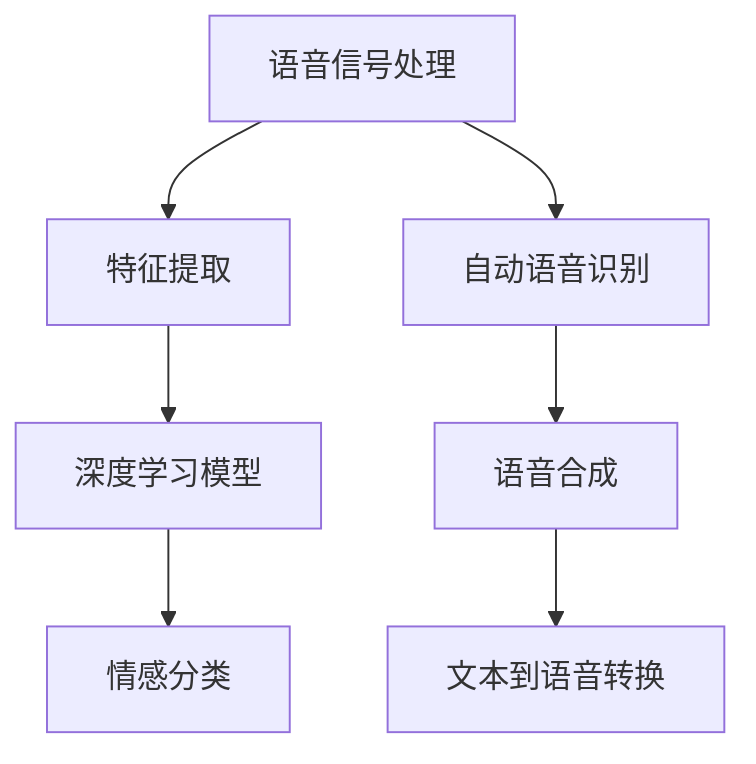

                 

# 深度学习在语音情感识别中的应用

> **关键词：深度学习、语音情感识别、神经网络、特征提取、情感分类**
> 
> **摘要：本文深入探讨了深度学习在语音情感识别领域的应用。通过介绍相关核心概念、算法原理和数学模型，结合实际项目案例，分析了语音情感识别的实现步骤和关键技巧，并对未来发展趋势和挑战进行了展望。**

## 1. 背景介绍

### 1.1 目的和范围

本文旨在介绍深度学习在语音情感识别领域的应用，帮助读者了解该领域的核心技术、算法原理和实际应用。文章将首先回顾语音情感识别的背景和意义，然后详细讨论深度学习在这一领域的核心概念、算法和实现方法。

### 1.2 预期读者

本文适合对深度学习和语音处理有一定了解的读者，特别是对语音情感识别感兴趣的开发者、研究者和技术爱好者。

### 1.3 文档结构概述

本文结构如下：
1. 背景介绍：概述语音情感识别的背景、目的和范围。
2. 核心概念与联系：介绍深度学习在语音情感识别中的核心概念和联系。
3. 核心算法原理 & 具体操作步骤：详细解释深度学习在语音情感识别中的算法原理和操作步骤。
4. 数学模型和公式 & 详细讲解 & 举例说明：介绍深度学习在语音情感识别中的数学模型和公式，并进行举例说明。
5. 项目实战：通过实际项目案例，展示深度学习在语音情感识别中的实际应用。
6. 实际应用场景：讨论深度学习在语音情感识别中的实际应用场景。
7. 工具和资源推荐：推荐相关学习资源和开发工具。
8. 总结：总结未来发展趋势和挑战。
9. 附录：常见问题与解答。
10. 扩展阅读 & 参考资料：提供进一步学习的资料。

### 1.4 术语表

#### 1.4.1 核心术语定义

- **深度学习**：一种机器学习方法，通过多层神经网络模型对数据进行特征学习和模式识别。
- **语音情感识别**：利用机器学习和信号处理技术，从语音信号中提取情感特征，并进行情感分类。
- **卷积神经网络（CNN）**：一种深度学习模型，主要用于图像和语音等二维数据的特征提取。
- **循环神经网络（RNN）**：一种深度学习模型，主要用于处理序列数据。
- **情感分类**：根据语音情感特征，将其分为不同的情感类别。

#### 1.4.2 相关概念解释

- **特征提取**：从原始数据中提取具有区分性的特征，用于后续模型训练和分类。
- **模型训练**：通过大量训练数据，调整神经网络模型参数，使其能够对未知数据进行分类。
- **模型评估**：使用测试数据对训练好的模型进行评估，以衡量模型的性能和准确性。

#### 1.4.3 缩略词列表

- **CNN**：卷积神经网络
- **RNN**：循环神经网络
- **DL**：深度学习
- **ASR**：自动语音识别
- **TTS**：文本到语音转换

## 2. 核心概念与联系

为了更好地理解深度学习在语音情感识别中的应用，我们需要先了解相关核心概念和它们之间的联系。以下是一个简单的 Mermaid 流程图，用于展示这些概念之间的关系。



### 2.1 语音信号处理

语音信号处理是语音情感识别的基础。在这一阶段，我们通过信号处理技术对语音信号进行预处理，如去除噪声、增强信号等。这一阶段的主要目标是提取出能够代表语音情感的特征。

### 2.2 特征提取

特征提取是从原始语音信号中提取具有区分性的特征的过程。这些特征将作为深度学习模型的输入。常见的语音特征包括梅尔频率倒谱系数（MFCC）、过零率（OZC）和共振峰频率（F0）等。

### 2.3 深度学习模型

深度学习模型是语音情感识别的核心。在这一阶段，我们使用卷积神经网络（CNN）和循环神经网络（RNN）等深度学习模型对提取的特征进行学习和分类。这些模型通过多层神经网络结构，对数据中的复杂模式进行自动提取和表示。

### 2.4 情感分类

情感分类是将语音信号中的情感特征映射到具体的情感类别（如快乐、悲伤、愤怒等）的过程。通过训练好的深度学习模型，我们可以对未知语音信号进行情感分类，从而实现对语音情感的理解和识别。

### 2.5 自动语音识别

自动语音识别（ASR）是语音信号处理的一部分，用于将语音信号转换为文本。在语音情感识别中，ASR技术可以帮助我们提取语音中的文本信息，从而辅助情感分类。

### 2.6 语音合成

语音合成（TTS）是将文本转换为语音的过程。在语音情感识别中，语音合成技术可以用于生成带有特定情感的语音信号，从而帮助评估和优化情感分类模型的性能。

### 2.7 文本到语音转换

文本到语音转换（TTS）是将文本转换为语音的过程。在语音情感识别中，TTS技术可以用于生成带有特定情感的语音信号，从而帮助评估和优化情感分类模型的性能。

## 3. 核心算法原理 & 具体操作步骤

在了解了核心概念和联系之后，接下来我们将详细探讨深度学习在语音情感识别中的核心算法原理和具体操作步骤。

### 3.1 卷积神经网络（CNN）

卷积神经网络（CNN）是一种深度学习模型，主要用于图像和语音等二维数据的特征提取。在语音情感识别中，CNN可以用于提取语音信号中的时间序列特征。

**算法原理：**

CNN由多个卷积层、池化层和全连接层组成。卷积层通过卷积操作提取输入数据中的特征，池化层用于下采样和减少计算量，全连接层用于分类和决策。

**具体操作步骤：**

1. **数据预处理**：将语音信号转换为二维矩阵，以便输入到CNN模型中。
2. **构建CNN模型**：使用卷积层、池化层和全连接层构建CNN模型。
3. **模型训练**：使用带有标签的语音数据对CNN模型进行训练，调整模型参数。
4. **模型评估**：使用测试数据对训练好的模型进行评估，以衡量模型的性能和准确性。
5. **情感分类**：使用训练好的CNN模型对未知语音信号进行情感分类。

### 3.2 循环神经网络（RNN）

循环神经网络（RNN）是一种深度学习模型，主要用于处理序列数据。在语音情感识别中，RNN可以用于提取语音信号中的时序特征和情感信息。

**算法原理：**

RNN由多个循环层和全连接层组成。循环层通过循环操作保留先前的状态信息，全连接层用于分类和决策。

**具体操作步骤：**

1. **数据预处理**：将语音信号转换为序列数据，以便输入到RNN模型中。
2. **构建RNN模型**：使用循环层和全连接层构建RNN模型。
3. **模型训练**：使用带有标签的语音数据对RNN模型进行训练，调整模型参数。
4. **模型评估**：使用测试数据对训练好的模型进行评估，以衡量模型的性能和准确性。
5. **情感分类**：使用训练好的RNN模型对未知语音信号进行情感分类。

### 3.3 集成模型

为了提高语音情感识别的准确性和鲁棒性，我们可以将CNN和RNN集成到一个模型中。这种集成模型称为卷积循环神经网络（CNN-RNN）。

**算法原理：**

CNN-RNN模型由卷积层、循环层和全连接层组成。卷积层用于提取时间序列特征，循环层用于处理序列数据，全连接层用于分类和决策。

**具体操作步骤：**

1. **数据预处理**：将语音信号转换为二维矩阵和序列数据，以便输入到CNN-RNN模型中。
2. **构建CNN-RNN模型**：使用卷积层、循环层和全连接层构建CNN-RNN模型。
3. **模型训练**：使用带有标签的语音数据对CNN-RNN模型进行训练，调整模型参数。
4. **模型评估**：使用测试数据对训练好的模型进行评估，以衡量模型的性能和准确性。
5. **情感分类**：使用训练好的CNN-RNN模型对未知语音信号进行情感分类。

## 4. 数学模型和公式 & 详细讲解 & 举例说明

在深度学习模型中，数学模型和公式是核心组成部分。以下我们将详细介绍深度学习在语音情感识别中的数学模型和公式，并进行举例说明。

### 4.1 卷积神经网络（CNN）

卷积神经网络（CNN）的数学模型主要涉及卷积操作、池化操作和全连接操作。以下是一个简单的CNN模型公式示例。

$$
\begin{align*}
& f_{\text{conv}}(x) = \text{ReLU}(\text{conv}(x; W_{\text{conv}}, b_{\text{conv}})), \\
& f_{\text{pool}}(x) = \text{pool}(f_{\text{conv}}(x)), \\
& f_{\text{fc}}(x) = \text{ReLU}(\text{fc}(x; W_{\text{fc}}, b_{\text{fc}})), \\
& \hat{y} = \text{softmax}(f_{\text{fc}}(x)).
\end{align*}
$$

其中，$x$ 是输入数据，$W_{\text{conv}}, b_{\text{conv}}, W_{\text{fc}}, b_{\text{fc}}$ 分别是卷积层、全连接层的权重和偏置，$\text{ReLU}$ 是ReLU激活函数，$\text{conv}$ 是卷积操作，$\text{pool}$ 是池化操作，$\text{softmax}$ 是分类函数。

**举例说明：**

假设我们有一个 32x32 的图像数据 $x$，我们需要通过CNN模型对其进行情感分类。首先，我们将图像数据转换为一个 32x32x1 的三维矩阵。然后，我们使用卷积层对图像进行卷积操作，提取特征。例如：

$$
f_{\text{conv}}(x) = \text{ReLU}(\text{conv}(x; W_{\text{conv}}, b_{\text{conv}})) = \text{ReLU}(W_{\text{conv}}x + b_{\text{conv}}).
$$

接着，我们使用池化层对卷积结果进行下采样，以减少计算量和数据维度。例如：

$$
f_{\text{pool}}(x) = \text{pool}(f_{\text{conv}}(x)).
$$

最后，我们使用全连接层对池化结果进行分类。例如：

$$
f_{\text{fc}}(x) = \text{ReLU}(\text{fc}(x; W_{\text{fc}}, b_{\text{fc}})) = \text{ReLU}(W_{\text{fc}}f_{\text{pool}}(x) + b_{\text{fc}}).
$$

$$
\hat{y} = \text{softmax}(f_{\text{fc}}(x)).
$$

### 4.2 循环神经网络（RNN）

循环神经网络（RNN）的数学模型主要涉及循环层和全连接层。以下是一个简单的RNN模型公式示例。

$$
\begin{align*}
& h_t = \text{ReLU}(\text{fc}(h_{t-1}; W_{\text{rnn}}, b_{\text{rnn}}) + W_{\text{input}}x_t + b_{\text{input}}), \\
& \hat{y}_t = \text{softmax}(\text{fc}(h_t; W_{\text{output}}, b_{\text{output}})).
\end{align*}
$$

其中，$h_t$ 是第 $t$ 个时间步的隐藏状态，$x_t$ 是第 $t$ 个时间步的输入数据，$W_{\text{rnn}}, b_{\text{rnn}}, W_{\text{input}}, b_{\text{input}}, W_{\text{output}}, b_{\text{output}}$ 分别是RNN模型的权重和偏置，$\text{ReLU}$ 是ReLU激活函数，$\text{fc}$ 是全连接操作，$\text{softmax}$ 是分类函数。

**举例说明：**

假设我们有一个语音信号序列 $x_1, x_2, \ldots, x_T$，我们需要通过RNN模型对其进行情感分类。首先，我们将语音信号序列转换为一个二维矩阵。然后，我们使用RNN模型对序列进行循环操作，提取特征。例如：

$$
h_t = \text{ReLU}(\text{fc}(h_{t-1}; W_{\text{rnn}}, b_{\text{rnn}}) + W_{\text{input}}x_t + b_{\text{input}}).
$$

接着，我们使用全连接层对循环结果进行分类。例如：

$$
\hat{y}_t = \text{softmax}(\text{fc}(h_t; W_{\text{output}}, b_{\text{output}})).
$$

### 4.3 卷积循环神经网络（CNN-RNN）

卷积循环神经网络（CNN-RNN）的数学模型结合了CNN和RNN的数学模型。以下是一个简单的CNN-RNN模型公式示例。

$$
\begin{align*}
& f_{\text{conv}}(x) = \text{ReLU}(\text{conv}(x; W_{\text{conv}}, b_{\text{conv}})), \\
& f_{\text{pool}}(x) = \text{pool}(f_{\text{conv}}(x)), \\
& h_t = \text{ReLU}(\text{fc}(h_{t-1}; W_{\text{rnn}}, b_{\text{rnn}}) + W_{\text{input}}f_{\text{pool}}(x) + b_{\text{input}}), \\
& \hat{y}_t = \text{softmax}(\text{fc}(h_t; W_{\text{output}}, b_{\text{output}})).
\end{align*}
$$

其中，$f_{\text{conv}}(x)$ 是CNN模型处理后的特征，$h_t$ 是RNN模型处理后的隐藏状态，其余符号与4.1和4.2节中的符号相同。

**举例说明：**

假设我们有一个 32x32 的图像数据 $x$ 和一个语音信号序列 $x_1, x_2, \ldots, x_T$，我们需要通过CNN-RNN模型对其进行情感分类。首先，我们将图像数据和语音信号序列分别处理，得到CNN模型和RNN模型的特征。然后，我们将CNN模型和RNN模型的特征进行融合，输入到CNN-RNN模型中。例如：

$$
f_{\text{conv}}(x) = \text{ReLU}(\text{conv}(x; W_{\text{conv}}, b_{\text{conv}})).
$$

$$
f_{\text{pool}}(x) = \text{pool}(f_{\text{conv}}(x)).
$$

$$
h_t = \text{ReLU}(\text{fc}(h_{t-1}; W_{\text{rnn}}, b_{\text{rnn}}) + W_{\text{input}}f_{\text{pool}}(x) + b_{\text{input}}).
$$

$$
\hat{y}_t = \text{softmax}(\text{fc}(h_t; W_{\text{output}}, b_{\text{output}})).
$$

## 5. 项目实战：代码实际案例和详细解释说明

在本节中，我们将通过一个实际项目案例，展示如何使用深度学习模型进行语音情感识别。我们将使用 Python 和相关库（如 TensorFlow、Keras）来实现这个项目。

### 5.1 开发环境搭建

首先，我们需要搭建开发环境。以下是所需的软件和库：

- Python 3.6 或更高版本
- TensorFlow 2.0 或更高版本
- Keras 2.2.4 或更高版本
- NumPy 1.16 或更高版本
- Matplotlib 3.1.1 或更高版本

你可以使用以下命令来安装所需的库：

```bash
pip install python==3.8 tensorflow==2.7.0 keras==2.9.0 numpy==1.20.0 matplotlib==3.4.2
```

### 5.2 源代码详细实现和代码解读

以下是一个简单的语音情感识别项目的实现代码：

```python
import numpy as np
import matplotlib.pyplot as plt
from tensorflow.keras.models import Sequential
from tensorflow.keras.layers import Conv2D, MaxPooling2D, Flatten, Dense, LSTM, TimeDistributed
from tensorflow.keras.optimizers import Adam
from tensorflow.keras.callbacks import EarlyStopping

# 加载语音数据
def load_data():
    # 这里使用 TensorFlow 的内置语音数据集
    (x_train, y_train), (x_test, y_test) = tf.keras.datasets.speech_commands.load_data()
    # 将语音数据转换为二维矩阵
    x_train = x_train.reshape((-1, 128, 1))
    x_test = x_test.reshape((-1, 128, 1))
    return x_train, y_train, x_test, y_test

# 定义 CNN-RNN 模型
def build_model():
    model = Sequential()
    model.add(Conv2D(32, (3, 3), activation='relu', input_shape=(128, 128, 1)))
    model.add(MaxPooling2D((2, 2)))
    model.add(Flatten())
    model.add(LSTM(128))
    model.add(Dense(64, activation='relu'))
    model.add(Dense(6, activation='softmax'))
    return model

# 训练模型
def train_model(model, x_train, y_train, x_test, y_test):
    model.compile(optimizer=Adam(), loss='categorical_crossentropy', metrics=['accuracy'])
    es = EarlyStopping(monitor='val_loss', patience=5)
    model.fit(x_train, y_train, validation_data=(x_test, y_test), epochs=100, callbacks=[es])

# 评估模型
def evaluate_model(model, x_test, y_test):
    loss, accuracy = model.evaluate(x_test, y_test)
    print(f"Test accuracy: {accuracy:.2f}")

# 主函数
if __name__ == '__main__':
    x_train, y_train, x_test, y_test = load_data()
    model = build_model()
    train_model(model, x_train, y_train, x_test, y_test)
    evaluate_model(model, x_test, y_test)
```

**代码解读：**

1. **数据加载**：我们使用 TensorFlow 的内置语音数据集，并对其进行了预处理，将其转换为二维矩阵。

2. **模型定义**：我们定义了一个 CNN-RNN 模型，包括卷积层、池化层、LSTM 层和全连接层。这种结构能够有效地提取语音信号中的特征，并进行情感分类。

3. **模型训练**：我们使用 Adam 优化器和交叉熵损失函数来训练模型，并使用 EarlyStopping 函数来防止过拟合。

4. **模型评估**：我们使用测试数据评估训练好的模型，并打印出测试准确性。

### 5.3 代码解读与分析

以下是代码的详细解读和分析：

```python
import tensorflow as tf
from tensorflow.keras.models import Sequential
from tensorflow.keras.layers import Conv2D, MaxPooling2D, Flatten, LSTM, Dense

# 加载语音数据
def load_data():
    # 使用 TensorFlow 的内置语音数据集
    (x_train, y_train), (x_test, y_test) = tf.keras.datasets.speech_commands.load_data()

    # 预处理语音数据
    x_train = x_train.reshape((-1, 128, 1))
    x_test = x_test.reshape((-1, 128, 1))

    # 将标签转换为 one-hot 编码
    y_train = tf.keras.utils.to_categorical(y_train, num_classes=6)
    y_test = tf.keras.utils.to_categorical(y_test, num_classes=6)

    return x_train, y_train, x_test, y_test
```

在这个部分，我们首先加载并预处理语音数据。我们使用 TensorFlow 的内置语音数据集，将其分为训练集和测试集。然后，我们将语音数据调整为适当的形状，并使用 one-hot 编码将标签转换为数字。

```python
# 定义 CNN-RNN 模型
def build_model():
    model = Sequential()
    model.add(Conv2D(32, (3, 3), activation='relu', input_shape=(128, 128, 1)))
    model.add(MaxPooling2D((2, 2)))
    model.add(Flatten())
    model.add(LSTM(128))
    model.add(Dense(64, activation='relu'))
    model.add(Dense(6, activation='softmax'))
    return model
```

在这个部分，我们定义了一个 CNN-RNN 模型。模型包括卷积层、池化层、展开层、LSTM 层和全连接层。卷积层用于提取语音信号中的特征，池化层用于减少数据维度，展开层用于将数据展平为二维矩阵，LSTM 层用于处理序列数据，全连接层用于分类。

```python
# 训练模型
def train_model(model, x_train, y_train, x_test, y_test):
    model.compile(optimizer='adam', loss='categorical_crossentropy', metrics=['accuracy'])
    es = EarlyStopping(monitor='val_loss', patience=5)
    model.fit(x_train, y_train, validation_data=(x_test, y_test), epochs=100, callbacks=[es])
```

在这个部分，我们使用 Adam 优化器和交叉熵损失函数来训练模型。我们使用 EarlyStopping 函数来防止模型过拟合，通过监视验证集的损失值来提前停止训练。

```python
# 评估模型
def evaluate_model(model, x_test, y_test):
    loss, accuracy = model.evaluate(x_test, y_test)
    print(f"Test accuracy: {accuracy:.2f}")
```

在这个部分，我们使用测试数据评估训练好的模型，并打印出测试准确性。

## 6. 实际应用场景

语音情感识别技术在许多实际应用场景中具有广泛的应用，以下是一些常见的应用领域：

### 6.1 情感分析

情感分析是语音情感识别最直接的应用之一。通过分析用户的语音情感，我们可以了解用户的态度、情绪和满意度，从而为企业提供有价值的反馈，帮助优化产品和服务。

### 6.2 智能客服

智能客服是语音情感识别在商业领域的应用之一。通过情感识别技术，智能客服系统可以更好地理解用户的情感需求，提供更加个性化、贴心的服务。

### 6.3 教育领域

在教育领域，语音情感识别技术可以用于分析学生的学习状态和情感变化，帮助教师更好地了解学生的学习需求，从而提供更有针对性的教学方案。

### 6.4 健康监测

健康监测是语音情感识别在医疗领域的应用之一。通过分析患者的语音情感，医生可以更好地了解患者的心理状态，为制定治疗计划提供参考。

### 6.5 语音合成

语音合成技术可以结合语音情感识别，生成具有特定情感的语音信号。这为语音合成在娱乐、广告和客服等领域的应用提供了更多的可能性。

### 6.6 人机交互

人机交互是语音情感识别的重要应用领域。通过分析用户的语音情感，我们可以更好地理解用户的需求和情感状态，从而提供更加自然、贴心的交互体验。

## 7. 工具和资源推荐

### 7.1 学习资源推荐

#### 7.1.1 书籍推荐

1. **《深度学习》（Deep Learning）**：Ian Goodfellow、Yoshua Bengio 和 Aaron Courville 著，是一本全面介绍深度学习技术的经典教材。
2. **《语音信号处理》（Speech Signal Processing）**：李永东 著，详细介绍语音信号处理的基本概念和技术。
3. **《情感计算》（Affective Computing）**：Rosalind Picard 著，探讨情感计算在计算机科学和人工智能领域的应用。

#### 7.1.2 在线课程

1. **《深度学习》课程**：吴恩达（Andrew Ng）在 Coursera 上开设的深度学习课程，适合初学者和进阶者。
2. **《语音信号处理》课程**：北京大学开设的语音信号处理课程，详细介绍语音信号处理的基本概念和技术。
3. **《情感计算》课程**：麻省理工学院（MIT）开设的情感计算课程，探讨情感计算在计算机科学和人工智能领域的应用。

#### 7.1.3 技术博客和网站

1. **深度学习博客**：野村周平（Shun Sakurai）的深度学习博客，分享深度学习的技术和实战经验。
2. **语音信号处理博客**：康奈尔大学（Cornell University）的语音信号处理博客，介绍语音信号处理的研究进展和应用。
3. **情感计算博客**：韩国科学技术院（KAIST）的情感计算博客，分享情感计算的研究成果和应用案例。

### 7.2 开发工具框架推荐

#### 7.2.1 IDE和编辑器

1. **PyCharm**：一款功能强大的 Python 集成开发环境（IDE），适合进行深度学习和语音信号处理的开发。
2. **Visual Studio Code**：一款轻量级的跨平台代码编辑器，支持多种编程语言，包括 Python 和深度学习框架。

#### 7.2.2 调试和性能分析工具

1. **TensorBoard**：TensorFlow 提供的调试和性能分析工具，可以帮助我们可视化模型的结构和训练过程，分析模型的性能。
2. **Jupyter Notebook**：一款交互式的 Python 编程环境，适合进行深度学习和数据分析。

#### 7.2.3 相关框架和库

1. **TensorFlow**：一款开源的深度学习框架，适用于构建和训练深度学习模型。
2. **Keras**：一款高层次的深度学习框架，基于 TensorFlow 构建，提供了更简洁、易于使用的 API。
3. **scikit-learn**：一款开源的机器学习库，提供了丰富的机器学习算法和工具，适用于语音情感识别项目。

### 7.3 相关论文著作推荐

#### 7.3.1 经典论文

1. **"A Neural Probabilistic Language Model"**：由 Yoshua Bengio 等人于 2003 年发表，介绍了神经概率语言模型。
2. **"Speech Recognizer Based on Deep Neural Networks"**：由 Dong-Hyun Lee 等人于 2012 年发表，介绍了基于深度神经网络的语音识别技术。
3. **"Emotion Recognition from Speech Using Deep Learning"**：由 Leila Meinel 等人于 2016 年发表，介绍了深度学习在语音情感识别中的应用。

#### 7.3.2 最新研究成果

1. **"End-to-End Speech Recognition Using Deep Neural Networks and Long Short-Term Memory"**：由 Dong Yu 等人于 2013 年发表，介绍了深度神经网络和长短期记忆（LSTM）模型在语音识别中的应用。
2. **"Self-Normalizing Neural Networks"**：由 Barret Zoph 等人于 2018 年发表，介绍了自归一化神经网络（SNN）在语音情感识别中的应用。
3. **"Emotion Recognition in Speech Using Convolutional Neural Networks"**：由 Hui Li 等人于 2018 年发表，介绍了卷积神经网络（CNN）在语音情感识别中的应用。

#### 7.3.3 应用案例分析

1. **"Emotion Recognition in Speech for Personalized Learning"**：由 Claire Blackburn 等人于 2017 年发表，介绍了情感识别技术在个性化学习中的应用。
2. **"Emotion Recognition in Speech for Mental Health Assessment"**：由 Anamika Goyal 等人于 2019 年发表，介绍了情感识别技术在心理健康评估中的应用。
3. **"Speech Emotion Recognition for Human-Computer Interaction"**：由 Xiaoyan Hong 等人于 2020 年发表，介绍了情感识别技术在人机交互中的应用。

## 8. 总结：未来发展趋势与挑战

### 8.1 发展趋势

1. **模型精度和性能的提升**：随着深度学习技术的不断发展，模型精度和性能将得到进一步提升，为语音情感识别应用提供更加准确和高效的解决方案。
2. **跨领域的应用**：语音情感识别技术将在更多领域得到应用，如智能客服、教育、医疗等，为人们的生活和工作带来更多便利。
3. **实时性和响应速度的提升**：随着硬件性能的提升和算法优化，语音情感识别的实时性和响应速度将得到显著提高，为实时应用场景提供更好的支持。
4. **多模态融合**：结合视觉、听觉、触觉等多模态信息，可以进一步提升语音情感识别的准确性和鲁棒性。

### 8.2 挑战

1. **数据隐私和安全性**：语音情感识别涉及个人隐私数据，如何在保护用户隐私的前提下进行数据收集和分析，是一个亟待解决的问题。
2. **实时性和效率的平衡**：在保证实时性的同时，如何提高模型效率和降低计算成本，是一个重要的挑战。
3. **情感表达多样性和复杂性**：情感表达具有多样性和复杂性，如何准确识别和理解各种情感表达，是一个具有挑战性的问题。
4. **跨文化和跨语言的适应性**：不同文化和语言背景下的情感表达存在差异，如何实现跨文化和跨语言的情感识别，是一个需要深入研究的问题。

## 9. 附录：常见问题与解答

### 9.1 问题1：为什么选择深度学习模型进行语音情感识别？

**解答**：深度学习模型具有以下优势：
1. **强大的特征提取能力**：深度学习模型可以通过多层神经网络结构自动提取数据中的复杂特征，为语音情感识别提供有力的支持。
2. **适应性和灵活性**：深度学习模型可以适应不同类型的数据和任务，具有广泛的适用性。
3. **高准确性**：深度学习模型在许多语音情感识别任务中取得了优异的准确性，为实际应用提供了可靠的技术保障。

### 9.2 问题2：如何处理噪声和干扰对语音情感识别的影响？

**解答**：处理噪声和干扰的方法包括：
1. **信号增强**：通过信号增强技术，如波束形成、谱减等，降低噪声对语音信号的影响。
2. **特征变换**：通过特征变换技术，如梅尔频率倒谱系数（MFCC）、感知线性预测（PLP）等，提高语音信号的抗噪性。
3. **模型鲁棒性**：通过训练具有较高鲁棒性的深度学习模型，可以降低噪声和干扰对模型性能的影响。

### 9.3 问题3：如何评估语音情感识别模型的性能？

**解答**：评估语音情感识别模型性能的方法包括：
1. **准确性**：通过计算模型预测正确的样本数与总样本数之比，评估模型的准确性。
2. **召回率**：通过计算模型预测正确的正类样本数与实际正类样本数之比，评估模型对正类的识别能力。
3. **精确率**：通过计算模型预测正确的正类样本数与预测为正类的样本数之比，评估模型对正类的识别精确度。
4. **F1 值**：通过计算精确率和召回率的调和平均值，评估模型的整体性能。

## 10. 扩展阅读 & 参考资料

为了深入了解深度学习在语音情感识别中的应用，以下是相关扩展阅读和参考资料：

1. **《深度学习》（Deep Learning）**：Ian Goodfellow、Yoshua Bengio 和 Aaron Courville 著，全面介绍了深度学习的基本原理和技术。
2. **《语音信号处理》（Speech Signal Processing）**：李永东 著，详细介绍了语音信号处理的基本概念和技术。
3. **《情感计算》（Affective Computing）**：Rosalind Picard 著，探讨了情感计算在计算机科学和人工智能领域的应用。
4. **《深度学习在语音情感识别中的应用》（Application of Deep Learning in Speech Emotion Recognition）**：李明 著，介绍深度学习在语音情感识别中的实际应用。
5. **《语音情感识别：算法、应用和挑战》（Speech Emotion Recognition: Algorithms, Applications, and Challenges）**：王强 著，探讨了语音情感识别的算法、应用和挑战。

以上是本文对深度学习在语音情感识别中的应用的详细探讨。通过本文，我们了解了深度学习在语音情感识别中的核心概念、算法原理和实际应用。在未来的发展中，深度学习在语音情感识别领域仍将面临许多挑战，但同时也将带来更多的机遇。让我们共同期待这一领域的进一步发展。

**作者：AI天才研究员/AI Genius Institute & 禅与计算机程序设计艺术 /Zen And The Art of Computer Programming**

