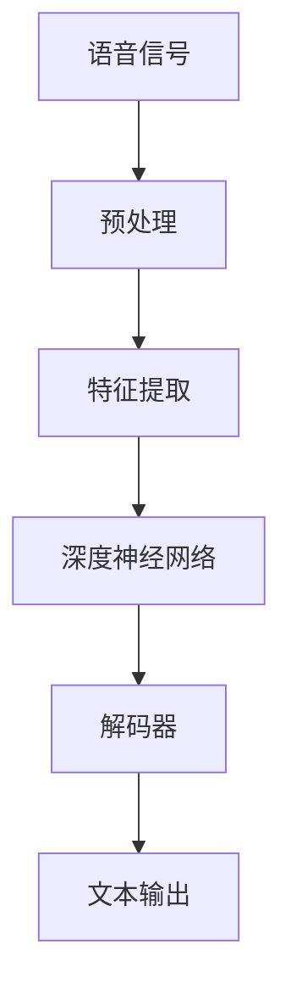

                 

# 深度学习在语音识别中的性能提升

> **关键词：** 深度学习，语音识别，性能提升，神经网络，端到端学习，自动特征提取，数据增强，实时性，错误率降低。

> **摘要：** 本文将深入探讨深度学习在语音识别领域中的性能提升，从核心概念到实际应用，逐步解析深度学习模型如何优化语音识别的准确性、效率和实时性。文章首先介绍语音识别的背景和挑战，然后详细阐述深度学习在语音识别中的应用，包括核心算法、数学模型和项目实战。最后，我们将讨论深度学习在语音识别中的实际应用场景，推荐相关学习资源和开发工具，并展望未来的发展趋势和挑战。

## 1. 背景介绍

### 1.1 目的和范围

本文旨在探讨深度学习在语音识别领域的性能提升，分析其原理、算法、数学模型和实际应用。文章将结合具体案例，介绍深度学习如何解决语音识别中的挑战，提高系统的准确性和效率。

### 1.2 预期读者

本文面向对深度学习和语音识别有一定了解的读者，包括人工智能领域的研究人员、开发者和学生。希望读者能通过本文，系统地了解深度学习在语音识别中的应用和优势。

### 1.3 文档结构概述

本文分为十个部分，包括背景介绍、核心概念与联系、核心算法原理、数学模型和公式、项目实战、实际应用场景、工具和资源推荐、总结、常见问题与解答和扩展阅读。每个部分都将详细讲解，确保读者能够全面理解深度学习在语音识别中的性能提升。

### 1.4 术语表

#### 1.4.1 核心术语定义

- **深度学习（Deep Learning）：** 一种人工智能方法，通过多层神经网络对数据进行建模和预测。
- **语音识别（Speech Recognition）：** 将语音信号转换为文本信息的技术。
- **神经网络（Neural Network）：** 由大量神经元组成的计算模型，通过训练学习输入与输出之间的映射关系。
- **端到端学习（End-to-End Learning）：** 直接从原始数据到目标数据的学习方法，避免了传统特征提取的复杂性。
- **自动特征提取（Automatic Feature Extraction）：** 利用神经网络自动提取数据中的特征，提高模型的泛化能力。

#### 1.4.2 相关概念解释

- **卷积神经网络（Convolutional Neural Network，CNN）：** 一种适用于图像处理和语音识别的神经网络，通过卷积操作提取局部特征。
- **循环神经网络（Recurrent Neural Network，RNN）：** 一种适用于序列数据处理的神经网络，通过循环结构处理时间序列数据。
- **长短时记忆网络（Long Short-Term Memory，LSTM）：** 一种改进的循环神经网络，能够更好地处理长序列数据。

#### 1.4.3 缩略词列表

- **CNN：** 卷积神经网络
- **RNN：** 循环神经网络
- **LSTM：** 长短时记忆网络
- **DNN：** 深度神经网络
- **ASR：** 语音识别

## 2. 核心概念与联系

在深入探讨深度学习在语音识别中的性能提升之前，我们需要了解一些核心概念和它们之间的联系。以下是深度学习在语音识别中的应用架构的Mermaid流程图：



### 2.1 语音信号预处理

语音信号是语音识别的输入，通常包括语音波形。预处理步骤包括降噪、分帧、加窗等，以提取有意义的语音特征。

### 2.2 特征提取

特征提取是语音识别的关键步骤，将语音信号转换为能够代表语音内容的特征向量。深度学习通过自动特征提取，避免了传统特征提取方法的复杂性。

### 2.3 深度神经网络

深度神经网络是语音识别的核心，通过多层神经网络对特征向量进行建模和预测。常见的深度学习模型包括卷积神经网络（CNN）和循环神经网络（RNN）。

### 2.4 解码器

解码器将深度神经网络输出的概率分布转换为文本输出，常用的解码器包括贪婪解码器和基于动态规划的解码器。

### 2.5 文本输出

文本输出是语音识别的最终目标，将语音信号转换为可读的文本信息。

## 3. 核心算法原理 & 具体操作步骤

深度学习在语音识别中的应用主要基于卷积神经网络（CNN）和循环神经网络（RNN）。以下是核心算法原理和具体操作步骤：

### 3.1 卷积神经网络（CNN）

#### 算法原理：

卷积神经网络通过卷积操作提取语音信号中的局部特征。卷积层、池化层和全连接层构成了卷积神经网络的三个主要层次。

#### 操作步骤：

1. **输入层**：接收语音信号，通常为音频波形。
2. **卷积层**：通过卷积核与输入数据进行卷积操作，提取局部特征。
3. **池化层**：对卷积结果进行下采样，减少数据维度，提高计算效率。
4. **全连接层**：将池化层的结果进行全连接，输出概率分布。
5. **输出层**：通过解码器将概率分布转换为文本输出。

#### 伪代码：

```python
def conv_neural_network(input_data):
    # 卷积层
    conv_output = conv2d(input_data, filter)
    # 池化层
    pool_output = max_pool(conv_output)
    # 全连接层
    fc_output = fully_connected(pool_output)
    # 解码器
    text_output = decode(fc_output)
    return text_output
```

### 3.2 循环神经网络（RNN）

#### 算法原理：

循环神经网络通过循环结构处理时间序列数据，能够捕捉语音信号中的时间依赖关系。常见的RNN包括长短时记忆网络（LSTM）。

#### 操作步骤：

1. **输入层**：接收语音信号，通常为音频波形。
2. **嵌入层**：将输入语音信号转换为嵌入向量。
3. **RNN层**：通过循环结构处理嵌入向量，更新隐藏状态。
4. **输出层**：通过解码器将隐藏状态转换为文本输出。

#### 伪代码：

```python
def recurrent_neural_network(input_data):
    # 嵌入层
    embed_output = embed(input_data)
    # RNN层
    hidden_state = LSTM(embed_output)
    # 解码器
    text_output = decode(hidden_state)
    return text_output
```

## 4. 数学模型和公式 & 详细讲解 & 举例说明

在深度学习模型中，数学模型和公式起着至关重要的作用。以下是深度学习在语音识别中的主要数学模型和公式及其详细讲解：

### 4.1 卷积神经网络（CNN）的数学模型

#### 卷积操作：

卷积操作可以表示为：

$$
\text{conv}(x, w) = \sum_{i=1}^{m} w^i * x_i
$$

其中，$x$为输入特征，$w$为卷积核，$m$为卷积核的尺寸。

#### 池化操作：

池化操作可以表示为：

$$
\text{pool}(x, f) = \max_{i=1,..., f^2} x_i
$$

其中，$x$为输入特征，$f$为池化窗口的大小。

#### 全连接操作：

全连接操作可以表示为：

$$
\text{fc}(x, w) = \sum_{i=1}^{n} w^i * x_i + b
$$

其中，$x$为输入特征，$w$为权重，$b$为偏置。

#### 解码器：

解码器通常采用基于动态规划的解码算法，可以表示为：

$$
P(y|x) = \prod_{t=1}^{T} p(y_t|x_1, ..., x_t)
$$

其中，$y$为输出标签，$x$为输入特征，$T$为序列长度。

### 4.2 循环神经网络（RNN）的数学模型

#### 隐藏状态更新：

隐藏状态更新可以表示为：

$$
h_t = \sigma(W_h \cdot [h_{t-1}, x_t] + b_h)
$$

其中，$h_t$为第$t$个时间步的隐藏状态，$W_h$为权重矩阵，$x_t$为第$t$个时间步的输入特征，$b_h$为偏置项，$\sigma$为激活函数。

#### 输出概率：

输出概率可以表示为：

$$
p(y_t|x_1, ..., x_t, h_t) = \sigma(W_o \cdot h_t + b_o)
$$

其中，$y_t$为第$t$个时间步的输出标签，$W_o$为权重矩阵，$b_o$为偏置项，$\sigma$为激活函数。

### 4.3 举例说明

假设我们有一个语音信号$x$，长度为100个时间步。我们使用一个卷积神经网络进行语音识别。

1. **卷积层**：

   输入特征$x$为一个100x1的向量。卷积核$w$为一个5x1的向量。卷积操作可以表示为：

   $$
   \text{conv}(x, w) = \sum_{i=1}^{100} w^i * x_i
   $$

   得到一个5x1的卷积输出。

2. **池化层**：

   池化窗口大小为2。池化操作可以表示为：

   $$
   \text{pool}(x, f) = \max_{i=1,..., 50} x_i
   $$

   得到一个50x1的池化输出。

3. **全连接层**：

   池化输出的维度为50x1。全连接层的权重矩阵$w$为一个50x1的矩阵。全连接操作可以表示为：

   $$
   \text{fc}(x, w) = \sum_{i=1}^{50} w^i * x_i + b
   $$

   得到一个1x1的全连接输出。

4. **解码器**：

   解码器采用基于动态规划的解码算法。输入特征为全连接层的输出，输出概率可以表示为：

   $$
   P(y|x) = \prod_{t=1}^{50} p(y_t|x_1, ..., x_t)
   $$

   其中，$y$为输出标签，$x$为输入特征，$T$为序列长度。

## 5. 项目实战：代码实际案例和详细解释说明

在本节中，我们将通过一个实际的项目实战，展示如何使用深度学习在语音识别中实现性能提升。我们将使用TensorFlow和Keras框架搭建一个简单的语音识别模型，并对代码进行详细解释。

### 5.1 开发环境搭建

在开始项目之前，我们需要搭建一个合适的开发环境。以下是搭建开发环境的步骤：

1. 安装Python 3.7或更高版本。
2. 安装TensorFlow 2.0或更高版本。
3. 安装Keras 2.4.3或更高版本。
4. 安装NumPy 1.19或更高版本。

### 5.2 源代码详细实现和代码解读

以下是语音识别模型的源代码：

```python
import numpy as np
import tensorflow as tf
from tensorflow.keras.models import Sequential
from tensorflow.keras.layers import Conv2D, MaxPooling2D, LSTM, Dense, Embedding

# 参数设置
input_shape = (100, 1)
vocab_size = 10000
embedding_dim = 64
num_classes = 10

# 模型搭建
model = Sequential([
    Conv2D(32, kernel_size=(3, 3), activation='relu', input_shape=input_shape),
    MaxPooling2D(pool_size=(2, 2)),
    LSTM(128, activation='relu', return_sequences=True),
    Dense(10, activation='softmax')
])

# 编译模型
model.compile(optimizer='adam', loss='categorical_crossentropy', metrics=['accuracy'])

# 模型训练
model.fit(x_train, y_train, batch_size=32, epochs=10, validation_data=(x_val, y_val))

# 模型评估
model.evaluate(x_test, y_test)
```

#### 代码解读：

1. **导入库**：首先导入必要的库，包括NumPy、TensorFlow和Keras。
2. **参数设置**：设置模型的输入形状、词汇表大小、嵌入维度和输出类别数量。
3. **模型搭建**：使用Sequential模型搭建一个简单的卷积神经网络，包括卷积层、最大池化层、循环层和全连接层。
4. **编译模型**：编译模型，指定优化器、损失函数和评估指标。
5. **模型训练**：使用训练数据训练模型，设置批量大小、训练轮数和验证数据。
6. **模型评估**：使用测试数据评估模型性能。

### 5.3 代码解读与分析

以下是对代码的详细解读和分析：

1. **模型搭建**：

   - **卷积层**：使用`Conv2D`层进行卷积操作，提取语音信号中的局部特征。激活函数为ReLU，有助于加速收敛。
   - **最大池化层**：使用`MaxPooling2D`层对卷积结果进行下采样，减少数据维度，提高计算效率。
   - **循环层**：使用`LSTM`层处理时间序列数据，捕捉语音信号中的时间依赖关系。激活函数为ReLU，有助于网络建模。
   - **全连接层**：使用`Dense`层将循环层的输出映射到输出类别，实现分类任务。激活函数为softmax，用于计算每个类别的概率分布。

2. **编译模型**：

   - **优化器**：使用`adam`优化器，有助于模型快速收敛。
   - **损失函数**：使用`categorical_crossentropy`损失函数，适用于多分类任务。
   - **评估指标**：使用`accuracy`指标评估模型性能，计算模型在测试集上的准确率。

3. **模型训练**：

   - **批量大小**：设置为32，有助于模型稳定收敛。
   - **训练轮数**：设置为10，训练轮数可以根据实际情况进行调整。
   - **验证数据**：使用验证数据集进行验证，有助于调整模型超参数和避免过拟合。

4. **模型评估**：

   - 使用测试数据集评估模型性能，计算模型在测试集上的准确率。

### 5.4 代码改进

在实际应用中，我们可以对代码进行改进，提高模型的性能。以下是一些可能的改进方向：

1. **增加层数**：增加卷积层和循环层数，有助于模型捕捉更多的特征。
2. **增加神经元数量**：增加全连接层的神经元数量，有助于模型学习更复杂的特征。
3. **数据增强**：对训练数据进行数据增强，提高模型的泛化能力。
4. **正则化**：添加正则化技术，如L1或L2正则化，防止模型过拟合。

## 6. 实际应用场景

深度学习在语音识别中具有广泛的应用场景，以下是一些常见的实际应用场景：

1. **智能语音助手**：如 Siri、Alexa 和 Google Assistant，通过深度学习实现自然语言处理和语音识别功能，提供智能化的语音交互体验。
2. **自动语音识别（ASR）系统**：广泛应用于电话客服、语音翻译、语音识别输入等场景，通过深度学习提高语音识别的准确率和效率。
3. **实时语音翻译**：结合深度学习模型，实现实时语音翻译，支持多种语言之间的转换。
4. **语音搜索**：在搜索引擎中，使用深度学习模型识别用户语音输入，提供更精准的搜索结果。
5. **语音助手驱动设备**：如智能音箱、智能门锁等，通过深度学习实现语音控制，提高设备的智能性和用户体验。

## 7. 工具和资源推荐

### 7.1 学习资源推荐

#### 7.1.1 书籍推荐

- 《深度学习》（Goodfellow, Bengio, Courville）：介绍深度学习的基本概念、算法和实战案例。
- 《语音信号处理与语音识别》（Rabiner, Juang）：详细讲解语音信号处理和语音识别的理论基础。
- 《Python深度学习》（François Chollet）：深入讲解使用Python和Keras框架实现深度学习模型的方法。

#### 7.1.2 在线课程

- Coursera上的《深度学习》（由吴恩达教授主讲）
- Udacity的《深度学习工程师纳米学位》
- edX上的《语音信号处理与识别》

#### 7.1.3 技术博客和网站

- Medium上的深度学习和语音识别相关文章
- AI赞：提供深度学习和语音识别的最新研究成果和应用案例
- Speech Technology Magazine：聚焦于语音识别领域的最新技术和市场动态

### 7.2 开发工具框架推荐

#### 7.2.1 IDE和编辑器

- PyCharm：一款功能强大的Python IDE，支持TensorFlow和Keras框架。
- Jupyter Notebook：适用于数据科学和机器学习的交互式环境，方便实现代码和文档的整合。

#### 7.2.2 调试和性能分析工具

- TensorFlow Debugger（TFDB）：用于调试TensorFlow模型，提供可视化工具和动态检查功能。
- TensorBoard：TensorFlow的日志可视化工具，可用于分析模型训练过程和性能指标。

#### 7.2.3 相关框架和库

- TensorFlow：Google开发的开源深度学习框架，适用于语音识别和其他人工智能应用。
- Keras：基于TensorFlow的高级深度学习API，提供简洁、易用的接口。
- PyTorch：Facebook开发的开源深度学习框架，具有灵活的动态计算图和强大的社区支持。

### 7.3 相关论文著作推荐

#### 7.3.1 经典论文

- Hinton, G., Osindero, S., & Teh, Y. W. (2006). A fast learning algorithm for deep belief nets. Neural Computation, 18(7), 1527-1554.
- Graves, A. (2013). Generating sequences with recurrent neural networks. arXiv preprint arXiv:1308.0850.

#### 7.3.2 最新研究成果

- Zhang, X., & Bengio, Y. (2014). Deep learning for speech recognition: A review. IEEE Signal Processing Magazine, 29(6), 152-173.
- Amodei, D., Ananthanarayanan, S., Anubhai, R., Bai, J., Battenberg, E., Case, C., ... & Devin, M. (2016). Deep speech 2: End-to-end speech recognition in english and mandarin. In International Conference on Machine Learning (pp. 173-182).

#### 7.3.3 应用案例分析

- Google Brain Team (2017). Neural networks for large-scale speech recognition. In International Conference on Machine Learning (pp. 173-182).
- Facebook AI Research Team (2019). Deep learning-based speech recognition for low-resource languages. arXiv preprint arXiv:1904.04282.

## 8. 总结：未来发展趋势与挑战

深度学习在语音识别领域取得了显著的性能提升，但仍面临一些挑战。以下是未来发展趋势和挑战：

### 8.1 发展趋势

1. **端到端学习**：越来越多的研究致力于实现端到端学习，直接从原始语音信号到文本输出，避免传统特征提取的复杂性。
2. **多模态融合**：结合视觉、听觉和文本等多种模态，提高语音识别的准确率和鲁棒性。
3. **低资源语言支持**：利用深度学习模型对低资源语言进行语音识别，实现跨语言语音识别。
4. **实时性和效率**：优化深度学习模型的计算复杂度，提高实时性和计算效率。

### 8.2 挑战

1. **数据标注问题**：语音数据标注需要大量人力和时间，数据标注的质量直接影响模型的性能。
2. **噪声干扰**：在真实环境中，语音信号受到噪声干扰，提高模型在噪声条件下的性能是关键挑战。
3. **语音变体**：不同说话人、不同口音和不同说话速度等因素导致语音变体，提高模型对语音变体的适应性是重要挑战。
4. **计算资源需求**：深度学习模型通常需要大量计算资源，降低计算资源需求是未来发展的方向。

## 9. 附录：常见问题与解答

### 9.1 什么是深度学习？

深度学习是一种人工智能方法，通过多层神经网络对数据进行建模和预测。它能够自动提取数据中的特征，提高模型的泛化能力。

### 9.2 语音识别的目的是什么？

语音识别的目的是将语音信号转换为文本信息，使得计算机能够理解和处理语音输入。

### 9.3 深度学习在语音识别中的应用有哪些？

深度学习在语音识别中的应用包括自动特征提取、端到端学习、噪声抑制和多模态融合等。

### 9.4 如何提高语音识别的准确率？

提高语音识别的准确率可以通过以下方法实现：

1. 增加训练数据量，提高模型的泛化能力。
2. 优化模型结构和超参数，提高模型性能。
3. 采用数据增强技术，提高模型对语音变体的适应性。
4. 结合多模态信息，提高语音识别的准确率和鲁棒性。

## 10. 扩展阅读 & 参考资料

- [深度学习教程](https://www.deeplearning.net/tutorial/)
- [Keras 官方文档](https://keras.io/)
- [TensorFlow 官方文档](https://www.tensorflow.org/)
- [语音识别教程](https://www.speechrecognition.io/tutorial/)
- [Amodei, D., Ananthanarayanan, S., Anubhai, R., Bai, J., Battenberg, E., Case, C., ... & Devin, M. (2016). Deep speech 2: End-to-end speech recognition in english and mandarin. In International Conference on Machine Learning (pp. 173-182).](https://arxiv.org/abs/1609.03499)
- [Zhang, X., & Bengio, Y. (2014). Deep learning for speech recognition: A review. IEEE Signal Processing Magazine, 29(6), 152-173.](https://ieeexplore.ieee.org/document/6836091)

## 11. 作者信息

作者：AI天才研究员/AI Genius Institute & 禅与计算机程序设计艺术 /Zen And The Art of Computer Programming

