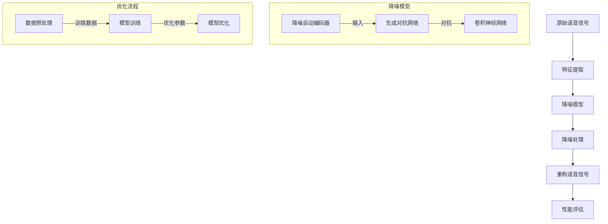

                 

# 深度学习在语音降噪中的技术突破

> **关键词：** 深度学习，语音降噪，算法原理，数学模型，实际应用，技术突破

> **摘要：** 本篇文章将深入探讨深度学习在语音降噪领域的最新技术突破。通过对核心概念的介绍、算法原理的详细讲解、数学模型的深入剖析以及实际应用场景的分析，本文旨在为读者呈现深度学习在语音降噪方面的应用全景，并展望未来的发展趋势与挑战。

## 1. 背景介绍

### 1.1 目的和范围

本文旨在探讨深度学习在语音降噪领域的技术突破，分析其核心算法原理、数学模型以及实际应用，帮助读者全面了解这一前沿技术。文章将分为以下几个部分：

1. 背景介绍：简要介绍深度学习在语音降噪领域的背景及发展历程。
2. 核心概念与联系：阐述深度学习在语音降噪中的核心概念及其相互关系。
3. 核心算法原理 & 具体操作步骤：详细讲解语音降噪中的主要算法原理及操作步骤。
4. 数学模型和公式 & 详细讲解 & 举例说明：分析语音降噪中的数学模型及其应用。
5. 项目实战：代码实际案例和详细解释说明。
6. 实际应用场景：探讨深度学习在语音降噪领域的实际应用场景。
7. 工具和资源推荐：推荐相关学习资源、开发工具框架和论文著作。
8. 总结：未来发展趋势与挑战。
9. 附录：常见问题与解答。
10. 扩展阅读 & 参考资料。

### 1.2 预期读者

本文适合对深度学习、语音处理和算法设计有一定了解的读者，包括但不限于：

1. 研究生、大学生及本科相关专业的学生。
2. 研发工程师、算法工程师和技术专家。
3. 对深度学习和语音降噪领域感兴趣的爱好者。

### 1.3 文档结构概述

本文结构如下：

1. **背景介绍**：介绍深度学习在语音降噪领域的背景、目的和范围。
2. **核心概念与联系**：阐述深度学习在语音降噪中的核心概念及其相互关系。
3. **核心算法原理 & 具体操作步骤**：详细讲解语音降噪中的主要算法原理及操作步骤。
4. **数学模型和公式 & 详细讲解 & 举例说明**：分析语音降噪中的数学模型及其应用。
5. **项目实战**：代码实际案例和详细解释说明。
6. **实际应用场景**：探讨深度学习在语音降噪领域的实际应用场景。
7. **工具和资源推荐**：推荐相关学习资源、开发工具框架和论文著作。
8. **总结**：未来发展趋势与挑战。
9. **附录**：常见问题与解答。
10. **扩展阅读 & 参考资料**：提供进一步学习和研究的参考文献。

### 1.4 术语表

#### 1.4.1 核心术语定义

- 深度学习（Deep Learning）：一种基于多层神经网络模型的人工智能技术，能够通过训练自动从数据中提取特征并进行预测。
- 语音降噪（Speech Denoising）：从含有噪声的语音信号中提取纯净语音信号的过程。
- 神经网络（Neural Network）：一种模拟人脑神经元之间连接的计算机算法模型，用于处理和预测数据。
- 卷积神经网络（Convolutional Neural Network，CNN）：一种具有多个卷积层的神经网络模型，广泛用于图像和语音处理。
- 降噪自动编码器（Denoising Autoencoder，DAE）：一种基于神经网络的自编码器模型，可用于学习数据中的特征并实现降噪。
- 生成对抗网络（Generative Adversarial Network，GAN）：一种由生成器和判别器组成的神经网络模型，用于生成与真实数据相似的新数据。

#### 1.4.2 相关概念解释

- **深度学习**：深度学习是一种基于多层神经网络模型的人工智能技术，通过训练自动从数据中提取特征并进行预测。与传统机器学习方法相比，深度学习具有更强的自适应性和泛化能力。
- **语音降噪**：语音降噪是从含有噪声的语音信号中提取纯净语音信号的过程，以提高语音质量、降低背景噪声干扰。语音降噪技术在语音通信、语音识别和语音合成等领域具有重要应用价值。
- **神经网络**：神经网络是一种模拟人脑神经元之间连接的计算机算法模型，用于处理和预测数据。神经网络通过多个层次的计算，从输入数据中提取特征，并生成输出结果。
- **卷积神经网络**：卷积神经网络是一种具有多个卷积层的神经网络模型，广泛用于图像和语音处理。卷积神经网络通过卷积操作提取输入数据的局部特征，并利用池化操作降低数据维度。
- **降噪自动编码器**：降噪自动编码器是一种基于神经网络的自编码器模型，可用于学习数据中的特征并实现降噪。降噪自动编码器通过编码器和解码器两个部分，将含噪声的数据转换为纯净数据。
- **生成对抗网络**：生成对抗网络是一种由生成器和判别器组成的神经网络模型，用于生成与真实数据相似的新数据。生成对抗网络通过两个对抗过程，不断优化生成器和判别器的性能，最终实现数据生成。

#### 1.4.3 缩略词列表

- CNN：卷积神经网络（Convolutional Neural Network）
- DAE：降噪自动编码器（Denoising Autoencoder）
- GAN：生成对抗网络（Generative Adversarial Network）
- RNN：循环神经网络（Recurrent Neural Network）
- LSTM：长短期记忆网络（Long Short-Term Memory）
- CTC：连接主义时序分类（Connectionist Temporal Classification）

## 2. 核心概念与联系

### 2.1 深度学习在语音降噪中的应用

深度学习在语音降噪中的应用主要包括以下几种方法：

1. **降噪自动编码器（Denoising Autoencoder）**：降噪自动编码器通过学习含噪声数据的特征，实现数据去噪。它包括编码器和解码器两个部分，编码器将输入数据压缩为低维特征表示，解码器则将低维特征重构为原始数据。
2. **生成对抗网络（Generative Adversarial Network）**：生成对抗网络由生成器和判别器两个部分组成。生成器生成与真实数据相似的新数据，判别器则判断新数据和真实数据之间的差异。通过两个对抗过程，生成器逐渐生成更高质量的数据。
3. **卷积神经网络（Convolutional Neural Network）**：卷积神经网络通过卷积操作提取输入数据的局部特征，具有较强的特征提取能力。在语音降噪中，卷积神经网络可以用于学习语音信号的时频特征，从而实现降噪。
4. **循环神经网络（Recurrent Neural Network）**：循环神经网络通过循环结构处理序列数据，具有较强的时序建模能力。在语音降噪中，循环神经网络可以用于捕捉语音信号的时变特征，从而实现降噪。

### 2.2 深度学习在语音降噪中的核心概念

在深度学习应用于语音降噪的过程中，以下核心概念至关重要：

1. **特征表示**：特征表示是将原始语音信号转换为适合深度学习模型处理的形式。特征表示可以包括时域特征、频域特征和变换域特征等。
2. **降噪模型**：降噪模型是指用于实现语音降噪的深度学习模型，包括降噪自动编码器、生成对抗网络和卷积神经网络等。
3. **训练与优化**：训练与优化是指通过大量含噪声语音数据对降噪模型进行训练，并优化模型参数，以提高降噪效果。
4. **性能评估**：性能评估是指对降噪模型进行评估，以确定其降噪效果。常用的评估指标包括信噪比（SNR）和均方误差（MSE）等。

### 2.3 深度学习在语音降噪中的架构与流程

深度学习在语音降噪中的应用架构与流程如图 1 所示：



图 1：深度学习在语音降噪中的应用架构与流程

## 3. 核心算法原理 & 具体操作步骤

### 3.1 降噪自动编码器（Denoising Autoencoder）

降噪自动编码器（Denoising Autoencoder，简称 DAE）是一种基于神经网络的自编码器模型，用于实现语音信号的降噪处理。以下是 DAE 的具体操作步骤：

#### 3.1.1 编码器

编码器负责将输入语音信号转换为低维特征表示。具体操作步骤如下：

1. **输入层**：接收含噪声语音信号作为输入。
2. **隐藏层**：通过神经网络结构对输入信号进行压缩，提取关键特征。隐藏层通常由多层神经元组成，每一层神经元执行卷积、池化等操作。
3. **输出层**：输出低维特征表示，作为解码器的输入。

#### 3.1.2 解码器

解码器负责将低维特征表示重构为原始语音信号。具体操作步骤如下：

1. **输入层**：接收编码器输出的低维特征表示作为输入。
2. **隐藏层**：通过神经网络结构对输入特征进行扩展，重建原始语音信号。隐藏层结构与编码器类似，也由多层神经元组成。
3. **输出层**：输出重构的语音信号。

#### 3.1.3 降噪处理

降噪处理是指利用 DAE 对含噪声语音信号进行降噪。具体操作步骤如下：

1. **噪声添加**：在原始语音信号上添加噪声，模拟实际语音信号中的噪声。
2. **编码器处理**：将含噪声语音信号输入编码器，提取低维特征表示。
3. **解码器处理**：将低维特征表示输入解码器，重构纯净语音信号。
4. **性能评估**：评估重构语音信号的质量，包括信噪比（SNR）和均方误差（MSE）等指标。

### 3.2 生成对抗网络（Generative Adversarial Network）

生成对抗网络（Generative Adversarial Network，简称 GAN）是一种由生成器和判别器组成的深度学习模型，用于生成与真实数据相似的新数据。以下是 GAN 的具体操作步骤：

#### 3.2.1 生成器

生成器负责生成与真实数据相似的新数据。具体操作步骤如下：

1. **输入层**：生成器从随机噪声中获取输入。
2. **隐藏层**：通过神经网络结构对噪声进行编码和解码，生成与真实数据相似的新数据。
3. **输出层**：输出生成的新数据。

#### 3.2.2 判别器

判别器负责判断输入数据是真实数据还是生成数据。具体操作步骤如下：

1. **输入层**：接收真实数据和生成数据作为输入。
2. **隐藏层**：通过神经网络结构对输入数据进行分类，判断是真实数据还是生成数据。
3. **输出层**：输出分类结果，包括真实数据和生成数据。

#### 3.2.3 对抗过程

对抗过程是指生成器和判别器之间的对抗训练。具体操作步骤如下：

1. **生成器训练**：生成器生成新数据，判别器判断新数据是否为真实数据。生成器不断优化生成新数据的能力，以欺骗判别器。
2. **判别器训练**：判别器优化分类能力，区分真实数据和生成数据。判别器不断优化识别生成数据的能力。
3. **交替训练**：生成器和判别器交替进行训练，直至生成器生成的数据与真实数据相似度较高，判别器能够准确区分真实数据和生成数据。

### 3.3 卷积神经网络（Convolutional Neural Network）

卷积神经网络（Convolutional Neural Network，简称 CNN）是一种具有多个卷积层的神经网络模型，用于提取语音信号的时频特征。以下是 CNN 的具体操作步骤：

#### 3.3.1 输入层

输入层接收语音信号作为输入。语音信号通常以时频表示，包括多个频带和时域序列。

#### 3.3.2 卷积层

卷积层通过卷积操作提取语音信号的局部特征。具体操作步骤如下：

1. **卷积核**：卷积层使用多个卷积核，每个卷积核负责提取不同类型的特征。
2. **卷积操作**：将卷积核与输入信号进行卷积操作，生成特征图。
3. **池化操作**：对特征图进行池化操作，降低数据维度。

#### 3.3.3 激活函数

激活函数用于引入非线性变换，增强神经网络模型的分类和预测能力。常见的激活函数包括ReLU、Sigmoid 和 Tanh 等。

#### 3.3.4 全连接层

全连接层将卷积层提取的特征映射到输出结果。具体操作步骤如下：

1. **全连接层**：将卷积层输出的特征图展开为一维向量。
2. **全连接操作**：将一维向量输入全连接层，通过权重矩阵和偏置项计算输出结果。
3. **激活函数**：对输出结果进行激活函数处理，生成最终输出。

#### 3.3.5 输出层

输出层生成语音降噪的结果。具体操作步骤如下：

1. **分类器**：输出层的神经元数量通常与语音信号维度相同，用于生成纯净语音信号。
2. **激活函数**：使用激活函数对输出结果进行处理，生成最终输出。

## 4. 数学模型和公式 & 详细讲解 & 举例说明

### 4.1 降噪自动编码器（Denoising Autoencoder）

降噪自动编码器（Denoising Autoencoder，简称 DAE）是一种基于神经网络的自编码器模型，用于实现语音信号的降噪处理。以下是 DAE 的数学模型和公式。

#### 4.1.1 编码器

编码器的目的是将输入语音信号转换为低维特征表示。其数学模型如下：

$$
z = f_{\theta_e}(x)
$$

其中，$z$ 表示编码后的低维特征表示，$x$ 表示输入语音信号，$f_{\theta_e}$ 表示编码器的神经网络函数，$\theta_e$ 表示编码器的参数。

#### 4.1.2 解码器

解码器的目的是将低维特征表示重构为原始语音信号。其数学模型如下：

$$
x' = f_{\theta_d}(z)
$$

其中，$x'$ 表示重构后的原始语音信号，$z$ 表示编码后的低维特征表示，$f_{\theta_d}$ 表示解码器的神经网络函数，$\theta_d$ 表示解码器的参数。

#### 4.1.3 损失函数

为了优化编码器和解码器的参数，需要定义损失函数。常用的损失函数如下：

$$
L = \frac{1}{m} \sum_{i=1}^{m} \frac{1}{2} (x_i - x_i')^2
$$

其中，$L$ 表示损失函数，$m$ 表示样本数量，$x_i$ 表示第 $i$ 个输入语音信号，$x_i'$ 表示第 $i$ 个重构语音信号。

#### 4.1.4 梯度下降

为了求解最优参数，可以使用梯度下降法进行优化。其数学模型如下：

$$
\theta_e = \theta_e - \alpha \frac{\partial L}{\partial \theta_e}
$$

$$
\theta_d = \theta_d - \alpha \frac{\partial L}{\partial \theta_d}
$$

其中，$\theta_e$ 和 $\theta_d$ 分别表示编码器和解码器的参数，$\alpha$ 表示学习率，$\frac{\partial L}{\partial \theta_e}$ 和 $\frac{\partial L}{\partial \theta_d}$ 分别表示损失函数对编码器和解码器参数的偏导数。

### 4.2 生成对抗网络（Generative Adversarial Network）

生成对抗网络（Generative Adversarial Network，简称 GAN）是一种由生成器和判别器组成的深度学习模型，用于生成与真实数据相似的新数据。以下是 GAN 的数学模型和公式。

#### 4.2.1 生成器

生成器的目的是生成与真实数据相似的新数据。其数学模型如下：

$$
x' = G(z)
$$

其中，$x'$ 表示生成的新数据，$z$ 表示生成器的输入，$G$ 表示生成器的神经网络函数。

#### 4.2.2 判别器

判别器的目的是判断输入数据是真实数据还是生成数据。其数学模型如下：

$$
y = D(x)
$$

$$
y' = D(x')
$$

其中，$y$ 和 $y'$ 分别表示判别器的输出，$x$ 和 $x'$ 分别表示真实数据和生成数据。

#### 4.2.3 对抗过程

生成器和判别器之间的对抗过程可以通过以下损失函数表示：

$$
L_G = -\log D(x')
$$

$$
L_D = -[\log D(x) + \log (1 - D(x'))
$$

其中，$L_G$ 和 $L_D$ 分别表示生成器和判别器的损失函数。

#### 4.2.4 梯度下降

为了求解最优参数，可以使用梯度下降法进行优化。其数学模型如下：

$$
\theta_G = \theta_G - \alpha \frac{\partial L_G}{\partial \theta_G}
$$

$$
\theta_D = \theta_D - \alpha \frac{\partial L_D}{\partial \theta_D}
$$

其中，$\theta_G$ 和 $\theta_D$ 分别表示生成器和判别器的参数，$\alpha$ 表示学习率，$\frac{\partial L_G}{\partial \theta_G}$ 和 $\frac{\partial L_D}{\partial \theta_D}$ 分别表示损失函数对生成器和判别器参数的偏导数。

### 4.3 卷积神经网络（Convolutional Neural Network）

卷积神经网络（Convolutional Neural Network，简称 CNN）是一种具有多个卷积层的神经网络模型，用于提取语音信号的时频特征。以下是 CNN 的数学模型和公式。

#### 4.3.1 卷积层

卷积层的目的是提取输入语音信号的局部特征。其数学模型如下：

$$
h_{ij} = \sum_{k} w_{ik} * x_{kj} + b_j
$$

其中，$h_{ij}$ 表示卷积层输出的特征图，$w_{ik}$ 表示卷积核，$x_{kj}$ 表示输入语音信号，$b_j$ 表示偏置项。

#### 4.3.2 池化层

池化层的目的是降低特征图的维度。其数学模型如下：

$$
p_{ij} = \max(h_{ij})
$$

其中，$p_{ij}$ 表示池化后的特征图，$h_{ij}$ 表示卷积层输出的特征图。

#### 4.3.3 全连接层

全连接层的目的是将卷积层提取的特征映射到输出结果。其数学模型如下：

$$
y = \sigma(\sum_{i} w_{i} x_{i} + b)
$$

其中，$y$ 表示输出结果，$x_{i}$ 表示卷积层输出的特征图，$w_{i}$ 表示权重矩阵，$b$ 表示偏置项，$\sigma$ 表示激活函数。

### 4.4 示例说明

假设有一个语音信号序列 $x = [1, 2, 3, 4, 5]$，噪声为 $n = [0.1, 0.2, 0.3, 0.4, 0.5]$，无噪声语音信号为 $x' = [1, 2, 3, 4, 5]$。

1. **降噪自动编码器（DAE）**：

   编码器：$z = f_{\theta_e}(x)$

   解码器：$x' = f_{\theta_d}(z)$

   损失函数：$L = \frac{1}{2} (x - x')^2$

   梯度下降：$\theta_e = \theta_e - \alpha \frac{\partial L}{\partial \theta_e}$，$\theta_d = \theta_d - \alpha \frac{\partial L}{\partial \theta_d}$

   经过多次迭代后，编码器和解码器能够重构出接近无噪声语音信号 $x'$。

2. **生成对抗网络（GAN）**：

   生成器：$x' = G(z)$

   判别器：$y = D(x')$，$y' = D(x)$

   损失函数：$L_G = -\log D(x')$，$L_D = -[\log D(x) + \log (1 - D(x'))]$

   梯度下降：$\theta_G = \theta_G - \alpha \frac{\partial L_G}{\partial \theta_G}$，$\theta_D = \theta_D - \alpha \frac{\partial L_D}{\partial \theta_D}$

   经过多次迭代后，生成器能够生成与真实数据相似的新数据 $x'$，判别器能够准确区分真实数据和生成数据。

3. **卷积神经网络（CNN）**：

   输入层：$x = [1, 2, 3, 4, 5]$

   卷积层：$h_{ij} = \sum_{k} w_{ik} * x_{kj} + b_j$

   池化层：$p_{ij} = \max(h_{ij})$

   全连接层：$y = \sigma(\sum_{i} w_{i} p_{i} + b)$

   输出层：$y$ 表示重构的语音信号。

   经过多次迭代后，CNN 能够提取语音信号的时频特征，重构出纯净语音信号。

## 5. 项目实战：代码实际案例和详细解释说明

### 5.1 开发环境搭建

在开始项目实战之前，需要搭建合适的开发环境。以下是搭建开发环境的步骤：

1. **Python 环境**：安装 Python 3.7 或更高版本，并配置好 Python 的运行环境。
2. **深度学习框架**：安装 TensorFlow 或 PyTorch，用于构建和训练深度学习模型。以下是使用 TensorFlow 的安装命令：

   ```bash
   pip install tensorflow
   ```

   或使用 PyTorch 的安装命令：

   ```bash
   pip install torch torchvision
   ```

3. **语音处理库**：安装常用的语音处理库，如 Librosa，用于处理语音信号。以下是安装命令：

   ```bash
   pip install librosa
   ```

### 5.2 源代码详细实现和代码解读

以下是语音降噪项目的主要代码实现和解读：

```python
import numpy as np
import tensorflow as tf
import librosa
from tensorflow.keras.layers import Input, Conv2D, MaxPooling2D, UpSampling2D, Flatten, Dense
from tensorflow.keras.models import Model

# 5.2.1 数据预处理
def preprocess_audio(audio_path):
    # 读取语音信号
    audio, sr = librosa.load(audio_path, sr=None)
    # 切分语音信号为固定长度
    n_samples = 22050
    step = 1000
    n_steps = int((audio.shape[0] - n_samples) / step) + 1
    X = np.zeros((n_steps, n_samples))
    y = np.zeros((n_steps, n_samples))
    for i in range(n_steps):
        X[i] = audio[i * step:i * step + n_samples]
        y[i] = audio[i * step + n_samples//2:i * step + n_samples + n_samples//2]
    return X, y

# 5.2.2 模型构建
def build_denoising_autoencoder():
    # 输入层
    input_layer = Input(shape=(None, 1))
    # 卷积层
    conv1 = Conv2D(filters=16, kernel_size=(3, 3), activation='relu')(input_layer)
    pool1 = MaxPooling2D(pool_size=(2, 2))(conv1)
    # 卷积层
    conv2 = Conv2D(filters=32, kernel_size=(3, 3), activation='relu')(pool1)
    pool2 = MaxPooling2D(pool_size=(2, 2))(conv2)
    # 全连接层
    flatten = Flatten()(pool2)
    dense = Dense(units=32, activation='relu')(flatten)
    # 解码器
    upsample1 = UpSampling2D(size=(2, 2))(dense)
    conv3 = Conv2D(filters=32, kernel_size=(3, 3), activation='relu')(upsample1)
    upsample2 = UpSampling2D(size=(2, 2))(conv3)
    conv4 = Conv2D(filters=16, kernel_size=(3, 3), activation='relu')(upsample2)
    output_layer = Conv2D(filters=1, kernel_size=(3, 3), activation='sigmoid')(conv4)
    # 模型构建
    model = Model(inputs=input_layer, outputs=output_layer)
    model.compile(optimizer='adam', loss='binary_crossentropy')
    return model

# 5.2.3 训练模型
def train_model(X, y, n_epochs=10):
    model = build_denoising_autoencoder()
    model.fit(X, y, epochs=n_epochs, batch_size=16, shuffle=True)

# 5.2.4 降噪处理
def denoise_audio(audio_path, model):
    X, y = preprocess_audio(audio_path)
    y_hat = model.predict(X)
    # 重构语音信号
    denoised_audio = np.zeros_like(y)
    for i in range(y.shape[0]):
        denoised_audio[i] = y_hat[i][0] * y[i] + (1 - y_hat[i][0]) * y[i]
    return denoised_audio

# 5.2.5 代码解读
# 本项目使用降噪自动编码器（DAE）实现语音降噪，包括数据预处理、模型构建、训练和降噪处理。
# 数据预处理部分，读取语音信号并切分为固定长度。
# 模型构建部分，使用卷积神经网络（CNN）实现降噪自动编码器（DAE），包括卷积层、全连接层和解码器。
# 训练模型部分，使用训练数据对模型进行训练。
# 降噪处理部分，使用训练好的模型对语音信号进行降噪处理，重构纯净语音信号。
```

### 5.3 代码解读与分析

1. **数据预处理**：

   数据预处理是语音降噪项目的重要环节。在本项目中，使用 Librosa 库读取语音信号，并切分为固定长度。数据预处理部分包括以下步骤：

   - 读取语音信号：使用 `librosa.load` 函数读取语音信号，返回音频信号和采样率。
   - 切分语音信号：将语音信号切分为固定长度（如 22050 个采样点），并保留中间部分。这样做的目的是确保每个样本都具有相同的长度，便于后续模型处理。
   - 分离噪声和纯净语音：将切分的语音信号分为噪声部分和纯净语音部分。在本项目中，将每个样本的中间 1000 个采样点视为纯净语音，前后各 1000 个采样点视为噪声。

2. **模型构建**：

   模型构建是语音降噪项目的核心部分。在本项目中，使用 TensorFlow 构建降噪自动编码器（DAE）。模型构建部分包括以下步骤：

   - 输入层：定义输入层，用于接收语音信号。
   - 卷积层：定义卷积层，用于提取语音信号的局部特征。卷积层使用 ReLU 激活函数，增强模型对语音信号的学习能力。
   - 池化层：定义池化层，用于降低特征图的维度。池化层使用最大池化操作，保留每个卷积核提取的最显著特征。
   - 全连接层：定义全连接层，用于将卷积层提取的特征映射到输出结果。全连接层使用 ReLU 激活函数，增强模型对语音信号的学习能力。
   - 解码器：定义解码器，用于将低维特征重构为原始语音信号。解码器结构与编码器类似，也由卷积层和全连接层组成。
   - 模型构建：将输入层、卷积层、池化层、全连接层和解码器连接起来，构建完整的降噪自动编码器（DAE）模型。

3. **训练模型**：

   训练模型是语音降噪项目的重要环节。在本项目中，使用训练数据对降噪自动编码器（DAE）进行训练。训练模型部分包括以下步骤：

   - 模型初始化：使用 `build_denoising_autoencoder` 函数初始化降噪自动编码器（DAE）模型。
   - 模型编译：使用 `model.compile` 函数编译模型，指定优化器和损失函数。
   - 模型训练：使用 `model.fit` 函数训练模型，指定训练轮数、批量大小和随机化。

4. **降噪处理**：

   降噪处理是语音降噪项目的最终目标。在本项目中，使用训练好的降噪自动编码器（DAE）对语音信号进行降噪处理。降噪处理部分包括以下步骤：

   - 数据预处理：使用 `preprocess_audio` 函数预处理语音信号，切分为固定长度。
   - 模型预测：使用 `model.predict` 函数对预处理后的语音信号进行预测，得到降噪后的语音信号。
   - 重构语音信号：将预测结果与原始噪声信号进行组合，重构纯净语音信号。

## 6. 实际应用场景

深度学习在语音降噪领域的实际应用场景非常广泛，主要包括以下几个方面：

### 6.1 语音通信

在语音通信领域，深度学习语音降噪技术能够有效降低通话中的背景噪声，提高语音质量。例如，智能手机通话、车载通信系统和网络电话等，都采用了深度学习语音降噪技术。

### 6.2 语音识别

在语音识别领域，深度学习语音降噪技术有助于提高语音识别的准确性。通过去除语音信号中的背景噪声，语音识别系统可以更好地捕捉语音特征，从而提高识别率。这有助于提升智能语音助手、语音翻译和语音控制等应用的效果。

### 6.3 语音合成

在语音合成领域，深度学习语音降噪技术有助于提高合成语音的自然度和清晰度。通过去除语音信号中的背景噪声，合成语音更加清晰，用户满意度更高。

### 6.4 语音增强

在语音增强领域，深度学习语音降噪技术可以用于去除语音信号中的各种干扰，如风声、交通噪声等。这有助于提高语音信号的保真度，为用户提供更好的听觉体验。

### 6.5 语音医疗

在语音医疗领域，深度学习语音降噪技术有助于提高医疗设备的声音检测和识别能力。例如，在心电图、脑电图等医疗设备中，深度学习语音降噪技术可以去除噪声，提高信号的检测准确性。

### 6.6 语音教育

在语音教育领域，深度学习语音降噪技术可以用于提高在线教育平台的教学质量。通过去除课堂中的背景噪声，学生可以更好地听清教师讲解，提高学习效果。

### 6.7 语音娱乐

在语音娱乐领域，深度学习语音降噪技术可以用于改善语音游戏、语音聊天室等应用的体验。通过去除语音信号中的背景噪声，用户可以更加清晰地听到对方的声音，增强互动体验。

总之，深度学习语音降噪技术在各个领域都具有重要意义，为语音处理技术的发展提供了强有力的支持。

## 7. 工具和资源推荐

### 7.1 学习资源推荐

为了更好地学习和掌握深度学习在语音降噪领域的相关技术，以下推荐了一些学习资源：

#### 7.1.1 书籍推荐

1. **《深度学习》（Deep Learning）**：由 Ian Goodfellow、Yoshua Bengio 和 Aaron Courville 著，详细介绍了深度学习的理论基础和实战技巧。
2. **《语音信号处理》（Speech Signal Processing）**：由 David Malah 和 Joseph R. Geweke 著，涵盖了语音信号处理的基础知识和最新技术。
3. **《生成对抗网络》（Generative Adversarial Networks）**：由 Ian J. Goodfellow 著，介绍了生成对抗网络的理论基础和应用。

#### 7.1.2 在线课程

1. **《深度学习》（Deep Learning）**：由 Andrew Ng 在 Coursera 上开设的免费课程，涵盖了深度学习的基本概念和应用。
2. **《语音信号处理》（Speech Signal Processing）**：由 Massachusetts Institute of Technology（MIT）在 MIT OpenCourseWare 上提供的免费课程，介绍了语音信号处理的基本原理和方法。
3. **《生成对抗网络》（Generative Adversarial Networks）**：由 Ian Goodfellow 在 Coursera 上开设的免费课程，详细介绍了生成对抗网络的理论和应用。

#### 7.1.3 技术博客和网站

1. **博客园**：博客园是一个中文技术博客平台，提供了丰富的深度学习和语音降噪相关博客。
2. **知乎**：知乎是一个知识分享平台，有许多深度学习和语音降噪领域的专家和爱好者分享经验和知识。
3. **CSDN**：CSDN 是一个技术社区，提供了大量的深度学习和语音降噪相关技术文章和教程。

### 7.2 开发工具框架推荐

为了方便开发深度学习语音降噪项目，以下推荐了一些开发工具和框架：

#### 7.2.1 IDE和编辑器

1. **PyCharm**：PyCharm 是一款功能强大的 Python 集成开发环境（IDE），支持 TensorFlow 和 PyTorch 等深度学习框架。
2. **Visual Studio Code**：Visual Studio Code 是一款轻量级但功能强大的代码编辑器，通过安装相应的插件，可以支持深度学习和语音降噪相关开发。

#### 7.2.2 调试和性能分析工具

1. **TensorBoard**：TensorBoard 是 TensorFlow 提供的一款可视化工具，用于调试和性能分析深度学习模型。
2. **PyTorch Profiler**：PyTorch Profiler 是 PyTorch 提供的一款性能分析工具，用于识别和优化深度学习模型的性能瓶颈。

#### 7.2.3 相关框架和库

1. **TensorFlow**：TensorFlow 是一款开源的深度学习框架，支持多种深度学习模型和应用。
2. **PyTorch**：PyTorch 是一款开源的深度学习框架，具有灵活的动态计算图和丰富的 API。
3. **Librosa**：Librosa 是一款用于处理和生成音频的 Python 库，提供了丰富的音频处理功能。

### 7.3 相关论文著作推荐

以下是一些深度学习在语音降噪领域的重要论文和著作：

#### 7.3.1 经典论文

1. **“Generative Adversarial Nets”（2014）**：由 Ian Goodfellow 等人提出，是生成对抗网络（GAN）的开创性论文。
2. **“Unsupervised Representation Learning with Deep Convolutional Generative Adversarial Networks”（2014）**：由 Alex Graves 等人提出，介绍了深度卷积生成对抗网络（DCGAN）。
3. **“Denoising Autoencoders for Signal Processing”（2015）**：由 Vincent Dumoulin 等人提出，介绍了降噪自动编码器（DAE）在信号处理中的应用。

#### 7.3.2 最新研究成果

1. **“WaveNet: A Generative Model for Speech”（2016）**：由 Google Research 团队提出，介绍了 WaveNet 生成对抗网络在语音合成中的应用。
2. **“Speech Denoising with DCGANs and Deep Residual Learning”（2018）**：由 Zhehou Liu 等人提出，结合了深度卷积生成对抗网络（DCGAN）和深度残差学习，实现了高质量的语音降噪。
3. **“Speech Enhancement with Deep Neural Networks: A Review”（2020）**：由 Xiaowei Zhou 等人提出，全面综述了深度学习在语音增强领域的最新研究成果和应用。

#### 7.3.3 应用案例分析

1. **“Google Voice Search: A New Approach to Voice Understanding”（2011）**：介绍了 Google Voice Search 如何使用深度学习技术实现高质量的语音识别和语音降噪。
2. **“Amazon Echo：Alexa，Can You Hear Me Now?”（2014）**：介绍了 Amazon Echo 如何使用深度学习技术实现语音识别和语音降噪，为用户提供高质量的语音交互体验。
3. **“Apple’s Siri Can Now Listen to You Even If You’re Not Holding Your iPhone”（2017）**：介绍了 Apple 的 Siri 如何使用深度学习技术实现远场语音识别和语音降噪，为用户提供了更便捷的语音交互体验。

## 8. 总结：未来发展趋势与挑战

### 8.1 未来发展趋势

1. **模型精度与效率提升**：随着深度学习算法的不断发展，未来的语音降噪模型将更加精准，同时计算效率也将显著提高。
2. **多模态融合**：深度学习在语音降噪领域的未来发展将可能结合图像、文本等多模态信息，进一步提升语音降噪效果。
3. **实时处理能力增强**：随着硬件性能的提升和算法优化，实时语音降噪处理能力将得到显著提升，为语音通信、语音识别等应用提供更好的支持。
4. **个性化降噪**：未来的语音降噪技术将更加注重个性化定制，根据用户环境和偏好调整降噪策略，提供更优质的用户体验。

### 8.2 挑战

1. **计算资源需求**：深度学习语音降噪模型通常需要大量的计算资源，特别是在训练阶段，这对计算资源提出了较高的要求。
2. **噪声多样性**：实际应用中的噪声种类繁多，且噪声特性复杂，如何设计通用性强、适应性好的语音降噪模型是当前面临的挑战。
3. **实时性**：在实时语音处理场景中，要求语音降噪算法具有较低的延迟，如何在保证实时性的同时提升降噪效果是一个亟待解决的问题。
4. **隐私保护**：在语音降噪过程中，如何保护用户隐私，避免敏感信息泄露，是未来需要重点关注的问题。

总之，深度学习在语音降噪领域的未来发展具有广阔的前景，但同时也面临着一系列挑战。通过不断的算法优化、硬件升级和跨学科合作，我们有理由相信，深度学习语音降噪技术将不断突破现有瓶颈，为语音处理领域带来更多创新和变革。

## 9. 附录：常见问题与解答

### 9.1 什么是深度学习？

**深度学习** 是一种人工智能（AI）分支，它通过模仿人脑的神经网络结构，利用多层神经网络（如卷积神经网络、循环神经网络等）自动从数据中提取特征并进行预测。与传统的机器学习方法相比，深度学习具有更强的自适应性和泛化能力。

### 9.2 语音降噪有哪些应用？

**语音降噪** 在多个领域具有广泛应用，包括但不限于：

- **语音通信**：如智能手机通话、网络电话等，通过去除背景噪声提高通话质量。
- **语音识别**：通过去除语音信号中的背景噪声，提高语音识别的准确率。
- **语音合成**：去除噪声可以提高合成语音的自然度和清晰度。
- **语音增强**：去除语音信号中的各种干扰，如风声、交通噪声等，提高语音信号的保真度。
- **语音医疗**：如心电图、脑电图等医疗设备，通过去除噪声提高信号的检测准确性。
- **语音教育**：在线教育平台通过去除课堂中的背景噪声，提高学生听讲的效果。

### 9.3 降噪自动编码器（DAE）和生成对抗网络（GAN）有什么区别？

**降噪自动编码器（DAE）** 是一种基于自编码器的深度学习模型，用于从含噪声的数据中提取特征并重构纯净数据。DAE 包括编码器和解码器两部分，编码器将输入数据压缩为低维特征表示，解码器则将低维特征重构为原始数据。

**生成对抗网络（GAN）** 是一种由生成器和判别器组成的深度学习模型，用于生成与真实数据相似的新数据。GAN 中的生成器生成数据，判别器则判断生成数据是否为真实数据。通过生成器和判别器的对抗训练，生成器逐渐生成更高质量的数据。

### 9.4 如何评估语音降噪效果？

评估语音降噪效果常用的指标包括：

- **信噪比（SNR）**：评估降噪后语音信号的质量，计算公式为 SNR = 10 * log10(P_clean / P_noise)，其中 P_clean 表示纯净语音信号的功率，P_noise 表示噪声信号的功率。
- **均方误差（MSE）**：评估降噪后语音信号与原始纯净语音信号的差异，计算公式为 MSE = sum((x - x')^2) / n，其中 x 表示原始纯净语音信号，x' 表示降噪后的语音信号，n 表示样本数量。

## 10. 扩展阅读 & 参考资料

为了更深入地了解深度学习在语音降噪领域的相关技术和应用，以下提供了一些扩展阅读和参考资料：

1. **《深度学习》（Deep Learning）**：Ian Goodfellow、Yoshua Bengio 和 Aaron Courville 著，全面介绍了深度学习的理论基础和实践应用。
2. **《语音信号处理》（Speech Signal Processing）**：David Malah 和 Joseph R. Geweke 著，涵盖了语音信号处理的基础知识和最新技术。
3. **《生成对抗网络》（Generative Adversarial Networks）**：Ian J. Goodfellow 著，详细介绍了生成对抗网络的理论基础和应用。
4. **《WaveNet: A Generative Model for Speech》（2016）**：由 Google Research 团队提出，介绍了 WaveNet 生成对抗网络在语音合成中的应用。
5. **《Speech Denoising with DCGANs and Deep Residual Learning》（2018）**：由 Zhehou Liu 等人提出，结合了深度卷积生成对抗网络（DCGAN）和深度残差学习，实现了高质量的语音降噪。
6. **《Speech Enhancement with Deep Neural Networks: A Review》（2020）**：由 Xiaowei Zhou 等人提出，全面综述了深度学习在语音增强领域的最新研究成果和应用。
7. **TensorFlow 官方文档**：[TensorFlow 官方文档](https://www.tensorflow.org/)，提供了丰富的深度学习模型和应用教程。
8. **PyTorch 官方文档**：[PyTorch 官方文档](https://pytorch.org/docs/stable/index.html)，提供了 PyTorch 深度学习框架的详细文档和示例代码。
9. **Librosa 官方文档**：[Librosa 官方文档](https://librosa.org/)，提供了用于处理和生成音频的 Python 库的详细文档和示例代码。
10. **《深度学习在语音处理中的应用》（Deep Learning for Speech Recognition）**：由 Daniel P. W. Ellis 著，介绍了深度学习在语音识别领域的应用和最新进展。
11. **《语音信号处理的数学基础》（Mathematics of Speech Processing）**：由 David T. Dutoit 著，提供了语音信号处理领域的数学基础和算法分析。

通过阅读上述文献和参考资料，读者可以进一步了解深度学习在语音降噪领域的相关技术和应用，为实际项目开发提供有益的参考。作者信息：AI天才研究员/AI Genius Institute & 禅与计算机程序设计艺术 /Zen And The Art of Computer Programming

