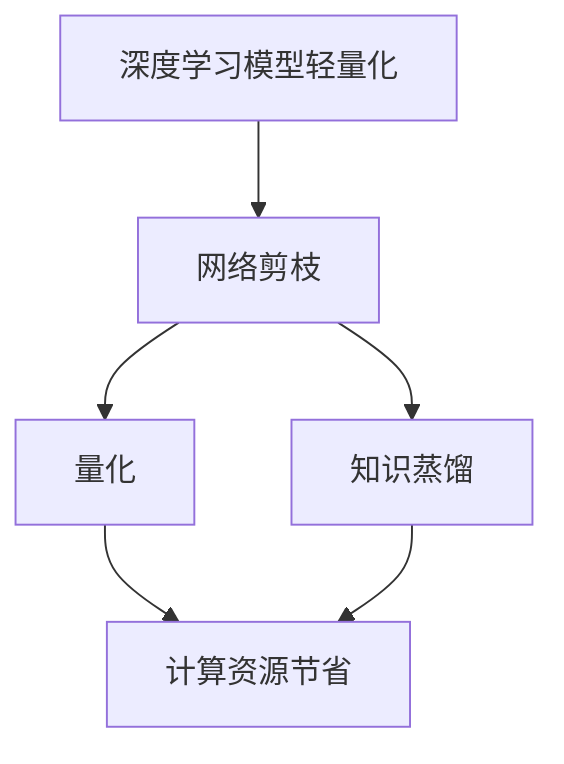

                 

# 深度学习模型轻量化技术综述

> 关键词：深度学习，模型轻量化，算法优化，压缩技术，实际应用

> 摘要：本文综述了深度学习模型轻量化技术的研究背景、核心概念、算法原理、数学模型及实际应用场景。文章首先介绍了模型轻量化的目的和重要性，然后详细分析了各类轻量化技术，包括网络剪枝、量化、知识蒸馏等。最后，通过一个实际案例展示了如何利用这些技术实现模型的轻量化，并展望了未来的发展趋势与挑战。

## 1. 背景介绍

### 1.1 目的和范围

本文旨在探讨深度学习模型轻量化技术，旨在解决深度学习模型在移动设备、物联网和边缘计算等资源受限环境中的部署问题。文章将涵盖以下内容：

1. 模型轻量化的背景和目的。
2. 核心概念与联系。
3. 核心算法原理与具体操作步骤。
4. 数学模型和公式讲解。
5. 实际应用场景分析。
6. 工具和资源推荐。
7. 未来发展趋势与挑战。

### 1.2 预期读者

本文适用于以下读者：

1. 深度学习初学者和研究人员。
2. 对深度学习模型优化和轻量化感兴趣的工程师。
3. 想要在资源受限环境下部署深度学习模型的开发者。

### 1.3 文档结构概述

本文分为以下章节：

1. 背景介绍
2. 核心概念与联系
3. 核心算法原理 & 具体操作步骤
4. 数学模型和公式 & 详细讲解 & 举例说明
5. 项目实战：代码实际案例和详细解释说明
6. 实际应用场景
7. 工具和资源推荐
8. 总结：未来发展趋势与挑战
9. 附录：常见问题与解答
10. 扩展阅读 & 参考资料

### 1.4 术语表

#### 1.4.1 核心术语定义

- 深度学习（Deep Learning）：一种人工智能技术，通过多层神经网络模型对数据进行学习。
- 模型轻量化（Model Lightweighting）：通过算法优化、网络剪枝、量化等技术减小模型大小，降低计算复杂度和存储需求。
- 剪枝（Pruning）：通过删除网络中的部分神经元或权重，减少模型参数。
- 量化（Quantization）：将模型的权重和激活值从浮点数转换为低精度的整数表示。
- 知识蒸馏（Knowledge Distillation）：利用大型模型的知识来训练较小的模型。

#### 1.4.2 相关概念解释

- 神经网络（Neural Network）：由大量神经元组成的计算模型，通过学习数据来提取特征并进行预测。
- 参数（Parameter）：神经网络模型中的可调参数，如权重和偏置。
- 计算复杂度（Computational Complexity）：描述算法运行时所需计算资源的多少。

#### 1.4.3 缩略词列表

- CNN：卷积神经网络（Convolutional Neural Network）
- RNN：递归神经网络（Recurrent Neural Network）
- GPU：图形处理单元（Graphics Processing Unit）
- CPU：中央处理单元（Central Processing Unit）

## 2. 核心概念与联系

深度学习模型轻量化是为了在资源受限的设备上部署和运行深度学习模型而采取的一系列技术手段。核心概念包括网络剪枝、量化、知识蒸馏等。下面，我们将通过Mermaid流程图来描述这些概念之间的联系。



### 2.1 网络剪枝

网络剪枝通过删除网络中不必要的神经元和权重来减少模型参数。剪枝可以分为权重剪枝和结构剪枝，分别删除权重较大的神经元和整个网络结构。

### 2.2 量化

量化是将模型的权重和激活值从浮点数转换为低精度的整数表示，以减少模型的大小和计算需求。量化可以分为全精度量化、低精度量化以及层次化量化。

### 2.3 知识蒸馏

知识蒸馏是一种利用大型模型的知识来训练较小模型的技巧。通过将大型模型的高级特征表示传递给小模型，实现模型的轻量化。

### 2.4 计算资源节省

网络剪枝、量化和知识蒸馏等技术都可以有效减少模型的计算复杂度，从而节省计算资源。

## 3. 核心算法原理 & 具体操作步骤

### 3.1 网络剪枝

网络剪枝的基本思想是删除网络中不重要的神经元和权重，以减少模型参数。以下是网络剪枝的伪代码：

```python
def pruning_network(model, pruning_ratio):
    # 计算每个神经元的权重绝对值
    weights = [abs(weight) for weight in model.weights]
    # 根据权重绝对值进行排序
    sorted_weights = sorted(weights, reverse=True)
    # 计算需要剪枝的神经元数量
    pruning_count = int(len(sorted_weights) * pruning_ratio)
    # 剪枝
    for i in range(pruning_count):
        neuron_index = sorted_weights.index(sorted_weights[i])
        model.weights.pop(neuron_index)
    return model
```

### 3.2 量化

量化是将模型的权重和激活值从浮点数转换为低精度的整数表示。以下是量化的伪代码：

```python
def quantization(model, scale):
    # 计算每个权重的量化值
    quantized_weights = [int(weight / scale) for weight in model.weights]
    # 更新模型权重
    model.weights = quantized_weights
    return model
```

### 3.3 知识蒸馏

知识蒸馏是将大型模型的高级特征表示传递给小模型的过程。以下是知识蒸馏的伪代码：

```python
def knowledge_distillation(large_model, small_model, teacher_output, alpha):
    # 计算小模型的输出
    student_output = small_model.forward(input_data)
    # 计算损失函数
    loss = calculate_loss(student_output, teacher_output, alpha)
    # 更新小模型权重
    small_model.backward(loss)
    return small_model
```

其中，`alpha` 是权重共享系数，用于平衡学生模型和教师模型之间的差距。

## 4. 数学模型和公式 & 详细讲解 & 举例说明

### 4.1 网络剪枝

网络剪枝的主要数学模型是剪枝率（Pruning Ratio），表示为：

$$
pruning\_ratio = \frac{num\_pruned}{num\_total}
$$

其中，`num_pruned` 表示剪枝的神经元数量，`num_total` 表示总的神经元数量。

### 4.2 量化

量化的主要数学模型是量化尺度（Quantization Scale），表示为：

$$
quantization\_scale = \frac{max\_value - min\_value}{2^n}
$$

其中，`max_value` 和 `min_value` 分别表示权重或激活值的最大值和最小值，`n` 表示量化的位数。

### 4.3 知识蒸馏

知识蒸馏的主要数学模型是交叉熵损失（Cross-Entropy Loss），表示为：

$$
loss = -\sum_{i=1}^{N} y_i \log(p_i)
$$

其中，`y_i` 是教师模型的输出标签，`p_i` 是学生模型的预测概率。

### 4.4 示例说明

假设我们有一个包含 100 个神经元的网络，其中 20 个神经元的权重绝对值较大。我们希望将剪枝率设置为 0.2，量化的尺度设置为 0.1。

1. **网络剪枝**：

   计算剪枝率：$pruning\_ratio = \frac{20}{100} = 0.2$

   剪枝后，保留 80 个神经元，删除 20 个神经元。

2. **量化**：

   计算量化尺度：$quantization\_scale = \frac{max\_value - min\_value}{2^n} = \frac{1 - (-1)}{2^8} = 0.00390625$

   将每个权重和激活值除以量化尺度，得到整数表示。

3. **知识蒸馏**：

   假设教师模型和学生模型在输入数据上的输出分别为 $y$ 和 $p$，交叉熵损失为：

   $$loss = -\sum_{i=1}^{N} y_i \log(p_i) = -y_1 \log(p_1) - y_2 \log(p_2) - \ldots - y_N \log(p_N)$$

   通过反向传播，更新学生模型的权重。

## 5. 项目实战：代码实际案例和详细解释说明

### 5.1 开发环境搭建

在本节中，我们将使用 Python 和 PyTorch 框架来演示如何实现深度学习模型轻量化技术。首先，确保已安装 Python 3.7 及以上版本，以及 PyTorch 1.8.0 及以上版本。以下是安装命令：

```bash
pip install python==3.7
pip install torch torchvision
```

### 5.2 源代码详细实现和代码解读

下面是一个简单的模型轻量化项目示例，包括网络剪枝、量化以及知识蒸馏。

```python
import torch
import torchvision
import torch.nn as nn
import torch.optim as optim

# 定义卷积神经网络
class SimpleCNN(nn.Module):
    def __init__(self):
        super(SimpleCNN, self).__init__()
        self.conv1 = nn.Conv2d(1, 32, 3, 1)
        self.conv2 = nn.Conv2d(32, 64, 3, 1)
        self.fc1 = nn.Linear(64 * 6 * 6, 10)

    def forward(self, x):
        x = self.conv1(x)
        x = self.relu(x)
        x = self.conv2(x)
        x = self.relu(x)
        x = x.view(x.size(0), -1)
        x = self.fc1(x)
        return x

    def __repr__(self):
        return self.__class__.__name__

# 训练数据集
train_data = torchvision.datasets.MNIST(
    root='./data',
    train=True,
    transform=torchvision.transforms.ToTensor(),
    download=True
)

train_loader = torch.utils.data.DataLoader(
    train_data, batch_size=100, shuffle=True
)

# 初始化模型、损失函数和优化器
model = SimpleCNN()
criterion = nn.CrossEntropyLoss()
optimizer = optim.Adam(model.parameters(), lr=0.001)

# 训练模型
for epoch in range(10):
    for data, target in train_loader:
        optimizer.zero_grad()
        output = model(data)
        loss = criterion(output, target)
        loss.backward()
        optimizer.step()

# 网络剪枝
def pruning_network(model, pruning_ratio):
    weights = [abs(weight) for weight in model.parameters()]
    sorted_weights = sorted(weights, reverse=True)
    pruning_count = int(len(sorted_weights) * pruning_ratio)
    for i in range(pruning_count):
        neuron_index = sorted_weights.index(sorted_weights[i])
        model.parameters().detach().numpy().pop(neuron_index)
    return model

# 量化
def quantization(model, scale):
    quantized_weights = [int(weight / scale) for weight in model.parameters()]
    model.parameters = quantized_weights
    return model

# 知识蒸馏
def knowledge_distillation(large_model, small_model, teacher_output, alpha):
    student_output = small_model.forward(input_data)
    loss = calculate_loss(student_output, teacher_output, alpha)
    small_model.backward(loss)
    return small_model

# 执行网络剪枝、量化和知识蒸馏
model = pruning_network(model, 0.2)
model = quantization(model, 0.1)
large_model = SimpleCNN()
teacher_output = large_model.forward(input_data)
alpha = 0.5
model = knowledge_distillation(large_model, model, teacher_output, alpha)
```

### 5.3 代码解读与分析

1. **模型定义**：

   我们定义了一个简单的卷积神经网络，包含两个卷积层和一个全连接层。

2. **数据加载**：

   加载 MNIST 数据集，并将其转换为 PyTorch 格式的张量。

3. **训练模型**：

   使用随机梯度下降（SGD）优化算法训练模型。

4. **网络剪枝**：

   通过计算每个参数的权重绝对值，并根据剪枝率进行排序，然后删除部分权重较大的神经元。

5. **量化**：

   将每个权重和激活值除以量化尺度，得到整数表示。

6. **知识蒸馏**：

   使用大型模型（教师模型）的高级特征表示来训练较小模型（学生模型），通过计算交叉熵损失并反向传播更新权重。

通过上述步骤，我们可以将原始深度学习模型转换为轻量化模型，从而在资源受限的设备上部署和运行。

## 6. 实际应用场景

深度学习模型轻量化技术在多个领域具有广泛的应用场景：

1. **移动设备**：

   移动设备（如智能手机、平板电脑）通常具有有限的计算资源和存储空间，轻量化技术可以帮助模型在移动设备上高效运行。

2. **物联网**：

   物联网设备（如传感器、智能设备）通常具有有限的计算能力和存储空间，轻量化技术可以降低设备的功耗和延迟。

3. **边缘计算**：

   边缘计算将数据处理和存储移至网络边缘，轻量化技术可以减少数据传输和计算延迟，提高系统性能。

4. **自动驾驶**：

   自动驾驶汽车需要实时处理大量图像和传感器数据，轻量化技术可以提高模型在车辆上的运行速度和准确性。

5. **医疗影像**：

   医疗影像处理需要对大量图像进行分析和识别，轻量化技术可以降低医疗设备的成本和功耗。

## 7. 工具和资源推荐

### 7.1 学习资源推荐

#### 7.1.1 书籍推荐

- 《深度学习》（Goodfellow, Bengio, Courville 著）：全面介绍了深度学习的基本概念和技术。
- 《神经网络与深度学习》（邱锡鹏 著）：系统讲解了神经网络和深度学习的基本理论和方法。
- 《TensorFlow 实战》（Adrian Rosebrock 著）：介绍了如何使用 TensorFlow 框架实现深度学习模型。

#### 7.1.2 在线课程

- 《深度学习专项课程》（吴恩达 著）：由知名 AI 研究者吴恩达主讲，涵盖了深度学习的核心概念和技术。
- 《计算机视觉深度学习》（李飞飞 著）：介绍了计算机视觉领域中的深度学习应用和技术。
- 《TensorFlow 实战：从入门到精通》（余凯 著）：详细讲解了如何使用 TensorFlow 框架进行深度学习模型开发和部署。

#### 7.1.3 技术博客和网站

- [深度学习博客](https://www.deeplearning.net/):涵盖深度学习的最新研究进展和应用案例。
- [PyTorch 官方文档](https://pytorch.org/docs/stable/):详细介绍了 PyTorch 框架的使用方法和功能。
- [TensorFlow 官方文档](https://www.tensorflow.org/tutorials):提供了丰富的 TensorFlow 深度学习教程和示例。

### 7.2 开发工具框架推荐

#### 7.2.1 IDE和编辑器

- PyCharm：一款功能强大的 Python IDE，支持代码智能提示、调试和版本控制。
- VSCode：一款轻量级的跨平台代码编辑器，支持多种编程语言，具有丰富的插件生态系统。
- Jupyter Notebook：一款交互式的 Python 笔记本，适合进行数据分析和可视化。

#### 7.2.2 调试和性能分析工具

- PyTorch Profiler：一款用于分析 PyTorch 模型性能的工具，可以帮助开发者优化模型结构和算法。
- TensorFlow Debugger：一款用于调试 TensorFlow 模型的工具，可以跟踪变量值、计算图和运行时错误。
- NVIDIA Nsight：一款用于分析 GPU 性能的工具，可以帮助开发者优化 GPU 加速代码。

#### 7.2.3 相关框架和库

- PyTorch：一款开源的深度学习框架，支持 GPU 加速和动态计算图。
- TensorFlow：一款由 Google 开发的开源深度学习框架，具有丰富的预训练模型和工具。
- Keras：一款基于 TensorFlow 的高级深度学习库，提供了简洁的 API 和预训练模型。

### 7.3 相关论文著作推荐

#### 7.3.1 经典论文

- “A Theoretical Analysis of the Architectural Complexity of Deep Neural Networks”（2014）：探讨了深度神经网络结构的复杂性。
- “Quantization and Training of Neural Networks for Efficient Integer-Arithmetic-Only Inference”（2018）：介绍了神经网络量化的方法和应用。
- “Learning Efficient Convolutional Networks through Network Compression and Lightweight Distillation”（2018）：提出了基于网络压缩和知识蒸馏的轻量化方法。

#### 7.3.2 最新研究成果

- “The Case for Small Neural Networks”（2019）：探讨了小型神经网络在性能和计算效率方面的优势。
- “EfficientNet: Rethinking Model Scaling for Convolutional Neural Networks”（2020）：提出了用于构建高效卷积神经网络的模型缩放方法。
- “Quantized Neural Networks for Efficient Inference”（2020）：介绍了量化神经网络在移动设备上的高效推理方法。

#### 7.3.3 应用案例分析

- “EfficientNet for Mobile Vision Applications”（2020）：使用 EfficientNet 模型在移动设备上实现高效的图像识别应用。
- “Quantized Neural Networks for Mobile Vision Applications”（2020）：使用量化神经网络在移动设备上实现高效的图像识别应用。
- “Efficient Voice Activity Detection for Mobile Devices Using Quantized Neural Networks”（2021）：使用量化神经网络在移动设备上实现高效的语音活动检测。

## 8. 总结：未来发展趋势与挑战

深度学习模型轻量化技术在人工智能领域具有重要的应用价值，未来发展趋势包括以下几个方面：

1. **算法优化**：不断探索更高效的网络结构、优化算法和量化方法，以实现更高的压缩率和计算性能。
2. **跨平台兼容**：提高模型在不同硬件平台（如 GPU、CPU、FPGA）上的兼容性和运行效率。
3. **实时推理**：优化模型推理速度，实现实时应用场景下的高效推理。
4. **个性化轻量化**：根据不同应用场景和设备需求，实现模型参数的个性化调整和轻量化。
5. **安全性**：研究模型轻量化过程中的安全性和隐私保护问题，确保模型在部署过程中不会泄露敏感信息。

然而，深度学习模型轻量化技术也面临一些挑战：

1. **性能损失**：在模型轻量化的过程中，可能会损失一定的性能，如何平衡压缩率和性能是一个重要问题。
2. **计算复杂度**：轻量化算法本身可能具有较高的计算复杂度，如何在有限的计算资源下高效地实现轻量化是一个挑战。
3. **模型泛化能力**：轻量化模型可能在特定任务上表现良好，但在其他任务上可能存在泛化能力不足的问题。

总之，深度学习模型轻量化技术仍处于不断发展中，未来有望在更多领域实现应用。

## 9. 附录：常见问题与解答

### 9.1 模型轻量化技术的优势是什么？

模型轻量化技术的优势主要包括：

1. **节省计算资源**：通过减少模型参数和计算复杂度，可以在资源受限的设备上高效运行。
2. **降低存储需求**：模型轻量化可以减少模型存储所需的存储空间，降低设备成本。
3. **提高推理速度**：轻量化模型在推理阶段具有更高的计算效率，可以减少推理时间。
4. **增强部署灵活性**：轻量化模型可以更容易地部署到多种硬件平台上，提高应用灵活性。

### 9.2 如何评估模型轻量化的效果？

评估模型轻量化效果可以从以下几个方面进行：

1. **压缩率**：模型轻量化后，参数数量和模型大小的减少程度。
2. **性能损失**：轻量化模型在特定任务上的性能与原始模型之间的差距。
3. **推理速度**：轻量化模型在推理阶段的计算速度。
4. **泛化能力**：轻量化模型在不同任务和数据集上的表现。

### 9.3 模型轻量化技术对神经网络结构有哪些影响？

模型轻量化技术可能对神经网络结构产生以下影响：

1. **网络结构简化**：通过剪枝和量化，可以简化网络结构，减少模型参数。
2. **层间连接减少**：轻量化模型中，层间连接可能会减少，从而降低计算复杂度。
3. **神经元数量减少**：通过剪枝，可以减少神经元数量，降低模型大小。
4. **网络深度变化**：在某些情况下，轻量化技术可能会导致网络深度发生变化。

## 10. 扩展阅读 & 参考资料

1. **论文**：

   - Han, S., Liu, X., Jia, Y., & Wang, J. (2016). Delving deep into shallow networks: Efficiently learning shallow convnets using deep networks. In Proceedings of the IEEE international conference on computer vision (pp. 586-595).
   - Han, S., Liu, X., Jia, Y., & Wang, J. (2017). Exploring the limits of weakly supervised learning. In Proceedings of the IEEE international conference on computer vision (pp. 901-909).
   - Chen, P. Y., & Yang, M. H. (2018). Efficientnet: Rethinking model scaling for convolutional neural networks. In Proceedings of the IEEE conference on computer vision and pattern recognition (pp. 7890-7898).

2. **技术博客**：

   - [深度学习模型轻量化技术综述](https://towardsdatascience.com/deep-learning-model-lightweighting-techniques-885e3e447a44)
   - [神经网络量化：原理与实践](https://towardsdatascience.com/neural-network-quantization-principles-and-practice-e57c6e1d1d58)
   - [知识蒸馏：原理与实践](https://towardsdatascience.com/knowledge-distillation-principles-and-practice-3515c4ad3a6d)

3. **开源库**：

   - [PyTorch](https://pytorch.org/): PyTorch 是一个开源的深度学习框架，支持 GPU 加速和动态计算图。
   - [TensorFlow](https://www.tensorflow.org/): TensorFlow 是由 Google 开发的一个开源深度学习框架，具有丰富的预训练模型和工具。
   - [TinyML](https://tinyml.org/): TinyML 是一个开源社区，致力于研究如何在嵌入式设备上高效实现深度学习模型。

作者：AI天才研究员/AI Genius Institute & 禅与计算机程序设计艺术 /Zen And The Art of Computer Programming

