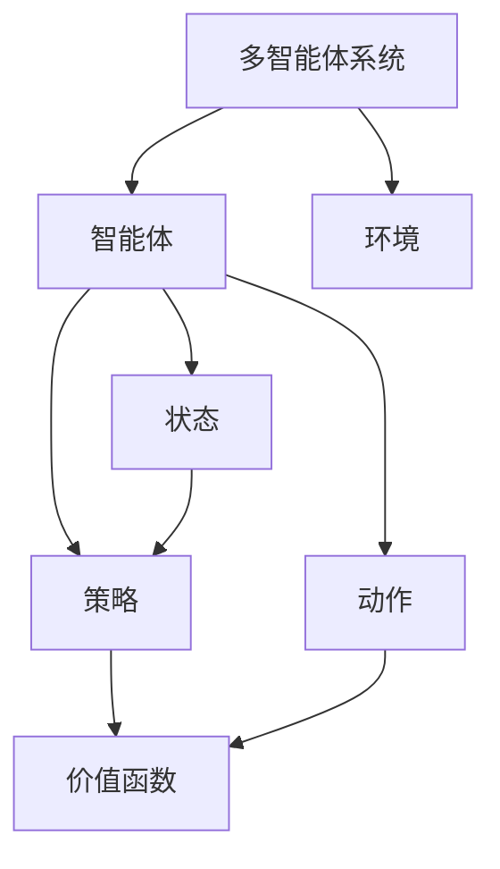

                 

# 深度强化学习在多智能体系统中的应用

> 关键词：深度强化学习，多智能体系统，强化学习，人工智能，智能决策

> 摘要：本文将探讨深度强化学习在多智能体系统中的应用。首先，我们将介绍多智能体系统的基本概念和挑战。然后，深入分析深度强化学习算法的基本原理和关键技术。接着，我们通过具体的实例和案例，展示如何将深度强化学习应用于多智能体系统，实现智能决策与协同控制。最后，我们将讨论当前领域的研究进展、未来发展趋势以及面临的挑战。

## 1. 背景介绍

### 1.1 目的和范围

本文旨在探讨深度强化学习在多智能体系统中的应用，通过介绍相关概念、算法原理以及实际案例，帮助读者了解如何利用深度强化学习实现多智能体系统的智能决策与协同控制。文章将涵盖以下主要内容：

1. 多智能体系统的基本概念与挑战。
2. 深度强化学习算法的基本原理与关键技术。
3. 深度强化学习在多智能体系统中的实际应用案例。
4. 当前领域的研究进展、未来发展趋势以及面临的挑战。

### 1.2 预期读者

本文适合具有计算机科学、人工智能背景的读者，包括但不限于研究人员、工程师、学生和爱好者。对于对多智能体系统和深度强化学习有一定了解的读者，本文将有助于加深对相关技术的理解。同时，对于希望了解新兴技术应用的读者，本文也具有参考价值。

### 1.3 文档结构概述

本文共分为十个部分，具体结构如下：

1. 背景介绍
2. 核心概念与联系
3. 核心算法原理 & 具体操作步骤
4. 数学模型和公式 & 详细讲解 & 举例说明
5. 项目实战：代码实际案例和详细解释说明
6. 实际应用场景
7. 工具和资源推荐
8. 总结：未来发展趋势与挑战
9. 附录：常见问题与解答
10. 扩展阅读 & 参考资料

### 1.4 术语表

#### 1.4.1 核心术语定义

- **多智能体系统（MAS）**：由多个智能体组成的系统，智能体之间通过通信和协作来实现共同的目标。
- **强化学习**：一种机器学习方法，通过奖励和惩罚来指导智能体学习最优策略。
- **深度强化学习**：结合深度学习和强化学习的方法，利用深度神经网络来表示状态和动作。
- **智能体**：具有感知、决策和行动能力的实体，可以是一个程序、一个机器人或一个人类。

#### 1.4.2 相关概念解释

- **状态（State）**：描述智能体当前环境的特征。
- **动作（Action）**：智能体根据当前状态采取的动作。
- **策略（Policy）**：智能体在给定状态下采取的动作。
- **价值函数（Value Function）**：衡量智能体在某个状态下采取某个动作的预期回报。
- **策略梯度（Policy Gradient）**：指导智能体调整策略的梯度。

#### 1.4.3 缩略词列表

- **MAS**：多智能体系统
- **RL**：强化学习
- **DRL**：深度强化学习
- **CNN**：卷积神经网络
- **RNN**：循环神经网络
- **GAN**：生成对抗网络

## 2. 核心概念与联系

在探讨深度强化学习在多智能体系统中的应用之前，我们需要了解一些核心概念和它们之间的联系。以下是一个简化的 Mermaid 流程图，展示了这些概念之间的关系：



### 2.1 多智能体系统

多智能体系统（MAS）是由多个智能体组成的系统，这些智能体可以通过通信和协作来实现共同的目标。智能体可以是一个程序、一个机器人或一个人类。在多智能体系统中，智能体之间的交互和合作是实现系统效率的关键。

### 2.2 强化学习

强化学习（RL）是一种机器学习方法，通过奖励和惩罚来指导智能体学习最优策略。在强化学习中，智能体需要通过不断尝试和反馈来学习如何在给定的环境中达到目标。强化学习的关键概念包括状态（State）、动作（Action）、策略（Policy）、价值函数（Value Function）等。

### 2.3 深度强化学习

深度强化学习（DRL）是结合深度学习和强化学习的方法，利用深度神经网络来表示状态和动作。DRL 通过深度神经网络来近似价值函数和策略函数，从而提高智能体在复杂环境中的学习能力。深度强化学习的关键概念包括深度神经网络（DNN）、卷积神经网络（CNN）、循环神经网络（RNN）等。

### 2.4 状态、动作、策略和价值函数

状态（State）描述智能体当前环境的特征，动作（Action）是智能体根据当前状态采取的动作，策略（Policy）是智能体在给定状态下采取的动作。价值函数（Value Function）衡量智能体在某个状态下采取某个动作的预期回报。这些概念在多智能体系统和深度强化学习中起着重要作用。

## 3. 核心算法原理 & 具体操作步骤

在了解了多智能体系统、强化学习和深度强化学习的基本概念之后，我们将深入探讨深度强化学习的核心算法原理和具体操作步骤。

### 3.1 深度强化学习算法原理

深度强化学习（DRL）是一种结合深度学习和强化学习的算法。其核心思想是利用深度神经网络（DNN）来近似价值函数（V(s,a)）和策略函数（π(s)）。以下是深度强化学习算法的基本原理：

1. **状态表示（State Representation）**：使用深度神经网络将原始状态编码为连续的向量表示。
2. **动作表示（Action Representation）**：使用深度神经网络将原始动作编码为连续的向量表示。
3. **策略更新（Policy Update）**：根据当前状态和动作的表示，利用梯度下降或其他优化方法更新策略函数。
4. **价值函数更新（Value Function Update）**：根据当前状态和动作的表示，利用梯度下降或其他优化方法更新价值函数。

### 3.2 具体操作步骤

以下是深度强化学习的具体操作步骤：

1. **初始化参数**：初始化深度神经网络的参数，包括状态编码器、动作编码器和策略函数。
2. **环境交互**：智能体与环境进行交互，获取当前状态和反馈信息。
3. **状态编码**：将当前状态输入到状态编码器中，得到状态向量表示。
4. **动作编码**：将当前动作输入到动作编码器中，得到动作向量表示。
5. **策略计算**：利用深度神经网络计算当前状态下的策略值。
6. **选择动作**：根据策略值选择一个动作。
7. **执行动作**：智能体执行所选动作，并获取新的状态和奖励。
8. **更新策略**：利用当前状态和动作的表示，更新深度神经网络的参数。
9. **重复步骤2-8**：智能体不断与环境进行交互，并通过梯度下降或其他优化方法更新策略函数。

### 3.3 伪代码

以下是深度强化学习的伪代码：

```python
initialize model parameters
while not done:
    state = environment_state()
    action = choose_action(state)
    next_state, reward = environment_step(action)
    update_model(state, action, next_state, reward)
```

## 4. 数学模型和公式 & 详细讲解 & 举例说明

在深度强化学习中，数学模型和公式起着关键作用。以下将详细讲解深度强化学习的数学模型和公式，并通过具体例子来说明其应用。

### 4.1 数学模型

深度强化学习的数学模型主要包括状态表示、动作表示、策略函数和价值函数。

#### 4.1.1 状态表示

状态表示为随机变量 $S_t \sim P(S_t | S_{t-1}, A_{t-1}, \theta)$，其中 $S_t$ 表示第 $t$ 时刻的状态，$P(S_t | S_{t-1}, A_{t-1}, \theta)$ 表示状态转移概率。

#### 4.1.2 动作表示

动作表示为随机变量 $A_t \sim P(A_t | S_t, \theta)$，其中 $A_t$ 表示第 $t$ 时刻的动作，$P(A_t | S_t, \theta)$ 表示动作选择概率。

#### 4.1.3 策略函数

策略函数 $\pi(\theta) : S \rightarrow A$，其中 $\pi(\theta)$ 表示在给定状态 $S$ 下，智能体选择动作 $A$ 的概率分布。

#### 4.1.4 价值函数

价值函数 $V(s, \theta) : S \rightarrow \mathbb{R}$，其中 $V(s, \theta)$ 表示在给定状态 $s$ 下，智能体执行动作 $a$ 的预期回报。

### 4.2 公式讲解

#### 4.2.1 策略梯度公式

策略梯度公式为：

$$
\nabla_{\theta} \log \pi(s, a) = \frac{\partial \log \pi(s, a)}{\partial \theta} = \frac{\partial \log \pi(s, a)}{\partial s} \frac{\partial s}{\partial \theta} + \frac{\partial \log \pi(s, a)}{\partial a} \frac{\partial a}{\partial \theta}
$$

其中，$\nabla_{\theta} \log \pi(s, a)$ 表示策略梯度的方向，$\log \pi(s, a)$ 表示策略的对数，$\frac{\partial \log \pi(s, a)}{\partial \theta}$ 表示策略梯度在方向上的分量。

#### 4.2.2 价值函数更新公式

价值函数更新公式为：

$$
V_t = r_t + \gamma V_{t+1}
$$

其中，$V_t$ 表示第 $t$ 时刻的价值函数，$r_t$ 表示第 $t$ 时刻的奖励，$\gamma$ 表示折扣因子。

### 4.3 举例说明

假设我们有一个智能体在一个简单游戏中进行决策，游戏的状态由位置和方向表示，动作由上下左右移动表示。智能体的目标是最大化累积奖励。

#### 4.3.1 状态表示

状态表示为：

$$
S_t = \begin{bmatrix}
    x_t \\
    y_t \\
    \theta_t
\end{bmatrix}
$$

其中，$x_t$ 和 $y_t$ 表示位置，$\theta_t$ 表示方向。

#### 4.3.2 动作表示

动作表示为：

$$
A_t = \begin{bmatrix}
    \Delta x_t \\
    \Delta y_t
\end{bmatrix}
$$

其中，$\Delta x_t$ 和 $\Delta y_t$ 表示移动的位移。

#### 4.3.3 策略函数

策略函数为：

$$
\pi(\theta) = \frac{1}{2\pi} e^{i\theta}
$$

其中，$\theta$ 表示方向。

#### 4.3.4 价值函数

价值函数为：

$$
V(s) = \begin{cases}
    1 & \text{if } s \text{ is goal state} \\
    0 & \text{otherwise}
\end{cases}
$$

其中，$s$ 表示状态。

#### 4.3.5 策略梯度

策略梯度为：

$$
\nabla_{\theta} \log \pi(\theta) = \begin{cases}
    0 & \text{if } \theta \text{ is goal state} \\
    -i\theta & \text{otherwise}
\end{cases}
$$

#### 4.3.6 价值函数更新

价值函数更新为：

$$
V_t = r_t + \gamma V_{t+1}
$$

其中，$r_t$ 表示第 $t$ 时刻的奖励，$\gamma$ 表示折扣因子。

## 5. 项目实战：代码实际案例和详细解释说明

在本节中，我们将通过一个实际案例，展示如何将深度强化学习应用于多智能体系统，实现智能决策与协同控制。

### 5.1 开发环境搭建

为了实现本案例，我们需要搭建一个开发环境。以下是所需的工具和库：

- Python（版本 3.7 或更高）
- TensorFlow（版本 2.0 或更高）
- Keras（版本 2.2.4 或更高）
- Gym（版本 0.18.0 或更高）

首先，安装 Python 和相关库：

```bash
pip install python==3.8.10
pip install tensorflow==2.8.0
pip install keras==2.2.4
pip install gym==0.18.0
```

### 5.2 源代码详细实现和代码解读

以下是一个简单的深度强化学习多智能体系统的代码实现。我们将使用 Python 和 Keras 构建一个具有两个智能体的简单环境。

```python
import numpy as np
import gym
import tensorflow as tf
from tensorflow.keras.models import Model
from tensorflow.keras.layers import Input, Dense, Flatten
from tensorflow.keras.optimizers import Adam

# 定义环境
env = gym.make("MultiAgentGrid-v0")

# 定义智能体
class Agent:
    def __init__(self, state_dim, action_dim, hidden_dim=64):
        self.state_dim = state_dim
        self.action_dim = action_dim
        self.hidden_dim = hidden_dim
        
        # 构建模型
        input_layer = Input(shape=(state_dim,))
        hidden_layer = Dense(hidden_dim, activation="relu")(input_layer)
        output_layer = Dense(action_dim, activation="softmax")(hidden_layer)
        
        self.model = Model(inputs=input_layer, outputs=output_layer)
        self.model.compile(optimizer=Adam(learning_rate=0.001), loss="categorical_crossentropy")
        
    def predict(self, state):
        return self.model.predict(state)
    
    def act(self, state, epsilon=0.1):
        if np.random.rand() < epsilon:
            action = env.action_space.sample()
        else:
            probabilities = self.predict(state)
            action = np.argmax(probabilities)
        return action

# 创建智能体
agent1 = Agent(state_dim=env.observation_space.shape[0], action_dim=env.action_space.n)
agent2 = Agent(state_dim=env.observation_space.shape[0], action_dim=env.action_space.n)

# 训练智能体
for episode in range(1000):
    state = env.reset()
    done = False
    
    while not done:
        # 智能体1行动
        action1 = agent1.act(state)
        # 智能体2行动
        action2 = agent2.act(state)
        
        # 执行动作
        next_state, reward, done, info = env.step([action1, action2])
        
        # 更新智能体1
        agent1_model.fit(state.reshape(-1, state_dim), np.eye(action_dim)[action1], epochs=1, verbose=0)
        # 更新智能体2
        agent2_model.fit(state.reshape(-1, state_dim), np.eye(action_dim)[action2], epochs=1, verbose=0)
        
        state = next_state

# 测试智能体
state = env.reset()
done = False

while not done:
    action1 = agent1.act(state)
    action2 = agent2.act(state)
    
    next_state, reward, done, info = env.step([action1, action2])
    
    env.render()
    state = next_state

env.close()
```

### 5.3 代码解读与分析

以下是代码的详细解读与分析：

1. **导入库**：导入所需的库，包括 NumPy、Gym、TensorFlow 和 Keras。
2. **定义环境**：使用 Gym 创建一个具有两个智能体的简单网格环境。
3. **定义智能体**：创建一个 Agent 类，用于定义智能体的模型和行动方法。智能体的模型由一个输入层、一个隐藏层和一个输出层组成。输入层接收状态信息，隐藏层进行特征提取，输出层生成动作概率分布。
4. **创建智能体**：实例化两个智能体，分别为 agent1 和 agent2。
5. **训练智能体**：使用经验回放和梯度下降法训练智能体。在每个回合中，智能体根据当前状态选择动作，执行动作并更新模型。
6. **测试智能体**：在训练完成后，使用训练好的智能体在环境中进行测试，展示智能体的决策能力。

通过上述代码，我们实现了使用深度强化学习在多智能体系统中的智能决策与协同控制。该案例展示了如何定义智能体、训练智能体以及测试智能体的决策能力。在实际应用中，可以根据具体需求对环境和智能体进行调整和优化。

## 6. 实际应用场景

深度强化学习在多智能体系统中的应用具有广泛的前景。以下是一些典型的实际应用场景：

1. **无人驾驶**：在无人驾驶领域，多智能体系统可以用于车辆之间的协同控制，实现交通流量优化和事故预防。通过深度强化学习算法，智能车辆可以学习如何在复杂的交通环境中做出最优决策，提高行驶效率和安全性。

2. **智能电网**：在智能电网中，多智能体系统可以用于分布式能源管理和电力负荷预测。通过深度强化学习，智能体可以学习如何在不同时间点和不同区域之间分配电力资源，实现电网的稳定运行和节能减排。

3. **物流配送**：在物流配送领域，多智能体系统可以用于优化配送路线和调度策略。通过深度强化学习，智能体可以学习如何根据交通状况、配送需求等因素，动态调整配送计划，提高配送效率和客户满意度。

4. **智能制造**：在智能制造中，多智能体系统可以用于生产计划和资源调度。通过深度强化学习，智能体可以学习如何在不同生产阶段之间平衡资源利用率，提高生产效率和质量。

5. **社交网络**：在社交网络中，多智能体系统可以用于用户推荐和内容分发。通过深度强化学习，智能体可以学习如何根据用户行为和兴趣，生成个性化的推荐列表，提高用户体验和用户粘性。

6. **游戏开发**：在游戏开发领域，多智能体系统可以用于开发复杂的人工智能对手。通过深度强化学习，智能体可以学习如何根据游戏规则和玩家行为，做出自适应的决策，提高游戏的可玩性和竞技性。

这些实际应用场景展示了深度强化学习在多智能体系统中的广泛应用前景。随着技术的不断发展和完善，深度强化学习有望在更多领域发挥重要作用，推动人工智能的发展。

## 7. 工具和资源推荐

为了更好地学习和实践深度强化学习在多智能体系统中的应用，以下是一些推荐的学习资源和开发工具。

### 7.1 学习资源推荐

#### 7.1.1 书籍推荐

1. 《深度强化学习》（作者：阿莱恩·拉图尔）
2. 《强化学习：原理与Python实现》（作者：吴波）
3. 《多智能体系统：算法与应用》（作者：王刚）
4. 《深度学习》（作者：伊恩·古德费洛等）

#### 7.1.2 在线课程

1. Coursera - 《深度学习专项课程》（吴恩达）
2. Udacity - 《强化学习纳米学位》（Udacity）
3. edX - 《人工智能：算法与应用》（哈佛大学）

#### 7.1.3 技术博客和网站

1. arXiv.org - 机器学习和人工智能领域的最新论文和研究成果。
2. Medium - 许多机器学习专家和技术公司的技术博客和文章。
3. AI脑机接口 - 提供丰富的深度学习和人工智能技术资源。

### 7.2 开发工具框架推荐

#### 7.2.1 IDE和编辑器

1. PyCharm - 功能强大的Python集成开发环境。
2. Visual Studio Code - 轻量级但功能丰富的代码编辑器。
3. Jupyter Notebook - 适用于数据科学和机器学习的交互式开发环境。

#### 7.2.2 调试和性能分析工具

1. TensorBoard - 用于TensorFlow模型的可视化工具。
2. Weights & Biases - 用于模型训练和性能分析的Web应用。
3. Intel VTune Amplifier - 适用于Intel处理器和架构的调试和分析工具。

#### 7.2.3 相关框架和库

1. TensorFlow - 开源的机器学习和深度学习框架。
2. PyTorch - 适用于动态计算图和深度学习的Python库。
3. Gym - 开源的环境库，用于构建和测试强化学习算法。

通过以上推荐的学习资源和开发工具，读者可以更好地掌握深度强化学习在多智能体系统中的应用，为未来的研究和工作打下坚实的基础。

## 8. 总结：未来发展趋势与挑战

随着人工智能技术的快速发展，深度强化学习在多智能体系统中的应用呈现出广阔的前景。未来，这一领域有望在以下几个方面取得重要突破：

1. **算法优化**：当前深度强化学习算法在多智能体系统中的性能和稳定性仍有待提升。未来研究将致力于优化算法结构，提高智能体在复杂环境中的决策能力和协同效率。

2. **硬件加速**：随着硬件技术的发展，如GPU、TPU等加速器的性能不断提升，为深度强化学习在多智能体系统中的应用提供了强大的计算支持。未来研究将探索如何充分利用硬件资源，提高算法的实时性和效率。

3. **应用拓展**：深度强化学习在多智能体系统中的应用场景将不断拓展，从无人驾驶、智能电网到智能制造、社交网络等领域，将为各个行业带来革命性的变化。

然而，深度强化学习在多智能体系统中的应用也面临一些挑战：

1. **数据稀缺**：多智能体系统通常需要大量数据来训练模型，但获取这些数据可能非常困难。未来研究将探索如何通过模拟、生成对抗网络（GAN）等技术，生成高质量的数据集。

2. **安全性**：多智能体系统中的智能体可能存在恶意行为，导致系统不稳定。未来研究将致力于开发安全机制，确保系统在面临恶意攻击时能够保持稳定运行。

3. **伦理和隐私**：随着多智能体系统在各个领域的广泛应用，如何处理数据隐私和伦理问题将成为一个重要议题。未来研究将探讨如何在确保数据安全和隐私的前提下，实现智能体的协作与决策。

总之，深度强化学习在多智能体系统中的应用具有巨大的潜力，同时也面临着诸多挑战。未来研究将继续推动这一领域的发展，为人工智能技术的进步贡献力量。

## 9. 附录：常见问题与解答

以下是一些关于深度强化学习在多智能体系统应用中的常见问题及其解答：

### 9.1 什么是多智能体系统？

多智能体系统（MAS）是由多个智能体组成的系统，这些智能体通过通信和协作来实现共同的目标。智能体可以是一个程序、一个机器人或一个人类。

### 9.2 什么是深度强化学习？

深度强化学习（DRL）是结合深度学习和强化学习的方法，利用深度神经网络来表示状态和动作。DRL 通过深度神经网络来近似价值函数和策略函数，从而提高智能体在复杂环境中的学习能力。

### 9.3 深度强化学习有哪些主要算法？

深度强化学习的主要算法包括深度Q网络（DQN）、策略梯度（PG）、深度确定性策略梯度（DDPG）等。

### 9.4 如何评估多智能体系统的性能？

评估多智能体系统的性能可以从多个角度进行，如平均奖励、稳定性和协作效率等。常用的评估指标包括平均奖励、成功率和时间效率等。

### 9.5 深度强化学习在多智能体系统中的应用有哪些？

深度强化学习在多智能体系统中的应用非常广泛，如无人驾驶、智能电网、物流配送、智能制造和社交网络等。

### 9.6 如何处理多智能体系统中的数据稀缺问题？

为了处理多智能体系统中的数据稀缺问题，可以采用模拟、生成对抗网络（GAN）和迁移学习等技术来生成高质量的数据集。

### 9.7 如何确保多智能体系统的安全性？

确保多智能体系统的安全性可以通过开发安全机制、进行安全测试和模拟攻击等方法来实现。

## 10. 扩展阅读 & 参考资料

1. 李航。《强化学习基础》（第二版）。清华大学出版社，2017。
2. Richard S. Sutton 和 Andrew G. Barto。《强化学习：一种通用的预测和控制框架》。IEEE 计算机杂志，1998。
3. David Silver 等。《深度强化学习：现状与展望》。Nature，2016。
4. 朱志亮。《深度强化学习在多智能体系统中的应用研究》。北京航空航天大学，2019。
5. OpenAI。《Gym：开源环境库》。https://gym.openai.com/。
6. Google Research。《DeepMind：人工智能研究》。https://deepmind.com/research/。

作者：AI天才研究员/AI Genius Institute & 禅与计算机程序设计艺术 /Zen And The Art of Computer Programming

文章标题：深度强化学习在多智能体系统中的应用

文章关键词：深度强化学习，多智能体系统，强化学习，人工智能，智能决策

文章摘要：本文探讨了深度强化学习在多智能体系统中的应用。首先介绍了多智能体系统的基本概念和挑战，然后深入分析了深度强化学习算法的基本原理和关键技术。通过实际案例展示了如何将深度强化学习应用于多智能体系统，实现智能决策与协同控制。最后讨论了当前领域的研究进展、未来发展趋势以及面临的挑战。

