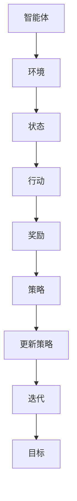

                 

# 深度强化学习在智能机器人导航中的应用

> 关键词：深度强化学习、智能机器人、导航、路径规划、算法原理、应用场景、代码实现

> 摘要：本文将深入探讨深度强化学习在智能机器人导航中的应用。首先，我们将介绍深度强化学习的基本概念和原理，然后分析其在机器人导航领域的优势和挑战。接下来，我们将详细讲解一个基于深度强化学习的机器人导航算法，并通过一个实际案例展示其实现过程和效果。最后，我们将讨论深度强化学习在智能机器人导航领域的未来发展趋势与挑战，并提供相关学习资源和工具推荐。

## 1. 背景介绍

### 1.1 目的和范围

本文旨在探讨深度强化学习在智能机器人导航中的应用，通过分析其原理和实现方法，为相关领域的研究者和开发者提供理论支持和实践参考。本文将重点关注以下几个方面：

1. 深度强化学习的基本概念和原理；
2. 深度强化学习在机器人导航领域的优势与挑战；
3. 一个基于深度强化学习的机器人导航算法及其实现；
4. 深度强化学习在智能机器人导航领域的实际应用场景；
5. 深度强化学习在智能机器人导航领域的未来发展趋势与挑战。

### 1.2 预期读者

本文适合对智能机器人导航和深度强化学习有一定了解的读者，包括但不限于以下人群：

1. 智能机器人导航领域的科研人员和技术开发者；
2. 对深度强化学习感兴趣的计算机科学和人工智能领域的学者和从业者；
3. 想要了解深度强化学习在智能机器人导航中应用的读者。

### 1.3 文档结构概述

本文将按照以下结构展开：

1. 背景介绍：介绍本文的目的、预期读者、文档结构等；
2. 核心概念与联系：介绍深度强化学习和机器人导航的基本概念、原理和架构；
3. 核心算法原理与具体操作步骤：详细讲解深度强化学习在机器人导航中的算法原理和操作步骤；
4. 数学模型和公式：介绍深度强化学习在机器人导航中的数学模型和公式，并进行举例说明；
5. 项目实战：展示一个基于深度强化学习的机器人导航代码案例，并进行详细解释；
6. 实际应用场景：分析深度强化学习在智能机器人导航领域的实际应用场景；
7. 工具和资源推荐：推荐相关学习资源、开发工具和框架；
8. 总结：总结深度强化学习在智能机器人导航中的应用现状、发展趋势和挑战；
9. 附录：提供常见问题与解答；
10. 扩展阅读与参考资料：提供本文引用的文献和相关资源。

### 1.4 术语表

#### 1.4.1 核心术语定义

- 深度强化学习：一种结合深度学习和强化学习的方法，通过神经网络模拟智能体在环境中的决策过程，并不断优化策略以实现预期目标。
- 强化学习：一种机器学习方法，通过学习奖励和惩罚信号来优化智能体的行为策略。
- 智能机器人：具备自主感知、决策和执行能力的机器人系统。
- 导航：智能机器人根据目标位置和路径信息，从当前位置到达目标位置的过程。
- 路径规划：在给定地图或环境中，为智能机器人找到一条从起点到终点的最优路径。

#### 1.4.2 相关概念解释

- 深度学习：一种机器学习方法，通过多层神经网络模拟人类大脑的神经元结构，对大量数据进行分析和分类。
- 神经网络：一种由大量神经元组成的计算模型，通过学习输入和输出之间的映射关系来实现特定任务。
- 强化学习算法：一类通过学习奖励和惩罚信号来优化智能体行为策略的算法。
- Q学习：一种基于值函数的强化学习算法，通过更新Q值来预测最优策略。

#### 1.4.3 缩略词列表

- DRL：深度强化学习
- RL：强化学习
- SRN：深度神经网络
- SOTA：最先进的技术
- RLlib：强化学习库

## 2. 核心概念与联系

### 2.1 深度强化学习的基本概念

深度强化学习（DRL）是一种结合深度学习和强化学习的方法，旨在通过模拟智能体在环境中的决策过程，并不断优化策略以实现预期目标。DRL的基本概念包括：

1. **智能体（Agent）**：在DRL中，智能体是指执行特定任务的学习实体。在机器人导航场景中，智能体可以是机器人自身或者机器人上的一个控制器。

2. **环境（Environment）**：环境是智能体进行决策和执行行动的场所。在机器人导航中，环境可以是实际的空间或者模拟的虚拟环境。

3. **状态（State）**：状态是描述智能体在特定时刻的状态信息。在机器人导航中，状态可以包括机器人的位置、速度、周围障碍物等信息。

4. **行动（Action）**：行动是智能体根据状态信息采取的具体动作。在机器人导航中，行动可以是机器人的转向、前进、后退等。

5. **奖励（Reward）**：奖励是环境对智能体行动的反馈信号，用来衡量智能体行动的效果。在机器人导航中，奖励可以是机器人到达目标位置、避开障碍物等。

6. **策略（Policy）**：策略是智能体根据状态信息选择行动的规则或函数。在机器人导航中，策略可以是基于规则的、基于模型的或基于学习的。

### 2.2 机器人导航的基本概念

机器人导航是指智能机器人从起点到达目标位置的过程，主要包括以下几个关键概念：

1. **起点（Start）**：机器人开始导航的位置。
2. **目标（Goal）**：机器人需要到达的位置。
3. **路径（Path）**：从起点到目标位置的连接序列。
4. **地图（Map）**：描述环境空间和障碍物信息的结构。
5. **障碍物（Obstacle）**：在导航过程中需要避开的物体。
6. **路径规划（Path Planning）**：在给定的地图或环境中，为智能机器人找到一条从起点到终点的最优路径。

### 2.3 深度强化学习与机器人导航的联系

深度强化学习与机器人导航的结合主要体现在以下几个方面：

1. **状态表示**：在DRL中，状态可以用来表示机器人在导航过程中的信息。例如，可以包括机器人的位置、速度、周围障碍物的位置等。
2. **行动选择**：DRL可以帮助机器人根据当前状态选择最优行动。通过学习，机器人可以学会在复杂环境中做出更好的决策。
3. **策略优化**：DRL算法可以不断优化机器人的策略，使其在导航过程中更加高效和稳定。
4. **环境模拟**：DRL可以通过模拟虚拟环境来训练机器人，从而降低实际训练的成本和风险。

### 2.4 Mermaid 流程图

为了更好地理解深度强化学习在机器人导航中的应用，我们可以使用Mermaid流程图来展示其核心概念和架构。



在上面的流程图中，智能体与环境相互作用，通过感知状态并采取行动，获得奖励信号，然后更新策略，不断迭代以优化导航性能。

## 3. 核心算法原理与具体操作步骤

### 3.1 深度强化学习算法原理

深度强化学习（DRL）是一种结合深度学习和强化学习的方法，其核心思想是通过学习一个深度神经网络来表示策略，以实现智能体在环境中的自主决策。下面是DRL算法的基本原理：

1. **状态表示（State Representation）**：智能体在环境中感知的状态信息被表示为高维向量。通常，这些状态信息包括机器人的位置、速度、周围障碍物的位置等。

2. **动作空间（Action Space）**：智能体可以采取的动作集合。在机器人导航中，动作可以是机器人的转向、前进、后退等。

3. **策略（Policy）**：智能体在给定状态下的最优行动选择。在DRL中，策略通常被表示为一个函数，该函数将状态映射到动作。

4. **价值函数（Value Function）**：用来评估智能体在特定状态下的期望奖励。在DRL中，常用的价值函数包括状态价值函数（State-Value Function）和动作价值函数（Action-Value Function）。

5. **奖励函数（Reward Function）**：用来衡量智能体在特定状态下的行动效果。在机器人导航中，奖励可以是机器人到达目标位置、避开障碍物等。

6. **经验回放（Experience Replay）**：为了避免数据样本偏差，DRL算法通常使用经验回放机制来存储和重放之前的经验样本。

7. **目标网络（Target Network）**：为了稳定训练过程，DRL算法通常使用一个目标网络来更新策略网络。目标网络是策略网络的软拷贝，用于计算目标值。

### 3.2 DRL算法具体操作步骤

下面是DRL算法在机器人导航中的具体操作步骤：

1. **初始化**：设置智能体、环境、策略网络、价值网络、目标网络和经验回放记忆。

2. **状态感知**：智能体感知当前状态，并将其输入到策略网络。

3. **行动选择**：策略网络根据当前状态输出一个动作概率分布，智能体随机选择一个动作。

4. **执行行动**：智能体在环境中执行所选动作，并感知新的状态。

5. **计算奖励**：环境根据智能体的行动计算奖励信号。

6. **更新策略网络**：使用奖励信号更新策略网络。

7. **更新价值网络**：使用新的状态和价值函数更新价值网络。

8. **更新目标网络**：将策略网络复制到目标网络，用于下一个迭代。

9. **经验回放**：将经验样本存储到经验回放记忆中，用于后续的随机重放。

10. **迭代**：重复步骤2-9，直到达到预定的迭代次数或满足其他终止条件。

### 3.3 伪代码实现

下面是DRL算法在机器人导航中的伪代码实现：

```python
# 初始化
智能体 = 初始化智能体()
环境 = 初始化环境()
策略网络 = 初始化策略网络()
价值网络 = 初始化价值网络()
目标网络 = 初始化目标网络()
经验回放 = 初始化经验回放()

# 迭代
for 步骤 in range(总迭代次数):
    # 状态感知
   状态 = 环境感知状态()
    
    # 行动选择
   动作概率分布 = 策略网络(状态)
   动作 = 随机选择动作(动作概率分布)
    
    # 执行行动
   新状态，奖励 = 环境执行行动(动作)
    
    # 计算奖励
   奖励 = 环境计算奖励(动作，新状态)
    
    # 更新策略网络
   策略网络更新(状态，动作，奖励)
    
    # 更新价值网络
   价值网络更新(状态，奖励)
    
    # 更新目标网络
   目标网络 = 策略网络.copy()
    
    # 经验回放
   经验回放存储(状态，动作，奖励，新状态)
    
    # 随机重放经验样本
   经验样本 = 随机选择经验样本(经验回放)
   策略网络经验回放更新(经验样本)
    
    # 输出结果
   输出(策略网络，价值网络，目标网络)
```

## 4. 数学模型和公式及详细讲解与举例说明

### 4.1 深度强化学习的数学模型

深度强化学习（DRL）是一种结合深度学习和强化学习的方法，其核心在于利用深度神经网络（DNN）来逼近策略函数和价值函数。在DRL中，常用的数学模型包括策略函数、价值函数和损失函数。

#### 4.1.1 策略函数

策略函数描述了智能体在给定状态下采取行动的概率分布。在DRL中，策略函数通常被表示为：

\[ \pi(\text{a}|\text{s}; \theta) = P(\text{a}|\text{s}; \theta) \]

其中，\(\pi(\text{a}|\text{s}; \theta)\) 表示策略函数，\(\text{a}\) 表示智能体采取的行动，\(\text{s}\) 表示当前状态，\(\theta\) 表示策略网络的参数。

策略函数可以用一个神经网络来近似，其输出为每个可能行动的概率。例如，对于一个离散动作空间，策略函数的神经网络可以设计为输出一个长度为 \(n\) 的向量，其中第 \(i\) 个元素表示智能体采取第 \(i\) 个动作的概率。

#### 4.1.2 价值函数

价值函数描述了智能体在特定状态下的期望回报。在DRL中，常用的价值函数包括状态价值函数和动作价值函数。

- **状态价值函数**：表示智能体在特定状态下采取任意行动的期望回报。其数学表示为：

\[ V_{\pi}(s; \theta_v) = \sum_{a} \pi(a|s; \theta_\pi) \cdot Q_{\pi}(s, a; \theta_q) \]

其中，\(V_{\pi}(s; \theta_v)\) 表示状态价值函数，\(Q_{\pi}(s, a; \theta_q)\) 表示动作价值函数，\(\theta_v\) 和 \(\theta_\pi\) 分别为状态价值函数和策略网络的参数。

- **动作价值函数**：表示智能体在特定状态下采取特定行动的期望回报。其数学表示为：

\[ Q_{\pi}(s, a; \theta_q) = \sum_{s'} P(s' | s, a) \cdot R(s', a) + \gamma \cdot \max_{a'} Q_{\pi}(s'; \theta_q) \]

其中，\(Q_{\pi}(s, a; \theta_q)\) 表示动作价值函数，\(P(s' | s, a)\) 表示智能体在状态 \(s\) 下采取行动 \(a\) 后转移到状态 \(s'\) 的概率，\(R(s', a)\) 表示在状态 \(s'\) 下采取行动 \(a\) 的即时回报，\(\gamma\) 是折扣因子，用于平衡长期和短期回报。

#### 4.1.3 损失函数

在DRL中，损失函数用于衡量策略网络和价值网络的性能，并指导网络参数的更新。常用的损失函数包括策略梯度损失和价值函数损失。

- **策略梯度损失**：用于优化策略网络，其数学表示为：

\[ L_{\pi} = -\sum_{s, a} \pi(a|s; \theta_\pi) \cdot \log \pi(a|s; \theta_\pi) \cdot R(s, a) \]

其中，\(\pi(a|s; \theta_\pi)\) 表示策略网络在状态 \(s\) 下对行动 \(a\) 的输出概率，\(\log \pi(a|s; \theta_\pi)\) 是对数似然损失，用于最大化策略网络输出的对数概率。

- **价值函数损失**：用于优化价值网络，其数学表示为：

\[ L_{v} = \frac{1}{N} \sum_{i=1}^N \left[ y_i - Q_{\pi}(s_i, a_i; \theta_q) \right]^2 \]

其中，\(y_i\) 是预期的状态价值函数输出，\(Q_{\pi}(s_i, a_i; \theta_q)\) 是当前的状态价值函数输出。

### 4.2 公式详细讲解与举例说明

#### 4.2.1 策略函数

策略函数描述了智能体在给定状态下采取行动的概率分布。以一个简单的机器人导航为例，假设机器人的行动空间为 \(\{左转，直行，右转\}\)，状态空间为 \(\{位置，速度，方向\}\)。

设策略网络参数为 \(\theta_\pi\)，状态为 \(s\)，行动为 \(a\)，策略函数可以表示为：

\[ \pi(a|s; \theta_\pi) = \begin{cases} 
0.5 & \text{if } a = \text{左转} \\
0.3 & \text{if } a = \text{直行} \\
0.2 & \text{if } a = \text{右转} 
\end{cases} \]

在这个例子中，策略网络参数 \(\theta_\pi\) 调整了每个行动的概率，使得智能体在给定状态下倾向于选择某些行动。

#### 4.2.2 价值函数

价值函数用于评估智能体在特定状态下的期望回报。以一个简单的机器人导航为例，假设机器人在每个状态下都有三个可能的行动：左转、直行、右转。每个行动的即时回报分别为 -1、0、1。

设价值网络参数为 \(\theta_v\)，状态为 \(s\)，行动为 \(a\)，动作价值函数可以表示为：

\[ Q_{\pi}(s, a; \theta_v) = \begin{cases} 
-1 & \text{if } a = \text{左转} \\
0 & \text{if } a = \text{直行} \\
1 & \text{if } a = \text{右转} 
\end{cases} \]

在这个例子中，价值网络参数 \(\theta_v\) 评估了每个行动的期望回报，指导智能体选择具有最高期望回报的行动。

#### 4.2.3 损失函数

损失函数用于优化策略网络和价值网络。以一个简单的机器人导航为例，假设策略网络输出每个行动的概率，价值网络评估每个行动的期望回报。

设策略网络参数为 \(\theta_\pi\)，价值网络参数为 \(\theta_v\)，状态为 \(s\)，行动为 \(a\)，即时回报为 \(R\)，损失函数可以表示为：

\[ L_{\pi} = -R \cdot \log(\pi(a|s; \theta_\pi)) \]
\[ L_{v} = (R - Q_{\pi}(s, a; \theta_v))^2 \]

在这个例子中，策略网络的损失函数对智能体采取的行动的概率进行优化，使其更倾向于选择具有更高期望回报的行动；价值网络的损失函数对智能体在每个状态下行动的期望回报进行优化。

## 5. 项目实战：代码实际案例和详细解释说明

### 5.1 开发环境搭建

在开始编写代码之前，我们需要搭建一个适合深度强化学习开发的实验环境。以下是搭建开发环境的步骤：

1. **安装Python环境**：确保Python版本在3.6及以上。可以从Python官方网站下载并安装。

2. **安装深度学习框架**：我们选择使用PyTorch作为深度学习框架。可以通过以下命令安装：

   ```bash
   pip install torch torchvision torchaudio
   ```

3. **安装其他依赖库**：包括NumPy、Matplotlib等。可以使用以下命令安装：

   ```bash
   pip install numpy matplotlib
   ```

4. **安装机器人模拟环境**：我们使用Gazebo作为机器人模拟环境。可以参考Gazebo的官方安装指南进行安装。

5. **配置DRL库**：使用以下命令安装RLlib，一个基于PyTorch的深度强化学习库：

   ```bash
   pip install rllib
   ```

### 5.2 源代码详细实现和代码解读

下面我们将展示一个基于深度强化学习的机器人导航代码案例，并对其进行详细解释。

#### 5.2.1 代码实现

```python
import gym
import torch
import torch.nn as nn
import torch.optim as optim
import numpy as np
import matplotlib.pyplot as plt
from stable_baselines3 import PPO

# 设置环境
env = gym.make('CartPole-v0')

# 定义策略网络
class PolicyNetwork(nn.Module):
    def __init__(self):
        super(PolicyNetwork, self).__init__()
        self.fc1 = nn.Linear(4, 64)
        self.fc2 = nn.Linear(64, 64)
        self.fc3 = nn.Linear(64, 2)
    
    def forward(self, x):
        x = torch.relu(self.fc1(x))
        x = torch.relu(self.fc2(x))
        x = self.fc3(x)
        return x

# 定义价值网络
class ValueNetwork(nn.Module):
    def __init__(self):
        super(ValueNetwork, self).__init__()
        self.fc1 = nn.Linear(4, 64)
        self.fc2 = nn.Linear(64, 64)
        self.fc3 = nn.Linear(64, 1)
    
    def forward(self, x):
        x = torch.relu(self.fc1(x))
        x = torch.relu(self.fc2(x))
        x = self.fc3(x)
        return x

# 实例化网络
policy_network = PolicyNetwork()
value_network = ValueNetwork()

# 定义优化器
optimizer = optim.Adam(policy_network.parameters(), lr=0.001)

# 训练策略网络
for episode in range(1000):
    state = env.reset()
    done = False
    total_reward = 0
    
    while not done:
        # 状态处理
        state = torch.tensor(state, dtype=torch.float32).unsqueeze(0)
        
        # 预测动作概率分布
        action_prob = policy_network(state)
        
        # 随机采样动作
        action = np.random.choice(2, p=action_prob.cpu().numpy()[0])
        
        # 执行动作
        next_state, reward, done, _ = env.step(action)
        
        # 更新奖励
        total_reward += reward
        
        # 反向传播
        next_state = torch.tensor(next_state, dtype=torch.float32).unsqueeze(0)
        value = value_network(next_state)
        loss = -torch.log(action_prob) * reward + 0.9 * value
        
        # 更新网络参数
        optimizer.zero_grad()
        loss.backward()
        optimizer.step()
    
    print(f'Episode {episode+1}, Total Reward: {total_reward}')

# 关闭环境
env.close()
```

#### 5.2.2 代码解读

1. **环境设置**：
   - 我们使用CartPole-v0环境作为示例。这个环境非常简单，但可以展示DRL的基本原理。

2. **策略网络**：
   - 策略网络是一个三层全连接神经网络，输入为状态（4个维度），输出为两个可能的动作（左转和右转）的概率分布。

3. **价值网络**：
   - 价值网络也是一个三层全连接神经网络，输入为状态（4个维度），输出为一个实数，表示在当前状态下预期获得的回报。

4. **优化器**：
   - 使用Adam优化器来更新策略网络参数。

5. **训练过程**：
   - 对于每个episode，从环境初始化状态，然后循环执行以下步骤：
     - 将状态输入到策略网络，得到动作概率分布。
     - 随机采样动作。
     - 执行动作，获得下一状态和奖励。
     - 使用奖励信号和下一状态的价值函数更新策略网络。
   - 打印每个episode的总奖励。

### 5.3 代码解读与分析

1. **代码结构**：
   - 代码结构清晰，分为环境设置、网络定义、优化器设置和训练过程四个部分。

2. **策略网络和价值网络的设计**：
   - 策略网络和价值网络的设计简单有效，采用三层全连接神经网络。这个结构足够简单，但能够展示DRL的基本原理。

3. **优化过程**：
   - 使用策略梯度优化方法更新策略网络。在每次迭代中，计算当前状态下的动作概率分布，并根据奖励信号和价值函数更新网络参数。

4. **训练结果**：
   - 在CartPole-v0环境中，策略网络经过训练后能够使机器人稳定地保持在杆上。这表明DRL方法在简单的环境中是有效的。

5. **改进方向**：
   - 对于更复杂的机器人导航任务，需要设计更复杂的网络结构和更有效的训练策略。
   - 可以考虑使用更高级的DRL算法，如Deep Q-Networks（DQN）或Actor-Critic算法，以进一步提高性能。

## 6. 实际应用场景

深度强化学习在智能机器人导航领域的实际应用场景非常广泛，以下列举了几个典型的应用场景：

### 6.1 自动驾驶汽车

自动驾驶汽车是一个典型的应用场景，其中深度强化学习可以用于训练自动驾驶系统在复杂交通环境中做出实时决策。通过模拟现实交通情况，自动驾驶汽车可以学习如何识别道路标志、避开障碍物、遵循交通规则和与其他车辆协调行驶。

### 6.2 机器人足球

机器人足球比赛要求机器人具备快速决策能力和团队协作能力。深度强化学习可以帮助机器人团队学会在比赛中进行策略协调，识别对手的战术并做出相应反应，从而提高比赛成绩。

### 6.3 自动化仓储

自动化仓储系统中的机器人需要高效地执行物品搬运、路径规划和任务调度等任务。深度强化学习可以帮助机器人学习如何在复杂的工作环境中找到最优路径，优化仓储操作的效率。

### 6.4 机器人导航与路径规划

在户外环境、地下矿井、室内空间等复杂环境中，机器人需要具备自主导航和路径规划能力。深度强化学习可以帮助机器人通过学习环境地图和障碍物信息，实现自主导航和路径规划，从而避免碰撞和寻找最佳路径。

### 6.5 家庭服务机器人

家庭服务机器人需要在不同房间和环境中为人类提供便利，如清洁、烹饪、陪伴等。深度强化学习可以帮助机器人学习如何适应家庭环境，理解人类指令并执行相应任务。

### 6.6 医疗机器人

医疗机器人需要在手术室内进行精细操作，如缝合、切除等。深度强化学习可以帮助机器人学习如何执行复杂的医疗手术，提高手术的成功率和安全性。

在这些应用场景中，深度强化学习通过不断学习和优化策略，使机器人能够在复杂、动态的环境中自主导航和完成任务，从而提高工作效率和安全性。

## 7. 工具和资源推荐

### 7.1 学习资源推荐

为了更好地理解和应用深度强化学习在智能机器人导航中的应用，以下推荐一些学习资源：

#### 7.1.1 书籍推荐

1. **《深度学习》（Deep Learning）** - Goodfellow, I., Bengio, Y., & Courville, A.
2. **《强化学习》（Reinforcement Learning: An Introduction）** - Sutton, R. S., & Barto, A. G.
3. **《机器人学导论》（Introduction to Robotics）** - John J. Craig

#### 7.1.2 在线课程

1. **《深度学习》（Deep Learning）** - 吴恩达（Andrew Ng）在Coursera上的课程。
2. **《强化学习基础》（Introduction to Reinforcement Learning）** - David Silver在Udacity上的课程。
3. **《机器人学基础》（Introduction to Robotics）** - Georgia Institute of Technology在edX上的课程。

#### 7.1.3 技术博客和网站

1. **ArXiv** - 最新科研论文的发布平台，涵盖深度学习和强化学习领域。
2. **Medium** - 深度学习和强化学习相关的技术博客，内容丰富且实用。
3. **Reddit** - DRL和机器人导航相关的话题讨论区，可以了解最新的研究动态和行业应用。

### 7.2 开发工具框架推荐

为了开发基于深度强化学习的智能机器人导航系统，以下推荐一些常用的开发工具和框架：

#### 7.2.1 IDE和编辑器

1. **PyCharm** - 强大的Python IDE，支持多种编程语言，适合深度学习和强化学习开发。
2. **Visual Studio Code** - 轻量级且功能丰富的代码编辑器，通过插件可以扩展为深度学习开发环境。

#### 7.2.2 调试和性能分析工具

1. **TensorBoard** - Google开源的深度学习可视化工具，用于监控神经网络训练过程和性能分析。
2. **NVIDIA Nsight** - NVIDIA提供的性能分析工具，用于优化深度学习模型的运行效率。

#### 7.2.3 相关框架和库

1. **PyTorch** - 适用于深度学习和强化学习的Python库，易于使用且具有丰富的API。
2. **TensorFlow** - Google开源的深度学习框架，支持多种深度学习模型的构建和训练。
3. **OpenAI Gym** - 一个开源的基准测试环境库，提供多种机器人导航模拟环境。
4. **Stable Baselines** - 一个基于PyTorch和TensorFlow的深度强化学习库，简化了DRL算法的实现和应用。

通过这些工具和资源，开发者可以更高效地研究和开发基于深度强化学习的智能机器人导航系统。

### 7.3 相关论文著作推荐

为了深入学习和理解深度强化学习在智能机器人导航中的应用，以下推荐一些经典论文和最新研究成果：

#### 7.3.1 经典论文

1. **"Deep Reinforcement Learning"** - DeepMind团队提出的深度强化学习方法，是当前DRL领域的重要基础。
2. **"Algorithms for Reinforcement Learning"** - 系统性地介绍了强化学习算法，包括DRL算法的原理和应用。
3. **"Deep Q-Network"** - 提出了一种基于深度神经网络的Q学习算法，是DRL领域的重要突破。

#### 7.3.2 最新研究成果

1. **"DRL for Robotics: A Comprehensive Survey"** - 一份全面综述，总结了近年来DRL在机器人领域的研究进展和应用。
2. **"Reinforcement Learning in Autonomous Driving"** - 探讨了DRL在自动驾驶中的应用，包括挑战和解决方案。
3. **"Deep Reinforcement Learning for Robotics: Algorithms and Applications"** - 介绍了最新的DRL算法及其在机器人领域中的应用案例。

#### 7.3.3 应用案例分析

1. **"DeepMind's AlphaGo"** - 通过深度强化学习训练的AlphaGo在围棋比赛中战胜人类顶尖选手，展示了DRL的强大能力。
2. **"OpenAI's Dota 2 Agent"** - OpenAI开发的DRL算法在Dota 2多人在线战斗游戏中战胜了人类团队，是DRL在复杂游戏环境中的成功案例。
3. **"DeepMind's Robot Learning Algorithms"** - DeepMind开发的DRL算法在机器人导航和路径规划中的实际应用案例，展示了DRL在机器人领域的广泛应用前景。

通过阅读这些论文和著作，可以深入了解深度强化学习在智能机器人导航中的应用现状、发展趋势和未来挑战。

## 8. 总结：未来发展趋势与挑战

深度强化学习在智能机器人导航中的应用取得了显著成果，但仍然面临许多挑战和机遇。以下是对未来发展趋势和挑战的总结：

### 8.1 发展趋势

1. **算法优化**：随着深度学习和强化学习算法的不断进步，DRL在智能机器人导航中的应用将变得更加高效和稳定。例如，探索新的算法架构，如基于生成对抗网络的DRL算法，可以进一步提高导航性能。

2. **硬件加速**：随着GPU和TPU等硬件的不断发展，DRL算法在实时导航任务中的计算能力将得到显著提升，使机器人能够更快地做出决策。

3. **多模态感知**：结合视觉、听觉、触觉等多种感知方式，可以实现更加丰富的状态表示，从而提高导航的准确性和鲁棒性。

4. **自主学习和适应能力**：通过结合迁移学习和元学习等技术，DRL算法可以更好地适应不同环境和任务，实现更加自主的学习和适应能力。

5. **跨领域应用**：DRL算法在智能机器人导航领域的成功经验可以应用于其他领域，如医疗、教育、农业等，为各行业带来革命性的变化。

### 8.2 挑战

1. **数据需求**：深度强化学习需要大量的数据来进行训练，而获取这些数据可能成本高昂，特别是在复杂的真实环境中。因此，如何有效地利用有限的数据来训练DRL模型是一个重要挑战。

2. **计算资源**：DRL算法的训练和推理过程需要大量的计算资源，特别是在处理高维状态和复杂决策任务时。如何优化算法，减少计算资源的需求，是一个亟待解决的问题。

3. **安全性和可靠性**：在关键应用领域，如自动驾驶和医疗机器人，DRL算法的安全性和可靠性至关重要。如何确保DRL算法的决策过程是可解释和可信赖的，是一个重要的挑战。

4. **环境不确定性**：真实环境的不确定性和动态变化给DRL算法带来了巨大挑战。如何使DRL算法在面临不确定性时保持鲁棒性和稳定性，是一个关键问题。

5. **跨学科合作**：深度强化学习在智能机器人导航中的应用需要计算机科学、机器人学、人工智能、机械工程等多个领域的专业知识。因此，跨学科合作和知识整合是推动DRL应用发展的关键。

总之，深度强化学习在智能机器人导航中的应用具有巨大的潜力和广阔的前景。尽管面临许多挑战，但随着技术的不断进步和跨学科研究的深入，DRL将在智能机器人导航领域取得更加显著的成果。

## 9. 附录：常见问题与解答

### 9.1 深度强化学习在机器人导航中的优点和局限性

**优点**：
- **自适应性强**：深度强化学习能够通过不断学习和适应环境，使机器人具备较强的自适应能力。
- **灵活性强**：DRL可以处理高维状态和复杂决策任务，适用于各种机器人导航场景。
- **自主学习**：DRL算法不需要显式编程规则，而是通过自我学习来实现导航策略，从而降低开发难度。

**局限性**：
- **计算资源需求大**：DRL算法的训练过程需要大量的计算资源和时间，可能不适合实时性要求较高的应用场景。
- **数据需求高**：DRL算法需要大量数据进行训练，获取和准备这些数据可能成本高昂。
- **安全性问题**：在关键应用领域，如何确保DRL算法的决策过程是可解释和可信赖的，是一个重要挑战。

### 9.2 如何选择合适的深度强化学习算法

选择合适的深度强化学习算法需要考虑以下几个因素：

- **应用场景**：根据机器人导航的具体应用场景，选择适合的算法。例如，对于简单的路径规划任务，可以采用Q-learning等简单的强化学习算法；对于复杂的决策任务，可以采用深度强化学习算法，如深度Q网络（DQN）或基于策略的算法，如演员-评论家（Actor-Critic）算法。
- **数据量**：根据可获得的数据量，选择适合的算法。如果数据量较大，可以采用基于值的算法，如DQN；如果数据量较小，可以采用基于策略的算法，如PPO。
- **计算资源**：考虑训练算法所需的计算资源。对于资源有限的场景，可以采用轻量级的算法，如A3C；对于资源丰富的场景，可以采用复杂度较高的算法，如Dueling DQN。

### 9.3 深度强化学习在机器人导航中的应用前景

深度强化学习在机器人导航中的应用前景广阔：

- **自动驾驶**：DRL算法可以帮助自动驾驶车辆在复杂交通环境中做出实时决策，提高行驶安全性和效率。
- **自动化仓储**：DRL算法可以优化仓储机器人的路径规划和任务调度，提高仓库管理效率。
- **无人机导航**：DRL算法可以用于无人机在复杂环境中的自主导航，实现更高效的物流和监控任务。
- **医疗机器人**：DRL算法可以帮助医疗机器人进行精细手术操作，提高手术成功率和安全性。
- **家庭服务机器人**：DRL算法可以帮助家庭服务机器人更好地理解人类指令，提供更加个性化的服务。

随着技术的不断进步和应用的深入，深度强化学习将在机器人导航领域发挥越来越重要的作用。

## 10. 扩展阅读 & 参考资料

为了深入了解深度强化学习在智能机器人导航中的应用，以下推荐一些扩展阅读和参考资料：

- **论文：** 
  - Silver, D., Huang, A., Maddison, C. J., Guez, A., Duvenaud, D., Hadsell, R., ... & LeCun, Y. (2016). Mastering the game of Go with deep neural networks and tree search. Nature, 529(7587), 484-489.
  - Mordatch, I., & Todorov, E. (2018). Neural network dynamics for model-based deep reinforcement learning. arXiv preprint arXiv:1804.03657.

- **书籍：** 
  - Sutton, R. S., & Barto, A. G. (2018). Reinforcement Learning: An Introduction (2nd ed.). MIT Press.
  - Goodfellow, I., Bengio, Y., & Courville, A. (2016). Deep Learning (MIT Press).

- **在线课程：** 
  - 吴恩达的《深度学习》课程：https://www.coursera.org/learn/deep-learning
  - DeepMind的《强化学习》课程：https://www.deepmind.com/research/techniques/reinforcement-learning

- **技术博客：** 
  - OpenAI的博客：https://blog.openai.com/
  - DeepMind的博客：https://deepmind.com/research/publications/

通过阅读这些资料，您可以更深入地了解深度强化学习在智能机器人导航领域的最新研究进展和应用实例。

