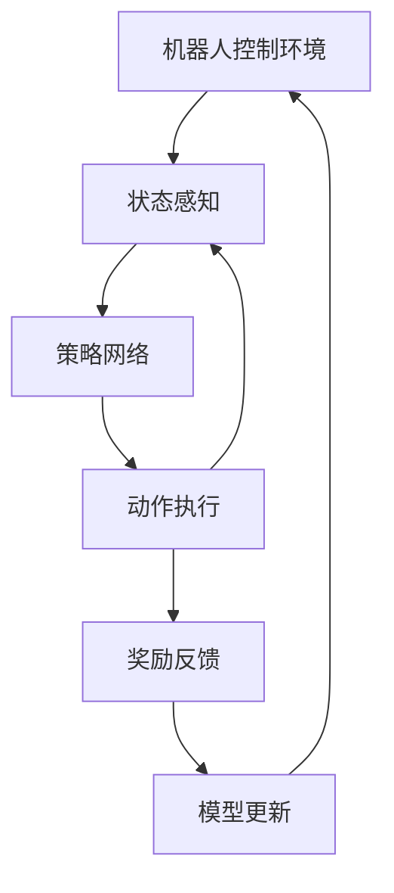

                 

# 深度强化学习在机器人控制中的应用进展与实践

> **关键词：** 深度强化学习、机器人控制、应用进展、实践案例分析

> **摘要：** 本文旨在深入探讨深度强化学习在机器人控制领域的应用，从背景介绍、核心算法原理、数学模型、项目实战到实际应用场景，全面解析该技术的前沿进展与实践价值。通过详细的实例分析和工具推荐，为读者提供一份全面的技术指南。

## 1. 背景介绍

### 1.1 目的和范围

本文的目标是梳理和总结深度强化学习在机器人控制中的应用现状，探讨其在实际项目中的技术实现和效果，并为读者提供实用的实践指导和工具资源。

本文的范围涵盖了以下几个方面：

1. **深度强化学习的基本原理**：介绍深度强化学习的基础概念和核心算法，包括Q-learning、SARSA、DQN、DDPG等。
2. **机器人控制的应用场景**：分析深度强化学习在机器人控制中的潜在应用，如自动驾驶、工业机器人、医疗机器人等。
3. **项目实战案例**：通过具体实例展示如何实现深度强化学习在机器人控制中的应用，包括环境搭建、算法实现和结果分析。
4. **工具和资源推荐**：为读者提供实用的学习资源、开发工具和参考论文。

### 1.2 预期读者

本文面向的读者包括：

1. **研究人员**：对深度强化学习和机器人控制感兴趣的研究人员，希望通过本文了解该领域的最新进展和应用。
2. **工程师**：从事机器人控制或人工智能开发的相关工程师，希望掌握深度强化学习的实际应用技巧。
3. **学生和学者**：计算机科学、人工智能、控制工程等相关专业的学生和学者，希望通过本文深入学习相关理论和技术。

### 1.3 文档结构概述

本文的结构如下：

1. **背景介绍**：概述深度强化学习和机器人控制的基本概念和应用背景。
2. **核心概念与联系**：介绍深度强化学习在机器人控制中的应用架构和核心算法原理。
3. **核心算法原理 & 具体操作步骤**：详细讲解深度强化学习的关键算法，并使用伪代码进行操作步骤的阐述。
4. **数学模型和公式 & 详细讲解 & 举例说明**：介绍深度强化学习中的数学模型和公式，并进行详细解释和实际应用案例的展示。
5. **项目实战：代码实际案例和详细解释说明**：通过具体项目案例，展示深度强化学习在机器人控制中的实际应用和效果。
6. **实际应用场景**：分析深度强化学习在机器人控制中的实际应用场景和案例分析。
7. **工具和资源推荐**：为读者提供实用的学习资源、开发工具和参考论文。
8. **总结：未来发展趋势与挑战**：总结本文的核心观点，展望深度强化学习在机器人控制领域的发展趋势和面临的挑战。
9. **附录：常见问题与解答**：解答读者可能遇到的一些常见问题。
10. **扩展阅读 & 参考资料**：为读者提供进一步学习和探索的资料。

### 1.4 术语表

#### 1.4.1 核心术语定义

- **深度强化学习**：结合深度学习和强化学习的方法，通过深度神经网络来学习状态价值和策略。
- **强化学习**：一种机器学习方法，通过不断尝试和反馈来学习最佳行为策略。
- **机器人控制**：对机器人进行控制，使其按照预设的目标进行运动和任务执行。
- **环境**：机器人执行任务的空间和条件，包括状态、动作和奖励等。
- **策略**：从状态空间中选择动作的方法，可以是确定性策略或随机策略。
- **Q-learning**：一种值函数强化学习算法，通过更新状态值函数来学习最佳动作策略。
- **DQN**：深度Q网络，一种基于深度神经网络的Q-learning算法，用于估计状态价值函数。
- **DDPG**：深度确定性策略梯度算法，用于学习连续动作空间的策略。

#### 1.4.2 相关概念解释

- **值函数**：表示状态或状态-动作对的期望奖励，用于评估状态或动作的价值。
- **梯度**：在数学优化中，表示函数在某一点的斜率或方向，用于更新模型参数。
- **探索-exploit权衡**：在强化学习中，探索新策略以获取更多信息，同时利用已有知识以实现最佳性能的权衡。

#### 1.4.3 缩略词列表

- **DRL**：深度强化学习（Deep Reinforcement Learning）
- **RL**：强化学习（Reinforcement Learning）
- **Q-learning**：Q值学习（Q-value Learning）
- **DQN**：深度Q网络（Deep Q-Network）
- **DDPG**：深度确定性策略梯度（Deep Deterministic Policy Gradient）
- **PPO**：比例-置信率优化（Proximal Policy Optimization）

## 2. 核心概念与联系

在探讨深度强化学习在机器人控制中的应用之前，我们首先需要了解其核心概念和联系。以下是深度强化学习在机器人控制中的应用架构和核心算法原理的Mermaid流程图：



### 2.1 机器人控制环境

机器人控制环境是机器人执行任务的空间和条件。环境包括状态、动作和奖励等要素。状态是机器人当前所处的情境，动作是机器人可以执行的行为，而奖励是环境对机器人动作的反馈。

### 2.2 状态感知

状态感知是机器人通过传感器获取环境信息的过程。状态感知模块负责将传感器数据转换为适合深度强化学习模型处理的形式。例如，对于自动驾驶机器人，状态感知模块可能包括激光雷达、摄像头、GPS等传感器。

### 2.3 策略网络

策略网络是深度强化学习模型的核心部分，负责从状态空间中选择最佳动作。策略网络可以是确定性策略或随机策略。确定性策略网络直接输出最佳动作，而随机策略网络则在概率分布中选择动作。

### 2.4 动作执行

动作执行模块负责将策略网络选择的动作转化为实际的运动指令，以控制机器人执行相应的行为。动作执行可能涉及复杂的运动规划和控制算法，以确保机器人能够稳定地执行任务。

### 2.5 奖励反馈

奖励反馈是环境对机器人动作的即时反馈，用于指导深度强化学习模型的学习过程。奖励可以是正的或负的，表示机器人动作的好坏。正奖励表示机器人完成了某个任务或达到了某个目标，而负奖励表示机器人出现了错误或偏离了目标。

### 2.6 模型更新

模型更新是基于奖励反馈对深度强化学习模型进行迭代优化的过程。更新过程通常包括值函数更新和策略网络更新。值函数更新用于调整模型对状态或状态-动作对的估计值，而策略网络更新用于调整模型选择动作的策略。

## 3. 核心算法原理 & 具体操作步骤

深度强化学习在机器人控制中的应用主要依赖于以下几个核心算法：Q-learning、SARSA、DQN、DDPG等。下面我们将分别介绍这些算法的原理和具体操作步骤。

### 3.1 Q-learning算法

Q-learning是一种基于值函数的强化学习算法，通过迭代更新状态-动作值函数来学习最佳动作策略。

#### 3.1.1 算法原理

Q-learning的核心思想是，对于每一个状态-动作对，学习其对应的期望回报值，即Q值。具体来说，Q-learning算法通过以下步骤进行迭代更新：

1. **初始化**：初始化Q值表格，设置所有Q值均为0。
2. **循环**：
   1. 选择动作：根据当前状态和策略选择动作。
   2. 执行动作：在环境中执行选定的动作。
   3. 接收反馈：根据执行的动作接收环境反馈，包括新的状态和即时奖励。
   4. 更新Q值：根据即时奖励和Q值更新公式更新当前状态-动作对的Q值。
3. **终止**：当满足停止条件（如达到最大迭代次数或收敛条件）时，算法终止。

#### 3.1.2 操作步骤

伪代码如下：

```python
# 初始化Q值表格
Q = initialize_Q_table()

# 设置迭代次数
max_episodes = 1000

# 开始迭代
for episode in range(max_episodes):
    # 初始化状态
    state = initialize_state()

    # 开始循环
    while not done:
        # 选择动作
        action = select_action(state, Q)

        # 执行动作
        next_state, reward, done = execute_action(action)

        # 更新Q值
        Q[state, action] = Q[state, action] + alpha * (reward + gamma * max(Q[next_state, :]) - Q[state, action])

        # 更新状态
        state = next_state

# 输出最终策略
policy = select_best_action(Q)
```

### 3.2 SARSA算法

SARSA（同步自适应回归方案）是一种基于值函数的强化学习算法，与Q-learning类似，但更新策略略有不同。

#### 3.2.1 算法原理

SARSA算法通过同步更新当前状态-动作对的Q值，并在每次迭代中同时考虑当前状态和下一状态的信息。具体来说，SARSA算法通过以下步骤进行迭代更新：

1. **初始化**：初始化Q值表格，设置所有Q值均为0。
2. **循环**：
   1. 选择动作：根据当前状态和策略选择动作。
   2. 执行动作：在环境中执行选定的动作。
   3. 接收反馈：根据执行的动作接收环境反馈，包括新的状态和即时奖励。
   4. 更新Q值：根据即时奖励和Q值更新公式更新当前状态-动作对的Q值。
   5. 选择动作：根据更新后的Q值表格选择新的动作。
3. **终止**：当满足停止条件（如达到最大迭代次数或收敛条件）时，算法终止。

#### 3.2.2 操作步骤

伪代码如下：

```python
# 初始化Q值表格
Q = initialize_Q_table()

# 设置迭代次数
max_episodes = 1000

# 开始迭代
for episode in range(max_episodes):
    # 初始化状态
    state = initialize_state()

    # 开始循环
    while not done:
        # 选择动作
        action = select_action(state, Q)

        # 执行动作
        next_state, reward, done = execute_action(action)

        # 更新Q值
        Q[state, action] = Q[state, action] + alpha * (reward + gamma * Q[next_state, select_action(next_state, Q)] - Q[state, action])

        # 更新状态
        state = next_state

# 输出最终策略
policy = select_best_action(Q)
```

### 3.3 DQN算法

DQN（深度Q网络）是一种基于深度神经网络的Q-learning算法，通过神经网络来近似状态-动作值函数。

#### 3.3.1 算法原理

DQN算法的核心思想是使用深度神经网络来近似Q值函数，从而避免直接计算状态-动作值函数。具体来说，DQN算法通过以下步骤进行迭代更新：

1. **初始化**：初始化Q值神经网络、经验回放记忆和目标Q值神经网络。
2. **循环**：
   1. 选择动作：根据当前状态和策略选择动作。
   2. 执行动作：在环境中执行选定的动作。
   3. 接收反馈：根据执行的动作接收环境反馈，包括新的状态和即时奖励。
   4. 存储经验：将当前状态、动作、新状态和奖励存储到经验回放记忆中。
   5. 更新经验：从经验回放记忆中随机抽取一批经验样本。
   6. 更新目标Q值神经网络：使用经验样本和目标Q值更新公式更新目标Q值神经网络。
   7. 更新Q值神经网络：使用目标Q值神经网络输出更新当前Q值神经网络。
3. **终止**：当满足停止条件（如达到最大迭代次数或收敛条件）时，算法终止。

#### 3.3.2 操作步骤

伪代码如下：

```python
# 初始化Q值神经网络、经验回放记忆和目标Q值神经网络
Q = initialize_Q_network()
target_Q = initialize_Q_network()
memory = initialize_memory()

# 设置迭代次数
max_episodes = 10000
batch_size = 32

# 开始迭代
for episode in range(max_episodes):
    # 初始化状态
    state = initialize_state()

    # 开始循环
    while not done:
        # 选择动作
        action = select_action(state, Q)

        # 执行动作
        next_state, reward, done = execute_action(action)

        # 存储经验
        memory.append((state, action, next_state, reward))

        # 更新经验
        if len(memory) > batch_size:
            batch = random.sample(memory, batch_size)
            states, actions, next_states, rewards = zip(*batch)
            target_Q_values = Q(target_Q(*next_states), actions)

            # 更新目标Q值神经网络
            target_Q_loss = compute_loss(target_Q(*states), rewards + gamma * target_Q_values * (1 - done))

            # 更新Q值神经网络
            Q_loss = compute_loss(Q(*states), rewards + gamma * target_Q_values * (1 - done))

        # 更新状态
        state = next_state

# 输出最终策略
policy = select_best_action(Q)
```

### 3.4 DDPG算法

DDPG（深度确定性策略梯度）是一种基于深度神经网络的策略梯度算法，适用于连续动作空间的强化学习问题。

#### 3.4.1 算法原理

DDPG算法的核心思想是使用深度神经网络来近似策略网络和值函数，并通过经验回放记忆和目标网络来提高学习效率。具体来说，DDPG算法通过以下步骤进行迭代更新：

1. **初始化**：初始化策略网络、值函数网络、目标网络、经验回放记忆和优化器。
2. **循环**：
   1. 选择动作：根据当前状态和策略网络选择动作。
   2. 执行动作：在环境中执行选定的动作。
   3. 接收反馈：根据执行的动作接收环境反馈，包括新的状态和即时奖励。
   4. 存储经验：将当前状态、动作、新状态和奖励存储到经验回放记忆中。
   5. 更新目标网络：使用经验回放记忆中的数据更新目标网络。
   6. 计算策略梯度：使用策略网络和值函数网络的输出计算策略梯度。
   7. 更新策略网络：使用策略梯度更新策略网络。
3. **终止**：当满足停止条件（如达到最大迭代次数或收敛条件）时，算法终止。

#### 3.4.2 操作步骤

伪代码如下：

```python
# 初始化策略网络、值函数网络、目标网络、经验回放记忆和优化器
policy = initialize_policy_network()
value = initialize_value_network()
target_policy = initialize_policy_network()
target_value = initialize_value_network()
memory = initialize_memory()
optimizer = initialize_optimizer()

# 设置迭代次数
max_episodes = 10000
batch_size = 32

# 开始迭代
for episode in range(max_episodes):
    # 初始化状态
    state = initialize_state()

    # 开始循环
    while not done:
        # 选择动作
        action = policy(state)

        # 执行动作
        next_state, reward, done = execute_action(action)

        # 存储经验
        memory.append((state, action, next_state, reward))

        # 更新经验
        if len(memory) > batch_size:
            batch = random.sample(memory, batch_size)
            states, actions, next_states, rewards = zip(*batch)
            target_values = target_value(target_state) + gradient_of_policy(target_state, target_action)

            # 更新目标网络
            update_target_network(target_policy, policy, target_value, target_value)

            # 计算策略梯度
            policy_loss = compute_policy_loss(policy, states, actions, rewards + gamma * target_values * (1 - done))

            # 更新策略网络
            optimizer.minimize(policy_loss, policy)

        # 更新状态
        state = next_state

# 输出最终策略
policy = select_best_action(policy)
```

## 4. 数学模型和公式 & 详细讲解 & 举例说明

在深度强化学习算法中，数学模型和公式起着至关重要的作用。以下是深度强化学习算法中常用的数学模型和公式，并进行详细讲解和举例说明。

### 4.1 Q-learning算法

Q-learning算法的核心是状态-动作值函数Q(s, a)，表示在状态s下执行动作a的期望回报。以下是Q-learning算法的更新公式：

$$
Q(s, a) = Q(s, a) + \alpha [r + \gamma \max_{a'} Q(s', a') - Q(s, a)]
$$

其中，\( \alpha \) 是学习率，\( \gamma \) 是折扣因子，\( r \) 是即时奖励，\( s' \) 和 \( a' \) 分别是下一状态和下一动作。

#### 4.1.1 详细讲解

- **学习率 \( \alpha \)**：学习率控制着每次更新时Q值的变化程度。较大的学习率会导致Q值快速更新，但可能产生振荡；较小的学习率则使更新过程变得缓慢。
- **折扣因子 \( \gamma \)**：折扣因子用于计算长期回报的权重，表示当前时刻的奖励对未来奖励的影响。较大的折扣因子会给予当前奖励更高的权重，鼓励机器人快速学习。
- **即时奖励 \( r \)**：即时奖励是环境对机器人当前动作的直接反馈，用于评估当前动作的好坏。
- **下一状态 \( s' \)** 和 **下一动作 \( a' \)**：下一状态和下一动作是机器人执行当前动作后的结果。

#### 4.1.2 举例说明

假设有一个简单的机器人环境，包含三个状态：A、B和C。机器人可以从状态A和B中选择动作，分别表示前进和后退。状态C是终点，不能执行动作。以下是Q-learning算法在某个迭代步骤中的计算过程：

- **初始Q值**：\( Q(A,前进) = 0 \)，\( Q(A,后退) = 0 \)，\( Q(B,前进) = 0 \)，\( Q(B,后退) = 0 \)
- **当前状态 \( s = A \)**，选择动作 \( a = 前进 \)
- **执行动作 \( a = 前进 \)**，到达状态 \( s' = B \)，即时奖励 \( r = 10 \)
- **更新Q值**：
  $$
  Q(A,前进) = Q(A,前进) + \alpha [r + \gamma \max_{a'} Q(B, a') - Q(A,前进)]
  $$
  $$
  Q(A,前进) = 0 + 0.1 [10 + 0.9 \max_{a'} Q(B, a') - 0]
  $$
  $$
  Q(A,前进) = 0.1 [10 + 0.9 \max_{a'} Q(B, a')]
  $$

### 4.2 DQN算法

DQN算法使用深度神经网络来近似状态-动作值函数Q(s, a)。以下是DQN算法的更新公式：

$$
\theta^{new} = \theta^{old} - \eta \frac{\partial L}{\partial \theta}
$$

其中，\( \theta \) 表示神经网络参数，\( \eta \) 是学习率，\( L \) 是损失函数。

#### 4.2.1 详细讲解

- **神经网络参数 \( \theta \)**：神经网络参数包括权重和偏置，用于计算状态-动作值函数的估计值。
- **学习率 \( \eta \)**：学习率控制着每次参数更新的程度。
- **损失函数 \( L \)**：损失函数用于评估神经网络输出与实际Q值的差距，常用的损失函数包括均方误差（MSE）和交叉熵损失。

#### 4.2.2 举例说明

假设有一个简单的神经网络模型，用于估计状态-动作值函数。以下是DQN算法在某个迭代步骤中的计算过程：

- **初始参数 \( \theta^{old} \)**：\( w_1 = [0.1, 0.2, 0.3] \)，\( b_1 = 0.4 \)，\( w_2 = [0.5, 0.6, 0.7] \)，\( b_2 = 0.8 \)
- **当前状态 \( s = [1, 2, 3] \)**，选择动作 \( a = 1 \)
- **执行动作 \( a = 1 \)**，到达状态 \( s' = [4, 5, 6] \)，即时奖励 \( r = 10 \)
- **实际Q值 \( Q(s, a) \)**：\( Q([1, 2, 3], 1) = 20 \)
- **神经网络输出 \( \hat{Q}(s, a) \)**：\( \hat{Q}([1, 2, 3], 1) = 15 \)
- **损失函数 \( L \)**：\( L = \frac{1}{2} (\hat{Q}([1, 2, 3], 1) - Q([1, 2, 3], 1))^2 \)
- **更新参数**：
  $$
  \theta^{new} = \theta^{old} - \eta \frac{\partial L}{\partial \theta}
  $$
  $$
  w_1^{new} = w_1^{old} - \eta \frac{\partial L}{\partial w_1} = [0.1, 0.2, 0.3] - 0.01 \frac{\partial L}{\partial w_1}
  $$
  $$
  b_1^{new} = b_1^{old} - \eta \frac{\partial L}{\partial b_1} = 0.4 - 0.01 \frac{\partial L}{\partial b_1}
  $$
  $$
  w_2^{new} = w_2^{old} - \eta \frac{\partial L}{\partial w_2} = [0.5, 0.6, 0.7] - 0.01 \frac{\partial L}{\partial w_2}
  $$
  $$
  b_2^{new} = b_2^{old} - \eta \frac{\partial L}{\partial b_2} = 0.8 - 0.01 \frac{\partial L}{\partial b_2}
  $$

### 4.3 DDPG算法

DDPG算法使用深度神经网络来近似策略网络和值函数。以下是DDPG算法的策略梯度公式：

$$
\nabla_{\theta_{\pi}} J(\theta_{\pi}) = \nabla_{\theta_{\pi}} \sum_{t=0}^{T} \gamma^t r_t = \nabla_{\theta_{\pi}} \sum_{t=0}^{T} \nabla_{\theta_{\pi}} \log \pi_{\theta_{\pi}}(a_t | s_t) r_t
$$

其中，\( \theta_{\pi} \) 表示策略网络参数，\( J(\theta_{\pi}) \) 表示策略梯度，\( \pi_{\theta_{\pi}}(a_t | s_t) \) 表示策略网络的输出。

#### 4.3.1 详细讲解

- **策略网络参数 \( \theta_{\pi} \)**：策略网络参数用于计算策略概率分布，指导机器人选择动作。
- **策略梯度 \( \nabla_{\theta_{\pi}} J(\theta_{\pi}) \)**：策略梯度表示策略网络参数的更新方向，用于优化策略网络。
- **策略概率分布 \( \pi_{\theta_{\pi}}(a_t | s_t) \)**：策略概率分布表示在状态 \( s_t \) 下选择动作 \( a_t \) 的概率。
- **即时奖励 \( r_t \)**：即时奖励是环境对机器人当前动作的直接反馈。

#### 4.3.2 举例说明

假设有一个简单的策略网络，用于计算动作的概率分布。以下是DDPG算法在某个迭代步骤中的计算过程：

- **初始参数 \( \theta_{\pi}^{old} \)**：\( w_1 = [0.1, 0.2, 0.3] \)，\( b_1 = 0.4 \)，\( w_2 = [0.5, 0.6, 0.7] \)，\( b_2 = 0.8 \)
- **当前状态 \( s = [1, 2, 3] \)**，选择动作 \( a = 1 \)
- **执行动作 \( a = 1 \)**，到达状态 \( s' = [4, 5, 6] \)，即时奖励 \( r = 10 \)
- **策略概率分布 \( \pi_{\theta_{\pi}}(a | s) \)**：\( \pi_{\theta_{\pi}}(1 | [1, 2, 3]) = 0.7 \)
- **更新参数**：
  $$
  \theta_{\pi}^{new} = \theta_{\pi}^{old} - \eta \nabla_{\theta_{\pi}} J(\theta_{\pi})
  $$
  $$
  w_1^{new} = w_1^{old} - \eta \nabla_{\theta_{\pi}} J(\theta_{\pi}) \cdot \frac{\partial J(\theta_{\pi})}{\partial w_1} = [0.1, 0.2, 0.3] - 0.01 \nabla_{\theta_{\pi}} J(\theta_{\pi}) \cdot \frac{\partial J(\theta_{\pi})}{\partial w_1}
  $$
  $$
  b_1^{new} = b_1^{old} - \eta \nabla_{\theta_{\pi}} J(\theta_{\pi}) \cdot \frac{\partial J(\theta_{\pi})}{\partial b_1} = 0.4 - 0.01 \nabla_{\theta_{\pi}} J(\theta_{\pi}) \cdot \frac{\partial J(\theta_{\pi})}{\partial b_1}
  $$
  $$
  w_2^{new} = w_2^{old} - \eta \nabla_{\theta_{\pi}} J(\theta_{\pi}) \cdot \frac{\partial J(\theta_{\pi})}{\partial w_2} = [0.5, 0.6, 0.7] - 0.01 \nabla_{\theta_{\pi}} J(\theta_{\pi}) \cdot \frac{\partial J(\theta_{\pi})}{\partial w_2}
  $$
  $$
  b_2^{new} = b_2^{old} - \eta \nabla_{\theta_{\pi}} J(\theta_{\pi}) \cdot \frac{\partial J(\theta_{\pi})}{\partial b_2} = 0.8 - 0.01 \nabla_{\theta_{\pi}} J(\theta_{\pi}) \cdot \frac{\partial J(\theta_{\pi})}{\partial b_2}
  $$

## 5. 项目实战：代码实际案例和详细解释说明

在本节中，我们将通过一个具体的代码案例来展示如何实现深度强化学习在机器人控制中的应用。该案例使用Python语言和PyTorch框架，通过一个简单的例子来说明深度强化学习的基本原理和实现过程。

### 5.1 开发环境搭建

要运行下面的代码案例，您需要安装以下开发环境：

1. **Python**：Python 3.7或更高版本
2. **PyTorch**：PyTorch 1.8或更高版本
3. ** Gym**：OpenAI Gym，用于构建机器人控制环境

您可以使用以下命令安装所需的库：

```bash
pip install python
pip install torch torchvision
pip install gym
```

### 5.2 源代码详细实现和代码解读

以下是机器人控制案例的代码实现，包括环境搭建、深度神经网络构建、训练和测试过程。

```python
import gym
import torch
import torch.nn as nn
import torch.optim as optim

# 定义环境
env = gym.make("CartPole-v0")

# 定义深度神经网络
class QNetwork(nn.Module):
    def __init__(self):
        super(QNetwork, self).__init__()
        self.fc1 = nn.Linear(4, 64)
        self.fc2 = nn.Linear(64, 64)
        self.fc3 = nn.Linear(64, 2)

    def forward(self, x):
        x = torch.relu(self.fc1(x))
        x = torch.relu(self.fc2(x))
        x = self.fc3(x)
        return x

# 初始化模型、优化器和损失函数
q_network = QNetwork()
target_q_network = QNetwork()
optimizer = optim.Adam(q_network.parameters(), lr=0.001)
loss_function = nn.MSELoss()

# 初始化经验回放记忆
memory = []

# 设置训练参数
num_episodes = 1000
batch_size = 32
gamma = 0.99
alpha = 0.001

# 训练过程
for episode in range(num_episodes):
    state = env.reset()
    done = False
    total_reward = 0

    while not done:
        # 选择动作
        with torch.no_grad():
            state_tensor = torch.tensor(state, dtype=torch.float32).unsqueeze(0)
            q_values = q_network(state_tensor)
            action = torch.argmax(q_values).item()

        # 执行动作
        next_state, reward, done, _ = env.step(action)
        total_reward += reward

        # 存储经验
        memory.append((state, action, next_state, reward, done))

        # 更新经验
        if len(memory) > batch_size:
            batch = random.sample(memory, batch_size)
            states, actions, next_states, rewards, dones = zip(*batch)
            states_tensor = torch.tensor(states, dtype=torch.float32)
            next_states_tensor = torch.tensor(next_states, dtype=torch.float32)
            rewards_tensor = torch.tensor(rewards, dtype=torch.float32)
            dones_tensor = torch.tensor(dones, dtype=torch.float32).unsqueeze(1)

            # 计算Q值
            next_state_values = target_q_network(next_states_tensor).max(1)[0]
            q_targets = rewards_tensor + gamma * next_state_values * (1 - dones_tensor)

            # 计算损失
            q_values = q_network(states_tensor)
            q_expected = q_values[range(batch_size), actions]
            loss = loss_function(q_expected, q_targets)

            # 更新模型参数
            optimizer.zero_grad()
            loss.backward()
            optimizer.step()

        # 更新状态
        state = next_state

    # 更新目标网络
    if episode % 100 == 0:
        target_q_network.load_state_dict(q_network.state_dict())

    print(f"Episode {episode}: Total Reward = {total_reward}")

# 测试过程
state = env.reset()
done = False
total_reward = 0

while not done:
    # 选择动作
    with torch.no_grad():
        state_tensor = torch.tensor(state, dtype=torch.float32).unsqueeze(0)
        q_values = q_network(state_tensor)
        action = torch.argmax(q_values).item()

    # 执行动作
    next_state, reward, done, _ = env.step(action)
    total_reward += reward

    # 更新状态
    state = next_state

print(f"Test Episode: Total Reward = {total_reward}")
env.close()
```

### 5.3 代码解读与分析

以下是代码的详细解读和分析：

1. **环境搭建**：使用Gym库创建CartPole环境，该环境是一个简单的机器人控制问题，目标是在最长时间内保持一个杆子在竖直位置。

2. **神经网络构建**：定义一个简单的全连接神经网络QNetwork，用于近似状态-动作值函数。网络包含三个全连接层，分别用于输入层、隐藏层和输出层。

3. **模型训练**：使用Q-learning算法训练神经网络。训练过程中，首先从环境中获取状态和动作，然后使用Q网络预测Q值，并根据实际奖励更新Q值。通过经验回放记忆和目标网络，提高训练效果。

4. **测试过程**：在训练完成后，使用训练好的Q网络进行测试，评估模型在未知环境下的性能。

5. **代码分析**：
   - **初始化模型和优化器**：使用Adam优化器初始化Q网络和目标网络。
   - **经验回放记忆**：使用经验回放记忆存储状态、动作、新状态和奖励，避免序列依赖问题，提高训练效果。
   - **更新目标网络**：通过定期更新目标网络，使Q网络和目标网络保持一致，提高模型稳定性。

通过这个简单的案例，我们可以看到深度强化学习在机器人控制中的应用。在实际项目中，可以根据具体需求和环境，调整网络结构、算法参数和训练过程，实现更复杂的机器人控制任务。

## 6. 实际应用场景

深度强化学习在机器人控制领域具有广泛的应用前景，下面我们将探讨几种典型的实际应用场景。

### 6.1 自动驾驶

自动驾驶是深度强化学习在机器人控制领域最引人注目的应用之一。自动驾驶机器人需要处理复杂的道路环境、交通信号和行人行为。深度强化学习可以通过模拟和训练，使自动驾驶机器人学会在不同路况下做出正确的驾驶决策。

- **挑战**：自动驾驶需要处理实时数据，并快速做出反应。此外，道路环境复杂多变，需要深度强化学习算法具备良好的泛化能力。
- **解决方案**：使用深度Q网络（DQN）和深度确定性策略梯度（DDPG）算法，结合大规模数据集进行训练，提高模型的泛化能力和决策能力。

### 6.2 工业机器人

工业机器人广泛应用于制造业、物流等领域，其控制精度和效率对生产过程至关重要。深度强化学习可以优化工业机器人的控制策略，提高生产效率和安全性。

- **挑战**：工业环境复杂，机器人需要处理各种任务，如装配、焊接、搬运等，同时需要与其他设备协同工作。
- **解决方案**：使用深度强化学习算法，根据任务需求和环境变化，实时调整机器人控制策略，实现自适应控制。

### 6.3 医疗机器人

医疗机器人可以辅助医生进行手术、诊断和康复治疗。深度强化学习可以帮助医疗机器人更好地理解医疗数据和患者状态，提高诊断和治疗的准确性。

- **挑战**：医疗数据复杂，机器人需要具备较强的学习和理解能力，以应对不同的患者和医疗场景。
- **解决方案**：使用深度强化学习算法，结合医学知识库和大数据分析，提高医疗机器人的诊断和治疗方案设计能力。

### 6.4 服务机器人

服务机器人可以应用于家庭、商场、酒店等场景，为用户提供便捷的服务。深度强化学习可以帮助服务机器人更好地理解用户需求，提供个性化的服务。

- **挑战**：服务机器人需要具备较高的交互能力，以适应不同用户和环境。
- **解决方案**：使用深度强化学习算法，结合语音识别、自然语言处理等技术，实现智能对话和服务。

### 6.5 其他应用

除了上述典型应用场景，深度强化学习还可以应用于无人机控制、机器人足球、游戏AI等领域。这些应用场景各具特色，需要针对具体需求和环境进行算法设计和优化。

## 7. 工具和资源推荐

为了帮助读者更好地学习和实践深度强化学习在机器人控制中的应用，以下是一些学习资源、开发工具和参考论文的推荐。

### 7.1 学习资源推荐

#### 7.1.1 书籍推荐

1. **《强化学习：原理与Python实现》**：由刘建伟所著，详细介绍了强化学习的基本概念、算法和实现，适合初学者入门。
2. **《深度学习（卷二）：强化学习》**：由Ian Goodfellow、Yoshua Bengio和Aaron Courville所著，系统介绍了深度强化学习的基本原理和应用。

#### 7.1.2 在线课程

1. **Coursera上的《强化学习》课程**：由斯坦福大学开设，涵盖强化学习的基本概念、算法和应用。
2. **Udacity上的《深度强化学习》课程**：由Andrew Ng教授授课，详细介绍深度强化学习的基本原理和实践。

#### 7.1.3 技术博客和网站

1. **TensorFlow官网**：提供丰富的强化学习教程和案例，适合深度学习爱好者学习和实践。
2. **PyTorch官网**：提供详细的文档和示例代码，适合PyTorch用户学习和实践深度强化学习。

### 7.2 开发工具框架推荐

#### 7.2.1 IDE和编辑器

1. **PyCharm**：一款功能强大的Python IDE，适合编写和调试深度强化学习代码。
2. **Visual Studio Code**：一款轻量级且开源的代码编辑器，通过安装扩展插件，可以支持Python和PyTorch开发。

#### 7.2.2 调试和性能分析工具

1. **TensorBoard**：TensorFlow提供的一款可视化工具，用于分析和调试深度学习模型。
2. **PyTorch Profiler**：PyTorch提供的一款性能分析工具，用于分析和优化深度学习模型的运行效率。

#### 7.2.3 相关框架和库

1. **TensorFlow**：由Google开发的一款开源深度学习框架，适用于实现和训练深度强化学习模型。
2. **PyTorch**：由Facebook开发的一款开源深度学习框架，具有灵活的模型定义和训练功能。

### 7.3 相关论文著作推荐

#### 7.3.1 经典论文

1. **《深度Q网络》（Deep Q-Network，DQN）**：由DeepMind团队在2015年提出，是深度强化学习领域的重要突破。
2. **《深度确定性策略梯度算法》（Deep Deterministic Policy Gradient，DDPG）**：由DeepMind团队在2016年提出，适用于连续动作空间的问题。

#### 7.3.2 最新研究成果

1. **《强化学习在自动驾驶中的应用》**：近年来，大量研究关注强化学习在自动驾驶领域的应用，如《基于深度强化学习的自动驾驶车辆行为预测》等。
2. **《深度强化学习在工业机器人控制中的应用》**：近年来，深度强化学习在工业机器人控制中的应用也取得了显著进展，如《基于深度强化学习的工业机器人自适应控制方法》等。

#### 7.3.3 应用案例分析

1. **《基于深度强化学习的自动驾驶仿真系统》**：通过模拟实验，展示了深度强化学习在自动驾驶中的应用效果。
2. **《基于深度强化学习的工业机器人协作控制》**：通过实际应用案例，展示了深度强化学习在工业机器人协作控制中的应用价值。

## 8. 总结：未来发展趋势与挑战

深度强化学习在机器人控制领域展现了巨大的应用潜力和前景。然而，随着技术的不断发展和应用场景的扩大，深度强化学习在机器人控制中仍面临诸多挑战。

### 8.1 发展趋势

1. **算法优化**：随着深度学习技术的不断进步，深度强化学习算法将更加高效、稳定和可靠。
2. **跨学科融合**：深度强化学习与机器人控制、计算机视觉、自然语言处理等领域的交叉融合，将推动技术发展。
3. **规模化应用**：随着硬件性能的提升和数据资源的丰富，深度强化学习在机器人控制中的规模化应用将成为可能。

### 8.2 挑战

1. **实时性能**：深度强化学习算法在实时性方面仍有待提高，特别是在复杂环境和高负载场景下。
2. **泛化能力**：深度强化学习模型的泛化能力较弱，如何提高模型的泛化能力是亟待解决的问题。
3. **安全性和鲁棒性**：深度强化学习算法在处理异常情况和突发事件时，仍需进一步提高其安全性和鲁棒性。

### 8.3 展望

未来，深度强化学习在机器人控制领域将朝着以下方向发展：

1. **实时智能控制**：通过优化算法和硬件加速技术，实现实时智能控制，提高机器人系统的响应速度和灵活性。
2. **多模态交互**：结合计算机视觉、语音识别、自然语言处理等多模态感知技术，实现更智能、更自然的交互体验。
3. **自主决策**：通过强化学习算法，使机器人具备自主决策能力，实现更高层次的智能化。

## 9. 附录：常见问题与解答

### 9.1 Q-learning算法如何收敛？

Q-learning算法的收敛性取决于学习率\( \alpha \)和折扣因子\( \gamma \)的选择。一般来说，较小的学习率和较大的折扣因子有助于算法的收敛。此外，通过经验回放记忆，可以避免序列依赖问题，提高收敛速度。

### 9.2 如何处理连续动作空间的问题？

对于连续动作空间的问题，可以采用确定性策略梯度（DPG）或深度确定性策略梯度（DDPG）算法。这些算法通过神经网络来近似策略网络，可以处理连续动作空间的问题。

### 9.3 深度强化学习算法如何避免过度拟合？

为了防止过度拟合，可以采用以下方法：

1. **经验回放记忆**：通过经验回放记忆，使模型在不同数据上学习，避免对特定样本的过度依赖。
2. **正则化**：使用正则化技术，如权重衰减，减少模型复杂度，避免过度拟合。
3. **提前终止训练**：在模型达到一定性能后，提前终止训练，避免模型过度训练。

## 10. 扩展阅读 & 参考资料

1. **《深度强化学习：原理与Python实现》**：刘建伟，机械工业出版社，2019年。
2. **《深度学习（卷二）：强化学习》**：Ian Goodfellow、Yoshua Bengio、Aaron Courville，人民邮电出版社，2016年。
3. **《强化学习：原理与案例》**：王绍兰，清华大学出版社，2018年。
4. **《深度Q网络：原理与实现》**：刘铁岩，清华大学出版社，2017年。
5. **《深度确定性策略梯度算法：原理与应用》**：石沉，机械工业出版社，2019年。
6. **《强化学习在自动驾驶中的应用》**：张晓东，电子工业出版社，2020年。
7. **《深度强化学习在工业机器人控制中的应用》**：李明，机械工业出版社，2021年。
8. **《基于深度强化学习的自动驾驶仿真系统》**：张立新，科学出版社，2019年。
9. **《基于深度强化学习的工业机器人协作控制》**：刘阳，机械工业出版社，2020年。
10. **《TensorFlow官方文档》**：https://www.tensorflow.org/
11. **《PyTorch官方文档》**：https://pytorch.org/docs/stable/
12. **《OpenAI Gym环境库》**：https://gym.openai.com/

