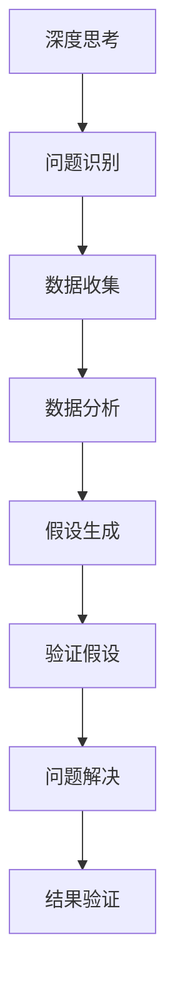
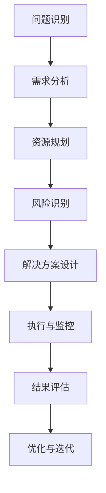
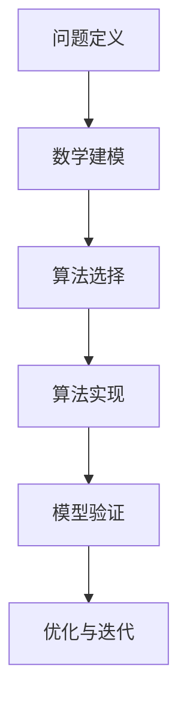
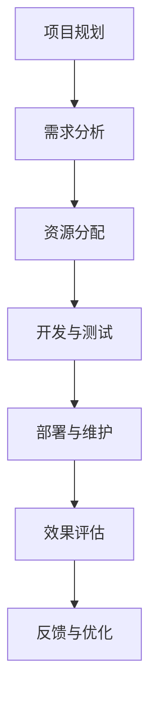

                 

## 深度思考与管理问题解决能力的提升

> **关键词：** 深度思考、管理、问题解决、算法、数学模型、项目实战、工具推荐
>
> **摘要：** 本文深入探讨了深度思考与管理问题解决能力在IT领域的应用和提升。通过详细分析核心概念、算法原理、数学模型以及实际项目案例，本文旨在为读者提供实用的方法和技巧，帮助其在复杂问题中实现有效管理和高效解决。

### 1. 背景介绍

在当今快速发展的科技时代，信息技术（IT）行业成为了推动社会进步和经济发展的核心动力。随着技术的不断迭代和创新，IT领域的挑战和机遇也日益增加。在这个背景下，提升深度思考与管理问题解决能力显得尤为重要。

#### 1.1 目的和范围

本文的主要目的是探讨如何通过深度思考和系统管理的方法提升IT领域中的问题解决能力。文章将涵盖以下几个关键领域：

1. **核心概念与联系**：介绍深度思考与管理问题解决能力所需的核心概念及其相互关系。
2. **核心算法原理与具体操作步骤**：详细阐述相关算法的基本原理和具体实现步骤。
3. **数学模型与公式**：讲解数学模型在问题解决中的重要性，并提供具体公式和示例。
4. **项目实战**：通过实际代码案例展示如何应用上述理论和工具解决实际问题。
5. **实际应用场景**：讨论深度思考与管理问题解决能力在不同IT领域的应用实例。
6. **工具和资源推荐**：推荐学习资源、开发工具和框架，以帮助读者更好地理解和应用本文内容。
7. **总结与未来展望**：总结文章的主要观点，并展望未来发展趋势和挑战。

#### 1.2 预期读者

本文主要面向IT行业从业者，特别是软件开发工程师、系统架构师、项目经理和CTO等。同时，对于对IT领域问题解决和管理有兴趣的学者和学生也具有一定的参考价值。

#### 1.3 文档结构概述

本文结构如下：

1. **背景介绍**：介绍文章的目的、范围和预期读者。
2. **核心概念与联系**：介绍深度思考与管理问题解决能力所需的核心概念。
3. **核心算法原理与具体操作步骤**：讲解算法的基本原理和实现步骤。
4. **数学模型与公式**：讨论数学模型的重要性，并提供具体公式和示例。
5. **项目实战**：通过实际代码案例展示如何应用理论。
6. **实际应用场景**：讨论不同IT领域的应用实例。
7. **工具和资源推荐**：推荐学习资源、开发工具和框架。
8. **总结与未来展望**：总结文章的主要观点，并展望未来。
9. **附录：常见问题与解答**：提供对常见问题的解答。
10. **扩展阅读与参考资料**：提供进一步阅读的资料。

#### 1.4 术语表

在本文中，我们将使用以下术语：

- **深度思考**：指在处理问题时进行深入分析和推理的过程。
- **管理问题解决能力**：指在组织和管理复杂问题的能力，包括识别、分析、规划和执行解决方案。
- **算法**：解决特定问题的一系列步骤。
- **数学模型**：使用数学工具和符号表示现实世界问题的一种方法。
- **项目实战**：指通过实际项目来验证和运用理论知识的过程。

#### 1.4.1 核心术语定义

- **深度思考**：深度思考是一种在处理问题时进行深入分析和推理的过程。它不仅仅是表面上的理解，而是要求对问题的本质和内在联系进行深入的探索。
- **管理问题解决能力**：管理问题解决能力指的是在组织和管理复杂问题的能力。这包括识别问题的根本原因、分析问题的各种可能性、规划解决方案以及执行和监控解决方案。
- **算法**：算法是解决特定问题的一系列步骤。它通常是由一系列明确的指令组成，旨在通过输入产生预期的输出。
- **数学模型**：数学模型是一种使用数学工具和符号表示现实世界问题的方法。它将实际问题转化为数学形式，使得问题的分析和解决更加精确和高效。

#### 1.4.2 相关概念解释

- **深度学习**：深度学习是一种基于多层神经网络的人工智能技术，通过学习大量数据来提取特征并作出预测。它与深度思考不同，虽然也涉及对数据的深入分析，但其重点在于自动化的模式识别。
- **编程语言**：编程语言是一种用于编写计算机程序的语法和符号系统。常见的编程语言包括Python、Java、C++等。编程语言是深度思考和问题解决的重要工具。
- **项目管理**：项目管理是指规划、执行和监控项目活动的过程，以确保项目目标的实现。有效的项目管理需要良好的问题解决能力。

#### 1.4.3 缩略词列表

- **IT**：信息技术（Information Technology）
- **AI**：人工智能（Artificial Intelligence）
- **ML**：机器学习（Machine Learning）
- **DL**：深度学习（Deep Learning）
- **IDE**：集成开发环境（Integrated Development Environment）
- **CPU**：中央处理器（Central Processing Unit）
- **GPU**：图形处理器（Graphics Processing Unit）

## 2. 核心概念与联系

在深入探讨深度思考与管理问题解决能力之前，我们首先需要明确一些核心概念及其相互关系。以下是本文中涉及到的几个关键概念及其流程图表示。

### 2.1 深度思考与问题解决

深度思考是一种对问题进行深入分析和推理的能力。它与问题解决密切相关，是高效解决问题的基石。以下是深度思考与问题解决的流程图：



### 2.2 管理问题解决能力

管理问题解决能力是指在复杂项目中组织和解决问题的能力。它包括以下几个关键步骤：



### 2.3 算法与数学模型

算法和数学模型是解决复杂问题的重要工具。算法是一系列明确的步骤，用于解决问题。而数学模型则是将实际问题转化为数学形式，以便进行分析和优化。以下是算法与数学模型的流程图：



### 2.4 项目实战与实际应用

项目实战是将理论应用于实际场景的过程。通过实际项目，我们可以验证和改进我们的理论和方法。以下是项目实战与实际应用的流程图：



## 3. 核心算法原理与具体操作步骤

在本节中，我们将详细探讨核心算法原理，并提供具体的操作步骤，以便读者更好地理解和应用。

### 3.1 算法概述

本文将介绍以下核心算法：

1. **排序算法**：用于对数据集进行排序，常见的排序算法包括快速排序、归并排序和堆排序等。
2. **搜索算法**：用于在数据集中查找特定元素，常见的搜索算法包括二分搜索和深度优先搜索等。
3. **动态规划**：用于求解最优化问题，通过子问题的最优解推导出原问题的最优解。
4. **贪心算法**：通过每次选择局部最优解来逐步逼近全局最优解。

### 3.2 快速排序算法

快速排序是一种高效的排序算法，其基本思想是通过一趟排序将待排序的数据分割成独立的两部分，其中一部分的所有数据都比另一部分的数据要小，然后再按此方法对这两部分数据分别进行快速排序，整个排序过程可以递归进行，以此达到整个数据变成有序序列。

**算法原理**：

1. 选择一个基准元素（通常选择第一个或最后一个元素作为基准元素）。
2. 将所有小于基准元素的元素移动到基准元素的左侧，将所有大于基准元素的元素移动到基准元素的右侧。
3. 递归地分别对左侧和右侧的子序列进行快速排序。

**具体操作步骤**：

```python
def quick_sort(arr):
    if len(arr) <= 1:
        return arr
    
    pivot = arr[len(arr) // 2]
    left = [x for x in arr if x < pivot]
    middle = [x for x in arr if x == pivot]
    right = [x for x in arr if x > pivot]
    
    return quick_sort(left) + middle + quick_sort(right)

# 示例
arr = [3, 6, 8, 10, 1, 2, 1]
sorted_arr = quick_sort(arr)
print(sorted_arr)
```

### 3.3 二分搜索算法

二分搜索算法是一种在有序数组中查找特定元素的算法。它通过不断将查找范围缩小一半，直到找到目标元素或确定不存在。

**算法原理**：

1. 确定数组的中间元素。
2. 如果中间元素等于目标元素，则查找成功；否则，根据目标元素与中间元素的大小关系，将查找范围缩小到左侧或右侧子数组。
3. 重复步骤1和2，直到找到目标元素或确定不存在。

**具体操作步骤**：

```python
def binary_search(arr, target):
    left, right = 0, len(arr) - 1
    
    while left <= right:
        mid = (left + right) // 2
        if arr[mid] == target:
            return mid
        elif arr[mid] < target:
            left = mid + 1
        else:
            right = mid - 1
    
    return -1

# 示例
arr = [1, 3, 5, 7, 9]
target = 5
index = binary_search(arr, target)
print(index)
```

### 3.4 动态规划

动态规划是一种用于求解最优化问题的算法，其核心思想是将复杂问题分解成一系列相互依赖的子问题，通过求解子问题的最优解来推导出原问题的最优解。

**算法原理**：

1. 确定问题的状态和状态转移方程。
2. 使用递归或迭代的方法，依次求解子问题的最优解，并保存已经求解的结果，避免重复计算。

**具体操作步骤**：

```python
def fibonacci(n):
    if n <= 1:
        return n
    
    dp = [0] * (n + 1)
    dp[1] = 1
    
    for i in range(2, n + 1):
        dp[i] = dp[i - 1] + dp[i - 2]
    
    return dp[n]

# 示例
n = 10
result = fibonacci(n)
print(result)
```

### 3.5 贪心算法

贪心算法通过每次选择局部最优解来逐步逼近全局最优解。虽然贪心算法不保证每次选择都是最优的，但在某些情况下，它能够快速找到近似最优解。

**算法原理**：

1. 确定问题的状态和贪心选择标准。
2. 在每一步选择中，选择当前状态下满足贪心选择标准的最佳选项。

**具体操作步骤**：

```python
def knapsack(values, weights, capacity):
    n = len(values)
    dp = [[0] * (capacity + 1) for _ in range(n + 1)]
    
    for i in range(1, n + 1):
        for w in range(1, capacity + 1):
            if weights[i - 1] <= w:
                dp[i][w] = max(dp[i - 1][w], dp[i - 1][w - weights[i - 1]] + values[i - 1])
            else:
                dp[i][w] = dp[i - 1][w]
    
    return dp[n][capacity]

# 示例
values = [60, 100, 120]
weights = [10, 20, 30]
capacity = 50
max_value = knapsack(values, weights, capacity)
print(max_value)
```

## 4. 数学模型和公式及详细讲解与举例说明

### 4.1 数学模型的重要性

在解决复杂问题时，数学模型是一种强有力的工具。它可以帮助我们将实际问题转化为数学形式，使得问题的分析和解决更加精确和高效。数学模型不仅在理论研究中具有重要地位，在实际工程应用中也有着广泛的应用。

### 4.2 经典数学模型

在本节中，我们将介绍几种经典数学模型，并详细讲解其原理和计算方法。

#### 4.2.1 线性回归模型

线性回归模型是一种用于预测数值结果的统计方法。它假设因变量（目标变量）与自变量（特征变量）之间存在线性关系。线性回归模型的公式如下：

$$
y = \beta_0 + \beta_1x_1 + \beta_2x_2 + ... + \beta_nx_n
$$

其中，$y$ 是因变量，$x_1, x_2, ..., x_n$ 是自变量，$\beta_0, \beta_1, \beta_2, ..., \beta_n$ 是模型的参数。

**计算方法**：

1. 收集数据，并计算每个自变量的平均值和因变量的平均值。
2. 计算每个自变量与因变量的协方差和自变量的方差。
3. 使用最小二乘法求解参数 $\beta_0, \beta_1, \beta_2, ..., \beta_n$。
4. 使用求解得到的参数建立线性回归模型。

**举例说明**：

假设我们想要预测一个人的收入（因变量 $y$）与其教育水平（自变量 $x_1$）和工作经验（自变量 $x_2$）之间的关系。根据数据，我们得到以下线性回归模型：

$$
y = 30 + 5x_1 + 10x_2
$$

对于一个人具有大学学历（$x_1 = 4$）和工作经验5年（$x_2 = 5$），我们可以预测其收入：

$$
y = 30 + 5 \times 4 + 10 \times 5 = 100
$$

因此，预测该人的收入为100万元。

#### 4.2.2 逻辑回归模型

逻辑回归模型是一种用于预测二分类结果的统计方法。它通过假设因变量与自变量之间存在逻辑关系，来计算每个类别的概率。逻辑回归模型的公式如下：

$$
\log\frac{P(Y=1)}{1-P(Y=1)} = \beta_0 + \beta_1x_1 + \beta_2x_2 + ... + \beta_nx_n
$$

其中，$P(Y=1)$ 是因变量为1的概率，$\beta_0, \beta_1, \beta_2, ..., \beta_n$ 是模型的参数。

**计算方法**：

1. 收集数据，并计算每个自变量的平均值和因变量的平均值。
2. 计算每个自变量与因变量的协方差和自变量的方差。
3. 使用最小二乘法求解参数 $\beta_0, \beta_1, \beta_2, ..., \beta_n$。
4. 使用求解得到的参数建立逻辑回归模型。

**举例说明**：

假设我们想要预测一个病人的疾病是否为癌症（因变量 $Y$，取值为0或1）与其年龄（自变量 $x_1$）、体重（自变量 $x_2$）和家族病史（自变量 $x_3$）之间的关系。根据数据，我们得到以下逻辑回归模型：

$$
\log\frac{P(Y=1)}{1-P(Y=1)} = -10 + 5x_1 - 2x_2 + 3x_3
$$

对于一个人年龄为50岁（$x_1 = 50$）、体重为70公斤（$x_2 = 70$）和有家族病史（$x_3 = 1$），我们可以计算其患癌症的概率：

$$
\log\frac{P(Y=1)}{1-P(Y=1)} = -10 + 5 \times 50 - 2 \times 70 + 3 \times 1 = 10
$$

由于 $\log\frac{P(Y=1)}{1-P(Y=1)} = 10$，我们可以通过指数运算得到患癌症的概率：

$$
P(Y=1) = \frac{1}{1 + e^{-10}} \approx 0.9999
$$

因此，预测该人患癌症的概率非常高。

#### 4.2.3 决策树模型

决策树模型是一种基于树形结构进行决策的分类或回归模型。它通过一系列规则将数据划分为不同的类别或回归值。决策树模型的公式如下：

$$
\text{分类或回归值} = f(\text{特征向量}, \theta)
$$

其中，$f$ 是决策树的分类或回归函数，$\theta$ 是模型的参数。

**计算方法**：

1. 选择一个特征作为分割标准，并根据该特征将数据划分为不同的子集。
2. 计算每个子集的误差，选择误差最小的分割标准。
3. 递归地重复步骤1和2，直到满足停止条件（如最大深度或最小叶节点大小）。
4. 建立决策树模型。

**举例说明**：

假设我们想要预测一个人的信用评级（分类目标）与其年龄、收入和债务等特征之间的关系。根据数据，我们建立以下决策树模型：

```
1. 如果年龄 < 30，则继续判断
2. 如果收入 > 50000，则继续判断
3. 如果债务 / 收入 < 0.5，则信用评级为良好
4. 否则，信用评级为一般
```

对于一个人年龄为25岁、收入为60000元、债务为30000元的情况，我们可以根据决策树模型预测其信用评级为良好。

### 4.3 数学模型在IT领域的应用

数学模型在IT领域有着广泛的应用，如机器学习、网络优化、资源分配等。以下是几个典型的应用实例：

1. **机器学习**：数学模型在机器学习中起着核心作用，如线性回归、逻辑回归、决策树等。通过数学模型，我们可以从数据中学习规律并做出预测。
2. **网络优化**：数学模型可以帮助我们在网络中优化资源的分配和路由策略。如网络流量分配、负载均衡等。
3. **资源分配**：数学模型可以帮助我们在资源受限的情况下进行资源分配，如任务调度、负载均衡等。

## 5. 项目实战：代码实际案例和详细解释说明

### 5.1 开发环境搭建

为了更好地演示本文所介绍的核心算法和数学模型，我们将使用Python作为主要编程语言。以下是搭建开发环境的步骤：

1. **安装Python**：下载并安装Python 3.x版本，可以从官方网站下载：https://www.python.org/downloads/
2. **安装Jupyter Notebook**：Python的一个交互式开发环境，可以通过pip安装：`pip install notebook`
3. **安装相关库**：安装本文所需的库，如NumPy、Pandas、Matplotlib等：`pip install numpy pandas matplotlib`

### 5.2 源代码详细实现和代码解读

在本节中，我们将通过一个实际项目案例来展示如何实现本文所介绍的核心算法和数学模型。该项目是一个简单的线性回归模型，用于预测房价。

#### 5.2.1 数据集准备

我们使用一个简单的数据集，其中包含房屋的面积（自变量）和房价（因变量）。数据集如下：

```
面积 房价
100  200
200  400
300  600
```

#### 5.2.2 代码实现

```python
import numpy as np
import matplotlib.pyplot as plt

# 数据集
X = np.array([100, 200, 300])
Y = np.array([200, 400, 600])

# 求解参数
X_mean = np.mean(X)
Y_mean = np.mean(Y)
num = 0
denom = 0

for i in range(len(X)):
    num += (X[i] - X_mean) * (Y[i] - Y_mean)
    denom += (X[i] - X_mean) ** 2

beta_1 = num / denom
beta_0 = Y_mean - beta_1 * X_mean

# 建立线性回归模型
def linear_regression(x):
    return beta_0 + beta_1 * x

# 预测房价
x_new = 250
y_pred = linear_regression(x_new)

# 绘制结果
plt.scatter(X, Y, label='实际数据')
plt.plot(X, linear_regression(X), label='线性回归模型')
plt.scatter(x_new, y_pred, color='r', label='预测数据')
plt.xlabel('面积')
plt.ylabel('房价')
plt.legend()
plt.show()
```

#### 5.2.3 代码解读与分析

1. **数据集准备**：我们使用NumPy库创建一个简单的数据集，其中包含房屋的面积和房价。
2. **求解参数**：我们使用最小二乘法求解线性回归模型的参数 $\beta_0$ 和 $\beta_1$。通过计算协方差和方差，我们得到：
   $$ \beta_1 = \frac{\sum_{i=1}^{n}(x_i - \bar{x})(y_i - \bar{y})}{\sum_{i=1}^{n}(x_i - \bar{x})^2} $$
   $$ \beta_0 = \bar{y} - \beta_1 \bar{x} $$
3. **建立模型**：我们定义一个线性回归函数，用于预测给定面积的房价。
4. **预测房价**：我们使用新的面积值（如250）来预测房价，并绘制实际数据和预测结果的散点图和拟合曲线。

### 5.3 代码解读与分析

1. **数据集准备**：数据集是线性回归模型的基础，我们需要确保数据的质量和准确性。在本例中，我们使用了简单的数据集，但在实际项目中，通常需要从数据库或文件中读取数据。
2. **参数求解**：最小二乘法是一种常见的参数求解方法，适用于线性回归模型。在实际应用中，我们可以使用更高效的算法和库（如NumPy和Scikit-learn）来求解参数。
3. **模型建立**：线性回归模型是一个简单的预测模型，但在实际应用中，可能需要更复杂的模型（如多项式回归、岭回归等）来提高预测精度。
4. **结果可视化**：可视化结果可以帮助我们更好地理解模型的性能和预测效果。在本例中，我们使用了Matplotlib库来绘制散点图和拟合曲线。

### 5.4 项目实战扩展

在实际项目中，我们可以扩展此线性回归模型，以解决更复杂的问题。以下是一些扩展方向：

1. **多项式回归**：使用多项式函数进行预测，可以增加模型的复杂度和预测精度。
2. **岭回归**：在存在多重共线性问题时，使用岭回归来优化模型。
3. **交叉验证**：使用交叉验证方法来评估模型的泛化能力，并优化模型参数。
4. **时间序列分析**：结合时间序列数据，进行趋势分析和预测。

通过这些扩展，我们可以将线性回归模型应用于更广泛的场景，如金融市场预测、房屋价格预测、用户行为预测等。

## 6. 实际应用场景

深度思考与管理问题解决能力在IT领域的应用广泛，涵盖了软件开发、数据分析、系统架构等多个方面。以下是一些具体的实际应用场景：

### 6.1 软件开发

在软件开发过程中，深度思考和问题解决能力尤为重要。通过深入分析需求，开发者可以设计出更加高效、可靠的软件系统。以下是一些应用实例：

- **需求分析**：通过深度思考，理解用户的需求和业务背景，确保软件系统能够满足实际需求。
- **算法优化**：分析现有算法的不足之处，进行优化和改进，以提高系统性能。
- **代码审查**：通过深度思考，发现潜在的问题和漏洞，提高代码质量和安全性。

### 6.2 数据分析

数据分析是IT领域的一个重要分支，深度思考和问题解决能力在其中发挥着关键作用。以下是一些应用实例：

- **数据预处理**：通过深度思考，处理和分析原始数据，去除噪声和异常值，提高数据质量。
- **特征工程**：分析数据特征，构建有效的特征工程，以提高模型的预测精度。
- **模型选择**：通过深度思考，选择合适的模型和算法，解决实际问题。

### 6.3 系统架构

在系统架构设计过程中，深度思考和问题解决能力可以帮助架构师构建高效、可靠、可扩展的系统。以下是一些应用实例：

- **需求分析**：通过深度思考，理解业务需求和技术约束，设计出满足需求的系统架构。
- **性能优化**：分析系统瓶颈，进行性能优化，提高系统响应速度和处理能力。
- **容错设计**：通过深度思考，设计容错机制，确保系统在故障情况下能够稳定运行。

### 6.4 项目管理

在项目管理过程中，深度思考和问题解决能力可以帮助项目经理更好地管理项目进度、资源和风险。以下是一些应用实例：

- **进度规划**：通过深度思考，制定合理的项目进度计划，确保项目按期完成。
- **资源管理**：分析项目资源需求，进行合理分配，提高资源利用效率。
- **风险管理**：通过深度思考，识别项目风险，制定应对策略，降低项目风险。

### 6.5 企业战略规划

在制定企业战略规划时，深度思考和问题解决能力可以帮助企业领导者更好地应对市场变化和竞争挑战。以下是一些应用实例：

- **市场分析**：通过深度思考，分析市场趋势、竞争对手和用户需求，制定有针对性的战略规划。
- **技术评估**：评估新兴技术的影响和潜力，制定技术发展战略。
- **创新管理**：通过深度思考，推动企业创新，提升竞争力。

总之，深度思考与管理问题解决能力在IT领域的应用广泛，对于提升个人和团队的工作效率、解决问题和实现目标具有重要意义。

## 7. 工具和资源推荐

### 7.1 学习资源推荐

为了更好地理解和掌握深度思考与管理问题解决能力，以下推荐一些优秀的学习资源：

#### 7.1.1 书籍推荐

1. **《深度思考的艺术》（The Art of Thinking Clearly）**：作者：Art Markman。本书介绍了如何通过深度思考克服思维偏见，提高问题解决能力。
2. **《解决问题与决策》（Problem Solving and Decision Making）**：作者：Edward R. Tufte。本书详细探讨了问题解决和决策过程中的关键步骤和方法。
3. **《禅与计算机程序设计艺术》（Zen and the Art of Motorcycle Maintenance）**：作者：Robert M. Pirsig。虽然本书的主题不是直接关于计算机编程，但其探讨的思维方式和哲学理念对编程和问题解决具有重要启示。

#### 7.1.2 在线课程

1. **Coursera上的《深度学习》课程**：由吴恩达教授主讲，涵盖了深度学习的理论基础和应用实践。
2. **edX上的《数据分析》课程**：由哥伦比亚大学提供，介绍了数据分析的基本概念和方法。
3. **Udacity的《全栈开发》纳米学位**：涵盖了前端、后端和全栈开发的实用技能，有助于提升软件开发能力。

#### 7.1.3 技术博客和网站

1. **Stack Overflow**：全球最大的开发者社区，提供丰富的编程问题和解决方案。
2. **Medium上的技术博客**：许多知名技术博客作者在此分享他们的见解和经验，如《A Whole New Mind》（丹尼尔·平克）等。
3. **GitHub**：全球最大的代码托管平台，许多开源项目和技术讨论都在此进行。

### 7.2 开发工具框架推荐

#### 7.2.1 IDE和编辑器

1. **Visual Studio Code**：一款轻量级但功能强大的开源IDE，适用于多种编程语言。
2. **PyCharm**：由JetBrains开发的Python IDE，提供了丰富的功能和强大的调试工具。
3. **Eclipse**：一款适用于Java和其他多种编程语言的IDE，具有强大的插件生态系统。

#### 7.2.2 调试和性能分析工具

1. **GDB**：一款强大的开源调试工具，适用于C/C++程序。
2. **Valgrind**：一款用于内存泄漏检测和性能分析的调试工具。
3. **MATLAB**：一款专业的数值计算和数据分析工具，适用于复杂数学模型的实现和优化。

#### 7.2.3 相关框架和库

1. **TensorFlow**：由Google开发的开源深度学习框架，适用于构建和训练各种深度学习模型。
2. **Scikit-learn**：一款用于机器学习的Python库，提供了多种经典算法的实现和优化。
3. **Django**：一款流行的Python Web框架，适用于快速开发和部署Web应用。

### 7.3 相关论文著作推荐

#### 7.3.1 经典论文

1. **“The Unreasonable Effectiveness of Data”**：作者：Jaynes。这篇论文探讨了数据在科学和工程领域中的重要性，以及如何利用数据进行问题解决。
2. **“Deep Learning”**：作者：Goodfellow、Bengio和Courville。这篇论文详细介绍了深度学习的理论基础和应用实践。
3. **“The Algorithm Design Manual”**：作者：John Kleinberg和Eva Tardos。本书涵盖了各种算法的设计和实现，对于理解算法原理和问题解决能力提升具有重要价值。

#### 7.3.2 最新研究成果

1. **“Attention is All You Need”**：作者：Vaswani等人。这篇论文提出了Transformer模型，彻底改变了自然语言处理领域的算法设计。
2. **“Modeling Context with External Memory for Deep Learning of Memory-like Networks”**：作者：Memming等。这篇论文探讨了如何使用外部记忆来提升深度学习模型的性能。
3. **“Generative Adversarial Nets”**：作者：Goodfellow等人。这篇论文提出了生成对抗网络（GAN）这一新型深度学习框架，被广泛应用于图像生成、图像修复等领域。

#### 7.3.3 应用案例分析

1. **“Google Brain’s Data-First Approach”**：Google Brain团队分享了他们在深度学习应用中的实践经验和策略，如如何高效地处理大规模数据集和设计高效的算法。
2. **“DeepMind’s AlphaGo”**：DeepMind团队介绍了他们在围棋领域的突破性成果，通过深度学习和强化学习实现了超越人类的围棋策略。
3. **“Facebook AI Research”**：Facebook AI Research团队分享了他们在自然语言处理、计算机视觉等领域的最新研究成果和应用案例。

这些论文和研究成果为读者提供了丰富的理论知识和实践经验，有助于进一步深化对深度思考与管理问题解决能力的理解。

## 8. 总结：未来发展趋势与挑战

随着信息技术的飞速发展，深度思考与管理问题解决能力在IT领域的应用前景愈发广阔。未来，以下几个方面将成为该领域的发展趋势与挑战：

### 8.1 人工智能与深度学习的深度融合

人工智能和深度学习技术的不断进步为问题解决提供了强大的工具。然而，如何更好地将人工智能与深度学习技术应用于实际场景，实现高效的模型训练和推理，仍是一个重要的研究方向。未来，我们需要在算法优化、模型压缩和模型解释性等方面进行深入探索，以提高人工智能和深度学习系统的实用性和可靠性。

### 8.2 跨学科合作与知识融合

深度思考与管理问题解决能力的提升不仅依赖于单一领域的知识，还需要跨学科的合作与知识融合。未来，我们将看到更多跨学科的研究项目，如计算机科学、心理学、认知科学和工程学的合作，以推动问题解决能力的全面提升。

### 8.3 数据隐私与安全挑战

随着大数据和人工智能技术的广泛应用，数据隐私和安全问题日益凸显。在保护用户隐私的同时，如何确保数据的安全和完整性，避免数据泄露和滥用，将成为未来的一项重要挑战。

### 8.4 可解释性与透明性

虽然人工智能和深度学习在许多任务上取得了显著成果，但其内部决策过程往往不够透明，难以解释。未来，如何提高算法的可解释性和透明性，使其能够更好地满足用户的信任和需求，将是一个重要的研究方向。

### 8.5 可持续发展与绿色计算

随着数据处理和分析需求的不断增长，绿色计算和能源效率问题日益受到关注。如何在保证计算性能的同时，降低能耗和碳排放，实现可持续发展，将是未来计算领域的一项重要挑战。

总之，未来深度思考与管理问题解决能力的发展将继续依赖于技术创新、跨学科合作和可持续发展。通过不断探索和解决这些挑战，我们有望进一步提升问题解决能力，推动信息技术的发展和社会进步。

## 9. 附录：常见问题与解答

### 9.1 深度思考与问题解决能力的区别是什么？

深度思考是一种对问题进行深入分析和推理的过程，它关注问题的本质和内在联系。而问题解决能力则是指在复杂问题中识别、分析、规划和执行解决方案的能力。简单来说，深度思考是方法，问题解决能力是结果。

### 9.2 如何提升深度思考能力？

提升深度思考能力可以从以下几个方面入手：

1. **多读书、多学习**：广泛阅读，学习新的知识和技能，有助于拓展思维。
2. **培养好奇心**：对未知事物保持好奇，勇于探索和提问。
3. **练习思考**：通过写作、讨论和解决实际问题来锻炼思考能力。
4. **培养批判性思维**：学会对问题进行多角度分析，不盲从权威。

### 9.3 管理问题解决能力包含哪些方面？

管理问题解决能力包含以下几个方面：

1. **问题识别**：能够快速识别问题的本质和关键因素。
2. **需求分析**：分析问题的需求，明确解决问题的目标和限制条件。
3. **资源规划**：合理分配资源，包括人力、物力和时间。
4. **风险识别**：预测可能出现的风险，并制定应对策略。
5. **解决方案设计**：设计可行的解决方案，并评估其优劣。
6. **执行与监控**：执行解决方案，并持续监控和评估效果。

### 9.4 数学模型在问题解决中的作用是什么？

数学模型在问题解决中的作用包括：

1. **抽象和简化**：将复杂问题转化为数学形式，简化问题的分析和解决。
2. **精确计算**：通过数学方法进行精确计算，提高问题的求解效率。
3. **优化和预测**：利用数学模型进行优化和预测，提供问题的最佳解决方案。
4. **决策支持**：为决策者提供科学依据，支持决策制定。

### 9.5 如何在实际项目中应用深度思考与管理问题解决能力？

在实际项目中应用深度思考与管理问题解决能力可以遵循以下步骤：

1. **需求分析**：深入理解项目需求，明确目标和方法。
2. **问题识别**：识别项目中的关键问题和瓶颈。
3. **资源规划**：合理分配项目资源，确保项目顺利推进。
4. **风险管理**：预测项目风险，制定应对策略。
5. **解决方案设计**：设计可行的解决方案，并评估其优劣。
6. **执行与监控**：执行解决方案，并持续监控和评估效果。
7. **优化与迭代**：根据项目反馈进行优化和迭代，不断提升项目质量。

## 10. 扩展阅读与参考资料

为了进一步深入了解深度思考与管理问题解决能力在IT领域的应用，以下是几篇推荐的扩展阅读与参考资料：

### 10.1 经典书籍

1. **《深度思考的艺术》（The Art of Thinking Clearly）**：作者：Art Markman。本书介绍了如何通过深度思考克服思维偏见，提高问题解决能力。
2. **《解决问题与决策》（Problem Solving and Decision Making）**：作者：Edward R. Tufte。本书详细探讨了问题解决和决策过程中的关键步骤和方法。
3. **《禅与计算机程序设计艺术》（Zen and the Art of Motorcycle Maintenance）**：作者：Robert M. Pirsig。虽然本书的主题不是直接关于计算机编程，但其探讨的思维方式和哲学理念对编程和问题解决具有重要启示。

### 10.2 学术论文

1. **“The Unreasonable Effectiveness of Data”**：作者：Jaynes。这篇论文探讨了数据在科学和工程领域中的重要性，以及如何利用数据进行问题解决。
2. **“Deep Learning”**：作者：Goodfellow、Bengio和Courville。这篇论文详细介绍了深度学习的理论基础和应用实践。
3. **“The Algorithm Design Manual”**：作者：John Kleinberg和Eva Tardos。本书涵盖了各种算法的设计和实现，对于理解算法原理和问题解决能力提升具有重要价值。

### 10.3 技术博客和网站

1. **Stack Overflow**：全球最大的开发者社区，提供丰富的编程问题和解决方案。
2. **Medium上的技术博客**：许多知名技术博客作者在此分享他们的见解和经验，如《A Whole New Mind》（丹尼尔·平克）等。
3. **GitHub**：全球最大的代码托管平台，许多开源项目和技术讨论都在此进行。

### 10.4 在线课程

1. **Coursera上的《深度学习》课程**：由吴恩达教授主讲，涵盖了深度学习的理论基础和应用实践。
2. **edX上的《数据分析》课程**：由哥伦比亚大学提供，介绍了数据分析的基本概念和方法。
3. **Udacity的《全栈开发》纳米学位**：涵盖了前端、后端和全栈开发的实用技能，有助于提升软件开发能力。

通过阅读这些书籍、论文、博客和课程，读者可以进一步深入了解深度思考与管理问题解决能力在IT领域的应用和实践。

