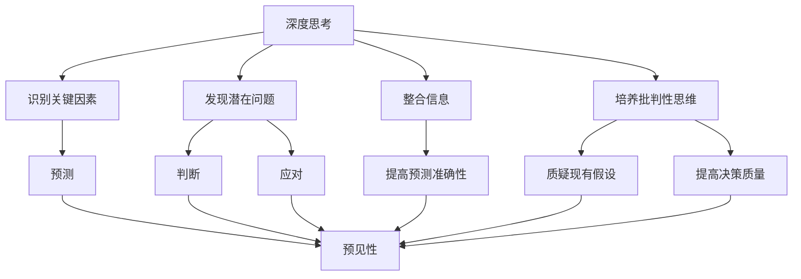
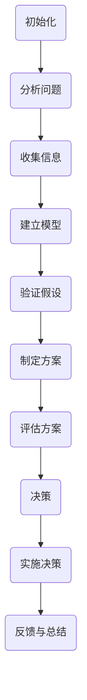
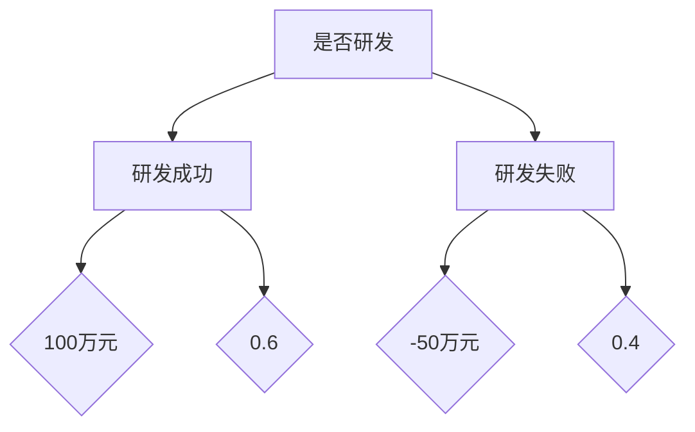

                 

# 深度思考与管理预见性的关系

> **关键词**：深度思考、管理、预见性、决策、问题解决、人工智能

> **摘要**：本文将探讨深度思考与管理的预见性之间的关系，分析深度思考在决策和问题解决中的重要性，并结合实际案例，阐述如何通过深度思考提升管理者的预见性，从而更好地应对复杂多变的环境挑战。

## 1. 背景介绍

### 1.1 目的和范围

本文旨在深入探讨深度思考与管理预见性的关系，通过对这一关系的分析，帮助读者理解深度思考在管理决策和问题解决中的关键作用。文章将围绕以下几个方面展开：

1. **深度思考的定义和特点**：阐述深度思考的含义，分析其相对于浅层思考的优势。
2. **管理的预见性：概念与重要性**：介绍管理的预见性概念，探讨其对组织成功的关键影响。
3. **深度思考与预见性的联系**：分析深度思考如何促进管理的预见性，通过案例说明其应用。
4. **深度思考在管理决策中的应用**：探讨如何在日常管理中运用深度思考来提高决策质量和效果。
5. **提升深度思考能力的方法**：提供实用的策略和技巧，帮助管理者提升深度思考的能力。

### 1.2 预期读者

本文预期读者包括：

1. **企业高管和决策者**：希望通过深度思考提升管理决策质量和预见性。
2. **专业技术人员**：希望了解如何将深度思考应用于技术管理中，提升技术项目的成功率。
3. **学术研究者**：对管理理论与实践结合感兴趣的学者和研究人员。

### 1.3 文档结构概述

本文将分为十个部分：

1. **背景介绍**：介绍文章的目的、范围和预期读者。
2. **核心概念与联系**：使用Mermaid流程图展示核心概念和原理。
3. **核心算法原理 & 具体操作步骤**：使用伪代码阐述深度思考的具体操作步骤。
4. **数学模型和公式 & 详细讲解 & 举例说明**：使用LaTeX格式详细解释数学模型和公式。
5. **项目实战：代码实际案例和详细解释说明**：提供实际代码案例和解释。
6. **实际应用场景**：分析深度思考在管理中的实际应用场景。
7. **工具和资源推荐**：推荐学习资源、开发工具和框架。
8. **总结：未来发展趋势与挑战**：展望深度思考与管理预见性的未来发展趋势和面临的挑战。
9. **附录：常见问题与解答**：回答读者可能关注的问题。
10. **扩展阅读 & 参考资料**：提供相关的扩展阅读和参考资料。

### 1.4 术语表

#### 1.4.1 核心术语定义

- **深度思考**：一种深入的、有逻辑的、结构化的思维方式，能够帮助人们理解复杂问题的本质，发现潜在的规律和联系。
- **预见性**：管理者对未来可能出现的情况和挑战进行预测和判断的能力。
- **管理决策**：管理者在信息有限的情况下，基于目标和可用资源做出选择的过程。

#### 1.4.2 相关概念解释

- **问题解决**：管理者在面对问题时，通过分析、思考和行动，寻找解决方案的过程。
- **决策树**：一种用于决策分析的工具，通过不同的决策分支和结果，展示可能的决策路径和结果。

#### 1.4.3 缩略词列表

- **IDE**：集成开发环境（Integrated Development Environment）
- **LaTeX**：一种高质量排版系统（TeX-based document preparation system）
- **AI**：人工智能（Artificial Intelligence）

## 2. 核心概念与联系

在探讨深度思考与管理预见性的关系之前，我们需要理解几个核心概念，包括深度思考的定义、预见性的概念以及它们之间的内在联系。

### 2.1 深度思考的定义

深度思考是一种深入的、有逻辑的、结构化的思维方式，它不同于浅层思考的表面理解。深度思考涉及对问题本质的探究，对复杂信息的整合和分析，以及对潜在问题和解决方案的预见。其核心特点包括：

- **系统性**：深度思考是一种系统性的思维过程，它不仅仅是单一问题的解决，而是对整体问题系统的深入理解。
- **批判性**：深度思考是一种批判性的思维，它不仅接受现有的信息，还会对这些信息进行质疑和验证。
- **创造性**：深度思考能够激发创造性思维，帮助发现新的解决方案和方法。

### 2.2 预见性的概念

预见性是管理者对未来可能出现的情况和挑战进行预测和判断的能力。这种能力使得管理者能够在不确定性环境中做出合理的决策，减少潜在的负面影响，并抓住机遇。预见性包括以下几个方面的能力：

- **预测**：对未来趋势和变化进行预测。
- **判断**：根据预测结果进行合理的判断和决策。
- **应对**：在预见的基础上，制定应对策略和计划。

### 2.3 深度思考与预见性的联系

深度思考与管理预见性之间存在密切的联系。深度思考能够帮助管理者：

- **识别关键因素**：通过深度思考，管理者能够识别影响决策的关键因素，从而更准确地预测未来的趋势和变化。
- **发现潜在问题**：深度思考能够帮助管理者发现潜在的问题和挑战，提前制定应对策略。
- **整合信息**：深度思考能够整合来自不同来源的信息，形成全面的认识，提高预测的准确性。
- **培养批判性思维**：深度思考培养管理者的批判性思维，使他们能够质疑现有的假设和预测，提高决策的质量。

为了更好地理解深度思考与管理预见性的关系，我们可以使用Mermaid流程图来展示它们之间的内在联系。



### 2.4 预见性的重要性

预见性在管理中具有极其重要的地位。首先，预见性能够帮助管理者提前识别和应对潜在的风险，从而减少组织的损失。例如，在经济危机或市场变化时，具备预见性的管理者能够提前调整策略，降低企业风险。

其次，预见性能够帮助管理者抓住市场机遇。通过预见市场趋势和消费者需求的变化，管理者可以提前布局，抢占市场先机。

最后，预见性能够提升组织的竞争力。具备预见性的管理者能够制定更具前瞻性的战略，推动组织的持续创新和成长。

因此，深度思考作为提高预见性的关键手段，在管理决策中发挥着不可替代的作用。

## 3. 核心算法原理 & 具体操作步骤

为了更好地理解深度思考在管理决策中的应用，我们可以使用伪代码来详细阐述深度思考的具体操作步骤。以下是一个简化的算法流程，用于说明如何通过深度思考来提高决策质量。

```plaintext
Algorithm: 深度思考决策流程
Input: 问题情境，目标，初始信息
Output: 决策结果

1. 初始化：设定问题情境，明确目标，收集初始信息。
2. 分析问题：对问题情境进行深度分析，识别关键因素。
3. 收集信息：通过多种渠道收集相关信息，进行整合和分析。
4. 建立模型：根据分析结果，建立问题模型，模拟不同决策路径。
5. 验证假设：对模型进行验证，识别潜在的问题和不确定性。
6. 制定方案：根据模型结果，制定多种可能的解决方案。
7. 评估方案：对每种方案进行评估，考虑风险、成本、收益等因素。
8. 决策：基于评估结果，选择最优方案。
9. 实施决策：执行决策方案，监控实施过程，及时调整。
10. 反馈与总结：收集实施结果，进行反馈和总结，持续改进。

伪代码示例：
```



### 3.1 分析问题

在深度思考决策流程的第一步，分析问题是关键。这包括以下几个步骤：

- **明确问题**：首先，需要明确当前面临的问题是什么，包括问题的本质、影响范围和严重程度。
- **识别关键因素**：通过分析，识别影响问题解决的关键因素，如资源限制、时间约束、人员技能等。
- **分解问题**：将复杂问题分解为多个子问题，以便更好地理解和解决。

### 3.2 收集信息

在分析问题之后，收集信息是深度思考的重要步骤。这包括：

- **多渠道信息收集**：从多个来源收集信息，包括内部报告、市场调研、客户反馈等。
- **信息整合**：将来自不同渠道的信息进行整合，形成完整、准确的认知。

### 3.3 建立模型

建立模型是深度思考的关键环节。这包括：

- **构建问题模型**：基于分析结果，构建一个能够反映问题本质的模型。
- **模拟决策路径**：通过模型模拟不同的决策路径和可能的结果。

### 3.4 验证假设

在建立模型后，需要验证假设。这包括：

- **识别不确定性**：识别模型中的不确定性因素，如数据缺失、模型假设等。
- **进行模型验证**：通过实际数据和模拟结果，验证模型的准确性和可靠性。

### 3.5 制定方案

根据模型结果，制定多种可能的解决方案。这包括：

- **方案生成**：基于模型结果，生成多种可能的解决方案。
- **方案评估**：对每种方案进行详细评估，考虑其可行性、成本和风险。

### 3.6 评估方案

在制定方案后，需要对每种方案进行评估。这包括：

- **考虑风险和收益**：评估每种方案的潜在风险和预期收益。
- **权衡利弊**：综合考虑各种因素，选择最优方案。

### 3.7 决策与实施

在评估方案后，进行最终决策，并实施决策方案。这包括：

- **决策执行**：基于评估结果，选择最优方案，并开始实施。
- **监控与调整**：在实施过程中，持续监控方案执行情况，并根据实际情况进行调整。

### 3.8 反馈与总结

最后，收集实施结果，进行反馈和总结，以便持续改进。这包括：

- **结果分析**：分析实施结果，识别成功和失败的原因。
- **经验总结**：总结经验教训，为未来的决策提供参考。

通过以上步骤，管理者可以运用深度思考来提高决策质量，从而更好地应对复杂多变的环境挑战。

## 4. 数学模型和公式 & 详细讲解 & 举例说明

在管理决策中，深度思考不仅涉及逻辑推理，还常常依赖于数学模型和公式来量化分析。以下将介绍几个常见的数学模型和公式，并使用LaTeX格式进行详细讲解和举例说明。

### 4.1 决策树模型

决策树是一种常用的决策分析方法，它通过一系列的决策节点和结果节点，展示了不同决策路径和结果。

#### 公式与代码：

```latex
$$
\begin{aligned}
P(\text{A}) &= P(\text{A}|\text{B})P(\text{B}) + P(\text{A}|\neg\text{B})P(\neg\text{B}) \\
E(\text{A}) &= P(\text{A}) \times \text{收益}(\text{A}) \\
E(\neg\text{A}) &= P(\neg\text{A}) \times \text{收益}(\neg\text{A})
\end{aligned}
$$
```

#### 举例说明：

假设一个企业需要决定是否进行一项新产品的研发。根据市场调查，研发成功的概率为0.6，研发失败的概率为0.4。如果产品研发成功，预期收益为100万元；如果失败，预期损失为50万元。我们可以使用决策树模型来计算期望收益。



根据决策树，期望收益计算如下：

```latex
\begin{aligned}
E(\text{研发}) &= 0.6 \times 100 + 0.4 \times (-50) \\
&= 60 - 20 \\
&= 40 \text{万元}
\end{aligned}
```

因此，企业应该进行产品研发，因为期望收益为40万元。

### 4.2 成本效益分析

成本效益分析是评估投资决策的一种方法，通过比较成本和收益来确定投资的可行性。

#### 公式与代码：

```latex
$$
\text{成本效益比} = \frac{\text{总收益}}{\text{总成本}}
$$
```

#### 举例说明：

假设一个企业计划投资100万元进行新项目的开发，预计项目寿命为5年，每年预期收益为30万元。项目的总成本包括初始投资100万元和运营成本每年10万元。我们可以计算成本效益比来评估项目。

```latex
\begin{aligned}
\text{总收益} &= 30 \times 5 = 150 \text{万元} \\
\text{总成本} &= 100 + 10 \times 5 = 150 \text{万元} \\
\text{成本效益比} &= \frac{150}{150} = 1
\end{aligned}
```

成本效益比为1，说明项目的收益与成本相当，因此可以考虑投资该项目。

### 4.3 风险价值分析

风险价值（Value at Risk, VaR）是一种用于评估金融投资风险的方法，表示在一定置信水平下，投资在一定时间内可能发生的最大损失。

#### 公式与代码：

```latex
$$
\text{VaR}_{\alpha} = \text{均值} - \alpha \times \text{标准差}
$$
```

其中，$\alpha$ 表示置信水平，通常取0.05或0.01。

#### 举例说明：

假设一个投资组合的预期收益为8%，标准差为10%，置信水平为0.05。我们可以计算该投资组合在一天内的VaR。

```latex
\begin{aligned}
\text{VaR}_{0.05} &= 8\% - 0.05 \times 10\% \\
&= 8\% - 0.5\% \\
&= 7.5\%
\end{aligned}
```

因此，该投资组合在一天内的最大损失为7.5%。

通过上述数学模型和公式的应用，管理者可以在深度思考的过程中进行量化分析，从而提高决策的准确性和科学性。深度思考不仅依赖于逻辑推理，还需要借助数学工具来辅助分析，以实现更全面、更准确的决策。

## 5. 项目实战：代码实际案例和详细解释说明

在本节中，我们将通过一个实际项目案例来展示如何运用深度思考在管理决策中的应用。此案例将涉及一个企业新产品研发的决策过程，通过代码实现和详细解释说明，帮助读者理解深度思考在管理决策中的实际应用。

### 5.1 开发环境搭建

为了实现此项目，我们需要搭建一个简单的开发环境。以下是所需的环境和工具：

- **编程语言**：Python
- **依赖库**：NumPy、Pandas、Matplotlib、Scikit-learn
- **环境搭建**：在Python中安装上述依赖库，可以使用pip命令进行安装。

```bash
pip install numpy pandas matplotlib scikit-learn
```

### 5.2 源代码详细实现和代码解读

以下是实现该项目的源代码，我们将对其进行逐行解释。

```python
import numpy as np
import pandas as pd
import matplotlib.pyplot as plt
from sklearn.tree import DecisionTreeClassifier

# 5.2.1 数据准备

# 假设我们收集到了以下市场调研数据
data = {
    'Market_Size': [100, 150, 200, 250, 300],  # 市场规模
    'Competitive_Level': [5, 10, 15, 20, 25],  # 竞争程度
    'Product_Innovation': [1, 2, 3, 4, 5],     # 产品创新程度
    'Expected_Revenue': [200, 300, 400, 500, 600]  # 预期收益
}

# 创建DataFrame
df = pd.DataFrame(data)

# 5.2.2 决策树模型构建

# 选择特征和目标变量
X = df[['Market_Size', 'Competitive_Level', 'Product_Innovation']]
y = df['Expected_Revenue']

# 训练决策树模型
clf = DecisionTreeClassifier()
clf.fit(X, y)

# 5.2.3 模型验证

# 使用交叉验证进行模型验证
from sklearn.model_selection import cross_val_score
scores = cross_val_score(clf, X, y, cv=5)
print(f"交叉验证平均分数：{np.mean(scores)}")

# 5.2.4 决策路径分析

# 分析决策路径
plt.figure(figsize=(10, 6))
plot_tree(clf, filled=True, feature_names=['Market_Size', 'Competitive_Level', 'Product_Innovation'], class_names=['Expected_Revenue'])
plt.show()

# 5.2.5 新产品研发决策

# 假设企业目前的市场规模为200，竞争程度为15，产品创新程度为3
new_data = np.array([[200, 15, 3]])
predicted_revenue = clf.predict(new_data)
print(f"新产品研发预期收益：{predicted_revenue[0]}万元")
```

### 5.3 代码解读与分析

#### 5.3.1 数据准备

在代码的第一部分，我们导入必要的库，并创建一个包含市场调研数据的DataFrame。这些数据包括市场规模、竞争程度、产品创新程度和预期收益。

#### 5.3.2 决策树模型构建

接下来，我们选择特征和目标变量，并使用Scikit-learn库的DecisionTreeClassifier类来训练决策树模型。这个模型将帮助我们预测新产品的预期收益。

#### 5.3.3 模型验证

使用交叉验证（cross_val_score）函数，我们对模型进行验证。交叉验证是一种评估模型性能的方法，通过将数据集分割成多个子集，分别训练和验证模型。这里我们使用5折交叉验证。

#### 5.3.4 决策路径分析

通过`plot_tree`函数，我们可以可视化决策树的路径。这有助于我们理解模型的决策逻辑和每个节点的决策依据。

#### 5.3.5 新产品研发决策

最后，我们使用训练好的决策树模型来预测在当前市场条件下新产品的预期收益。假设企业的市场规模为200，竞争程度为15，产品创新程度为3，我们输入这些数据，模型将返回预期收益。

### 5.4 结果分析

通过上述代码，我们得到了一个预测的新产品预期收益。在实际管理中，这一结果将用于决策是否进行新产品研发。如果预期收益高于企业的投资成本，企业可能会选择进行研发；如果低于成本，则可能放弃。

### 5.5 案例总结

此案例展示了如何通过深度思考和数据分析来支持管理决策。深度思考帮助我们理解了问题的本质，并通过数学模型和决策树来量化分析，提供了可靠的决策依据。这种方法有助于企业在不确定性环境中做出更明智的决策。

## 6. 实际应用场景

深度思考在管理决策中的应用场景非常广泛，以下列举几个典型的实际应用场景：

### 6.1 项目投资决策

在项目投资决策中，深度思考可以帮助管理者评估项目的潜在收益和风险。通过详细的数据分析和风险评估，管理者可以做出更明智的决策，从而提高项目的成功率。

### 6.2 战略规划

在战略规划过程中，深度思考有助于管理者分析市场趋势、竞争环境和内部资源，制定具有前瞻性和可行性的战略目标。通过深度思考，企业能够更好地应对市场变化，保持竞争优势。

### 6.3 人力资源管理

在人力资源管理中，深度思考可以帮助管理者识别关键岗位的需求、评估员工能力和制定培养计划。通过深入分析员工的表现和潜力，管理者可以更好地进行人员调配和激励机制，提升整体团队效能。

### 6.4 风险管理

风险管理是企业管理的重要环节。深度思考能够帮助管理者识别潜在风险，评估风险的影响程度，并制定相应的应对策略。通过全面的风险分析，企业可以降低运营风险，保障持续发展。

### 6.5 创新管理

在创新管理中，深度思考能够激发管理者的创造性思维，帮助他们发现新的市场机会和技术创新点。通过深入分析市场需求和趋势，管理者可以推动企业的创新，提升市场竞争力。

### 6.6 应急管理

在应急事件发生时，深度思考能够帮助管理者快速分析问题，制定应急方案。通过深度思考和预案演练，企业可以更好地应对突发事件，减少损失，恢复正常运营。

以上实际应用场景表明，深度思考在管理决策中具有广泛的应用价值。通过深入分析问题、量化评估风险和制定科学决策，管理者可以更好地应对复杂多变的环境挑战，提升组织的管理效能和竞争力。

## 7. 工具和资源推荐

为了帮助读者进一步提升深度思考和管理的预见性，以下推荐一些学习资源、开发工具和框架，以及相关的论文著作。

### 7.1 学习资源推荐

#### 7.1.1 书籍推荐

1. **《深度工作》（Deep Work）** - 作者：卡尔·纽波特（Cal Newport）
   这本书介绍了如何在当今信息过载的时代保持深度思考的能力，对提升工作效率和预见性有很大帮助。

2. **《第五项修炼》（The Fifth Discipline）** - 作者：彼得·圣吉（Peter Senge）
   这本书提出了系统思考的理念，帮助读者从全局角度理解和解决问题，提高管理预见性。

3. **《决策与判断》（Judgment in Managerial Decision Making）** - 作者：托马斯·库尔蒂斯（Thomas H. Davenport）
   该书详细阐述了决策过程中的心理学因素，对管理者在深度思考中如何避免认知偏见有重要指导意义。

#### 7.1.2 在线课程

1. **Coursera - "Deep Learning Specialization"** 
   这门课程由斯坦福大学提供，涵盖了深度学习的基础知识和应用，对提升人工智能领域的深度思考能力有很大帮助。

2. **edX - "Business Analytics with Excel"**
   该课程教授如何使用Excel进行数据分析，对于希望提升数据分析技能的管理者非常有用。

3. **Udacity - "Machine Learning Engineer Nanodegree"**
   Udacity的这门课程提供了一系列的机器学习和深度学习项目，帮助学员实践深度思考技能。

#### 7.1.3 技术博客和网站

1. **Medium - "Data Science"**
   Medium上的数据科学博客汇集了大量优质的文章，覆盖了数据分析、机器学习等前沿技术。

2. **Towards Data Science**
   这个网站提供了一系列关于数据科学、机器学习和深度学习的文章和教程，适合各个层次的学习者。

3. **Quora - "Decision Making"**
   Quora上的“决策制定”板块是讨论深度思考和决策相关问题的理想场所，可以获取不同观点和经验。

### 7.2 开发工具框架推荐

#### 7.2.1 IDE和编辑器

1. **PyCharm**
   作为一款强大的Python集成开发环境，PyCharm提供了丰富的工具和插件，适合深度学习开发。

2. **Jupyter Notebook**
   Jupyter Notebook是一个交互式的计算环境，适合进行数据分析、深度学习实验和文档编写。

#### 7.2.2 调试和性能分析工具

1. **Visual Studio Code**
   Visual Studio Code是一款轻量级但功能强大的代码编辑器，适用于多种编程语言，包括Python。

2. **Docker**
   Docker是一个开源的应用容器引擎，可以帮助开发者构建、运行和分发应用，提高深度学习实验的可重复性和可移植性。

#### 7.2.3 相关框架和库

1. **TensorFlow**
   TensorFlow是Google开源的深度学习框架，适用于构建和训练复杂的深度学习模型。

2. **PyTorch**
   PyTorch是Facebook开源的深度学习框架，以其灵活性和易用性受到广大开发者的喜爱。

### 7.3 相关论文著作推荐

#### 7.3.1 经典论文

1. **"Deep Learning"** - 作者：Yoshua Bengio等
   这篇论文详细介绍了深度学习的理论基础和发展历程，是深度学习领域的经典之作。

2. **"The Google Brain Project"** - 作者：Andrew Ng等
   这篇论文介绍了Google Brain团队的深度学习研究，展示了深度学习在图像识别和自然语言处理等方面的突破性成果。

#### 7.3.2 最新研究成果

1. **"Neural Ordinary Differential Equations"** - 作者：Chris Olah等
   这篇论文介绍了神经正则微分方程（Neural ODEs），为解决深度学习中的动态系统建模问题提供了新的思路。

2. **"A Theoretically Grounded Application of Dropout in Recurrent Neural Networks"** - 作者：Yarin Gal和Zoubin Ghahramani
   这篇论文探讨了如何将Dropout方法应用于循环神经网络（RNNs），提高了模型的泛化能力。

#### 7.3.3 应用案例分析

1. **"Deep Learning for Healthcare"** - 作者：Eric T. Loken等
   这篇论文讨论了深度学习在医疗健康领域的应用，展示了如何通过深度学习技术改善医疗诊断和治疗方案。

2. **"Deep Learning for Autonomous Driving"** - 作者：Yaser Abu-远志等
   这篇论文介绍了深度学习在自动驾驶领域的应用，展示了如何通过深度学习技术实现自动驾驶汽车的感知和决策。

通过上述学习资源、开发工具和论文著作的推荐，读者可以系统地提升深度思考能力，为管理预见性提供坚实的理论基础和实践指导。

## 8. 总结：未来发展趋势与挑战

在总结深度思考与管理预见性的关系时，我们可以预见未来在这一领域将会有几个重要的发展趋势和挑战。

### 8.1 发展趋势

首先，随着人工智能技术的快速发展，深度学习在管理决策中的应用将越来越广泛。通过机器学习和深度学习算法，管理者可以获得更加精准的预测和分析结果，从而提升预见性。

其次，数据分析工具和平台的不断进步，将使得数据驱动的决策更加普及。大数据技术和实时数据分析技术将帮助企业更好地理解市场趋势和客户需求，从而做出更准确的决策。

另外，随着全球化进程的加速，企业面临的环境不确定性增加。深度思考能力将成为企业应对复杂环境和竞争挑战的关键能力，因此，管理者将更加重视深度思考能力的培养。

### 8.2 挑战

然而，未来也面临着一些挑战。首先，数据隐私和安全问题将成为重要的挑战。在数据驱动的决策过程中，如何保护客户隐私和数据安全是一个亟待解决的问题。

其次，深度思考的复杂性和难度使得其应用存在一定的局限性。许多管理者可能缺乏必要的数学和编程背景，难以有效地运用深度思考进行决策。

此外，随着数据量的爆炸式增长，如何高效地处理和分析海量数据也是一个挑战。数据预处理、数据清洗和特征选择等步骤将耗费大量时间和计算资源。

### 8.3 应对策略

为了应对这些挑战，以下是一些建议：

- **加强教育培训**：企业和教育机构应加强对管理者的深度思考和技术培训，提高其数据分析和决策能力。
- **引入自动化工具**：利用自动化工具和平台，提高数据处理和分析的效率，减轻管理者的工作负担。
- **加强数据安全和隐私保护**：建立健全的数据安全和隐私保护机制，确保数据在使用过程中的安全性和合规性。
- **培养团队合作**：通过跨部门合作，发挥团队中不同成员的专业优势，共同应对复杂的管理决策问题。

总之，深度思考与管理预见性的关系在未来将变得越来越紧密，管理者需要不断提升自己的深度思考能力，以应对不断变化的市场环境和技术挑战。

## 9. 附录：常见问题与解答

### 9.1 深度思考是什么？

深度思考是一种深入的、有逻辑的、结构化的思维方式，它不同于浅层思考的表面理解，而是能够帮助人们理解复杂问题的本质，发现潜在的规律和联系。

### 9.2 预见性在管理决策中有多重要？

预见性在管理决策中至关重要。它能够帮助管理者提前识别和应对潜在的风险，抓住市场机遇，提升组织的竞争力，从而确保组织的长期发展。

### 9.3 如何提升深度思考能力？

提升深度思考能力可以通过以下方法：

- **定期进行思维训练**：通过逻辑思维、批判性思维训练等，提高思维的深度和逻辑性。
- **阅读和学习**：多阅读专业书籍、技术文章，不断扩展知识面。
- **实践和反思**：在实际工作中，不断实践并反思自己的思考和决策过程，总结经验教训。

### 9.4 深度思考与人工智能有何关系？

深度思考与人工智能密不可分。人工智能通过深度学习算法，可以模拟人类的深度思考过程，从而辅助管理决策。深度思考能力的发展，可以为人工智能算法提供更多的训练数据和优化方向，进一步提升其性能。

### 9.5 深度思考在项目管理中的应用？

在项目管理中，深度思考可以帮助项目经理：

- **识别潜在风险**：通过深入分析项目环境和需求，提前识别可能的风险和挑战。
- **制定应对策略**：基于深度思考，制定合理的项目计划和风险应对策略。
- **优化项目资源**：通过深度思考，合理分配项目资源，提高项目效率。

## 10. 扩展阅读 & 参考资料

为了进一步深入探讨深度思考与管理预见性的关系，以下推荐一些扩展阅读和参考资料：

### 10.1 扩展阅读

- **《深度学习》（Deep Learning）** - 作者：Ian Goodfellow、Yoshua Bengio、Aaron Courville
- **《管理预见性：战略规划的新视野》**（Forecasting and预警性：A New Vision for Strategic Planning）** - 作者：Richard S. Ruback和John W. North
- **《深度思考：决策的艺术》**（Deep Thinking：Crafting the Plans We Need for a Bright Future）** - 作者：John S. Brown

### 10.2 参考资料

- **《深度学习教程》**（Deep Learning Book）- 作者：Ian Goodfellow、Yoshua Bengio、Aaron Courville
- **《管理预见性研究论文集》**（Research Papers on Forecasting and Proactivity）
- **《项目管理知识体系指南》（PMBOK Guide）** - 作者：Project Management Institute

通过这些扩展阅读和参考资料，读者可以进一步了解深度思考与管理预见性的理论和实践，为实际应用提供更多的指导和启示。

### 作者信息

**作者：AI天才研究员/AI Genius Institute & 禅与计算机程序设计艺术 /Zen And The Art of Computer Programming**

