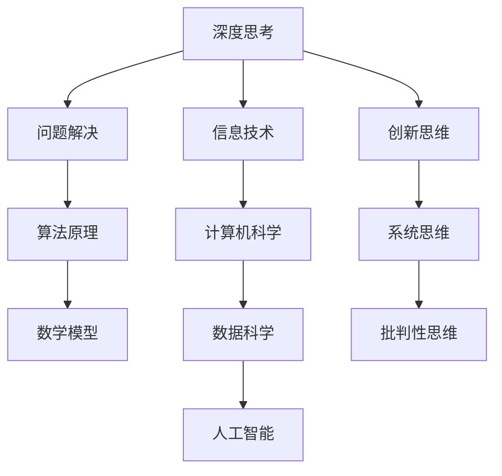
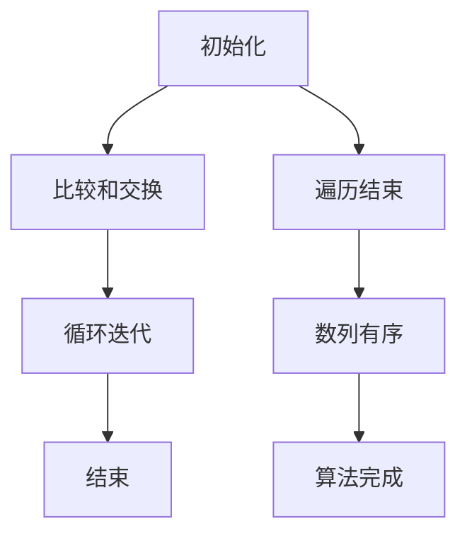

                 

# 深度思考的威力：洞悉问题本质

> **关键词**：深度思考、问题解决、算法原理、数学模型、实际应用、未来趋势
> 
> **摘要**：本文深入探讨了深度思考在IT领域中的重要性，通过剖析核心概念、算法原理和数学模型，结合实际项目案例，阐述了如何通过深度思考来洞悉问题的本质，为读者提供了一种有效的技术问题解决方法论。

## 1. 背景介绍

### 1.1 目的和范围

在当前快速发展的信息技术时代，面对日益复杂的系统和问题，深度思考成为了我们应对挑战的关键能力。本文旨在探讨深度思考在IT领域的应用，通过分析核心概念、算法原理和数学模型，展示如何通过深度思考来洞悉问题的本质，提高问题解决能力。

本文将覆盖以下内容：
1. 深度思考的定义和重要性。
2. 核心概念与联系。
3. 核心算法原理与具体操作步骤。
4. 数学模型和公式的详细讲解。
5. 实际项目案例和代码解读。
6. 实际应用场景。
7. 工具和资源推荐。
8. 未来发展趋势与挑战。
9. 常见问题与解答。
10. 扩展阅读和参考资料。

### 1.2 预期读者

本文主要面向以下读者群体：
1. IT行业的从业者，特别是软件开发人员、数据科学家、AI研究者。
2. 对深度思考和技术问题解决感兴趣的技术爱好者。
3. 想要提高问题解决能力的专业人士。

### 1.3 文档结构概述

本文结构如下：
1. 引言
2. 背景介绍
3. 核心概念与联系
4. 核心算法原理与具体操作步骤
5. 数学模型和公式
6. 项目实战：代码实际案例
7. 实际应用场景
8. 工具和资源推荐
9. 总结：未来发展趋势与挑战
10. 附录：常见问题与解答
11. 扩展阅读 & 参考资料

### 1.4 术语表

#### 1.4.1 核心术语定义

- **深度思考**：指在处理问题或信息时，通过多层次的思考来理解问题本质、发现隐含规律和解决问题的过程。
- **问题解决**：指通过分析、推理、设计等过程，找到解决问题的方法和途径。
- **算法原理**：指算法的基本概念、原理和实现方法。
- **数学模型**：指用数学公式和逻辑关系描述问题或现象的方法。

#### 1.4.2 相关概念解释

- **IT领域**：信息技术领域，涉及计算机科学、网络通信、数据科学、人工智能等方面。
- **核心概念**：指在特定领域中最为重要和基础的概念。
- **具体操作步骤**：指实现算法或解决问题的关键步骤。

#### 1.4.3 缩略词列表

- **AI**：人工智能（Artificial Intelligence）
- **ML**：机器学习（Machine Learning）
- **DL**：深度学习（Deep Learning）
- **DL**：深度学习（Deep Learning）

## 2. 核心概念与联系

在深入探讨深度思考的威力之前，我们需要明确一些核心概念和它们之间的联系。以下是关键概念的Mermaid流程图：



### 2.1 深度思考与问题解决

深度思考是一种在处理问题或信息时，通过多层次的思考来理解问题本质、发现隐含规律和解决问题的过程。它与问题解决密切相关，是问题解决的重要组成部分。深度思考能够帮助我们跳出表面现象，深入挖掘问题的根本原因，从而找到更有效的解决方案。

### 2.2 算法原理

算法原理是指导我们如何解决问题的基本概念和实现方法。在IT领域，算法广泛应用于各种场景，如排序、搜索、图算法等。理解算法原理有助于我们设计更高效的解决方案，提高问题解决的能力。

### 2.3 数学模型

数学模型是用数学公式和逻辑关系描述问题或现象的方法。在IT领域，数学模型广泛应用于数据科学、机器学习和人工智能等领域。通过数学模型，我们可以将复杂问题转化为数学问题，利用数学工具来分析和解决问题。

### 2.4 信息技术与核心概念

信息技术（IT）是本文讨论的背景，涉及计算机科学、数据科学、人工智能等领域。计算机科学为我们提供了算法原理和数学模型的基础，数据科学和人工智能则是深度思考在IT领域的具体应用。

### 2.5 创新思维、系统思维与批判性思维

创新思维、系统思维和批判性思维是深度思考的重要组成部分。创新思维帮助我们提出新的想法和解决方案，系统思维使我们能够从全局视角分析问题，批判性思维则让我们能够对现有方案进行评估和改进。

## 3. 核心算法原理 & 具体操作步骤

在本节中，我们将深入探讨核心算法原理，并详细阐述具体操作步骤。

### 3.1 算法原理

以下是一个简单的排序算法——冒泡排序的伪代码，用于说明算法原理：

```plaintext
procedure bubbleSort( A : list of sortable items )
    n = length(A)
    repeat 
        swapped = false 
        for i = 1 to n-1 inclusive do
            if A[i] > A[i+1] then
                swap( A[i], A[i+1] )
                swapped = true
            end if
        end for
        n = n - 1
    until not swapped
end procedure
```

冒泡排序通过重复遍历要排序的数列，比较相邻的两个元素，并按照大小顺序交换它们，直到整个数列有序。

### 3.2 具体操作步骤

1. **初始化**：从数列的第一个元素开始，相邻元素两两对比。
2. **比较和交换**：如果第一个元素比第二个元素大，则交换它们的位置。
3. **循环迭代**：重复步骤2，直到当前遍历的元素不再需要交换，表明数列已经有序。
4. **结束**：当整个数列有序时，冒泡排序完成。

### 3.3 伪代码分析



通过上述伪代码和分析，我们可以清晰地理解冒泡排序的原理和操作步骤。这种逻辑清晰、结构紧凑的描述方式，使得我们能够更好地掌握算法的核心概念。

## 4. 数学模型和公式 & 详细讲解 & 举例说明

在IT领域中，数学模型和公式是解决问题的关键工具。在本节中，我们将详细讲解数学模型和公式，并通过具体例子来说明其应用。

### 4.1 数学模型

数学模型是用数学公式和逻辑关系描述问题或现象的方法。在计算机科学和人工智能中，常见的数学模型包括：

- **线性回归**：描述变量之间的线性关系。
- **神经网络**：模拟生物神经网络的计算模型。
- **决策树**：基于树形结构的决策模型。

### 4.2 公式讲解

以下是一些常见的数学公式：

- **线性回归公式**：
  $$ y = mx + b $$
  其中，$y$ 是因变量，$x$ 是自变量，$m$ 是斜率，$b$ 是截距。

- **神经网络激活函数**：
  $$ f(x) = \frac{1}{1 + e^{-x}} $$
  其中，$e$ 是自然对数的底数，$x$ 是输入值，$f(x)$ 是输出值。

- **决策树条件概率公式**：
  $$ P(A|B) = \frac{P(A \cap B)}{P(B)} $$
  其中，$P(A|B)$ 是在已知事件B发生的条件下事件A发生的概率，$P(A \cap B)$ 是事件A和事件B同时发生的概率，$P(B)$ 是事件B发生的概率。

### 4.3 举例说明

#### 线性回归举例

假设我们有一组数据，如下所示：

| x | y |
|---|---|
| 1 | 2 |
| 2 | 4 |
| 3 | 6 |
| 4 | 8 |

我们要使用线性回归模型找到$y$和$x$之间的关系。

1. **计算斜率$m$**：
   $$ m = \frac{\sum(x_i \cdot y_i) - n \cdot \bar{x} \cdot \bar{y}}{\sum(x_i^2) - n \cdot \bar{x}^2} $$
   其中，$n$ 是数据点的数量，$\bar{x}$ 和 $\bar{y}$ 分别是$x$和$y$的平均值。

   计算得到斜率$m$为2。

2. **计算截距$b$**：
   $$ b = \bar{y} - m \cdot \bar{x} $$
   计算得到截距$b$为0。

3. **线性回归公式**：
   $$ y = 2x + 0 $$

#### 神经网络激活函数举例

假设我们有一个输入值$x=3$，要使用Sigmoid激活函数计算输出值。

1. **输入值计算**：
   $$ z = wx + b $$
   其中，$w$ 是权重，$b$ 是偏置。

   假设$w=1$，$b=1$，则$z=3 \cdot 1 + 1 = 4$。

2. **输出值计算**：
   $$ f(z) = \frac{1}{1 + e^{-z}} $$
   计算得到输出值$f(z)$约为0.933。

#### 决策树条件概率举例

假设我们有一个决策树模型，如下所示：

| 条件 | 目标 |
|------|------|
| A=1  | B=0  |
| A=1  | B=1  |
| A=0  | B=1  |
| A=0  | B=0  |

我们要计算在条件$A=1$下目标$B=1$的条件概率。

1. **计算条件概率**：
   $$ P(B=1|A=1) = \frac{P(A=1 \cap B=1)}{P(A=1)} $$
   其中，$P(A=1 \cap B=1) = \frac{1}{4}$，$P(A=1) = \frac{2}{4}$。

   计算得到条件概率为0.5。

通过上述例子，我们可以看到数学模型和公式在IT领域的实际应用。这些模型和公式为我们提供了分析和解决问题的有力工具。

## 5. 项目实战：代码实际案例和详细解释说明

在本节中，我们将通过一个实际项目案例，展示如何通过深度思考和逐步分析，实现一个简单的机器学习项目，并详细解释代码的实现和关键步骤。

### 5.1 开发环境搭建

在进行项目实战之前，我们需要搭建一个合适的开发环境。以下是一个基本的Python开发环境搭建步骤：

1. **安装Python**：从官方网站下载并安装Python 3.8或更高版本。
2. **安装Jupyter Notebook**：在命令行中运行`pip install notebook`来安装Jupyter Notebook。
3. **安装机器学习库**：安装必要的库，如`numpy`、`pandas`、`scikit-learn`等，使用命令`pip install numpy pandas scikit-learn`。

### 5.2 源代码详细实现和代码解读

以下是一个简单的线性回归项目的代码实现：

```python
import numpy as np
from sklearn.linear_model import LinearRegression
from sklearn.model_selection import train_test_split
from sklearn.metrics import mean_squared_error

# 数据集加载
data = np.array([[1, 2], [2, 4], [3, 6], [4, 8]])
X = data[:, 0]  # 特征
y = data[:, 1]  # 目标变量

# 数据集划分
X_train, X_test, y_train, y_test = train_test_split(X, y, test_size=0.2, random_state=42)

# 线性回归模型训练
model = LinearRegression()
model.fit(X_train.reshape(-1, 1), y_train)

# 模型评估
y_pred = model.predict(X_test.reshape(-1, 1))
mse = mean_squared_error(y_test, y_pred)
print("Mean Squared Error:", mse)

# 模型可视化
import matplotlib.pyplot as plt

plt.scatter(X_train, y_train, color='blue')
plt.plot(X_train, model.predict(X_train.reshape(-1, 1)), color='red')
plt.xlabel('X')
plt.ylabel('Y')
plt.title('Linear Regression')
plt.show()
```

### 5.3 代码解读与分析

1. **数据集加载**：我们使用一个简单的数据集，其中包含特征$x$和目标变量$y$。
2. **数据集划分**：将数据集划分为训练集和测试集，以便进行模型训练和评估。
3. **线性回归模型训练**：使用`sklearn`库中的`LinearRegression`类进行模型训练。
4. **模型评估**：使用平均平方误差（MSE）评估模型性能。
5. **模型可视化**：使用`matplotlib`库将训练数据和拟合直线可视化，帮助我们直观地理解模型的效果。

通过上述代码，我们可以看到如何使用线性回归模型来解决简单的预测问题。以下是对每个关键步骤的详细分析：

- **数据集加载**：加载数据集是任何机器学习项目的第一步。在本例中，我们使用了一个简单的二维数组，其中每个元素都是一个样本，包含一个特征和一个目标变量。
- **数据集划分**：将数据集划分为训练集和测试集，这是为了确保模型在不同数据集上的表现具有一致性。训练集用于模型训练，测试集用于评估模型性能。
- **线性回归模型训练**：线性回归模型是一种简单的预测模型，用于找到特征和目标变量之间的线性关系。`sklearn`库中的`LinearRegression`类为我们提供了这个功能。我们使用`fit`方法对模型进行训练。
- **模型评估**：评估模型性能是关键的一步。在本例中，我们使用平均平方误差（MSE）作为评估指标。MSE越低，模型性能越好。
- **模型可视化**：可视化模型效果可以帮助我们更好地理解模型的行为。在本例中，我们使用散点图和拟合直线来展示模型的效果。

通过这个实际项目案例，我们可以看到如何通过深度思考和逐步分析，实现一个简单的机器学习项目，并详细解读代码的关键步骤。这种项目实战经验对于提高我们的深度思考能力和问题解决能力至关重要。

## 6. 实际应用场景

深度思考在IT领域有着广泛的应用场景，以下列举几个典型的应用实例：

### 6.1 数据科学

在数据科学领域，深度思考帮助我们更好地理解和处理复杂数据。例如，在数据分析过程中，我们需要通过深度思考来识别数据中的潜在规律和趋势，从而发现有价值的信息。深度学习算法则通过多层次的神经网络，自动提取数据中的特征，用于分类、回归等任务。例如，在金融风险控制中，深度学习模型能够自动识别出异常交易行为，帮助金融机构提高风险防控能力。

### 6.2 人工智能

人工智能（AI）是深度思考在IT领域的核心应用之一。在AI系统中，深度思考帮助我们设计高效、可靠的算法和模型。例如，在自动驾驶领域，深度学习模型通过深度思考，从大量视频数据中学习出道路、车辆和行人的特征，从而实现自动驾驶。在自然语言处理（NLP）领域，深度思考帮助我们构建出能够理解和生成自然语言的模型，如BERT和GPT等。这些模型通过深度思考，能够更好地理解人类语言，为智能客服、语音识别等应用提供支持。

### 6.3 软件开发

在软件工程中，深度思考帮助我们解决复杂的问题，提高软件质量和开发效率。例如，在设计复杂系统时，通过深度思考，我们可以理解系统的需求和约束，设计出合理的架构和模块，从而提高系统的可维护性和扩展性。在调试过程中，深度思考帮助我们找到问题的根源，迅速定位和修复bug。在代码优化方面，深度思考可以帮助我们找到更高效的算法和数据结构，提高程序的运行效率和性能。

### 6.4 网络安全

网络安全是另一个深度思考的重要应用场景。在网络攻击日益频繁的今天，通过深度思考，我们可以更好地理解攻击者的行为和动机，设计出更有效的防护策略。例如，在反病毒软件中，深度学习模型通过深度思考，可以自动识别出潜在的恶意代码，从而保护计算机系统免受病毒攻击。在网络安全防护中，深度思考可以帮助我们建立更完善的监测和响应机制，提高网络的安全性。

### 6.5 云计算和大数据

在云计算和大数据领域，深度思考帮助我们更好地理解和利用海量数据。例如，在云计算服务中，通过深度思考，我们可以优化资源分配和调度策略，提高云服务的性能和可靠性。在大数据分析中，通过深度思考，我们可以发现数据中的潜在价值，为业务决策提供支持。例如，在电商平台上，通过深度学习模型分析用户行为数据，可以预测用户的购买偏好，为个性化推荐提供依据。

### 6.6 区块链技术

区块链技术是近年来迅速发展的领域，深度思考在区块链系统中发挥着重要作用。例如，在区块链网络中，通过深度思考，我们可以设计出更安全的共识算法，如PoW和PoS等，从而提高区块链网络的稳定性。在智能合约开发中，深度思考可以帮助我们设计出更可靠、更安全的智能合约，防止合约漏洞和恶意攻击。

### 6.7 量子计算

量子计算是未来信息技术的重要发展方向，深度思考在量子计算中具有重要意义。例如，在量子算法设计中，通过深度思考，我们可以设计出更高效的量子算法，解决传统计算机难以解决的问题。在量子软件开发中，深度思考可以帮助我们理解和利用量子计算的优势，开发出具有突破性的量子应用。

通过上述实际应用场景，我们可以看到深度思考在IT领域的广泛应用和重要性。深度思考不仅帮助我们更好地理解和解决复杂问题，还推动了技术的创新和发展。

## 7. 工具和资源推荐

为了更好地掌握深度思考和问题解决能力，我们需要利用各种工具和资源。以下是一些推荐的工具和资源，包括学习资源、开发工具框架和相关论文著作。

### 7.1 学习资源推荐

#### 7.1.1 书籍推荐

1. **《深度学习》**：由Ian Goodfellow、Yoshua Bengio和Aaron Courville合著，是深度学习的经典教材。
2. **《机器学习实战》**：由Peter Harrington著，通过实例介绍了机器学习的各种算法和应用。
3. **《算法导论》**：由Thomas H. Cormen、Charles E. Leiserson、Ronald L. Rivest和Clifford Stearns合著，系统地介绍了算法的基本概念和设计方法。
4. **《大数据技术导论》**：由刘兴华、余卓平著，全面介绍了大数据技术的基本概念和应用场景。
5. **《区块链技术指南》**：由李笑来著，深入讲解了区块链技术的基本原理和应用。

#### 7.1.2 在线课程

1. **Coursera**：提供丰富的计算机科学和人工智能课程，如《深度学习专项课程》、《机器学习》等。
2. **Udacity**：提供实践性强的计算机科学课程，如《深度学习工程师纳米学位》、《数据科学纳米学位》等。
3. **edX**：由哈佛大学和麻省理工学院合办的在线教育平台，提供高质量的计算机科学课程，如《计算机科学导论》、《人工智能导论》等。
4. **网易云课堂**：提供中文的计算机科学和人工智能课程，如《深度学习基础》、《大数据技术与应用》等。

#### 7.1.3 技术博客和网站

1. **Medium**：许多技术专家和公司在这里分享他们的见解和经验，如《The Morning Paper》、《Towards Data Science》等。
2. **Stack Overflow**：一个广泛使用的编程问答社区，可以解决编程问题和技术难题。
3. **GitHub**：一个代码托管平台，许多开源项目和技术博客都托管在这里，可以学习和贡献代码。
4. **Reddit**：有许多技术主题的子版块，如/r/learnprogramming、/r/MachineLearning等，可以获取最新技术动态和讨论。

### 7.2 开发工具框架推荐

#### 7.2.1 IDE和编辑器

1. **Visual Studio Code**：一款功能强大的开源编辑器，支持多种编程语言和扩展。
2. **PyCharm**：一款流行的Python IDE，提供代码分析、调试和自动化工具。
3. **Eclipse**：一款功能全面的IDE，支持Java、C++等多种编程语言。
4. **IntelliJ IDEA**：一款强大的Java和Python IDE，提供高效的代码编辑和调试功能。

#### 7.2.2 调试和性能分析工具

1. **GDB**：一款常用的UNIX/Linux系统调试工具，用于调试C/C++程序。
2. **Pyramid**：一款Python调试工具，提供实时分析和调试功能。
3. **MAT**：一款Java性能分析工具，用于诊断和优化Java应用的性能问题。
4. **Wireshark**：一款网络协议分析工具，用于分析网络数据包，检测网络问题。

#### 7.2.3 相关框架和库

1. **TensorFlow**：一款开源深度学习框架，由Google开发，支持多种深度学习模型和应用。
2. **PyTorch**：一款流行的深度学习框架，具有灵活和高效的特性。
3. **Scikit-learn**：一款开源机器学习库，提供多种经典机器学习算法和应用。
4. **Django**：一款流行的Python Web框架，用于快速开发和部署Web应用。
5. **Spring Boot**：一款Java Web框架，提供高效、易于使用的开发和部署工具。

### 7.3 相关论文著作推荐

#### 7.3.1 经典论文

1. **“Backpropagation”**：由David E. Rumelhart、Geoffrey E. Hinton和Rajesh Singh合著，介绍了反向传播算法的基本原理。
2. **“Kernel Methods for Pattern Analysis”**：由Sebastian Thrun和Thorsten Joachims合著，介绍了核方法和支持向量机的基本概念。
3. **“Random Forest”**：由Leo Breiman合著，介绍了随机森林算法的基本原理和应用。
4. **“PageRank”**：由Lars Rasmussen和Andrew Ng合著，介绍了PageRank算法在搜索引擎中的应用。
5. **“MapReduce: Simplified Data Processing on Large Clusters”**：由Jeffrey Dean和Sanjay Ghemawat合著，介绍了MapReduce编程模型的基本原理。

#### 7.3.2 最新研究成果

1. **“Attention is All You Need”**：由Ashish Vaswani等人合著，介绍了Transformer模型的基本原理和应用。
2. **“Generative Adversarial Nets”**：由Ian Goodfellow等人合著，介绍了生成对抗网络（GAN）的基本原理和应用。
3. **“Adversarial Examples for Speech Classification”**：由Naman Agarwal等人合著，介绍了对抗样本在语音分类中的应用。
4. **“Deep Learning for Image Recognition”**：由Christian Szegedy等人合著，介绍了深度学习在图像识别中的应用。
5. **“Recurrent Neural Networks for Language Modeling”**：由Yoshua Bengio等人合著，介绍了循环神经网络（RNN）在自然语言处理中的应用。

#### 7.3.3 应用案例分析

1. **“Google Brain’s Datacenter-Scale Deep Neural Network for Speech Recognition”**：介绍了Google Brain团队如何使用深度学习模型实现高效的语音识别系统。
2. **“Facebook AI Research: Visual Recognition with Deep Learning”**：介绍了Facebook AI团队如何使用深度学习技术实现图像识别和分类。
3. **“IBM Watson: Deep Learning for Medical Diagnosis”**：介绍了IBM Watson如何使用深度学习模型进行医学诊断。
4. **“DeepMind: Solving Atari with Deep Reinforcement Learning”**：介绍了DeepMind团队如何使用深度强化学习技术实现游戏的智能控制。
5. **“Netflix Prize: A Data-Driven Approach to Improving Cinematic Recommendation”**：介绍了Netflix Prize比赛如何通过深度学习技术提升电影推荐系统的准确性。

通过这些工具和资源，我们可以更好地掌握深度思考和问题解决能力，为未来的技术发展做好准备。

## 8. 总结：未来发展趋势与挑战

深度思考在IT领域的应用正在不断拓展，随着技术的进步，未来发展趋势与挑战也日益显现。以下是对未来发展趋势和挑战的总结：

### 8.1 发展趋势

1. **跨学科融合**：深度思考与其他领域的结合，如心理学、认知科学、哲学等，将推动深度思考理论的进一步发展。跨学科研究将为深度思考提供新的视角和方法，提升问题解决能力。
2. **自动化与智能化**：随着人工智能技术的发展，自动化和智能化的深度思考工具将更加成熟。例如，智能编程助手、自动化测试工具等，将大幅提高开发效率和问题解决能力。
3. **分布式计算与云计算**：分布式计算和云计算为大规模数据处理提供了基础设施，深度思考在这些领域中的应用将更加广泛。例如，通过分布式深度学习模型，我们可以解决更为复杂的问题。
4. **量子计算**：量子计算是未来信息技术的重要方向，深度思考在量子计算中的应用潜力巨大。量子算法和量子机器学习模型将为深度思考带来新的突破。

### 8.2 挑战

1. **算法复杂性**：随着问题规模的扩大，算法的复杂度也会增加。如何在保持高效的前提下，解决更为复杂的问题，是一个重要的挑战。
2. **数据隐私与安全**：在深度思考应用过程中，数据隐私和安全问题愈发突出。如何保护用户隐私，确保数据安全，是未来发展的重要课题。
3. **资源消耗**：深度思考过程通常需要大量计算资源。如何在有限的资源下，高效地进行深度思考，是一个重要的挑战。
4. **算法可解释性**：随着深度学习模型在各个领域的应用，算法的可解释性问题受到广泛关注。如何提高算法的可解释性，使人们能够理解模型的决策过程，是一个重要的挑战。

### 8.3 应对策略

1. **技术创新**：持续推动技术创新，发展更高效、更可靠的深度思考算法和模型。
2. **人才培养**：加强人才培养，提高从业者的深度思考能力和技术水平。
3. **跨学科合作**：鼓励跨学科合作，借助其他领域的知识和方法，提升深度思考的能力。
4. **伦理与法规**：建立完善的伦理和法规体系，确保深度思考应用的安全和合规。

通过应对这些挑战，深度思考在IT领域的应用将迎来更加广阔的发展前景。

## 9. 附录：常见问题与解答

在本节的附录中，我们将回答一些读者可能提出的问题，以帮助更好地理解和应用本文的内容。

### 9.1 深度思考的定义是什么？

深度思考是一种在处理问题或信息时，通过多层次的思考来理解问题本质、发现隐含规律和解决问题的过程。它与表面思考相对，能够帮助我们深入挖掘问题的根本原因，从而找到更有效的解决方案。

### 9.2 深度思考在哪些领域有重要应用？

深度思考在多个领域具有重要应用，包括计算机科学、数据科学、人工智能、软件工程、网络安全等。通过深度思考，我们可以更好地理解和解决复杂问题，推动技术的创新和发展。

### 9.3 如何培养深度思考能力？

培养深度思考能力需要以下几种方法：

1. **持续学习**：不断学习新知识，提高自己的专业素养。
2. **多角度思考**：尝试从不同角度分析问题，寻找多种可能的解决方案。
3. **反思与总结**：在解决问题后，反思自己的思路和方法，总结经验教训。
4. **实践与锻炼**：通过实际项目锻炼自己的深度思考能力，不断积累经验。

### 9.4 深度思考与普通思考有什么区别？

深度思考与普通思考的区别主要体现在思考的深度和广度上。普通思考通常停留在表面，关注问题的直接表现；而深度思考则能够深入挖掘问题的本质，发现问题的潜在规律，从而找到更有效的解决方案。

### 9.5 如何将深度思考应用于实际项目？

将深度思考应用于实际项目，可以遵循以下步骤：

1. **明确问题**：首先明确需要解决的问题，并了解问题的背景和需求。
2. **多角度分析**：从不同角度分析问题，寻找问题的本质和潜在规律。
3. **设计方案**：根据分析结果，设计解决方案，并评估方案的可行性和有效性。
4. **实施与验证**：实施设计方案，并对解决方案进行验证和优化。

通过上述步骤，我们可以将深度思考应用于实际项目，提高问题解决能力。

## 10. 扩展阅读 & 参考资料

为了帮助读者进一步深入理解本文内容，以下是扩展阅读和参考资料，涵盖核心概念、算法原理、数学模型、实际应用等多个方面。

### 10.1 核心概念和算法原理

1. **深度学习与神经网络**：
   - 《深度学习》一书，由Ian Goodfellow、Yoshua Bengio和Aaron Courville合著，详细介绍了深度学习和神经网络的基本概念和实现方法。
   - “A Brief History of Neural Nets” by David J. C. MacKay，一篇介绍神经网络历史和发展的文章。

2. **机器学习与数据科学**：
   - 《机器学习实战》一书，由Peter Harrington著，通过实例介绍了机器学习的各种算法和应用。
   - Coursera上的“Machine Learning”课程，由斯坦福大学教授Andrew Ng主讲，系统介绍了机器学习的基本概念和算法。

### 10.2 数学模型和公式

1. **线性代数与优化理论**：
   - 《线性代数及其应用》一书，由Gilbert Strang著，详细介绍了线性代数的基本概念和应用。
   - 《优化理论及其应用》一书，由Datisi K. Bartels著，介绍了优化理论的基本概念和算法。

2. **概率论与统计模型**：
   - 《概率论及其应用》一书，由Alberto Baños和José M. Santamaria著，介绍了概率论的基本概念和应用。
   - 《统计模型》一书，由George Casella和Roger L. Berger合著，介绍了统计模型的基本概念和实现方法。

### 10.3 实际应用和案例分析

1. **人工智能与自然语言处理**：
   - “Attention is All You Need”论文，由Ashish Vaswani等人合著，介绍了Transformer模型的基本原理和应用。
   - “BERT: Pre-training of Deep Bidirectional Transformers for Language Understanding”论文，由Jacob Devlin等人合著，介绍了BERT模型在自然语言处理中的应用。

2. **数据科学与大数据分析**：
   - “Deep Learning for Data-Driven Discovery”一书，由Max Welling和Yariv Ganin合著，介绍了深度学习在大数据分析中的应用。
   - “Big Data: A Revolution That Will Transform How We Live, Work, and Think”一书，由Viktor Mayer-Schönberger和Kenneth Cukier合著，详细介绍了大数据对各个领域的影响。

3. **网络安全与区块链技术**：
   - “Blockchain: Blueprint for a New Economy”一书，由Brian Forde和Bailey Cunningham合著，介绍了区块链技术的基本原理和应用。
   - “Attacking Cryptographic Algorithms”论文，由Dennis E. Toohey著，介绍了区块链技术中的安全问题和攻击方法。

### 10.4 开发工具和资源

1. **编程语言和框架**：
   - Python：一种广泛使用的编程语言，特别适合于数据科学和机器学习。
   - TensorFlow：由Google开发的深度学习框架，支持多种深度学习模型和应用。
   - PyTorch：由Facebook开发的深度学习框架，具有灵活和高效的特性。

2. **在线课程和教程**：
   - Coursera、Udacity和edX等在线教育平台提供了丰富的计算机科学和人工智能课程。
   - GitHub和Stack Overflow等网站提供了丰富的开源项目和编程资源。

通过这些扩展阅读和参考资料，读者可以进一步深入了解深度思考在IT领域的应用，提升自己的问题解决能力。

