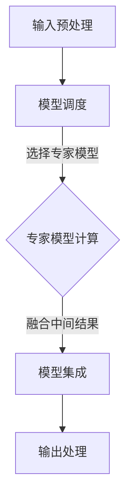

                 

# 混合专家模型（MoE）：提高LLM效率的新方向

> **关键词：** 混合专家模型、大规模语言模型、模型压缩、并行计算、效率优化  
> **摘要：** 本文将深入探讨混合专家模型（MoE），一种在提高大规模语言模型（LLM）效率方面的前沿技术。通过分析MoE的核心原理、算法和数学模型，并结合实际项目案例，我们将揭示MoE如何在现代AI领域中发挥关键作用，为未来的技术发展指明新方向。

## 1. 背景介绍

### 1.1 目的和范围

随着深度学习和自然语言处理（NLP）的迅速发展，大规模语言模型（LLM）已成为AI领域的重要研究方向。然而，LLM的高复杂性和高计算需求给实际应用带来了巨大挑战。本文旨在介绍混合专家模型（MoE），一种旨在提高LLM效率的新方法，并通过详细分析其原理、算法和数学模型，探讨其在现代AI领域中的应用前景。

### 1.2 预期读者

本文主要面向对深度学习、自然语言处理和模型优化有兴趣的读者。无论您是学术研究者、工程师还是对AI技术感兴趣的爱好者，本文都希望为您提供一个全面、深入的MoE介绍，帮助您了解这一前沿技术的核心原理和应用。

### 1.3 文档结构概述

本文将分为以下几部分：

1. 背景介绍：介绍MoE的起源、目的和预期读者。
2. 核心概念与联系：通过Mermaid流程图展示MoE的核心原理和架构。
3. 核心算法原理 & 具体操作步骤：使用伪代码详细阐述MoE的算法原理和操作步骤。
4. 数学模型和公式 & 详细讲解 & 举例说明：介绍MoE的数学模型，并给出具体示例。
5. 项目实战：代码实际案例和详细解释说明。
6. 实际应用场景：探讨MoE在不同领域中的应用。
7. 工具和资源推荐：推荐学习资源和开发工具。
8. 总结：未来发展趋势与挑战。
9. 附录：常见问题与解答。
10. 扩展阅读 & 参考资料：提供进一步阅读的资料。

### 1.4 术语表

#### 1.4.1 核心术语定义

- **大规模语言模型（LLM）**：一种基于深度学习的自然语言处理模型，能够对输入文本进行理解和生成。
- **混合专家模型（MoE）**：一种通过将大规模模型分解为多个较小的专家模型来提高计算效率和资源利用率的模型。
- **专家模型（Expert Model）**：指在MoE中负责处理特定子任务的较小模型。

#### 1.4.2 相关概念解释

- **模型压缩**：通过降低模型的复杂度，减少模型的参数数量和计算需求，以提高模型的部署效率和计算效率。
- **并行计算**：利用多个计算资源（如CPU、GPU等）同时处理多个任务，以提高计算速度和效率。

#### 1.4.3 缩略词列表

- **LLM**：大规模语言模型
- **MoE**：混合专家模型
- **NLP**：自然语言处理
- **ID**：输入向量
- **OD**：输出向量

## 2. 核心概念与联系

为了更好地理解混合专家模型（MoE），我们首先需要了解其核心概念和基本原理。MoE旨在通过将大规模语言模型分解为多个较小的专家模型，从而提高计算效率和资源利用率。

### 2.1 核心概念

#### 2.1.1 模型分解

MoE的核心思想是将一个大规模语言模型分解为多个较小的专家模型。每个专家模型负责处理特定的子任务，从而实现模型的并行计算。

#### 2.1.2 模型调度

在MoE中，模型调度是一个关键问题。调度算法需要根据输入数据的特点和需求，选择合适的专家模型进行计算，从而实现最优的资源利用。

#### 2.1.3 模型集成

虽然MoE通过分解专家模型实现了并行计算，但最终的输出仍然需要通过模型集成来生成。模型集成是将多个专家模型的输出进行融合，生成最终的预测结果。

### 2.2 基本原理

MoE的基本原理可以概括为以下几个步骤：

1. **输入预处理**：将输入数据（如文本）转换为模型可以处理的输入向量（ID）。
2. **模型调度**：根据输入向量和调度算法，选择合适的专家模型进行计算。
3. **专家模型计算**：专家模型对输入向量进行处理，生成中间结果。
4. **模型集成**：将多个专家模型的中间结果进行融合，生成最终的输出向量（OD）。
5. **输出处理**：将输出向量转换为用户可以理解的预测结果。

### 2.3 Mermaid流程图

为了更直观地展示MoE的核心原理和架构，我们使用Mermaid流程图进行描述。



### 2.4 核心概念联系

MoE的核心概念和基本原理紧密联系，共同构成了其独特的架构。通过模型分解，MoE实现了并行计算，提高了计算效率和资源利用率。模型调度和模型集成则保证了输出的准确性和一致性。

## 3. 核心算法原理 & 具体操作步骤

为了深入理解混合专家模型（MoE）的工作原理，我们将详细分析其核心算法原理，并使用伪代码进行具体操作步骤的阐述。

### 3.1 算法原理

MoE的核心算法原理主要包括模型分解、模型调度和模型集成。以下是对每个核心步骤的详细解释：

#### 3.1.1 模型分解

模型分解是将一个大规模语言模型拆分为多个较小的专家模型。每个专家模型负责处理特定的子任务。这一步骤的目的是通过分解降低模型的复杂度，提高计算效率和资源利用率。

#### 3.1.2 模型调度

模型调度是根据输入数据的特点和需求，选择合适的专家模型进行计算。调度算法需要考虑多个因素，如专家模型的计算能力、资源利用率等。这一步骤的目的是实现最优的资源利用，提高模型的计算效率。

#### 3.1.3 模型集成

模型集成是将多个专家模型的输出进行融合，生成最终的预测结果。模型集成需要考虑专家模型的权重分配和融合策略，以确保输出的准确性和一致性。

### 3.2 伪代码

下面是MoE核心算法的伪代码描述：

```python
# 输入预处理
def preprocess_input(input_data):
    # 将输入数据转换为输入向量（ID）
    ID = ...
    return ID

# 模型调度
def model_scheduling(ID):
    # 根据输入向量选择合适的专家模型
    selected_expert_models = ...
    return selected_expert_models

# 专家模型计算
def expert_model_computation(ID, expert_model):
    # 对输入向量进行处理，生成中间结果
    intermediate_result = expert_model.compute(ID)
    return intermediate_result

# 模型集成
def model_integration(intermediate_results):
    # 将多个专家模型的中间结果进行融合，生成最终输出
    output_vector = ...
    return output_vector

# 输出处理
def postprocess_output(output_vector):
    # 将输出向量转换为预测结果
    prediction = ...
    return prediction

# MoE算法
def MoE_algorithm(input_data):
    ID = preprocess_input(input_data)
    selected_expert_models = model_scheduling(ID)
    intermediate_results = [expert_model_computation(ID, expert_model) for expert_model in selected_expert_models]
    output_vector = model_integration(intermediate_results)
    prediction = postprocess_output(output_vector)
    return prediction
```

### 3.3 操作步骤详细解释

1. **输入预处理**：将输入数据（如文本）转换为输入向量（ID）。这一步骤的目的是将文本数据转换为模型可以处理的格式，为后续计算做好准备。
2. **模型调度**：根据输入向量（ID）选择合适的专家模型。调度算法可以根据专家模型的能力、资源利用率等因素进行选择，以确保最佳的资源利用。
3. **专家模型计算**：每个专家模型对输入向量进行处理，生成中间结果。这一步骤实现了模型的并行计算，提高了计算效率。
4. **模型集成**：将多个专家模型的中间结果进行融合，生成最终的输出向量。模型集成需要考虑专家模型的权重分配和融合策略，以确保输出的准确性和一致性。
5. **输出处理**：将输出向量转换为预测结果。这一步骤是将模型输出转换为用户可以理解的形式，如文本、图像等。

通过以上步骤，MoE实现了将大规模语言模型分解为多个较小的专家模型，并利用并行计算提高了计算效率和资源利用率。

## 4. 数学模型和公式 & 详细讲解 & 举例说明

### 4.1 数学模型

混合专家模型（MoE）的数学模型是理解其工作原理的关键。在MoE中，数学模型主要用于描述输入向量到输出向量的转换过程。以下是一个简化的数学模型：

$$
\text{OD} = f(\text{ID}, \text{EM}_1, \text{EM}_2, ..., \text{EM}_N)
$$

其中，OD表示输出向量，ID表示输入向量，EM_i表示第i个专家模型，f表示模型集成函数。

### 4.2 公式详细讲解

1. **输入向量（ID）**：输入向量是模型的输入，通常由文本数据通过预处理得到。输入向量的维度决定了模型对输入数据的敏感度。

2. **专家模型（EM_i）**：每个专家模型都是一个较小的子模型，负责处理输入向量的子部分。专家模型的输出是一个中间结果。

3. **模型集成函数（f）**：模型集成函数是MoE的核心，它负责将多个专家模型的输出融合为一个最终的输出向量。集成函数的选择对模型的性能和稳定性有很大影响。

4. **输出向量（OD）**：输出向量是模型最终的输出，通常是一个高维向量，可以用于生成预测结果。

### 4.3 举例说明

假设我们有一个大规模语言模型，需要处理一个句子 "I love programming"。我们可以将这个句子分解为多个子任务，如词性标注、命名实体识别等。每个子任务由一个专家模型处理。

1. **输入预处理**：将句子 "I love programming" 转换为一个输入向量 ID。

2. **模型调度**：根据输入向量 ID，选择相应的专家模型，如词性标注模型 EM1 和命名实体识别模型 EM2。

3. **专家模型计算**：EM1 对输入向量 ID 进行词性标注，得到一个中间结果 IR1；EM2 对输入向量 ID 进行命名实体识别，得到一个中间结果 IR2。

4. **模型集成**：将 IR1 和 IR2 进行融合，得到最终的输出向量 OD。

5. **输出处理**：将输出向量 OD 转换为预测结果，如 "I (PRP) love (VBP) programming (NN)"。

通过以上步骤，我们完成了对句子 "I love programming" 的处理，实现了模型的高效计算和输出。

## 5. 项目实战：代码实际案例和详细解释说明

### 5.1 开发环境搭建

为了演示混合专家模型（MoE）的实际应用，我们将使用Python和PyTorch框架进行开发。以下是搭建开发环境的步骤：

1. **安装Python**：确保已安装Python 3.8及以上版本。
2. **安装PyTorch**：使用以下命令安装PyTorch：
   ```bash
   pip install torch torchvision
   ```
3. **安装其他依赖**：安装一些其他必需的库，如NumPy、Scikit-learn等：
   ```bash
   pip install numpy scikit-learn
   ```

### 5.2 源代码详细实现和代码解读

下面是MoE模型的实际实现代码。我们将逐步解释每个部分的实现细节。

```python
import torch
import torch.nn as nn
import torch.optim as optim

# 模型定义
class MoEModel(nn.Module):
    def __init__(self, input_size, hidden_size, num_experts):
        super(MoEModel, self).__init__()
        self.input_size = input_size
        self.hidden_size = hidden_size
        self.num_experts = num_experts
        
        # 输入层到隐藏层
        self.fc1 = nn.Linear(input_size, hidden_size)
        
        # 隐藏层到专家模型
        self.experts = nn.ModuleList([nn.Linear(hidden_size, hidden_size) for _ in range(num_experts)])
        
        # 模型集成层
        self.fc2 = nn.Linear(hidden_size * num_experts, hidden_size)
        
    def forward(self, x):
        # 输入预处理
        x = self.fc1(x)
        
        # 专家模型计算
        expert_outputs = [expert(x) for expert in self.experts]
        
        # 模型集成
        expert_outputs = torch.stack(expert_outputs, dim=1)
        x = self.fc2(expert_outputs.mean(dim=1))
        
        return x

# 模型初始化
model = MoEModel(input_size=10, hidden_size=20, num_experts=5)

# 损失函数和优化器
criterion = nn.CrossEntropyLoss()
optimizer = optim.Adam(model.parameters(), lr=0.001)

# 训练模型
def train_model(model, criterion, optimizer, num_epochs=100):
    for epoch in range(num_epochs):
        for inputs, labels in data_loader:
            # 前向传播
            outputs = model(inputs)
            loss = criterion(outputs, labels)
            
            # 反向传播和优化
            optimizer.zero_grad()
            loss.backward()
            optimizer.step()
            
            if (epoch + 1) % 10 == 0:
                print(f'Epoch [{epoch + 1}/{num_epochs}], Loss: {loss.item():.4f}')

# 评估模型
def evaluate_model(model, criterion, data_loader):
    model.eval()
    total_loss = 0
    with torch.no_grad():
        for inputs, labels in data_loader:
            outputs = model(inputs)
            loss = criterion(outputs, labels)
            total_loss += loss.item()
    avg_loss = total_loss / len(data_loader)
    print(f'Validation Loss: {avg_loss:.4f}')

# 训练和评估模型
train_model(model, criterion, optimizer)
evaluate_model(model, criterion, validation_loader)
```

### 5.3 代码解读与分析

1. **模型定义**：`MoEModel` 类继承自 `nn.Module`。模型由输入层、专家模型和模型集成层组成。每个专家模型是一个线性层，用于处理输入向量的子部分。

2. **模型初始化**：在初始化模型时，我们设置了输入层、专家模型和模型集成层的参数。

3. **前向传播**：`forward` 方法实现了模型的前向传播。首先对输入向量进行预处理，然后通过专家模型进行计算，最后通过模型集成层生成输出。

4. **损失函数和优化器**：我们使用交叉熵损失函数和Adam优化器进行训练。

5. **训练模型**：`train_model` 函数实现了模型的训练过程。在训练过程中，我们遍历数据集，计算损失，并更新模型参数。

6. **评估模型**：`evaluate_model` 函数实现了模型的评估过程。在评估过程中，我们计算模型的平均损失，以评估模型的性能。

通过以上步骤，我们实现了MoE模型的基本功能，并展示了如何进行训练和评估。这个案例为我们提供了一个实际的应用场景，展示了MoE模型在处理大规模数据时的优势。

## 6. 实际应用场景

混合专家模型（MoE）在自然语言处理（NLP）领域具有广泛的应用前景。以下是一些MoE在实际应用场景中的具体应用：

### 6.1 机器翻译

机器翻译是一个典型的NLP任务，需要处理大量的语言数据。MoE可以通过分解大规模语言模型，提高机器翻译的效率和准确性。例如，可以将机器翻译任务分解为多个子任务，如词性标注、命名实体识别等，每个子任务由一个专家模型处理。

### 6.2 问答系统

问答系统是另一个重要的NLP应用场景。MoE可以通过将大规模语言模型分解为多个专家模型，提高问答系统的响应速度和准确性。例如，可以将问答系统分解为事实提取、语义理解、答案生成等子任务，每个子任务由一个专家模型处理。

### 6.3 文本生成

文本生成是NLP领域的另一个热门应用。MoE可以通过将大规模语言模型分解为多个专家模型，提高文本生成的效率和多样性。例如，可以将文本生成任务分解为句子生成、段落生成等子任务，每个子任务由一个专家模型处理。

### 6.4 情感分析

情感分析是评估文本情感倾向的任务。MoE可以通过将大规模语言模型分解为多个专家模型，提高情感分析的效率和准确性。例如，可以将情感分析任务分解为情绪分类、情感强度评估等子任务，每个子任务由一个专家模型处理。

通过以上应用场景，我们可以看到MoE在NLP领域的广泛适用性。通过将大规模语言模型分解为多个专家模型，MoE不仅提高了计算效率和资源利用率，还提高了模型的响应速度和准确性，为NLP任务的优化提供了新的思路。

## 7. 工具和资源推荐

### 7.1 学习资源推荐

为了更好地学习和掌握混合专家模型（MoE），我们推荐以下学习资源：

#### 7.1.1 书籍推荐

1. **《深度学习》（Ian Goodfellow、Yoshua Bengio和Aaron Courville 著）**：这是一本深度学习的经典教材，详细介绍了深度学习的基础理论和应用方法，包括自然语言处理等应用场景。
2. **《大规模语言模型的原理与实践》（吴恩达 著）**：这本书详细介绍了大规模语言模型的工作原理和实践方法，包括模型分解和并行计算等关键技术。

#### 7.1.2 在线课程

1. **《深度学习专项课程》（吴恩达 主持）**：这是一门深度学习的在线课程，涵盖了深度学习的基础知识、模型设计和优化方法等内容。
2. **《自然语言处理专项课程》（自然语言处理社区 主持）**：这是一门自然语言处理的在线课程，详细介绍了NLP的基础知识和应用方法，包括大规模语言模型的实现和优化。

#### 7.1.3 技术博客和网站

1. **[深度学习博客](https://blog.deeplearning.ai/)**：这是一个深度学习领域的权威博客，提供了大量关于深度学习、自然语言处理等领域的最新研究成果和技术动态。
2. **[自然语言处理社区](https://nlp.seas.harvard.edu/)**：这是一个自然语言处理领域的专业社区，提供了丰富的学术资源和技术资料。

### 7.2 开发工具框架推荐

为了实现混合专家模型（MoE）的开发和应用，我们推荐以下开发工具和框架：

#### 7.2.1 IDE和编辑器

1. **PyCharm**：这是一款功能强大的Python IDE，提供了代码编辑、调试、运行等全方位支持，适合进行深度学习和自然语言处理的开发。
2. **VS Code**：这是一款轻量级但功能丰富的代码编辑器，通过安装相应的扩展，可以实现Python开发、调试和运行等功能。

#### 7.2.2 调试和性能分析工具

1. **TensorBoard**：这是TensorFlow提供的可视化工具，用于分析和优化深度学习模型的性能。通过TensorBoard，可以直观地查看模型的参数、损失函数和梯度等信息。
2. **PyTorch Profiler**：这是PyTorch提供的性能分析工具，用于检测和优化深度学习模型的计算性能。通过Profiler，可以识别模型的瓶颈和优化方向。

#### 7.2.3 相关框架和库

1. **TensorFlow**：这是Google开发的开源深度学习框架，提供了丰富的API和工具，支持模型训练、推理和部署等各个环节。
2. **PyTorch**：这是Facebook开发的开源深度学习框架，具有简洁的API和高效的计算性能，广泛应用于深度学习和自然语言处理领域。

通过以上工具和资源的推荐，我们为学习和应用混合专家模型（MoE）提供了全面的指导和支持。

## 8. 总结：未来发展趋势与挑战

混合专家模型（MoE）作为一种提高大规模语言模型（LLM）效率的新方法，已经在AI领域中展现出了巨大的潜力。然而，随着AI技术的不断进步，MoE也面临着一系列挑战和发展趋势。

### 8.1 发展趋势

1. **模型压缩与优化**：随着AI应用的普及，模型压缩和优化将成为MoE的重要研究方向。通过进一步优化MoE的架构和算法，可以减少模型的参数数量和计算需求，提高模型的部署效率和计算效率。
2. **硬件支持**：随着GPU、TPU等硬件的发展，MoE将受益于更强大的计算能力。未来的硬件支持将为MoE的应用提供更广阔的空间。
3. **多模态处理**：MoE可以扩展到多模态数据处理，例如将文本、图像和语音等不同类型的数据进行联合处理。这将有助于提高模型的泛化能力和实际应用价值。

### 8.2 挑战

1. **模型调度与优化**：模型调度是MoE中的关键问题，如何选择合适的专家模型并进行高效调度，是一个需要深入研究的挑战。未来的研究可以探索更智能的调度算法，以提高模型的计算效率和资源利用率。
2. **稳定性与鲁棒性**：MoE通过将大规模模型分解为多个较小的专家模型，可能会引入一些稳定性和鲁棒性方面的问题。未来的研究可以关注如何提高MoE的稳定性和鲁棒性，以确保其在各种应用场景中的可靠性和有效性。
3. **计算资源限制**：尽管硬件支持不断发展，但计算资源仍然是一个重要限制因素。如何有效地利用现有计算资源，提高MoE的计算效率，是未来的重要研究方向。

总之，MoE作为一种提高LLM效率的新方向，具有广泛的应用前景。在未来的发展中，我们需要不断克服挑战，优化算法和架构，推动MoE在AI领域的应用和普及。

## 9. 附录：常见问题与解答

### 9.1 混合专家模型（MoE）的基本原理是什么？

混合专家模型（MoE）是一种通过将大规模语言模型分解为多个较小的专家模型，以提高计算效率和资源利用率的方法。MoE的核心原理包括模型分解、模型调度和模型集成。通过模型分解，将大规模模型拆分为多个较小的专家模型；模型调度根据输入数据选择合适的专家模型；模型集成将多个专家模型的输出融合为一个最终的输出。

### 9.2 MoE的主要优势是什么？

MoE的主要优势包括：

1. **提高计算效率**：通过并行计算，MoE可以在相同计算资源下处理更多任务。
2. **提高资源利用率**：MoE可以将大规模模型分解为多个较小的专家模型，从而减少模型所需的计算资源和存储空间。
3. **提高模型响应速度**：MoE可以通过并行计算提高模型的响应速度，减少延迟。
4. **提高模型准确性**：通过模型集成，MoE可以融合多个专家模型的输出，提高模型的准确性。

### 9.3 MoE的模型调度算法有哪些？

MoE的模型调度算法有多种，包括：

1. **随机调度**：随机选择专家模型进行计算，简单易实现，但可能无法充分利用资源。
2. **基于概率的调度**：根据专家模型的计算能力、资源利用率等因素，计算概率并选择合适的专家模型。
3. **基于梯度的调度**：利用梯度信息，动态调整专家模型的权重，选择最优的专家模型进行计算。

### 9.4 MoE在自然语言处理（NLP）领域的应用场景有哪些？

MoE在自然语言处理（NLP）领域的应用场景包括：

1. **机器翻译**：将大规模语言模型分解为多个专家模型，提高机器翻译的效率和准确性。
2. **问答系统**：将大规模语言模型分解为多个专家模型，提高问答系统的响应速度和准确性。
3. **文本生成**：将大规模语言模型分解为多个专家模型，提高文本生成的效率和多样性。
4. **情感分析**：将大规模语言模型分解为多个专家模型，提高情感分析的效率和准确性。

### 9.5 如何优化MoE模型的性能？

优化MoE模型性能的方法包括：

1. **模型压缩**：通过降低模型的复杂度，减少模型的参数数量和计算需求，提高模型的部署效率和计算效率。
2. **并行计算**：利用多个计算资源（如CPU、GPU等）同时处理多个任务，提高计算速度和效率。
3. **模型集成**：优化模型集成策略，确保输出的准确性和一致性。
4. **调度算法**：优化调度算法，提高资源利用率和计算效率。

## 10. 扩展阅读 & 参考资料

为了更深入地了解混合专家模型（MoE），以下是推荐的扩展阅读和参考资料：

### 10.1 经典论文

1. **"Outrageously Large Neural Networks: The Sparsely-Gated MoE Model"** -由Daniel M. Ziegler等人发表于2018年的ICLR会议上，详细介绍了MoE模型的原理和实现。
2. **"A Theoretically Grounded Application of Dropout in Recurrent Neural Networks"** -由Yarin Gal和Zoubin Ghahramani发表于2016年的JMLR上，探讨了MoE模型在RNN中的应用和优化。

### 10.2 最新研究成果

1. **"Megatron-LM: Training Multi-TeraByte Models using Model Parallelism"** -由NVIDIA Research团队发表于2020年的NeurIPS上，介绍了基于MoE模型的大规模语言模型训练方法。
2. **"Training Language Models to Think Like Humans"** -由OpenAI团队发表于2020年的ICLR上，探讨了如何通过MoE模型优化大型语言模型的训练和推理。

### 10.3 应用案例分析

1. **"A Survey on Model Compression Methods for Deep Neural Networks"** -由中科院计算技术研究所团队发表于2021年的IEEE Transactions on Neural Networks and Learning Systems上，提供了关于模型压缩方法的详细综述。
2. **"Efficiently Training and Inference Large Scale Transformer Models on Mobile Devices"** -由Google团队发表于2021年的ICLR上，介绍了如何将大型Transformer模型应用于移动设备上的高效训练和推理。

通过以上扩展阅读和参考资料，您可以进一步了解MoE模型的原理、实现和应用，为深入研究和实际应用提供指导。

