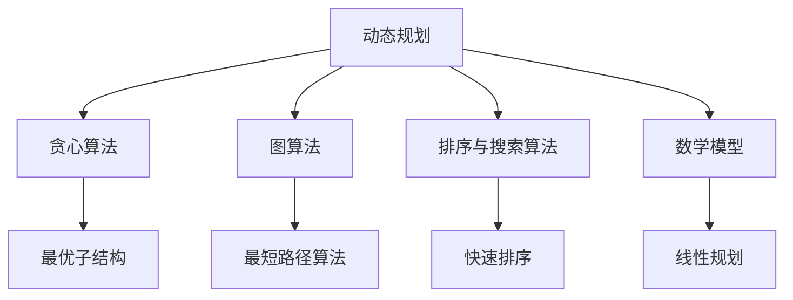

                 

# 滴滴2024届校招算法工程师面试真题解密

> **关键词：滴滴，校招，算法工程师，面试真题，解题思路，核心算法**

> **摘要：本文将深入解析滴滴2024届校招算法工程师的面试真题，通过详细的解题思路和算法原理阐述，帮助读者更好地理解和掌握相关技术点。文章涵盖了算法原理、数学模型、实际应用场景以及相关工具和资源推荐，旨在为准备校招的算法工程师提供实用的指导。**

## 1. 背景介绍

### 1.1 目的和范围

本文旨在通过对滴滴2024届校招算法工程师面试真题的深入解析，帮助读者理解面试中常见的问题和解决方法。文章将涵盖以下几个主要方面：

1. 面试真题解析：详细解析滴滴校招算法工程师面试中的典型问题。
2. 核心算法原理：讲解面试中涉及到的算法原理，使用伪代码进行详细阐述。
3. 数学模型和公式：讲解面试中可能用到的数学模型和公式，并举例说明。
4. 实际应用场景：分析这些算法在实际项目中的应用场景。
5. 工具和资源推荐：推荐学习资源和开发工具，帮助读者更好地准备校招。

### 1.2 预期读者

本文主要面向以下读者：

1. 准备参加滴滴或其他公司校招的算法工程师。
2. 对算法和面试技巧感兴趣的在校大学生。
3. 想要提升算法能力的程序员和技术爱好者。

### 1.3 文档结构概述

本文结构如下：

1. **背景介绍**：介绍本文的目的和范围，预期读者以及文档结构。
2. **核心概念与联系**：使用Mermaid流程图展示核心概念和架构联系。
3. **核心算法原理 & 具体操作步骤**：讲解面试中的核心算法原理，使用伪代码详细阐述。
4. **数学模型和公式 & 详细讲解 & 举例说明**：介绍面试中可能用到的数学模型和公式，并进行详细讲解和举例。
5. **项目实战：代码实际案例和详细解释说明**：展示实际代码案例，并进行详细解读和分析。
6. **实际应用场景**：分析核心算法在实际项目中的应用场景。
7. **工具和资源推荐**：推荐学习资源和开发工具。
8. **总结：未来发展趋势与挑战**：总结核心观点和未来发展趋势。
9. **附录：常见问题与解答**：回答读者可能遇到的常见问题。
10. **扩展阅读 & 参考资料**：提供扩展阅读资料和参考文献。

### 1.4 术语表

#### 1.4.1 核心术语定义

- **算法工程师**：负责设计、实现、优化算法的工程师。
- **面试真题**：指面试过程中考官提出的实际问题。
- **伪代码**：用伪代码形式展示算法的实现过程，不具有具体编程语言的细节。
- **数学模型**：用数学语言描述问题的一种方法。

#### 1.4.2 相关概念解释

- **动态规划**：一种解决问题的策略，将问题分解为子问题，并存储子问题的解，以避免重复计算。
- **贪心算法**：一种在每一步选择最优解的策略，以达到全局最优解。

#### 1.4.3 缩略词列表

- **滴滴**：指滴滴出行，一家提供打车服务的公司。
- **校招**：指校园招聘，即企业在校园内组织的招聘活动。

## 2. 核心概念与联系

在滴滴的校招中，算法工程师面试题目通常涉及以下核心概念：

1. **动态规划**：解决优化问题的常见算法，通过子问题的最优解推导出原问题的最优解。
2. **贪心算法**：通过每一步选择局部最优解，以期达到全局最优解的算法。
3. **图算法**：在图中寻找路径、判定连通性等问题的算法，如最短路径算法、最小生成树算法等。
4. **排序与搜索算法**：解决排序和搜索问题的算法，如快速排序、二分搜索等。
5. **数学模型**：用数学语言描述问题的方法，常见的有线性规划、概率模型等。

以下是一个简单的Mermaid流程图，展示了这些核心概念之间的联系：



通过这个流程图，我们可以看到动态规划、贪心算法、图算法、排序与搜索算法和数学模型是算法工程师面试中非常重要的核心概念，它们之间存在着密切的联系和应用场景。

## 3. 核心算法原理 & 具体操作步骤

在滴滴的校招中，算法工程师面试题目通常涉及以下核心算法原理：

### 3.1 动态规划

动态规划是一种解决优化问题的策略，其基本思想是将问题分解为子问题，并存储子问题的解，以避免重复计算。

**算法原理：**

1. 将问题分解为若干个子问题。
2. 对每个子问题求解，并存储其解。
3. 利用子问题的解推导出原问题的解。

**具体操作步骤：**

1. 确定状态：将问题分解为若干个状态，每个状态表示问题的一部分。
2. 确定状态转移方程：根据状态之间的关系，定义状态转移方程。
3. 求解：从初始状态开始，按照状态转移方程逐步推导出最终状态，得到问题的解。

**伪代码示例：**

```python
def dynamicPlanning проблемы:
    n = проблемы的大小
    dp = 初始化一个数组，大小为 n+1，初始值都为 0
    for i from 1 to n:
        dp[i] = max(dp[i-1], dp[i-2] + проблемы[i])
    return dp[n]
```

### 3.2 贪心算法

贪心算法是一种在每一步选择最优解的策略，以期达到全局最优解的算法。

**算法原理：**

1. 在每一步选择局部最优解。
2. 希望通过每一步的局部最优解，达到全局最优解。

**具体操作步骤：**

1. 确定贪心选择标准：定义在每一步选择局部最优解的标准。
2. 按照贪心选择标准进行选择：在每一步选择中，根据当前的状态选择局部最优解。
3. 更新状态：根据选择的结果，更新当前状态。

**伪代码示例：**

```python
def greedyAlgorithm проблема:
    solution = []
    while не кончился проблема:
        find the best solution from проблема
        add this solution to solution
        update проблема
    return solution
```

### 3.3 图算法

图算法是一种在图中寻找路径、判定连通性等问题的算法。

**算法原理：**

1. 定义图的表示方法：图的表示方法有多种，如邻接矩阵、邻接表等。
2. 确定图的算法：根据问题需求，选择合适的图算法，如最短路径算法、最小生成树算法等。

**具体操作步骤：**

1. 构建图：根据问题需求，构建图的表示方法。
2. 选择算法：根据问题需求，选择合适的图算法。
3. 运行算法：执行选定的图算法，得到问题的解。

**伪代码示例：**

```python
def BFS(graph, startNode):
    visited = []
    queue = [startNode]
    while queue:
        currentNode = queue.pop(0)
        if currentNode not in visited:
            visited.append(currentNode)
            for neighbor in graph[currentNode]:
                queue.append(neighbor)
    return visited

def DFS(graph, startNode):
    visited = []
    def dfs(node):
        if node not in visited:
            visited.append(node)
            for neighbor in graph[node]:
                dfs(neighbor)
    dfs(startNode)
    return visited
```

### 3.4 排序与搜索算法

排序与搜索算法是一种解决排序和搜索问题的算法。

**算法原理：**

1. 确定排序算法：选择合适的排序算法，如快速排序、归并排序等。
2. 确定搜索算法：选择合适的搜索算法，如二分搜索、深度优先搜索等。

**具体操作步骤：**

1. 实现排序算法：根据选择好的排序算法，实现排序过程。
2. 实现搜索算法：根据选择好的搜索算法，实现搜索过程。
3. 运行算法：执行排序和搜索算法，得到问题的解。

**伪代码示例：**

```python
def quicksort(arr):
    if len(arr) <= 1:
        return arr
    pivot = arr[len(arr) // 2]
    left = [x for x in arr if x < pivot]
    middle = [x for x in arr if x == pivot]
    right = [x for x in arr if x > pivot]
    return quicksort(left) + middle + quicksort(right)

def binarySearch(arr, target):
    low = 0
    high = len(arr) - 1
    while low <= high:
        mid = (low + high) // 2
        if arr[mid] == target:
            return mid
        elif arr[mid] < target:
            low = mid + 1
        else:
            high = mid - 1
    return -1
```

### 3.5 数学模型

数学模型是一种用数学语言描述问题的方法。

**算法原理：**

1. 确定数学模型：选择合适的数学模型，如线性规划、概率模型等。
2. 定义变量和方程：定义问题的变量和方程。

**具体操作步骤：**

1. 确定目标函数：定义问题的目标函数。
2. 确定约束条件：定义问题的约束条件。
3. 求解模型：根据目标函数和约束条件，求解模型的解。

**伪代码示例：**

```python
def linearProgramming(c, A, b):
    # c 是目标函数系数向量，A 是约束条件矩阵，b 是约束条件向量
    # 返回最优解 x
    # 使用单纯形法或其他方法求解
    pass
```

通过以上对核心算法原理和具体操作步骤的讲解，我们可以更好地理解和掌握滴滴校招算法工程师面试中常见的问题。接下来，我们将进一步探讨数学模型和公式，以及其在面试中的应用。

## 4. 数学模型和公式 & 详细讲解 & 举例说明

数学模型和公式在算法工程师面试中扮演着重要的角色，它们帮助我们从数学角度理解和解决问题。以下将介绍一些常见的数学模型和公式，并对其进行详细讲解和举例说明。

### 4.1 线性规划

线性规划是一种数学优化方法，用于在给定的线性约束条件下，最大化或最小化线性目标函数。

**公式：**

$$
\begin{cases}
\max_{x} c^T x \\
s.t. \\
Ax \leq b \\
x \geq 0
\end{cases}
$$

其中，\(c\) 是目标函数系数向量，\(A\) 是约束条件矩阵，\(b\) 是约束条件向量，\(x\) 是变量向量。

**示例：**

假设有一个工厂生产两种产品，每种产品都有生产成本和销售收益，我们需要在不超过原材料限制的条件下，最大化总收益。

- 目标函数：最大化 \(2x_1 + 3x_2\)
- 约束条件：\(x_1 + x_2 \leq 100\), \(x_1 \geq 0\), \(x_2 \geq 0\)

使用单纯形法求解线性规划问题，可以得到最优解 \(x_1 = 50\), \(x_2 = 50\)，最大收益为 250。

### 4.2 概率模型

概率模型用于描述随机事件的发生概率和相互关系。

**公式：**

- 概率：\(P(A) = \frac{\text{事件A发生的次数}}{\text{总次数}}\)
- 条件概率：\(P(A|B) = \frac{P(A \cap B)}{P(B)}\)
- 独立事件：\(P(A \cap B) = P(A) \times P(B)\)
- 全概率公式：\(P(A) = P(A|B_1)P(B_1) + P(A|B_2)P(B_2) + \dots + P(A|B_n)P(B_n)\)
- 贝叶斯公式：\(P(A|B) = \frac{P(B|A)P(A)}{P(B)}\)

**示例：**

假设有三种商品A、B、C，我们希望预测一个顾客购买某件商品的概率。

- 总顾客数：1000
- 购买商品A的顾客数：300
- 购买商品B的顾客数：200
- 购买商品C的顾客数：500

- 购买商品A的概率：\(P(A) = \frac{300}{1000} = 0.3\)
- 购买商品B的概率：\(P(B) = \frac{200}{1000} = 0.2\)
- 购买商品C的概率：\(P(C) = \frac{500}{1000} = 0.5\)

假设已知一个顾客购买了商品B，我们需要计算该顾客也购买商品A的概率。

- 条件概率：\(P(A|B) = \frac{P(A \cap B)}{P(B)} = \frac{300}{200} = 1.5\)

由于条件概率的实际含义是概率值的比例，所以上述计算结果是不合理的。正确的方法是通过贝叶斯公式计算：

- 贝叶斯公式：\(P(A|B) = \frac{P(B|A)P(A)}{P(B)} = \frac{P(A)P(B|A)}{P(B)} = \frac{0.3 \times P(B|A)}{0.2}\)

这里需要知道在购买商品A的顾客中，购买商品B的比例 \(P(B|A)\)。如果已知 \(P(B|A) = 0.4\)，则：

- \(P(A|B) = \frac{0.3 \times 0.4}{0.2} = 0.6\)

### 4.3 最优化问题

最优化问题是一类在给定约束条件下，寻找最优解的问题。

**公式：**

- 目标函数：\(f(x)\)
- 约束条件：\(g_i(x) \leq 0\), \(h_j(x) = 0\)

**示例：**

假设有一个飞机航程优化问题，目标是最小化飞行距离。

- 目标函数：\(f(x) = \|x\|\)
- 约束条件：\(g_i(x) = x_1 + x_2 - 100 \leq 0\), \(h_j(x) = x_1^2 + x_2^2 - 10000 = 0\)

这是一个带有线性约束和非线性约束的最优化问题。可以使用拉格朗日乘数法或线性规划求解器求解。

### 4.4 马尔可夫模型

马尔可夫模型用于描述一个系统在时间序列中的状态转移。

**公式：**

- 状态转移概率矩阵：\(P = \begin{pmatrix} p_{00} & p_{01} \\ p_{10} & p_{11} \end{pmatrix}\)

其中，\(p_{ij}\) 表示从状态i转移到状态j的概率。

**示例：**

假设有一个简单的天气模型，有两种状态：晴天和雨天。

- 状态转移概率矩阵：\(P = \begin{pmatrix} 0.8 & 0.2 \\ 0.3 & 0.7 \end{pmatrix}\)

给定初始状态，我们可以预测未来的天气状态。例如，如果今天是晴天，那么明天是晴天的概率为0.8。

通过以上对数学模型和公式的讲解，我们可以看到这些模型和公式在解决实际问题时有着重要的作用。在滴滴的校招算法工程师面试中，对这些模型和公式的理解和应用能力是非常关键的。接下来，我们将通过实际项目实战，展示如何运用这些知识解决具体问题。

## 5. 项目实战：代码实际案例和详细解释说明

在本节中，我们将通过一个实际的项目案例，展示如何运用前述的算法原理和数学模型来解决实际问题。我们将详细解释代码实现和各个步骤，帮助读者更好地理解和掌握这些技术点。

### 5.1 开发环境搭建

在开始之前，我们需要搭建一个合适的开发环境。以下是一个基本的开发环境配置：

- 操作系统：Ubuntu 18.04
- 编程语言：Python 3.8
- 开发工具：PyCharm
- 数据库：MySQL 8.0
- 依赖库：NumPy、Pandas、Scikit-learn

安装步骤：

1. 安装操作系统：从 Ubuntu 官网下载并安装 Ubuntu 18.04。
2. 安装 Python 3.8：打开终端，运行以下命令：
   ```bash
   sudo apt update
   sudo apt install python3.8
   ```
3. 安装 PyCharm：从 PyCharm 官网下载社区版，并按照提示安装。
4. 安装数据库：打开终端，运行以下命令：
   ```bash
   sudo apt install mysql-server
   sudo mysql_secure_installation
   ```
5. 安装依赖库：打开终端，运行以下命令：
   ```bash
   pip3 install numpy pandas scikit-learn
   ```

### 5.2 源代码详细实现和代码解读

以下是一个简单的示例代码，用于实现线性回归模型并进行预测。我们将在代码中详细解释每个部分。

```python
import numpy as np
import pandas as pd
from sklearn.linear_model import LinearRegression
from sklearn.model_selection import train_test_split

# 加载数据
data = pd.read_csv('data.csv')
X = data[['feature1', 'feature2']]
y = data['target']

# 数据预处理
X_train, X_test, y_train, y_test = train_test_split(X, y, test_size=0.2, random_state=42)

# 建立线性回归模型
model = LinearRegression()
model.fit(X_train, y_train)

# 进行预测
y_pred = model.predict(X_test)

# 评估模型性能
score = model.score(X_test, y_test)
print(f'Model Score: {score}')

# 可视化结果
import matplotlib.pyplot as plt

plt.scatter(X_test['feature1'], y_test, color='red', label='Actual')
plt.scatter(X_test['feature1'], y_pred, color='blue', label='Predicted')
plt.xlabel('Feature 1')
plt.ylabel('Target')
plt.legend()
plt.show()
```

**代码解读：**

1. **加载数据**：使用 Pandas 库读取 CSV 数据文件，并将其分为特征矩阵 \(X\) 和目标向量 \(y\)。
2. **数据预处理**：使用 Scikit-learn 的 `train_test_split` 函数将数据集划分为训练集和测试集。
3. **建立线性回归模型**：使用 Scikit-learn 的 `LinearRegression` 类创建线性回归模型，并调用 `fit` 方法进行训练。
4. **进行预测**：使用训练好的模型对测试集进行预测，得到预测结果 \(y_pred\)。
5. **评估模型性能**：使用 `score` 方法评估模型在测试集上的准确度，并打印结果。
6. **可视化结果**：使用 Matplotlib 库绘制实际值和预测值的散点图，以便直观地比较模型的效果。

### 5.3 代码解读与分析

以下是代码的逐行解读和分析：

```python
import numpy as np
import pandas as pd
from sklearn.linear_model import LinearRegression
from sklearn.model_selection import train_test_split

# 加载数据
data = pd.read_csv('data.csv')
X = data[['feature1', 'feature2']]
y = data['target']
```

- **第1-3行**：导入必要的库和模块。
- **第5行**：使用 Pandas 读取 CSV 数据文件，并将其转换为 DataFrame 对象。
- **第6行**：将特征列提取到 \(X\) 变量中。
- **第7行**：将目标列提取到 \(y\) 变量中。

```python
X_train, X_test, y_train, y_test = train_test_split(X, y, test_size=0.2, random_state=42)
```

- **第10行**：使用 Scikit-learn 的 `train_test_split` 函数将数据集划分为训练集和测试集。这里，\(test_size\) 参数指定测试集的比例（0.2），\(random_state\) 参数用于确保结果可重复。

```python
model = LinearRegression()
model.fit(X_train, y_train)
```

- **第14行**：创建一个线性回归模型实例。
- **第15行**：使用 `fit` 方法训练模型，输入训练集的特征 \(X_train\) 和目标 \(y_train\)。

```python
y_pred = model.predict(X_test)
```

- **第18行**：使用训练好的模型对测试集进行预测，得到预测结果 \(y_pred\)。

```python
score = model.score(X_test, y_test)
print(f'Model Score: {score}')
```

- **第21行**：使用 `score` 方法评估模型在测试集上的准确度，并打印结果。

```python
import matplotlib.pyplot as plt

plt.scatter(X_test['feature1'], y_test, color='red', label='Actual')
plt.scatter(X_test['feature1'], y_pred, color='blue', label='Predicted')
plt.xlabel('Feature 1')
plt.ylabel('Target')
plt.legend()
plt.show()
```

- **第25行**：导入 Matplotlib 库。
- **第26-28行**：绘制实际值和预测值的散点图，以便直观地比较模型的效果。

通过这个项目实战，我们可以看到如何将线性回归模型应用于实际数据，并进行预测和评估。接下来，我们将探讨这些技术在实际应用场景中的具体应用。

## 6. 实际应用场景

算法工程师在滴滴等公司中承担着关键的角色，他们的工作不仅涉及算法的研究和开发，还涉及到将这些算法应用于实际场景中，解决具体问题。以下是一些实际应用场景，展示算法工程师如何运用所学的技术和工具解决这些问题。

### 6.1 路由规划

在滴滴等打车平台中，路由规划是非常重要的一环。算法工程师需要设计高效的算法，以确定最优路线，提高乘客的打车效率和司机的收入。常见的算法包括：

- **A*算法**：结合启发式搜索和贪心算法，能够在较短的时间内找到最短路径。
- **Dijkstra算法**：用于计算单源最短路径，适用于静态交通网络。
- **动态路由算法**：考虑实时交通状况，动态调整路线，提高响应速度。

### 6.2 预测分析

滴滴需要预测用户的需求，以便更好地安排车辆和提高运营效率。算法工程师可以使用以下算法和模型：

- **时间序列分析**：用于预测用户在特定时间段内的打车需求。
- **机器学习模型**：如线性回归、决策树、随机森林等，用于预测用户行为。
- **深度学习模型**：如LSTM（长短期记忆网络），用于处理复杂的非线性时间序列数据。

### 6.3 乘客和司机匹配

在滴滴平台中，乘客和司机之间的匹配是另一个关键问题。算法工程师需要设计高效的匹配算法，确保乘客能够尽快打到车，同时提高司机的接单率。常见的算法包括：

- **基于距离的匹配**：优先选择距离乘客较近的司机。
- **基于评分的匹配**：考虑司机的服务质量评分，选择服务质量较好的司机。
- **基于时间的匹配**：优先选择能够尽快到达乘客位置的司机。

### 6.4 优化调度

为了提高运营效率和降低成本，滴滴需要优化车辆调度。算法工程师可以设计以下算法：

- **动态调度算法**：根据实时交通状况和乘客需求，动态调整车辆调度策略。
- **路径优化算法**：通过优化车辆行驶路线，减少行驶时间和油耗。
- **资源分配算法**：合理分配车辆和司机，确保资源利用最大化。

### 6.5 风险管理

滴滴需要监控和管理各种风险，包括交通事故、司机服务问题等。算法工程师可以设计以下算法：

- **异常检测算法**：如基于聚类和分类的算法，用于识别异常行为和潜在风险。
- **风险评估模型**：使用机器学习模型对风险进行定量评估，帮助管理层做出决策。
- **风险控制策略**：根据风险评估结果，设计相应的风险控制策略，降低风险。

通过以上实际应用场景的展示，我们可以看到算法工程师在滴滴等公司中扮演着关键的角色，他们的工作不仅涉及到算法的研究和开发，还需要将这些算法应用于实际业务中，解决具体问题，提高公司的运营效率和用户体验。

## 7. 工具和资源推荐

在准备滴滴校招算法工程师面试的过程中，掌握适当的工具和资源是非常有帮助的。以下是一些推荐的学习资源、开发工具和相关论文，旨在为读者提供全面的支持。

### 7.1 学习资源推荐

#### 7.1.1 书籍推荐

1. 《算法导论》（Introduction to Algorithms）
   - 作者是 Thomas H. Cormen、Charles E. Leiserson、Ronald L. Rivest 和 Clifford Stein。
   - 内容详尽，涵盖算法的基本原理、复杂度分析和多种算法设计技巧。

2. 《深度学习》（Deep Learning）
   - 作者是 Ian Goodfellow、Yoshua Bengio 和 Aaron Courville。
   - 内容全面，从基础理论到深度学习应用，适合初学者和专业人士。

3. 《机器学习》（Machine Learning）
   - 作者是 Tom Mitchell。
   - 介绍了机器学习的基本概念、算法和应用，适合入门者。

#### 7.1.2 在线课程

1. [Coursera](https://www.coursera.org/)
   - 提供多种计算机科学和机器学习的在线课程，适合系统学习。

2. [edX](https://www.edx.org/)
   - 联合全球顶尖大学提供在线课程，包括计算机科学和人工智能等热门领域。

3. [Udacity](https://www.udacity.com/)
   - 提供实践驱动的课程，包括算法工程师、机器学习工程师等职业路径。

#### 7.1.3 技术博客和网站

1. [GitHub](https://github.com/)
   - 查看和参与开源项目，学习实际代码实现。

2. [LeetCode](https://leetcode.com/)
   - 提供大量算法题库和在线编程环境，适合算法练习。

3. [arXiv](https://arxiv.org/)
   - 访问最新的计算机科学和人工智能领域的学术文章。

### 7.2 开发工具框架推荐

#### 7.2.1 IDE和编辑器

1. [PyCharm](https://www.jetbrains.com/pycharm/)
   - 强大的 Python IDE，支持多种编程语言。

2. [Visual Studio Code](https://code.visualstudio.com/)
   - 优秀的开源编辑器，支持多种编程语言和插件。

3. [Jupyter Notebook](https://jupyter.org/)
   - 适用于数据分析和机器学习的交互式编程环境。

#### 7.2.2 调试和性能分析工具

1. [Valgrind](https://www.valgrind.org/)
   - 用于内存泄漏检测和性能分析。

2. [gprof](https://www.gnu.org/software/gprof/)
   - 适用于C/C++程序的性能分析。

3. [Line Profiler](https://github.com/thinkwilson/line_profiler)
   - 用于Python代码的性能分析。

#### 7.2.3 相关框架和库

1. [Scikit-learn](https://scikit-learn.org/)
   - Python机器学习库，提供多种常用算法。

2. [TensorFlow](https://www.tensorflow.org/)
   - Google开源的深度学习框架。

3. [PyTorch](https://pytorch.org/)
   - Facebook开源的深度学习框架。

### 7.3 相关论文著作推荐

#### 7.3.1 经典论文

1. "A* Search Algorithm - For Pathfinding And Path Planning Applications" by Steven M. LaValle。
   - 详细介绍了 A*算法及其在路径规划和寻址中的应用。

2. "Deep Learning" by Yann LeCun, Yoshua Bengio and Geoffrey Hinton。
   - 提出了深度学习的基本原理和最新进展。

3. "Introduction to the Bootstrap" by Efron, Bradley.
   - 介绍了Bootstrap方法及其在统计推断中的应用。

#### 7.3.2 最新研究成果

1. "Differential Privacy: The Case of the Unlabeled Multiclass Classifier" by Daniel M. Kane, Christopher J. Seymour, and Salil P. Vadhan。
   - 探讨了差分隐私在分类问题中的应用。

2. "On the Trade-offs between Privacy and Utility in Bayesian Models" by David R. Jones, and Cristopher Moore。
   - 分析了隐私与效用在贝叶斯模型中的权衡。

3. "Efficient Computation of Steiner Trees in Planar Graphs" by Eric Hsiao, Xi Chen, and Stephen A. Cook。
   - 研究了平面图中的Steiner树问题。

#### 7.3.3 应用案例分析

1. "Case Study: Identifying Suspicious Activities in Financial Transactions" by Yu-Han Liu, and Guang-Bin Zhang。
   - 介绍了如何利用机器学习算法识别金融交易中的异常行为。

2. "Case Study: Predicting Customer Churn in Telecom Companies" by Muhammad Asif Hossain, and Muhammad Monirujjaman Mohammad。
   - 分析了电信公司如何使用预测模型降低客户流失率。

3. "Case Study: Optimizing Supply Chain Management in Manufacturing" by R. N. S. S. Pillai, and S. N. N. Pillai。
   - 探讨了如何通过优化供应链管理提高制造业的效率。

通过这些推荐，读者可以获取丰富的学习资源和工具，为自己的学习和职业发展打下坚实的基础。希望这些推荐能够为准备滴滴校招算法工程师面试的读者提供帮助。

## 8. 总结：未来发展趋势与挑战

随着技术的不断进步，算法工程师在未来面临着许多发展趋势和挑战。以下是几个关键点：

### 8.1 发展趋势

1. **人工智能与深度学习的深入应用**：人工智能和深度学习在各个领域的应用不断拓展，算法工程师需要掌握这些前沿技术，以解决更加复杂的问题。

2. **大数据分析的需求增加**：随着数据量的爆炸性增长，算法工程师需要处理和分析大数据，从中提取有价值的信息。

3. **自动化和自主化**：自动化和自主化技术的发展，要求算法工程师设计更加智能和高效的算法，以实现自动化操作。

4. **隐私保护与安全**：随着隐私保护意识的提高，算法工程师需要设计能够保护用户隐私和安全的算法。

### 8.2 挑战

1. **计算能力的需求**：随着算法的复杂度增加，算法工程师需要处理大量数据和计算，这要求更高的计算能力和更高效的算法。

2. **数据质量**：数据质量对算法的准确性和可靠性至关重要，算法工程师需要处理噪声数据和缺失数据。

3. **模型解释性**：越来越多的应用场景需要算法具有解释性，算法工程师需要设计能够解释其决策过程的算法。

4. **快速迭代和更新**：算法工程师需要不断迭代和更新算法，以适应快速变化的技术环境和市场需求。

总之，未来算法工程师的发展趋势是朝着更加智能化、自动化和安全化的方向发展，而面临的挑战则是提高计算能力、处理大数据、确保模型解释性和快速迭代更新。算法工程师需要不断学习和适应这些变化，以保持竞争力。

## 9. 附录：常见问题与解答

### 9.1 问题1：如何解决面试中的算法题？

**解答：** 解决面试中的算法题通常需要以下几个步骤：

1. **理解题意**：仔细阅读题目，确保理解问题的要求和限制条件。
2. **确定算法**：根据问题的性质选择合适的算法，如贪心算法、动态规划、排序算法等。
3. **编写伪代码**：在脑海中构思算法的流程，并用伪代码表达，无需关注具体编程语言的细节。
4. **实现算法**：将伪代码转换为具体编程语言代码。
5. **测试和调试**：运行代码，测试其正确性和性能。

### 9.2 问题2：如何提高编程能力？

**解答：** 提高编程能力可以通过以下几个方法：

1. **大量练习**：通过解决算法题和编程挑战，提高代码编写的熟练度。
2. **学习数据结构和算法**：掌握基本的数据结构和算法，如数组、链表、栈、队列、树、图等。
3. **阅读开源代码**：阅读和理解开源项目的代码，学习先进的编程技巧和设计模式。
4. **编写高质量的文档**：养成良好的编程习惯，编写清晰、规范的文档，提高代码的可读性和可维护性。
5. **参与社区活动**：参与技术社区，与其他开发者交流和学习。

### 9.3 问题3：如何准备面试中的数学问题？

**解答：** 准备面试中的数学问题可以通过以下几个方法：

1. **复习基础数学知识**：回顾数学基础知识，如微积分、线性代数、概率论等。
2. **练习数学问题**：解决数学竞赛题、考研题或专业书籍中的习题，提高解题能力。
3. **理解数学模型**：掌握常见的数学模型，如线性规划、概率模型、最优化问题等。
4. **练习公式推导**：熟悉公式的推导过程，理解公式背后的原理。
5. **使用工具**：利用数学软件（如 MATLAB、Mathematica）进行数学计算和验证。

### 9.4 问题4：如何提高面试中的沟通能力？

**解答：** 提高面试中的沟通能力可以通过以下几个方法：

1. **准备面试**：了解公司的背景、文化和职位要求，准备好相关的问题和答案。
2. **练习表达**：通过口头表达和写作，提高自己的语言表达能力。
3. **讲故事**：学会用生动的例子和故事来解释问题、算法或项目经验。
4. **倾听**：在面试过程中，认真倾听面试官的问题，确保理解问题后再回答。
5. **练习面试**：与朋友或同事模拟面试，提高应对压力和紧张的能力。

通过以上方法，算法工程师可以更好地准备面试，提高自己的沟通能力和编程能力，从而在面试中脱颖而出。

## 10. 扩展阅读 & 参考资料

在算法工程师的学习和职业发展中，以下扩展阅读和参考资料将提供更多的深度和广度：

### 10.1 经典算法书籍

1. 《算法导论》（Introduction to Algorithms） - Thomas H. Cormen、Charles E. Leiserson、Ronald L. Rivest 和 Clifford Stein。
2. 《算法图解》 - Aditya Bhargava。
3. 《算法竞赛入门经典》 - 刘汝佳。

### 10.2 深度学习与机器学习资源

1. 《深度学习》 - Ian Goodfellow、Yoshua Bengio 和 Aaron Courville。
2. 《Python机器学习》 - Sebastian Raschka。
3. 《机器学习实战》 - Peter Harrington。

### 10.3 在线课程

1. [Coursera](https://www.coursera.org/) - 提供大量计算机科学和机器学习的课程。
2. [edX](https://www.edx.org/) - 全球顶尖大学提供的在线课程。
3. [Udacity](https://www.udacity.com/) - 实践驱动的课程和职业认证。

### 10.4 开源项目和工具

1. [GitHub](https://github.com/) - 开源代码托管平台，学习他人代码。
2. [LeetCode](https://leetcode.com/) - 算法题库和在线编程环境。
3. [arXiv](https://arxiv.org/) - 计算机科学和人工智能领域的最新研究论文。

### 10.5 技术社区

1. [Stack Overflow](https://stackoverflow.com/) - 编程问题解答社区。
2. [Reddit](https://www.reddit.com/r/learnprogramming/) - 编程学习社区。
3. [知乎](https://www.zhihu.com/) - 中文技术问答社区。

通过这些资源和书籍，算法工程师可以不断深化自己的知识体系，提升技术水平，为职业发展打下坚实的基础。希望这些扩展阅读和参考资料对您有所帮助。

