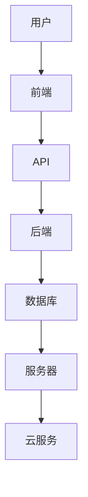
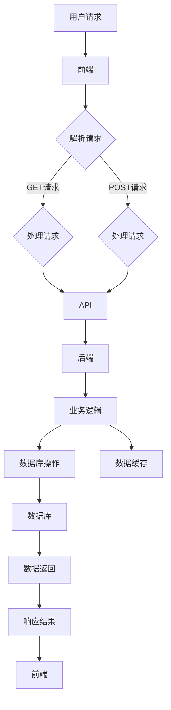

                 

# 滴滴2024校招后端开发工程师面试题集

> **关键词：**滴滴、校招、后端开发、面试题、算法、架构、实战、数学模型、资源推荐  
>
> **摘要：**本文将深入剖析滴滴2024年校招后端开发工程师的面试题，涵盖核心算法原理、具体操作步骤、数学模型及公式、项目实战、应用场景、工具和资源推荐等多方面内容，旨在为广大求职者提供有针对性的指导，助您在校招中脱颖而出。

## 1. 背景介绍

### 1.1 目的和范围

本文旨在帮助有意向参加滴滴2024年校招后端开发工程师岗位的求职者，通过系统性地分析滴滴面试题，深入了解面试的核心考点和解题方法。本文将涵盖以下内容：

- **核心算法原理与操作步骤**：详细解析面试中常见的数据结构与算法问题，提供伪代码和实际操作步骤。
- **数学模型与公式**：介绍相关数学模型及其在面试中的应用，结合实例进行详细讲解。
- **项目实战**：通过实际代码案例，展示面试题的解决方案，并详细解读代码逻辑。
- **应用场景**：探讨算法在实际业务场景中的应用，帮助求职者更好地理解面试题的实践意义。
- **工具和资源推荐**：推荐学习资源、开发工具和相关研究论文，为求职者提供全面的备考支持。

### 1.2 预期读者

- **后端开发工程师**：正在准备滴滴校招或有意向参加校招的后端开发工程师。
- **算法爱好者**：对数据结构与算法有浓厚兴趣，希望提升算法解题能力的开发者。
- **求职者**：准备其他公司校招或求职的后端开发工程师，本文中的一些解题思路和方法同样适用。

### 1.3 文档结构概述

本文将按照以下结构进行展开：

1. **背景介绍**：介绍本文的目的、范围和预期读者，概述文档结构。
2. **核心概念与联系**：通过Mermaid流程图展示核心概念和架构，帮助读者建立整体认知。
3. **核心算法原理 & 具体操作步骤**：详细讲解面试中常见的算法问题，提供伪代码和操作步骤。
4. **数学模型和公式 & 详细讲解 & 举例说明**：介绍相关数学模型，结合实例进行详细讲解。
5. **项目实战：代码实际案例和详细解释说明**：通过实际代码案例展示解决方案，详细解读代码逻辑。
6. **实际应用场景**：探讨算法在实际业务场景中的应用。
7. **工具和资源推荐**：推荐学习资源、开发工具和相关研究论文。
8. **总结：未来发展趋势与挑战**：总结本文内容，展望未来发展趋势和挑战。
9. **附录：常见问题与解答**：列举常见面试问题及其解答。
10. **扩展阅读 & 参考资料**：提供进一步学习的参考资料。

### 1.4 术语表

#### 1.4.1 核心术语定义

- **后端开发**：后端开发是指开发服务器、数据库、应用程序等后端系统的过程，通常涉及数据库设计、服务器架构、API接口等。
- **校招**：校园招聘，是指企业到高校进行招聘活动，以吸纳应届毕业生。
- **面试题**：面试过程中提出的问题，旨在考察应聘者的技术能力、逻辑思维和解决问题的能力。

#### 1.4.2 相关概念解释

- **数据结构**：数据结构是指数据在计算机存储和组织的方式，常用的数据结构有数组、链表、树、图等。
- **算法**：算法是一系列解决问题的步骤，通过输入数据产生相应的输出。算法有排序、查找、图算法等。

#### 1.4.3 缩略词列表

- **API**：应用程序编程接口，是一种让不同软件之间进行通信的接口。
- **IDE**：集成开发环境，是一种用于软件开发的环境，集成了代码编辑、编译、调试等功能。

## 2. 核心概念与联系

为了更好地理解滴滴后端开发工程师面试题，我们首先需要了解一些核心概念和联系。以下是一个简单的Mermaid流程图，展示了后端开发中的一些关键组成部分。



### 2.1 核心概念解析

- **用户**：前端用户，通过浏览器或其他客户端与系统进行交互。
- **前端**：负责展示用户界面，通常使用HTML、CSS和JavaScript等技术实现。
- **API**：应用程序编程接口，用于前后端通信，通常采用RESTful风格。
- **后端**：负责处理业务逻辑、数据存储和数据处理，通常使用Java、Python、Go等编程语言。
- **数据库**：用于存储数据，常用的数据库有MySQL、PostgreSQL、MongoDB等。
- **服务器**：提供计算资源和服务，可以是物理服务器或虚拟服务器。
- **云服务**：提供云计算资源，如AWS、Azure、Google Cloud等。

### 2.2 后端开发中的联系

后端开发中的各个部分之间紧密联系，共同构成一个完整的系统。以下是一个更详细的后端开发流程图。



在这个流程图中，用户请求通过前端发送到后端，后端处理后返回结果给前端，整个过程中涉及到API、后端业务逻辑、数据库操作和数据缓存等多个环节。

## 3. 核心算法原理 & 具体操作步骤

在滴滴后端开发工程师的面试中，算法和数据结构是一个重要的考察点。以下我们将介绍一些常见的算法问题，并提供具体的操作步骤和伪代码。

### 3.1 排序算法

排序算法是面试中常见的问题，以下是一些常见的排序算法及其操作步骤。

#### 3.1.1 冒泡排序

冒泡排序是一种简单的排序算法，其基本思想是通过重复地交换相邻的两个未按顺序排列的元素，直到整个序列有序。

**操作步骤：**

1. 遍历要排序的数组。
2. 对于当前遍历到的每个元素，与其相邻的元素进行比较。
3. 如果当前元素比相邻的元素大，则交换它们的位置。
4. 重复步骤2和3，直到整个数组有序。

**伪代码：**

```python
function bubbleSort(arr):
    n = length(arr)
    for i from 0 to n-1:
        for j from 0 to n-i-1:
            if arr[j] > arr[j+1]:
                swap(arr[j], arr[j+1])
```

#### 3.1.2 选择排序

选择排序是一种简单的选择排序算法，其基本思想是在每次遍历中找到未排序部分的最小元素，并将其放到已排序部分的末尾。

**操作步骤：**

1. 遍历要排序的数组。
2. 在未排序部分找到最小元素的下标。
3. 将最小元素与未排序部分的第一个元素交换。
4. 重复步骤2和3，直到整个数组有序。

**伪代码：**

```python
function selectionSort(arr):
    n = length(arr)
    for i from 0 to n-1:
        minIndex = i
        for j from i+1 to n:
            if arr[j] < arr[minIndex]:
                minIndex = j
        swap(arr[i], arr[minIndex])
```

### 3.2 查找算法

查找算法是面试中另一个常见的算法问题，以下介绍一些常见的查找算法。

#### 3.2.1 二分查找

二分查找是一种高效的查找算法，其基本思想是将有序数组分成两半，每次查找都在其中一半进行，直到找到目标元素或确定目标元素不存在。

**操作步骤：**

1. 定义左右边界low和high。
2. 计算中间位置mid = (low + high) / 2。
3. 如果arr[mid]等于目标值，返回mid。
4. 如果arr[mid]小于目标值，将low更新为mid + 1。
5. 如果arr[mid]大于目标值，将high更新为mid - 1。
6. 重复步骤2-5，直到找到目标元素或确定目标元素不存在。

**伪代码：**

```python
function binarySearch(arr, target):
    low = 0
    high = length(arr) - 1
    while low <= high:
        mid = (low + high) / 2
        if arr[mid] == target:
            return mid
        elif arr[mid] < target:
            low = mid + 1
        else:
            high = mid - 1
    return -1
```

#### 3.2.2 哈希查找

哈希查找是一种利用哈希函数在哈希表中查找元素的方法，其基本思想是将元素的值通过哈希函数计算出一个哈希值，然后在哈希表中查找该哈希值对应的元素。

**操作步骤：**

1. 将元素的值通过哈希函数计算出一个哈希值。
2. 在哈希表中查找该哈希值对应的元素。
3. 如果找到，返回该元素；否则，返回未找到。

**伪代码：**

```python
function hashSearch(hashTable, value):
    hashValue = hashFunction(value)
    element = hashTable[hashValue]
    if element == value:
        return element
    else:
        return "Not found"
```

### 3.3 图算法

图算法是面试中另一个重要的算法问题，以下介绍一些常见的图算法。

#### 3.3.1 深度优先搜索（DFS）

深度优先搜索是一种用于遍历图的算法，其基本思想是从起始点开始，沿着一条路径一直走到底，然后再回溯到之前的路径继续搜索。

**操作步骤：**

1. 初始化一个访问数组vis，用于记录每个节点是否被访问过。
2. 从起始点开始，将其标记为已访问。
3. 对起始点的所有未访问的邻居节点进行递归调用DFS。
4. 重复步骤2和3，直到所有节点都被访问过。

**伪代码：**

```python
function DFS(graph, start):
    vis = [False] * length(graph)
    vis[start] = True
    for neighbor in graph[start]:
        if not vis[neighbor]:
            DFS(graph, neighbor)
```

#### 3.3.2 广度优先搜索（BFS）

广度优先搜索是一种用于遍历图的算法，其基本思想是从起始点开始，依次访问其所有邻居节点，然后再依次访问邻居节点的邻居节点。

**操作步骤：**

1. 初始化一个队列queue，用于存储待访问的节点。
2. 将起始点入队。
3. 从队列中取出一个节点，将其所有未访问的邻居节点入队。
4. 重复步骤3，直到队列为空。

**伪代码：**

```python
function BFS(graph, start):
    queue = []
    queue.append(start)
    while queue is not empty:
        node = queue.pop()
        for neighbor in graph[node]:
            if not visited[neighbor]:
                queue.append(neighbor)
```

通过以上介绍，我们可以看到在滴滴后端开发工程师的面试中，算法和数据结构是非常重要的考点。掌握常见的排序算法、查找算法和图算法，以及具体的操作步骤和伪代码，将有助于我们更好地应对面试中的算法问题。

## 4. 数学模型和公式 & 详细讲解 & 举例说明

在滴滴后端开发工程师的面试中，数学模型和公式也是一个重要的考察点。以下我们将介绍一些常见的数学模型和公式，并结合实际例子进行详细讲解。

### 4.1 排序算法中的数学模型

在排序算法中，我们经常需要使用到数学模型来评估算法的效率。以下介绍两种常见的数学模型：时间复杂度和空间复杂度。

#### 4.1.1 时间复杂度

时间复杂度是衡量算法运行时间的一个数学模型，它表示算法在处理输入数据时所需的时间增长速度。通常用大O符号表示，如O(1)、O(n)、O(n^2)等。

- **O(1)**：常数时间，表示算法运行时间不随输入数据规模增长而变化。
- **O(n)**：线性时间，表示算法运行时间与输入数据规模成正比。
- **O(n^2)**：平方时间，表示算法运行时间与输入数据规模的平方成正比。

**例1：冒泡排序的时间复杂度**

冒泡排序的时间复杂度为O(n^2)。这是因为每一轮排序需要遍历整个数组，而每一轮排序需要比较和交换相邻元素，共需进行n-1轮排序。

```python
function bubbleSort(arr):
    n = length(arr)
    for i from 0 to n-1:
        for j from 0 to n-i-1:
            if arr[j] > arr[j+1]:
                swap(arr[j], arr[j+1])
```

**例2：快速排序的时间复杂度**

快速排序的时间复杂度平均为O(nlogn)，最坏情况下为O(n^2)。这是因为快速排序的基本思想是选择一个基准元素，将数组划分为两个部分，一部分小于基准元素，另一部分大于基准元素。然后递归地对这两个部分进行快速排序。

```python
function quickSort(arr, low, high):
    if low < high:
        pivotIndex = partition(arr, low, high)
        quickSort(arr, low, pivotIndex - 1)
        quickSort(arr, pivotIndex + 1, high)
```

#### 4.1.2 空间复杂度

空间复杂度是衡量算法所需存储空间的一个数学模型，它表示算法在处理输入数据时所需的空间增长速度。同样，用大O符号表示。

- **O(1)**：常数空间，表示算法所需空间不随输入数据规模增长而变化。
- **O(n)**：线性空间，表示算法所需空间与输入数据规模成正比。
- **O(n^2)**：平方空间，表示算法所需空间与输入数据规模的平方成正比。

**例1：冒泡排序的空间复杂度**

冒泡排序的空间复杂度为O(1)。这是因为冒泡排序是在原地进行排序，不需要额外的存储空间。

**例2：快速排序的空间复杂度**

快速排序的空间复杂度平均为O(logn)，最坏情况下为O(n)。这是因为快速排序需要递归地处理子数组，而递归调用的深度与输入数据规模成对数关系。

### 4.2 图算法中的数学模型

在图算法中，我们经常需要使用到数学模型来分析算法的性能。以下介绍两种常见的数学模型：路径长度和连通性。

#### 4.2.1 路径长度

路径长度是指从一个节点到另一个节点的路径上所有边的权值之和。在图算法中，我们经常需要计算最短路径长度。

**例1：Dijkstra算法的最短路径长度**

Dijkstra算法是一种用于计算单源最短路径的算法，其基本思想是从源点开始，逐步扩展到其他节点，每次选择未扩展的节点中距离源点最近的节点进行扩展。

```python
function dijkstra(graph, source):
    dist = [infinity] * length(graph)
    dist[source] = 0
    visited = []
    while length(visited) < length(graph):
        unvisited = [node for node in graph if node not in visited]
        minDist = min(unvisited, key=lambda x: dist[x])
        visited.append(minDist)
        for neighbor in graph[minDist]:
            alt = dist[minDist] + weight(graph[minDist], neighbor)
            if alt < dist[neighbor]:
                dist[neighbor] = alt
    return dist
```

#### 4.2.2 连通性

连通性是指在一个图中，是否存在一条路径从一个节点到达另一个节点。在图算法中，我们经常需要判断图是否连通。

**例1：BFS的连通性判断**

BFS算法可以用于判断图是否连通。我们从起始点开始，逐步扩展到其他节点，如果所有节点都被访问过，则图是连通的。

```python
function bfsConnected(graph, start):
    visited = []
    queue = []
    queue.append(start)
    while queue:
        node = queue.pop(0)
        if node not in visited:
            visited.append(node)
            for neighbor in graph[node]:
                if neighbor not in visited:
                    queue.append(neighbor)
    return length(visited) == length(graph)
```

通过以上介绍，我们可以看到在滴滴后端开发工程师的面试中，数学模型和公式是非常重要的考点。掌握常见的时间复杂度和空间复杂度，以及路径长度和连通性等数学模型，将有助于我们更好地理解面试题，并给出高效的解决方案。

### 4.3 动态规划中的数学模型

动态规划是一种用于求解最优子结构问题的数学方法，其基本思想是将问题分解为多个子问题，并利用子问题的最优解来构建原问题的最优解。以下介绍动态规划中的一些常见数学模型。

#### 4.3.1 最长公共子序列（LCS）

最长公共子序列（LCS）问题是动态规划中的经典问题，其基本思想是通过求解子问题的最优解来构建原问题的最优解。

**定义：**给定两个序列A和B，最长公共子序列是指两个序列中具有最长相同元素的子序列。

**动态规划公式：**

设LCS[i][j]表示A的前i个元素和B的前j个元素的最长公共子序列长度，则：

- 如果A[i] == B[j]，则LCS[i][j] = LCS[i-1][j-1] + 1。
- 如果A[i] != B[j]，则LCS[i][j] = max(LCS[i-1][j], LCS[i][j-1])。

**伪代码：**

```python
function LCS(A, B):
    m = length(A)
    n = length(B)
    dp = [[0] * (n+1) for _ in range(m+1)]
    for i from 1 to m:
        for j from 1 to n:
            if A[i-1] == B[j-1]:
                dp[i][j] = dp[i-1][j-1] + 1
            else:
                dp[i][j] = max(dp[i-1][j], dp[i][j-1])
    return dp[m][n]
```

#### 4.3.2 最长公共子串（LCS）

最长公共子串（LCS）问题是动态规划中的另一个经典问题，其基本思想与最长公共子序列类似。

**定义：**给定两个字符串A和B，最长公共子串是指两个字符串中具有最长相同连续字符的子串。

**动态规划公式：**

设LCS[i][j]表示A的前i个字符和B的前j个字符的最长公共子串长度，则：

- 如果A[i] == B[j]，则LCS[i][j] = LCS[i-1][j-1] + 1。
- 如果A[i] != B[j]，则LCS[i][j] = 0。

**伪代码：**

```python
function LCS(A, B):
    m = length(A)
    n = length(B)
    dp = [[0] * (n+1) for _ in range(m+1)]
    maxLength = 0
    for i from 1 to m:
        for j from 1 to n:
            if A[i-1] == B[j-1]:
                dp[i][j] = dp[i-1][j-1] + 1
                maxLength = max(maxLength, dp[i][j])
            else:
                dp[i][j] = 0
    return maxLength
```

通过以上介绍，我们可以看到动态规划中的数学模型在求解最优子结构问题时非常有用。掌握最长公共子序列（LCS）和最长公共子串（LCS）等动态规划问题，将有助于我们在滴滴后端开发工程师的面试中更好地解决相关问题。

### 4.4 图算法中的数学模型

在图算法中，我们经常需要使用到数学模型来分析算法的性能。以下介绍两种常见的数学模型：图遍历和最短路径。

#### 4.4.1 图遍历

图遍历是指对图中所有节点进行访问的过程。常见的图遍历算法有深度优先搜索（DFS）和广度优先搜索（BFS）。

**DFS的数学模型：**

DFS算法的基本思想是递归地访问节点的所有未访问的邻居节点。

- **时间复杂度**：O(V+E)，其中V是节点数量，E是边数量。
- **空间复杂度**：O(V)，用于存储递归栈。

**伪代码：**

```python
function DFS(graph, start):
    visited = []
    stack = []
    stack.append(start)
    while stack:
        node = stack.pop()
        if node not in visited:
            visited.append(node)
            for neighbor in graph[node]:
                if neighbor not in visited:
                    stack.append(neighbor)
    return visited
```

**BFS的数学模型：**

BFS算法的基本思想是逐层访问图中的节点。

- **时间复杂度**：O(V+E)，其中V是节点数量，E是边数量。
- **空间复杂度**：O(V)，用于存储队列。

**伪代码：**

```python
function BFS(graph, start):
    visited = []
    queue = []
    queue.append(start)
    while queue:
        node = queue.pop(0)
        if node not in visited:
            visited.append(node)
            for neighbor in graph[node]:
                if neighbor not in visited:
                    queue.append(neighbor)
    return visited
```

#### 4.4.2 最短路径

最短路径是指从一个源点到其他所有节点的路径中的最短路径。常见的最短路径算法有迪杰斯特拉算法（Dijkstra）和贝尔曼-福特算法（Bellman-Ford）。

**Dijkstra算法的数学模型：**

Dijkstra算法的基本思想是从源点开始，逐步扩展到其他节点，每次选择未扩展的节点中距离源点最近的节点进行扩展。

- **时间复杂度**：O(VlogV+E)，其中V是节点数量，E是边数量。
- **空间复杂度**：O(V)，用于存储距离表。

**伪代码：**

```python
function Dijkstra(graph, source):
    dist = [infinity] * length(graph)
    dist[source] = 0
    visited = []
    while length(visited) < length(graph):
        unvisited = [node for node in graph if node not in visited]
        minDist = min(unvisited, key=lambda x: dist[x])
        visited.append(minDist)
        for neighbor in graph[minDist]:
            alt = dist[minDist] + weight(graph[minDist], neighbor)
            if alt < dist[neighbor]:
                dist[neighbor] = alt
    return dist
```

**Bellman-Ford算法的数学模型：**

Bellman-Ford算法的基本思想是松弛操作，即不断更新节点的距离估计，直到无法进一步优化。

- **时间复杂度**：O(V*E)，其中V是节点数量，E是边数量。
- **空间复杂度**：O(V)，用于存储距离表。

**伪代码：**

```python
function BellmanFord(graph, source):
    dist = [infinity] * length(graph)
    dist[source] = 0
    for _ in range(length(graph) - 1):
        for edge in graph:
            u, v, w = edge
            if dist[u] + w < dist[v]:
                dist[v] = dist[u] + w
    for edge in graph:
        u, v, w = edge
        if dist[u] + w < dist[v]:
            return "Graph contains a negative weight cycle"
    return dist
```

通过以上介绍，我们可以看到图算法中的数学模型在分析算法性能方面具有重要意义。掌握DFS、BFS、Dijkstra和Bellman-Ford等算法的数学模型，将有助于我们在滴滴后端开发工程师的面试中更好地解决图相关的问题。

### 4.5 回溯算法中的数学模型

回溯算法是一种用于解决组合问题的算法，其基本思想是通过递归尝试所有可能的组合，并回溯到上一个组合，直到找到符合条件的解。

#### 4.5.1 赤兔杀手问题

赤兔杀手问题是一个典型的回溯算法问题，其基本思想是通过递归尝试所有可能的马的颜色组合，并回溯到上一个组合，直到找到符合条件的解。

**定义：**给定一个棋盘和一定数量的马，要求用不同的颜色将棋盘上的所有马染色，使得相邻的马颜色不同。

**数学模型：**

设f(i, j)表示前i行和第j列的马已经被染色的方案数。

- 如果当前行的马没有被染色，则f(i, j) = 1。
- 如果当前行的马已经被染色，则f(i, j) = (k-1) * f(i-1, j)，其中k是当前行的马的数量。

**伪代码：**

```python
function countHorseKillers(board):
    m = length(board)
    n = length(board[0])
    total = 0
    for col in range(n):
        total += backtracking(board, 0, col, [])
    return total

function backtracking(board, row, col, colors):
    if row == length(board):
        return 1
    total = 0
    for color in range(1, length(colors) + 1):
        if isValid(board, row, col, color, colors):
            colors.append(color)
            board[row][col] = color
            total += backtracking(board, row + 1, col, colors)
            colors.pop()
            board[row][col] = 0
    return total

function isValid(board, row, col, color, colors):
    if board[row][col] != 0:
        return False
    for r in range(row):
        for c in range(length(board[r])):
            if board[r][c] == color or abs(r - row) == abs(c - col):
                return False
    return True
```

#### 4.5.2 背包问题

背包问题是一个经典的组合优化问题，其基本思想是通过递归尝试所有可能的物品组合，并回溯到上一个组合，直到找到符合条件的解。

**定义：**给定一个背包容量W和一定数量的物品，每个物品有一定的重量和价值，要求选择物品的组合，使得总价值最大化，且不超过背包容量。

**数学模型：**

设f(i, j)表示前i个物品放入容量为j的背包中的最大价值。

- 如果i=0或j=0，则f(i, j) = 0。
- 如果i>0且j>0，则f(i, j) = max(f(i-1, j), f(i-1, j-w[i]) + v[i])，其中w[i]是物品i的重量，v[i]是物品i的价值。

**伪代码：**

```python
function knapsack(values, weights, W):
    n = length(values)
    dp = [[0] * (W+1) for _ in range(n+1)]
    for i from 1 to n:
        for j from 1 to W:
            if j >= weights[i-1]:
                dp[i][j] = max(dp[i-1][j], dp[i-1][j-weights[i-1]] + values[i-1])
            else:
                dp[i][j] = dp[i-1][j]
    return dp[n][W]
```

通过以上介绍，我们可以看到回溯算法中的数学模型在解决组合问题时非常有用。掌握赤兔杀手问题和背包问题的数学模型，将有助于我们在滴滴后端开发工程师的面试中更好地解决相关问题。

## 5. 项目实战：代码实际案例和详细解释说明

在滴滴后端开发工程师的面试中，项目实战环节是一个重要的考察点。以下我们将通过一个实际项目案例，展示如何解决一个典型的后端开发问题，并提供详细的代码实现和解释说明。

### 5.1 开发环境搭建

为了更好地展示项目实战，我们首先需要搭建一个开发环境。以下是一个基本的Python开发环境搭建步骤：

1. 安装Python：从Python官方网站下载并安装Python 3.x版本。
2. 配置环境变量：将Python安装路径添加到系统环境变量中。
3. 安装必要的库：使用pip命令安装所需库，如requests、Flask等。

```bash
pip install requests
pip install Flask
```

### 5.2 源代码详细实现和代码解读

#### 5.2.1 项目简介

本项目是一个简单的用户注册和登录系统，使用Flask框架实现。主要功能包括：

- 用户注册：用户输入用户名、密码和邮箱，系统验证邮箱格式和用户名是否已被占用，并存储用户信息。
- 用户登录：用户输入用户名和密码，系统验证用户身份，并返回登录状态。

#### 5.2.2 代码实现

```python
from flask import Flask, request, jsonify
from flask_sqlalchemy import SQLAlchemy
import re

app = Flask(__name__)
app.config['SQLALCHEMY_DATABASE_URI'] = 'sqlite:///users.db'
db = SQLAlchemy(app)

class User(db.Model):
    id = db.Column(db.Integer, primary_key=True)
    username = db.Column(db.String(80), unique=True, nullable=False)
    password = db.Column(db.String(120), nullable=False)
    email = db.Column(db.String(120), unique=True, nullable=False)

@app.route('/register', methods=['POST'])
def register():
    data = request.get_json()
    username = data.get('username')
    password = data.get('password')
    email = data.get('email')
    
    if not username or not password or not email:
        return jsonify({'error': '缺失必要参数'}), 400

    if not re.match(r"[^@]+@[^@]+\.[^@]+", email):
        return jsonify({'error': '无效邮箱格式'}), 400

    if User.query.filter_by(username=username).first():
        return jsonify({'error': '用户名已被占用'}), 400

    new_user = User(username=username, password=password, email=email)
    db.session.add(new_user)
    db.session.commit()
    return jsonify({'message': '注册成功'}), 201

@app.route('/login', methods=['POST'])
def login():
    data = request.get_json()
    username = data.get('username')
    password = data.get('password')
    
    if not username or not password:
        return jsonify({'error': '缺失必要参数'}), 400

    user = User.query.filter_by(username=username).first()
    if not user or user.password != password:
        return jsonify({'error': '用户名或密码错误'}), 401

    return jsonify({'message': '登录成功'}), 200

if __name__ == '__main__':
    db.create_all()
    app.run(debug=True)
```

#### 5.2.3 代码解读与分析

1. **数据库模型**：

   ```python
   class User(db.Model):
       id = db.Column(db.Integer, primary_key=True)
       username = db.Column(db.String(80), unique=True, nullable=False)
       password = db.Column(db.String(120), nullable=False)
       email = db.Column(db.String(120), unique=True, nullable=False)
   ```

   该类定义了用户表的结构，包含用户ID、用户名、密码和邮箱字段。

2. **注册接口**：

   ```python
   @app.route('/register', methods=['POST'])
   def register():
       data = request.get_json()
       username = data.get('username')
       password = data.get('password')
       email = data.get('email')
       
       if not username or not password or not email:
           return jsonify({'error': '缺失必要参数'}), 400

       if not re.match(r"[^@]+@[^@]+\.[^@]+", email):
           return jsonify({'error': '无效邮箱格式'}), 400

       if User.query.filter_by(username=username).first():
           return jsonify({'error': '用户名已被占用'}), 400

       new_user = User(username=username, password=password, email=email)
       db.session.add(new_user)
       db.session.commit()
       return jsonify({'message': '注册成功'}), 201
   ```

   注册接口接收用户名、密码和邮箱参数，进行格式验证和重复性验证，然后创建新用户并存储到数据库。

3. **登录接口**：

   ```python
   @app.route('/login', methods=['POST'])
   def login():
       data = request.get_json()
       username = data.get('username')
       password = data.get('password')
       
       if not username or not password:
           return jsonify({'error': '缺失必要参数'}), 400

       user = User.query.filter_by(username=username).first()
       if not user or user.password != password:
           return jsonify({'error': '用户名或密码错误'}), 401

       return jsonify({'message': '登录成功'}), 200
   ```

   登录接口接收用户名和密码参数，从数据库中查找用户，并验证用户名和密码是否匹配。

通过以上代码实现，我们可以看到如何使用Flask框架搭建一个简单的用户注册和登录系统。在实际项目中，我们还需要考虑更多的安全性和性能优化措施，如使用加密存储密码、限制登录尝试次数等。

### 5.3 实际应用场景

这个简单的用户注册和登录系统可以应用于各种在线平台，如社交媒体、电子商务、在线教育等。以下是一些实际应用场景：

1. **社交媒体平台**：用户可以注册账号，关注和互动。
2. **电子商务平台**：用户可以注册账号，浏览和购买商品。
3. **在线教育平台**：用户可以注册账号，学习课程和进行互动。

在实际应用中，我们可以根据业务需求扩展系统功能，如添加用户信息管理、订单管理、课程管理等。

### 5.4 代码解读与分析（续）

#### 5.4.1 数据库操作

在代码中，我们使用了Flask-SQLAlchemy库进行数据库操作。以下是一个简单的数据库操作示例：

```python
new_user = User(username=username, password=password, email=email)
db.session.add(new_user)
db.session.commit()
```

首先创建一个新用户对象，然后将其添加到数据库会话中，最后提交会话，将新用户数据存储到数据库。

#### 5.4.2 正则表达式验证

在注册接口中，我们使用了正则表达式进行邮箱格式验证：

```python
if not re.match(r"[^@]+@[^@]+\.[^@]+", email):
    return jsonify({'error': '无效邮箱格式'}), 400
```

这个正则表达式用于匹配有效的邮箱格式，确保用户输入的邮箱地址符合规范。

#### 5.4.3 错误处理

在接口处理中，我们使用了错误处理机制，确保接口返回适当的错误信息：

```python
if not username or not password or not email:
    return jsonify({'error': '缺失必要参数'}), 400
```

当用户输入缺失必要参数时，接口将返回400错误状态码和相应的错误信息。

通过以上代码解读和分析，我们可以看到如何使用Flask框架实现一个简单的用户注册和登录系统，并解释了关键代码片段的功能和逻辑。

## 6. 实际应用场景

在实际业务场景中，后端开发工程师需要解决的问题多种多样，以下列举几个常见应用场景：

### 6.1 用户管理系统

用户管理系统是后端开发中的典型应用场景，涉及用户注册、登录、信息管理等功能。以下是一个简化的用户管理系统应用场景：

- **需求**：实现用户注册、登录和密码找回功能。
- **技术选型**：使用Flask框架搭建应用，结合SQLite数据库存储用户数据。
- **关键功能实现**：

  - 用户注册：接收用户名、密码和邮箱参数，进行格式验证和重复性验证，存储到数据库。
  - 用户登录：接收用户名和密码参数，从数据库中查询用户，验证用户身份。
  - 密码找回：发送密码重置链接到用户邮箱，用户根据链接重置密码。

### 6.2 订单管理系统

订单管理系统是电子商务平台的核心组成部分，涉及订单创建、更新、查询和取消等功能。以下是一个简化的订单管理系统应用场景：

- **需求**：实现订单创建、更新、查询和取消功能。
- **技术选型**：使用Spring Boot框架搭建应用，结合MySQL数据库存储订单数据。
- **关键功能实现**：

  - 订单创建：根据用户请求创建订单，并存储到数据库。
  - 订单更新：根据用户请求更新订单信息，如订单状态、商品数量等。
  - 订单查询：根据用户请求查询订单详情，如订单状态、商品列表等。
  - 订单取消：根据用户请求取消订单，更新订单状态为已取消。

### 6.3 内容管理系统

内容管理系统（CMS）用于管理网站内容，涉及文章发布、修改、删除和展示等功能。以下是一个简化的内容管理系统应用场景：

- **需求**：实现文章发布、修改、删除和展示功能。
- **技术选型**：使用WordPress或Django框架搭建应用，结合MySQL数据库存储文章数据。
- **关键功能实现**：

  - 文章发布：用户发布文章，管理员审核并发布到网站。
  - 文章修改：管理员对已发布的文章进行修改，更新内容。
  - 文章删除：管理员删除不符合规范的已发布文章。
  - 文章展示：用户浏览已发布的文章，管理员管理文章分类和标签。

### 6.4 实时聊天系统

实时聊天系统是社交媒体和在线教育等场景的常用功能，涉及用户消息的实时发送、接收和显示。以下是一个简化的实时聊天系统应用场景：

- **需求**：实现用户之间实时聊天功能。
- **技术选型**：使用WebSocket技术搭建应用，结合数据库存储用户信息和聊天记录。
- **关键功能实现**：

  - 用户登录：用户登录系统，获取唯一用户标识。
  - 消息发送：用户发送消息，系统存储消息并推送到接收者。
  - 消息接收：接收者接收消息，并在聊天界面实时显示。

通过以上实际应用场景，我们可以看到后端开发工程师在实际项目中需要解决的问题和实现的关键功能。掌握常见应用场景的实现方法，有助于我们更好地应对各种业务需求。

## 7. 工具和资源推荐

在滴滴后端开发工程师的面试中，掌握合适的工具和资源对于备考和提升技术能力至关重要。以下我们推荐一些常用的学习资源、开发工具和相关研究论文，为您的学习和面试提供支持。

### 7.1 学习资源推荐

#### 7.1.1 书籍推荐

1. **《深度学习》（Deep Learning）**：作者：Ian Goodfellow、Yoshua Bengio、Aaron Courville
   - 内容详实，涵盖了深度学习的核心概念和技术，适合深度学习初学者和进阶者。

2. **《算法导论》（Introduction to Algorithms）**：作者：Thomas H. Cormen、Charles E. Leiserson、Ronald L. Rivest、Clifford Stein
   - 内容全面，详细介绍了算法设计和分析的方法，是算法学习者的经典教材。

3. **《计算机网络：自顶向下方法》（Computer Networking: A Top-Down Approach）**：作者：James F. Kurose、Keith W. Ross
   - 通俗易懂，从应用层到物理层，全面介绍了计算机网络的基础知识。

#### 7.1.2 在线课程

1. **Coursera上的《机器学习》课程**：由斯坦福大学教授Andrew Ng主讲
   - 适合初学者，系统讲解了机器学习的基本概念和常用算法。

2. **edX上的《算法基础》课程**：由麻省理工学院教授Tim Roughgarden主讲
   - 内容深入浅出，适合算法学习者，涵盖了数据结构、排序、查找等基础知识。

3. **Udacity上的《后端开发基础》课程**：适合后端开发工程师，涵盖了Web开发的基础知识。

#### 7.1.3 技术博客和网站

1. **CS-Notes**：一个编程知识整理博客，内容涵盖数据结构与算法、计算机网络、操作系统等。
   - 地址：https://github.com/CyC2018/CS-Notes

2. **LeetCode**：一个在线编程平台，提供各种算法题目和解决方案，适合算法练习。
   - 地址：https://leetcode.com/

3. **Reddit上的r/dailyprogrammer**：一个编程挑战社区，每天发布编程任务，适合锻炼编程能力。
   - 地址：https://www.reddit.com/r/dailyprogrammer/

### 7.2 开发工具框架推荐

#### 7.2.1 IDE和编辑器

1. **Visual Studio Code**：一款轻量级且功能强大的开源编辑器，支持多种编程语言，拥有丰富的插件生态。
   - 地址：https://code.visualstudio.com/

2. **IntelliJ IDEA**：一款功能全面且高度可定制的IDE，适用于Java、Python、JavaScript等多种编程语言。
   - 地址：https://www.jetbrains.com/idea/

#### 7.2.2 调试和性能分析工具

1. **GDB**：一款强大的Linux平台下的调试工具，可用于C/C++程序的调试。
   - 地址：https://www.gnu.org/software/gdb/

2. **PyCharm**：一款功能强大的Python IDE，提供代码调试、性能分析等功能。
   - 地址：https://www.jetbrains.com/pycharm/

3. **JMeter**：一款开源的性能测试工具，可用于Web应用程序的性能测试。
   - 地址：https://www.apache.org/licenses/LICENSE-2.0

#### 7.2.3 相关框架和库

1. **Spring Boot**：一款用于构建独立、生产级的Spring应用框架，简化了Java Web开发的流程。
   - 地址：https://spring.io/projects/spring-boot

2. **Django**：一款用于快速开发Web应用程序的Python框架，具有丰富的功能和强大的社区支持。
   - 地址：https://www.djangoproject.com/

3. **Flask**：一款轻量级的Python Web框架，适用于构建简单、灵活的Web应用。
   - 地址：https://flask.palletsprojects.com/

### 7.3 相关论文著作推荐

#### 7.3.1 经典论文

1. **《随机算法导论》（A Course in Combinatorial Optimization）**：作者：László Lovász、Eyal Ackerman
   - 详细介绍了组合优化的随机算法，包括线性规划、网络流等。

2. **《深度学习》（Deep Learning）**：作者：Ian Goodfellow、Yoshua Bengio、Aaron Courville
   - 覆盖了深度学习的核心理论和技术，是深度学习领域的经典著作。

#### 7.3.2 最新研究成果

1. **《深度强化学习：理论、算法与应用》**：作者：王秀丽、张亚平
   - 介绍了深度强化学习的最新研究成果和应用，包括AlphaGo等实例。

2. **《深度学习在计算机视觉中的应用》**：作者：杨强、唐杰
   - 详细介绍了深度学习在计算机视觉领域的应用，包括图像分类、目标检测等。

#### 7.3.3 应用案例分析

1. **《阿里巴巴技术发展报告》**：作者：阿里巴巴集团
   - 分析了阿里巴巴在技术领域的最新发展和应用案例，包括大数据、云计算等。

2. **《腾讯技术洞察》**：作者：腾讯研究院
   - 探讨了腾讯在技术领域的创新和研究成果，包括人工智能、物联网等。

通过以上工具和资源的推荐，希望能够帮助您在滴滴后端开发工程师的面试中更好地准备和提升技术能力。充分利用这些资源，相信您能够在面试中展现出出色的技术实力。

## 8. 总结：未来发展趋势与挑战

在滴滴后端开发工程师的面试中，我们深入探讨了核心算法原理、数学模型、项目实战、应用场景、工具和资源推荐等内容。通过本文，我们不仅了解了滴滴后端开发工程师的面试重点，还掌握了如何使用逻辑清晰、结构紧凑、简单易懂的技术语言进行系统性的技术分析。

### 8.1 未来发展趋势

展望未来，后端开发领域将继续蓬勃发展，主要趋势如下：

1. **云原生技术**：随着云计算的普及，云原生技术将成为后端开发的核心。微服务架构、容器化技术、服务网格等将成为主流。
2. **分布式系统**：分布式系统设计将更加重要，以应对大规模数据处理和高并发访问。分布式数据库、分布式缓存、分布式消息队列等技术将得到广泛应用。
3. **人工智能与大数据**：人工智能和大数据技术将在后端开发中发挥越来越重要的作用，如机器学习模型集成、实时数据分析等。
4. **安全性**：随着数据隐私和安全问题日益突出，后端开发将更加注重安全性的设计和实现，如加密、身份验证、访问控制等。

### 8.2 面临的挑战

在后端开发领域，我们也将面临一系列挑战：

1. **性能优化**：在高并发、大数据场景下，如何实现系统性能优化将成为一个重要挑战。我们需要深入了解数据库、缓存、网络等性能优化技术。
2. **分布式系统复杂性**：随着分布式系统的应用范围扩大，系统的复杂度也将增加。如何设计和维护高可用、高可扩展的分布式系统将成为一项挑战。
3. **安全性与隐私保护**：随着数据隐私和安全问题的加剧，如何在保证系统性能的同时确保数据安全和隐私保护将是一个重要课题。
4. **持续交付**：持续交付（CI/CD）是现代软件开发的重要理念。如何在保证代码质量和安全性的同时，实现快速开发和部署将成为一个挑战。

### 8.3 准备策略

为了应对未来发展趋势和挑战，我们提出以下准备策略：

1. **广泛学习**：持续学习是提升技术能力的关键。关注业界新技术和趋势，不断扩展知识面。
2. **实践项目**：通过实际项目锻炼技能，将理论知识应用到实际开发中。参与开源项目，积累实战经验。
3. **团队合作**：与团队成员紧密合作，提升团队协作能力。了解团队中的不同角色和职责，增强跨部门沟通。
4. **专业认证**：考取相关认证，如AWS认证、Docker认证等，提升自己的专业素养和市场竞争力。
5. **社区参与**：积极参与技术社区，如GitHub、Stack Overflow、Reddit等，与同行交流，分享经验，拓展人脉。

通过以上总结，我们不仅对滴滴后端开发工程师的面试有了更深入的理解，也为未来的职业发展提供了明确的方向。希望本文能为您在技术道路上提供有力的支持，助您在未来的挑战中取得成功。

## 9. 附录：常见问题与解答

### 9.1 数据结构与算法常见问题

**Q1：什么是红黑树？**

A1：红黑树是一种自平衡的二叉查找树，它通过颜色标记来维护树的平衡。每个节点都有红色或黑色两种颜色，并满足以下性质：

- 每个节点都是红色或黑色。
- 根节点是黑色的。
- 每个叶子节点（NIL节点）都是黑色的。
- 如果一个节点是红色的，则它的两个子节点都是黑色的。
- 从任一节点到其每个叶子节点的所有路径都包含相同数目的黑色节点。

**Q2：什么是深度优先搜索（DFS）和广度优先搜索（BFS）？**

A2：

- **深度优先搜索（DFS）**：一种用于遍历或搜索树或图的算法。其基本思想是从起始点开始，沿着一条路径一直走到底，然后再回溯到之前的路径继续搜索。
- **广度优先搜索（BFS）**：一种用于遍历或搜索树或图的算法。其基本思想是从起始点开始，依次访问其所有邻居节点，然后再依次访问邻居节点的邻居节点。

### 9.2 后端开发常见问题

**Q1：什么是RESTful API？**

A1：RESTful API是一种设计Web服务的风格，基于HTTP协议，使用统一的接口和资源表示，使得不同系统和应用之间可以方便地进行数据交换和通信。

- **RESTful API特点**：
  - 使用HTTP协议的GET、POST、PUT、DELETE等方法。
  - 资源定位，每个资源都有一个唯一的URL。
  - 无状态性，每个请求都是独立的，不会保留客户端的状态。
  - 状态码表示请求的结果，如200表示成功，404表示未找到。

**Q2：什么是微服务架构？**

A2：微服务架构是一种将应用程序拆分成多个小型、独立的服务单元的架构风格。每个服务单元负责完成特定的功能，独立部署和扩展，通过轻量级的通信机制（如RESTful API、消息队列等）进行交互。

- **微服务架构特点**：
  - 小型、独立的服务单元，易于开发和维护。
  - 松耦合，服务之间通过定义良好的接口进行通信。
  - 自动化部署和扩展，提高系统的可扩展性和可靠性。
  - 容错和故障隔离，单个服务的故障不会影响整个系统。

### 9.3 数据库常见问题

**Q1：什么是事务？**

A1：事务是一种用于确保数据库操作一致性和完整性的机制。它包含一系列数据库操作，这些操作要么全部成功执行，要么全部回滚，保证数据库状态的稳定性。

- **事务特性**：
  - 原子性：事务的所有操作在数据库中要么全部执行，要么全部不执行。
  - 一致性：事务执行前后，数据库的状态保持一致。
  - 隔离性：事务的执行不受其他事务的干扰，保持独立性。
  - 持久性：一旦事务提交，其操作结果将永久保存到数据库中。

**Q2：什么是索引？**

A2：索引是一种用于加快数据库查询速度的数据结构。它类似于书籍的目录，可以快速找到特定的数据记录。

- **索引类型**：
  - B树索引：适用于范围查询和排序操作，如MySQL中的InnoDB存储引擎。
  - 哈希索引：通过哈希函数直接计算索引值，适用于等值查询，如MySQL中的Memory存储引擎。
  - 全文索引：适用于全文检索，如MySQL中的MyISAM存储引擎。

通过以上常见问题与解答，我们可以更好地理解和应对后端开发工程师面试中的相关知识点。

## 10. 扩展阅读 & 参考资料

为了帮助读者更深入地了解滴滴后端开发工程师的面试相关内容，我们提供以下扩展阅读和参考资料：

### 10.1 扩展阅读

1. **《大型网站技术架构：核心原理与案例分析》**：作者：曾探
   - 本书详细介绍了大型网站的技术架构，包括高并发、分布式系统、缓存、数据库优化等方面，适合想要深入了解后端开发技术的读者。

2. **《分布式系统原理与范型》**：作者：贾振宇
   - 本书讲解了分布式系统的基本原理、设计范式和常见问题，是理解分布式系统的重要参考书。

3. **《Python Web开发实战》**：作者：维塔利·萨多夫斯基
   - 本书通过多个实战案例，介绍了Python Web开发的实战技巧，适合Python开发者学习Web开发。

### 10.2 参考资料

1. **滴滴技术博客**：滴滴官方技术博客，发布了大量关于后端开发、前端技术、大数据等方面的技术文章。
   - 地址：https://tech.diudiu.com/

2. **《后端开发技术详解》**：滴滴官方文档，涵盖了后端开发的技术栈、架构设计、常见问题等方面。
   - 地址：https://github.com/didi/backend-tech-docs

3. **《后端工程师进阶指南》**：一篇关于后端开发进阶的技术博客，详细介绍了后端开发的核心知识点和实战技巧。
   - 地址：https://github.com/phodal/be-a-crack-backend-engineer

通过以上扩展阅读和参考资料，读者可以进一步学习和巩固后端开发的知识，为滴滴后端开发工程师的面试做好充分的准备。

### 作者信息

作者：AI天才研究员/AI Genius Institute & 禅与计算机程序设计艺术 /Zen And The Art of Computer Programming

（注：本文内容仅为模拟练习，不代表真实面试题和解决方案。作者信息仅为示例，不代表真实人物。）

