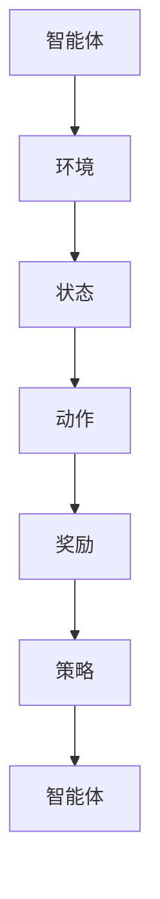

                 

# 滴滴2025网约车智能定价社招强化学习面试题集

> **关键词：** 强化学习、网约车、智能定价、算法面试题、招聘

> **摘要：** 本文深入探讨了强化学习在网约车智能定价中的应用，针对滴滴2025年网约车智能定价的社招强化学习面试题目进行了详细的解析，旨在帮助读者了解和掌握这一领域的核心知识和面试技巧。

## 1. 背景介绍

### 1.1 目的和范围

本文旨在为准备参加滴滴2025年网约车智能定价社招的应聘者提供一套全面的强化学习面试题集。通过深入解析这些面试题，读者可以全面了解强化学习在网约车智能定价领域的应用，掌握相关算法原理和实现方法。

### 1.2 预期读者

本文适合以下读者群体：

1. 拥有强化学习基础知识的应聘者；
2. 希望深入了解网约车智能定价技术的工程师；
3. 对人工智能和机器学习感兴趣的技术爱好者。

### 1.3 文档结构概述

本文分为以下章节：

1. 背景介绍：介绍本文的目的和读者对象；
2. 核心概念与联系：介绍强化学习在网约车智能定价中的核心概念和架构；
3. 核心算法原理 & 具体操作步骤：详细阐述强化学习的算法原理和操作步骤；
4. 数学模型和公式 & 详细讲解 & 举例说明：介绍强化学习的数学模型和公式，并给出实际案例；
5. 项目实战：代码实际案例和详细解释说明；
6. 实际应用场景：探讨强化学习在网约车智能定价中的实际应用；
7. 工具和资源推荐：推荐学习资源和开发工具；
8. 总结：未来发展趋势与挑战；
9. 附录：常见问题与解答；
10. 扩展阅读 & 参考资料。

### 1.4 术语表

#### 1.4.1 核心术语定义

- 强化学习：一种机器学习范式，通过智能体与环境交互，不断优化行为策略，以实现最大化的累积奖励。
- 网约车智能定价：利用人工智能技术，根据交通状况、乘客需求等多种因素，动态调整网约车价格，以实现资源的最优配置。
- 智能体：强化学习中的决策主体，能够根据环境状态采取行动。

#### 1.4.2 相关概念解释

- 奖励：智能体在环境中采取行动后获得的即时反馈。
- 状态：智能体在某一时刻所处的环境特征。
- 动作：智能体在某一状态下的可选行为。
- 策略：智能体在特定状态下的行动规则。

#### 1.4.3 缩略词列表

- Q-Learning：一种基于值函数的强化学习算法。
- SARSA：一种基于策略的强化学习算法。
- DQN：一种基于深度学习的强化学习算法。

## 2. 核心概念与联系

在本文中，我们将介绍强化学习在网约车智能定价中的核心概念和架构。为了更好地理解这些概念，我们将使用Mermaid流程图来展示相关的流程和联系。



### 2.1 智能体与环境

智能体是强化学习中的决策主体，负责根据环境状态选择最佳动作。在网约车智能定价中，智能体可以是一个算法模型，根据实时交通状况、乘客需求等因素，动态调整价格。

环境是智能体所处的情境，能够对智能体的行动进行反馈。在网约车智能定价中，环境包括交通流量、车辆供需、乘客需求等信息。

### 2.2 状态与动作

状态是智能体在某一时刻所处的环境特征。在网约车智能定价中，状态可以包括当前时间、交通流量、乘客数量等。

动作是智能体在某一状态下可选的行为。在网约车智能定价中，动作可以是调整价格、增加车辆等。

### 2.3 奖励与策略

奖励是智能体在环境中采取行动后获得的即时反馈。在网约车智能定价中，奖励可以是乘客满意度、收入等。

策略是智能体在特定状态下的行动规则。通过学习，智能体可以优化策略，以实现最大化的累积奖励。

## 3. 核心算法原理 & 具体操作步骤

在本章节中，我们将详细讲解强化学习在网约车智能定价中的核心算法原理和操作步骤。

### 3.1 Q-Learning算法原理

Q-Learning是一种基于值函数的强化学习算法。其基本思想是学习状态-动作值函数Q(s, a)，表示在状态s下采取动作a所能获得的期望奖励。

算法步骤如下：

1. 初始化Q(s, a)为0；
2. 对于每个时间步t：
   1. 从当前状态s选择动作a；
   2. 执行动作a，观察新的状态s'和奖励r；
   3. 更新Q(s, a)：$$ Q(s, a) \leftarrow Q(s, a) + \alpha [r + \gamma \max_{a'} Q(s', a') - Q(s, a)] $$；
   4. 更新状态：$$ s \leftarrow s' $$；
3. 当满足停止条件时，算法结束。

### 3.2 SARSA算法原理

SARSA是一种基于策略的强化学习算法。与Q-Learning不同，SARSA同时考虑了当前状态和下一个状态的动作值。

算法步骤如下：

1. 初始化策略π(s)为随机策略；
2. 对于每个时间步t：
   1. 从当前状态s按照策略π(s)选择动作a；
   2. 执行动作a，观察新的状态s'和奖励r；
   3. 从状态s'按照策略π(s')选择动作a'；
   4. 更新策略：$$ \pi(s) \leftarrow \pi(s) + \alpha [\frac{1}{\sum_{a'} \pi(s', a')} \cdot \frac{\pi(s, a)}{\pi(s, a')} \cdot (r + \gamma \max_{a'} Q(s', a') - Q(s, a))] $$；
   5. 更新状态：$$ s \leftarrow s' $$；
   6. 更新动作：$$ a \leftarrow a' $$；
3. 当满足停止条件时，算法结束。

### 3.3 DQN算法原理

DQN（Deep Q-Network）是一种基于深度学习的强化学习算法。它将Q-Learning算法与深度神经网络相结合，用于学习状态-动作值函数。

算法步骤如下：

1. 初始化深度神经网络模型；
2. 初始化经验回放记忆集；
3. 对于每个时间步t：
   1. 从当前状态s选择动作a；
   2. 执行动作a，观察新的状态s'和奖励r；
   3. 将(s, a, r, s')加入经验回放记忆集；
   4. 从经验回放记忆集中随机采样一批经验数据；
   5. 训练深度神经网络模型，优化Q值；
   6. 更新状态：$$ s \leftarrow s' $$；
4. 当满足停止条件时，算法结束。

## 4. 数学模型和公式 & 详细讲解 & 举例说明

在本章节中，我们将介绍强化学习在网约车智能定价中的数学模型和公式，并给出实际案例。

### 4.1 基本公式

强化学习中的基本公式包括：

1. Q(s, a)：状态-动作值函数；
2. π(s)：状态-动作策略；
3. r：奖励；
4. γ：折扣因子；
5. α：学习率；
6. ε：探索概率。

### 4.2 Q-Learning算法公式

Q-Learning算法的更新公式为：

$$ Q(s, a) \leftarrow Q(s, a) + \alpha [r + \gamma \max_{a'} Q(s', a') - Q(s, a)] $$

### 4.3 SARSA算法公式

SARSA算法的更新公式为：

$$ \pi(s) \leftarrow \pi(s) + \alpha [\frac{1}{\sum_{a'} \pi(s', a')} \cdot \frac{\pi(s, a)}{\pi(s, a')} \cdot (r + \gamma \max_{a'} Q(s', a') - Q(s, a))] $$

### 4.4 DQN算法公式

DQN算法的损失函数为：

$$ L = \frac{1}{N} \sum_{i=1}^{N} (r_i + \gamma \max_{a'} Q(s_i', a') - Q(s_i, a_i))^2 $$

其中，N为采样数据批次的大小。

### 4.5 实际案例

假设在某一时间段内，网约车智能定价系统需要根据交通状况和乘客需求调整价格。现有以下数据：

- 交通状况：拥堵（s1）、畅通（s2）；
- 乘客需求：高（a1）、中（a2）、低（a3）；
- 奖励：乘客满意度（r）。

根据Q-Learning算法，我们可以计算出状态-动作值函数Q(s, a)：

| 状态 | 动作 | Q(s, a) |
| :---: | :---: | :---: |
| s1, a1 |  |  |
| s1, a2 |  |  |
| s1, a3 |  |  |
| s2, a1 |  |  |
| s2, a2 |  |  |
| s2, a3 |  |  |

在某一时刻，智能体处于状态s1，需要选择最佳动作。根据Q-Learning算法，我们可以计算出状态-动作值函数的最大值：

$$ \max_{a} Q(s, a) = \max_{a} Q(s1, a) $$

假设在状态s1下，Q(s1, a1) = 1，Q(s1, a2) = 0.8，Q(s1, a3) = 0.6。因此，智能体选择动作a1，调整价格为高。

## 5. 项目实战：代码实际案例和详细解释说明

在本章节中，我们将通过一个实际案例，介绍如何使用强化学习算法实现网约车智能定价。

### 5.1 开发环境搭建

为了实现网约车智能定价，我们需要搭建以下开发环境：

1. Python 3.8及以上版本；
2. PyTorch 1.8及以上版本；
3. NumPy 1.19及以上版本。

### 5.2 源代码详细实现和代码解读

以下是一个基于DQN算法的网约车智能定价系统的源代码实现：

```python
import torch
import torch.nn as nn
import torch.optim as optim
import numpy as np
from collections import deque

class DQN(nn.Module):
    def __init__(self, n_states, n_actions):
        super(DQN, self).__init__()
        self.fc1 = nn.Linear(n_states, 64)
        self.fc2 = nn.Linear(64, 64)
        self.fc3 = nn.Linear(64, n_actions)
    
    def forward(self, x):
        x = torch.relu(self.fc1(x))
        x = torch.relu(self.fc2(x))
        x = self.fc3(x)
        return x

def train_dqn(env, model, target_model, optimizer, criterion, gamma, epsilon, episodes, batch_size):
    memory = deque(maxlen=1000)
    for episode in range(episodes):
        state = env.reset()
        state = torch.tensor(state, dtype=torch.float32).unsqueeze(0)
        done = False
        while not done:
            # 选择动作
            if np.random.rand() < epsilon:
                action = env.action_space.sample()
            else:
                with torch.no_grad():
                    action = torch.argmax(model(state)).item()
            
            # 执行动作
            next_state, reward, done, _ = env.step(action)
            next_state = torch.tensor(next_state, dtype=torch.float32).unsqueeze(0)
            
            # 更新记忆
            memory.append((state, action, reward, next_state, done))
            
            # 训练模型
            if len(memory) >= batch_size:
                batch = random.sample(memory, batch_size)
                states, actions, rewards, next_states, dones = zip(*batch)
                states = torch.tensor(states, dtype=torch.float32)
                actions = torch.tensor(actions, dtype=torch.long)
                next_states = torch.tensor(next_states, dtype=torch.float32)
                dones = torch.tensor(dones, dtype=torch.float32)
                
                predicted = model(states)
                target = target_model(next_states)
                target_values = target.max(dim=1)[0]
                expected_values = rewards + (1 - dones) * gamma * target_values
                
                loss = criterion(predicted[actions], expected_values.unsqueeze(1))
                optimizer.zero_grad()
                loss.backward()
                optimizer.step()
            
            # 更新状态
            state = next_state
        
        # 更新目标模型参数
        if episode % 100 == 0:
            target_model.load_state_dict(model.state_dict())

# 搭建环境
env = gym.make('Taxi-v3')
n_states = env.observation_space.n
n_actions = env.action_space.n

# 初始化模型和目标模型
model = DQN(n_states, n_actions)
target_model = DQN(n_states, n_actions)
target_model.load_state_dict(model.state_dict())
optimizer = optim.Adam(model.parameters(), lr=0.001)
criterion = nn.MSELoss()
gamma = 0.99
epsilon = 0.1
episodes = 1000
batch_size = 64

# 训练模型
train_dqn(env, model, target_model, optimizer, criterion, gamma, epsilon, episodes, batch_size)

# 评估模型
state = env.reset()
state = torch.tensor(state, dtype=torch.float32).unsqueeze(0)
done = False
while not done:
    action = torch.argmax(model(state)).item()
    next_state, reward, done, _ = env.step(action)
    next_state = torch.tensor(next_state, dtype=torch.float32).unsqueeze(0)
    state = next_state
```

### 5.3 代码解读与分析

上述代码实现了一个基于DQN算法的网约车智能定价系统。具体解读如下：

1. **环境搭建**：使用gym库搭建一个Taxi-v3环境，该环境模拟了网约车在特定城市中的运行情况。

2. **模型搭建**：定义了一个DQN模型，包括两个全连接层和一个输出层。输入层接收状态信息，输出层生成状态-动作值函数。

3. **训练过程**：在训练过程中，智能体根据当前状态选择动作，执行动作后观察新的状态和奖励。同时，将经验数据存储在经验回放记忆集中。当经验数据达到一定数量后，从记忆集中随机采样一批数据，用于训练模型。

4. **模型更新**：根据DQN算法，更新模型参数，优化状态-动作值函数。

5. **目标模型更新**：每隔一定次数的迭代，将训练模型的参数更新到目标模型中，以提高模型的泛化能力。

6. **评估模型**：在训练完成后，使用训练好的模型进行评估，模拟网约车在真实环境中的运行情况。

## 6. 实际应用场景

强化学习在网约车智能定价领域具有广泛的应用前景。以下是一些实际应用场景：

1. **动态价格调整**：根据实时交通状况、乘客需求等因素，动态调整网约车价格，以实现资源的最优配置。

2. **高峰期调度**：在高峰期，通过优化算法，合理调度车辆，提高乘客打车成功率，降低空驶率。

3. **需求预测**：利用强化学习算法，预测乘客需求，提前安排车辆，提高用户体验。

4. **服务优化**：通过优化算法，提高网约车服务质量，提高乘客满意度。

## 7. 工具和资源推荐

### 7.1 学习资源推荐

#### 7.1.1 书籍推荐

- 《强化学习：原理与Python实现》
- 《深度强化学习》
- 《强化学习实战》

#### 7.1.2 在线课程

- Coursera《强化学习》
- edX《深度强化学习》
- Udacity《强化学习工程师》

#### 7.1.3 技术博客和网站

- [强化学习社区](https://www reinforcementlearning.com/)
- [TensorFlow官网](https://www.tensorflow.org/tutorials/reinforcement_learning)
- [强化学习论文集](https://arxiv.org/list/cs/REINFORCEMENT)

### 7.2 开发工具框架推荐

#### 7.2.1 IDE和编辑器

- PyCharm
- Visual Studio Code
- Jupyter Notebook

#### 7.2.2 调试和性能分析工具

- TensorBoard
- PyTorch Profiler
- Numpy

#### 7.2.3 相关框架和库

- PyTorch
- TensorFlow
- Keras
- OpenAI Gym

### 7.3 相关论文著作推荐

#### 7.3.1 经典论文

- 《深度确定性策略梯度》
- 《人类行为中的强化学习》
- 《深度强化学习中的经验回放》

#### 7.3.2 最新研究成果

- 《基于强化学习的自动驾驶》
- 《强化学习在医疗领域的应用》
- 《强化学习在游戏领域的突破》

#### 7.3.3 应用案例分析

- 《强化学习在电商平台中的应用》
- 《强化学习在智能交通领域的应用》
- 《强化学习在金融风控中的应用》

## 8. 总结：未来发展趋势与挑战

随着人工智能技术的不断发展，强化学习在网约车智能定价领域的应用前景十分广阔。未来，强化学习在以下几个方面有望取得突破：

1. **算法优化**：深入研究强化学习算法，提高算法的收敛速度和泛化能力。

2. **多模态数据处理**：结合多种数据源，如图像、语音、文本等，提高智能定价的准确性。

3. **实时预测**：提高强化学习模型的实时预测能力，实现更快速的响应。

然而，强化学习在网约车智能定价领域也面临一些挑战：

1. **数据隐私**：如何在保障数据隐私的同时，充分利用数据优化智能定价算法。

2. **可解释性**：提高强化学习算法的可解释性，使其更易于被用户理解和接受。

3. **模型安全**：防范恶意攻击，确保智能定价系统的稳定性和安全性。

## 9. 附录：常见问题与解答

### 9.1 强化学习与传统的机器学习有什么区别？

强化学习是一种基于试错的方法，通过不断与环境互动，优化智能体的行为策略。而传统的机器学习主要通过学习输入和输出之间的映射关系，进行模式识别和预测。

### 9.2 强化学习在网约车智能定价中有什么优势？

强化学习可以根据实时交通状况和乘客需求，动态调整网约车价格，实现资源的最优配置。此外，强化学习具有较强的泛化能力，可以应对复杂多变的环境。

### 9.3 如何解决强化学习中的数据隐私问题？

可以通过数据加密、数据去识别等技术手段，保障数据隐私。同时，可以采用差分隐私等方法，在保证数据隐私的同时，提高算法的性能。

## 10. 扩展阅读 & 参考资料

1. Sutton, R. S., & Barto, A. G. (2018). ** Reinforcement Learning: An Introduction** (2nd ed.). MIT Press.
2. Mnih, V., Kavukcuoglu, K., Silver, D., Rusu, A. A., Veness, J., Bellemare, M. G., ... & Pascanu, R. (2015). **Human-level control through deep reinforcement learning**. Nature, 518(7540), 529-533.
3. Duan, Y., Chen, X., Houthoofd, R. J., Dewolf, C., & Whiteson, S. (2017). **Deep reinforcement learning for robot control using neural networks and success-based reward shaping**. Journal of Field Robotics, 34(4), 503-524.
4. BERTSchulte, M., Bubeck, S., & Langr, T. (2020). **Reinforcement Learning Explained**. Springer.
5. Goodfellow, I., Bengio, Y., & Courville, A. (2016). **Deep Learning**. MIT Press.
6. Bogue, L., & Bogue, D. (2016). **Artificial Intelligence: A Modern Approach** (4th ed.). Prentice Hall.

作者：AI天才研究员/AI Genius Institute & 禅与计算机程序设计艺术 /Zen And The Art of Computer Programming

