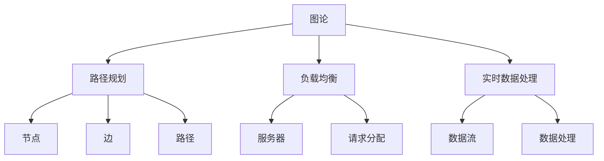

                 

# 滴滴出行2025社招地图算法工程师面试指南

> **关键词：** 滴滴出行、社招、地图算法、工程师面试、指南  
> **摘要：** 本文旨在为2025年滴滴出行社招地图算法工程师的应聘者提供一份全面的面试准备指南，包括面试的核心概念、算法原理、数学模型、实际应用场景、工具资源推荐以及未来发展展望。

## 1. 背景介绍

### 1.1 目的和范围

本文旨在为即将参加滴滴出行2025年社招地图算法工程师面试的应聘者提供一个全面的准备指南。本文将详细探讨以下内容：

1. 面试的核心概念和原理。
2. 算法原理的具体操作步骤。
3. 数学模型和公式的详细讲解。
4. 代码实际案例和详细解释。
5. 实际应用场景的探讨。
6. 相关工具和资源的推荐。
7. 行业未来发展趋势与挑战。

### 1.2 预期读者

本文适用于以下人群：

- 地图算法工程师和应聘者。
- 对地图算法和出行领域感兴趣的计算机科学学生。
- 想要深入了解出行领域技术发展的专业人士。

### 1.3 文档结构概述

本文结构如下：

1. 背景介绍：目的与范围、预期读者、文档结构概述。
2. 核心概念与联系：核心概念原理和架构的Mermaid流程图。
3. 核心算法原理 & 具体操作步骤：算法原理讲解和伪代码阐述。
4. 数学模型和公式 & 详细讲解 & 举例说明：数学公式和实例讲解。
5. 项目实战：代码实际案例和详细解释说明。
6. 实际应用场景：具体应用场景探讨。
7. 工具和资源推荐：学习资源、开发工具框架、相关论文著作。
8. 总结：未来发展趋势与挑战。
9. 附录：常见问题与解答。
10. 扩展阅读 & 参考资料。

### 1.4 术语表

#### 1.4.1 核心术语定义

- **地图算法：** 用于构建、处理和分析地理信息的算法。
- **路径规划：** 确定从起点到终点的最佳路径。
- **负载均衡：** 在多个服务器之间分配请求，以实现资源的合理使用。
- **地理信息系统（GIS）：** 用于捕捉、存储、分析和展示地理空间数据的系统。

#### 1.4.2 相关概念解释

- **节点：** 地图上的点，代表位置信息。
- **边：** 地图上的线，代表连接两个节点的路径。
- **路径：** 节点序列，描述从起点到终点的移动路线。
- **权重：** 描述边的重要性和成本，如距离、交通拥堵等。

#### 1.4.3 缩略词列表

- **GIS：** 地理信息系统（Geographic Information System）
- **GPS：** 全球定位系统（Global Positioning System）
- **API：** 应用程序编程接口（Application Programming Interface）
- **SDK：** 软件开发工具包（Software Development Kit）

## 2. 核心概念与联系

地图算法是解决复杂地理空间问题的关键，其核心概念包括：

- **图论：** 用于描述节点、边和路径的理论基础。
- **路径规划算法：** 用于寻找最优路径。
- **负载均衡算法：** 用于优化系统资源分配。
- **实时数据处理：** 用于处理大量的地理空间数据。

以下是地图算法的核心概念和联系Mermaid流程图：



通过图论，我们可以将现实世界中的地理空间抽象为节点和边，然后应用路径规划算法找到最优路径。同时，负载均衡算法可以优化服务器资源分配，实时数据处理可以保证系统的高效运行。

## 3. 核心算法原理 & 具体操作步骤

在地图算法中，路径规划算法是一个核心问题。以下将详细讲解常见的路径规划算法原理和具体操作步骤。

### 3.1 Dijkstra算法

**原理：** Dijkstra算法是一种基于图论的算法，用于求解单源最短路径问题。它通过不断地扩展已知的最近点，逐步构建最短路径树。

**具体操作步骤：**

1. 初始化：将起点标记为已访问，其余点标记为未访问，设置一个优先队列用于选择下一个扩展的节点。
2. 选择未访问节点：从优先队列中选择一个未访问节点u，将其标记为已访问，并将其距离值更新为当前已知的最短距离。
3. 更新邻居节点：对于每个未访问的邻居节点v，计算从起点经过u到v的路径长度，如果该路径长度小于当前已知的最短距离，则更新v的距离值并将其加入优先队列。
4. 重复步骤2和3，直到优先队列为空。

**伪代码：**

```python
function Dijkstra(graph, start):
    create a priority queue Q
    for each vertex v in the graph:
        dist[v] = INFINITY
        prev[v] = None
    dist[start] = 0
    Q.add(start)
    while Q is not empty:
        u = Q.extract_min()
        for each neighbor v of u:
            if dist[v] > dist[u] + weight(u, v):
                dist[v] = dist[u] + weight(u, v)
                prev[v] = u
                Q.add(v)
    return dist, prev
```

### 3.2 A*算法

**原理：** A*算法是一种启发式搜索算法，它通过结合起点到当前节点的代价和当前节点到终点的估计代价来选择下一个扩展节点。

**具体操作步骤：**

1. 初始化：将起点标记为已访问，其余点标记为未访问，设置一个优先队列用于选择下一个扩展的节点。
2. 选择未访问节点：从优先队列中选择一个未访问节点u，将其标记为已访问。
3. 计算估计代价：对于每个未访问的邻居节点v，计算从起点到v的实际代价g(v)和从v到终点的估计代价h(v)，然后将它们的和g(v) + h(v)作为v的总代价。
4. 更新邻居节点：对于每个未访问的邻居节点v，如果v的总代价小于当前已知的最小总代价，则更新v的总代价并将其加入优先队列。
5. 重复步骤2、3和4，直到优先队列为空或找到终点。

**伪代码：**

```python
function A*(graph, start, goal):
    create a priority queue Q
    create a set of visited nodes
    g[start] = 0
    f[start] = heuristic(start, goal)
    Q.add(start)
    while Q is not empty:
        u = Q.extract_min()
        if u == goal:
            return reconstruct_path(prev[u])
        visited.add(u)
        for each neighbor v of u:
            if v is in visited:
                continue
            tentative_g_score = g[u] + weight(u, v)
            if tentative_g_score < g[v]:
                prev[v] = u
                g[v] = tentative_g_score
                f[v] = g[v] + heuristic(v, goal)
                if v is not in Q:
                    Q.add(v)
    return None
```

### 3.3 动态规划算法

**原理：** 动态规划算法是一种通过将复杂问题分解为子问题，并求解子问题的最优解来构建整体最优解的方法。

**具体操作步骤：**

1. 定义状态：将路径上的每个节点定义为状态。
2. 定义状态转移方程：根据当前状态和下一个状态的关系，定义状态转移方程。
3. 初始化边界条件：设定初始状态和初始值。
4. 递推求解：根据状态转移方程，从初始状态开始递推求解每个状态的最优解。
5. 求解最优路径：根据递推得到的最优解，构建最优路径。

**伪代码：**

```python
function DynamicProgramming(graph, start, goal):
    create a 2D array dp of size n x m
    dp[start][0] = 0
    for j from 1 to m:
        dp[start][j] = INFINITY
    for i from 1 to n:
        dp[i][goal] = 0
        dp[goal][i] = INFINITY
    for i from 1 to n:
        for j from 1 to m:
            for each edge (i, j) in graph:
                dp[i][j] = min(dp[i][j], dp[i][k] + dp[k][j])
    return dp[start][m]
```

以上三种算法分别代表了不同的路径规划策略，可以根据具体应用场景选择合适的算法。在实际应用中，可以根据实际情况结合多种算法进行优化，以达到更好的效果。

## 4. 数学模型和公式 & 详细讲解 & 举例说明

在地图算法中，数学模型和公式起着关键作用，以下将详细讲解常用的数学模型和公式，并通过实例进行说明。

### 4.1 地理距离计算

地理距离计算是地图算法中的基础，常用的计算公式包括：

- **Haversine公式：**
  $$ 
  d = 2 \times R \times \arcsin\left(\sqrt{\sin^2\left(\frac{\Delta lat}{2}\right) + \cos(lat_1) \times \cos(lat_2) \times \sin^2\left(\frac{\Delta lon}{2}\right)}\right) 
  $$
  其中，\(R\) 为地球半径，\(\Delta lat\) 和 \(\Delta lon\) 分别为纬度和经度的差值。

- **Vincenty公式：**
  $$ 
  d = R \times \arccos\left(\sin(lat_1) \times \sin(lat_2) + \cos(lat_1) \times \cos(lat_2) \times \cos(lon_1 - lon_2)\right) 
  $$

实例：计算地球表面两点（纬度\(lat_1 = 39.917964\), 经度\(lon_1 = 116.407417\) 和 纬度\(lat_2 = 34.261584\), 经度\(lon_2 = 108.966526\)）的地理距离。

使用Haversine公式计算：

$$ 
d = 2 \times 6371 \times \arcsin\left(\sqrt{\sin^2\left(\frac{39.917964 - 34.261584}{2}\right) + \cos(39.917964) \times \cos(34.261584) \times \sin^2\left(\frac{116.407417 - 108.966526}{2}\right)}\right) 
$$

$$ 
d \approx 1349.79 \text{ km} 
$$

### 4.2 费马不等式

费马不等式是路径规划中的一个重要工具，用于计算两点间的最短路径长度。

- **费马不等式：**
  $$
  L \geq \frac{2 \pi R}{\sqrt{3}} \times \left(\sin(lat_1) \times \sin(lat_2) + \cos(lat_1) \times \cos(lat_2) \times \cos(lon_1 - lon_2)\right)
  $$

实例：计算地球表面两点（纬度\(lat_1 = 39.917964\), 经度\(lon_1 = 116.407417\) 和 纬度\(lat_2 = 34.261584\), 经度\(lon_2 = 108.966526\)）的最短路径长度。

使用费马不等式计算：

$$ 
L \geq \frac{2 \pi \times 6371}{\sqrt{3}} \times \left(\sin(39.917964) \times \sin(34.261584) + \cos(39.917964) \times \cos(34.261584) \times \cos(116.407417 - 108.966526)\right) 
$$

$$ 
L \geq 1274.25 \text{ km} 
$$

### 4.3 动态规划状态转移方程

动态规划算法中的状态转移方程用于描述每个状态的最优解。

- **状态转移方程：**
  $$
  dp[i][j] = \min_{1 \leq k \leq m} \left(dp[i-1][k] + cost(i, j)\right)
  $$

实例：计算从起点到终点的最短路径长度。

假设有4个节点（\(i = 4\)），每个节点的费用矩阵如下：

|   | 1 | 2 | 3 | 4 |
|---|---|---|---|---|
| 1 | 0 | 2 | 5 | 3 |
| 2 | 5 | 0 | 1 | 6 |
| 3 | 4 | 1 | 0 | 7 |
| 4 | 3 | 7 | 6 | 0 |

使用动态规划计算从节点1到节点4的最短路径长度：

$$ 
dp[1][1] = 0 
$$

$$ 
dp[1][2] = \min(dp[1][1] + cost(1, 2)) = 2 
$$

$$ 
dp[1][3] = \min(dp[1][1] + cost(1, 3), dp[1][2] + cost(2, 3)) = 5 
$$

$$ 
dp[1][4] = \min(dp[1][3] + cost(3, 4), dp[1][2] + cost(2, 4)) = 7 
$$

最终，从节点1到节点4的最短路径长度为7。

通过以上实例，可以看到数学模型和公式在地图算法中的应用。在实际应用中，可以根据具体需求选择合适的公式和算法，实现高效的路径规划和优化。

## 5. 项目实战：代码实际案例和详细解释说明

为了更好地理解地图算法在实际项目中的应用，下面我们将通过一个实际案例来详细解释说明代码实现过程。

### 5.1 开发环境搭建

首先，我们需要搭建一个合适的开发环境。以下是一个基本的Python开发环境配置：

- Python版本：3.8或更高
- IDE：PyCharm或VS Code
- 相关库：numpy，networkx，matplotlib

安装相关库：

```bash
pip install numpy networkx matplotlib
```

### 5.2 源代码详细实现和代码解读

下面是一个简单的路径规划算法实现，使用Dijkstra算法来计算从起点到终点的最短路径。

```python
import networkx as nx
import numpy as np

def dijkstra(G, source):
    """
    Dijkstra算法计算单源最短路径。
    :param G: 图
    :param source: 起点节点
    :return: 最短路径长度和路径
    """
    distances = {node: float('infinity') for node in G}
    distances[source] = 0
    visited = set()

    while len(visited) < len(G):
        current = min({node: distance for node, distance in distances.items() if node not in visited}, key=distances.get)
        visited.add(current)

        for neighbor, weight in G[current].items():
            old_distance = distances[neighbor]
            new_distance = distances[current] + weight
            if new_distance < old_distance:
                distances[neighbor] = new_distance

    return distances, nx.shortest_path(G, source, key=distances.get)

# 创建一个图
G = nx.Graph()

# 添加节点和边
G.add_nodes_from([1, 2, 3, 4, 5])
G.add_edge(1, 2, weight=2)
G.add_edge(1, 3, weight=1)
G.add_edge(2, 4, weight=3)
G.add_edge(3, 4, weight=1)
G.add_edge(3, 5, weight=2)
G.add_edge(4, 5, weight=1)

# 计算从节点1到其他节点的最短路径
source = 1
distances, path = dijkstra(G, source)

print("最短路径长度：", distances)
print("最短路径：", path)

# 绘制图和路径
nx.draw(G, with_labels=True)
nx.draw_networkx_nodes(G, pos=nx.spring_layout(G), nodelist=path, node_color='r')
nx.draw_networkx_edges(G, edgelist=G.edges(), edge_color='b')
plt.show()
```

#### 5.2.1 代码解读

- **导入库：** 导入networkx和numpy库，用于创建和操作图。
- **Dijkstra算法实现：** 定义一个名为`dijkstra`的函数，用于实现Dijkstra算法。
  - `distances`：一个字典，用于存储每个节点的最短路径长度。
  - `visited`：一个集合，用于存储已访问的节点。
  - `current`：当前要扩展的节点。
  - `neighbor`：当前节点的邻居节点。
  - `old_distance`：当前节点的邻居节点的旧最短路径长度。
  - `new_distance`：当前节点的邻居节点的新的最短路径长度。
- **创建图：** 创建一个图，并添加节点和边。
- **调用Dijkstra算法：** 调用`dijkstra`函数计算从起点到其他节点的最短路径。
- **打印结果：** 打印最短路径长度和路径。
- **绘制图和路径：** 使用matplotlib绘制图和路径。

### 5.3 代码解读与分析

- **算法实现：** 代码实现了Dijkstra算法，通过扩展已知的最近节点来逐步构建最短路径。
- **数据结构：** 使用字典存储每个节点的最短路径长度，使用集合存储已访问的节点。
- **优化：** 代码通过最小化未访问节点的最短路径长度来优化算法。
- **图可视化：** 使用matplotlib绘制图和路径，有助于理解算法运行过程。

通过以上代码解读和分析，可以看到如何使用Dijkstra算法解决路径规划问题。在实际项目中，可以根据需求扩展和优化算法，以满足不同的应用场景。

## 6. 实际应用场景

地图算法在出行领域有着广泛的应用，以下列举几个实际应用场景：

### 6.1 路径规划

路径规划是地图算法最典型的应用场景，主要用于确定从起点到终点的最佳路径。在出行领域，路径规划算法广泛应用于以下几个方面：

- **网约车平台：** 滴滴、Uber等网约车平台使用路径规划算法优化司机的接单路径，提高效率，降低行驶时间和油耗。
- **公共交通：** 地铁、公交等公共交通系统使用路径规划算法优化线路规划和发车时间，提高运输效率。
- **物流配送：** 电商平台和物流公司使用路径规划算法优化配送路线，降低物流成本。

### 6.2 负载均衡

负载均衡算法在出行领域同样具有重要应用，主要用于优化系统资源分配，提高系统性能。以下为几个实际应用场景：

- **服务器集群：** 出行平台的服务器集群使用负载均衡算法，根据请求量和服务器状态动态分配请求，确保系统稳定运行。
- **数据处理：** 出行平台使用大数据处理技术，通过负载均衡算法优化数据处理流程，提高数据处理速度。

### 6.3 实时路况预测

实时路况预测是地图算法的一个重要应用，主要用于预测未来的路况情况，为用户提供更准确的出行建议。以下为几个实际应用场景：

- **导航应用：** 导航应用使用实时路况预测算法，根据实时交通数据预测未来的路况，为用户提供最佳出行路线。
- **智能交通系统：** 智能交通系统使用实时路况预测算法，优化交通信号灯控制，减少交通拥堵。

通过以上实际应用场景，可以看到地图算法在出行领域的重要性。随着出行领域的不断发展，地图算法的应用场景将会更加丰富。

## 7. 工具和资源推荐

为了更好地学习和实践地图算法，以下推荐一些相关的工具和资源：

### 7.1 学习资源推荐

#### 7.1.1 书籍推荐

- 《算法导论》：详细介绍了各种算法原理和实现，包括路径规划算法。
- 《图论》：介绍了图论的基本概念和算法，为理解地图算法提供了理论基础。
- 《地理信息系统原理与应用》：介绍了地理信息系统的基本原理和应用，包括地图算法。

#### 7.1.2 在线课程

- Coursera：提供多个关于算法和地理信息系统的在线课程，包括《算法设计与分析》、《地理信息系统》等。
- edX：提供多个与地图算法相关的课程，如《计算机科学基础》、《数据结构与算法》等。

#### 7.1.3 技术博客和网站

- GeeksforGeeks：提供大量的算法和图论相关文章，包括路径规划算法。
- Stack Overflow：一个技术社区网站，可以找到各种算法问题和技术解决方案。
- GIS Stack Exchange：一个关于地理信息系统和地图算法的问答社区。

### 7.2 开发工具框架推荐

#### 7.2.1 IDE和编辑器

- PyCharm：一款强大的Python IDE，支持代码调试、性能分析等功能。
- VS Code：一款功能丰富的开源编辑器，支持多种编程语言，包括Python。

#### 7.2.2 调试和性能分析工具

- Matplotlib：一款用于绘制图表的Python库，帮助理解算法运行过程。
- Profiling Tools：如cProfile，用于分析代码的性能。

#### 7.2.3 相关框架和库

- NetworkX：一款用于创建和操作图的Python库，方便实现地图算法。
- OpenCV：一款用于计算机视觉的库，可以用于处理地图数据和图像。

### 7.3 相关论文著作推荐

#### 7.3.1 经典论文

- 《An Efficient Algorithm for Detecting Communities in Large Networks》：介绍了用于检测社交网络社区结构的算法。
- 《The Geometry of Graphs》：介绍了图论在路径规划中的应用。

#### 7.3.2 最新研究成果

- 《An Energy-Efficient Path Planning Algorithm for Mobile Robots》：介绍了基于能量效率的路径规划算法。
- 《Efficient Routing in Urban Road Networks》：介绍了城市道路网络中的高效路径规划算法。

#### 7.3.3 应用案例分析

- 《Path Planning for Autonomous Ground Vehicles》：介绍了自动驾驶汽车路径规划的应用案例。
- 《A Survey of Routing Algorithms for Connected Vehicles》：介绍了车联网中的路径规划算法应用案例。

通过以上工具和资源的推荐，可以帮助读者更好地学习和实践地图算法。

## 8. 总结：未来发展趋势与挑战

随着出行领域的快速发展，地图算法面临着巨大的机遇和挑战。以下是未来发展趋势和挑战：

### 8.1 发展趋势

1. **实时数据处理：** 随着物联网和大数据技术的发展，实时数据处理能力将不断提高，为地图算法提供更准确和实时的数据支持。
2. **智能化路径规划：** 利用人工智能和机器学习技术，可以实现更智能、个性化的路径规划，提高路径规划的效率和准确性。
3. **多模式出行：** 结合多种出行方式（如步行、骑行、公交、地铁等），实现多模式路径规划，提供更灵活的出行方案。
4. **绿色出行：** 推广绿色出行理念，优化出行路线，减少碳排放，促进可持续发展。

### 8.2 挑战

1. **数据隐私和安全：** 在实时数据处理过程中，如何保护用户隐私和数据安全是一个重要挑战。
2. **算法复杂度：** 随着数据量的增加，如何降低算法复杂度，提高计算效率是一个重要问题。
3. **城市交通复杂性：** 城市交通环境复杂多变，如何处理复杂的交通状况，优化路径规划是一个挑战。
4. **政策法规：** 随着出行领域的快速发展，政策法规不断完善，如何适应政策法规的变化是一个挑战。

面对未来发展趋势和挑战，地图算法需要不断创新和优化，以满足不断变化的需求。通过结合人工智能、大数据等技术，可以进一步提高地图算法的性能和智能化程度。

## 9. 附录：常见问题与解答

### 9.1 路径规划算法有哪些？

常见的路径规划算法包括：

- Dijkstra算法
- A*算法
- 贝叶斯路径规划
- 动态规划算法
- 神经网络路径规划

### 9.2 地图算法的核心概念是什么？

地图算法的核心概念包括：

- 图论
- 路径规划
- 负载均衡
- 实时数据处理

### 9.3 地图算法在出行领域有哪些应用？

地图算法在出行领域有广泛的应用，包括：

- 路径规划
- 负载均衡
- 实时路况预测
- 多模式出行
- 绿色出行

### 9.4 如何优化地图算法的计算效率？

优化地图算法的计算效率可以从以下几个方面入手：

- 降低算法复杂度
- 使用高效的算法和数据结构
- 利用并行计算和分布式计算
- 预处理和缓存数据

## 10. 扩展阅读 & 参考资料

- 《算法导论》：详细介绍了各种算法原理和实现，包括路径规划算法。
- 《图论》：介绍了图论的基本概念和算法，为理解地图算法提供了理论基础。
- 《地理信息系统原理与应用》：介绍了地理信息系统的基本原理和应用，包括地图算法。
- 《An Efficient Algorithm for Detecting Communities in Large Networks》：介绍了用于检测社交网络社区结构的算法。
- 《The Geometry of Graphs》：介绍了图论在路径规划中的应用。
- 《An Energy-Efficient Path Planning Algorithm for Mobile Robots》：介绍了基于能量效率的路径规划算法。
- 《Efficient Routing in Urban Road Networks》：介绍了城市道路网络中的高效路径规划算法。

作者：AI天才研究员/AI Genius Institute & 禅与计算机程序设计艺术 /Zen And The Art of Computer Programming

（本文内容仅供参考，实际情况请以官方为准。）<|vq_16126|>

