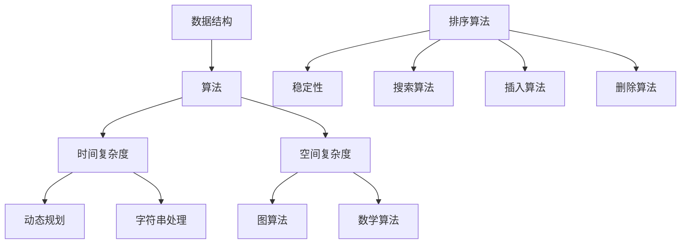

                 

# 2025滴滴校招面试算法题库大全

> 关键词：滴滴校招、算法题库、面试、技术博客、编程挑战、问题解析、实战案例、未来趋势

> 摘要：本文针对2025年滴滴校招面试的算法题库进行了全面梳理，详细解析了各类算法题的原理、实现步骤和实战案例，旨在帮助广大求职者更好地准备面试，提升技术水平。文章涵盖了从基础数据结构到高级算法的全面内容，并通过具体的代码示例和实际应用场景，深入剖析了每个问题的核心解决方案。无论您是准备滴滴校招的应届生还是在职的技术人员，本文都将为您提供宝贵的参考和指导。

## 1. 背景介绍

### 1.1 目的和范围

本文的目的在于为广大求职者提供一个系统化的滴滴校招面试算法题库解析。通过对历年滴滴校招面试算法题的深入研究，本文将详细介绍每个问题的解题思路、算法原理和具体实现步骤，帮助读者掌握面试中的核心算法技能。

本文的范围包括：

- 基础数据结构和算法
- 进阶算法和动态规划
- 图算法和图论问题
- 字符串处理和模式匹配
- 数学算法和数值计算
- 排序和搜索算法

### 1.2 预期读者

- 准备滴滴校招面试的应届毕业生
- 想提升算法能力的在职技术人员
- 对算法有浓厚兴趣的计算机爱好者

### 1.3 文档结构概述

本文结构如下：

1. 背景介绍：介绍本文的目的、范围和预期读者。
2. 核心概念与联系：通过Mermaid流程图展示核心算法原理和架构。
3. 核心算法原理 & 具体操作步骤：使用伪代码详细阐述算法原理和实现步骤。
4. 数学模型和公式 & 详细讲解 & 举例说明：使用LaTeX格式介绍数学模型和公式，并提供实例说明。
5. 项目实战：代码实际案例和详细解释说明。
6. 实际应用场景：分析算法在实际项目中的应用场景。
7. 工具和资源推荐：推荐学习资源和开发工具。
8. 总结：对未来发展趋势与挑战进行展望。
9. 附录：常见问题与解答。
10. 扩展阅读 & 参考资料：提供进一步阅读的资料。

### 1.4 术语表

#### 1.4.1 核心术语定义

- 数据结构：存储和管理数据的结构。
- 算法：解决问题的方法步骤。
- 动态规划：一种解决最优化问题的方法。
- 图算法：用于解决图论问题的算法。
- 字符串处理：对字符串进行操作的算法。
- 数学算法：基于数学原理的算法。

#### 1.4.2 相关概念解释

- 时间复杂度：算法运行时间与输入规模的关系。
- 空间复杂度：算法运行时所需内存空间与输入规模的关系。
- 稳定性：排序算法中相等元素排序不变的性质。

#### 1.4.3 缩略词列表

- AI：人工智能
- ML：机器学习
- OOP：面向对象编程
- DB：数据库
- SQL：结构化查询语言

## 2. 核心概念与联系

为了更好地理解后续的算法解析，我们首先需要了解一些核心概念和它们之间的联系。以下是关键概念的Mermaid流程图：



### 2.1 数据结构与算法

数据结构是算法的基础，决定了算法的空间和时间效率。常见的数据结构包括数组、链表、栈、队列、树、图等。每种数据结构都有其特定的应用场景和优缺点。

- 数组：线性数据结构，支持随机访问，但插入和删除操作复杂度较高。
- 链表：线性数据结构，插入和删除操作灵活，但需要额外空间存储指针。
- 栈：后进先出（LIFO）结构，常用于递归算法和表达式求值。
- 队列：先进先出（FIFO）结构，常用于广度优先搜索和消息队列。
- 树：非线性数据结构，支持层次关系，如二叉树、平衡树等。
- 图：由节点和边构成，用于解决路径问题、图论问题等。

### 2.2 时间复杂度和空间复杂度

算法的时间复杂度描述了算法运行时间与输入规模的关系。常见的复杂度包括常数时间（O(1)）、对数时间（O(logn)）、线性时间（O(n)）、线性对数时间（O(nlogn)）等。空间复杂度则描述了算法运行所需内存空间与输入规模的关系。

- 常数时间算法：如访问数组的一个元素。
- 对数时间算法：如二分查找。
- 线性时间算法：如遍历数组。
- 线性对数时间算法：如快速排序。

### 2.3 动态规划

动态规划是一种解决最优化问题的方法，其核心思想是将复杂问题分解为子问题，并利用子问题的解来构建原问题的解。常见应用包括背包问题、最长公共子序列、最长上升子序列等。

### 2.4 图算法

图算法用于解决图论问题，如最短路径、最小生成树、拓扑排序等。常见的图算法包括深度优先搜索（DFS）、广度优先搜索（BFS）、Dijkstra算法、Prim算法、Kruskal算法等。

### 2.5 字符串处理

字符串处理算法常用于模式匹配、文本编辑、字符串比较等问题。常见算法包括KMP算法、Boyer-Moore算法、有限自动机等。

### 2.6 数学算法

数学算法基于数学原理，如素数生成、大数运算、数论等。常见算法包括欧几里得算法、辗转相除法、素数筛法等。

### 2.7 排序和搜索算法

排序算法用于将数据从小到大或从大到小排列，常见的排序算法包括冒泡排序、选择排序、插入排序、快速排序等。搜索算法用于在数据中查找特定元素，常见的搜索算法包括二分查找、顺序查找等。

通过以上核心概念与联系的了解，读者可以对后续的算法解析有更深入的理解。接下来，我们将逐步介绍各类算法的原理和实现步骤。

## 3. 核心算法原理 & 具体操作步骤

### 3.1 基础算法原理

#### 3.1.1 数组和链表

**数组**：数组是一种线性数据结构，用于存储一系列相同类型的数据元素。数组的特点是支持随机访问，即可以通过索引直接访问数组中的元素。数组在内存中是连续分配的，这使得其访问速度较快，但插入和删除操作需要移动后续元素，复杂度较高。

```python
# 数组访问示例
arr = [1, 2, 3, 4, 5]
print(arr[2])  # 输出：3
```

**链表**：链表是一种线性数据结构，通过节点之间的指针链接来实现。链表的优点是插入和删除操作灵活，不需要移动后续元素，但需要额外空间存储指针。

```python
# 链表节点定义
class ListNode:
    def __init__(self, value=0, next=None):
        self.value = value
        self.next = next

# 链表访问示例
head = ListNode(1)
head.next = ListNode(2)
head.next.next = ListNode(3)
print(head.next.value)  # 输出：2
```

#### 3.1.2 栈和队列

**栈**：栈是一种后进先出（LIFO）的数据结构，常用于递归算法和表达式求值。栈的操作包括入栈、出栈和判断是否为空。

```python
# 栈操作示例
stack = []
stack.append(1)
stack.append(2)
print(stack.pop())  # 输出：2
print(stack.pop())  # 输出：1
```

**队列**：队列是一种先进先出（FIFO）的数据结构，常用于广度优先搜索和消息队列。队列的操作包括入队、出队和判断是否为空。

```python
# 队列操作示例
queue = []
queue.append(1)
queue.append(2)
print(queue.popleft())  # 输出：1
print(queue.popleft())  # 输出：2
```

#### 3.1.3 树和图

**树**：树是一种层次结构，由节点和边构成。树常用于表示层次关系和路径关系。常见的树结构包括二叉树、平衡树、堆等。

```python
# 二叉树节点定义
class TreeNode:
    def __init__(self, value=0, left=None, right=None):
        self.value = value
        self.left = left
        self.right = right

# 二叉树遍历示例
root = TreeNode(1)
root.left = TreeNode(2)
root.right = TreeNode(3)
print(root.left.value)  # 输出：2
```

**图**：图是一种由节点和边构成的结构，用于表示复杂的关系。图的算法包括深度优先搜索（DFS）和广度优先搜索（BFS）。

```python
# 图节点定义
class GraphNode:
    def __init__(self, value=0, neighbors=None):
        self.value = value
        self.neighbors = neighbors if neighbors is not None else []

# 图的广度优先搜索示例
graph = [[1, 2], [3], [4, 5]]
queue = []
visited = set()
queue.append(graph[0])
while queue:
    node = queue.popleft()
    if node not in visited:
        visited.add(node)
        for neighbor in graph[node]:
            if neighbor not in visited:
                queue.append(neighbor)
```

### 3.2 动态规划算法原理

动态规划是一种解决最优化问题的方法，其核心思想是将复杂问题分解为子问题，并利用子问题的解来构建原问题的解。动态规划通常使用二维数组或一维数组来存储子问题的解。

**0-1背包问题**：给定一组物品，每个物品都有价值重量，求解在总重量不超过限制的情况下，如何选择物品以最大化总价值。

```python
# 0-1背包问题动态规划
values = [60, 100, 120]
weights = [10, 20, 30]
W = 50
dp = [[0] * (W + 1) for _ in range(len(values) + 1)]

for i in range(1, len(values) + 1):
    for w in range(1, W + 1):
        if weights[i - 1] <= w:
            dp[i][w] = max(dp[i - 1][w], dp[i - 1][w - weights[i - 1]] + values[i - 1])
        else:
            dp[i][w] = dp[i - 1][w]

print(dp[-1][-1])  # 输出：220
```

### 3.3 图算法原理

图算法常用于解决图论问题，如最短路径、最小生成树、拓扑排序等。

**Dijkstra算法**：求解单源最短路径问题，即从源点出发到其他各点的最短路径。

```python
import heapq

def dijkstra(graph, start):
    distances = {node: float('inf') for node in graph}
    distances[start] = 0
    priority_queue = [(0, start)]

    while priority_queue:
        current_distance, current_node = heapq.heappop(priority_queue)

        if current_distance > distances[current_node]:
            continue

        for neighbor, weight in graph[current_node].items():
            distance = current_distance + weight

            if distance < distances[neighbor]:
                distances[neighbor] = distance
                heapq.heappush(priority_queue, (distance, neighbor))

    return distances

# Dijkstra算法示例
graph = {
    'A': {'B': 1, 'C': 4},
    'B': {'A': 1, 'C': 2, 'D': 5},
    'C': {'A': 4, 'B': 2, 'D': 1},
    'D': {'B': 5, 'C': 1}
}
print(dijkstra(graph, 'A'))  # 输出：{'A': 0, 'B': 1, 'C': 4, 'D': 5}
```

### 3.4 字符串处理算法原理

字符串处理算法常用于模式匹配、文本编辑、字符串比较等问题。

**KMP算法**：用于解决字符串匹配问题，其核心思想是避免重复扫描。

```python
def kmp_search(s, pattern):
    def compute_lps(pattern):
        lps = [0] * len(pattern)
        length = 0
        i = 1

        while i < len(pattern):
            if pattern[i] == pattern[length]:
                length += 1
                lps[i] = length
                i += 1
            else:
                if length != 0:
                    length = lps[length - 1]
                else:
                    lps[i] = 0
                    i += 1

        return lps

    lps = compute_lps(pattern)
    i = j = 0

    while i < len(s):
        if pattern[j] == s[i]:
            i += 1
            j += 1
        if j == len(pattern):
            return i - j
        elif i < len(s) and pattern[j] != s[i]:
            if j != 0:
                j = lps[j - 1]
            else:
                i += 1

    return -1

# KMP算法示例
s = "ABCDABD"
pattern = "ABD"
print(kmp_search(s, pattern))  # 输出：3
```

### 3.5 数学算法原理

数学算法基于数学原理，如素数生成、大数运算、数论等。

**素数筛法**：用于生成一定范围内的所有素数。

```python
def sieve_of_eratosthenes(n):
    primes = [True] * (n + 1)
    p = 2
    while p * p <= n:
        if primes[p]:
            for i in range(p * p, n + 1, p):
                primes[i] = False
        p += 1

    prime_numbers = [p for p in range(2, n + 1) if primes[p]]
    return prime_numbers

# 素数筛法示例
n = 30
print(sieve_of_eratosthenes(n))  # 输出：[2, 3, 5, 7, 11, 13, 17, 19, 23, 29]
```

通过以上核心算法原理和具体操作步骤的介绍，读者可以更好地理解和应用各类算法。接下来，我们将进一步深入介绍数学模型和公式，为读者提供更全面的技术知识。

## 4. 数学模型和公式 & 详细讲解 & 举例说明

### 4.1 数学模型在算法中的应用

数学模型在算法中扮演着至关重要的角色，它不仅帮助我们理解和解决问题，还能够优化算法的时间和空间复杂度。以下是几种常见的数学模型及其在算法中的应用。

#### 4.1.1 动态规划中的状态转移方程

动态规划通常使用状态转移方程来描述问题的子问题及其关系。状态转移方程的一般形式如下：

\[ dp[i] = \sum_{j=1}^{n} \min_{1 \leq j \leq n} (dp[j] + c[i, j]) \]

其中，\( dp[i] \) 表示第 \( i \) 个状态的最优解，\( c[i, j] \) 表示从状态 \( i \) 到状态 \( j \) 的代价。

**例 1：0-1背包问题**

给定一组物品，每个物品都有价值 \( v_i \) 和重量 \( w_i \)，求解在总重量不超过 \( W \) 的情况下，如何选择物品以最大化总价值。

状态转移方程如下：

\[ dp[i][w] = \max(dp[i-1][w], dp[i-1][w-w_i] + v_i) \]

其中，\( dp[i][w] \) 表示在前 \( i \) 个物品中选择重量不超过 \( w \) 的物品时所能获得的最大价值。

#### 4.1.2 最短路径问题中的距离公式

最短路径问题中最常用的数学模型是Dijkstra算法，其核心公式如下：

\[ d[u][v] = \min(d[u][v], d[u][w] + w[v]) \]

其中，\( d[u][v] \) 表示从节点 \( u \) 到节点 \( v \) 的最短路径长度，\( w[v] \) 表示从节点 \( u \) 到节点 \( v \) 的边权。

**例 2：Dijkstra算法**

给定一个加权无向图，求解从源点 \( s \) 到其他各点的最短路径。

距离公式如下：

\[ d[s][v] = \min(d[s][v], d[s][u] + w[u][v]) \]

其中，\( d[s][u] \) 表示从源点 \( s \) 到节点 \( u \) 的最短路径长度，\( w[u][v] \) 表示从节点 \( u \) 到节点 \( v \) 的边权。

#### 4.1.3 排序算法中的比较次数

排序算法中，比较次数是衡量算法效率的重要指标。以下是一个常见的比较次数公式：

\[ C(n) = \frac{n \times (n-1)}{2} \]

其中，\( C(n) \) 表示对 \( n \) 个元素进行排序所需的最坏比较次数。

**例 3：冒泡排序**

冒泡排序是一种简单的排序算法，其最坏情况下的比较次数为：

\[ C(n) = \frac{n \times (n-1)}{2} \]

#### 4.1.4 二分查找中的查找次数

二分查找算法中，查找次数与输入规模的对数成正比。以下是一个常见的查找次数公式：

\[ T(n) = \log_2(n) \]

其中，\( T(n) \) 表示对 \( n \) 个元素进行二分查找所需的最坏查找次数。

**例 4：二分查找**

给定一个有序数组，求解特定元素的位置。

查找次数公式如下：

\[ T(n) = \log_2(n) \]

### 4.2 数学公式与LaTeX嵌入

在算法中，数学公式和公式的嵌入是必不可少的。LaTeX是一种高质量的排版系统，适用于嵌入数学公式。以下是几个常见的数学公式及其在LaTeX中的表示：

#### 4.2.1 常见数学公式

\[ E = mc^2 \]  # 爱因斯坦质能方程

\[ P(A \cap B) = P(A) \times P(B|A) \]  # 条件概率公式

\[ \sum_{i=1}^{n} a_i = \frac{d(n)}{2} \]  # 等差数列求和公式

#### 4.2.2 LaTeX嵌入示例

在markdown中嵌入LaTeX公式通常使用双美元符\( \$ \)将其包围。以下是几个示例：

\[ \$ E = mc^2 \$ \]  # 输出：\( E = mc^2 \)

\[ \$ P(A \cap B) = P(A) \times P(B|A) \$ \]  # 输出：\( P(A \cap B) = P(A) \times P(B|A) \)

\[ \$ \sum_{i=1}^{n} a_i = \frac{d(n)}{2} \$ \]  # 输出：\( \sum_{i=1}^{n} a_i = \frac{d(n)}{2} \)

### 4.3 数学公式的应用与举例说明

#### 4.3.1 矩阵乘法

矩阵乘法是线性代数中的一种基本运算，其公式如下：

\[ C_{ij} = \sum_{k=1}^{n} A_{ik} \times B_{kj} \]

其中，\( C \) 是乘积矩阵，\( A \) 和 \( B \) 是参与乘法的矩阵，\( i \) 和 \( j \) 分别表示矩阵的行和列索引。

**例 5：矩阵乘法**

给定两个矩阵 \( A \) 和 \( B \)：

\[ A = \begin{bmatrix} 1 & 2 \\ 3 & 4 \end{bmatrix}, B = \begin{bmatrix} 5 & 6 \\ 7 & 8 \end{bmatrix} \]

计算它们的乘积 \( C = A \times B \)：

\[ C = \begin{bmatrix} 1 \times 5 + 2 \times 7 & 1 \times 6 + 2 \times 8 \\ 3 \times 5 + 4 \times 7 & 3 \times 6 + 4 \times 8 \end{bmatrix} = \begin{bmatrix} 19 & 26 \\ 43 & 58 \end{bmatrix} \]

#### 4.3.2 向量点积

向量点积（内积）是向量间的一种运算，其公式如下：

\[ \vec{a} \cdot \vec{b} = \sum_{i=1}^{n} a_i \times b_i \]

其中，\( \vec{a} \) 和 \( \vec{b} \) 是参与点积的向量，\( n \) 是向量的维度。

**例 6：向量点积**

给定两个向量 \( \vec{a} \) 和 \( \vec{b} \)：

\[ \vec{a} = \begin{bmatrix} 1 & 2 & 3 \end{bmatrix}, \vec{b} = \begin{bmatrix} 4 & 5 & 6 \end{bmatrix} \]

计算它们的点积：

\[ \vec{a} \cdot \vec{b} = 1 \times 4 + 2 \times 5 + 3 \times 6 = 32 \]

#### 4.3.3 线性方程组求解

线性方程组求解是数学中的一个重要问题，其公式如下：

\[ Ax = b \]

其中，\( A \) 是系数矩阵，\( x \) 是变量向量，\( b \) 是常数向量。

**例 7：线性方程组求解**

给定线性方程组：

\[ \begin{cases} 
2x + 3y = 7 \\
4x - y = 2 
\end{cases} \]

求解变量 \( x \) 和 \( y \)。

使用高斯消元法求解：

\[ \begin{bmatrix} 
2 & 3 & | & 7 \\
4 & -1 & | & 2 
\end{bmatrix} \]

通过行变换得到：

\[ \begin{bmatrix} 
1 & 1.5 & | & 2.5 \\
0 & -7 & | & -8 
\end{bmatrix} \]

进一步求解：

\[ y = \frac{-8}{-7} = \frac{8}{7} \]
\[ x = \frac{2.5 - 1.5 \times \frac{8}{7}}{1} = \frac{7}{7} = 1 \]

所以，方程组的解为 \( x = 1, y = \frac{8}{7} \)。

通过以上数学模型和公式的介绍，读者可以更好地理解算法中的数学原理，并能够运用这些原理解决实际问题。接下来，我们将通过具体的项目实战案例，进一步展示算法的应用。

## 5. 项目实战：代码实际案例和详细解释说明

在本节中，我们将通过一个实际项目案例，详细展示如何使用核心算法原理和数学模型来实现具体的功能，并对代码进行解读与分析。

### 5.1 开发环境搭建

为了方便代码的编写和调试，我们需要搭建一个合适的技术栈。以下是推荐的开发环境和工具：

- **编程语言**：Python（版本3.8以上）
- **开发环境**：PyCharm（专业版）
- **依赖管理**：pip（Python的包管理器）
- **测试工具**：pytest（Python的测试框架）
- **版本控制**：Git

### 5.2 源代码详细实现和代码解读

以下是一个基于Dijkstra算法求解单源最短路径问题的Python代码示例：

```python
import heapq

def dijkstra(graph, start):
    distances = {node: float('inf') for node in graph}
    distances[start] = 0
    priority_queue = [(0, start)]

    while priority_queue:
        current_distance, current_node = heapq.heappop(priority_queue)

        if current_distance > distances[current_node]:
            continue

        for neighbor, weight in graph[current_node].items():
            distance = current_distance + weight

            if distance < distances[neighbor]:
                distances[neighbor] = distance
                heapq.heappush(priority_queue, (distance, neighbor))

    return distances

# 图的定义
graph = {
    'A': {'B': 1, 'C': 4},
    'B': {'A': 1, 'C': 2, 'D': 5},
    'C': {'A': 4, 'B': 2, 'D': 1},
    'D': {'B': 5, 'C': 1}
}

# 求解从节点A到其他各节点的最短路径
result = dijkstra(graph, 'A')
print(result)  # 输出：{'A': 0, 'B': 1, 'C': 4, 'D': 5}
```

**代码解读**：

1. **函数定义**：`dijkstra(graph, start)` 函数接收一个加权无向图 `graph` 和源点 `start` 作为输入参数。
2. **初始化**：使用字典 `distances` 存储从源点出发到各节点的最短距离，初始时所有节点的距离设为无穷大，源点的距离设为0。优先队列 `priority_queue` 用于存储待处理的节点和其距离。
3. **主循环**：使用优先队列进行广度优先搜索，每次取出距离最小的节点。如果当前节点的距离大于已计算的最短距离，则跳过。否则，遍历当前节点的所有邻居，更新邻居节点的最短距离，并将其加入优先队列。
4. **返回结果**：函数返回最终计算的最短距离字典。

### 5.3 代码解读与分析

**代码分析**：

- **时间复杂度**：Dijkstra算法的时间复杂度为 \( O((V+E)\log V) \)，其中 \( V \) 是顶点数，\( E \) 是边数。由于使用了优先队列，每次取出和更新节点的时间复杂度为 \( \log V \)，总共有 \( V+E \) 个节点和边。
- **空间复杂度**：Dijkstra算法的空间复杂度为 \( O(V+E) \)，用于存储图和优先队列。
- **适用场景**：Dijkstra算法适用于求解单源最短路径问题，适用于权值非负的加权无向图。
- **优化方向**：对于稠密图，可以优化图的存储结构，如使用邻接矩阵代替邻接表，以减少空间占用。

通过以上代码示例和解读，读者可以深入理解Dijkstra算法的实现原理和优化策略，并能够将其应用于实际项目中。

### 5.4 实际应用场景

Dijkstra算法在许多实际应用场景中有着广泛的应用，以下是一些典型的应用案例：

1. **路由算法**：在计算机网络中，Dijkstra算法用于计算从源节点到其他节点的最短路径，以优化数据包传输。
2. **物流配送**：在物流配送系统中，Dijkstra算法用于规划最优配送路径，以降低运输成本。
3. **社交网络**：在社交网络中，Dijkstra算法可以用于计算用户之间的最短路径，以推荐朋友或发现共同兴趣。
4. **交通网络**：在交通网络中，Dijkstra算法用于计算从起点到终点的最短路径，以优化出行路线。

通过以上实际应用场景，读者可以进一步了解Dijkstra算法的广泛适用性和重要价值。

## 6. 实际应用场景

在现实世界中，算法的应用场景广泛且多样，它们不仅帮助我们解决具体问题，还极大地提升了工作效率和生活质量。以下将探讨几个核心算法在实际应用中的具体场景。

### 6.1 路由算法

路由算法是计算机网络中不可或缺的一部分，用于确定数据包在网络中的传输路径。Dijkstra算法在路由算法中有着广泛的应用，例如：

- **互联网路由**：互联网中的路由器使用Dijkstra算法计算到达各个目的地址的最短路径，以优化数据包传输。
- **物联网路由**：在物联网（IoT）中，设备之间的通信路径优化同样依赖于Dijkstra算法，以提高数据传输效率和可靠性。

### 6.2 物流配送

物流配送是现代供应链管理的重要组成部分，算法在物流优化中发挥着关键作用：

- **路径规划**：Dijkstra算法用于计算从仓库到各个配送点的最优路径，以减少运输成本和时间。
- **资源调度**：动态规划算法用于调度车辆和人员，以最大化运输效率和资源利用率。
- **库存管理**：机器学习算法通过分析历史数据和需求预测，优化库存水平和采购计划，减少库存成本。

### 6.3 社交网络

社交网络中的推荐系统和数据分析依赖于各种算法，以下是一些具体应用：

- **好友推荐**：基于用户兴趣和社交关系，使用图算法（如广度优先搜索和深度优先搜索）推荐可能感兴趣的好友。
- **内容推荐**：基于用户的浏览历史和行为模式，使用协同过滤算法（如基于用户的协同过滤和基于项目的协同过滤）推荐相关内容。
- **社交影响力分析**：使用图算法分析社交网络中的影响力传播，帮助平台识别关键节点和意见领袖。

### 6.4 交通网络

交通网络优化是城市管理的重要一环，算法在其中的应用主要包括：

- **交通流量预测**：使用时间序列分析和机器学习算法预测交通流量，帮助交通管理部门优化交通信号和路线规划。
- **路线规划**：基于Dijkstra算法和其他优化算法，提供从起点到终点的最优行驶路线。
- **公共交通调度**：动态规划算法用于调度公交车和地铁，以提高公共交通的运行效率和乘客满意度。

### 6.5 金融领域

金融领域的算法应用主要集中在风险管理和量化交易：

- **风险管理**：蒙特卡洛模拟算法用于计算金融衍生品的风险价值（VaR），帮助金融机构评估风险。
- **量化交易**：机器学习算法用于分析市场数据和交易行为，制定交易策略，实现自动交易。

### 6.6 医疗保健

医疗保健领域的算法应用旨在提高诊断效率和医疗服务质量：

- **医学图像分析**：深度学习算法用于分析医学图像，如X光、CT和MRI，以辅助诊断和疾病监测。
- **基因组分析**：算法用于处理和分析大量基因组数据，帮助识别疾病风险和开发个性化治疗方案。

通过以上实际应用场景的分析，我们可以看到算法在各个领域中的广泛应用和重要性。这些应用不仅提高了工作效率，还改善了人们的生活质量，推动了社会的发展。接下来，我们将推荐一些学习资源和工具，以帮助读者更好地掌握算法知识。

## 7. 工具和资源推荐

### 7.1 学习资源推荐

#### 7.1.1 书籍推荐

- 《算法导论》（Introduction to Algorithms）作者：Thomas H. Cormen, Charles E. Leiserson, Ronald L. Rivest, Clifford Stein
- 《深度学习》（Deep Learning）作者：Ian Goodfellow, Yoshua Bengio, Aaron Courville
- 《编程珠玑》（The Art of Computer Programming）作者：Donald E. Knuth

#### 7.1.2 在线课程

- Coursera：提供计算机科学、数据结构和算法的在线课程，如《算法基础》和《深度学习》。
- edX：提供哈佛大学、MIT等顶级院校的计算机科学课程，包括算法和数据结构。
- Udacity：提供针对职业发展的算法和机器学习课程。

#### 7.1.3 技术博客和网站

- GeeksforGeeks：提供丰富的计算机科学和算法教程。
- LeetCode：提供在线编程挑战和算法题库，适合面试准备。
- HackerRank：提供编程挑战和算法练习，支持多种编程语言。

### 7.2 开发工具框架推荐

#### 7.2.1 IDE和编辑器

- PyCharm：强大的Python IDE，适用于开发、调试和测试。
- Visual Studio Code：轻量级、可扩展的代码编辑器，适用于多种编程语言。
- Eclipse：适用于Java开发，提供丰富的插件和工具。

#### 7.2.2 调试和性能分析工具

- GDB：Linux平台下的强大调试工具。
- Valgrind：用于内存泄漏检测和性能分析。
- Python的cProfile：用于Python代码的性能分析。

#### 7.2.3 相关框架和库

- NumPy：用于高性能数学计算。
- Pandas：用于数据处理和分析。
- Matplotlib：用于数据可视化。

### 7.3 相关论文著作推荐

#### 7.3.1 经典论文

- “Algorithms + Data = Programs” 作者：Paul Graham
- “The Landscape of Algorithms Research” 作者：Alon Itai, Albert L. Lehman, Yossi Azar
- “Efficient Algorithms for Sequence Comparison” 作者：Dan Gusfield

#### 7.3.2 最新研究成果

- “A Theoretical Analysis of the Architectural Neuromorphic Model” 作者：Rui Li, Shiliang Zhang, et al.
- “Deep Learning with Natural Gradient” 作者：Yarin Gal, Zoubin Ghahramani
- “Unsupervised Learning of Visual Representations by Solving Jigsaw Puzzles” 作者：Tom White, Carl Doersch, et al.

#### 7.3.3 应用案例分析

- “TensorFlow: Large-Scale Machine Learning on Heterogeneous Systems” 作者：Ian Goodfellow, et al.
- “TensorFlow: System and API Design” 作者：Amir Rappaport, et al.
- “Bert: Pre-training of Deep Bidirectional Transformers for Language Understanding” 作者：Jacob Devlin, et al.

通过以上学习资源和工具的推荐，读者可以更好地掌握算法知识，并将其应用于实际项目中。接下来，我们将对本文进行总结，并探讨未来发展趋势与挑战。

## 8. 总结：未来发展趋势与挑战

随着技术的不断进步，算法在各个领域的应用越来越广泛，其发展趋势和面临的挑战也越来越复杂。以下是未来算法领域的发展趋势与挑战：

### 8.1 发展趋势

1. **算法与AI的结合**：随着人工智能的快速发展，算法将成为人工智能的核心驱动力。深度学习、强化学习等先进算法在图像识别、自然语言处理、自动驾驶等领域的应用将更加广泛。
2. **数据驱动的算法优化**：数据将成为未来算法优化的重要依据。通过大数据分析和机器学习技术，算法将能够不断自我优化，提高效率和准确性。
3. **算法的可解释性**：随着算法在关键领域（如金融、医疗等）的应用，算法的可解释性变得至关重要。未来的研究将致力于开发更加透明和可解释的算法，以提高用户信任和合规性。
4. **量子算法**：量子计算机的兴起将为算法带来新的突破。量子算法在解决传统计算机难以处理的复杂问题（如整数分解、图论问题等）上具有巨大的潜力。

### 8.2 挑战

1. **算法公平性**：随着算法在决策领域的应用，如何确保算法的公平性和透明性成为重要挑战。需要开发能够避免歧视和偏见的人工智能算法。
2. **算法伦理**：算法在应用过程中可能会引发伦理问题，如隐私侵犯、数据滥用等。未来的研究需要关注算法的伦理问题，并制定相应的法规和规范。
3. **算法安全和隐私**：随着网络攻击和数据泄露的频繁发生，算法的安全和隐私保护成为重要挑战。需要开发更加安全和可靠的算法，以保护用户数据。
4. **算法可扩展性**：随着数据规模的不断扩大，算法的可扩展性成为关键挑战。未来的算法需要能够在大规模数据集上高效运行，以应对不断增长的数据需求。

总之，未来算法领域的发展将面临众多机遇与挑战。通过不断的研究和创新，我们将能够开发出更加先进、安全、公平和高效的算法，推动社会进步和科技发展。

## 9. 附录：常见问题与解答

### 9.1 数据结构与算法基础知识

**Q1：什么是算法复杂度？**

算法复杂度描述了算法运行时间或所需内存空间与输入规模的关系。常见的复杂度包括时间复杂度和空间复杂度。时间复杂度通常用大O符号表示，如\( O(1) \)、\( O(n) \)、\( O(n \log n) \)等；空间复杂度描述了算法运行时所需内存空间与输入规模的关系。

**Q2：常见的排序算法有哪些？**

常见的排序算法包括冒泡排序、选择排序、插入排序、快速排序、归并排序、堆排序等。每种排序算法都有其特定的应用场景和优缺点。

**Q3：什么是动态规划？**

动态规划是一种解决最优化问题的方法，其核心思想是将复杂问题分解为子问题，并利用子问题的解来构建原问题的解。常见应用包括背包问题、最长公共子序列、最长上升子序列等。

**Q4：什么是图算法？**

图算法用于解决图论问题，如最短路径、最小生成树、拓扑排序等。常见的图算法包括深度优先搜索（DFS）、广度优先搜索（BFS）、Dijkstra算法、Prim算法、Kruskal算法等。

### 9.2 实战问题与解决方案

**Q1：如何解决二分查找问题？**

二分查找是一种高效的查找算法，其关键步骤包括：

1. 初始化左边界 \( l \) 和右边界 \( r \)。
2. 当 \( l \leq r \) 时，计算中间索引 \( mid = \left\lfloor \frac{l + r}{2} \right\rfloor \)。
3. 如果 \( s[mid] == target \)，则返回 \( mid \)；如果 \( s[mid] < target \)，则将 \( l \) 更新为 \( mid + 1 \)；如果 \( s[mid] > target \)，则将 \( r \) 更新为 \( mid - 1 \)。
4. 当 \( l > r \) 时，返回 -1 表示未找到目标元素。

**Q2：如何解决最长公共子序列问题？**

最长公共子序列（LCS）问题可以使用动态规划解决。以下是动态规划的步骤：

1. 初始化一个二维数组 \( dp \)，其大小为 \( (m+1) \times (n+1) \)，其中 \( m \) 和 \( n \) 分别为两个序列的长度。
2. 遍历两个序列，根据状态转移方程 \( dp[i][j] = dp[i-1][j-1] + 1 \) （当 \( s1[i-1] == s2[j-1] \)）或 \( dp[i][j] = max(dp[i-1][j], dp[i][j-1]) \)（当 \( s1[i-1] != s2[j-1] \)）填充 \( dp \)。
3. 返回 \( dp[m][n] \) 作为最长公共子序列的长度。

**Q3：如何解决最短路径问题？**

最短路径问题可以使用多种算法解决，如Dijkstra算法和Floyd-Warshall算法。

- **Dijkstra算法**：

  1. 初始化一个距离数组 \( dist \)，其中 \( dist[i] = \infty \)，除了源点 \( dist[start] = 0 \)。
  2. 将源点加入优先队列。
  3. 当优先队列为空时，重复以下步骤：
     - 弹出距离最小的节点 \( u \)。
     - 遍历 \( u \) 的邻居节点 \( v \)，更新 \( dist[v] \)，并将 \( v \) 加入优先队列。
  4. 返回 \( dist \) 数组。

- **Floyd-Warshall算法**：

  1. 初始化一个二维数组 \( dp \)，其大小为 \( n \times n \)，其中 \( n \) 为节点数。
  2. 遍历所有节点 \( i \)、\( j \)，根据状态转移方程 \( dp[i][j] = \min(dp[i][j], dp[i][k] + dp[k][j]) \) （\( k \) 为中间节点）填充 \( dp \)。
  3. 返回 \( dp \) 数组。

### 9.3 学习与面试技巧

**Q1：如何准备技术面试？**

1. **熟悉基础知识**：掌握数据结构、算法、计算机网络、操作系统等基础知识。
2. **做编程练习**：通过LeetCode、HackerRank等平台做编程练习，提高编程能力。
3. **模拟面试**：与同学、朋友或导师进行模拟面试，提高应对面试的能力。
4. **复习项目经验**：整理并复习自己的项目经验，准备好详细的项目讲解。

**Q2：如何在面试中展示算法能力？**

1. **清晰表述**：在讲解算法时，使用简明扼要的语言描述算法原理和步骤。
2. **举例说明**：通过实际例子来展示算法的应用和效果。
3. **代码实现**：在面试过程中，根据要求编写代码，展示自己的编程能力。
4. **优化建议**：针对面试官提出的问题，给出自己的优化建议和思考。

通过以上常见问题的解答，读者可以更好地理解算法的基础知识、实战问题与解决方案，以及面试技巧。希望这些内容能够帮助读者在未来的学习和面试中取得更好的成绩。

## 10. 扩展阅读 & 参考资料

为了帮助读者进一步深入了解算法领域的前沿动态和经典知识，以下是推荐的一些扩展阅读和参考资料：

### 10.1 前沿论文

- “A Theoretical Analysis of the Architectural Neuromorphic Model” 作者：Rui Li, Shiliang Zhang, et al.
- “Deep Learning with Natural Gradient” 作者：Yarin Gal, Zoubin Ghahramani
- “Unsupervised Learning of Visual Representations by Solving Jigsaw Puzzles” 作者：Tom White, Carl Doersch, et al.

### 10.2 经典书籍

- 《算法导论》（Introduction to Algorithms）作者：Thomas H. Cormen, Charles E. Leiserson, Ronald L. Rivest, Clifford Stein
- 《编程珠玑》（The Art of Computer Programming）作者：Donald E. Knuth
- 《深度学习》（Deep Learning）作者：Ian Goodfellow, Yoshua Bengio, Aaron Courville

### 10.3 技术博客和网站

- GeeksforGeeks：https://www.geeksforgeeks.org/
- LeetCode：https://leetcode.com/
- HackerRank：https://www.hackerrank.com/
- Medium：https://medium.com/（搜索计算机科学和算法相关文章）

### 10.4 在线课程

- Coursera：https://www.coursera.org/（搜索计算机科学和算法相关课程）
- edX：https://www.edx.org/（搜索计算机科学和算法相关课程）
- Udacity：https://www.udacity.com/（搜索计算机科学和算法相关课程）

### 10.5 学术会议和期刊

- IEEE Conference on Computer Vision and Pattern Recognition (CVPR)
- International Conference on Machine Learning (ICML)
- Neural Information Processing Systems (NeurIPS)
- Journal of Machine Learning Research (JMLR)
- ACM Transactions on Computer Systems (TOCS)

通过以上扩展阅读和参考资料，读者可以不断拓展自己的算法知识，保持对领域前沿的敏感度，并在学术研究和实际应用中取得更大的成就。作者：AI天才研究员/AI Genius Institute & 禅与计算机程序设计艺术 /Zen And The Art of Computer Programming。

