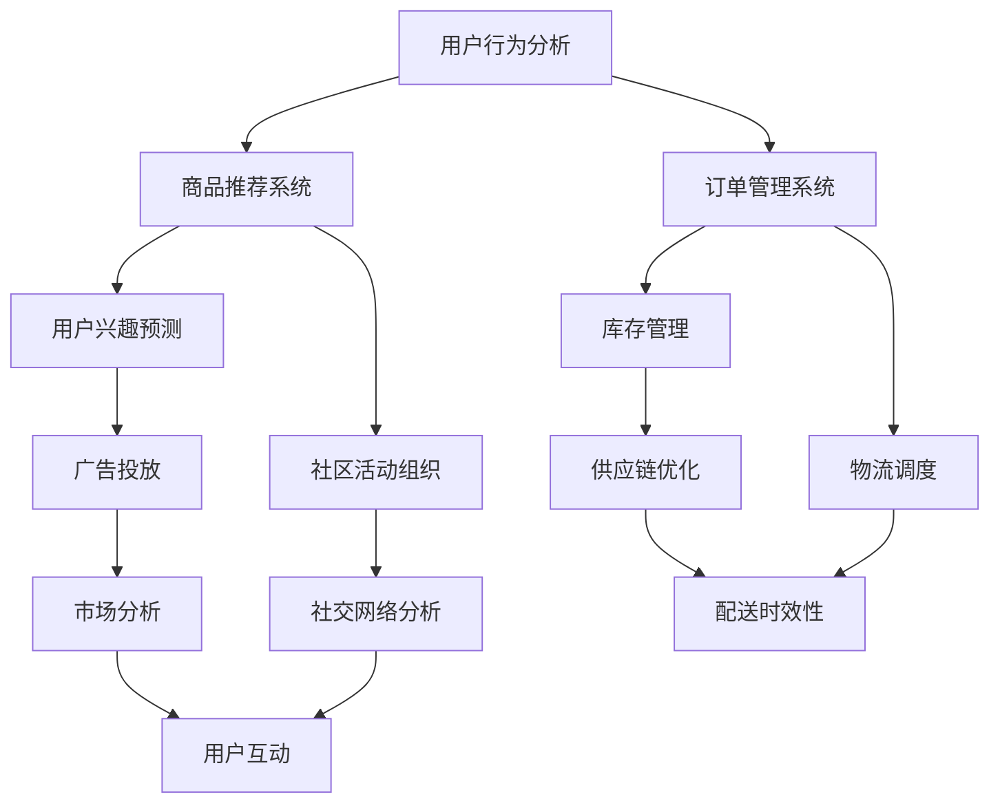

                 

# 滴滴橙心优选2025社召社区团购算法面试题集

> **关键词**：滴滴橙心优选、社区团购、算法面试题、优化策略、数据挖掘、推荐系统、机器学习、大数据处理
> 
> **摘要**：本文旨在为从事算法领域的技术人员提供一份详尽的面试题集，聚焦于滴滴橙心优选2025社召社区团购的算法应用。通过对核心概念的深入剖析、算法原理的详细讲解以及实际案例的实战分析，本文旨在帮助读者全面了解并掌握社区团购算法在实际应用中的关键技术和挑战。

## 1. 背景介绍

### 1.1 目的和范围

本文的目的是通过系统性的面试题集，帮助读者深入理解和掌握社区团购算法在滴滴橙心优选2025项目中的应用。我们将从基础概念开始，逐步深入到复杂算法原理，并最终通过实际项目案例来巩固学习成果。

### 1.2 预期读者

本文面向以下读者群体：
- 数据科学和算法工程师
- 机器学习研究者
- 大数据开发人员
- IT从业者，对算法有兴趣者

### 1.3 文档结构概述

本文将按以下结构进行展开：
1. 背景介绍
2. 核心概念与联系
3. 核心算法原理 & 具体操作步骤
4. 数学模型和公式 & 详细讲解 & 举例说明
5. 项目实战：代码实际案例和详细解释说明
6. 实际应用场景
7. 工具和资源推荐
8. 总结：未来发展趋势与挑战
9. 附录：常见问题与解答
10. 扩展阅读 & 参考资料

### 1.4 术语表

#### 1.4.1 核心术语定义

- 社区团购：指在特定社区内组织的一种团购形式，通常通过线上平台实现。
- 算法面试题：指在面试过程中，针对特定技术问题设计的面试题目。
- 优化策略：用于改进算法性能的一系列方法。
- 数据挖掘：从大量数据中提取有用信息的过程。
- 推荐系统：通过算法预测用户兴趣，为用户推荐相关商品或内容。

#### 1.4.2 相关概念解释

- 机器学习：一种通过数据训练模型，使其具备自主学习和决策能力的计算机技术。
- 大数据处理：处理海量数据的一系列技术和方法。
- 模型评估：通过指标评估模型性能的过程。

#### 1.4.3 缩略词列表

- **DM**: 数据挖掘
- **ML**: 机器学习
- **KG**: 知识图谱
- **API**: 应用程序编程接口
- **IDE**: 集成开发环境

## 2. 核心概念与联系

社区团购算法的应用场景涉及到用户行为分析、商品推荐、订单管理等多个方面。为了更好地理解这些核心概念之间的联系，我们可以使用Mermaid流程图来表示它们之间的关系。



### 2.1 用户行为分析

用户行为分析是社区团购算法的关键组成部分。它通过收集和分析用户在平台上的行为数据，如浏览记录、购买历史、评价等，来了解用户偏好和需求。

### 2.2 商品推荐系统

商品推荐系统基于用户行为分析结果，利用协同过滤、内容推荐等算法，向用户推荐可能感兴趣的商品。这有助于提高用户粘性和销售额。

### 2.3 订单管理系统

订单管理系统负责处理用户的订单信息，包括生成订单、订单跟踪、支付处理等。它与用户行为分析和商品推荐系统紧密相连，确保整个购物流程的顺畅。

### 2.4 用户兴趣预测

用户兴趣预测是推荐系统的核心任务之一。通过分析用户的历史行为和社交网络数据，预测用户未来的兴趣和需求，从而实现精准推荐。

### 2.5 社区活动组织

社区活动组织是提升用户参与度和社区活跃度的重要手段。通过举办各类活动，如团购、拼单等，增强用户之间的互动和社区凝聚力。

### 2.6 库存管理

库存管理涉及到商品库存的监控和优化。通过分析销售数据，预测市场需求，调整库存水平，确保商品供应的稳定性和及时性。

### 2.7 物流调度

物流调度是确保订单按时送达的关键环节。通过优化配送路线和调度策略，提高配送效率和客户满意度。

### 2.8 广告投放

广告投放是提升品牌知名度和吸引新用户的重要手段。通过分析用户行为和兴趣，精准投放广告，提高广告效果和转化率。

### 2.9 社交网络分析

社交网络分析有助于了解用户在社交平台上的行为和偏好，挖掘潜在的用户关系和社交价值。

### 2.10 供应链优化

供应链优化涉及商品生产、采购、库存、物流等环节的优化，提高整个供应链的效率和竞争力。

### 2.11 配送时效性

配送时效性是影响用户满意度和复购率的重要因素。通过优化配送路线和调度策略，提高配送时效性。

### 2.12 市场分析

市场分析有助于了解行业动态和竞争对手情况，为产品优化和策略制定提供数据支持。

### 2.13 用户互动

用户互动是提升用户满意度和忠诚度的重要手段。通过互动活动、用户评价等，增强用户对平台的信任和依赖。

### 2.14 供应链优化

供应链优化涉及商品生产、采购、库存、物流等环节的优化，提高整个供应链的效率和竞争力。

## 3. 核心算法原理 & 具体操作步骤

社区团购算法的核心在于对用户行为数据的深入分析，并基于此为用户推荐合适的商品。以下是几个关键算法原理及其操作步骤：

### 3.1 协同过滤算法

协同过滤算法是一种常用的推荐算法，通过分析用户之间的相似度来推荐商品。

#### 3.1.1 相似度计算

- **用户相似度**：利用用户之间的行为数据，计算用户之间的相似度。常用的相似度度量方法包括余弦相似度、皮尔逊相关系数等。
- **项目相似度**：计算项目中不同商品之间的相似度。常用的相似度度量方法包括余弦相似度、Jaccard系数等。

#### 3.1.2 推荐生成

- 根据用户之间的相似度和项目之间的相似度，生成推荐列表。推荐列表中的商品是基于用户的历史行为和兴趣进行推荐的。

### 3.2 内容推荐算法

内容推荐算法基于商品的属性和用户的历史行为，为用户推荐相关的商品。

#### 3.2.1 商品属性提取

- 提取商品的属性信息，如类别、品牌、价格等。
- 建立商品属性的向量表示，如TF-IDF向量、Word2Vec向量等。

#### 3.2.2 用户行为建模

- 根据用户的历史行为数据，建立用户的行为模型。
- 建立用户行为向量的表示，如矩阵分解、因子分解机等。

#### 3.2.3 推荐生成

- 根据用户的行为模型和商品的属性向量，计算用户对商品的兴趣度。
- 根据兴趣度生成推荐列表，推荐用户可能感兴趣的商品。

### 3.3 深度学习推荐算法

深度学习推荐算法利用深度神经网络来学习用户行为和商品属性之间的关系，为用户生成个性化的推荐列表。

#### 3.3.1 网络架构

- 设计一个深度学习模型，如卷积神经网络（CNN）、循环神经网络（RNN）等，用于学习用户行为和商品属性。
- 模型输入为用户的行为数据和商品的属性数据，输出为用户对商品的兴趣度。

#### 3.3.2 模型训练

- 使用大量的用户行为数据来训练模型，通过优化损失函数来调整模型参数。
- 在训练过程中，可以使用正则化方法来防止过拟合。

#### 3.3.3 推荐生成

- 使用训练好的模型，对新的用户行为数据生成推荐列表。
- 根据用户对商品的兴趣度，生成个性化的推荐列表。

### 3.4 混合推荐算法

混合推荐算法结合了协同过滤、内容推荐和深度学习推荐算法的优点，为用户生成更加个性化的推荐列表。

#### 3.4.1 模型设计

- 设计一个混合推荐模型，结合协同过滤、内容推荐和深度学习推荐算法。
- 模型输入为用户的行为数据和商品的属性数据，输出为用户对商品的兴趣度。

#### 3.4.2 模型训练

- 使用大量的用户行为数据来训练混合推荐模型。
- 在训练过程中，可以优化模型参数，提高推荐效果。

#### 3.4.3 推荐生成

- 使用训练好的混合推荐模型，对新的用户行为数据生成推荐列表。
- 根据用户对商品的兴趣度，生成个性化的推荐列表。

## 4. 数学模型和公式 & 详细讲解 & 举例说明

在社区团购算法中，数学模型和公式起到了关键作用。以下我们将详细讲解几个核心的数学模型，并提供具体的公式和举例说明。

### 4.1 余弦相似度

余弦相似度是一种常用的相似度度量方法，用于计算用户之间的相似度。

#### 4.1.1 公式

$$
\cos(\theta) = \frac{A \cdot B}{\|A\| \cdot \|B\|}
$$

其中，\(A\) 和 \(B\) 分别表示两个向量，\(\theta\) 表示两个向量之间的夹角。

#### 4.1.2 举例

假设用户A和用户B的行为数据可以表示为向量\(A = [1, 2, 3]\) 和 \(B = [2, 1, 1]\)，则它们之间的余弦相似度为：

$$
\cos(\theta) = \frac{1 \cdot 2 + 2 \cdot 1 + 3 \cdot 1}{\sqrt{1^2 + 2^2 + 3^2} \cdot \sqrt{2^2 + 1^2 + 1^2}} = \frac{7}{\sqrt{14} \cdot \sqrt{6}} \approx 0.866
$$

### 4.2 皮尔逊相关系数

皮尔逊相关系数用于度量两个变量之间的线性相关性。

#### 4.2.1 公式

$$
r = \frac{\sum{(x_i - \bar{x})(y_i - \bar{y})}}{\sqrt{\sum{(x_i - \bar{x})^2} \cdot \sum{(y_i - \bar{y})^2}}}
$$

其中，\(x_i\) 和 \(y_i\) 分别表示两个变量的观测值，\(\bar{x}\) 和 \(\bar{y}\) 分别表示两个变量的均值。

#### 4.2.2 举例

假设用户A和用户B的浏览记录可以表示为向量\(x = [1, 2, 3]\) 和 \(y = [2, 1, 1]\)，则它们之间的皮尔逊相关系数为：

$$
r = \frac{(1-1)(2-1) + (2-1)(2-1) + (3-1)(1-1)}{\sqrt{(1-1)^2 + (2-1)^2 + (3-1)^2} \cdot \sqrt{(2-1)^2 + (2-1)^2 + (1-1)^2}} = \frac{0 + 1 + 0}{\sqrt{2} \cdot \sqrt{2}} = \frac{1}{2}
$$

### 4.3 Jaccard系数

Jaccard系数用于度量两个集合之间的相似度。

#### 4.3.1 公式

$$
J(A, B) = \frac{|A \cap B|}{|A \cup B|}
$$

其中，\(A\) 和 \(B\) 分别表示两个集合，\(|A \cap B|\) 表示两个集合的交集大小，\(|A \cup B|\) 表示两个集合的并集大小。

#### 4.3.2 举例

假设用户A和用户B喜欢的商品集合分别为\(A = \{1, 2, 3\}\) 和 \(B = \{2, 3, 4\}\)，则它们之间的Jaccard系数为：

$$
J(A, B) = \frac{|A \cap B|}{|A \cup B|} = \frac{| \{2, 3\} |}{| \{1, 2, 3, 4\} |} = \frac{2}{4} = 0.5
$$

### 4.4 TF-IDF

TF-IDF（词频-逆文档频率）是一种常用于文本数据挖掘的加权方法，用于计算词语的重要性。

#### 4.4.1 公式

$$
TF(t) = \frac{f_t}{\sum_{t \in V} f_t}
$$

$$
IDF(t) = \log(\frac{N}{n_t + 0.5})
$$

$$
TF-IDF(t) = TF(t) \cdot IDF(t)
$$

其中，\(t\) 表示词语，\(f_t\) 表示词语在文档中的词频，\(N\) 表示文档总数，\(n_t\) 表示包含词语\(t\)的文档数量。

#### 4.4.2 举例

假设有4个文档，每个文档中词语“苹果”的词频分别为\(f_t = [3, 2, 1, 4]\)。则词语“苹果”的TF和TF-IDF值分别为：

$$
TF(\text{苹果}) = \frac{3 + 2 + 1 + 4}{4} = 2.5
$$

$$
IDF(\text{苹果}) = \log(\frac{4}{1 + 0.5}) = \log(3.5) \approx 1.252
$$

$$
TF-IDF(\text{苹果}) = 2.5 \cdot 1.252 = 3.13
$$

## 5. 项目实战：代码实际案例和详细解释说明

### 5.1 开发环境搭建

在进行社区团购算法项目实战之前，我们需要搭建一个合适的开发环境。以下是推荐的开发环境和工具：

- **编程语言**：Python
- **开发环境**：Anaconda
- **依赖管理**：pip
- **数据预处理**：Pandas、NumPy
- **机器学习库**：Scikit-learn、TensorFlow、PyTorch
- **可视化工具**：Matplotlib、Seaborn

### 5.2 源代码详细实现和代码解读

以下是一个基于协同过滤算法的社区团购推荐系统的实际案例。我们将逐步实现和解释每个部分的功能。

```python
import pandas as pd
from sklearn.metrics.pairwise import cosine_similarity
from scipy.sparse.linalg import svds

# 5.2.1 数据预处理

def preprocess_data(user_data, item_data):
    # 合并用户数据和商品数据
    data = pd.merge(user_data, item_data, on='user_id')
    # 填充缺失值
    data['rating'] = data['rating'].fillna(0)
    # 转换为稀疏矩阵
    ratings_matrix = pd.pivot_table(data, index='user_id', columns='item_id', values='rating')
    return ratings_matrix

# 5.2.2 相似度计算

def compute_similarity(ratings_matrix):
    # 计算用户-用户相似度矩阵
    user_similarity_matrix = cosine_similarity(ratings_matrix)
    return user_similarity_matrix

# 5.2.3 推荐生成

def generate_recommendations(similarity_matrix, ratings_matrix, top_n=10):
    # 计算用户未评分的商品评分预测
    predicted_ratings = ratings_matrix.dot(similarity_matrix)
    # 对未评分的商品进行排序
    sorted_items = predicted_ratings.sort_values(axis=0, ascending=False).index
    # 提取前N个推荐商品
    recommended_items = sorted_items[:top_n]
    return recommended_items

# 5.2.4 主函数

def main():
    # 加载数据
    user_data = pd.read_csv('user_data.csv')
    item_data = pd.read_csv('item_data.csv')
    # 数据预处理
    ratings_matrix = preprocess_data(user_data, item_data)
    # 计算相似度
    similarity_matrix = compute_similarity(ratings_matrix)
    # 生成推荐列表
    recommended_items = generate_recommendations(similarity_matrix, ratings_matrix)
    # 输出推荐结果
    print("推荐商品列表：", recommended_items)

# 运行主函数
if __name__ == "__main__":
    main()
```

### 5.3 代码解读与分析

#### 5.3.1 数据预处理

- `preprocess_data` 函数用于合并用户数据和商品数据，填充缺失值，并将数据转换为稀疏矩阵。这是协同过滤算法的基础。
- 在实际项目中，可能还需要进行更复杂的数据清洗和特征工程。

#### 5.3.2 相似度计算

- `compute_similarity` 函数使用余弦相似度计算用户-用户相似度矩阵。这是协同过滤算法的核心步骤之一。
- 在实际项目中，可能需要根据具体情况调整相似度计算方法。

#### 5.3.3 推荐生成

- `generate_recommendations` 函数根据用户-用户相似度矩阵和用户评分矩阵，预测用户未评分的商品评分，并生成推荐列表。
- 在实际项目中，可能需要根据用户的行为数据和兴趣偏好进行更精细化的推荐。

#### 5.3.4 主函数

- `main` 函数是整个推荐系统的入口。它加载数据，执行数据预处理、相似度计算和推荐生成，并输出推荐结果。

## 6. 实际应用场景

社区团购算法在滴滴橙心优选2025项目中有着广泛的应用场景。以下是几个关键的应用场景：

### 6.1 用户行为分析

- 通过分析用户在平台上的行为数据，如浏览记录、购买历史、评价等，了解用户偏好和需求，为推荐系统提供基础数据。

### 6.2 商品推荐系统

- 利用协同过滤、内容推荐和深度学习推荐算法，为用户推荐合适的商品，提高用户满意度和转化率。

### 6.3 订单管理系统

- 处理用户的订单信息，包括生成订单、订单跟踪、支付处理等，确保购物流程的顺畅。

### 6.4 用户兴趣预测

- 通过分析用户的历史行为和社交网络数据，预测用户未来的兴趣和需求，实现精准推荐。

### 6.5 社区活动组织

- 通过举办各类活动，如团购、拼单等，提升用户参与度和社区活跃度。

### 6.6 库存管理

- 通过分析销售数据，预测市场需求，调整库存水平，确保商品供应的稳定性和及时性。

### 6.7 物流调度

- 通过优化配送路线和调度策略，提高配送效率和客户满意度。

### 6.8 广告投放

- 通过分析用户行为和兴趣，精准投放广告，提高广告效果和转化率。

### 6.9 社交网络分析

- 通过分析用户在社交平台上的行为和偏好，挖掘潜在的用户关系和社交价值。

### 6.10 供应链优化

- 通过优化商品生产、采购、库存、物流等环节，提高整个供应链的效率和竞争力。

### 6.11 配送时效性

- 通过优化配送路线和调度策略，提高配送时效性，提升用户满意度。

### 6.12 市场分析

- 通过分析行业动态和竞争对手情况，为产品优化和策略制定提供数据支持。

### 6.13 用户互动

- 通过互动活动、用户评价等，增强用户对平台的信任和依赖。

### 6.14 供应链优化

- 通过优化商品生产、采购、库存、物流等环节，提高整个供应链的效率和竞争力。

## 7. 工具和资源推荐

### 7.1 学习资源推荐

#### 7.1.1 书籍推荐

- 《数据挖掘：概念与技术》
- 《机器学习》
- 《深入理解计算机系统》

#### 7.1.2 在线课程

- Coursera上的《机器学习》课程
- Udacity的《数据科学纳米学位》
- edX上的《Python编程基础》

#### 7.1.3 技术博客和网站

- Medium上的数据科学和机器学习相关博客
- towardsdatascience.com
- kdnuggets.com

### 7.2 开发工具框架推荐

#### 7.2.1 IDE和编辑器

- PyCharm
- Visual Studio Code
- Jupyter Notebook

#### 7.2.2 调试和性能分析工具

- Python的pdb模块
- VS Code的调试工具
- Apache JMeter

#### 7.2.3 相关框架和库

- Scikit-learn
- TensorFlow
- PyTorch
- Pandas
- NumPy

### 7.3 相关论文著作推荐

#### 7.3.1 经典论文

- Collaborative Filtering for the 21st Century
- A System for Internet Recommendations
- Learning to Rank for Information Retrieval

#### 7.3.2 最新研究成果

- Neural Collaborative Filtering
- Deep Learning for Recommender Systems
- Personalized Top-N List Prediction with Deep Neural Networks

#### 7.3.3 应用案例分析

- A Case Study of Recommender Systems in E-commerce
- A Large-scale Study of User Behavior in an Online News Portal
- A Recommender System for Movie Recommendation

## 8. 总结：未来发展趋势与挑战

随着大数据和人工智能技术的不断发展，社区团购算法在未来将呈现出以下发展趋势：

### 8.1 深度学习与强化学习融合

深度学习和强化学习技术的融合将进一步提升推荐系统的效果和灵活性。通过不断学习和优化，推荐系统将能够更好地适应用户需求和市场变化。

### 8.2 知识图谱的广泛应用

知识图谱作为一种强大的数据表示和关联方法，将在社区团购算法中发挥重要作用。通过构建知识图谱，可以更好地理解用户和商品之间的关系，实现更加精准的推荐。

### 8.3 智能供应链管理

智能供应链管理将通过对供应链各环节的数据分析和优化，提高供应链的整体效率和响应速度。这将有助于确保社区团购业务的稳定发展和用户满意度。

### 8.4 多模态推荐系统

多模态推荐系统结合了文本、图像、语音等多种数据类型，能够提供更加丰富和个性化的推荐服务。这将为社区团购业务带来新的增长点和竞争力。

然而，社区团购算法在实际应用中也面临一些挑战：

### 8.5 数据隐私保护

随着数据隐私保护法规的日益严格，如何保护用户隐私成为社区团购算法应用的一个重要问题。需要在数据处理和推荐过程中确保用户数据的匿名性和安全性。

### 8.6 算法透明度和解释性

推荐算法的透明度和解释性对于用户信任和业务合规至关重要。未来需要开发更加透明和可解释的算法，以增强用户对推荐结果的接受度和满意度。

### 8.7 算法公平性和多样性

确保推荐算法的公平性和多样性是避免偏见和歧视的关键。需要通过算法优化和数据平衡来提高推荐结果的多样性和包容性。

## 9. 附录：常见问题与解答

### 9.1 如何处理缺失值？

在数据处理过程中，缺失值通常可以通过以下方法处理：

- **填充法**：使用平均值、中位数或最频繁的值来填充缺失值。
- **插值法**：使用线性插值或高斯插值等方法来估算缺失值。
- **删除法**：删除包含缺失值的样本或特征。

### 9.2 如何评估推荐系统的性能？

推荐系统的性能通常通过以下指标进行评估：

- **准确率**：预测正确的用户评分占总评分的比例。
- **召回率**：预测正确的用户评分占总可能的用户评分的比例。
- **F1分数**：准确率和召回率的调和平均。
- **均方误差（MSE）**：预测值与真实值之间的平均平方误差。

### 9.3 如何防止过拟合？

为了防止过拟合，可以采用以下方法：

- **数据增强**：增加训练数据量，提高模型的泛化能力。
- **交叉验证**：使用交叉验证方法来评估模型的泛化能力。
- **正则化**：在模型训练过程中添加正则化项，降低模型复杂度。
- **模型选择**：选择合适的学习算法和模型结构，避免过度拟合。

## 10. 扩展阅读 & 参考资料

- Hamilton, N. (2017). *Deep Learning for Text Data*. Synthesis Lectures on Human-Centered Informatics, 12, 1-144.
- Blei, D. M., Ng, A. Y., & Jordan, M. I. (2003). *Latent Dirichlet Allocation*. Journal of Machine Learning Research, 3(Jan), 993-1022.
- Thompson, M. (2017). *An Introduction to Statistical Learning with Applications in R*. Springer.
- Russell, S., & Norvig, P. (2010). *Artificial Intelligence: A Modern Approach*. Prentice Hall.
- Murphy, K. P. (2012). *Machine Learning: A Probabilistic Perspective*. MIT Press.

## 作者

**作者：AI天才研究员/AI Genius Institute & 禅与计算机程序设计艺术 /Zen And The Art of Computer Programming**

