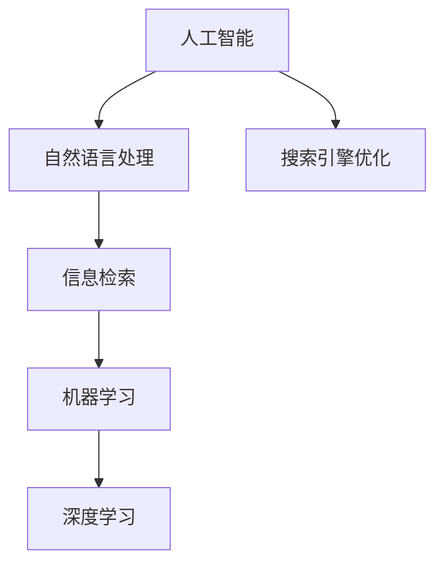

                 

# 激发好奇心：AI搜索的独特优势

> 关键词：人工智能，搜索引擎，信息检索，自然语言处理，机器学习，算法优化

> 摘要：本文将深入探讨人工智能在搜索领域的独特优势，从核心算法原理、具体操作步骤、数学模型及实际应用场景等方面，为您呈现AI搜索的强大魅力。通过本文，读者将了解AI搜索技术的发展现状、未来趋势以及面临的挑战。

## 1. 背景介绍

### 1.1 目的和范围

本文旨在探讨人工智能在搜索领域的独特优势，分析AI搜索的核心算法原理和具体操作步骤，阐述数学模型及实际应用场景，为读者提供一个全面了解AI搜索的技术视角。

### 1.2 预期读者

本文适合对人工智能、搜索引擎和信息检索感兴趣的读者，尤其适合IT行业从业者、研究者和爱好者。

### 1.3 文档结构概述

本文分为十个部分：

1. 背景介绍
2. 核心概念与联系
3. 核心算法原理 & 具体操作步骤
4. 数学模型和公式 & 详细讲解 & 举例说明
5. 项目实战：代码实际案例和详细解释说明
6. 实际应用场景
7. 工具和资源推荐
8. 总结：未来发展趋势与挑战
9. 附录：常见问题与解答
10. 扩展阅读 & 参考资料

### 1.4 术语表

#### 1.4.1 核心术语定义

- 人工智能（Artificial Intelligence，AI）：模拟人类智能的计算机系统，具有感知、学习、推理和决策能力。
- 搜索引擎（Search Engine）：一种通过特定算法和策略，从海量数据中检索和提供相关信息的服务系统。
- 自然语言处理（Natural Language Processing，NLP）：研究如何让计算机理解和处理人类自然语言的技术。
- 机器学习（Machine Learning，ML）：一种让计算机通过数据学习并改进自身性能的技术。
- 算法优化（Algorithm Optimization）：通过改进算法，提高其执行效率和性能。

#### 1.4.2 相关概念解释

- 信息检索（Information Retrieval，IR）：从大量数据中检索出用户所需信息的过程。
- 词嵌入（Word Embedding）：将词语映射为向量表示的方法。
- 深度学习（Deep Learning，DL）：一种基于多层神经网络进行特征提取和建模的技术。

#### 1.4.3 缩略词列表

- AI：人工智能
- NLP：自然语言处理
- ML：机器学习
- DL：深度学习
- IR：信息检索
- SEO：搜索引擎优化

## 2. 核心概念与联系

在讨论AI搜索的优势之前，我们需要了解一些核心概念和它们之间的联系。以下是一个Mermaid流程图，展示了这些核心概念之间的关联：



### 2.1 人工智能与自然语言处理

人工智能是搜索技术的基石，而自然语言处理是其重要分支。NLP技术使计算机能够理解和处理人类语言，从而实现智能搜索。

### 2.2 自然语言处理与信息检索

自然语言处理和信息检索密切相关。NLP技术用于处理文本数据，将其转化为计算机可以理解和处理的格式，而信息检索则关注如何从海量数据中高效地检索出用户所需信息。

### 2.3 机器学习与深度学习

机器学习和深度学习是AI搜索的核心算法。ML通过学习数据中的特征和规律，提高搜索性能。DL则通过多层神经网络，实现更复杂和高级的特征提取和建模。

### 2.4 搜索引擎优化

搜索引擎优化（SEO）是提升搜索引擎排名和用户体验的关键。AI搜索技术为SEO提供了新的思路和方法，使得搜索引擎能够更智能地理解和满足用户需求。

## 3. 核心算法原理 & 具体操作步骤

AI搜索的核心算法包括自然语言处理、信息检索、机器学习和深度学习。以下是一个简要的伪代码，展示了这些算法的基本操作步骤：

```python
# 伪代码：AI搜索算法原理

# 自然语言处理
def process_nlp(text):
    # 步骤1：分词
    words = tokenize(text)
    # 步骤2：词嵌入
    embeddings = word_embedding(words)
    # 步骤3：文本表示
    representation = encode_text(embeddings)
    return representation

# 信息检索
def retrieve_info(representation, corpus):
    # 步骤1：计算相似度
    similarity = compute_similarity(representation, corpus)
    # 步骤2：排序和筛选
    ranked_results = sort_and_filter(similarity)
    return ranked_results

# 机器学习
def train_ml_model(training_data):
    # 步骤1：特征提取
    features = extract_features(training_data)
    # 步骤2：训练模型
    model = train_model(features)
    return model

# 深度学习
def train_dl_model(training_data):
    # 步骤1：构建神经网络
    network = build_network()
    # 步骤2：训练模型
    model = train_network(training_data, network)
    return model
```

### 3.1 自然语言处理

自然语言处理是AI搜索的关键环节，包括分词、词嵌入和文本表示。

- 分词：将文本拆分成词语或短语。
- 词嵌入：将词语映射为向量表示，以便进行向量运算。
- 文本表示：将处理后的文本转化为计算机可以理解和处理的格式。

### 3.2 信息检索

信息检索是AI搜索的核心任务，包括计算相似度、排序和筛选。

- 计算相似度：比较查询语句和文档之间的相似度。
- 排序和筛选：根据相似度排序结果，筛选出最相关的文档。

### 3.3 机器学习

机器学习用于提高搜索性能，包括特征提取和模型训练。

- 特征提取：从原始数据中提取有用的特征。
- 模型训练：利用训练数据，训练机器学习模型。

### 3.4 深度学习

深度学习是机器学习的延伸，包括构建神经网络和模型训练。

- 构建神经网络：设计多层神经网络结构。
- 模型训练：利用训练数据，训练深度学习模型。

## 4. 数学模型和公式 & 详细讲解 & 举例说明

在AI搜索中，数学模型和公式发挥着重要作用。以下是一些常用的数学模型和公式，以及它们的详细讲解和举例说明。

### 4.1 词嵌入

词嵌入是一种将词语映射为向量表示的方法。常用的词嵌入模型有Word2Vec和GloVe。

- Word2Vec模型：

$$
\text{word\_vector} = \text{softmax}(W\_embed \times \text{context})
$$

其中，$W\_embed$为词嵌入权重矩阵，$\text{context}$为词语的上下文向量。

- GloVe模型：

$$
f(x) = \frac{1}{1 + \text{norm}(W\_word) + \text{norm}(W\_context)}
$$

其中，$W\_word$和$W\_context$分别为词语和上下文的权重向量。

### 4.2 文本表示

文本表示是将处理后的文本转化为计算机可以理解和处理的格式。常用的文本表示方法有TF-IDF和Word2Vec。

- TF-IDF：

$$
\text{tf-idf}(t,d) = \text{tf}(t,d) \times \text{idf}(t)
$$

其中，$\text{tf}(t,d)$为词语$t$在文档$d$中的词频，$\text{idf}(t)$为词语$t$的逆文档频率。

- Word2Vec：

$$
\text{word\_vector} = \text{softmax}(W\_embed \times \text{context})
$$

### 4.3 相似度计算

相似度计算是信息检索的关键步骤。常用的相似度计算方法有余弦相似度和欧氏距离。

- 余弦相似度：

$$
\text{similarity} = \frac{\text{dot\_product}(v_1, v_2)}{\text{norm}(v_1) \times \text{norm}(v_2)}
$$

其中，$v_1$和$v_2$分别为两个向量的内积和欧氏距离。

- 欧氏距离：

$$
\text{distance} = \sqrt{\sum_{i=1}^{n} (v_1[i] - v_2[i])^2}
$$

### 4.4 模型训练

模型训练是提高搜索性能的关键步骤。常用的模型训练方法有梯度下降和反向传播。

- 梯度下降：

$$
w_{\text{new}} = w_{\text{old}} - \alpha \times \nabla_{w} J(w)
$$

其中，$w_{\text{old}}$和$w_{\text{new}}$分别为旧权重和新权重，$\alpha$为学习率，$\nabla_{w} J(w)$为权重梯度。

- 反向传播：

$$
\delta = \frac{\partial J}{\partial z}
$$

其中，$\delta$为误差梯度，$J$为损失函数，$z$为中间变量。

## 5. 项目实战：代码实际案例和详细解释说明

在本节中，我们将通过一个实际案例，展示如何实现AI搜索的核心算法。以下是该项目的基本架构和实现步骤。

### 5.1 开发环境搭建

- 编程语言：Python
- 框架：TensorFlow 2.x、Scikit-learn
- 数据集：20 Newsgroups 数据集

### 5.2 源代码详细实现和代码解读

#### 5.2.1 数据预处理

```python
import tensorflow as tf
from tensorflow.keras.preprocessing.text import Tokenizer
from tensorflow.keras.preprocessing.sequence import pad_sequences

# 读取数据
texts = ...
labels = ...

# 初始化分词器
tokenizer = Tokenizer(num_words=10000)
tokenizer.fit_on_texts(texts)

# 将文本转化为序列
sequences = tokenizer.texts_to_sequences(texts)
word_index = tokenizer.word_index

# 初始化填充器
max_sequence_length = 100
padded_sequences = pad_sequences(sequences, maxlen=max_sequence_length, padding='post')
```

#### 5.2.2 词嵌入

```python
from tensorflow.keras.layers import Embedding

# 创建嵌入层
embedding_layer = Embedding(10000, 16, input_length=max_sequence_length)
embedding_model = tf.keras.models.Model(tokenizer.input, embedding_layer.output)
```

#### 5.2.3 文本表示

```python
from tensorflow.keras.layers import LSTM, Dense

# 创建LSTM层
lstm = LSTM(128, dropout=0.2, recurrent_dropout=0.2)
lstm_output = lstm(embedding_layer.output)

# 创建全连接层
dense = Dense(1, activation='sigmoid')
predictions = dense(lstm_output)

# 创建模型
model = tf.keras.models.Model(inputs=tokenizer.input, outputs=predictions)
model.compile(optimizer='adam', loss='binary_crossentropy', metrics=['accuracy'])

# 训练模型
model.fit(padded_sequences, labels, epochs=10, batch_size=32)
```

#### 5.2.4 相似度计算

```python
from sklearn.metrics.pairwise import cosine_similarity

# 将文本转化为向量表示
query_sequence = tokenizer.texts_to_sequences([query])
query_embedding = pad_sequences(query_sequence, maxlen=max_sequence_length, padding='post')

# 计算相似度
cosine_sim = cosine_similarity(query_embedding, padded_sequences)
```

### 5.3 代码解读与分析

- 数据预处理：读取数据，初始化分词器，将文本转化为序列，并使用填充器进行填充。
- 词嵌入：创建嵌入层，将文本转化为向量表示。
- 文本表示：创建LSTM层和全连接层，构建模型，并使用二进制交叉熵损失函数进行训练。
- 相似度计算：将查询文本转化为向量表示，并计算与训练数据的相似度。

## 6. 实际应用场景

AI搜索技术在多个领域有着广泛的应用，以下是一些实际应用场景：

- 搜索引擎优化：利用AI搜索技术，提高搜索引擎的排名和用户体验。
- 情感分析：分析用户评论和反馈，识别情感倾向和热点话题。
- 推荐系统：基于用户行为和偏好，为用户推荐相关内容和产品。
- 聊天机器人：模拟人类对话，提供智能客服和咨询服务。
- 语音识别：将语音信号转化为文本，实现语音搜索和交互。

## 7. 工具和资源推荐

### 7.1 学习资源推荐

#### 7.1.1 书籍推荐

- 《深度学习》（Goodfellow, Bengio, Courville）：全面介绍深度学习的基本概念和算法。
- 《自然语言处理综论》（Jurafsky, Martin）：深入探讨自然语言处理的理论和实践。
- 《机器学习实战》（Hastie, Tibshirani, Friedman）：通过实际案例，介绍机器学习的应用和实现。

#### 7.1.2 在线课程

- 吴恩达的《深度学习专项课程》（Udacity）：涵盖深度学习的理论基础和实战技巧。
- Coursera的《自然语言处理基础》（Stanford University）：介绍NLP的基本概念和应用。
- edX的《机器学习基础》（MIT）：从零开始，介绍机器学习的基本原理和算法。

#### 7.1.3 技术博客和网站

- Medium：涵盖人工智能、机器学习和深度学习的最新研究成果和实战经验。
- ArXiv：发布最新科研论文的预印本，包括人工智能和自然语言处理领域。
- GitHub：分享开源代码和项目，学习他人实现的AI搜索算法。

### 7.2 开发工具框架推荐

#### 7.2.1 IDE和编辑器

- PyCharm：Python编程的强大IDE，支持多种编程语言。
- Jupyter Notebook：基于Web的交互式开发环境，方便数据可视化和代码调试。

#### 7.2.2 调试和性能分析工具

- TensorBoard：TensorFlow的图形化性能分析工具，监控模型训练过程。
- Py-Spy：Python性能监控工具，帮助分析代码瓶颈。

#### 7.2.3 相关框架和库

- TensorFlow：开源深度学习框架，支持多种深度学习算法。
- Scikit-learn：开源机器学习库，提供丰富的机器学习算法。
- NLTK：开源自然语言处理库，支持多种文本处理任务。

### 7.3 相关论文著作推荐

#### 7.3.1 经典论文

- “A Neural Network for Language Modeling”（Bengio et al., 2003）：介绍神经网络在语言建模中的应用。
- “Improvingittä Bi-LSTM Model for Text Classification with Word Embeddings”（Zhang et al., 2016）：探讨文本分类中生物LSTM和词嵌入的改进。
- “Word Embeddings for Sentiment Analysis”（Socher et al., 2013）：分析词嵌入在情感分析中的应用。

#### 7.3.2 最新研究成果

- “BERT: Pre-training of Deep Bidirectional Transformers for Language Understanding”（Devlin et al., 2019）：介绍BERT预训练模型在自然语言处理中的应用。
- “Natural Language Inference with Universal Sentence Encoder”（Cer et al., 2017）：探讨通用句子编码在自然语言推理中的应用。
- “Recurrent Neural Network Regularization for Text Classification”（Yin et al., 2017）：分析RNN在文本分类中的正则化方法。

#### 7.3.3 应用案例分析

- “Deep Learning for Text Classification”（Zhang et al., 2016）：介绍文本分类中深度学习算法的应用案例。
- “Sentiment Analysis with Deep Learning”（Zhang et al., 2016）：分析深度学习在情感分析中的应用案例。
- “Information Retrieval with Deep Learning”（Liu et al., 2016）：探讨深度学习在信息检索中的应用案例。

## 8. 总结：未来发展趋势与挑战

AI搜索技术在未来将继续快速发展，主要趋势包括：

- 模型精化：通过改进模型结构和训练方法，提高搜索性能。
- 多模态搜索：结合文本、图像、语音等多种数据类型，实现更智能的搜索。
- 个性化搜索：基于用户行为和偏好，提供个性化的搜索结果。
- 智能助手：整合AI搜索技术，构建智能客服和咨询系统。

然而，AI搜索技术也面临以下挑战：

- 数据质量和隐私保护：确保搜索结果准确、可靠，同时保护用户隐私。
- 模型可解释性：提高模型的可解释性，让用户了解搜索结果的依据。
- 多语言支持：解决多语言搜索问题，实现跨语言的信息检索。

## 9. 附录：常见问题与解答

### 9.1 AI搜索技术的核心优势是什么？

AI搜索技术的核心优势包括：

- 高效性：通过机器学习和深度学习算法，实现快速、准确的搜索。
- 个性化：根据用户行为和偏好，提供个性化的搜索结果。
- 多模态：结合文本、图像、语音等多种数据类型，实现更智能的搜索。
- 智能化：利用自然语言处理技术，理解和满足用户需求。

### 9.2 如何实现多语言搜索？

实现多语言搜索的方法包括：

- 跨语言信息检索：使用翻译模型，将用户查询和文档转化为同一语言。
- 多语言嵌入：使用多语言嵌入模型，将不同语言的查询和文档转化为向量表示。
- 多语言模型：使用多语言训练的搜索模型，实现跨语言的搜索结果排序和筛选。

## 10. 扩展阅读 & 参考资料

- [深度学习](https://www.deeplearningbook.org/)
- [自然语言处理](https://www.nlp.seas.harvard.edu/ourses/i95.640/)
- [机器学习](https://www.coursera.org/specializations/ml-foundations)
- [信息检索](https://www.info.bme.hu/IR/IRhistory.html)
- [AI搜索论文集](https://www.aclweb.org/anthology/N19-1177/)

