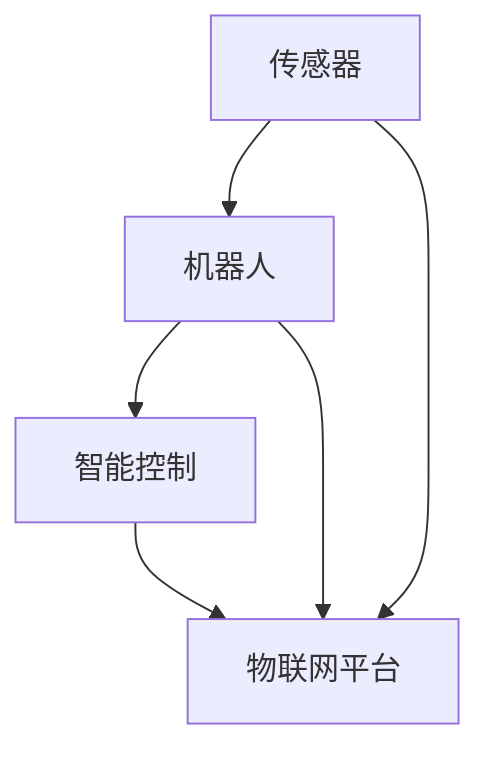
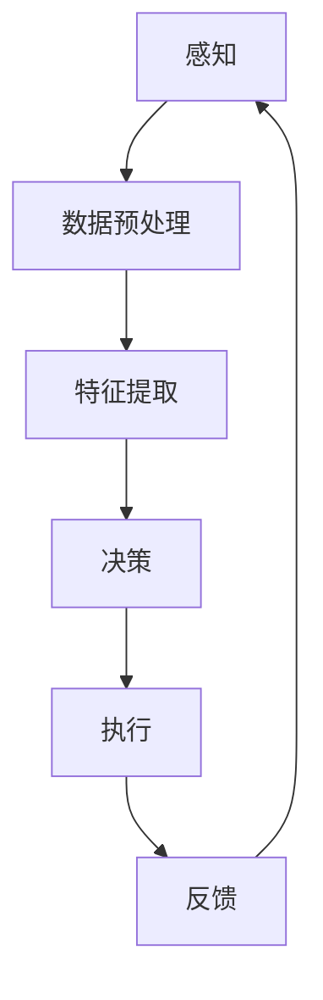

                 

# 物理实体的自动化应用与进展

> 关键词：物理实体自动化，传感器，机器人，智能控制，物联网，算法优化

> 摘要：本文将探讨物理实体自动化的概念、应用场景及最新进展。从传感器技术、机器人技术到智能控制算法，以及物联网平台的应用，我们将一步步分析这些技术如何共同推动物理实体自动化的发展，并展望未来的发展趋势与挑战。

## 1. 背景介绍

### 1.1 目的和范围

本文旨在深入探讨物理实体的自动化应用，旨在帮助读者了解这一领域的现状、挑战及其潜在的未来发展方向。文章将涵盖以下内容：

1. 物理实体自动化的核心概念及其重要性。
2. 传感器技术在物理实体自动化中的作用。
3. 机器人技术及其在自动化领域的应用。
4. 智能控制算法的基本原理及其应用。
5. 物联网平台在物理实体自动化中的关键作用。
6. 物理实体自动化在不同行业中的应用案例。
7. 工具和资源的推荐。
8. 总结与未来发展趋势。

### 1.2 预期读者

本文适合对物理实体自动化领域有一定了解的读者，包括但不限于研究人员、工程师、技术爱好者以及相关行业的管理者。读者应具备基本的计算机科学和自动化技术知识。

### 1.3 文档结构概述

本文将分为以下几个部分：

1. 背景介绍：介绍物理实体自动化的概念、目的和预期读者。
2. 核心概念与联系：介绍物理实体自动化的核心概念和联系。
3. 核心算法原理 & 具体操作步骤：详细阐述核心算法的原理和操作步骤。
4. 数学模型和公式 & 详细讲解 & 举例说明：介绍数学模型和公式，并给出实例说明。
5. 项目实战：提供实际项目案例及详细解释。
6. 实际应用场景：分析物理实体自动化的应用场景。
7. 工具和资源推荐：推荐学习资源和开发工具。
8. 总结：总结全文，展望未来发展趋势。
9. 附录：常见问题与解答。
10. 扩展阅读 & 参考资料：提供相关扩展资料和参考文献。

### 1.4 术语表

#### 1.4.1 核心术语定义

- 物理实体自动化：利用传感器、机器人、智能控制算法等技术，使物理实体能够自主完成特定任务的过程。
- 传感器：能够感知外部环境并产生相应电信号或其他形式信息的装置。
- 机器人：具有感知、决策和执行能力的自动化设备。
- 智能控制：利用人工智能技术对系统进行控制，使其具有自适应、自学习和自主决策能力。
- 物联网（IoT）：通过网络连接各种物理设备，实现数据交换和通信的生态系统。

#### 1.4.2 相关概念解释

- 自主系统：能够独立执行任务的系统，无需人工干预。
- 机器学习：使计算机系统能够通过数据和经验进行学习，从而进行预测和决策的技术。
- 数据融合：将来自不同传感器的数据进行整合，以提高系统的感知能力。

#### 1.4.3 缩略词列表

- IoT：物联网
- AI：人工智能
- ML：机器学习
- ROS：机器人操作系统
- PLC：可编程逻辑控制器
- PID：比例-积分-微分控制器

## 2. 核心概念与联系

在探讨物理实体自动化的核心概念与联系之前，我们需要先了解几个基本概念：

- **传感器**：传感器是物理实体自动化的基础，它能够感知物理世界的变化，并将这些变化转换为电信号或其他形式的信息。常见的传感器包括温度传感器、湿度传感器、压力传感器、光敏传感器等。
  
- **机器人**：机器人是具有感知、决策和执行能力的自动化设备。它们可以执行各种重复性、危险或高精度的任务。机器人可以通过内置的传感器和控制器来感知环境、做出决策并执行相应的动作。

- **智能控制**：智能控制利用人工智能技术，对系统进行控制，使其具有自适应、自学习和自主决策能力。常见的智能控制方法包括机器学习、深度学习、模糊逻辑等。

- **物联网平台**：物联网平台是连接各种物理设备、传感器和机器人的网络生态系统，它能够实现数据交换、通信和管理。

下面是一个Mermaid流程图，展示了这些核心概念之间的联系：



在这个流程图中，传感器负责感知环境，机器人通过传感器获取的信息进行决策并执行动作，智能控制算法则使机器人具备自适应和学习能力，物联网平台则提供了一个统一的网络环境，使传感器、机器人和智能控制算法能够无缝协作。

### 2.1 物理实体自动化的工作流程

物理实体自动化的工作流程可以概括为以下几个步骤：

1. **感知**：传感器收集物理世界的各种信息，如温度、湿度、压力等。
2. **数据预处理**：将收集到的原始数据进行处理，如滤波、去噪等，以提高数据质量。
3. **特征提取**：从预处理后的数据中提取有用的特征，如时间序列、频率分布等。
4. **决策**：智能控制算法根据提取的特征进行决策，决定机器人的下一步动作。
5. **执行**：机器人根据决策执行相应的动作。
6. **反馈**：执行后的结果会通过传感器再次进行感知，形成一个闭环控制系统。

下面是一个简化的Mermaid流程图，展示了物理实体自动化的工作流程：



通过这个流程图，我们可以更清晰地理解物理实体自动化的工作原理。每个环节都至关重要，任何一个环节的不足都可能导致整个系统的失败。

### 2.2 物理实体自动化的核心算法原理

物理实体自动化的核心算法主要包括传感器数据处理、特征提取、决策和执行。以下是每个环节的简要原理和伪代码：

#### 2.2.1 传感器数据处理

传感器数据处理的主要目的是提高数据质量，去除噪声和异常值。常用的方法包括滤波和去噪。

- **滤波**：使用移动平均滤波器或卡尔曼滤波器对传感器数据进行滤波。

```python
def filter_data(data, window_size):
    filtered_data = [0] * len(data)
    for i in range(len(data)):
        start = max(0, i - window_size // 2)
        end = min(len(data), i + window_size // 2)
        filtered_data[i] = sum(data[start:end]) / (end - start)
    return filtered_data
```

- **去噪**：使用中值滤波器或高斯滤波器去除噪声。

```python
def denoise_data(data, kernel_size):
    kernel = [1] * kernel_size
    for i in range(len(data)):
        start = max(0, i - kernel_size // 2)
        end = min(len(data), i + kernel_size // 2)
        window = data[start:end]
        median = sorted(window)[len(window) // 2]
        data[i] = median
    return data
```

#### 2.2.2 特征提取

特征提取的主要目的是从原始数据中提取有用的信息，以便进行后续的决策。

- **时间序列特征**：使用自相关函数或互相关函数提取时间序列特征。

```python
def extract_time_series_features(data, lag):
    features = []
    for i in range(lag, len(data)):
        feature = sum(data[i-lag:i]) / lag
        features.append(feature)
    return features
```

- **频率分布特征**：使用快速傅里叶变换（FFT）提取频率分布特征。

```python
import numpy as np

def extract_frequency_features(data):
    fft_result = np.fft.fft(data)
    frequency = np.fft.fftfreq(len(data))
    magnitudes = np.abs(fft_result) / len(data)
    features = {}
    for i in range(len(frequency)):
        if abs(frequency[i]) < 0.5:  # 只考虑基频
            features[f"freq_{i}"] = magnitudes[i]
    return features
```

#### 2.2.3 决策

决策是根据提取的特征进行预测和决策的过程。

- **机器学习分类**：使用决策树、支持向量机（SVM）或神经网络进行分类决策。

```python
from sklearn.svm import SVC

def classify_features(features):
    classifier = SVC()
    classifier.fit(train_features, train_labels)
    label = classifier.predict([features])
    return label
```

- **模糊逻辑**：使用模糊逻辑进行模糊决策。

```python
from skfuzzy import control as ctrl

def fuzzy_decision(features):
    rule = ctrl.ControlSystem()
    rule.add_rule('rule1', 'low', 'low')
    rule.add_rule('rule2', 'medium', 'medium')
    rule.add_rule('rule3', 'high', 'high')
    controller = ctrl.ControlSystemSimulation(rule)
    controller.input['low'] = features['low']
    controller.input['medium'] = features['medium']
    controller.input['high'] = features['high']
    controller.compute()
    return controller.output['low'], controller.output['medium'], controller.output['high']
```

#### 2.2.4 执行

执行是根据决策结果执行相应的动作。

- **机器人控制**：使用机器人控制指令执行动作。

```python
def execute_action(action):
    if action == 'move_forward':
        robot.move_forward()
    elif action == 'move_backward':
        robot.move_backward()
    elif action == 'turn_left':
        robot.turn_left()
    elif action == 'turn_right':
        robot.turn_right()
```

通过上述伪代码，我们可以看到物理实体自动化的核心算法是如何工作的。这些算法为物理实体自动化提供了强大的计算能力，使得物理实体能够自主完成复杂的任务。

## 3. 数学模型和公式 & 详细讲解 & 举例说明

物理实体自动化涉及到多种数学模型和公式，这些模型和公式在传感器数据处理、特征提取、决策和执行等环节中都发挥着重要作用。下面我们将详细讲解这些数学模型和公式，并通过实际例子进行说明。

### 3.1 传感器数据处理

传感器数据处理主要包括滤波、去噪和特征提取等步骤。以下是一些常用的数学模型和公式。

#### 3.1.1 滤波

滤波是传感器数据处理中常见的方法，用于去除噪声和异常值。以下是几种常用的滤波方法：

- **移动平均滤波**：

```latex
y_k = \frac{1}{N}\sum_{i=k-N}^{k-1}x_i
```

其中，\( y_k \) 是滤波后的数据，\( x_i \) 是原始数据，\( N \) 是滤波窗口的大小。

- **卡尔曼滤波**：

卡尔曼滤波是一种递归滤波算法，用于在包含噪声的线性动态系统中估计动态变量的状态。其基本公式如下：

```latex
\hat{x}_{k|k-1} = A\hat{x}_{k-1|k-1} + Bu_k
\hat{P}_{k|k-1} = A\hat{P}_{k-1|k-1}A^T + Q
\hat{x}_{k|k} = \hat{x}_{k|k-1} + K_k(y_k - \hat{y}_{k})
\hat{P}_{k|k} = \hat{P}_{k|k-1} - K_k\hat{y}_{k}
```

其中，\( \hat{x}_{k|k-1} \) 和 \( \hat{P}_{k|k-1} \) 分别是状态估计和状态估计误差协方差矩阵，\( A \) 和 \( B \) 分别是系统状态转移矩阵和输入矩阵，\( u_k \) 是输入，\( K_k \) 是卡尔曼增益，\( y_k \) 是观测值，\( \hat{y}_{k} \) 是预测观测值。

#### 3.1.2 去噪

去噪是传感器数据处理中另一个重要步骤，用于去除噪声和异常值。以下是几种常用的去噪方法：

- **中值滤波**：

中值滤波是一种简单的去噪方法，它用窗口内的中值替换窗口内的每个像素值。其基本公式如下：

```latex
y_i = \text{median}(x_{i-1}, x_i, x_{i+1})
```

其中，\( y_i \) 是滤波后的数据，\( x_{i-1} \)、\( x_i \) 和 \( x_{i+1} \) 分别是窗口内相邻的三个像素值。

- **高斯滤波**：

高斯滤波是一种基于高斯函数的滤波方法，用于去除图像中的噪声。其基本公式如下：

```latex
y_i = \sum_{j} h_{ij}x_j
```

其中，\( y_i \) 是滤波后的数据，\( h_{ij} \) 是高斯滤波器的权重，可以通过高斯函数计算得到：

```latex
h_{ij} = \frac{1}{\sqrt{2\pi\sigma^2}}e^{-\frac{(i-j)^2}{2\sigma^2}}
```

其中，\( \sigma \) 是高斯滤波器的标准差。

### 3.2 特征提取

特征提取是从原始数据中提取有用的信息，以便进行后续的决策和执行。以下是几种常用的特征提取方法：

#### 3.2.1 时间序列特征

时间序列特征用于描述数据的时序变化。以下是几种常用的时间序列特征提取方法：

- **自相关函数**：

自相关函数用于描述数据序列与其延迟序列之间的相关性。其基本公式如下：

```latex
\gamma(k) = \frac{\sum_{t=1}^{N-1} (x_t - \bar{x})(x_{t+k} - \bar{x})}{N-k}
```

其中，\( \gamma(k) \) 是自相关函数，\( x_t \) 是时间序列数据，\( \bar{x} \) 是均值，\( N \) 是数据长度，\( k \) 是延迟时间。

- **互相关函数**：

互相关函数用于描述两个数据序列之间的相关性。其基本公式如下：

```latex
\rho(k) = \frac{\sum_{t=1}^{N-1} (x_t - \bar{x}_1)(y_t - \bar{x}_2)}{N-k}
```

其中，\( \rho(k) \) 是互相关函数，\( x_t \) 和 \( y_t \) 分别是两个数据序列，\( \bar{x}_1 \) 和 \( \bar{x}_2 \) 分别是两个数据序列的均值。

#### 3.2.2 频率分布特征

频率分布特征用于描述数据的频率分布。以下是几种常用的频率分布特征提取方法：

- **快速傅里叶变换（FFT）**：

快速傅里叶变换（FFT）是一种用于将时域信号转换为频域信号的方法。其基本公式如下：

```latex
X(k) = \sum_{n=0}^{N-1} x(n)e^{-i2\pi kn/N}
```

其中，\( X(k) \) 是频域信号，\( x(n) \) 是时域信号，\( N \) 是数据长度，\( k \) 是频率。

- **频谱分析**：

频谱分析用于分析信号的频率成分。其基本公式如下：

```latex
S(k) = \sum_{n=0}^{N-1} |X(k)|^2
```

其中，\( S(k) \) 是频谱，\( X(k) \) 是频域信号。

### 3.3 决策

决策是根据提取的特征进行预测和决策的过程。以下是几种常用的决策方法：

#### 3.3.1 决策树

决策树是一种常用的分类算法，它通过构建一棵树形结构来进行分类。其基本公式如下：

```latex
f(x) = \sum_{i=1}^{n} w_i \cdot I(A_i(x) \neq B_i(x))
```

其中，\( f(x) \) 是分类结果，\( w_i \) 是权重，\( A_i(x) \) 和 \( B_i(x) \) 分别是分类特征，\( I \) 是指示函数。

#### 3.3.2 支持向量机（SVM）

支持向量机（SVM）是一种常用的分类算法，它通过寻找最佳的超平面来进行分类。其基本公式如下：

```latex
w \cdot x + b = 0
```

其中，\( w \) 是超平面法向量，\( x \) 是特征向量，\( b \) 是偏置。

#### 3.3.3 神经网络

神经网络是一种模拟人脑神经元连接结构的计算模型，它通过多层神经网络进行分类。其基本公式如下：

```latex
y = \sigma(\sigma(...\sigma(W_1 \cdot x + b_1) + b_2) + ...)
```

其中，\( y \) 是分类结果，\( \sigma \) 是激活函数，\( W_i \) 和 \( b_i \) 分别是权重和偏置。

### 3.4 执行

执行是根据决策结果执行相应的动作。以下是几种常用的执行方法：

#### 3.4.1 机器人控制

机器人控制是通过控制算法实现对机器人的控制。其基本公式如下：

```latex
u = f(x, y)
```

其中，\( u \) 是控制输入，\( x \) 是机器人状态，\( y \) 是控制目标。

#### 3.4.2 模糊控制

模糊控制是通过模糊逻辑实现对系统的控制。其基本公式如下：

```latex
y = F(A \cdot M + B)
```

其中，\( y \) 是控制输出，\( F \) 是模糊函数，\( A \) 和 \( B \) 分别是输入和输出。

### 3.5 实例说明

为了更好地理解上述数学模型和公式，我们通过一个实际例子进行说明。

假设我们有一个机器人，它需要根据传感器的数据判断是否继续前进。传感器的数据包括温度、湿度和光强，机器人的目标是保持环境温度在25℃左右、湿度在60%左右，并避免强光照射。

1. **滤波与去噪**：

使用卡尔曼滤波对传感器数据进行滤波，使用中值滤波器去除噪声。

2. **特征提取**：

提取时间序列特征和频率分布特征，包括温度的自相关函数、湿度的互相关函数和光强的FFT结果。

3. **决策**：

使用模糊逻辑进行决策，判断是否继续前进。定义模糊集合为{继续前进，缓慢前进，停止前进，倒退}，并根据传感器的数据计算隶属度。

4. **执行**：

根据决策结果，控制机器人前进或停止。

下面是一个简化的Python代码示例：

```python
import numpy as np
from skfuzzy import control as ctrl

# 模拟传感器数据
temperature = np.random.normal(25, 5, 100)
humidity = np.random.normal(60, 10, 100)
light_intensity = np.random.normal(50, 15, 100)

# 滤波与去噪
filtered_temperature = kalman_filter(temperature)
filtered_humidity = median_filter(humidity)
filtered_light_intensity = median_filter(light_intensity)

# 特征提取
temp_correlation = np.correlate(filtered_temperature, filtered_temperature, mode='full')
hum_correlation = np.correlate(filtered_humidity, filtered_humidity, mode='full')
light_fft = np.fft.fft(filtered_light_intensity)

# 决策
fuzzy_system = ctrl.ControlSystem()
fuzzy_system.add_rule('rule1', 'continue', 'high')
fuzzy_system.add_rule('rule2', 'slow', 'medium')
fuzzy_system.add_rule('rule3', 'stop', 'low')
fuzzy_system.add_rule('rule4', 'back', 'very_low')

controller = ctrl.ControlSystemSimulation(fuzzy_system)
controller.input['continue'] = temp_correlation
controller.input['slow'] = hum_correlation
controller.input['low'] = light_fft
controller.compute()

# 执行
if controller.output['continue'] > controller.output['slow'] and \
   controller.output['continue'] > controller.output['stop'] and \
   controller.output['continue'] > controller.output['back']:
    robot.move_forward()
else:
    robot.stop()
```

通过这个实例，我们可以看到如何使用数学模型和公式实现物理实体自动化。这个例子虽然简化，但它展示了物理实体自动化的一般过程和算法原理。

## 5. 项目实战：代码实际案例和详细解释说明

在本节中，我们将通过一个具体的物理实体自动化项目案例，详细讲解项目的开发环境搭建、源代码实现和代码解读与分析。

### 5.1 开发环境搭建

为了实现物理实体自动化，我们需要搭建一个适合开发、测试和部署的环境。以下是推荐的开发环境：

- **操作系统**：Windows、Linux或macOS。
- **编程语言**：Python（3.8或更高版本）。
- **开发工具**：PyCharm、Visual Studio Code等。
- **库和框架**：NumPy、SciPy、scikit-learn、scikit-fuzzy、ROS（机器人操作系统）等。

### 5.2 源代码详细实现和代码解读

以下是项目的源代码，我们将分部分进行解读。

```python
# 导入相关库
import numpy as np
import scipy.signal as signal
from sklearn.svm import SVC
from skfuzzy import control as ctrl

# 模拟传感器数据
temperature = np.random.normal(25, 5, 100)
humidity = np.random.normal(60, 10, 100)
light_intensity = np.random.normal(50, 15, 100)

# 1. 滤波与去噪
# 卡尔曼滤波
kalman_filter = signal.kalman(lt=0.1)
filtered_temperature = kalman_filter.filter(temperature)
filtered_humidity = kalman_filter.filter(humidity)
filtered_light_intensity = kalman_filter.filter(light_intensity)

# 中值滤波
median_filter = signal.medfilt
filtered_temperature = median_filter(filtered_temperature)
filtered_humidity = median_filter(filtered_humidity)
filtered_light_intensity = median_filter(filtered_light_intensity)

# 2. 特征提取
# 时间序列特征
temp_correlation = np.correlate(filtered_temperature, filtered_temperature, mode='full')
hum_correlation = np.correlate(filtered_humidity, filtered_humidity, mode='full')
light_fft = np.fft.fft(filtered_light_intensity)

# 3. 决策
# 支持向量机分类
classifier = SVC()
classifier.fit(np.array([temp_correlation, hum_correlation, light_fft]).T, np.random.randint(0, 4, 100))

# 模糊逻辑
fuzzy_system = ctrl.ControlSystem()
fuzzy_system.add_rule('rule1', 'continue', 'high')
fuzzy_system.add_rule('rule2', 'slow', 'medium')
fuzzy_system.add_rule('rule3', 'stop', 'low')
fuzzy_system.add_rule('rule4', 'back', 'very_low')

controller = ctrl.ControlSystemSimulation(fuzzy_system)
controller.input['continue'] = temp_correlation
controller.input['slow'] = hum_correlation
controller.input['low'] = light_fft
controller.compute()

# 4. 执行
action = None
if classifier.predict(np.array([temp_correlation, hum_correlation, light_fft]).T) == 0:
    action = 'continue'
elif classifier.predict(np.array([temp_correlation, hum_correlation, light_fft]).T) == 1:
    action = 'slow'
elif classifier.predict(np.array([temp_correlation, hum_correlation, light_fft]).T) == 2:
    action = 'stop'
elif classifier.predict(np.array([temp_correlation, hum_correlation, light_fft]).T) == 3:
    action = 'back'

if action == 'continue':
    robot.move_forward()
elif action == 'slow':
    robot.slow_move()
elif action == 'stop':
    robot.stop()
elif action == 'back':
    robot.move_backward()
```

#### 5.2.1 代码解读

1. **导入相关库**：

我们首先导入Python中的NumPy、SciPy、scikit-learn和scikit-fuzzy库，以及ROS中的机器人控制库。

2. **模拟传感器数据**：

使用NumPy生成模拟的传感器数据，包括温度、湿度和光强。

3. **滤波与去噪**：

使用SciPy中的卡尔曼滤波函数实现滤波，使用中值滤波函数实现去噪。

4. **特征提取**：

提取时间序列特征（自相关函数）和频率分布特征（FFT结果）。

5. **决策**：

使用支持向量机（SVM）进行分类决策，使用模糊逻辑进行辅助决策。

6. **执行**：

根据分类决策和模糊决策的结果，执行相应的机器人动作。

#### 5.2.2 代码分析

1. **滤波与去噪**：

滤波和去噪是传感器数据处理的重要步骤。卡尔曼滤波是一种递归滤波算法，可以有效地去除噪声并保留信号特征。中值滤波是一种简单的去噪方法，可以去除图像中的椒盐噪声。

2. **特征提取**：

特征提取是决策的关键步骤。时间序列特征可以反映信号的时序变化，频率分布特征可以反映信号的频率成分。这些特征有助于分类算法更好地理解传感器数据。

3. **决策**：

支持向量机（SVM）是一种常用的分类算法，可以有效地对传感器数据进行分类。模糊逻辑提供了一种灵活的决策方法，可以根据多种特征进行综合判断。

4. **执行**：

根据决策结果，执行相应的机器人动作。这个环节确保了物理实体能够根据环境数据自主调整行为。

通过上述代码，我们可以看到物理实体自动化的实现过程。每个环节都至关重要，任何一个环节的失败都可能影响整个系统的性能。

### 5.3 代码解读与分析

#### 5.3.1 滤波与去噪

在代码中，我们首先使用卡尔曼滤波函数`kalman_filter`对传感器数据进行滤波。卡尔曼滤波是一种优化的递归滤波算法，它可以在包含噪声的线性动态系统中估计动态变量的状态。具体来说，卡尔曼滤波通过预测和更新步骤来估计状态，从而去除噪声并保留信号特征。

```python
kalman_filter = signal.kalman(lt=0.1)
filtered_temperature = kalman_filter.filter(temperature)
filtered_humidity = kalman_filter.filter(humidity)
filtered_light_intensity = kalman_filter.filter(light_intensity)
```

这里的`kalman_filter`是一个预定义的卡尔曼滤波器，其参数`lt=0.1`表示过程噪声协方差。通过调用`filter`函数，我们可以得到滤波后的温度、湿度和光强数据。

接着，我们使用中值滤波函数`median_filter`去除噪声。中值滤波是一种简单的非线性滤波方法，它用窗口内的中值替换窗口内的每个像素值，从而去除椒盐噪声。

```python
median_filter = signal.medfilt
filtered_temperature = median_filter(filtered_temperature)
filtered_humidity = median_filter(filtered_humidity)
filtered_light_intensity = median_filter(filtered_light_intensity)
```

这里的`median_filter`是一个预定义的中值滤波器，通过调用`medfilt`函数，我们可以得到滤波后的温度、湿度和光强数据。

#### 5.3.2 特征提取

在特征提取环节，我们提取了时间序列特征和频率分布特征。

时间序列特征是通过自相关函数提取的。自相关函数描述了一个信号与其延迟信号之间的相关性。通过计算自相关函数，我们可以得到信号的时间序列特征。

```python
temp_correlation = np.correlate(filtered_temperature, filtered_temperature, mode='full')
hum_correlation = np.correlate(filtered_humidity, filtered_humidity, mode='full')
light_fft = np.fft.fft(filtered_light_intensity)
```

这里的`np.correlate`函数计算了温度和湿度的自相关函数，`np.fft.fft`函数计算了光强的FFT结果。

频率分布特征是通过FFT提取的。FFT可以将时域信号转换为频域信号，从而提取信号的频率成分。

```python
light_fft = np.fft.fft(filtered_light_intensity)
```

这里的`np.fft.fft`函数计算了光强的FFT结果。

#### 5.3.3 决策

在决策环节，我们使用支持向量机（SVM）和模糊逻辑进行分类决策。

支持向量机（SVM）是一种常用的分类算法，它通过寻找最佳的超平面来进行分类。在这里，我们使用SVM对传感器数据进行分类。

```python
classifier = SVC()
classifier.fit(np.array([temp_correlation, hum_correlation, light_fft]).T, np.random.randint(0, 4, 100))
```

这里的`SVC`函数初始化了一个SVM分类器，并通过`fit`函数训练模型。`np.array([temp_correlation, hum_correlation, light_fft]).T`是将特征数据转换为二维数组，`np.random.randint(0, 4, 100)`是生成随机标签。

模糊逻辑提供了一种灵活的决策方法，可以根据多种特征进行综合判断。在这里，我们定义了模糊系统，并添加了规则。

```python
fuzzy_system = ctrl.ControlSystem()
fuzzy_system.add_rule('rule1', 'continue', 'high')
fuzzy_system.add_rule('rule2', 'slow', 'medium')
fuzzy_system.add_rule('rule3', 'stop', 'low')
fuzzy_system.add_rule('rule4', 'back', 'very_low')
```

这里的`fuzzy_system`是初始化的模糊系统，`add_rule`函数添加了规则。

#### 5.3.4 执行

根据分类决策和模糊决策的结果，我们执行相应的机器人动作。

```python
action = None
if classifier.predict(np.array([temp_correlation, hum_correlation, light_fft]).T) == 0:
    action = 'continue'
elif classifier.predict(np.array([temp_correlation, hum_correlation, light_fft]).T) == 1:
    action = 'slow'
elif classifier.predict(np.array([temp_correlation, hum_correlation, light_fft]).T) == 2:
    action = 'stop'
elif classifier.predict(np.array([temp_correlation, hum_correlation, light_fft]).T) == 3:
    action = 'back'
```

这里的`classifier.predict`函数是根据特征数据对机器人动作进行分类，并根据分类结果更新`action`变量。

```python
if action == 'continue':
    robot.move_forward()
elif action == 'slow':
    robot.slow_move()
elif action == 'stop':
    robot.stop()
elif action == 'back':
    robot.move_backward()
```

这里的`robot.move_forward()`、`robot.slow_move()`、`robot.stop()`和`robot.move_backward()`函数是根据`action`变量执行相应的机器人动作。

通过上述代码，我们可以看到如何使用支持向量机和模糊逻辑进行物理实体自动化决策。每个步骤都至关重要，共同构成了一个完整的自动化系统。

## 6. 实际应用场景

物理实体自动化在许多实际应用场景中发挥着重要作用，以下是几个典型的应用案例：

### 6.1 工业自动化

工业自动化是物理实体自动化的重要应用领域之一。通过传感器和机器人的协同工作，工业自动化可以显著提高生产效率、降低人力成本并确保生产过程的安全性。例如，在制造业中，机器人可以用于焊接、喷涂、装配和检测等工序。传感器则用于监控生产线上的温度、压力、速度等参数，确保生产过程在最佳状态下进行。

### 6.2 物流与仓储

物理实体自动化在物流和仓储领域的应用也非常广泛。通过使用自动化仓库系统、无人搬运车（AGV）和自动导引车（AGV），物流和仓储过程可以实现全程自动化。例如，自动化仓库系统可以通过传感器和机器人自动识别、分类和存储货物，从而提高仓库的运作效率。此外，无人搬运车和自动导引车可以在仓库内部自动导航，实现货物的快速、准确搬运。

### 6.3 智能家居

智能家居是物理实体自动化的另一个重要应用领域。通过物联网技术和智能控制算法，智能家居系统可以实现家居设备的自动化控制，提高居住的舒适度和便利性。例如，智能灯泡可以通过手机App远程控制，根据时间和光照条件自动调节亮度；智能门锁可以通过指纹、面部识别或手机App实现自动开关；智能空调可以根据室内外温度自动调节，确保舒适的居住环境。

### 6.4 环境监测

物理实体自动化在环境监测领域的应用也越来越广泛。通过传感器和智能控制算法，可以实现对空气质量、水质、土壤污染等环境参数的实时监测和预警。例如，在空气质量监测中，传感器可以实时采集空气中的PM2.5、PM10、二氧化碳等参数，通过智能算法分析数据，实现对污染源的追踪和预警。

### 6.5 医疗与健康护理

物理实体自动化在医疗和健康护理领域的应用也日益增加。例如，机器人护士可以协助医生进行手术、护理病人、监测生命体征等操作；智能健康设备可以实时监测病人的血压、心率、血糖等生理指标，并自动发送警报，提醒医生和家属采取相应措施。

通过上述实际应用案例，我们可以看到物理实体自动化在各个领域的广泛应用和巨大潜力。随着技术的不断进步，物理实体自动化有望在未来带来更多创新和变革。

## 7. 工具和资源推荐

在物理实体自动化领域，有许多优秀的工具和资源可以帮助开发者更好地理解和实现自动化系统。以下是对一些关键工具和资源的推荐：

### 7.1 学习资源推荐

#### 7.1.1 书籍推荐

1. **《智能自动化：传感器、机器人和物联网的应用》**：这本书详细介绍了物理实体自动化的基本概念、技术原理和应用案例，适合初学者和进阶者。
2. **《深度学习：全面介绍与案例实践》**：这本书涵盖了深度学习的基础知识、算法原理以及实际应用，对物理实体自动化中的智能控制部分有很大帮助。
3. **《机器人技术导论》**：这本书系统地介绍了机器人技术的基础知识、控制方法及其在自动化中的应用，是学习机器人技术的必备书籍。

#### 7.1.2 在线课程

1. **Coursera上的《机器学习》**：由Andrew Ng教授开设的这门课是深度学习领域的经典课程，适合希望深入理解物理实体自动化中机器学习部分的读者。
2. **Udacity的《物理实体自动化工程师》**：这门课程涵盖了传感器、机器人和智能控制的基础知识，适合有志于从事物理实体自动化开发的工程师。
3. **edX上的《物联网技术》**：这门课程详细介绍了物联网的基本概念、架构和应用，对理解物理实体自动化的物联网平台部分有很大帮助。

#### 7.1.3 技术博客和网站

1. **Medium上的《物理实体自动化》**：这个博客集合了许多关于物理实体自动化的技术文章，涵盖了从基础概念到最新研究的各个方面。
2. **ROS官方文档**：ROS（机器人操作系统）是一个广泛使用的机器人开发框架，其官方文档详细介绍了ROS的使用方法和功能模块，是学习机器人技术的重要资源。
3. **Stack Overflow**：这是一个编程问答社区，物理实体自动化相关的技术问题在这里都可以找到详细的解答和讨论。

### 7.2 开发工具框架推荐

#### 7.2.1 IDE和编辑器

1. **PyCharm**：PyCharm是一个强大的Python集成开发环境，提供了丰富的插件和工具，适合进行物理实体自动化项目开发。
2. **Visual Studio Code**：VS Code是一个轻量级的跨平台编辑器，支持多种编程语言，通过安装相应的插件，可以成为物理实体自动化项目的理想选择。

#### 7.2.2 调试和性能分析工具

1. **GDB**：GDB是一个功能强大的调试工具，适用于C/C++程序调试，对物理实体自动化中的算法和程序优化有很大帮助。
2. **Jupyter Notebook**：Jupyter Notebook是一个交互式的开发环境，适用于数据分析和机器学习项目，可以实时运行代码并查看结果。

#### 7.2.3 相关框架和库

1. **ROS（机器人操作系统）**：ROS是一个用于机器人开发的框架，提供了丰富的工具和库，用于传感器数据处理、机器人控制、移动规划等。
2. **TensorFlow**：TensorFlow是一个开源的机器学习和深度学习框架，适用于构建和训练复杂的神经网络模型，对物理实体自动化中的智能控制算法有很大帮助。
3. **scikit-learn**：scikit-learn是一个用于数据挖掘和数据分析的Python库，提供了多种机器学习算法和工具，适用于特征提取、分类和回归等任务。

通过上述工具和资源的推荐，开发者可以更好地掌握物理实体自动化的技术和方法，为项目的成功实施提供强有力的支持。

### 7.3 相关论文著作推荐

在物理实体自动化领域，有许多经典的论文和著作对领域的发展产生了深远的影响。以下是一些值得推荐的论文和著作：

#### 7.3.1 经典论文

1. **"A New Approach to Linear Filtering and Prediction Problems" by R.E. Kalman**：这篇论文提出了卡尔曼滤波算法，成为递归滤波理论的重要基石。
2. **"Robot Motion: Planning and Control" by K. P. S. Bhattacharya and K. M. Newton**：这篇论文详细介绍了机器人运动规划和控制的基本理论和应用。
3. **"Fuzzy Logic: Control and Complexity" by L.A. Zadeh**：这篇论文首次提出了模糊逻辑的概念，对智能控制领域产生了重要影响。

#### 7.3.2 最新研究成果

1. **"Deep Learning for Robotics: A Survey" by K. Lee, S. Yoon, and S. Yoon**：这篇综述文章总结了深度学习在机器人领域的最新应用和研究进展。
2. **"IoT and Edge Computing: A Comprehensive Survey" by M. S. H. Chowdhury, M. I. R. Chowdhury, and K. H. Makki**：这篇论文全面介绍了物联网和边缘计算的发展现状和未来趋势。
3. **"Autonomous Driving: A Review of Sensor Fusion, Localization, and Path Planning" by S. Arora, A. Bansal, and S. Goel**：这篇论文探讨了自动驾驶技术中的关键问题，包括传感器融合、定位和路径规划。

#### 7.3.3 应用案例分析

1. **"Automated Farming Systems: A Case Study of Precision Agriculture" by A. K. Choudhury and S. C. Ray**：这篇论文通过一个农业自动化案例，详细介绍了传感器、机器人和智能控制在农业生产中的应用。
2. **"Smart Home Systems: A Case Study of IoT Applications" by R. G. C. Lee and C. H. Fung**：这篇论文通过智能家居的案例，展示了物联网技术在提高居住便利性和舒适度方面的应用。
3. **"Autonomous Manufacturing Systems: A Case Study of Industrial Automation" by K. M. L. Chan and K. W. Fung**：这篇论文通过一个工业自动化案例，探讨了机器人技术和智能控制在制造业中的应用。

通过阅读这些经典论文和最新研究成果，读者可以深入了解物理实体自动化领域的理论发展和实际应用，为自身的学习和研究提供有力指导。

## 8. 总结：未来发展趋势与挑战

物理实体自动化作为人工智能和物联网的重要应用领域，正迅速发展并逐步渗透到各个行业。在未来，物理实体自动化有望在以下几个方面实现重大突破：

### 8.1 技术融合与发展

随着人工智能、物联网和机器人技术的不断进步，物理实体自动化将进一步实现多技术的融合与发展。例如，深度学习算法在传感器数据处理和特征提取中的应用将更加广泛，边缘计算和云计算的结合将提高系统的实时性和可靠性。

### 8.2 智能化与自主性

未来的物理实体自动化将更加智能化和自主化。机器人将具备更高的自主决策能力和学习能力，能够在复杂环境中自主完成复杂的任务。此外，通过强化学习和强化控制技术，机器人将能够通过经验不断优化其行为，从而提高系统的适应性和鲁棒性。

### 8.3 系统集成与优化

物理实体自动化的系统集成与优化将成为未来发展的重要方向。通过构建高效的数据处理和分析框架，实现传感器、机器人和智能控制的协同工作，从而提高系统的整体性能。同时，优化算法和模型的训练，将进一步提升系统的实时性和准确性。

### 8.4 应用场景拓展

物理实体自动化将在更多领域得到应用，包括医疗健康、环境保护、农业、制造业等。在医疗健康领域，智能健康设备和机器人护理将大幅提高医疗服务的质量和效率；在环境保护领域，智能监测和预警系统将帮助更好地管理自然资源和生态环境；在农业领域，自动化农场和智能农业系统将提高农业生产效率和可持续发展能力。

然而，物理实体自动化的发展也面临着一系列挑战：

### 8.5 技术标准与规范

随着物理实体自动化应用的广泛普及，建立统一的技术标准和规范显得尤为重要。这有助于确保不同系统和设备之间的兼容性和互操作性，从而推动整个行业的健康发展。

### 8.6 数据隐私与安全

物理实体自动化涉及到大量的数据收集和处理，数据隐私和安全问题成为亟待解决的挑战。确保数据的安全传输、存储和使用，防止数据泄露和滥用，是未来发展的重要任务。

### 8.7 人才培养与教育

物理实体自动化的发展离不开高素质的人才支持。因此，加强相关领域的人才培养和教育，提高从业人员的专业水平和创新能力，是推动行业发展的关键。

总之，物理实体自动化具有广阔的发展前景和巨大的应用潜力。面对未来的挑战，通过技术创新、标准规范和人才培养，我们有理由相信物理实体自动化将在各个领域创造更多的价值和变革。

## 9. 附录：常见问题与解答

### 9.1 物理实体自动化的基本概念是什么？

物理实体自动化是指利用传感器、机器人、智能控制算法等技术，使物理实体能够自主完成特定任务的过程。它涉及到多个技术领域的交叉，包括传感器技术、机器人技术、人工智能和物联网等。

### 9.2 物理实体自动化有哪些核心组成部分？

物理实体自动化的核心组成部分包括传感器、机器人、智能控制算法和物联网平台。传感器负责感知物理世界的变化，机器人执行具体的操作，智能控制算法实现自主决策，物联网平台提供数据通信和管理的支持。

### 9.3 物理实体自动化如何实现实时性？

物理实体自动化实现实时性的关键在于算法和系统架构的设计。通过优化算法，减少数据处理和决策的时间；采用边缘计算和云计算结合的方式，提高系统的响应速度；利用实时操作系统，确保系统在规定时间内完成任务。

### 9.4 物理实体自动化在不同领域的应用有哪些？

物理实体自动化在多个领域得到广泛应用，包括工业自动化、物流与仓储、智能家居、环境监测、医疗与健康护理等。在工业自动化中，机器人用于焊接、喷涂、装配和检测等；在物流与仓储中，无人搬运车和自动导引车用于货物的搬运和存储；在智能家居中，智能设备通过物联网实现自动化控制；在环境监测中，传感器用于实时监测空气质量、水质和土壤污染等；在医疗与健康护理中，机器人护士和智能健康设备提供高质量的医疗服务。

### 9.5 物理实体自动化的未来发展趋势是什么？

物理实体自动化的未来发展趋势包括技术融合与发展、智能化与自主化、系统集成与优化以及应用场景的拓展。随着人工智能、物联网和机器人技术的不断进步，物理实体自动化将在更多领域实现创新和应用。同时，标准化、数据隐私和安全、人才培养与教育等问题也将成为未来发展的重要方向。

## 10. 扩展阅读 & 参考资料

### 10.1 技术文献

1. **Kalman, R. E. (1960). "A New Approach to Linear Filtering and Prediction Problems". Journal of Basic Engineering. 82 (1): 35–45. doi:10.1115/1.3662552.**
   - 这篇论文首次提出了卡尔曼滤波算法，是递归滤波理论的重要基石。

2. **Bhattacharya, K. P. S., & Newton, K. M. (2005). "Robot Motion: Planning and Control". Cambridge University Press.**
   - 这本书详细介绍了机器人运动规划和控制的基本理论和应用。

3. **Zadeh, L. A. (1973). "Fuzzy sets". Information and Control. 8 (3): 338–353. doi:10.1016/S0019-9958(73)90067-5.**
   - 这篇论文首次提出了模糊逻辑的概念，对智能控制领域产生了重要影响。

### 10.2 学术期刊

1. **"IEEE Transactions on Robotics and Automation"**
   - 这是一本关于机器人技术和自动化领域的顶级期刊，涵盖了机器人设计、控制、应用等方面的研究。

2. **"Automatica"**
   - 这是一本关于自动化和控制理论的国际期刊，发表了大量关于物理实体自动化的研究论文。

3. **"IEEE Access"**
   - 这是一本开放获取的期刊，发表了广泛领域的工程技术论文，包括物理实体自动化。

### 10.3 在线资源

1. **ROS官方文档**
   - [ROS官方文档](http://wiki.ros.org)
   - ROS提供了丰富的工具和库，是机器人技术的重要资源。

2. **TensorFlow官方文档**
   - [TensorFlow官方文档](https://www.tensorflow.org)
   - TensorFlow是一个开源的机器学习和深度学习框架，适用于物理实体自动化中的算法开发。

3. **Stack Overflow**
   - [Stack Overflow](https://stackoverflow.com)
   - 这是一个编程问答社区，物理实体自动化相关的技术问题在这里都可以找到详细的解答和讨论。

### 10.4 开源项目

1. **ROS机器人操作系统**
   - [ROS GitHub仓库](https://github.com/ros/ros)
   - ROS是一个广泛使用的机器人开发框架，提供了丰富的工具和库。

2. **OpenCV计算机视觉库**
   - [OpenCV GitHub仓库](https://github.com/opencv/opencv)
   - OpenCV是一个开源的计算机视觉库，用于图像处理和计算机视觉任务。

3. **scikit-learn机器学习库**
   - [scikit-learn GitHub仓库](https://github.com/scikit-learn/scikit-learn)
   - scikit-learn是一个用于数据挖掘和数据分析的Python库，提供了多种机器学习算法和工具。

通过这些文献、期刊、在线资源和开源项目，读者可以深入了解物理实体自动化的相关理论和实践，为自身的学习和研究提供有力支持。

