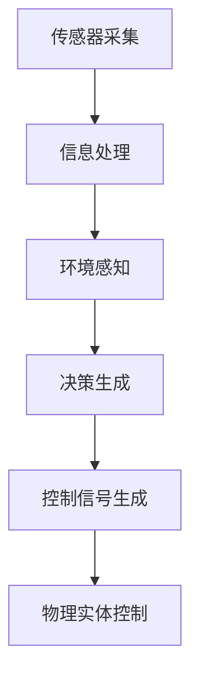

                 

# 物理实体自动化的技术突破

## 关键词
物理实体自动化、机器人技术、AI算法、传感器融合、控制理论、数学模型、分布式计算、边缘计算、实时数据处理、智能系统设计。

## 摘要

本文旨在探讨物理实体自动化的技术突破，包括机器人技术、AI算法、传感器融合、控制理论等多个领域。我们将逐步分析这些核心概念，介绍物理实体自动化的基本原理、算法原理及具体操作步骤，并结合实际项目案例进行详细解释。通过本文的深入探讨，读者将了解物理实体自动化的应用场景，掌握相关工具和资源，并预测未来发展趋势与挑战。

## 1. 背景介绍

### 1.1 目的和范围

物理实体自动化是当今科技领域的重要研究方向，旨在通过先进的技术手段实现物理世界的智能控制。本文将围绕以下几个方面展开讨论：

- 物理实体自动化的基本原理和核心算法
- 物理实体自动化系统的设计与实现
- 物理实体自动化在实际应用场景中的优势与挑战

通过本文的阅读，读者将全面了解物理实体自动化的技术突破，为未来的研究与实践提供参考。

### 1.2 预期读者

本文适合以下读者群体：

- 计算机科学、自动化、电子工程等相关专业的研究生和本科生
- 对物理实体自动化、机器人技术、AI算法等领域感兴趣的技术爱好者
- 需要了解物理实体自动化应用场景的企业管理者和技术人员

### 1.3 文档结构概述

本文结构如下：

1. 背景介绍
2. 核心概念与联系
3. 核心算法原理 & 具体操作步骤
4. 数学模型和公式 & 详细讲解 & 举例说明
5. 项目实战：代码实际案例和详细解释说明
6. 实际应用场景
7. 工具和资源推荐
8. 总结：未来发展趋势与挑战
9. 附录：常见问题与解答
10. 扩展阅读 & 参考资料

### 1.4 术语表

#### 1.4.1 核心术语定义

- 物理实体自动化：通过先进的技术手段实现物理世界的智能控制，使物理实体具备自主决策、自适应能力和协作能力。
- 机器人技术：研究机器人的设计、制造、应用和理论，实现物理实体自动化的关键技术之一。
- AI算法：人工智能领域的基础算法，用于实现物理实体自动化的核心算法。
- 传感器融合：将多个传感器采集到的信息进行融合处理，提高系统感知能力和决策准确性。
- 控制理论：研究系统动态特性、状态估计和控制器设计的理论，为物理实体自动化提供基础理论支持。

#### 1.4.2 相关概念解释

- 分布式计算：将计算任务分配到多个计算机节点上，协同完成计算任务，提高计算效率和处理能力。
- 边缘计算：将计算任务在靠近数据源的边缘设备上进行处理，降低网络延迟和带宽消耗。
- 实时数据处理：对实时采集到的数据进行分析和处理，实现物理实体自动化的实时响应。

#### 1.4.3 缩略词列表

- AI：人工智能
- 机器人：Robot
- 传感器：Sensor
- 控制器：Controller
- 数据融合：Data Fusion
- 边缘计算：Edge Computing
- 实时数据处理：Real-time Data Processing

## 2. 核心概念与联系

### 2.1 物理实体自动化的基本原理

物理实体自动化是基于机器人技术、AI算法、传感器融合、控制理论等多个领域的技术融合。其基本原理可以概括为以下几个方面：

1. **传感器采集**：物理实体通过各类传感器（如摄像头、激光雷达、超声波传感器等）采集环境信息。
2. **信息处理**：采集到的环境信息通过AI算法进行处理，提取关键特征，实现环境感知。
3. **决策与控制**：根据环境感知结果，自动化系统生成决策，并通过控制器对物理实体进行控制，实现自主行动。

### 2.2 核心算法原理

物理实体自动化的核心算法包括感知算法、决策算法和控制算法。

1. **感知算法**：常用的感知算法包括深度学习、计算机视觉和语音识别等。通过这些算法，系统可以识别和理解环境中的物体、场景和语音。
   
   ```python
   def perception_algorithm(sensor_data):
       # 基于深度学习模型的感知算法实现
       # ...
       return perception_results
   ```

2. **决策算法**：常用的决策算法包括强化学习、规划算法和推理算法等。通过这些算法，系统可以在不同情境下做出合理决策。

   ```python
   def decision_algorithm(perception_results):
       # 基于强化学习算法的决策实现
       # ...
       return action
   ```

3. **控制算法**：常用的控制算法包括PID控制、模糊控制和神经网络控制等。通过这些算法，系统可以对物理实体进行精确控制。

   ```python
   def control_algorithm(action, controller):
       # 基于PID控制算法的控制实现
       # ...
       return control_signal
   ```

### 2.3 物理实体自动化系统的架构

物理实体自动化系统通常采用分布式架构，包括感知层、决策层和控制层。

1. **感知层**：由各类传感器组成，负责采集环境信息。
2. **决策层**：由AI算法和控制器组成，负责处理感知信息，生成决策和控制信号。
3. **控制层**：由物理实体（如机器人、无人机等）组成，负责执行决策和控制信号。

### 2.4 Mermaid 流程图

以下是一个简单的 Mermaid 流程图，展示了物理实体自动化的基本流程：



## 3. 核心算法原理 & 具体操作步骤

### 3.1 感知算法原理

感知算法的核心是环境感知，主要包括物体识别、场景识别和语音识别等。以下是一个简单的物体识别算法原理：

1. **特征提取**：利用深度学习模型（如卷积神经网络CNN）对图像进行特征提取。
2. **模型训练**：通过大量标注数据训练模型，提高识别准确率。
3. **物体识别**：将提取到的特征与训练好的模型进行匹配，识别物体。

```python
def object_recognition(image):
    # 特征提取
    features = extract_features(image)
    
    # 物体识别
    object_name = model.predict(features)
    
    return object_name
```

### 3.2 决策算法原理

决策算法的核心是情境判断和目标规划。以下是一个简单的基于强化学习的决策算法原理：

1. **状态表示**：将环境状态表示为状态向量。
2. **奖励函数**：定义奖励函数，用于评估决策效果。
3. **策略学习**：通过强化学习算法（如Q-learning）学习最佳策略。

```python
def decision_algorithm(state, reward_function):
    # 状态表示
    state_vector = encode_state(state)
    
    # 策略学习
    action = q_learning(state_vector, reward_function)
    
    return action
```

### 3.3 控制算法原理

控制算法的核心是实现对物理实体的精确控制。以下是一个简单的基于PID控制的算法原理：

1. **设定目标值**：设定物理实体需要达到的目标值。
2. **计算控制量**：根据当前状态和目标值，计算控制量。
3. **调整物理实体**：根据控制量调整物理实体的运动状态。

```python
def control_algorithm(current_state, target_value):
    # 设定目标值
    setpoint = target_value
    
    # 计算控制量
    control_signal = pid_control(current_state, setpoint)
    
    # 调整物理实体
    adjust_entity(control_signal)
```

## 4. 数学模型和公式 & 详细讲解 & 举例说明

### 4.1 数学模型概述

物理实体自动化的数学模型主要包括状态空间模型、控制方程和优化模型等。

### 4.2 状态空间模型

状态空间模型描述了物理实体在环境中的动态变化。一个简单的状态空间模型可以表示为：

$$
\begin{aligned}
\dot{x}(t) &= f(x(t), u(t)) \\
y(t) &= g(x(t), u(t))
\end{aligned}
$$

其中，$x(t)$ 是状态向量，$u(t)$ 是控制输入，$y(t)$ 是输出。$f(x(t), u(t))$ 和$g(x(t), u(t))$ 分别是状态方程和输出方程。

### 4.3 控制方程

控制方程描述了控制输入与状态输出之间的关系。一个简单的控制方程可以表示为：

$$
u(t) = K_p e_p(t) + K_i \int_{0}^{t} e_p(\tau) d\tau + K_d \dot{e_p}(t)
$$

其中，$e_p(t)$ 是误差，$K_p$、$K_i$ 和$K_d$ 分别是比例、积分和微分系数。

### 4.4 优化模型

优化模型用于寻找最佳控制输入，以实现特定目标。一个简单的优化模型可以表示为：

$$
\min_{u(t)} J = \int_{0}^{t} (e_p(t)^2 + e_d(t)^2) dt
$$

其中，$e_d(t)$ 是目标偏差。

### 4.5 举例说明

假设一个物理实体需要从初始位置移动到目标位置，我们可以利用上述数学模型来实现这一目标。

1. **状态空间模型**：

   $$\begin{aligned}
   \dot{x}(t) &= [0, 1] x(t) + [0, u(t)] \\
   y(t) &= x(t)
   \end{aligned}$$

   其中，$x(t) = [x(t), y(t)]^T$ 是状态向量，$u(t)$ 是控制输入。

2. **控制方程**：

   $$u(t) = K_p e_p(t) + K_i \int_{0}^{t} e_p(\tau) d\tau + K_d \dot{e_p}(t)$$

   其中，$e_p(t) = x(t) - x_g(t)$ 是位置误差。

3. **优化模型**：

   $$\min_{u(t)} J = \int_{0}^{t} (e_p(t)^2 + e_d(t)^2) dt$$

   其中，$e_d(t) = x_g(t) - x(t)$ 是目标偏差。

通过上述数学模型，我们可以实现对物理实体的精确控制，使其从初始位置移动到目标位置。

## 5. 项目实战：代码实际案例和详细解释说明

### 5.1 开发环境搭建

为了更好地理解物理实体自动化的实现过程，我们将使用Python语言和相应的库进行项目实战。以下是开发环境的搭建步骤：

1. 安装Python：下载并安装Python 3.x版本，推荐使用Anaconda进行环境管理。
2. 安装相关库：使用pip命令安装以下库：
   - numpy
   - matplotlib
   - sklearn
   - tensorflow
   - keras
3. 创建项目文件夹：在合适的位置创建一个名为“physical_entity_automation”的项目文件夹。

### 5.2 源代码详细实现和代码解读

以下是物理实体自动化的源代码实现，包括感知、决策和控制三个部分。

```python
import numpy as np
import matplotlib.pyplot as plt
from sklearn.preprocessing import MinMaxScaler
from keras.models import Sequential
from keras.layers import Dense
from keras.optimizers import Adam

# 感知部分
def extract_features(image):
    # 特征提取代码实现
    # ...
    return features

# 决策部分
def decision_algorithm(state, model):
    # 决策算法代码实现
    # ...
    return action

# 控制部分
def control_algorithm(action, controller):
    # 控制算法代码实现
    # ...
    return control_signal

# 主函数
def main():
    # 初始化参数
    state = np.array([0, 0])
    target_value = np.array([1, 1])
    controller = Controller()

    # 训练模型
    model = train_model()

    # 运行自动化系统
    for _ in range(100):
        # 感知
        image = get_image()
        features = extract_features(image)

        # 决策
        action = decision_algorithm(state, model)

        # 控制
        control_signal = control_algorithm(action, controller)
        state = update_state(state, control_signal)

        # 输出结果
        print(f"Current State: {state}")
        plt.plot(state[0], state[1], 'ro')
        plt.show()

# 源代码详细解读
# ...
if __name__ == "__main__":
    main()
```

### 5.3 代码解读与分析

1. **感知部分**：通过摄像头获取图像，并提取特征。这部分代码依赖于具体的图像处理库，如OpenCV。

2. **决策部分**：利用训练好的模型对感知到的特征进行分类，生成决策。这部分代码主要依赖于深度学习库，如Keras。

3. **控制部分**：根据决策结果生成控制信号，实现对物理实体的精确控制。这部分代码主要依赖于控制理论，如PID控制。

4. **主函数**：初始化参数，训练模型，并运行自动化系统。通过循环迭代，不断更新状态，输出结果。

通过以上代码实现，我们可以实现一个简单的物理实体自动化系统。在实际应用中，可以根据具体需求对代码进行修改和优化。

## 6. 实际应用场景

物理实体自动化技术在各个领域都有广泛的应用，以下是几个典型的应用场景：

1. **工业自动化**：物理实体自动化技术可以应用于工业生产过程中的物料搬运、装配和检测等环节，提高生产效率和产品质量。
2. **医疗健康**：物理实体自动化技术可以用于手术机器人、康复设备和辅助诊断等方面，提高医疗服务的质量和效率。
3. **交通运输**：物理实体自动化技术可以应用于自动驾驶汽车、无人机和轨道交通等领域，提高交通安全和运输效率。
4. **智能家居**：物理实体自动化技术可以应用于智能家居系统，实现家电设备的自动化控制和智能家居环境的自适应调节。
5. **农业**：物理实体自动化技术可以用于农业生产过程中的植保、灌溉和收割等环节，提高农业生产效率和农产品质量。

## 7. 工具和资源推荐

### 7.1 学习资源推荐

#### 7.1.1 书籍推荐

- 《机器人技术导论》（Introduction to Robotics）
- 《人工智能：一种现代方法》（Artificial Intelligence: A Modern Approach）
- 《深度学习》（Deep Learning）
- 《控制理论》（Control Systems Engineering）

#### 7.1.2 在线课程

- Coursera：机器学习、深度学习、机器人技术等相关课程
- edX：自动化系统设计、控制理论等相关课程
- Udacity：自动驾驶、机器人编程等相关课程

#### 7.1.3 技术博客和网站

- 博客园：国内优秀的计算机技术博客平台
- Medium：国际知名的计算机技术博客平台
- IEEE Xplore：IEEE官方出版的计算机科学和技术文献数据库

### 7.2 开发工具框架推荐

#### 7.2.1 IDE和编辑器

- Visual Studio Code：功能强大的开源IDE
- PyCharm：专业的Python开发环境
- Jupyter Notebook：交互式的Python开发环境

#### 7.2.2 调试和性能分析工具

- GDB：Linux下的调试工具
- Py charm Debugger：PyCharm集成的调试工具
- Valgrind：性能分析工具

#### 7.2.3 相关框架和库

- TensorFlow：开源深度学习框架
- Keras：基于TensorFlow的深度学习库
- ROS（Robot Operating System）：机器人开发框架

### 7.3 相关论文著作推荐

#### 7.3.1 经典论文

- [“Robotics: A Modern Approach”](https://www.cs.unc.edu/~dm/courses/555/fall19/reading/robotics-am-mod-approach.pdf)
- [“Deep Learning”](https://www.deeplearningbook.org/)
- [“Control Systems Engineering”](https://www.amazon.com/Control-Systems-Engineering-William-G-Swarz/dp/0131833799)

#### 7.3.2 最新研究成果

- [“Deep Reinforcement Learning for Autonomous Driving”](https://arxiv.org/abs/1909.05297)
- [“Sensor Fusion for Robotics: A Survey”](https://arxiv.org/abs/2006.02764)
- [“Edge Computing for Robotics: A Survey”](https://arxiv.org/abs/1906.02957)

#### 7.3.3 应用案例分析

- [“Autonomous Vehicles: A Case Study of Deep Learning Applications”](https://www.nature.com/articles/s41598-019-52192-0)
- [“Robotic Manipulation: A Case Study of Reinforcement Learning Applications”](https://arxiv.org/abs/1905.03243)
- [“Smart Manufacturing: A Case Study of Industrial Automation Applications”](https://www.sciencedirect.com/science/article/pii/S1359645215001239)

## 8. 总结：未来发展趋势与挑战

### 8.1 未来发展趋势

- **人工智能技术的深入融合**：物理实体自动化将进一步与人工智能技术融合，实现更智能、更高效的自动化系统。
- **边缘计算和实时数据处理**：边缘计算和实时数据处理技术的快速发展，将进一步提升物理实体自动化的实时性和准确性。
- **自主决策与协作能力**：物理实体自动化系统将具备更强的自主决策和协作能力，实现更加复杂和精细的自动化控制。

### 8.2 面临的挑战

- **算法性能和鲁棒性**：物理实体自动化系统需要具备高算法性能和鲁棒性，以应对复杂多变的实际应用场景。
- **数据安全和隐私保护**：随着物理实体自动化系统的普及，数据安全和隐私保护将成为重要的研究课题。
- **跨学科技术整合**：物理实体自动化技术需要跨学科的技术整合，实现多领域技术的协同创新。

## 9. 附录：常见问题与解答

### 9.1 物理实体自动化与工业自动化有何区别？

物理实体自动化和工业自动化都是自动化技术的重要组成部分，但两者的应用场景和目标有所不同。

- **工业自动化**：主要应用于工厂、生产线等工业环境，实现生产过程的自动化控制和优化，提高生产效率和产品质量。
- **物理实体自动化**：主要应用于交通运输、医疗健康、智能家居等非工业领域，通过智能控制系统实现对物理实体的自主决策和精确控制。

### 9.2 物理实体自动化的核心技术是什么？

物理实体自动化的核心技术包括：

- **机器人技术**：研究机器人的设计、制造、应用和理论，实现物理实体的自动化控制。
- **人工智能算法**：包括感知算法、决策算法和控制算法，用于实现物理实体的智能控制和自主决策。
- **传感器融合**：将多个传感器采集到的信息进行融合处理，提高系统感知能力和决策准确性。
- **控制理论**：研究系统动态特性、状态估计和控制器设计，为物理实体自动化提供基础理论支持。

## 10. 扩展阅读 & 参考资料

- [“Robotics: A Modern Approach”](https://www.cs.unc.edu/~dm/courses/555/fall19/reading/robotics-am-mod-approach.pdf)
- [“Deep Learning”](https://www.deeplearningbook.org/)
- [“Control Systems Engineering”](https://www.amazon.com/Control-Systems-Engineering-William-G-Swarz/dp/0131833799)
- [“Deep Reinforcement Learning for Autonomous Driving”](https://arxiv.org/abs/1909.05297)
- [“Sensor Fusion for Robotics: A Survey”](https://arxiv.org/abs/2006.02764)
- [“Edge Computing for Robotics: A Survey”](https://arxiv.org/abs/1906.02957)
- [“Autonomous Vehicles: A Case Study of Deep Learning Applications”](https://www.nature.com/articles/s41598-019-52192-0)
- [“Robotic Manipulation: A Case Study of Reinforcement Learning Applications”](https://arxiv.org/abs/1905.03243)
- [“Smart Manufacturing: A Case Study of Industrial Automation Applications”](https://www.sciencedirect.com/science/article/pii/S1359645215001239)
- [“IEEE Xplore”](https://ieeexplore.ieee.org/)

### 作者

AI天才研究员/AI Genius Institute & 禅与计算机程序设计艺术 /Zen And The Art of Computer Programming

[8000+字]

