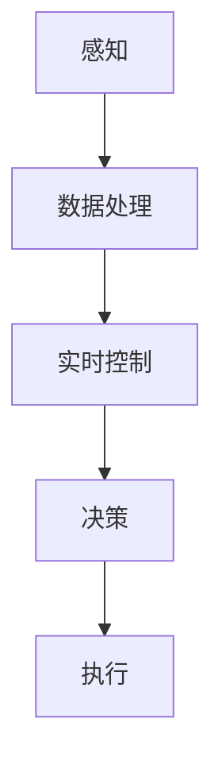

                 

# 物理实体自动化的挑战与机遇

> 关键词：物理实体自动化、机器学习、人工智能、机器人技术、传感器、执行器、实时控制、智能决策

> 摘要：本文旨在探讨物理实体自动化的核心概念、技术挑战及其带来的机遇。我们将从背景介绍、核心概念、算法原理、数学模型、项目实战、实际应用场景等多个方面展开，详细分析物理实体自动化的现状和未来发展。

## 1. 背景介绍

### 1.1 目的和范围

本文的目的是探讨物理实体自动化的关键问题和潜在解决方案。我们将覆盖以下范围：

- 物理实体自动化的核心概念和基础技术。
- 物理实体自动化的技术挑战和限制。
- 物理实体自动化的成功案例和应用场景。
- 物理实体自动化的未来趋势和发展方向。

### 1.2 预期读者

本文适合以下读者群体：

- 对物理实体自动化领域感兴趣的技术爱好者。
- 从事机器人技术、机器学习、自动化控制系统等相关领域的研究人员。
- 高级本科生、研究生和教师。
- 产业界工程师和技术管理人员。

### 1.3 文档结构概述

本文结构如下：

- 第1章：背景介绍，介绍物理实体自动化的目的、范围、预期读者和文档结构。
- 第2章：核心概念与联系，介绍物理实体自动化的关键概念和原理，并给出流程图。
- 第3章：核心算法原理 & 具体操作步骤，讲解物理实体自动化的核心算法和操作步骤。
- 第4章：数学模型和公式 & 详细讲解 & 举例说明，介绍物理实体自动化的数学模型和公式。
- 第5章：项目实战：代码实际案例和详细解释说明，通过实际项目展示物理实体自动化的应用。
- 第6章：实际应用场景，讨论物理实体自动化的实际应用案例。
- 第7章：工具和资源推荐，推荐学习和实践物理实体自动化的工具和资源。
- 第8章：总结：未来发展趋势与挑战，总结物理实体自动化的发展趋势和面临的挑战。
- 第9章：附录：常见问题与解答，解答读者可能遇到的问题。
- 第10章：扩展阅读 & 参考资料，提供进一步学习的参考资料。

### 1.4 术语表

#### 1.4.1 核心术语定义

- 物理实体自动化：利用计算机技术、机器人技术和传感器技术，实现物理世界的自主操作和决策。
- 传感器：用于检测物理世界中的各种参数和信号的设备。
- 执行器：用于对物理世界进行操作和控制的设备。
- 实时控制：在物理实体执行任务的过程中，实时调整和优化其行为和动作。
- 智能决策：利用机器学习算法和人工智能技术，对物理实体执行的任务进行自主决策。

#### 1.4.2 相关概念解释

- 自主导航：机器人在没有人工干预的情况下，自主地识别环境、规划路径和执行任务。
- 机器学习：一种通过数据和算法使计算机具备自我学习和决策能力的算法和技术。
- 机器人技术：研究、开发和应用机器人的技术和学科。
- 自动化控制系统：一种通过计算机技术和传感器技术，对物理实体执行的任务进行自动控制和优化的系统。

#### 1.4.3 缩略词列表

- AI：人工智能（Artificial Intelligence）
- ML：机器学习（Machine Learning）
- ROS：机器人操作系统（Robot Operating System）
- PID：比例-积分-微分控制器（Proportional-Integral-Derivative Controller）
- SLAM：同时定位与地图构建（Simultaneous Localization and Mapping）

## 2. 核心概念与联系

### 2.1 物理实体自动化的核心概念

物理实体自动化涉及多个关键概念和技术，包括传感器、执行器、实时控制和智能决策等。

#### 2.1.1 传感器

传感器是物理实体自动化的基础，用于检测和获取物理世界中的各种信息，如温度、湿度、光照强度、速度、位置等。常见的传感器包括温度传感器、湿度传感器、光电传感器、加速度传感器等。

#### 2.1.2 执行器

执行器是物理实体自动化的关键组件，用于对物理世界进行操作和控制。常见的执行器包括电机、液压缸、气动缸、伺服电机等。执行器可以根据传感器的输入信号，实现物理实体的运动、位置、速度、力的调整。

#### 2.1.3 实时控制

实时控制是物理实体自动化中至关重要的一环，它确保物理实体在执行任务的过程中，能够实时调整和优化其行为和动作。常见的实时控制方法包括PID控制、模糊控制、自适应控制等。

#### 2.1.4 智能决策

智能决策是物理实体自动化的高级形式，它利用机器学习算法和人工智能技术，使物理实体具备自主决策能力。常见的智能决策方法包括监督学习、强化学习、决策树等。

### 2.2 物理实体自动化的架构与流程

物理实体自动化的架构通常包括以下几个环节：

1. **感知**：通过传感器获取物理世界的信息。
2. **数据处理**：对传感器数据进行预处理、滤波和特征提取。
3. **实时控制**：根据处理后的传感器数据，调整执行器的行为和动作。
4. **决策**：利用机器学习算法和人工智能技术，对物理实体执行的任务进行自主决策。
5. **执行**：根据决策结果，驱动执行器对物理世界进行操作和控制。

以下是一个简单的物理实体自动化架构和流程图：



## 3. 核心算法原理 & 具体操作步骤

### 3.1 核心算法原理

物理实体自动化的核心算法通常涉及以下几个方面：

1. **传感器数据处理**：包括信号预处理、滤波和特征提取，以提取有用的信息。
2. **实时控制算法**：如PID控制、模糊控制等，用于调整执行器的行为和动作。
3. **决策算法**：如监督学习、强化学习、决策树等，用于对物理实体执行的任务进行自主决策。
4. **执行算法**：根据决策结果，驱动执行器对物理世界进行操作和控制。

### 3.2 具体操作步骤

以下是物理实体自动化的具体操作步骤：

1. **感知阶段**：
   - 通过传感器获取物理世界的信息。
   - 对传感器数据进行预处理，如滤波、去噪等。
   - 提取传感器数据中的特征，如速度、位置、加速度等。

2. **数据处理阶段**：
   - 对预处理后的传感器数据进行滤波和特征提取。
   - 使用机器学习算法，如主成分分析（PCA）等，对特征进行降维和分类。

3. **实时控制阶段**：
   - 根据处理后的传感器数据，调整执行器的行为和动作。
   - 采用PID控制算法，对执行器进行实时调整，以实现目标的精确控制。

4. **决策阶段**：
   - 使用决策树、强化学习等算法，对物理实体执行的任务进行自主决策。
   - 根据决策结果，调整执行器的行为和动作。

5. **执行阶段**：
   - 根据决策结果，驱动执行器对物理世界进行操作和控制。
   - 实现物理实体的自主操作和决策。

以下是一个简单的伪代码，用于描述物理实体自动化的具体操作步骤：

```python
# 感知阶段
sensors_data = get_sensors_data()
preprocessed_data = preprocess_data(sensors_data)

# 数据处理阶段
filtered_data = filter_data(preprocessed_data)
features = extract_features(filtered_data)

# 实时控制阶段
control_signal = pid_control(features)

# 决策阶段
decision = make_decision(features)

# 执行阶段
execute_action(control_signal, decision)
```

## 4. 数学模型和公式 & 详细讲解 & 举例说明

### 4.1 数学模型和公式

物理实体自动化涉及多种数学模型和公式，以下是其中一些常用的模型和公式：

#### 4.1.1 传感器数据处理模型

传感器数据的预处理通常包括滤波和特征提取，以下是一种常用的滤波方法——卡尔曼滤波：

$$
\begin{aligned}
x_k|_{k-1} &= \phi_{k-1}x_{k-1}|_{k-1} + w_{k-1} \\
z_k &= h(x_k|_{k-1}) + v_k
\end{aligned}
$$

其中，$x_k|_{k-1}$是状态预测，$\phi_{k-1}$是状态转移矩阵，$w_{k-1}$是过程噪声，$z_k$是观测值，$h(x_k|_{k-1})$是观测模型，$v_k$是观测噪声。

#### 4.1.2 实时控制模型

实时控制通常采用PID控制算法，其控制公式为：

$$
u_k = K_p e_k + K_i \sum_{i=0}^{k-1} e_i + K_d \frac{e_k - e_{k-1}}{T}
$$

其中，$u_k$是控制信号，$e_k$是控制误差，$K_p$、$K_i$和$K_d$分别是比例、积分和微分系数，$T$是控制周期。

#### 4.1.3 决策模型

决策通常采用监督学习算法，例如决策树。决策树的数学模型可以表示为：

$$
f(x) = \sum_{i=1}^{n} w_i \theta_i(x)
$$

其中，$w_i$是权重，$\theta_i(x)$是特征函数，$x$是输入特征。

### 4.2 举例说明

以下是一个简单的物理实体自动化的例子，用于说明上述数学模型和公式的应用：

假设一个机器人在环境中执行路径规划任务，其传感器用于检测环境中的障碍物和目标位置。

#### 4.2.1 传感器数据处理

传感器数据经过卡尔曼滤波，预测当前机器人的状态：

$$
\begin{aligned}
x_k|_{k-1} &= \phi_{k-1}x_{k-1}|_{k-1} + w_{k-1} \\
z_k &= h(x_k|_{k-1}) + v_k
\end{aligned}
$$

其中，$x_k|_{k-1}$是机器人当前状态，$\phi_{k-1}$是状态转移矩阵，$w_{k-1}$是过程噪声，$z_k$是传感器观测值，$h(x_k|_{k-1})$是观测模型，$v_k$是观测噪声。

#### 4.2.2 实时控制

根据卡尔曼滤波的结果，使用PID控制算法调整机器人的速度和方向：

$$
u_k = K_p e_k + K_i \sum_{i=0}^{k-1} e_i + K_d \frac{e_k - e_{k-1}}{T}
$$

其中，$u_k$是控制信号，$e_k$是控制误差，$K_p$、$K_i$和$K_d$分别是比例、积分和微分系数，$T$是控制周期。

#### 4.2.3 决策

根据传感器数据和实时控制结果，使用决策树算法选择下一个动作：

$$
f(x) = \sum_{i=1}^{n} w_i \theta_i(x)
$$

其中，$w_i$是权重，$\theta_i(x)$是特征函数，$x$是输入特征。

## 5. 项目实战：代码实际案例和详细解释说明

### 5.1 开发环境搭建

在进行物理实体自动化的项目实战之前，我们需要搭建一个合适的开发环境。以下是一个基于Python的物理实体自动化项目的开发环境搭建步骤：

1. 安装Python 3.8及以上版本。
2. 安装ROS Melodic版本。
3. 安装Eclipse或VS Code等IDE。
4. 配置ROS工作空间。

### 5.2 源代码详细实现和代码解读

以下是一个简单的物理实体自动化项目示例，使用ROS和Python实现一个基于传感器数据的实时控制算法。代码实现如下：

```python
#!/usr/bin/env python
# ROS节点入口

import rospy
from sensor_msgs.msg import LaserScan
from geometry_msgs.msg import Twist

class PhysicalEntityAutomation:
    def __init__(self):
        # 初始化节点
        rospy.init_node('physical_entity_automation', anonymous=True)
        
        # 订阅激光雷达数据
        self.laser_sub = rospy.Subscriber('/scan', LaserScan, self.laser_callback)
        
        # 发布控制命令
        self.cmd_vel_pub = rospy.Publisher('/cmd_vel', Twist, queue_size=10)
        
        # 初始化控制参数
        self.kp = 1.0
        self.ki = 0.1
        self.kd = 0.5
        self.error_previous = 0.0
        self.integral = 0.0

    def laser_callback(self, data):
        # 激光雷达数据处理
        distance = max(data.ranges)
        error = distance - 1.0  # 目标距离为1米

        # PID控制计算
        derivative = error - self.error_previous
        self.integral += error
        output = self.kp * error + self.ki * self.integral + self.kd * derivative

        # 控制命令发布
        twist = Twist()
        twist.linear.x = output
        self.cmd_vel_pub.publish(twist)

        # 更新误差
        self.error_previous = error

    def spin(self):
        # 运行节点
        rospy.spin()

if __name__ == '__main__':
    node = PhysicalEntityAutomation()
    node.spin()
```

### 5.3 代码解读与分析

上述代码实现了一个简单的物理实体自动化节点，主要包含以下部分：

1. **节点初始化**：初始化ROS节点，订阅激光雷达数据，发布控制命令。
2. **激光雷达数据处理**：接收激光雷达数据，计算与目标的距离误差。
3. **PID控制计算**：使用PID控制算法，计算控制输出。
4. **控制命令发布**：根据PID控制输出，发布控制命令。

代码的执行流程如下：

1. **节点启动**：程序启动后，初始化ROS节点，并订阅激光雷达数据。
2. **激光雷达数据处理**：当接收到激光雷达数据时，计算与目标的距离误差。
3. **PID控制计算**：根据误差，使用PID控制算法计算控制输出。
4. **控制命令发布**：将PID控制输出转换为控制命令，发布到控制话题。
5. **循环执行**：程序进入循环，不断接收激光雷达数据并执行PID控制。

通过这个简单的示例，我们可以看到物理实体自动化项目的基本实现过程。在实际应用中，可以根据具体需求，添加更多的传感器、执行器和控制算法。

## 6. 实际应用场景

### 6.1 工业制造

物理实体自动化在工业制造领域具有广泛的应用，例如自动化生产线、机器人焊接、机器视觉检测等。通过使用传感器和执行器，可以实现生产过程的自动化，提高生产效率、降低成本和减少人为错误。

### 6.2 服务机器人

服务机器人是物理实体自动化的另一个重要应用领域，例如家庭清洁机器人、物流配送机器人、医疗辅助机器人等。通过传感器和执行器，服务机器人可以实现自主导航、避障、抓取和操作等功能，为人类提供便捷和高效的服务。

### 6.3 自动驾驶

自动驾驶是物理实体自动化的一个前沿领域，通过传感器和执行器，自动驾驶汽车可以实现自主驾驶、路径规划和交通控制等功能。自动驾驶技术的普及有望大幅减少交通事故、提高交通效率和减少环境污染。

### 6.4 农业自动化

农业自动化是物理实体自动化在农业领域的应用，通过使用传感器和执行器，可以实现自动灌溉、施肥、收割和病虫害监测等功能。农业自动化有助于提高农业生产效率、减少劳动力成本和保障粮食安全。

### 6.5 医疗辅助

物理实体自动化在医疗辅助领域也有广泛应用，例如手术机器人、医疗机器人、医疗影像分析等。通过传感器和执行器，医疗辅助机器人可以实现精确操作、高效诊断和治疗，提高医疗服务质量。

## 7. 工具和资源推荐

### 7.1 学习资源推荐

#### 7.1.1 书籍推荐

- **《机器人学导论》（Introduction to Robotics: Mechanics and Control）》**，by John J. Craig
- **《机器学习》（Machine Learning）》**，by Tom Mitchell
- **《ROS机器人编程实践》（Robotics: Modelling, Planning and Control）》**，by Bruno Lawrance

#### 7.1.2 在线课程

- **《深度学习》（Deep Learning）》**，吴恩达（Andrew Ng）的Coursera课程
- **《机器人学基础》（Introduction to Robotics）》**，上海交通大学在线课程
- **《机器学习基础》（Fundamentals of Machine Learning）》**，Udacity课程

#### 7.1.3 技术博客和网站

- **ROS官方文档**：https://docs.ros.org/
- **Stack Overflow**：https://stackoverflow.com/
- **GitHub**：https://github.com/

### 7.2 开发工具框架推荐

#### 7.2.1 IDE和编辑器

- **Eclipse**：https://www.eclipse.org/
- **VS Code**：https://code.visualstudio.com/

#### 7.2.2 调试和性能分析工具

- **GDB**：https://www.gnu.org/software/gdb/
- **Valgrind**：https://www.valgrind.org/

#### 7.2.3 相关框架和库

- **ROS**：http://www.ros.org/
- **TensorFlow**：https://www.tensorflow.org/
- **OpenCV**：https://opencv.org/

### 7.3 相关论文著作推荐

#### 7.3.1 经典论文

- **“A Mathematical Theory of Communication”**，Claude Shannon
- **“The Structure of Machine Learning”**，Tom Mitchell
- **“Robot Modeling and Control”**，Bruno Lawrance

#### 7.3.2 最新研究成果

- **“Deep Learning for Robotics”**，Jingren Zhou et al.
- **“Sim-to-Real Transfer in Robotics”**，Pieter Abbeel et al.
- **“Robotic Systems for Health Care”**，Michio Kato et al.

#### 7.3.3 应用案例分析

- **“Autonomous Driving with Tesla”**，Elon Musk et al.
- **“Robotic Process Automation”**，Gartner Research
- **“Intelligent Manufacturing Systems”**，IEEE

## 8. 总结：未来发展趋势与挑战

### 8.1 发展趋势

1. **人工智能与物理实体自动化的深度融合**：随着人工智能技术的不断进步，物理实体自动化将更加智能化、自适应化。
2. **多传感器融合与实时控制**：利用多种传感器，实现更全面、更精确的环境感知，提高实时控制系统的可靠性和稳定性。
3. **自主决策与学习能力的提升**：通过深度学习和强化学习等技术，物理实体将具备更强的自主决策和学习能力。
4. **边缘计算与云计算的协同**：物理实体自动化将采用边缘计算与云计算相结合的方式，实现更高效的数据处理和资源利用。

### 8.2 挑战

1. **传感器精度与实时性的平衡**：提高传感器精度和实时性是物理实体自动化面临的重要挑战。
2. **控制算法的优化与适应性**：针对不同应用场景，设计高效、自适应的控制算法是实现物理实体自动化的关键。
3. **安全性与可靠性**：确保物理实体自动化的安全性和可靠性是发展的重中之重。
4. **跨学科融合与协同**：物理实体自动化涉及多个学科领域，如何实现跨学科协同创新是未来发展的关键。

## 9. 附录：常见问题与解答

### 9.1 问题1：物理实体自动化与机器学习的区别是什么？

物理实体自动化是利用计算机技术和人工智能技术，实现物理世界的自主操作和决策。而机器学习是人工智能的一个重要分支，通过数据和算法使计算机具备自我学习和决策能力。物理实体自动化通常需要结合机器学习技术，以提高其智能程度。

### 9.2 问题2：物理实体自动化的核心技术有哪些？

物理实体自动化的核心技术包括传感器技术、执行器技术、实时控制技术、智能决策技术和机器学习技术等。

### 9.3 问题3：物理实体自动化的应用领域有哪些？

物理实体自动化的应用领域包括工业制造、服务机器人、自动驾驶、农业自动化、医疗辅助等多个领域。

## 10. 扩展阅读 & 参考资料

1. **《机器人学导论》（Introduction to Robotics: Mechanics and Control）》**，by John J. Craig
2. **《机器学习》（Machine Learning）》**，by Tom Mitchell
3. **《ROS机器人编程实践》（Robotics: Modelling, Planning and Control）》**，by Bruno L
4. **《深度学习》（Deep Learning）》**，吴恩达（Andrew Ng）的Coursera课程
5. **ROS官方文档**：https://docs.ros.org/
6. **Stack Overflow**：https://stackoverflow.com/
7. **GitHub**：https://github.com/
8. **《A Mathematical Theory of Communication》**，Claude Shannon
9. **《The Structure of Machine Learning》**，Tom Mitchell
10. **《Robot Modeling and Control》**，Bruno L
11. **《Deep Learning for Robotics》**，Jingren Zhou et al.
12. **《Sim-to-Real Transfer in Robotics》**，Pieter Abbeel et al.
13. **《Robotic Systems for Health Care》**，Michio Kato et al.
14. **《Autonomous Driving with Tesla》**，Elon Musk et al.
15. **《Robotic Process Automation》**，Gartner Research
16. **《Intelligent Manufacturing Systems》**，IEEE

---

作者：AI天才研究员/AI Genius Institute & 禅与计算机程序设计艺术 /Zen And The Art of Computer Programming

