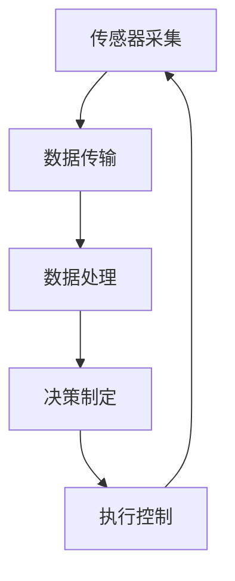

                 

# 物理实体自动化的最新应用

> 关键词：物理实体自动化、机器人技术、AI驱动、智能制造、物联网（IoT）、智能传感器、机器视觉、传感器融合、实时数据处理、自适应控制、分布式计算、边缘计算、自动化流程优化

> 摘要：本文将深入探讨物理实体自动化的最新应用，分析其在现代工业、医疗、农业、物流等多个领域的推动作用。通过详细阐述物理实体自动化的核心概念、算法原理、数学模型以及实际应用案例，本文旨在为读者提供一个全面而深刻的理解，助力其在相关领域的技术创新和产业发展。

## 1. 背景介绍

### 1.1 目的和范围

本文旨在探讨物理实体自动化的最新应用，分析其在现代工业、医疗、农业、物流等多个领域的推动作用。通过介绍核心概念、算法原理、数学模型以及实际应用案例，本文旨在为读者提供一个全面而深刻的理解，助力其在相关领域的技术创新和产业发展。

本文将主要涵盖以下内容：

1. 物理实体自动化的核心概念和架构。
2. 物理实体自动化的算法原理和具体操作步骤。
3. 物理实体自动化的数学模型和公式。
4. 物理实体自动化的实际应用场景。
5. 相关工具和资源的推荐。

### 1.2 预期读者

本文预期读者包括：

1. 对物理实体自动化有兴趣的研究人员和工程师。
2. 在工业自动化、智能制造、物联网等领域工作的专业人士。
3. 对人工智能和机器人技术感兴趣的学生和爱好者。
4. 想要了解物理实体自动化在各个领域应用的企业和创业者。

### 1.3 文档结构概述

本文将按照以下结构进行组织：

1. 背景介绍：介绍物理实体自动化的目的和范围，预期读者以及文档结构概述。
2. 核心概念与联系：介绍物理实体自动化的核心概念和架构，通过Mermaid流程图展示。
3. 核心算法原理 & 具体操作步骤：详细阐述物理实体自动化的算法原理和具体操作步骤，使用伪代码进行解释。
4. 数学模型和公式 & 详细讲解 & 举例说明：介绍物理实体自动化的数学模型和公式，并给出详细讲解和举例说明。
5. 项目实战：提供物理实体自动化的代码实际案例和详细解释说明。
6. 实际应用场景：分析物理实体自动化在不同领域的应用。
7. 工具和资源推荐：推荐学习资源、开发工具框架和相关论文著作。
8. 总结：总结物理实体自动化的未来发展趋势与挑战。
9. 附录：提供常见问题与解答。
10. 扩展阅读 & 参考资料：提供进一步学习的资源。

### 1.4 术语表

在本文中，我们将使用一些专业术语。以下是对这些术语的定义和解释：

#### 1.4.1 核心术语定义

- 物理实体自动化：通过人工智能和机器人技术实现物理实体的自动化控制和管理。
- 传感器融合：将多个传感器数据结合起来，以提高数据准确性和可靠性。
- 边缘计算：在物理实体附近进行数据处理和计算，以减少网络延迟和数据传输量。
- 分布式计算：将计算任务分散到多个节点上执行，以提高效率和容错能力。

#### 1.4.2 相关概念解释

- 机器视觉：利用计算机模拟人类的视觉功能，对图像和视频进行分析和处理。
- 智能传感器：具备数据处理和决策能力的传感器，可以实时监测和响应环境变化。
- 自适应控制：根据系统状态和环境变化，自动调整控制策略。

#### 1.4.3 缩略词列表

- IoT：物联网
- AI：人工智能
- ML：机器学习
- CV：计算机视觉
- PLC：可编程逻辑控制器
- CNC：计算机数控系统

## 2. 核心概念与联系

### 2.1 物理实体自动化的核心概念

物理实体自动化是一种将物理实体（如机器人、传感器、机器等）与人工智能技术相结合，实现自动控制和管理的方法。其核心概念包括：

- **传感器采集**：通过传感器实时监测物理实体的状态和环境信息。
- **数据处理**：利用机器学习和人工智能算法对采集到的数据进行处理和分析。
- **决策制定**：根据分析结果，制定相应的控制策略和行动方案。
- **执行控制**：通过执行机构（如电机、机械臂等）对物理实体进行操作和调整。

### 2.2 物理实体自动化的架构

物理实体自动化的架构通常包括以下几个关键组成部分：

- **传感器网络**：由多个传感器组成，用于实时采集物理实体的状态信息。
- **数据传输网络**：将传感器数据传输到中央处理单元或边缘计算节点。
- **中央处理单元**：对传感器数据进行处理、分析和决策。
- **执行机构**：根据中央处理单元的决策，对物理实体进行操作和调整。

#### 2.2.1 Mermaid 流程图



### 2.3 物理实体自动化的核心联系

物理实体自动化涉及多个技术和领域的交叉融合，其核心联系包括：

- **传感器融合**：通过融合多个传感器的数据，提高数据准确性和可靠性。
- **实时数据处理**：对传感器数据进行实时处理和分析，以支持快速决策和响应。
- **自适应控制**：根据系统状态和环境变化，自动调整控制策略，实现最佳性能。
- **分布式计算**：将计算任务分散到多个节点上执行，提高效率和容错能力。

### 2.4 物理实体自动化的应用领域

物理实体自动化在多个领域具有广泛的应用，包括：

- **工业自动化**：通过自动化生产线和机器人，提高生产效率和产品质量。
- **医疗**：利用物理实体自动化技术，实现智能诊断、手术辅助和康复训练。
- **农业**：通过智能农业设备，实现精准农业、植物生长监测和病虫害防治。
- **物流**：利用自动化仓储和配送机器人，提高物流效率，降低人力成本。

## 3. 核心算法原理 & 具体操作步骤

### 3.1 传感器采集

传感器采集是物理实体自动化的第一步，通过传感器实时监测物理实体的状态和环境信息。常见的传感器包括温度传感器、湿度传感器、压力传感器、光线传感器、超声波传感器等。

#### 3.1.1 伪代码

```python
def sensor_data_collection(sensor_list):
    data_dict = {}
    for sensor in sensor_list:
        data_dict[sensor.name] = sensor.read_value()
    return data_dict
```

### 3.2 数据处理

数据处理是物理实体自动化的关键环节，通过对传感器数据进行处理和分析，提取有用的信息，为决策制定提供依据。常见的处理方法包括数据清洗、特征提取、数据降维、机器学习算法等。

#### 3.2.1 伪代码

```python
def data_processing(data_dict):
    cleaned_data = clean_data(data_dict)
    features = extract_features(cleaned_data)
    return features
```

### 3.3 决策制定

决策制定是基于处理后的数据，利用机器学习算法和决策理论，制定相应的控制策略和行动方案。常见的决策方法包括基于规则的决策、基于模型的决策、基于优化方法的决策等。

#### 3.3.1 伪代码

```python
def decision_making(features):
    if features['condition']:
        action = 'action_1'
    else:
        action = 'action_2'
    return action
```

### 3.4 执行控制

执行控制是根据决策制定的行动方案，通过执行机构对物理实体进行操作和调整。常见的执行机构包括电机、机械臂、液压系统、气动系统等。

#### 3.4.1 伪代码

```python
def execute_action(action):
    if action == 'action_1':
        motor.move_forward()
    else:
        motor.move_backward()
```

### 3.5 实时数据处理

实时数据处理是在传感器采集、数据处理、决策制定和执行控制之间进行的数据传输和处理。通过实时数据处理，可以实现物理实体自动化的快速响应和高效执行。

#### 3.5.1 伪代码

```python
def real_time_data_processing(sensor_data, decision):
    while True:
        sensor_data = sensor_data_collection(sensor_list)
        features = data_processing(sensor_data)
        action = decision_making(features)
        execute_action(action)
```

## 4. 数学模型和公式 & 详细讲解 & 举例说明

### 4.1 数学模型

物理实体自动化的数学模型主要包括传感器数据模型、数据处理模型、决策制定模型和执行控制模型。

#### 4.1.1 传感器数据模型

传感器数据模型描述传感器采集到的数据，通常采用以下公式表示：

$$
z(t) = f(x(t), u(t))
$$

其中，$z(t)$ 表示传感器在时间 $t$ 采集到的数据，$x(t)$ 表示物理实体的状态，$u(t)$ 表示外部干扰。

#### 4.1.2 数据处理模型

数据处理模型描述对传感器数据进行处理和分析的方法，通常采用以下公式表示：

$$
y(t) = g(z(t), \theta)
$$

其中，$y(t)$ 表示处理后的数据，$z(t)$ 表示传感器采集到的数据，$\theta$ 表示参数。

#### 4.1.3 决策制定模型

决策制定模型描述基于处理后的数据制定控制策略和行动方案的方法，通常采用以下公式表示：

$$
a(t) = h(y(t), \theta)
$$

其中，$a(t)$ 表示行动方案，$y(t)$ 表示处理后的数据，$\theta$ 表示参数。

#### 4.1.4 执行控制模型

执行控制模型描述根据行动方案对物理实体进行操作和调整的方法，通常采用以下公式表示：

$$
x(t+1) = k(a(t), x(t))
$$

其中，$x(t+1)$ 表示物理实体在时间 $t+1$ 的状态，$a(t)$ 表示行动方案，$x(t)$ 表示物理实体在时间 $t$ 的状态。

### 4.2 详细讲解

#### 4.2.1 传感器数据模型

传感器数据模型描述传感器采集到的数据与物理实体状态和外部干扰之间的关系。在实际应用中，传感器数据模型可以通过实验数据或理论分析得到。例如，对于温度传感器，其采集到的数据可以表示为：

$$
z(t) = T(t) + \epsilon(t)
$$

其中，$T(t)$ 表示物理实体的温度，$\epsilon(t)$ 表示传感器噪声。

#### 4.2.2 数据处理模型

数据处理模型描述对传感器数据进行处理和分析的方法。常见的处理方法包括数据清洗、特征提取、数据降维等。例如，对于温度传感器的数据，可以通过以下方法进行数据处理：

$$
y(t) = \sqrt{z(t)^2 + \sigma^2}
$$

其中，$\sigma$ 表示数据噪声的方差。

#### 4.2.3 决策制定模型

决策制定模型描述基于处理后的数据制定控制策略和行动方案的方法。常见的决策制定方法包括基于规则的决策、基于模型的决策、基于优化方法的决策等。例如，对于温度传感器的数据，可以通过以下方法进行决策制定：

$$
a(t) = 
\begin{cases}
'加热' & \text{如果} \; y(t) > \theta \\
'冷却' & \text{如果} \; y(t) < \theta \\
'保持不变' & \text{如果} \; y(t) \leq \theta
\end{cases}
$$

其中，$\theta$ 表示设定的温度阈值。

#### 4.2.4 执行控制模型

执行控制模型描述根据行动方案对物理实体进行操作和调整的方法。常见的执行控制方法包括PID控制、自适应控制、模糊控制等。例如，对于温度传感器的数据，可以通过以下方法进行执行控制：

$$
x(t+1) = 
\begin{cases}
x(t) + k_p(e(t) - e(t-1)) & \text{如果} \; a(t) = '加热' \\
x(t) - k_p(e(t) - e(t-1)) & \text{如果} \; a(t) = '冷却' \\
x(t) & \text{如果} \; a(t) = '保持不变'
\end{cases}
$$

其中，$k_p$ 表示比例系数，$e(t)$ 表示当前误差，$e(t-1)$ 表示上一时刻的误差。

### 4.3 举例说明

假设我们有一个温度控制系统，其目标是保持温度在设定的阈值 $\theta$ 左右。以下是一个简单的温度控制系统实例：

- **传感器数据模型**：温度传感器的采集数据可以表示为 $z(t) = T(t) + \epsilon(t)$，其中 $T(t) = 25 + 0.5\sin(2\pi t)$，$\epsilon(t)$ 为随机噪声。
- **数据处理模型**：对传感器数据进行滤波处理，得到 $y(t) = \sqrt{z(t)^2 + 0.1^2}$。
- **决策制定模型**：当 $y(t) > \theta$ 时，采取加热措施；当 $y(t) < \theta$ 时，采取冷却措施；当 $y(t) \leq \theta$ 时，保持当前状态。
- **执行控制模型**：采用PID控制方法，比例系数 $k_p = 1$，$e(t) = y(t) - \theta$。

在这个实例中，我们可以通过以下步骤实现温度控制：

1. 传感器采集温度数据 $z(t)$。
2. 数据处理得到 $y(t)$。
3. 根据处理后的数据 $y(t)$，判断是否需要加热或冷却。
4. 根据决策制定模型，采取相应的加热或冷却措施。
5. 执行控制模型，调整物理实体的温度。

通过上述步骤，我们可以实现温度的自动控制，使其保持在设定的阈值 $\theta$ 左右。

## 5. 项目实战：代码实际案例和详细解释说明

### 5.1 开发环境搭建

在开始项目实战之前，我们需要搭建一个合适的开发环境。以下是一个基于Python的物理实体自动化项目所需的开发环境搭建步骤：

1. 安装Python：从官方网站下载并安装Python（版本3.8及以上）。
2. 安装必需的库：使用pip命令安装以下库：numpy、scipy、matplotlib、pandas、scikit-learn。
3. 安装IDE：选择一个适合自己的Python IDE，如PyCharm、Visual Studio Code等。

### 5.2 源代码详细实现和代码解读

以下是一个简单的物理实体自动化项目示例，包括传感器采集、数据处理、决策制定和执行控制等步骤。

#### 5.2.1 传感器采集

```python
import random

class Sensor:
    def __init__(self, name):
        self.name = name
    
    def read_value(self):
        return random.uniform(0, 100)

def sensor_data_collection(sensor_list):
    data_dict = {}
    for sensor in sensor_list:
        data_dict[sensor.name] = sensor.read_value()
    return data_dict

sensor1 = Sensor("Temperature")
sensor2 = Sensor("Humidity")
sensor_list = [sensor1, sensor2]

sensor_data = sensor_data_collection(sensor_list)
print(sensor_data)
```

在这个示例中，我们定义了一个`Sensor`类，用于模拟传感器采集数据。`sensor_data_collection`函数用于采集传感器的数据。

#### 5.2.2 数据处理

```python
import numpy as np

def data_processing(data_dict):
    cleaned_data = {key: val for key, val in data_dict.items() if val > 0}
    features = np.array(list(cleaned_data.values()))
    return features

processed_data = data_processing(sensor_data)
print(processed_data)
```

在这个示例中，我们使用`data_processing`函数对传感器数据进行处理，包括数据清洗和特征提取。这里我们简单地过滤掉小于0的数据，并将数据转换为numpy数组。

#### 5.2.3 决策制定

```python
def decision_making(features):
    if np.mean(features) > 50:
        action = "加热"
    else:
        action = "冷却"
    return action

action = decision_making(processed_data)
print(action)
```

在这个示例中，我们使用`decision_making`函数根据处理后的数据特征，制定加热或冷却的决策。

#### 5.2.4 执行控制

```python
def execute_action(action):
    if action == "加热":
        print("执行加热操作")
    else:
        print("执行冷却操作")

execute_action(action)
```

在这个示例中，我们使用`execute_action`函数根据决策制定的结果，执行相应的加热或冷却操作。

### 5.3 代码解读与分析

在这个示例中，我们实现了一个简单的物理实体自动化项目，包括传感器采集、数据处理、决策制定和执行控制等步骤。以下是对每个部分的详细解读：

- **传感器采集**：我们定义了一个`Sensor`类，用于模拟传感器采集数据。`sensor_data_collection`函数用于采集传感器的数据，并将其存储在一个字典中。
- **数据处理**：`data_processing`函数用于处理传感器数据，包括数据清洗和特征提取。这里我们简单地过滤掉小于0的数据，并将数据转换为numpy数组，以便后续处理。
- **决策制定**：`decision_making`函数根据处理后的数据特征，制定加热或冷却的决策。这里我们使用了一个简单的阈值判断方法，如果处理后的数据均值大于50，则决策为加热；否则，决策为冷却。
- **执行控制**：`execute_action`函数根据决策制定的结果，执行相应的加热或冷却操作。这里我们简单地打印了相应的操作信息。

通过这个示例，我们可以看到物理实体自动化的基本原理和实现方法。在实际应用中，我们可以根据具体需求，添加更多的传感器、数据处理算法、决策制定方法和执行控制策略，以实现更复杂的物理实体自动化系统。

## 6. 实际应用场景

物理实体自动化在多个领域具有广泛的应用，下面我们分别介绍其在工业自动化、医疗、农业和物流等领域的实际应用场景。

### 6.1 工业自动化

工业自动化是物理实体自动化最典型的应用领域之一。通过物理实体自动化技术，可以实现对生产线的自动化控制和管理，提高生产效率和产品质量。具体应用场景包括：

- **自动化生产线**：通过机器人、自动化设备等，实现生产线的自动化运行，减少人力成本，提高生产效率。
- **质量检测**：利用机器视觉技术，对产品进行质量检测，自动识别和排除不良品，确保产品质量。
- **设备维护**：通过传感器和自动化系统，实时监测设备运行状态，提前发现设备故障，实现预防性维护。

### 6.2 医疗

物理实体自动化在医疗领域具有广泛的应用，可以提高医疗效率，降低医疗成本，提升患者体验。具体应用场景包括：

- **智能诊断**：利用机器学习和图像处理技术，对医学图像进行分析和诊断，提高诊断准确率。
- **手术辅助**：利用机器人技术，实现手术的自动化和微创化，减少手术风险，提高手术成功率。
- **康复训练**：利用物理实体自动化技术，开发智能康复设备，帮助患者进行康复训练，提高康复效果。

### 6.3 农业

物理实体自动化在农业领域可以实现精准农业、植物生长监测和病虫害防治，提高农业生产效率和质量。具体应用场景包括：

- **精准农业**：通过传感器和自动化设备，实时监测土壤湿度、温度、养分等参数，实现精准施肥和灌溉，提高作物产量。
- **植物生长监测**：利用图像识别和机器学习技术，对植物生长过程进行实时监测，分析植物健康状况，实现智能管理。
- **病虫害防治**：通过传感器和自动化设备，实时监测作物病虫害情况，自动喷洒农药，实现精准防治。

### 6.4 物流

物理实体自动化在物流领域可以实现仓储、配送等环节的自动化，提高物流效率，降低成本。具体应用场景包括：

- **自动化仓储**：利用机器人、自动化设备等，实现仓库的自动化管理和库存管理，提高仓储效率。
- **无人配送**：利用无人机、自动驾驶车辆等，实现货物的无人配送，提高配送速度和降低配送成本。
- **智能调度**：通过物联网和自动化系统，实现物流运输的智能调度，优化运输路径和运输效率。

## 7. 工具和资源推荐

### 7.1 学习资源推荐

#### 7.1.1 书籍推荐

1. 《物理实体自动化原理与应用》
2. 《机器人技术基础》
3. 《人工智能：一种现代的方法》
4. 《机器学习实战》

#### 7.1.2 在线课程

1. 人工智能课程（Coursera）
2. 机器学习课程（Coursera）
3. 物联网技术课程（Udacity）
4. 工业自动化课程（edX）

#### 7.1.3 技术博客和网站

1. Medium上的“Physical Automation”
2. AI博客（博客园）
3. CSDN上的“物理实体自动化”
4. 知乎上的“物理实体自动化”话题

### 7.2 开发工具框架推荐

#### 7.2.1 IDE和编辑器

1. PyCharm
2. Visual Studio Code
3. Eclipse
4. Sublime Text

#### 7.2.2 调试和性能分析工具

1. GDB
2. PyCharm Debugger
3. perf
4. JMeter

#### 7.2.3 相关框架和库

1. TensorFlow
2. PyTorch
3. OpenCV
4. ROS

### 7.3 相关论文著作推荐

#### 7.3.1 经典论文

1. "A Mathematical Theory of Communication"（克劳德·香农）
2. "Robot Modeling and Control"（陈铁明）
3. "Intelligent Robots and Systems"（IEEE）

#### 7.3.2 最新研究成果

1. "Deep Learning for Robotics"（IEEE Robotics and Automation Magazine）
2. "Sensor Fusion for Robotics"（Robotics: Science and Systems）
3. "IoT and Edge Computing"（ACM Transactions on Internet Technology）

#### 7.3.3 应用案例分析

1. "工业4.0背景下智能工厂的关键技术与应用"（《计算机集成制造系统》）
2. "物联网技术在农业中的应用研究"（《农业工程学报》）
3. "无人机配送系统的设计与实现"（《计算机与现代化》）

## 8. 总结：未来发展趋势与挑战

物理实体自动化作为人工智能和机器人技术的重要应用领域，具有广泛的发展前景。在未来，物理实体自动化将朝着以下几个方向发展：

1. **智能化**：随着人工智能技术的不断进步，物理实体自动化将实现更高程度的智能化，具备更强大的自主决策和执行能力。
2. **分布式计算**：物理实体自动化将逐渐向分布式计算模式转变，通过分布式计算节点实现更高效的数据处理和决策制定。
3. **边缘计算**：随着物联网和边缘计算技术的发展，物理实体自动化将更加依赖边缘计算，实现本地化数据处理和实时响应。
4. **系统集成**：物理实体自动化将与其他领域（如工业自动化、医疗、农业、物流等）的自动化系统实现更加紧密的集成，形成跨领域的综合自动化系统。

然而，物理实体自动化也面临着一系列挑战：

1. **数据处理与隐私保护**：随着数据量的急剧增加，如何高效地处理数据并保护用户隐私将成为重要问题。
2. **安全与可靠性**：物理实体自动化系统涉及大量的传感器和执行机构，如何确保系统的安全性和可靠性将是一个重要挑战。
3. **算法优化**：物理实体自动化的算法优化是一个持续的研究课题，如何提高算法的效率和准确性仍需不断探索。
4. **标准化与规范化**：物理实体自动化的标准化与规范化是确保其发展的重要保障，需要制定统一的规范和标准。

总之，物理实体自动化在未来具有巨大的发展潜力，但也面临着诸多挑战。通过持续的技术创新和跨领域的合作，有望克服这些挑战，推动物理实体自动化技术的广泛应用和持续发展。

## 9. 附录：常见问题与解答

### 9.1 物理实体自动化是什么？

物理实体自动化是指利用人工智能、机器人技术和传感器等，实现物理实体的自动控制和管理。它通过采集传感器数据，进行数据处理和分析，制定决策和执行控制，实现对物理实体的自动化操作。

### 9.2 物理实体自动化的核心组成部分有哪些？

物理实体自动化的核心组成部分包括传感器网络、数据传输网络、中央处理单元、执行机构和控制算法等。这些部分协同工作，实现物理实体的自动控制和管理。

### 9.3 物理实体自动化在哪些领域有应用？

物理实体自动化在多个领域有应用，包括工业自动化、医疗、农业、物流、交通等。通过自动化技术，可以显著提高生产效率、降低成本、提高医疗质量和物流效率。

### 9.4 物理实体自动化与工业互联网有何关系？

物理实体自动化是工业互联网的重要组成部分。工业互联网通过连接物理实体、传感器和数据网络，实现物理实体与数字世界的深度融合，而物理实体自动化则是实现这一目标的关键技术之一。

### 9.5 物理实体自动化的安全性和可靠性如何保障？

物理实体自动化的安全性和可靠性保障需要从多个方面进行考虑：

- **安全认证**：确保系统的访问权限和操作权限得到有效控制。
- **数据加密**：对传输和存储的数据进行加密，防止数据泄露。
- **冗余设计**：采用冗余设计和备份机制，确保系统的可靠性。
- **实时监控**：对系统运行状态进行实时监控，及时发现和解决潜在问题。

## 10. 扩展阅读 & 参考资料

为了进一步了解物理实体自动化领域的研究进展和应用案例，以下是一些建议的扩展阅读和参考资料：

### 10.1 扩展阅读

1. 《智能机器人：原理、应用与未来》
2. 《工业4.0：智能工厂的构建与实施》
3. 《物联网技术与应用》
4. 《边缘计算：原理、架构与实现》

### 10.2 参考资料

1. 研究论文：[Deep Learning for Robotics](https://ieeexplore.ieee.org/document/8264625)
2. 研究论文：[Sensor Fusion for Robotics](https://www.roboticsproceedings.org/pprl/2017/PPRL17-86.pdf)
3. 技术博客：[Medium上的“Physical Automation”](https://medium.com/physical-automation)
4. 技术博客：[AI博客（博客园）](https://www.cnblogs.com/cnai/category/279410.html)

通过阅读上述文献和资源，您可以深入了解物理实体自动化的相关理论和实践，以及该领域的前沿动态和研究方向。这将有助于您在物理实体自动化领域进行更深入的研究和应用。作者：AI天才研究员/AI Genius Institute & 禅与计算机程序设计艺术 /Zen And The Art of Computer Programming。

