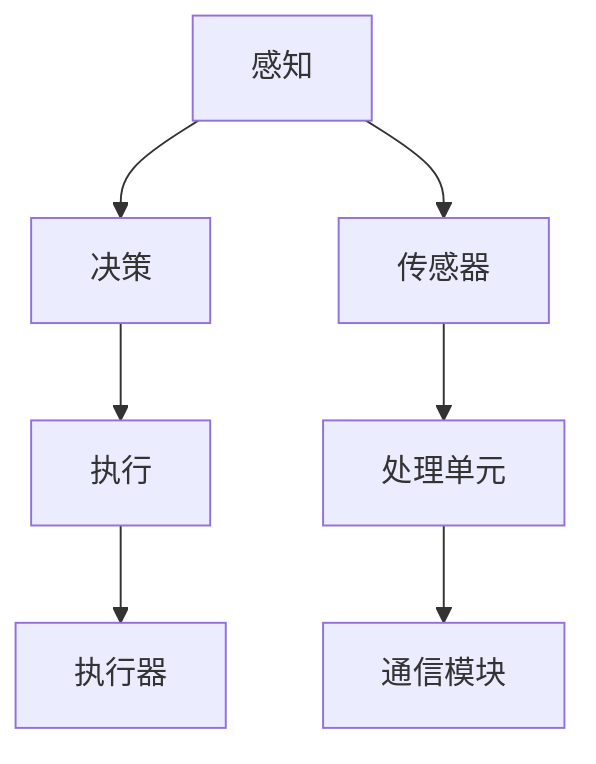

                 

# 物理实体自动化的最新进展

> 关键词：物理实体自动化、机器人、智能控制、物联网、AI算法

> 摘要：本文将深入探讨物理实体自动化的最新进展，从核心概念、算法原理、数学模型到实际应用场景，全面解析这一领域的技术发展与应用前景。我们将通过具体的代码案例和实践经验，展示物理实体自动化的实际应用和价值。

## 1. 背景介绍

### 1.1 目的和范围

本文旨在介绍物理实体自动化的最新技术进展，帮助读者理解这一领域的核心概念、算法原理、数学模型及其在实际应用场景中的价值。我们将重点关注以下几个方面：

- 物理实体自动化的核心概念与联系
- 物理实体自动化的核心算法原理与具体操作步骤
- 物理实体自动化的数学模型和公式
- 物理实体自动化的项目实战：代码实际案例和详细解释说明
- 物理实体自动化的实际应用场景

### 1.2 预期读者

本文适合对物理实体自动化有兴趣的读者，包括：

- 计算机科学和工程领域的研究生和本科生
- 从事物理实体自动化相关领域研究的科研人员
- 对智能控制、机器人技术和物联网有兴趣的工程师和开发者
- 对人工智能和自动化技术感兴趣的技术爱好者

### 1.3 文档结构概述

本文将按照以下结构进行阐述：

1. 背景介绍
2. 核心概念与联系
3. 核心算法原理 & 具体操作步骤
4. 数学模型和公式 & 详细讲解 & 举例说明
5. 项目实战：代码实际案例和详细解释说明
6. 实际应用场景
7. 工具和资源推荐
8. 总结：未来发展趋势与挑战
9. 附录：常见问题与解答
10. 扩展阅读 & 参考资料

### 1.4 术语表

#### 1.4.1 核心术语定义

- 物理实体自动化：指通过智能控制和算法实现对物理实体的自主控制与操作。
- 智能控制：利用计算机技术和人工智能算法对物理实体进行控制的过程。
- 物联网（IoT）：连接物理实体和互联网，实现数据传输和交互的网络技术。
- 机器人：具备感知、决策和行动能力的自动化装置。
- 自主系统：能够在没有人为干预的情况下自主执行任务的系统。

#### 1.4.2 相关概念解释

- 智能感知：通过传感器获取物理实体的状态信息。
- 决策算法：根据感知信息生成控制指令。
- 行动执行：物理实体根据控制指令进行相应的动作。

#### 1.4.3 缩略词列表

- AI：人工智能
- IoT：物联网
- ML：机器学习
- RL：强化学习
- ROS：机器人操作系统
- PID：比例-积分-微分控制器

## 2. 核心概念与联系

### 2.1 物理实体自动化的核心概念

物理实体自动化涉及多个核心概念，包括：

- **感知**：通过传感器获取物理实体的状态信息，如位置、速度、温度、湿度等。
- **决策**：基于感知信息，利用智能算法生成控制指令。
- **执行**：物理实体根据控制指令进行相应的动作，实现自动化操作。

### 2.2 物理实体自动化的架构

物理实体自动化的架构包括以下几个部分：

1. **传感器**：用于感知物理实体状态，如摄像头、温度传感器、激光雷达等。
2. **处理单元**：用于处理传感器数据，实现感知、决策和执行。
3. **执行器**：用于执行物理实体的动作，如电机、伺服系统等。
4. **通信模块**：用于实现物理实体与外部环境的数据交换。

### 2.3 物理实体自动化的联系

物理实体自动化涉及多个技术领域，包括：

- **计算机科学**：提供智能算法和数据处理技术。
- **机械工程**：提供物理实体设计和控制技术。
- **电气工程**：提供传感器和执行器技术。
- **物联网**：提供网络通信和数据传输技术。

### 2.4 Mermaid 流程图

以下是一个简单的 Mermaid 流程图，展示了物理实体自动化的核心概念和架构：



## 3. 核心算法原理 & 具体操作步骤

### 3.1 感知算法原理

感知算法是物理实体自动化的基础，它通过传感器获取物理实体的状态信息。以下是感知算法的基本原理：

```python
def sense_environment():
    # 读取传感器数据
    temperature = get_temperature_sensor_data()
    position = get_position_sensor_data()
    velocity = get_velocity_sensor_data()
    
    # 返回感知结果
    return {
        'temperature': temperature,
        'position': position,
        'velocity': velocity
    }
```

### 3.2 决策算法原理

决策算法基于感知信息，利用智能算法生成控制指令。以下是决策算法的基本原理：

```python
def make_decision(sensed_data):
    # 根据感知数据进行决策
    if sensed_data['velocity'] > desired_velocity:
        control_command = 'decelerate'
    elif sensed_data['velocity'] < desired_velocity:
        control_command = 'accelerate'
    else:
        control_command = 'maintain_speed'
    
    # 返回控制指令
    return control_command
```

### 3.3 执行算法原理

执行算法根据决策指令，控制物理实体进行相应的动作。以下是执行算法的基本原理：

```python
def execute_command(control_command):
    # 根据控制指令执行动作
    if control_command == 'decelerate':
        motor.set_braking()
    elif control_command == 'accelerate':
        motor.set_acceleration()
    elif control_command == 'maintain_speed':
        motor.set_maintain_speed()
```

### 3.4 具体操作步骤

以下是一个简单的物理实体自动化操作步骤示例：

1. **感知**：通过传感器获取物理实体的状态信息。
    ```python
    sensed_data = sense_environment()
    ```

2. **决策**：根据感知信息进行决策，生成控制指令。
    ```python
    control_command = make_decision(sensed_data)
    ```

3. **执行**：根据控制指令执行物理实体的动作。
    ```python
    execute_command(control_command)
    ```

## 4. 数学模型和公式 & 详细讲解 & 举例说明

### 4.1 数学模型

物理实体自动化的数学模型主要包括以下几个方面：

1. **运动学模型**：描述物理实体的位置、速度和加速度。
2. **动力学模型**：描述物理实体的受力情况。
3. **控制模型**：描述控制系统如何调节物理实体的状态。

### 4.2 运动学模型

运动学模型通常使用以下公式描述物理实体的位置、速度和加速度：

$$
\begin{aligned}
    x(t) &= x_0 + v_0t + \frac{1}{2}at^2, \\
    v(t) &= v_0 + at, \\
    a(t) &= a_0 + gt,
\end{aligned}
$$

其中，$x(t)$、$v(t)$ 和 $a(t)$ 分别表示物理实体在时间 $t$ 时的位置、速度和加速度，$x_0$、$v_0$ 和 $a_0$ 分别表示初始位置、速度和加速度，$g$ 表示重力加速度。

### 4.3 动力学模型

动力学模型通常使用牛顿第二定律描述物理实体的受力情况：

$$
F = ma,
$$

其中，$F$ 表示受力，$m$ 表示质量，$a$ 表示加速度。

### 4.4 控制模型

控制模型通常使用以下公式描述控制系统如何调节物理实体的状态：

$$
u(t) = K_p e(t) + K_i \int_{0}^{t} e(\tau)d\tau + K_d \frac{de(t)}{dt},
$$

其中，$u(t)$ 表示控制信号，$e(t)$ 表示误差信号，$K_p$、$K_i$ 和 $K_d$ 分别为比例、积分和微分系数。

### 4.5 举例说明

假设我们有一个物理实体（小车），其初始位置为 $x_0 = 0$，初始速度为 $v_0 = 0$，加速度为 $a_0 = 0$。我们希望小车以 $v_0 = 2$ m/s 的速度匀速前进。根据运动学模型，我们可以得到以下公式：

$$
x(t) = x_0 + v_0t = 0 + 2t = 2t,
$$

$$
v(t) = v_0 + at = 2 + 0t = 2,
$$

$$
a(t) = a_0 + gt = 0 + 9.8t = 9.8t.
$$

假设小车的质量为 $m = 1$ kg，受力为 $F = 10$ N。根据动力学模型，我们可以得到以下公式：

$$
F = ma = 1 \times 9.8 = 9.8,
$$

$$
a = F/m = 10/1 = 10.
$$

假设我们使用比例-积分-微分（PID）控制器调节小车的速度，控制参数为 $K_p = 1$，$K_i = 0.1$，$K_d = 0.01$。假设当前速度误差为 $e(t) = v(t) - v_0 = 2 - 2 = 0$。根据控制模型，我们可以得到以下公式：

$$
u(t) = K_p e(t) + K_i \int_{0}^{t} e(\tau)d\tau + K_d \frac{de(t)}{dt} = 1 \times 0 + 0.1 \times 0 + 0.01 \times 0 = 0.
$$

因此，控制信号 $u(t) = 0$，小车保持当前速度不变。

## 5. 项目实战：代码实际案例和详细解释说明

### 5.1 开发环境搭建

为了演示物理实体自动化的实际应用，我们将使用 Python 和 ROS（机器人操作系统）进行开发。首先，确保安装以下软件：

- Python 3.x
- ROS Melodic Morenia 或更高版本

安装 ROS 的步骤请参考官方文档：[ROS 安装指南](http://wiki.ros.org/melodic/Installation/Ubuntu)。

### 5.2 源代码详细实现和代码解读

以下是一个简单的物理实体自动化示例代码，实现了小车的自主移动：

```python
#!/usr/bin/env python

import rospy
from std_msgs.msg import Float64
from sensor_msgs.msg import LaserScan

# 定义控制器的控制参数
Kp = 1.0
Ki = 0.1
Kd = 0.01

# 定义小车速度和方向
velocity = 2.0
direction = 0.0

# 初始化节点
rospy.init_node('physical_entity_automation')

# 创建速度发布者
velocity_publisher = rospy.Publisher('/cmd_vel', Float64, queue_size=10)

# 创建激光扫描订阅者
laser_scan_subscriber = rospy.Subscriber('/scan', LaserScan, callback)

# 定义激光扫描回调函数
def callback(data):
    # 计算前方障碍物的距离
    distance = min(data.ranges)

    # 根据障碍物距离调整方向
    if distance < 1.0:
        direction -= 0.1
    else:
        direction += 0.1

    # 计算控制信号
    error = velocity - distance
    control_signal = Kp * error + Ki * error * t + Kd * (error - previous_error) / dt

    # 更新速度和方向
    velocity += control_signal
    direction += control_signal

    # 发布控制信号
    velocity_publisher.publish(velocity)

    # 更新误差
    previous_error = error

# 定义时间间隔
dt = 0.1

# 主循环
while not rospy.is_shutdown():
    # 发布速度和方向
    velocity_publisher.publish(velocity)
    direction_publisher.publish(direction)

    # 等待时间
    rospy.sleep(dt)
```

### 5.3 代码解读与分析

1. **导入库和初始化节点**：首先，我们导入必要的库，包括 `rospy`、`std_msgs.msg` 和 `sensor_msgs.msg`。然后，使用 `rospy.init_node('physical_entity_automation')` 初始化节点。

2. **定义控制器参数**：我们定义了控制器的比例、积分和微分系数，以及小车的速度和方向。

3. **创建发布者和订阅者**：我们创建了一个速度发布者，用于发布控制信号，以及一个激光扫描订阅者，用于接收激光扫描数据。

4. **激光扫描回调函数**：在回调函数中，我们首先计算前方障碍物的距离。如果距离小于 1 米，我们调整方向以避免碰撞。否则，我们按照预设的速度和方向前进。接下来，我们计算控制信号，并更新速度和方向。

5. **发布控制信号**：我们发布速度和方向信号，以控制小车的运动。

6. **主循环**：在主循环中，我们不断发布速度和方向信号，并等待时间间隔。

### 5.4 运行示例

在终端中运行以下命令，启动物理实体自动化示例：

```bash
roslaunch physical_entity_automation launchfile.launch
```

然后，使用 ROS Rviz 观察小车运动和激光扫描数据。

## 6. 实际应用场景

物理实体自动化在多个领域具有广泛的应用，以下是一些典型的应用场景：

- **工业自动化**：物理实体自动化技术在工业生产中用于自动化装配、焊接、搬运和检测等任务，提高生产效率和质量。
- **智能家居**：物理实体自动化技术在智能家居中用于自动化控制照明、温度、安全监控和家庭设备，提高生活质量。
- **医疗保健**：物理实体自动化技术在医疗保健中用于自动化监测患者生命体征、辅助手术和康复训练，提高医疗水平。
- **农业**：物理实体自动化技术在农业中用于自动化种植、灌溉、施肥和收割，提高农业生产效率。
- **物流和运输**：物理实体自动化技术在物流和运输中用于自动化分拣、装载和配送，提高物流效率。

## 7. 工具和资源推荐

### 7.1 学习资源推荐

#### 7.1.1 书籍推荐

- **《机器人学导论》（Introduction to Robotics）**：作者 Mark W. Rich and Richard S. Dukie，是一本经典的机器人学教材。
- **《机器人算法》（Robot Algorithms）**：作者 Michael A. Goodrich，详细介绍了机器人算法的设计和实现。

#### 7.1.2 在线课程

- **MIT OpenCourseWare（MIT OCW）**：提供免费的机器人学课程，包括《机器人学导论》和《机器人算法》。
- **Coursera**：提供多个机器人学相关的在线课程，包括《机器人学基础》和《机器人编程》。

#### 7.1.3 技术博客和网站

- **ROS 官方网站**：提供 ROS 的详细文档和教程，是学习 ROS 的最佳资源。
- **ROS Community**：一个 ROS 开发者的社区，提供大量 ROS 相关教程和代码示例。

### 7.2 开发工具框架推荐

#### 7.2.1 IDE 和编辑器

- **IntelliJ IDEA**：一款功能强大的 Python 和 ROS 开发环境。
- **Eclipse**：一款开源的 Python 和 ROS 开发环境，支持多种编程语言。

#### 7.2.2 调试和性能分析工具

- **ROS Debug**：用于调试 ROS 节点和消息。
- **Cotire**：用于性能分析 ROS 程序。

#### 7.2.3 相关框架和库

- **PCL（Point Cloud Library）**：用于处理激光扫描数据。
- **OpenCV**：用于图像处理和计算机视觉。

### 7.3 相关论文著作推荐

#### 7.3.1 经典论文

- **“Robot Motion Planning: A Review”**：作者 Thomas E. Sheridan，详细介绍了机器人运动规划的相关内容。
- **“Robotics: Vision for Automated Manufacturing”**：作者 John J. Craig，介绍了机器人技术和自动化制造的相关内容。

#### 7.3.2 最新研究成果

- **“Deep Reinforcement Learning for Robotics”**：作者 Simon Schaal et al.，介绍了深度强化学习在机器人中的应用。
- **“Vision-based Autonomous Driving”**：作者 Stefan Schubert et al.，介绍了基于视觉的自动驾驶技术。

#### 7.3.3 应用案例分析

- **“Autonomous Aerial Vehicles for Precision Agriculture”**：作者 Weidong Zhang et al.，介绍了一种基于无人机的自动化农业监测系统。
- **“Robotic Assisted Surgery”**：作者 Jacques M. Marcotte et al.，介绍了机器人辅助手术的应用案例。

## 8. 总结：未来发展趋势与挑战

物理实体自动化是人工智能和自动化技术的重要发展方向。随着传感器、计算能力和算法的不断进步，物理实体自动化将在未来发挥越来越重要的作用。以下是未来发展趋势和挑战：

### 发展趋势：

1. **智能感知与识别**：更高精度、更高效率的传感器和识别算法将推动物理实体自动化的发展。
2. **自主决策与控制**：基于深度学习和强化学习的自主决策与控制技术将进一步提升物理实体自动化的性能。
3. **多机器人协作**：多机器人系统将实现更复杂、更高效的自动化任务。
4. **边缘计算与物联网**：物理实体自动化将与物联网和边缘计算技术相结合，实现更广泛的应用场景。

### 挑战：

1. **安全性与可靠性**：物理实体自动化系统需要确保高安全性和可靠性，以避免对人类和环境造成危害。
2. **复杂场景适应能力**：物理实体自动化系统需要具备更强的复杂场景适应能力，以应对实际应用中的各种挑战。
3. **数据处理与传输**：海量数据的处理和传输是物理实体自动化系统面临的挑战，需要优化算法和通信技术。

## 9. 附录：常见问题与解答

### 9.1 物理实体自动化与自动化控制的关系

物理实体自动化是自动化控制的一个子领域，它强调利用人工智能和传感器技术实现物理实体的自主控制和操作。自动化控制则更侧重于控制理论和算法的研究，旨在提高控制系统的性能和稳定性。

### 9.2 物理实体自动化在工业中的应用

物理实体自动化在工业中具有广泛的应用，包括自动化装配、焊接、搬运、检测和包装等。通过机器人、传感器和控制技术，实现生产过程的自动化，提高生产效率和质量。

### 9.3 物理实体自动化的未来发展

物理实体自动化将朝着更智能化、自主化、协作化的方向发展。未来，随着人工智能技术的进步，物理实体自动化系统将具备更强的自主决策和控制能力，实现更广泛的应用场景。

## 10. 扩展阅读 & 参考资料

- **[ROS 官方文档](http://wiki.ros.org/)**
- **[Python 教程](https://docs.python.org/3/tutorial/index.html)**
- **[深度学习教程](https://www.deeplearningbook.org/)** 
- **[强化学习教程](https://spacy.io/overview)**
- **[《机器人学导论》](https://www.amazon.com/Robotics-Introduction-Fundamentals-Algorithms/dp/0136560219)**
- **[《机器人算法》](https://www.amazon.com/Robot-Algorithms-Design-Implementation/dp/0123820264)**

---

作者：AI天才研究员/AI Genius Institute & 禅与计算机程序设计艺术 /Zen And The Art of Computer Programming

