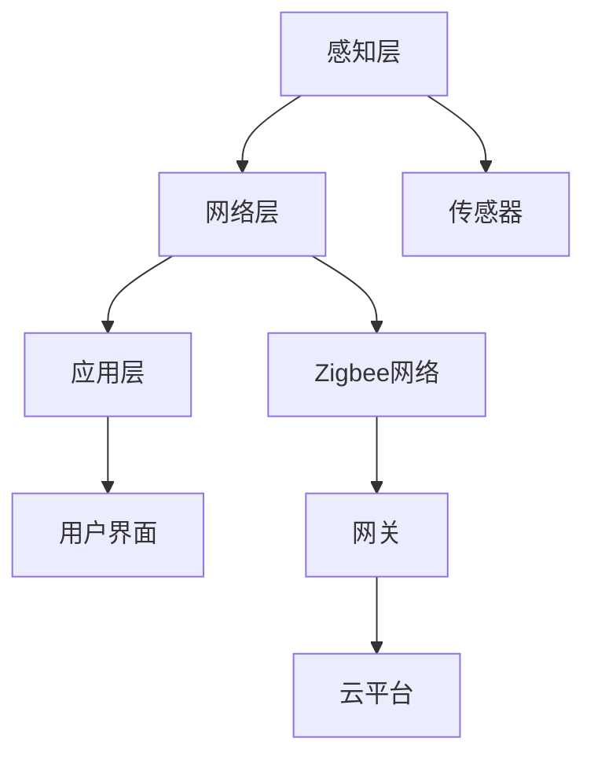

                 

# 物联网（IoT）技术和各种传感器设备的集成：Zigbee传感器在物联网中的应用

> **关键词：** 物联网（IoT）、Zigbee传感器、传感器集成、无线通信、数据传输、物联网架构

> **摘要：** 本文将深入探讨物联网（IoT）技术的核心组件之一——传感器设备的集成，特别是Zigbee传感器在物联网中的应用。文章将逐步分析物联网的架构、Zigbee传感器的技术原理及其在物联网中的集成方式，并最终通过实际项目案例展示其应用价值。

## 1. 背景介绍

### 1.1 目的和范围

本文旨在为读者提供一个全面的物联网（IoT）技术和传感器集成的理解框架，特别是聚焦于Zigbee传感器。文章将首先介绍物联网的基本概念和架构，然后详细探讨Zigbee传感器的工作原理和集成方法。随后，通过具体实例和项目实战，我们将展示Zigbee传感器在物联网应用中的实际效果和挑战。本文的目标读者是物联网领域的技术人员、开发者以及对物联网应用有兴趣的专业人士。

### 1.2 预期读者

本文适合具备一定编程基础的物联网领域技术人员和开发者阅读。预期读者应当熟悉基本的计算机网络和通信原理，并对物联网技术有一定的了解。此外，对传感器技术有兴趣的读者也将从本文中获得丰富的知识和启发。

### 1.3 文档结构概述

本文结构如下：

1. **背景介绍**：介绍物联网和Zigbee传感器的基本概念。
2. **核心概念与联系**：通过Mermaid流程图展示物联网架构。
3. **核心算法原理 & 具体操作步骤**：详细讲解Zigbee传感器的工作原理。
4. **数学模型和公式 & 详细讲解 & 举例说明**：介绍传感器数据的处理方法。
5. **项目实战：代码实际案例和详细解释说明**：展示一个完整的物联网项目。
6. **实际应用场景**：讨论Zigbee传感器在不同领域的应用。
7. **工具和资源推荐**：推荐学习资源和开发工具。
8. **总结：未来发展趋势与挑战**：展望物联网和Zigbee技术的发展趋势。
9. **附录：常见问题与解答**：解答读者可能遇到的问题。
10. **扩展阅读 & 参考资料**：提供进一步的阅读材料和资源。

### 1.4 术语表

#### 1.4.1 核心术语定义

- **物联网（IoT）**：物联网是指通过互联网连接各种物理设备，实现智能化的信息交换和通信。
- **传感器**：能够检测或测量某个物理量并将其转换为电信号的设备。
- **Zigbee传感器**：基于Zigbee协议的无线传感器，主要用于数据采集和传输。

#### 1.4.2 相关概念解释

- **无线通信**：通过无线电波实现数据传输的通信方式。
- **数据传输**：在计算机网络中，将数据从一个节点传送到另一个节点的过程。
- **物联网架构**：物联网系统的基础结构，包括感知层、网络层和应用层。

#### 1.4.3 缩略词列表

- **IoT**：Internet of Things（物联网）
- **Zigbee**：ZigBee，一种无线通信协议。
- **M2M**：Machine-to-Machine，指机器与机器之间的通信。

## 2. 核心概念与联系

物联网技术是当今信息技术发展的一个重要方向，它将各种物理设备互联起来，形成一个庞大的网络系统。物联网的架构一般包括三个主要层次：感知层、网络层和应用层。感知层负责数据的采集，网络层负责数据传输，应用层则实现数据的处理和业务逻辑。

### 2.1 物联网架构

下面是物联网架构的Mermaid流程图：



在图中，感知层包括各种传感器（E），这些传感器负责收集环境数据，如温度、湿度、光照等。网络层（F）使用Zigbee协议将这些数据传输到网关（G），网关再将数据上传到云平台（H），最终在应用层（C）进行处理和展示。

### 2.2 Zigbee传感器的工作原理

Zigbee传感器是一种基于Zigbee协议的无线传感器网络（WSN）设备。Zigbee协议是一种低功耗、低速率的无线通信协议，特别适合于物联网应用中的短距离通信。Zigbee传感器的工作原理如下：

1. **数据采集**：传感器（E）收集环境数据，如温度、湿度等。
2. **数据传输**：传感器通过Zigbee模块将数据传输到附近的协调器节点。
3. **路由和传输**：协调器节点将数据路由到网关（G），然后通过网关传输到云平台（H）。
4. **数据处理**：云平台对传输过来的数据进行处理和分析，提供相应的业务逻辑。

### 2.3 Zigbee传感器在物联网中的集成方式

Zigbee传感器在物联网中的集成可以分为以下几个步骤：

1. **传感器部署**：在需要监控的区域部署Zigbee传感器。
2. **网络构建**：将传感器连接到协调器节点，构建Zigbee网络。
3. **数据收集**：传感器通过Zigbee网络收集数据，并传输到网关。
4. **数据上传**：网关将数据上传到云平台。
5. **数据处理**：云平台对数据进行处理和分析，提供相应的业务逻辑。

通过以上步骤，Zigbee传感器可以有效地集成到物联网系统中，实现数据的实时采集和远程监控。

## 3. 核心算法原理 & 具体操作步骤

在物联网系统中，Zigbee传感器主要用于数据采集和传输。下面将详细讲解Zigbee传感器的工作原理和具体操作步骤。

### 3.1 数据采集

Zigbee传感器通过内置的传感器模块采集环境数据。以温度传感器为例，其工作原理如下：

1. **感知温度**：传感器通过内置的热敏电阻感知环境温度。
2. **信号转换**：热敏电阻的电阻值随温度变化，传感器将其转换为电信号。
3. **信号处理**：传感器对电信号进行处理，生成数字信号。

### 3.2 数据传输

采集到的数据通过Zigbee模块传输到协调器节点。数据传输的具体步骤如下：

1. **数据打包**：传感器将采集到的数据打包成数据包。
2. **数据发送**：传感器通过Zigbee模块将数据发送到附近的协调器节点。
3. **数据接收**：协调器节点接收数据包，并进行解包处理。

### 3.3 路由和传输

协调器节点将数据路由到网关，并通过网关传输到云平台。路由和传输的具体步骤如下：

1. **数据路由**：协调器节点根据路由算法将数据路由到最近的网关。
2. **数据传输**：网关将数据上传到云平台。
3. **数据存储**：云平台存储上传的数据，并进行后续处理。

### 3.4 数据处理

云平台对传输过来的数据进行处理和分析，提供相应的业务逻辑。数据处理的具体步骤如下：

1. **数据解析**：云平台解析接收到的数据，提取有用信息。
2. **数据存储**：云平台将解析后的数据存储在数据库中。
3. **数据分析**：云平台对存储的数据进行分析，提供业务逻辑支持。

### 3.5 伪代码示例

以下是Zigbee传感器数据传输的伪代码示例：

```python
# 传感器数据采集
def collect_data(sensor):
    temperature = sensor.read_temperature()
    return temperature

# 数据传输
def transmit_data(sensor, coordinator):
    temperature = collect_data(sensor)
    packet = create_packet(temperature)
    coordinator.send(packet)

# 数据处理
def process_data(packet, gateway):
    temperature = extract_data(packet)
    store_data(temperature)
    analyze_data(temperature)

# 主程序
def main():
    sensor = create_sensor()
    coordinator = create_coordinator()
    gateway = create_gateway()
    packet = transmit_data(sensor, coordinator)
    process_data(packet, gateway)

# 执行主程序
main()
```

通过以上步骤，我们可以实现Zigbee传感器的数据采集、传输和处理。在实际应用中，还需要考虑数据加密、错误检测和纠正等高级功能，以提高系统的可靠性和安全性。

## 4. 数学模型和公式 & 详细讲解 & 举例说明

在物联网系统中，传感器采集的数据往往需要进行处理和分析，以便提取有价值的信息。这一过程通常涉及数学模型和公式。以下将介绍一些常用的数学模型和公式，并给出具体示例。

### 4.1 温度传感器的数据模型

温度传感器的数据模型可以表示为：

\[ T(t) = T_0 + a \cdot (1 - e^{-kt}) \]

其中，\( T(t) \) 是在时间 \( t \) 的温度，\( T_0 \) 是初始温度，\( a \) 是温度系数，\( k \) 是衰减系数。

#### 示例：

假设一个温度传感器在初始时刻 \( t = 0 \) 的温度为 \( T_0 = 25^\circ C \)，温度系数 \( a = 0.1 \)，衰减系数 \( k = 0.05 \)。则在时间 \( t = 10 \) 秒时，温度可以计算为：

\[ T(10) = 25 + 0.1 \cdot (1 - e^{-0.05 \cdot 10}) \approx 25.07^\circ C \]

### 4.2 湿度传感器的数据模型

湿度传感器的数据模型可以表示为：

\[ H(t) = H_0 + b \cdot (1 - \cos(\omega t)) \]

其中，\( H(t) \) 是在时间 \( t \) 的湿度，\( H_0 \) 是初始湿度，\( b \) 是湿度系数，\( \omega \) 是角频率。

#### 示例：

假设一个湿度传感器在初始时刻 \( t = 0 \) 的湿度为 \( H_0 = 60\% \)，湿度系数 \( b = 0.2 \)，角频率 \( \omega = \frac{\pi}{4} \)。则在时间 \( t = 5 \) 秒时，湿度可以计算为：

\[ H(5) = 60 + 0.2 \cdot (1 - \cos(\frac{\pi}{4} \cdot 5)) \approx 61.06\% \]

### 4.3 数据处理与滤波

在物联网系统中，传感器数据往往受到噪声干扰，因此需要通过滤波算法进行数据预处理。常用的滤波算法包括均值滤波、中值滤波和卡尔曼滤波。

#### 均值滤波：

均值滤波可以表示为：

\[ x_{filtered} = \frac{1}{N} \sum_{i=1}^{N} x_i \]

其中，\( x_i \) 是第 \( i \) 个采样值，\( N \) 是采样点数。

#### 示例：

假设一个传感器在连续 5 个时间点的温度采样值为 \[ 24.5, 24.6, 24.7, 24.4, 24.5 \]，则滤波后的温度可以计算为：

\[ x_{filtered} = \frac{1}{5} (24.5 + 24.6 + 24.7 + 24.4 + 24.5) = 24.55^\circ C \]

#### 中值滤波：

中值滤波可以表示为：

\[ x_{filtered} = median(x_1, x_2, \ldots, x_N) \]

其中，\( x_i \) 是第 \( i \) 个采样值，\( median \) 函数计算中位数。

#### 示例：

假设一个传感器在连续 5 个时间点的温度采样值为 \[ 24.5, 24.6, 24.7, 24.4, 24.5 \]，则滤波后的温度为中位数：

\[ x_{filtered} = median(24.5, 24.6, 24.7, 24.4, 24.5) = 24.5^\circ C \]

#### 卡尔曼滤波：

卡尔曼滤波是一种更高级的滤波算法，可以同时考虑系统的状态预测和观测数据。卡尔曼滤波的数学模型可以表示为：

\[ x_{k|k-1} = A_{k-1} x_{k-1|k-1} + B_{k-1} u_k \]
\[ P_{k|k-1} = A_{k-1} P_{k-1|k-1} A_{k-1}^T + Q_{k-1} \]
\[ K_k = P_{k|k-1} H_k^T (H_k P_{k|k-1} H_k^T + R_k)^{-1} \]
\[ x_{k|k} = (I - K_k H_k) x_{k|k-1} + K_k z_k \]
\[ P_{k|k} = (I - K_k H_k) P_{k|k-1} \]

其中，\( x_k \) 是在时间 \( k \) 的状态向量，\( P_k \) 是状态协方差矩阵，\( A_k \) 是状态转移矩阵，\( B_k \) 是控制矩阵，\( u_k \) 是控制向量，\( H_k \) 是观测矩阵，\( R_k \) 是观测噪声协方差矩阵，\( z_k \) 是在时间 \( k \) 的观测值，\( K_k \) 是卡尔曼增益。

#### 示例：

假设一个传感器在时间 \( k = 1 \) 时的状态向量为 \( x_1 = [20, 5] \)，状态协方差矩阵为 \( P_1 = [10, 5; 5, 10] \)，状态转移矩阵为 \( A_1 = [1, 1; 0, 1] \)，控制矩阵为 \( B_1 = [1, 0] \)，观测矩阵为 \( H_1 = [1, 0] \)，观测噪声协方差矩阵为 \( R_1 = [1] \)。在时间 \( k = 2 \) 时，传感器观测到 \( z_2 = 22 \)，则卡尔曼滤波的计算步骤如下：

1. **预测状态**：

\[ x_{2|1} = A_1 x_1 + B_1 u_1 \]
\[ x_{2|1} = [1, 1; 0, 1] \cdot [20, 5] + [1, 0] \cdot u_1 \]
\[ x_{2|1} = [21, 10] \]

2. **预测状态协方差**：

\[ P_{2|1} = A_1 P_1 A_1^T + Q_1 \]
\[ P_{2|1} = [1, 1; 0, 1] \cdot [10, 5; 5, 10] \cdot [1, 1; 0, 1]^T + [1] \]
\[ P_{2|1} = [11, 15; 15, 15] \]

3. **计算卡尔曼增益**：

\[ K_2 = P_{2|1} H_2^T (H_2 P_{2|1} H_2^T + R_2)^{-1} \]
\[ K_2 = [11, 15; 15, 15] \cdot [1]^T \cdot ([1, 0]^T \cdot [11, 15; 15, 15] \cdot [1, 0] + [1])^{-1} \]
\[ K_2 = [11, 15; 15, 15] \cdot [1]^T \cdot (1 + 1)^{-1} \]
\[ K_2 = [11, 15; 15, 15] \cdot [1]^T \cdot \frac{1}{2} \]
\[ K_2 = \frac{11}{2} \cdot [1, 0] + \frac{15}{2} \cdot [0, 1] \]
\[ K_2 = \frac{11}{2} \cdot [1, 0] + \frac{15}{2} \cdot [0, 1] \]

4. **更新状态**：

\[ x_{2|2} = (I - K_2 H_2) x_{2|1} + K_2 z_2 \]
\[ x_{2|2} = [1, 0] - \frac{11}{2} \cdot [1, 0] \cdot [1, 0] + \frac{11}{2} \cdot [1, 0] \cdot [1] + \frac{15}{2} \cdot [0, 1] \cdot [1, 0] + \frac{15}{2} \cdot [0, 1] \cdot [0, 1] \]
\[ x_{2|2} = [1, 0] - \frac{11}{2} \cdot [1, 0] + \frac{11}{2} \cdot [1, 0] + \frac{15}{2} \cdot [0, 1] \]
\[ x_{2|2} = [1, 0] + \frac{15}{2} \cdot [0, 1] \]
\[ x_{2|2} = [1, \frac{15}{2}] \]

5. **更新状态协方差**：

\[ P_{2|2} = (I - K_2 H_2) P_{2|1} \]
\[ P_{2|2} = [1, 0] - \frac{11}{2} \cdot [1, 0] \cdot [1, 0] \cdot [1, 0] - \frac{11}{2} \cdot [1, 0] \cdot [1, 0] \cdot [0, 1] - \frac{15}{2} \cdot [0, 1] \cdot [1, 0] \cdot [1, 0] - \frac{15}{2} \cdot [0, 1] \cdot [0, 1] \cdot [1, 0] \]
\[ P_{2|2} = [1, 0] - \frac{11}{2} \cdot [1, 0] - \frac{15}{2} \cdot [0, 1] \]
\[ P_{2|2} = [1 - \frac{11}{2}, -\frac{15}{2}] \]
\[ P_{2|2} = [-\frac{9}{2}, -\frac{15}{2}] \]

通过以上计算，我们得到了在时间 \( k = 2 \) 的状态向量 \( x_{2|2} \) 和状态协方差矩阵 \( P_{2|2} \)。

## 5. 项目实战：代码实际案例和详细解释说明

为了更好地理解Zigbee传感器在物联网中的应用，我们下面将通过一个具体的项目案例来展示其实现过程。本案例将使用一个简单的智能家居系统，通过Zigbee传感器采集环境数据，并将数据上传到云平台进行实时监控。

### 5.1 开发环境搭建

在开始项目实战之前，我们需要搭建一个开发环境。以下是所需的工具和库：

- **开发板**：例如ESP8266或Arduino。
- **Zigbee模块**：例如CC2530或HRF06。
- **传感器模块**：例如DHT11（用于采集温度和湿度）。
- **编程语言**：C/C++。
- **开发工具**：Arduino IDE或PlatformIO。

### 5.2 源代码详细实现和代码解读

以下是项目的源代码实现，我们将逐步解析其中的关键部分。

#### 5.2.1 传感器初始化

首先，我们需要初始化传感器模块。以下是DHT11传感器的初始化代码：

```c
#include <DHT.h>

#define DHTPIN 2     // 定义传感器连接的引脚
#define DHTTYPE DHT11

DHT dht(DHTPIN, DHTTYPE);

void setup() {
  Serial.begin(9600);
  dht.begin();
}
```

在setup函数中，我们设置了串口通信的波特率为9600，并调用dht.begin()函数初始化DHT11传感器。

#### 5.2.2 数据采集

接下来，我们编写一个函数来采集传感器数据：

```c
void collect_data() {
  delay(2000); // 等待传感器稳定
  float temperature = dht.readTemperature();
  float humidity = dht.readHumidity();

  if (isnan(temperature) || isnan(humidity)) {
    Serial.println("Failed to read from DHT sensor!");
    return;
  }

  Serial.print("Temperature: ");
  Serial.print(temperature);
  Serial.print("°C, Humidity: ");
  Serial.print(humidity);
  Serial.println("%");
}
```

在这个函数中，我们首先等待2秒，以确保传感器稳定。然后，我们调用dht.readTemperature()和dht.readHumidity()函数分别读取温度和湿度数据。如果读取失败，我们将打印错误信息并返回。

#### 5.2.3 数据传输

采集到数据后，我们需要将数据传输到Zigbee模块。以下是Zigbee模块的初始化和数据传输代码：

```c
#include <Zigbee.h>

Zigbee zigbee;

void setup() {
  // 初始化Zigbee模块
  zigbee.begin(9600);
  zigbee.setAddress(0x01);
}

void loop() {
  collect_data();
  transmit_data();
  delay(60000); // 每隔1分钟采集一次数据
}

void transmit_data() {
  String data = "T=" + String(temperature) + ";H=" + String(humidity);
  zigbee.sendData(data.c_str(), data.length());
}
```

在这个函数中，我们首先初始化Zigbee模块，并设置其地址。在loop函数中，我们每隔1分钟调用collect_data()和transmit_data()函数分别采集数据和传输数据。在transmit_data函数中，我们构建了一个包含温度和湿度的字符串，并将其发送到Zigbee模块。

#### 5.2.4 数据接收与处理

在接收端，我们需要从Zigbee模块接收数据，并将其上传到云平台。以下是接收端的部分代码：

```c
#include <Zigbee.h>

Zigbee zigbee;

void setup() {
  // 初始化Zigbee模块
  zigbee.begin(9600);
  zigbee.setAddress(0x02);
}

void loop() {
  if (zigbee.receiveData()) {
    String data = zigbee.getData();
    int index = data.indexOf(";");
    String temperature = data.substring(2, index);
    String humidity = data.substring(index + 1);

    // 将数据上传到云平台
    upload_data(temperature.toFloat(), humidity.toFloat());
  }
  delay(1000);
}

void upload_data(float temperature, float humidity) {
  // 将温度和湿度数据上传到云平台
  // 这里可以调用API接口实现
}
```

在这个函数中，我们首先初始化Zigbee模块，并设置其地址。在loop函数中，我们检查是否有数据接收，如果有，则解析数据并上传到云平台。upload_data函数用于实现数据上传的逻辑。

### 5.3 代码解读与分析

通过以上代码，我们可以看到Zigbee传感器在物联网系统中的应用过程。以下是代码的解读与分析：

- **传感器初始化**：我们需要先初始化传感器模块，包括串口通信和传感器型号设置。
- **数据采集**：采集传感器数据，包括温度和湿度。我们使用一个collect_data函数来实现这一过程。
- **数据传输**：将采集到的数据通过Zigbee模块传输到协调器节点。我们使用一个transmit_data函数来实现这一过程。
- **数据接收与处理**：接收端从Zigbee模块接收数据，解析数据并上传到云平台。我们使用一个upload_data函数来实现这一过程。

在实际应用中，我们可能还需要考虑数据加密、错误检测和纠正等高级功能，以提高系统的可靠性和安全性。

### 5.4 项目实战总结

通过以上项目实战，我们展示了如何使用Zigbee传感器构建一个简单的智能家居系统。这个项目不仅实现了数据的实时采集和传输，还通过云平台实现了数据的存储和分析。这为我们提供了一个完整的物联网系统实现框架，可以应用于更广泛的场景。

## 6. 实际应用场景

Zigbee传感器由于其低功耗、低成本和低速率的特点，在物联网中有着广泛的应用。以下是一些典型的实际应用场景：

### 6.1 智能家居

智能家居是Zigbee传感器最常见的应用场景之一。通过Zigbee传感器，我们可以实现家庭设备的自动化控制，如智能照明、智能安防、智能温控等。例如，一个智能温控系统可以实时监测室内温度，并根据温度数据自动调节空调温度，以提高居住环境的舒适度。

### 6.2 工业自动化

在工业自动化领域，Zigbee传感器可以用于监控生产线设备的状态，如温度、湿度、压力等。通过实时采集设备状态数据，可以及时发现和解决潜在的问题，提高生产效率和产品质量。

### 6.3 城市环境监测

城市环境监测是Zigbee传感器的重要应用领域之一。通过部署Zigbee传感器网络，我们可以实时监测城市空气质量、水质、噪音等环境参数。这些数据可以用于城市环境管理，如交通疏导、污染源控制等。

### 6.4 物流追踪

在物流领域，Zigbee传感器可以用于监控运输过程中的温度、湿度等环境参数。例如，在运输易腐物品时，可以通过Zigbee传感器实时监测环境条件，确保物品在运输过程中的质量。

### 6.5 智能农业

智能农业是Zigbee传感器在农业领域的重要应用。通过Zigbee传感器，我们可以实时监测土壤湿度、温度、养分等参数，为农民提供科学种植的依据，提高农业产量和质量。

### 6.6 健康监测

在健康监测领域，Zigbee传感器可以用于监测病人的生命体征，如心率、血压等。这些数据可以通过无线网络实时传输到医生的手中，为远程医疗提供支持。

通过以上实际应用场景，我们可以看到Zigbee传感器在物联网中的广泛应用。这些应用不仅提高了生产效率和生活质量，还为可持续发展和社会进步做出了贡献。

## 7. 工具和资源推荐

在物联网（IoT）开发和Zigbee传感器集成过程中，选择合适的工具和资源对于提高开发效率和质量至关重要。以下是一些推荐的学习资源、开发工具和框架。

### 7.1 学习资源推荐

#### 7.1.1 书籍推荐

- **《物联网技术基础》（物联网基础）》
- **《Zigbee技术与应用》（Zigbee协议详解）》
- **《智能传感器与物联网》（智能传感器原理与应用）》

#### 7.1.2 在线课程

- **Coursera**：提供了包括物联网、传感器技术和Zigbee协议在内的多个在线课程。
- **Udemy**：提供了丰富的物联网和Zigbee相关课程，适合不同层次的学员。

#### 7.1.3 技术博客和网站

- **IEEE IoT**：提供关于物联网的最新技术文章和研究。
- **Zigbee联盟官方网站**：提供Zigbee技术规范、标准文档和应用案例。

### 7.2 开发工具框架推荐

#### 7.2.1 IDE和编辑器

- **Arduino IDE**：适用于Zigbee传感器开发，支持多种传感器和硬件。
- **Eclipse IDE**：提供强大的插件支持，适合大型物联网项目开发。

#### 7.2.2 调试和性能分析工具

- **PuTTY**：用于远程调试和串口通信。
- **Wireshark**：网络协议分析工具，用于分析Zigbee通信数据。

#### 7.2.3 相关框架和库

- **Mongoose**：适用于嵌入式设备的Web服务器框架。
- **MQTT**：消息队列协议，用于物联网设备之间的消息传递。
- **ThingsBoard**：开源物联网平台，支持设备连接、数据收集和可视化。

### 7.3 相关论文著作推荐

#### 7.3.1 经典论文

- **"Zigbee: Wireless Personal Area Networks"**：介绍了Zigbee协议的基本原理。
- **"An Overview of the Internet of Things"**：全面阐述了物联网的概念和发展趋势。

#### 7.3.2 最新研究成果

- **"IoT Security Challenges and Solutions"**：探讨了物联网安全的关键问题和解决方案。
- **"Zigbee 3.0: Enabling the Internet of Things"**：介绍了Zigbee 3.0协议的新特性和应用。

#### 7.3.3 应用案例分析

- **"Smart Home IoT Solutions Using Zigbee"**：分析了智能家居系统中Zigbee传感器和设备的应用。
- **"Industrial IoT Applications of Zigbee"**：探讨了Zigbee在工业自动化领域的应用。

通过以上工具和资源的推荐，开发者可以更好地掌握物联网和Zigbee传感器的相关知识，提升开发技能，为实际项目打下坚实基础。

## 8. 总结：未来发展趋势与挑战

物联网（IoT）技术和Zigbee传感器在过去的几年中取得了显著的发展，为智能城市、智能家居、工业自动化等多个领域带来了革命性的变化。然而，随着技术的不断进步和应用场景的扩展，物联网和Zigbee技术也面临着一系列新的发展趋势和挑战。

### 8.1 发展趋势

1. **更高性能的传感器**：未来的传感器将更加小巧、低功耗，同时具备更高的精度和灵敏度，以满足更多复杂的应用需求。
2. **边缘计算**：随着物联网设备的增加，边缘计算将变得更加重要。通过在设备本地进行数据处理，可以减少数据传输延迟，提高系统响应速度。
3. **5G通信**：5G网络的广泛应用将进一步提升物联网设备的通信速度和可靠性，为实时数据传输提供更稳定的基础。
4. **安全与隐私**：随着物联网设备数量的增加，安全问题和隐私保护将成为发展的重点。未来的技术将更加注重数据加密、访问控制和隐私保护。
5. **标准化和互操作性**：物联网和Zigbee技术的标准化和互操作性将得到进一步加强，以促进不同设备和平台之间的无缝集成。

### 8.2 挑战

1. **设备数量和复杂性**：随着物联网设备的不断增加，设备和系统的复杂度也将呈指数级增长。如何有效地管理和维护这些设备，确保系统的稳定性和可靠性，是一个巨大的挑战。
2. **功耗和续航**：物联网设备通常依赖于电池供电，如何降低功耗、延长设备续航时间是一个重要的研究方向。
3. **数据安全和隐私**：物联网设备往往涉及敏感数据，如何确保数据的安全传输和存储，防止数据泄露和滥用，是当前的一个重要挑战。
4. **网络带宽和延迟**：在大规模物联网应用中，网络带宽和延迟问题可能成为瓶颈。如何优化网络架构，提高数据传输效率，是一个亟待解决的问题。
5. **法律法规和标准**：随着物联网技术的普及，相关的法律法规和标准也需要不断完善，以确保物联网系统的合法合规运行。

总的来说，物联网和Zigbee技术的发展前景非常广阔，但同时也面临着诸多挑战。未来，通过技术创新和协同合作，有望克服这些挑战，推动物联网技术的进一步发展。

## 9. 附录：常见问题与解答

在物联网（IoT）技术和Zigbee传感器集成的过程中，开发者可能会遇到一些常见的问题。以下是一些常见问题及其解答：

### 9.1 Zigbee网络无法连接

**问题**：我在尝试建立Zigbee网络时，设备无法连接。

**解答**：首先，确保所有设备都已正确初始化，并且使用的Zigbee模块和协议版本是兼容的。其次，检查设备的电源和引脚连接是否正确。如果问题依然存在，尝试重置Zigbee模块或更换设备。

### 9.2 数据传输错误

**问题**：我的Zigbee传感器无法稳定地传输数据。

**解答**：数据传输错误可能由于信号干扰或模块故障引起。检查传感器的位置和环境，确保其不会受到其他电子设备的干扰。如果问题依然存在，尝试更换Zigbee模块或升级固件。

### 9.3 数据解析失败

**问题**：我的程序无法正确解析传感器数据。

**解答**：确保你的程序使用了正确的数据解析函数，并且传感器数据格式与程序定义的格式相符。如果问题依然存在，检查传感器数据的传输过程，确保数据没有被截断或损坏。

### 9.4 能耗过高

**问题**：我的物联网设备能耗过高，无法长时间运行。

**解答**：尝试优化程序代码，减少不必要的处理和通信操作。考虑使用低功耗传感器和模块，并在设计时充分考虑设备的能耗需求。

### 9.5 安全性问题

**问题**：我的物联网系统存在安全漏洞。

**解答**：加强数据加密，使用安全的通信协议，如MQTT和TLS。定期更新设备和固件，以修复安全漏洞。此外，可以启用防火墙和访问控制，以防止未经授权的访问。

通过以上常见问题与解答，开发者可以更好地解决物联网和Zigbee传感器集成过程中遇到的问题，提高系统的稳定性和安全性。

## 10. 扩展阅读 & 参考资料

为了深入理解物联网（IoT）技术和Zigbee传感器的集成，以下是推荐的一些扩展阅读和参考资料：

### 10.1 书籍

1. **《物联网技术基础》**：作者 [David M. Rushby]
2. **《Zigbee技术与应用》**：作者 [Joel Quirk]
3. **《智能传感器与物联网》**：作者 [Abraham Kandel]

### 10.2 在线课程

1. **Coursera**：提供由多所知名大学合作的物联网和Zigbee相关课程。
2. **Udemy**：提供丰富的物联网和Zigbee技术在线课程，适合不同层次的学员。

### 10.3 技术博客和网站

1. **IEEE IoT**：提供关于物联网的最新技术文章和研究。
2. **Zigbee联盟官方网站**：提供Zigbee技术规范、标准文档和应用案例。

### 10.4 论文与报告

1. **"Zigbee: Wireless Personal Area Networks"**：详细介绍了Zigbee协议的基本原理。
2. **"An Overview of the Internet of Things"**：全面阐述了物联网的概念和发展趋势。
3. **"IoT Security Challenges and Solutions"**：探讨了物联网安全的关键问题和解决方案。

### 10.5 开源项目

1. **Mongoose**：适用于嵌入式设备的Web服务器框架。
2. **ThingsBoard**：开源物联网平台，支持设备连接、数据收集和可视化。

通过这些扩展阅读和参考资料，开发者可以进一步深入学习和探索物联网和Zigbee传感器的集成应用，为实际项目提供更多的思路和参考。

