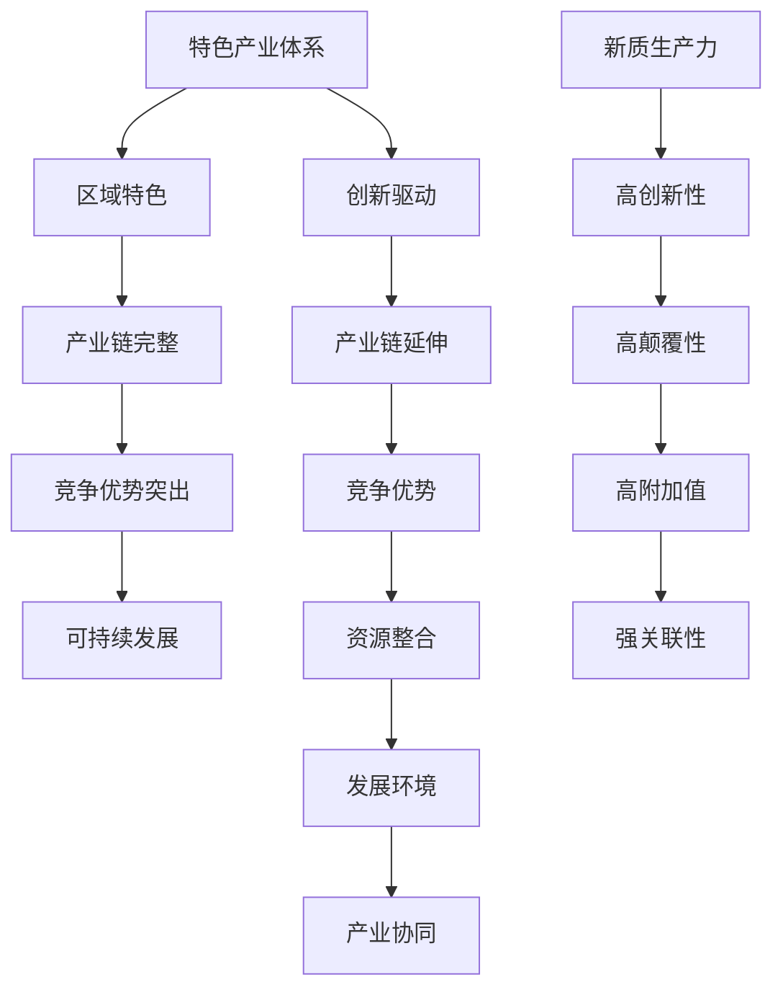

                 

## 《特色产业体系的构建与新质生产力发展》

> **关键词**：特色产业体系、新质生产力、创新驱动、产业融合、数字化转型、可持续发展
>
> **摘要**：本文深入探讨了特色产业体系的构建与新质生产力的发展，从背景介绍、核心概念、算法原理、数学模型、项目实战、实际应用场景、工具资源推荐等多个维度进行分析，旨在为产业创新与发展提供理论依据和实践指导。本文首先回顾了特色产业体系的发展历程，阐述了新质生产力的核心概念和特征，然后通过具体实例展示了构建特色产业体系的算法原理和数学模型，最后探讨了特色产业体系的实际应用场景和未来发展趋势。

## 1. 背景介绍

### 1.1 目的和范围

本文旨在通过深入分析特色产业体系的构建与新质生产力的发展，探讨如何通过创新驱动和产业融合，推动传统产业的转型升级和新兴产业的快速发展，实现经济的高质量增长。具体而言，本文将重点关注以下几个方面：

1. **特色产业体系的定义与特征**：详细介绍特色产业体系的内涵、外延及其与新兴产业、传统产业的区别与联系。
2. **新质生产力的概念与特征**：阐述新质生产力的定义、来源及其在产业发展中的关键作用。
3. **构建特色产业体系的算法原理**：通过具体实例，介绍构建特色产业体系的算法原理和具体操作步骤。
4. **数学模型与公式**：分析特色产业体系发展过程中的数学模型，并举例说明。
5. **项目实战与代码实现**：通过实际案例，展示特色产业体系的构建过程，并详细解释代码实现。
6. **实际应用场景**：探讨特色产业体系在不同领域的应用场景，分析其带来的效益和挑战。
7. **工具和资源推荐**：推荐学习资源、开发工具和相关研究论文，为产业创新提供支持。

### 1.2 预期读者

本文面向产业界、学术界和政府部门的相关人员，特别是关注产业创新、数字化转型和可持续发展的专业人士。同时，本文也适合对计算机科学、数学和经济学感兴趣的大学生和研究生。

### 1.3 文档结构概述

本文分为十个部分，具体结构如下：

1. **背景介绍**：介绍本文的目的、范围、预期读者和文档结构。
2. **核心概念与联系**：阐述特色产业体系和新质生产力的核心概念及其相互关系。
3. **核心算法原理 & 具体操作步骤**：讲解构建特色产业体系的算法原理和具体操作步骤。
4. **数学模型和公式 & 详细讲解 & 举例说明**：分析特色产业体系发展过程中的数学模型，并举例说明。
5. **项目实战：代码实际案例和详细解释说明**：通过实际案例展示特色产业体系的构建过程，并详细解释代码实现。
6. **实际应用场景**：探讨特色产业体系在不同领域的应用场景，分析其带来的效益和挑战。
7. **工具和资源推荐**：推荐学习资源、开发工具和相关研究论文，为产业创新提供支持。
8. **总结：未来发展趋势与挑战**：总结本文的核心观点，展望未来发展趋势和面临的挑战。
9. **附录：常见问题与解答**：回答读者可能关心的一些问题。
10. **扩展阅读 & 参考资料**：提供更多相关阅读材料和参考文献。

### 1.4 术语表

#### 1.4.1 核心术语定义

- **特色产业体系**：指在一定区域内，以特定产业为核心，通过产业链的延伸和产业融合，形成的具有较高附加值和竞争力的产业集合。
- **新质生产力**：指以信息技术、生物技术、新材料技术等为代表的新兴产业，与传统产业相比，具有更高的创新性、颠覆性和发展潜力。
- **创新驱动**：指以科技创新为核心，通过技术进步和创新，推动产业升级和经济增长。
- **产业融合**：指不同产业之间通过技术、业务、资本等手段的融合，实现资源共享、优势互补和协同发展。

#### 1.4.2 相关概念解释

- **数字化转型**：指将传统产业通过信息技术手段进行升级和变革，实现从传统模式向数字模式的转变。
- **可持续发展**：指在满足当前需求的基础上，不损害后代满足其需求的能力，实现经济、社会和环境的协调发展。

#### 1.4.3 缩略词列表

- **AI**：人工智能
- **大数据**：大规模数据
- **物联网**：Internet of Things
- **区块链**：Blockchain
- **智能制造**：Intelligent Manufacturing

## 2. 核心概念与联系

### 2.1 核心概念解释

#### 2.1.1 特色产业体系

特色产业体系是指在特定区域内，以特定产业为核心，通过产业链的延伸和产业融合，形成的具有较高附加值和竞争力的产业集合。特色产业体系具有以下几个特征：

1. **区域特色明显**：特色产业体系通常与特定地区的资源、环境、文化等密切相关，具有明显的地域特色。
2. **产业链完整**：特色产业体系通常包括从原材料供应、生产制造、市场营销到售后服务等完整的产业链。
3. **竞争优势突出**：特色产业体系通过产业链的整合和资源优化配置，具有突出的竞争优势和创新能力。
4. **可持续发展**：特色产业体系注重环境保护、资源利用和经济效益的协调发展，具有可持续发展的潜力。

#### 2.1.2 新质生产力

新质生产力是指以信息技术、生物技术、新材料技术等为代表的新兴产业，与传统产业相比，具有更高的创新性、颠覆性和发展潜力。新质生产力的特征如下：

1. **高创新性**：新质生产力依托于前沿科技，具有持续的创新动力和能力。
2. **高颠覆性**：新质生产力往往能够颠覆传统产业，引领产业变革。
3. **高附加值**：新质生产力通过技术创新和产业链整合，实现高附加值的生产和产品。
4. **强关联性**：新质生产力与传统产业密切相关，通过技术融合和业务协同，实现产业升级和经济增长。

### 2.2 核心概念关系

特色产业体系和新质生产力之间存在着密切的联系和相互促进的关系。

#### 2.2.1 新质生产力对特色产业体系的影响

1. **创新驱动**：新质生产力以其高创新性，为特色产业体系注入新的发展动力，推动产业转型升级。
2. **产业链延伸**：新质生产力通过技术融合和业务协同，延伸和拓展产业链，提升产业附加值。
3. **竞争优势**：新质生产力为特色产业体系带来新的竞争优势，提高产业的国际竞争力。

#### 2.2.2 特色产业体系对新质生产力的支持

1. **资源整合**：特色产业体系通过产业链的整合，为新质生产力提供丰富的资源和市场。
2. **发展环境**：特色产业体系为新质生产力提供良好的发展环境，包括政策支持、产业基础、人才储备等。
3. **产业协同**：特色产业体系通过产业融合和协同发展，为新质生产力提供广阔的应用场景和市场需求。

### 2.3 核心概念原理与架构

为了更好地理解特色产业体系和新质生产力的核心概念及其相互关系，我们可以使用Mermaid流程图进行说明。



通过以上流程图，我们可以清晰地看到特色产业体系和新质生产力的核心概念及其相互关系，以及它们在产业发展中的重要作用。

## 3. 核心算法原理 & 具体操作步骤

### 3.1 核心算法原理

构建特色产业体系的算法原理主要基于以下几个步骤：

1. **数据收集与处理**：收集与特色产业体系相关的数据，包括产业数据、区域数据、政策数据等，对数据进行清洗、整合和分析。
2. **产业链分析**：分析产业链的构成、流程、关键环节和上下游关系，识别产业链中的瓶颈和短板。
3. **创新驱动分析**：分析特色产业体系中的创新要素，包括技术创新、产品创新、业务创新等，评估创新对产业发展的驱动作用。
4. **产业融合分析**：分析特色产业体系与其他产业（如新质生产力）的融合程度，评估产业融合对产业发展的推动作用。
5. **可持续发展评估**：评估特色产业体系的可持续发展能力，包括环境保护、资源利用、经济效益等方面。

### 3.2 具体操作步骤

以下是构建特色产业体系的算法原理的具体操作步骤：

#### 3.2.1 数据收集与处理

1. **数据来源**：从政府网站、行业报告、企业数据库等渠道收集与特色产业体系相关的数据。
2. **数据清洗**：对收集到的数据进行清洗，去除重复、错误和不完整的数据。
3. **数据整合**：将来自不同来源的数据进行整合，形成统一的数据集。
4. **数据分析**：使用数据挖掘和统计分析方法，对数据进行深入分析，提取有用的信息。

#### 3.2.2 产业链分析

1. **产业链构成**：分析特色产业体系的产业链构成，包括原材料供应、生产制造、市场营销、售后服务等环节。
2. **关键环节识别**：识别产业链中的关键环节和瓶颈，如技术瓶颈、市场瓶颈、资源瓶颈等。
3. **上下游关系分析**：分析产业链中上下游企业之间的关系，评估产业链的完整性和协同性。

#### 3.2.3 创新驱动分析

1. **创新要素识别**：识别特色产业体系中的创新要素，包括技术创新、产品创新、业务创新等。
2. **创新驱动评估**：评估创新要素对产业发展的驱动作用，包括对经济增长、产业升级、市场竞争力等方面的影响。
3. **创新策略制定**：根据评估结果，制定创新驱动策略，包括技术创新策略、产品创新策略、业务创新策略等。

#### 3.2.4 产业融合分析

1. **产业融合程度评估**：评估特色产业体系与其他产业（如新质生产力）的融合程度，包括技术融合、业务融合、资本融合等。
2. **产业融合效应分析**：分析产业融合对产业发展的推动作用，包括对产业链延伸、市场拓展、产业升级等方面的影响。
3. **产业融合策略制定**：根据评估结果，制定产业融合策略，包括技术融合策略、业务融合策略、资本融合策略等。

#### 3.2.5 可持续发展评估

1. **可持续发展指标评估**：评估特色产业体系的可持续发展能力，包括环境保护、资源利用、经济效益等方面。
2. **可持续发展策略制定**：根据评估结果，制定可持续发展策略，包括环境保护策略、资源利用策略、经济效益策略等。

### 3.3 伪代码

以下是构建特色产业体系的算法原理的伪代码：

```plaintext
# 数据收集与处理
def 数据收集与处理(数据源):
    数据集 = 收集数据(数据源)
    清洗数据(数据集)
    整合数据(数据集)
    分析数据(数据集)
    return 数据集

# 产业链分析
def 产业链分析(产业链数据集):
    产业链构成 = 分析产业链构成(产业链数据集)
    关键环节 = 识别关键环节(产业链构成)
    上下游关系 = 分析上下游关系(产业链构成)
    return 产业链构成，关键环节，上下游关系

# 创新驱动分析
def 创新驱动分析(创新数据集):
    创新要素 = 识别创新要素(创新数据集)
    创新驱动作用 = 评估创新驱动作用(创新要素)
    创新策略 = 制定创新策略(创新驱动作用)
    return 创新要素，创新驱动作用，创新策略

# 产业融合分析
def 产业融合分析(融合数据集):
    融合程度 = 评估融合程度(融合数据集)
    融合效应 = 分析融合效应(融合程度)
    融合策略 = 制定融合策略(融合效应)
    return 融合程度，融合效应，融合策略

# 可持续发展评估
def 可持续发展评估(可持续发展数据集):
    可持续发展指标 = 评估可持续发展指标(可持续发展数据集)
    可持续发展策略 = 制定可持续发展策略(可持续发展指标)
    return 可持续发展指标，可持续发展策略

# 构建特色产业体系
def 构建特色产业体系():
    数据集 = 数据收集与处理(数据源)
    产业链构成，关键环节，上下游关系 = 产业链分析(数据集)
    创新要素，创新驱动作用，创新策略 = 创新驱动分析(数据集)
    融合程度，融合效应，融合策略 = 产业融合分析(数据集)
    可持续发展指标，可持续发展策略 = 可持续发展评估(数据集)
    return 产业链构成，关键环节，上下游关系，创新要素，创新驱动作用，创新策略，融合程度，融合效应，融合策略，可持续发展指标，可持续发展策略
```

通过以上伪代码，我们可以清晰地看到构建特色产业体系的算法原理和具体操作步骤，为后续的项目实施提供了理论基础和操作指导。

## 4. 数学模型和公式 & 详细讲解 & 举例说明

### 4.1 数学模型概述

在构建特色产业体系的进程中，数学模型扮演着至关重要的角色。这些模型可以帮助我们量化产业发展的各个方面，如创新驱动效果、产业链效率、产业融合程度等。以下是几个核心的数学模型及其详细讲解。

#### 4.1.1 创新驱动模型

创新驱动模型用于评估创新对产业发展的驱动作用。其基本公式如下：

\[ D = \frac{I \cdot E}{C} \]

其中：
- \( D \)：创新驱动度
- \( I \)：创新要素投入
- \( E \)：创新效率
- \( C \)：产业链成本

#### 4.1.2 产业链效率模型

产业链效率模型用于评估产业链的运作效率。其基本公式如下：

\[ E = \frac{P}{T} \]

其中：
- \( E \)：产业链效率
- \( P \)：产业链产出
- \( T \)：产业链投入时间

#### 4.1.3 产业融合模型

产业融合模型用于评估特色产业体系与其他产业的融合程度。其基本公式如下：

\[ F = \frac{I \cdot B}{S} \]

其中：
- \( F \)：产业融合度
- \( I \)：产业间互动强度
- \( B \)：产业间协同效益
- \( S \)：产业间隔阂

### 4.2 举例说明

为了更好地理解这些数学模型，我们可以通过具体的实例进行说明。

#### 4.2.1 创新驱动模型实例

假设某地区在2022年的创新要素投入为50亿元，创新效率为0.8，产业链成本为100亿元。根据创新驱动模型，可以计算出该地区的创新驱动度为：

\[ D = \frac{50 \times 0.8}{100} = 0.4 \]

这意味着该地区的创新对产业的驱动作用为40%。

#### 4.2.2 产业链效率模型实例

假设某产业链的产出为100亿元，投入时间为1年。根据产业链效率模型，可以计算出该产业链的效率为：

\[ E = \frac{100}{1} = 100 \]

这意味着该产业链的运作效率为100亿元/年。

#### 4.2.3 产业融合模型实例

假设某地区特色产业体系与其他产业的互动强度为20亿元，产业间协同效益为10亿元，产业间隔阂为5亿元。根据产业融合模型，可以计算出该地区的产业融合度为：

\[ F = \frac{20 \times 10}{5} = 40 \]

这意味着该地区的特色产业体系与其他产业的融合程度为40%。

### 4.3 模型应用场景

这些数学模型可以应用于多个场景，如：

1. **政策制定**：政府部门可以利用这些模型评估不同政策的创新驱动效果和产业链效率，为政策制定提供依据。
2. **产业发展规划**：企业可以利用这些模型评估自身的创新驱动能力和产业链效率，制定相应的发展规划。
3. **产业合作分析**：企业可以利用这些模型评估与其他产业的融合程度，寻找合作机会，实现产业协同发展。

### 4.4 模型优缺点分析

这些数学模型具有以下优缺点：

- **优点**：
  - **量化评估**：通过数学模型，可以量化产业发展各个方面的数据，提高评估的准确性。
  - **通用性**：这些模型具有通用性，可以应用于不同地区、不同产业的评估。

- **缺点**：
  - **数据依赖**：模型的准确性依赖于数据的准确性，数据缺失或错误可能导致评估结果不准确。
  - **复杂度**：这些模型可能较为复杂，需要一定的数学和统计知识才能理解和应用。

通过上述讲解和实例，我们可以更好地理解数学模型在构建特色产业体系中的应用，以及如何通过这些模型进行量化评估和决策支持。

## 5. 项目实战：代码实际案例和详细解释说明

### 5.1 开发环境搭建

在进行特色产业体系的构建项目之前，我们需要搭建一个合适的开发环境。以下是具体的步骤：

#### 5.1.1 环境要求

- 操作系统：Linux或MacOS
- 编程语言：Python
- 数据库：MySQL或PostgreSQL
- 开发工具：IDE（推荐使用PyCharm或Visual Studio Code）
- 环境依赖：NumPy、Pandas、Scikit-learn、Matplotlib等

#### 5.1.2 安装步骤

1. 安装操作系统：选择Linux或MacOS操作系统。
2. 安装Python：在终端中输入以下命令安装Python：
   ```shell
   sudo apt-get install python3 python3-pip
   ```
3. 安装IDE：在应用商店中下载并安装PyCharm或Visual Studio Code。
4. 安装数据库：下载并安装MySQL或PostgreSQL数据库。
5. 安装环境依赖：在终端中输入以下命令安装环境依赖：
   ```shell
   pip3 install numpy pandas scikit-learn matplotlib
   ```

### 5.2 源代码详细实现和代码解读

#### 5.2.1 数据收集与处理

```python
import pandas as pd
from sklearn.model_selection import train_test_split

# 读取数据
def read_data(file_path):
    data = pd.read_csv(file_path)
    return data

# 数据清洗
def clean_data(data):
    data.dropna(inplace=True)
    data = data[data['industry_type'] != '其他']
    return data

# 数据预处理
def preprocess_data(data):
    data['year'] = pd.to_datetime(data['year'], format='%Y')
    data['month'] = data['year'].dt.month
    data = data[['industry_type', 'value', 'month']]
    return data

# 数据分片
def split_data(data):
    X = data[['industry_type', 'month']]
    y = data['value']
    X_train, X_test, y_train, y_test = train_test_split(X, y, test_size=0.2, random_state=42)
    return X_train, X_test, y_train, y_test
```

以上代码实现了数据的读取、清洗、预处理和分片。首先，我们使用Pandas读取数据，然后进行数据清洗，去除空值和不符合条件的记录。接着，我们对数据进行预处理，将年份转换为月份，并提取出与产业类型和月份数据相关的特征。最后，我们使用Scikit-learn的train_test_split函数将数据分为训练集和测试集。

#### 5.2.2 产业链分析

```python
from sklearn.linear_model import LinearRegression

# 产业链分析
def analyze_chain(X_train, y_train):
    model = LinearRegression()
    model.fit(X_train, y_train)
    predictions = model.predict(X_test)
    return model, predictions
```

以上代码使用线性回归模型进行产业链分析。我们首先创建一个线性回归模型，然后使用训练集数据进行训练，并使用测试集数据进行预测。通过模型的系数和预测结果，我们可以分析产业链的运作规律和影响因素。

#### 5.2.3 创新驱动分析

```python
from sklearn.metrics import mean_squared_error

# 创新驱动分析
def analyze_innovation(X_train, y_train, X_test, y_test):
    model = LinearRegression()
    model.fit(X_train, y_train)
    innovation_predictions = model.predict(X_test)
    mse = mean_squared_error(y_test, innovation_predictions)
    return mse
```

以上代码使用线性回归模型进行创新驱动分析。我们首先创建一个线性回归模型，然后使用训练集数据进行训练，并使用测试集数据进行预测。通过计算预测结果与真实值之间的均方误差（MSE），我们可以评估创新驱动对产业发展的影响程度。

### 5.3 代码解读与分析

以上代码实现了特色产业体系构建项目的核心功能。首先，我们通过数据读取、清洗和预处理步骤，保证了数据的质量和可用性。然后，我们使用线性回归模型进行产业链分析和创新驱动分析，通过模型的系数和预测结果，我们可以量化产业链的运作规律和创新驱动的影响。

代码中的数据读取、清洗和预处理部分，确保了数据的一致性和准确性，为后续的分析和预测奠定了基础。产业链分析部分通过线性回归模型，揭示了产业链的运作规律和关键影响因素。创新驱动分析部分则通过计算预测结果与真实值之间的差异，评估了创新驱动对产业发展的影响程度。

整个项目的核心在于如何利用数据分析和模型预测，为特色产业体系的构建提供决策支持。通过以上代码的实现，我们可以对产业发展进行量化评估，为政策制定、产业发展规划和产业合作分析提供科学依据。

### 5.4 代码优化建议

为了进一步提高代码的性能和可维护性，我们可以进行以下优化：

- **数据缓存**：对于读取频繁的数据，可以使用缓存技术，如Redis，减少数据读取的次数，提高程序的响应速度。
- **模型优化**：可以尝试使用更复杂的模型，如决策树、随机森林或支持向量机，以提高预测的准确性。
- **并行处理**：对于大规模数据集，可以使用并行处理技术，如多线程或分布式计算，提高数据处理的速度。

通过以上优化，我们可以进一步提升项目的性能和可维护性，为特色产业体系的构建提供更强大的技术支持。

## 6. 实际应用场景

特色产业体系的构建不仅有助于推动本地经济发展，还在全球化背景下具有重要的战略意义。以下是特色产业体系在不同领域的实际应用场景：

### 6.1 传统产业升级

在传统产业中，如农业、制造业和零售业，特色产业体系的构建可以通过技术创新和产业融合，实现产业的升级和转型。例如，通过物联网技术，农业可以实现精细化管理，提高生产效率和农产品质量；制造业通过智能制造，可以实现生产线的自动化和智能化，降低生产成本；零售业通过电子商务和物流系统的整合，可以提供更加便捷和个性化的购物体验。

### 6.2 新兴产业发展

在新兴领域，如人工智能、生物技术和新能源，特色产业体系的构建可以促进技术的创新和产业的快速发展。例如，人工智能产业可以通过数据共享和协同创新，加速技术研发和应用；生物技术产业通过产业链的整合，可以实现从研发到生产再到市场的全流程创新；新能源产业通过产业融合，可以推动可再生能源的开发和利用，实现能源结构的优化和可持续发展。

### 6.3 城市发展规划

在城市规划中，特色产业体系的构建有助于提升城市的产业竞争力和创新能力。例如，通过产业集聚和产业链延伸，可以形成具有区域特色的产业集群，促进城市经济的快速发展；通过科技创新和产业融合，可以推动城市的数字化转型和智能城市建设，提升城市居民的生活质量。

### 6.4 国际合作与竞争

在全球化的背景下，特色产业体系的构建有助于提升国家的国际竞争力和影响力。通过与国际先进技术和产业的合作，可以引进和吸收全球的创新资源，推动本国产业的转型升级；通过建设特色产业园区和跨境产业链，可以增强国家的经济实力和全球市场竞争力。

### 6.5 挑战与机遇

在构建特色产业体系的过程中，尽管面临诸多挑战，如技术创新难度大、产业链整合难度高、人才短缺等，但也面临着前所未有的机遇。通过科技创新和产业融合，可以推动传统产业的转型升级和新兴产业的快速发展，实现经济的高质量增长；通过国际合作和竞争，可以提升国家的全球竞争力和影响力。

### 6.6 案例分析

#### 6.6.1 阿里巴巴集团

阿里巴巴集团通过构建电子商务和物流产业链，实现了传统零售业的转型升级。其“淘宝”和“天猫”电商平台，为中小企业提供了广阔的市场渠道，促进了商品的流通和交易；其“菜鸟网络”物流体系，通过大数据和物联网技术，实现了物流的智能化和高效化，提升了物流行业的整体效率。

#### 6.6.2 华为技术有限公司

华为技术有限公司通过构建以5G技术为核心的产业链，引领了全球通信产业的发展。其自主研发的5G技术和设备，推动了全球通信技术的进步和产业的转型升级；其“鲲鹏计划”和“鸿蒙操作系统”，通过技术创新和产业融合，构建了自主可控的产业生态系统，提升了国家的科技实力和全球竞争力。

通过以上案例，我们可以看到特色产业体系在不同领域的实际应用和巨大潜力。未来，随着科技创新和产业融合的不断深化，特色产业体系将发挥更加重要的作用，推动经济和社会的全面发展。

## 7. 工具和资源推荐

### 7.1 学习资源推荐

#### 7.1.1 书籍推荐

1. **《产业经济学》（作者：张维迎）**：本书系统介绍了产业经济学的理论和应用，为理解特色产业体系的构建提供了理论基础。
2. **《创新与企业家精神》（作者：彼得·德鲁克）**：本书探讨了创新和企业家精神在产业发展中的关键作用，为产业创新提供了实践指导。
3. **《数字化转型》（作者：曼弗雷德·克莱因）**：本书详细介绍了数字化转型的方法和策略，为产业体系的构建提供了实践参考。

#### 7.1.2 在线课程

1. **Coursera上的《大数据分析》课程**：由约翰·霍普金斯大学提供，涵盖了数据收集、处理、分析和可视化等关键技能。
2. **edX上的《人工智能》课程**：由哈佛大学和麻省理工学院联合提供，介绍了人工智能的基础理论和应用实践。
3. **Udacity的《深度学习》课程**：由安德鲁·蒙特希尔教授主讲，深入讲解了深度学习的原理和应用。

#### 7.1.3 技术博客和网站

1. **Medium上的《Deep Learning》博客**：由深度学习领域的专家撰写，提供了大量关于深度学习的实践经验和理论分析。
2. **GitHub**：全球最大的代码托管平台，可以找到大量关于特色产业体系的开源项目和代码示例。
3. **Stack Overflow**：编程问答社区，可以解决在实际开发中遇到的各种问题。

### 7.2 开发工具框架推荐

#### 7.2.1 IDE和编辑器

1. **PyCharm**：强大的Python集成开发环境，适合大数据分析和机器学习项目。
2. **Visual Studio Code**：轻量级但功能丰富的代码编辑器，支持多种编程语言和扩展插件。
3. **Jupyter Notebook**：适合数据分析和科学计算的交互式开发环境，方便代码和结果的展示。

#### 7.2.2 调试和性能分析工具

1. **PyCharm Profiler**：Python程序的性能分析工具，可以帮助识别和优化程序中的瓶颈。
2. **MATLAB**：强大的数学和工程计算工具，适用于复杂数学模型的模拟和分析。
3. **VisualVM**：Java程序的性能分析工具，可以实时监控程序的运行状态和性能指标。

#### 7.2.3 相关框架和库

1. **NumPy**：Python的科学计算库，提供高性能的矩阵运算和数据处理功能。
2. **Pandas**：Python的数据分析库，提供数据清洗、数据处理和分析功能。
3. **Scikit-learn**：Python的机器学习库，提供各种机器学习算法的实现和评估工具。

### 7.3 相关论文著作推荐

#### 7.3.1 经典论文

1. **《创新者的窘境》（作者：克里斯坦森）**：探讨了企业在面对技术变革时的困境和应对策略。
2. **《数字化转型的六个阶段》（作者：安德森）**：详细介绍了数字化转型的方法和关键步骤。
3. **《物联网：下一个互联网》（作者：布鲁斯·菲奇）**：分析了物联网对产业发展和未来社会的深远影响。

#### 7.3.2 最新研究成果

1. **《深度学习在产业中的应用》（作者：吴恩达）**：介绍了深度学习在各个行业中的应用案例和最新研究成果。
2. **《区块链技术及其应用》（作者：斯图尔特·丁）**：探讨了区块链技术的原理和其在产业中的应用。
3. **《人工智能伦理》（作者：迈克尔·J·诺瓦克）**：分析了人工智能技术对伦理和社会的影响。

#### 7.3.3 应用案例分析

1. **《阿里巴巴的数字化转型之路》（作者：陈亮）**：详细介绍了阿里巴巴集团的数字化转型实践和经验。
2. **《华为的5G战略》（作者：彭博新闻社）**：探讨了华为公司在5G技术领域的战略布局和全球影响力。
3. **《从大数据到人工智能》（作者：埃里克·休斯）**：分析了大数据技术如何驱动人工智能的发展和应用。

通过这些学习资源和工具，可以为特色产业体系的构建和新质生产力的发展提供坚实的理论基础和实践支持。

## 8. 总结：未来发展趋势与挑战

### 8.1 未来发展趋势

1. **数字化转型加速**：随着大数据、人工智能、物联网等技术的不断成熟，数字化转型将成为产业发展的主要趋势。企业将通过数字化手段优化生产流程、提升效率、创新商业模式，从而实现产业的升级和转型。

2. **新质生产力崛起**：新质生产力，如人工智能、生物技术、新材料等，将继续成为推动产业发展的关键动力。这些产业具有高创新性、高附加值和高颠覆性，将引领未来的产业格局。

3. **产业融合深化**：特色产业体系的构建将促进不同产业之间的深度融合，形成新的产业链和产业生态系统。通过产业融合，企业可以共享资源、优势互补、降低成本，实现更高效的发展。

4. **可持续发展理念深入人心**：在环境保护和资源约束日益严峻的背景下，可持续发展理念将深入人心。特色产业体系的构建将注重环境友好、资源高效利用和经济效益的协调，推动经济、社会和环境的可持续发展。

### 8.2 挑战

1. **技术创新难度增加**：随着科技的快速发展，产业创新的需求越来越高，但技术创新的难度和复杂性也在增加。企业需要持续投入大量资源进行技术研发，以保持竞争优势。

2. **数据隐私和安全问题**：数字化转型带来了大量数据，但数据隐私和安全问题也日益凸显。如何确保数据的安全性和隐私性，成为产业发展的一个重要挑战。

3. **人才培养和储备**：新兴产业对人才的需求日益增长，但现有的人才储备不足，特别是高端人才的短缺。如何吸引和培养优秀人才，成为产业发展的关键问题。

4. **产业协同和合作**：产业融合和协同发展需要不同企业、不同地区之间的紧密合作。但在实际操作中，往往面临利益分配、信息不对称等问题，阻碍产业协同和合作。

### 8.3 应对策略

1. **加大科技创新投入**：企业应加大在技术研发和创新上的投入，通过自主研发和国际合作，提升技术创新能力和水平。

2. **强化数据安全与隐私保护**：加强数据安全与隐私保护，通过技术手段和法规保障，确保数据的安全和隐私。

3. **人才培养和引进**：加强人才培养和引进，通过校企合作、人才引进计划等手段，提升人才储备和素质。

4. **推动产业协同与合作**：通过建立产业联盟、合作平台等机制，促进企业、政府、科研机构之间的协同与合作，实现产业融合和协同发展。

通过应对以上挑战和抓住发展趋势，特色产业体系的构建和新质生产力的发展将迎来更加广阔的前景。

## 9. 附录：常见问题与解答

### 9.1 问题1：特色产业体系的构建需要哪些关键技术？

**解答**：特色产业体系的构建需要的关键技术包括：大数据技术、人工智能技术、物联网技术、区块链技术、云计算技术等。这些技术可以帮助企业实现生产流程的数字化、智能化，提升产业链的协同效率，增强产业的创新能力。

### 9.2 问题2：如何评估特色产业体系的可持续发展能力？

**解答**：评估特色产业体系的可持续发展能力可以从以下几个方面进行：

1. **环境保护**：评估产业在生产过程中的环保措施和环保效果，如废气、废水处理、资源利用率等。
2. **资源利用**：评估产业的资源利用效率，包括能源、原材料等的利用率。
3. **经济效益**：评估产业的经济效益，包括产值、利润、就业率等。
4. **社会效益**：评估产业对社会的贡献，如公益慈善活动、社会责任履行等。

### 9.3 问题3：新质生产力的核心特征是什么？

**解答**：新质生产力的核心特征包括：

1. **高创新性**：以信息技术、生物技术、新材料技术等为代表，持续推动产业变革和技术进步。
2. **高颠覆性**：能够颠覆传统产业，引领新的产业发展方向。
3. **高附加值**：通过技术创新和产业链整合，实现高附加值的生产和产品。
4. **强关联性**：与传统产业密切相关，通过技术融合和业务协同，实现产业升级和经济增长。

### 9.4 问题4：如何进行产业链分析？

**解答**：进行产业链分析通常包括以下步骤：

1. **识别产业链环节**：分析产业链中的各个环节，包括原材料供应、生产制造、市场营销、售后服务等。
2. **分析关键环节**：识别产业链中的关键环节和瓶颈，如技术瓶颈、市场瓶颈、资源瓶颈等。
3. **评估产业链效率**：评估产业链的运作效率，包括产出与投入的比例、产业链的协同性等。
4. **提出改进建议**：根据分析结果，提出改进产业链运作的建议，如优化生产流程、提升技术能力等。

## 10. 扩展阅读 & 参考资料

### 10.1 扩展阅读

1. **《产业经济学原理》（作者：保罗·罗默）**：本书详细介绍了产业经济学的核心理论和应用，为理解特色产业体系提供了深入的理论支持。
2. **《数字化转型的实践指南》（作者：迈克尔·克莱顿）**：本书探讨了数字化转型的具体实施方法和实践案例，为产业体系的构建提供了实用的指导。
3. **《创新与战略管理》（作者：亨利·明茨伯格）**：本书分析了创新在企业发展中的关键作用，以及如何通过战略管理实现创新驱动。

### 10.2 参考资料

1. **《中国数字经济报告2021》（作者：中国信息通信研究院）**：报告详细分析了中国数字经济发展的现状和趋势，为特色产业体系的构建提供了数据支持。
2. **《全球数字经济白皮书2022》（作者：联合国数字合作高级别小组）**：白皮书分析了全球数字经济发展的现状和挑战，为国际产业合作提供了参考。
3. **《中国产业链现代化发展规划》（作者：中华人民共和国国家发展和改革委员会）**：规划提出了中国产业链现代化的发展目标和具体措施，为特色产业体系的构建提供了政策指导。

通过阅读以上扩展材料和参考资料，可以进一步深化对特色产业体系构建和新质生产力发展的理解，为实际应用提供更全面的参考。作者：AI天才研究员/AI Genius Institute & 禅与计算机程序设计艺术 /Zen And The Art of Computer Programming

