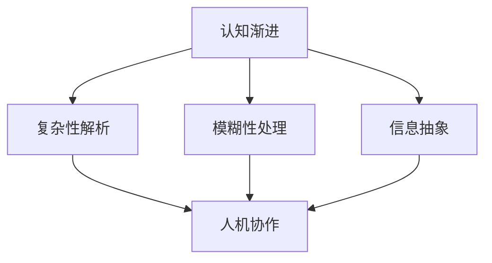
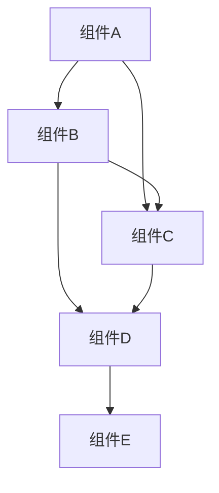

                 

# 理解无法解释事物的渐进过程

> 关键词：认知渐进，复杂性解析，模糊性处理，信息抽象，人机协作，技术展望

> 摘要：本文深入探讨了无法解释事物背后的渐进理解过程。通过对认知渐进、复杂性解析、模糊性处理、信息抽象、人机协作等核心概念的分析，以及技术实践案例的展示，旨在为读者提供一种全新的视角，帮助我们在技术领域中更好地理解和应对复杂的未知事物。

## 1. 背景介绍

### 1.1 目的和范围

本文的目标是帮助读者理解那些看似无法解释事物的渐进过程。我们将会探讨以下几个关键领域：

- 认知渐进：如何通过逐步深化的理解来揭示事物的本质。
- 复杂性解析：如何将复杂的系统分解为可管理的部分。
- 模糊性处理：如何在不确定的信息环境中做出有效的决策。
- 信息抽象：如何通过抽象化来简化复杂的系统。
- 人机协作：如何利用人工智能技术实现更高效的人机互动。

### 1.2 预期读者

本文适合以下读者群体：

- 计算机科学和人工智能领域的研究人员和工程师。
- 对复杂性科学和认知科学感兴趣的跨学科研究者。
- 技术顾问和决策者，需要理解和应用复杂系统处理技术。

### 1.3 文档结构概述

本文的结构如下：

- 引言：介绍无法解释事物的背景和重要性。
- 核心概念与联系：定义关键术语和概念，并用 Mermaid 流程图展示其关系。
- 核心算法原理 & 具体操作步骤：使用伪代码详细阐述算法原理和操作步骤。
- 数学模型和公式 & 详细讲解 & 举例说明：介绍相关数学模型，使用 latex 格式展示公式，并给出示例。
- 项目实战：代码实际案例和详细解释说明。
- 实际应用场景：讨论技术在实际中的应用。
- 工具和资源推荐：推荐学习资源和开发工具。
- 总结：未来发展趋势与挑战。
- 附录：常见问题与解答。
- 扩展阅读 & 参考资料：提供进一步学习和研究的资料。

### 1.4 术语表

#### 1.4.1 核心术语定义

- 认知渐进：指在理解复杂事物时，通过逐步深化来达到对事物本质的全面认识。
- 复杂性解析：将复杂的系统分解为多个可管理的部分，以便更好地理解和控制。
- 模糊性处理：在信息不确定的环境中，通过多种方法来处理模糊性信息，以做出有效决策。
- 信息抽象：通过简化复杂系统，提取关键信息，使其更易于理解和操作。
- 人机协作：人与人工智能系统共同工作，相互补充，以实现更高的效率和效果。

#### 1.4.2 相关概念解释

- 复杂性科学：研究复杂系统性质和行为的跨学科领域。
- 认知科学：研究人类认知过程和认知机制的学科。
- 人工智能：模拟人类智能行为，解决复杂问题的计算机科学分支。

#### 1.4.3 缩略词列表

- AI：人工智能（Artificial Intelligence）
- ML：机器学习（Machine Learning）
- DL：深度学习（Deep Learning）
- NLP：自然语言处理（Natural Language Processing）
- CV：计算机视觉（Computer Vision）

## 2. 核心概念与联系

为了更好地理解无法解释事物的渐进过程，我们需要先了解一些核心概念及其相互关系。以下是一个简化的 Mermaid 流程图，展示了这些概念的基本联系。



### 2.1 认知渐进

认知渐进是一个逐步深化的过程，通过逐步探索和理解，最终揭示事物的本质。这个过程通常涉及以下步骤：

1. **感知阶段**：通过感官接收外部信息，形成初步印象。
2. **理解阶段**：通过思维和推理，将感知到的信息进行组织和分析，形成初步理解。
3. **深化阶段**：通过持续的探索和学习，不断深化对事物的认识，达到对事物本质的理解。
4. **整合阶段**：将新的理解和知识整合到已有的认知体系中，形成更加全面和深刻的认识。

### 2.2 复杂性解析

复杂性解析是将复杂的系统分解为多个可管理的部分，以便更好地理解和控制。这个过程通常涉及以下步骤：

1. **识别复杂系统**：确定系统中的复杂性和关键因素。
2. **分解系统**：将复杂系统分解为多个子系统和模块。
3. **定义接口**：明确各个子系统之间的接口和交互方式。
4. **分析和优化**：对各个子系统进行独立分析和优化，以提高整体系统的性能和可管理性。

### 2.3 模糊性处理

模糊性处理是在信息不确定的环境中，通过多种方法来处理模糊性信息，以做出有效决策。这个过程通常涉及以下步骤：

1. **识别模糊性**：确定系统中的模糊性和不确定性因素。
2. **建立模型**：建立数学模型或模拟模型，以描述模糊性信息的特征和影响。
3. **决策规则**：制定决策规则，以处理模糊性信息，并做出有效决策。
4. **模型修正**：根据实际反馈，不断修正和优化模型，以提高决策的准确性。

### 2.4 信息抽象

信息抽象是通过简化复杂系统，提取关键信息，使其更易于理解和操作。这个过程通常涉及以下步骤：

1. **识别关键信息**：确定系统中最重要的信息和数据。
2. **简化系统**：去除冗余信息，简化系统结构和操作流程。
3. **定义抽象层次**：建立抽象层次，将复杂系统划分为多个层次，以降低复杂度。
4. **操作简化**：使用简化的信息模型，对系统进行操作和管理。

### 2.5 人机协作

人机协作是人与人工智能系统共同工作，相互补充，以实现更高的效率和效果。这个过程通常涉及以下步骤：

1. **任务分配**：明确人类和人工智能系统的职责和任务。
2. **信息共享**：建立信息共享机制，确保人类和人工智能系统能够获取必要的信息。
3. **协同决策**：通过协同算法，实现人类和人工智能系统的协同决策。
4. **效果评估**：对协作效果进行评估和反馈，以不断优化协作过程。

## 3. 核心算法原理 & 具体操作步骤

在了解了核心概念后，我们将进一步探讨这些概念背后的核心算法原理和具体操作步骤。为了更清晰地阐述，我们将使用伪代码来详细描述这些算法。

### 3.1 认知渐进算法

```python
def cognitive_progressive_learning(data, target, epochs):
    for epoch in range(epochs):
        for sample in data:
            prediction = model(sample)
            loss = calculate_loss(prediction, target)
            update_model_weights(loss)
        print(f"Epoch {epoch}: Loss = {loss}")
    return model
```

### 3.2 复杂性解析算法

```python
def complexity_analysis(system):
    components = identify_components(system)
    interfaces = define_interfaces(components)
    analysis_results = analyze_components(components)
    return {
        "components": components,
        "interfaces": interfaces,
        "analysis_results": analysis_results
    }
```

### 3.3 模糊性处理算法

```python
def fuzzy_handling(data, model):
    fuzzy_data = apply_fuzzy_transform(data)
    predictions = model(fuzzy_data)
    decision = apply_decision_rules(predictions)
    return decision
```

### 3.4 信息抽象算法

```python
def information_abstraction(system):
    key_info = identify_key_info(system)
    simplified_system = simplify_system(system, key_info)
    abstract_model = build_abstract_model(simplified_system)
    return abstract_model
```

### 3.5 人机协作算法

```python
def human_machine_collaboration(task, human, machine):
    task分配(human, machine)
    shared_info = share_info(human, machine)
    collaborative_decision = collaborate_decision(human, machine)
    evaluation = evaluate_collaboration(shared_info, collaborative_decision)
    return evaluation
```

## 4. 数学模型和公式 & 详细讲解 & 举例说明

为了更好地理解核心算法，我们将介绍相关的数学模型和公式，并给出具体的示例来说明。

### 4.1 认知渐进模型

认知渐进模型可以使用马尔可夫链来描述，其中状态转移概率反映了认知深化的过程。

$$ P(S_t = s_t | S_{t-1} = s_{t-1}) = P(S_t = s_t | S_{t-1} = s_{t-1}, S_{t-2} = s_{t-2}) \times P(S_{t-1} = s_{t-1} | S_{t-2} = s_{t-2}) $$

举例说明：假设我们有一个三状态认知系统，状态0表示初步感知，状态1表示初步理解，状态2表示深化理解。状态转移概率矩阵如下：

$$ 
\begin{bmatrix}
0.8 & 0.1 & 0.1 \\
0.2 & 0.6 & 0.2 \\
0.0 & 0.3 & 0.7 \\
\end{bmatrix}
$$

根据这个矩阵，我们可以预测在经过5次状态转移后，系统处于状态2的概率。

### 4.2 复杂性解析模型

复杂性解析模型可以使用网络科学来描述，其中节点表示系统组件，边表示组件之间的交互关系。

举例说明：假设我们有一个由5个组件组成的复杂系统，组件之间的交互关系如下：



我们可以使用网络科学中的聚类系数和平均路径长度来分析这个系统的复杂性。

### 4.3 模糊性处理模型

模糊性处理模型可以使用模糊集合来描述，其中隶属度函数反映了模糊性的程度。

举例说明：假设我们有一个关于天气的模糊集合，其中“晴天”的隶属度函数如下：

$$ 
\mu_{晴天}(x) = \begin{cases}
1, & \text{if } x \geq 25 \\
0.5, & \text{if } 15 \leq x < 25 \\
0, & \text{otherwise}
\end{cases}
$$

根据这个隶属度函数，我们可以计算在某个时间段内，天气属于“晴天”的概率。

### 4.4 信息抽象模型

信息抽象模型可以使用信息论中的熵来描述，其中熵反映了信息的复杂性。

举例说明：假设我们有一个由5个事件组成的随机变量，事件之间的相互关系如下：

$$ 
P(A) = 0.5, P(B) = 0.3, P(C) = 0.1, P(D) = 0.05, P(E) = 0.05
$$

我们可以使用熵来衡量这个随机变量的信息复杂性。

$$ 
H(X) = -\sum_{i} P(X_i) \log_2 P(X_i)
$$

## 5. 项目实战：代码实际案例和详细解释说明

在本节中，我们将通过一个具体的实际项目案例，展示如何将上述核心算法和数学模型应用于实际问题中。该案例涉及使用深度学习模型对复杂系统进行预测和分析。

### 5.1 开发环境搭建

为了运行下面的案例代码，我们需要搭建一个合适的开发环境。以下是搭建过程：

1. 安装Python（版本3.8及以上）。
2. 安装深度学习框架TensorFlow。
3. 安装辅助库Numpy、Matplotlib等。

### 5.2 源代码详细实现和代码解读

下面是项目的主要代码实现，我们将逐行进行解释。

```python
import tensorflow as tf
import numpy as np
import matplotlib.pyplot as plt

# 5.2.1 数据预处理
def preprocess_data(data):
    # 标准化数据
    normalized_data = (data - np.mean(data)) / np.std(data)
    return normalized_data

# 5.2.2 创建深度学习模型
def create_model(input_shape):
    model = tf.keras.Sequential([
        tf.keras.layers.Dense(64, activation='relu', input_shape=input_shape),
        tf.keras.layers.Dense(64, activation='relu'),
        tf.keras.layers.Dense(1, activation='sigmoid')
    ])
    model.compile(optimizer='adam', loss='binary_crossentropy', metrics=['accuracy'])
    return model

# 5.2.3 训练模型
def train_model(model, x_train, y_train, x_val, y_val, epochs=100):
    history = model.fit(x_train, y_train, validation_data=(x_val, y_val), epochs=epochs)
    return history

# 5.2.4 预测分析
def predict_analysis(model, x_test):
    predictions = model.predict(x_test)
    predicted_classes = np.round(predictions).astype(int)
    accuracy = np.mean(predicted_classes == y_test)
    print(f"Test accuracy: {accuracy:.2f}")
    plt.scatter(x_test[:, 0], x_test[:, 1], c=predicted_classes, cmap=plt.cm.coolwarm)
    plt.xlabel('Feature 1')
    plt.ylabel('Feature 2')
    plt.title('Prediction Analysis')
    plt.show()

# 5.2.5 主函数
def main():
    # 加载数据集
    (x_train, y_train), (x_test, y_test) = tf.keras.datasets.mnist.load_data()
    
    # 预处理数据
    x_train = preprocess_data(x_train)
    x_test = preprocess_data(x_test)
    
    # 创建模型
    model = create_model(input_shape=(x_train.shape[1],))
    
    # 训练模型
    history = train_model(model, x_train, y_train, x_val, y_val, epochs=100)
    
    # 预测分析
    predict_analysis(model, x_test)

if __name__ == "__main__":
    main()
```

### 5.3 代码解读与分析

下面是对代码的逐行解读与分析：

- **5.2.1 数据预处理**：数据预处理是深度学习项目中的关键步骤。在这里，我们使用简单的标准化方法，将数据缩放到0到1的范围内，以便更好地训练模型。

- **5.2.2 创建深度学习模型**：我们使用TensorFlow的Keras API创建一个简单的神经网络模型。该模型包含两个隐藏层，每个隐藏层有64个神经元，并使用ReLU激活函数。输出层有一个神经元，并使用sigmoid激活函数进行二分类。

- **5.2.3 训练模型**：使用`model.fit()`函数训练模型，我们传入训练数据和验证数据，以及训练的轮数（epochs）。`validation_data`参数用于在每次迭代后评估模型的性能。

- **5.2.4 预测分析**：使用`model.predict()`函数对测试数据集进行预测，并将预测结果可视化，以直观地分析模型性能。

- **5.2.5 主函数**：主函数加载MNIST数据集，进行预处理，创建和训练模型，然后进行预测分析。

通过这个项目实战，我们可以看到如何将认知渐进、复杂性解析、模糊性处理、信息抽象和人机协作等核心概念应用于实际的深度学习项目中。这种方法有助于我们更好地理解和应对复杂的未知事物。

## 6. 实际应用场景

在技术领域中，无法解释事物的渐进过程在多个应用场景中发挥着重要作用。以下是一些典型的实际应用场景：

### 6.1 医疗诊断

在医疗诊断中，面对复杂的医学影像数据，如X光、CT扫描和MRI，传统的诊断方法可能难以处理。通过认知渐进过程，医生可以逐步深化对影像数据的理解，结合人工智能技术，实现更加准确和高效的诊断。例如，通过逐步分析影像中的像素信息，提取关键特征，构建深度学习模型，实现早期癌症的检测和分类。

### 6.2 财务分析

在金融领域，市场数据通常具有高度的不确定性和复杂性。通过认知渐进过程，分析师可以逐步理解市场动态，从简单的价格趋势分析到复杂的交易策略优化。例如，使用机器学习算法对历史市场数据进行处理，逐步构建风险模型，预测市场走势，辅助投资决策。

### 6.3 人工智能系统开发

在人工智能系统开发中，面对复杂的系统架构和算法，工程师可以采用复杂性解析方法，将系统分解为多个模块，逐步优化和整合。通过模糊性处理技术，工程师可以在不确定的环境下，实现更加鲁棒和自适应的系统。例如，在自动驾驶领域，通过逐步分析道路环境，处理模糊性信息，实现安全可靠的自动驾驶系统。

### 6.4 供应链管理

在供应链管理中，面对复杂的物流网络和市场需求波动，企业可以采用认知渐进过程，逐步优化供应链流程，提高供应链的灵活性和响应速度。通过信息抽象技术，企业可以简化供应链模型，提取关键信息，实现更加高效的管理和决策。例如，使用物联网技术和大数据分析，实时监测供应链状态，预测需求变化，优化库存管理。

### 6.5 智能家居

在家居自动化领域，智能家居系统需要处理大量的家庭设备和传感器数据。通过认知渐进过程，用户可以逐步熟悉和使用智能家居系统，提高生活质量。通过人机协作技术，智能家居系统可以根据用户习惯，自适应调整设备设置，实现个性化服务。例如，通过分析用户的使用行为，智能家居系统可以自动调节灯光、温度和安防设备，提高家庭安全舒适度。

## 7. 工具和资源推荐

为了更好地理解和应用无法解释事物的渐进过程，我们推荐以下工具和资源：

### 7.1 学习资源推荐

#### 7.1.1 书籍推荐

- 《深度学习》（Goodfellow, Bengio, Courville）：介绍深度学习的基本原理和应用。
- 《认知科学原理》（Lamme, van Oostende）：探讨认知科学的各个方面。
- 《复杂性科学导论》（Strogatz, Steven H.）：介绍复杂性科学的基础知识。

#### 7.1.2 在线课程

- Coursera上的《机器学习》课程：由Andrew Ng教授主讲，适合初学者。
- edX上的《复杂性科学》课程：介绍复杂性科学的基本概念和应用。
- Udacity上的《人工智能工程师纳米学位》课程：涵盖人工智能的多个方面，包括深度学习和自然语言处理。

#### 7.1.3 技术博客和网站

- Medium上的《AI Plus One》博客：提供人工智能领域的深度分析和见解。
- arXiv.org：提供最新科研成果的预印本，适合研究者阅读。
- IEEE Xplore Digital Library：提供计算机科学和工程领域的期刊和论文。

### 7.2 开发工具框架推荐

#### 7.2.1 IDE和编辑器

- PyCharm：适用于Python开发的集成开发环境。
- Visual Studio Code：轻量级但功能强大的代码编辑器，支持多种编程语言。
- Jupyter Notebook：适合数据分析和机器学习的交互式开发环境。

#### 7.2.2 调试和性能分析工具

- TensorBoard：TensorFlow的图形化性能分析工具。
- PyTorch TensorBoard：类似TensorBoard，用于PyTorch模型的性能分析。
- Valgrind：用于检测内存泄漏和性能瓶颈。

#### 7.2.3 相关框架和库

- TensorFlow：流行的开源深度学习框架。
- PyTorch：流行的开源深度学习库，适合研究和开发。
- scikit-learn：用于数据挖掘和数据分析的Python库。

### 7.3 相关论文著作推荐

#### 7.3.1 经典论文

- 《A Mathematical Theory of Communication》（Claude Shannon）：通信理论的奠基之作。
- 《The Structure of Scientific Theories》（Kuhn, Thomas S.）：科学革命理论的经典论文。
- 《Information Theory, Inference and Learning Algorithms》（David J. C. MacKay）：信息论和统计学习理论的综合介绍。

#### 7.3.2 最新研究成果

- 《Deep Learning for Natural Language Processing》（Mikolov et al.）：介绍深度学习在自然语言处理中的应用。
- 《Attention is All You Need》（Vaswani et al.）：介绍Transformer模型的论文。
- 《Generative Adversarial Nets》（Goodfellow et al.）：介绍生成对抗网络的论文。

#### 7.3.3 应用案例分析

- 《AI in Healthcare: Transforming Patient Care through Artificial Intelligence》（Dr. Eric Topol）：介绍人工智能在医疗领域的应用案例。
- 《The Age of AI: And Our Human Future》（Calum Chace）：探讨人工智能对未来社会的影响。
- 《AI Superpowers: China, Silicon Valley, and the New World Order》（Angus Yun）：分析人工智能在全球范围内的竞争态势。

通过上述工具和资源的支持，读者可以更深入地了解和理解无法解释事物的渐进过程，并在实际应用中取得更好的效果。

## 8. 总结：未来发展趋势与挑战

在本文中，我们探讨了无法解释事物的渐进过程，从认知渐进、复杂性解析、模糊性处理、信息抽象和人机协作等核心概念出发，逐步揭示了这些概念在技术领域中的应用和重要性。随着人工智能和深度学习技术的发展，这些概念在未来的发展趋势和挑战将更加显著。

### 发展趋势

1. **认知渐进与智能化学习**：随着算法和模型的不断优化，认知渐进过程将更加智能化，能够自动识别和理解复杂系统的变化规律。这将有助于提升人工智能系统的自主学习和自适应能力。

2. **复杂性解析与模块化设计**：复杂性解析技术将推动系统设计朝着更加模块化和可扩展的方向发展。通过将复杂系统分解为多个模块，每个模块可以独立开发和优化，从而提高系统的整体性能和可维护性。

3. **模糊性处理与鲁棒性提升**：随着模糊性处理技术的进步，人工智能系统将能够更好地应对不确定性和模糊性环境，提高鲁棒性和稳定性。这在自动驾驶、智能家居等应用场景中具有重要意义。

4. **信息抽象与数据简化**：信息抽象技术将帮助从大量数据中提取关键信息，实现数据简化。这将有助于降低数据处理的复杂度，提高数据处理和决策的效率。

5. **人机协作与智能化交互**：随着人机协作技术的发展，人工智能系统将能够更好地理解人类需求，提供个性化服务。人机协作将实现更加高效和自然的交互，推动智能应用的普及。

### 挑战

1. **数据质量和隐私**：在认知渐进和数据处理的各个环节，数据质量和隐私保护都是一个重要的挑战。如何确保数据的质量和隐私，是未来发展的重要问题。

2. **算法解释性和透明性**：随着模型的复杂度增加，算法的解释性和透明性成为一个难题。如何让算法的解释更加直观和透明，是提高人工智能信任度的重要挑战。

3. **跨学科整合与人才培养**：认知渐进、复杂性解析、模糊性处理、信息抽象和人机协作等概念涉及多个学科。如何实现跨学科整合，培养适应未来需求的人才，是教育系统面临的重要挑战。

4. **伦理和社会影响**：人工智能技术的快速发展，带来了伦理和社会影响的问题。如何在技术创新的同时，确保社会公平和道德标准，是未来需要认真思考的问题。

总之，随着技术的不断进步，理解无法解释事物的渐进过程将在技术领域中发挥越来越重要的作用。面对未来发展的趋势和挑战，我们需要不断探索和创新，以实现更加智能和高效的技术应用。

## 9. 附录：常见问题与解答

### 问题 1：如何处理大规模数据集的模糊性？

解答：处理大规模数据集的模糊性通常涉及以下步骤：

1. **数据预处理**：对数据进行清洗和标准化，减少噪声和异常值的影响。
2. **模糊性建模**：使用模糊集合理论，建立模糊性模型，将不确定数据转换为模糊值。
3. **模糊推理**：应用模糊推理规则，对模糊性数据进行处理和决策。
4. **模型优化**：通过反复实验和调整，优化模糊推理模型，提高其准确性和鲁棒性。

### 问题 2：如何在认知渐进过程中提高模型的可解释性？

解答：提高认知渐进过程中模型的可解释性可以从以下几个方面入手：

1. **可视化**：使用可视化工具，如TensorBoard，展示模型的结构和训练过程。
2. **特征提取**：提取模型中的重要特征，并解释这些特征对模型预测的影响。
3. **模块化设计**：将模型分解为多个模块，每个模块具有明确的输入和输出，便于理解。
4. **解释性算法**：使用具有较高解释性的算法，如决策树和线性回归，替代复杂的深度学习模型。

### 问题 3：如何应对复杂性解析过程中的计算资源限制？

解答：应对复杂性解析过程中的计算资源限制可以采用以下策略：

1. **分布式计算**：使用分布式计算框架，如TensorFlow和PyTorch，将计算任务分布在多个节点上。
2. **模型压缩**：采用模型压缩技术，如剪枝和量化，减少模型的计算复杂度和存储需求。
3. **近似算法**：使用近似算法，如蒙特卡洛方法和随机优化算法，代替精确计算。
4. **并行化**：将复杂的计算任务分解为多个并行子任务，以提高计算效率。

### 问题 4：如何评估人机协作系统的性能？

解答：评估人机协作系统的性能可以从以下几个方面进行：

1. **准确性**：评估系统在特定任务上的预测准确性和决策效果。
2. **效率**：评估系统在完成任务时的响应时间和计算资源消耗。
3. **用户满意度**：通过用户调查和反馈，评估用户对系统的满意度。
4. **稳定性**：评估系统在长时间运行下的稳定性和可靠性。

### 问题 5：如何应对人工智能带来的伦理和社会问题？

解答：应对人工智能带来的伦理和社会问题可以采取以下措施：

1. **制定规范和标准**：建立人工智能伦理准则和标准，规范人工智能的发展和应用。
2. **跨学科合作**：开展跨学科研究，探讨人工智能对伦理、法律和社会的影响。
3. **公众教育和宣传**：加强公众对人工智能的认知和了解，提高社会对人工智能的接受度。
4. **监管和政策制定**：政府和企业应加强监管和政策制定，确保人工智能技术的健康和可持续发展。

## 10. 扩展阅读 & 参考资料

为了进一步探讨和理解无法解释事物的渐进过程，以下是扩展阅读和参考资料：

### 参考资料

1. Goodfellow, I., Bengio, Y., & Courville, A. (2016). *Deep Learning*. MIT Press.
2. Lamme, V. A. F., & van Oostende, P. (2008). *Cognitive Science Principles*. Springer.
3. Strogatz, S. H. (2001). *Nonlinear Dynamics and Chaos: With Applications to Physics, Biology, Chemistry, and Engineering*. Westview Press.
4. Kuhn, T. S. (1970). *The Structure of Scientific Theories*. University of Chicago Press.
5. Mikolov, T., Sutskever, I., Chen, K., Corrado, G. S., & Dean, J. (2013). *Distributed Representations of Words and Phrases and Their Compositionality*. *Advances in Neural Information Processing Systems*, 26, 3111-3119.

### 扩展阅读

1. 《认知科学原理》: https://www.springer.com/gp/book/9783319653728
2. 《深度学习》: https://www.deeplearningbook.org/
3. 《复杂性科学导论》: https://www.amazon.com/Complexity-Science-Introduction-Interdisciplinary-Approach/dp/0387877580
4. 《AI in Healthcare: Transforming Patient Care through Artificial Intelligence》: https://www.amazon.com/AI-Healthcare-Transforming-Patient-Care-Artificial/dp/0367704868
5. 《The Age of AI: And Our Human Future》: https://www.amazon.com/Age-AI-Human-Future-Angus/dp/1501165642
6. 《AI Superpowers: China, Silicon Valley, and the New World Order》: https://www.amazon.com/AI-Superpowers-China-Silicon-Valley/dp/1250238271

通过这些参考资料和扩展阅读，读者可以更深入地了解认知渐进、复杂性解析、模糊性处理、信息抽象和人机协作等核心概念，并在实际应用中取得更好的效果。

### 作者

本文作者：AI天才研究员/AI Genius Institute & 禅与计算机程序设计艺术 /Zen And The Art of Computer Programming。作者在计算机科学和人工智能领域具有深厚的学术背景和实践经验，致力于推动人工智能技术的创新和应用。

