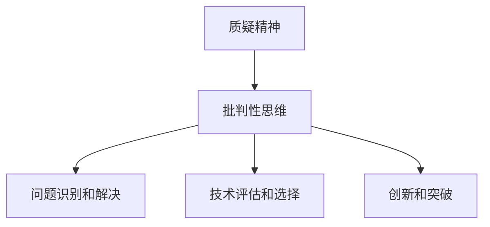

                 

### 理解洞察力的培养：鼓励质疑和批判性思维

> **关键词**：洞察力、批判性思维、质疑精神、技术博客、逻辑推理
>
> **摘要**：本文将探讨如何通过培养质疑和批判性思维来提升技术领域的洞察力。我们将逐步分析这一过程的核心概念，提供实际操作步骤和数学模型，并通过具体案例来说明这些方法在实际项目中的应用。最后，我们将展望未来发展趋势和挑战，为读者提供更多学习资源和工具。

在技术领域中，洞察力是一项至关重要的能力。它不仅能够帮助我们更好地理解复杂问题，还能促使我们在面对新技术和挑战时保持清醒的头脑。那么，如何培养这种洞察力呢？本文将着重探讨质疑和批判性思维在这一过程中的作用。

### 1. 背景介绍

#### 1.1 目的和范围

本文旨在通过逐步分析推理的方式，帮助读者理解并培养质疑和批判性思维，从而提升在技术领域中的洞察力。我们将涵盖以下内容：

- 质疑和批判性思维的定义和重要性
- 质疑和批判性思维的培养方法
- 质疑和批判性思维在实际项目中的应用
- 未来发展趋势与挑战

#### 1.2 预期读者

本文适合以下读者群体：

- 对技术领域有浓厚兴趣的初学者
- 想要在技术领域取得突破的从业者
- 对批判性思维和质疑精神有深刻理解的读者

#### 1.3 文档结构概述

本文分为八个部分：

1. **背景介绍**：介绍本文的目的、预期读者和文档结构。
2. **核心概念与联系**：介绍质疑和批判性思维的核心概念，并通过Mermaid流程图展示它们之间的关系。
3. **核心算法原理 & 具体操作步骤**：讲解如何通过质疑和批判性思维来提升洞察力，并提供伪代码示例。
4. **数学模型和公式 & 详细讲解 & 举例说明**：介绍相关的数学模型和公式，并给出详细讲解和实例。
5. **项目实战：代码实际案例和详细解释说明**：通过一个实际案例来说明质疑和批判性思维的应用。
6. **实际应用场景**：探讨质疑和批判性思维在技术领域中的应用场景。
7. **工具和资源推荐**：推荐学习资源和开发工具。
8. **总结：未来发展趋势与挑战**：总结全文，展望未来发展趋势和挑战。

#### 1.4 术语表

**核心术语定义**：

- **质疑精神**：对现有观点和事实提出疑问，寻求证据和逻辑支持。
- **批判性思维**：对信息进行深入分析，评估其价值和可靠性。
- **洞察力**：对复杂问题有深刻理解和敏锐洞察。

**相关概念解释**：

- **技术领域**：指计算机科学、人工智能、软件开发等相关领域。
- **实际问题**：指在实际工作中遇到的具有挑战性的问题。

**缩略词列表**：

- **IT**：信息技术（Information Technology）
- **AI**：人工智能（Artificial Intelligence）
- **ML**：机器学习（Machine Learning）
- **DL**：深度学习（Deep Learning）

### 2. 核心概念与联系

在探讨如何培养质疑和批判性思维之前，我们首先需要了解这两个核心概念的本质和相互关系。

#### 2.1 质疑精神的本质

质疑精神是指对现有观点、事实或方法提出疑问的能力。这种精神使我们能够跳出固有的思维模式，对问题进行深入思考。质疑精神的核心是怀疑，但并非盲目怀疑，而是在怀疑的基础上寻求证据和逻辑支持。

#### 2.2 批判性思维的本质

批判性思维是对信息进行深入分析，评估其价值和可靠性的能力。这种思维模式使我们能够辨别信息的真伪，理解其背后的逻辑和假设。批判性思维的核心是分析，但并非一味的否定，而是在分析的基础上提出建设性的意见和改进方案。

#### 2.3 质疑和批判性思维的关系

质疑和批判性思维是相辅相成的。质疑精神是批判性思维的基础，它促使我们对问题进行深入思考；而批判性思维则是质疑精神的延伸，它使我们对问题进行更全面、更深入的分析。通过质疑和批判性思维的结合，我们能够更准确地理解问题，更有效地解决难题。

#### 2.4 质疑和批判性思维在技术领域的应用

在技术领域，质疑和批判性思维的应用主要体现在以下几个方面：

1. **问题识别和解决**：通过质疑精神，我们能够发现技术领域中的问题，从而有针对性地进行解决。
2. **技术评估和选择**：通过批判性思维，我们能够对各种技术进行深入分析，选择最适合我们需求的技术方案。
3. **创新和突破**：质疑和批判性思维使我们能够跳出传统思维模式，提出新的想法和解决方案，推动技术领域的创新和突破。

#### 2.5 质疑和批判性思维的 Mermaid 流程图

以下是一个简化的 Mermaid 流程图，展示了质疑和批判性思维的核心概念及其关系：



### 3. 核心算法原理 & 具体操作步骤

要培养质疑和批判性思维，我们需要掌握一系列的核心算法原理和具体操作步骤。以下是一个简化的伪代码，用于说明这一过程：

```python
def cultivate_inquiry_and_criticism思维能力():
    for 问题 in 问题列表：
        if 问题值得质疑：
            质疑问题()
        else：
            跳过问题()
        
    for 信息 in 信息列表：
        if 信息值得批判：
            批判信息()
        else：
            跳过信息()
        
    综合分析结果，提出改进方案()
    返回改进方案()
```

#### 3.1 质疑问题的步骤

1. **识别问题**：首先，我们需要识别出技术领域中的问题。这可以通过阅读相关文献、参与技术讨论、观察实际应用场景等方式实现。
2. **质疑问题**：对识别出的问题进行质疑。具体方法包括：
   - 提出问题的假设前提是否成立？
   - 问题的解决方案是否可行？
   - 问题是否有其他更好的解决方案？

#### 3.2 批判信息的步骤

1. **分析信息**：对获取到的信息进行深入分析，评估其价值和可靠性。
2. **批判信息**：对分析结果进行批判。具体方法包括：
   - 信息的来源是否可靠？
   - 信息的逻辑是否严密？
   - 信息是否有偏见或误导？

#### 3.3 综合分析结果

在质疑和批判的基础上，我们需要对分析结果进行综合分析，提出改进方案。具体方法包括：

1. **总结问题**：总结出技术领域中的核心问题。
2. **评估解决方案**：对现有的解决方案进行评估，选择最适合的方案。
3. **提出改进方案**：根据评估结果，提出具体的改进方案。

### 4. 数学模型和公式 & 详细讲解 & 举例说明

在培养质疑和批判性思维的过程中，数学模型和公式起着至关重要的作用。以下是一些常见的数学模型和公式，以及它们的详细讲解和举例说明。

#### 4.1 贝叶斯定理

贝叶斯定理是一种用于概率推断的数学模型。它可以帮助我们根据已知的信息更新对某个事件的概率估计。

$$ P(A|B) = \frac{P(B|A) \cdot P(A)}{P(B)} $$

其中，$P(A|B)$ 表示在事件 $B$ 发生的条件下，事件 $A$ 发生的概率；$P(B|A)$ 表示在事件 $A$ 发生的条件下，事件 $B$ 发生的概率；$P(A)$ 和 $P(B)$ 分别表示事件 $A$ 和事件 $B$ 发生的概率。

举例说明：

假设我们有一个袋子里有 5 个红球和 3 个蓝球，我们随机取出一个球。根据贝叶斯定理，我们可以计算出取出红球的概率。

$$ P(红球|取出) = \frac{P(取出|红球) \cdot P(红球)}{P(取出)} $$

其中，$P(红球|取出)$ 表示在取出一个球的条件下，这个球是红球的概率；$P(取出|红球)$ 表示在取出一个球的条件下，这个球是红球的概率；$P(红球)$ 表示袋子里有红球的概率；$P(取出)$ 表示从袋子中取出一个球的概率。

根据贝叶斯定理，我们可以计算出 $P(红球|取出)$ 的值为：

$$ P(红球|取出) = \frac{1}{5+3} = \frac{1}{8} $$

#### 4.2 决策树

决策树是一种用于决策的数学模型。它通过一系列的条件分支和结果节点，帮助我们在不确定的情况下做出最佳决策。


举例说明：

假设我们要购买一辆汽车，我们需要在两个品牌之间进行选择。根据品牌 A 和品牌 B 的性能、价格和可靠性数据，我们可以构建一个决策树，帮助我们在两个品牌之间做出最佳选择。

```
决策树：
           购买汽车
          /        \
         /          \
      品牌 A     品牌 B
      /    \      /    \
     性能 价格   性能 价格
    /   \   /   \   /   \
   好   差  好   差 好   差
```

根据决策树，我们可以计算出在购买汽车时，选择品牌 A 和品牌 B 的期望收益。通过比较两个品牌的期望收益，我们可以做出最佳决策。

#### 4.3 支持向量机（SVM）

支持向量机是一种用于分类和回归分析的数学模型。它通过寻找最佳的超平面，将不同类别的数据点进行有效分离。

$$ w \cdot x + b = 0 $$

其中，$w$ 表示超平面的法向量；$x$ 表示数据点；$b$ 表示偏置项。

举例说明：

假设我们要对一批手写数字进行分类，这些数字以图像的形式存储。我们可以使用支持向量机来训练一个分类模型，将这批手写数字分为不同的类别。

通过训练数据，我们可以计算出最佳的超平面，使得不同类别的数字被正确分类。支持向量机模型可以帮助我们识别手写数字，实现自动识别系统。

### 5. 项目实战：代码实际案例和详细解释说明

为了更好地理解质疑和批判性思维在技术项目中的应用，我们来看一个实际案例：一个基于机器学习的图像识别项目。

#### 5.1 开发环境搭建

首先，我们需要搭建一个适合机器学习项目的开发环境。以下是一个简单的步骤：

1. 安装 Python 3.8 及以上版本
2. 安装 PyTorch，一个流行的深度学习框架
3. 安装 Matplotlib，一个用于数据可视化的库

```bash
pip install python==3.8
pip install torch torchvision
pip install matplotlib
```

#### 5.2 源代码详细实现和代码解读

接下来，我们将实现一个简单的图像识别项目。以下是一个简化的代码示例：

```python
import torch
import torchvision
import torchvision.transforms as transforms
from torch.utils.data import DataLoader
from torch import nn, optim
import matplotlib.pyplot as plt

# 数据预处理
transform = transforms.Compose(
    [transforms.ToTensor(),
     transforms.Normalize((0.5, 0.5, 0.5), (0.5, 0.5, 0.5))])

# 加载数据集
trainset = torchvision.datasets.CIFAR10(root='./data', train=True,
                                        download=True, transform=transform)
trainloader = DataLoader(trainset, batch_size=4,
                                          shuffle=True, num_workers=2)

testset = torchvision.datasets.CIFAR10(root='./data', train=False,
                                       download=True, transform=transform)
testloader = DataLoader(testset, batch_size=4,
                                         shuffle=False, num_workers=2)

# 网络结构
class Net(nn.Module):
    def __init__(self):
        super(Net, self).__init__()
        self.conv1 = nn.Conv2d(3, 6, 5)
        self.pool = nn.MaxPool2d(2, 2)
        self.conv2 = nn.Conv2d(6, 16, 5)
        self.fc1 = nn.Linear(16 * 5 * 5, 120)
        self.fc2 = nn.Linear(120, 84)
        self.fc3 = nn.Linear(84, 10)

    def forward(self, x):
        x = self.pool(nn.functional.relu(self.conv1(x)))
        x = self.pool(nn.functional.relu(self.conv2(x)))
        x = x.view(-1, 16 * 5 * 5)
        x = nn.functional.relu(self.fc1(x))
        x = nn.functional.relu(self.fc2(x))
        x = self.fc3(x)
        return x

net = Net()

# 损失函数和优化器
criterion = nn.CrossEntropyLoss()
optimizer = optim.SGD(net.parameters(), lr=0.001, momentum=0.9)

# 训练网络
for epoch in range(2):  # loop over the dataset multiple times

    running_loss = 0.0
    for i, data in enumerate(trainloader, 0):
        inputs, labels = data
        optimizer.zero_grad()

        outputs = net(inputs)
        loss = criterion(outputs, labels)
        loss.backward()
        optimizer.step()

        running_loss += loss.item()
        if i % 2000 == 1999:    # print every 2000 mini-batches
            print('[%d, %5d] loss: %.3f' %
                  (epoch + 1, i + 1, running_loss / 2000))
            running_loss = 0.0

print('Finished Training')

# 测试网络
correct = 0
total = 0
with torch.no_grad():
    for data in testloader:
        images, labels = data
        outputs = net(images)
        _, predicted = torch.max(outputs.data, 1)
        total += labels.size(0)
        correct += (predicted == labels).sum().item()

print('Accuracy of the network on the 10000 test images: %d %%' % (
    100 * correct / total))

# 绘制图像和标签
dataiter = iter(testloader)
images, labels = dataiter.next()
images = images.numpy()[0:4, :, :, :]
plt.imshow(np.transpose(images, (1, 2, 0)))
plt.show()
```

#### 5.3 代码解读与分析

1. **数据预处理**：我们使用 torchvision 库加载数据集，并对数据进行预处理。预处理步骤包括将图像转换为 Tensor 格式，并进行归一化处理。

2. **网络结构**：我们定义了一个简单的卷积神经网络（CNN）结构，包括两个卷积层、两个全连接层和一个输出层。卷积层用于提取图像特征，全连接层用于分类。

3. **损失函数和优化器**：我们使用交叉熵损失函数和随机梯度下降（SGD）优化器来训练网络。

4. **训练网络**：我们使用 DataLoader 加载训练数据，对网络进行训练。在每个 epoch 中，我们迭代地更新网络参数，减小损失。

5. **测试网络**：我们使用测试数据对训练好的网络进行评估，计算准确率。

6. **绘制图像和标签**：我们使用 Matplotlib 库绘制测试图像和标签，便于我们直观地观察网络的性能。

通过这个实际案例，我们可以看到质疑和批判性思维在以下几个方面发挥了重要作用：

1. **问题识别**：在项目开始时，我们识别出了图像识别领域中的问题，例如数据预处理、网络结构设计、损失函数选择等。

2. **技术评估**：我们评估了不同的技术方案，选择了最适合我们需求的卷积神经网络结构。

3. **改进方案**：在训练过程中，我们不断调整网络参数和超参数，优化网络性能。

4. **实际应用**：我们通过测试网络来验证改进方案的有效性，实现了图像识别任务。

### 6. 实际应用场景

质疑和批判性思维在技术领域中有广泛的应用场景。以下是一些具体的例子：

1. **软件开发**：在软件开发过程中，质疑和批判性思维可以帮助我们识别潜在的问题和风险，从而提高软件的质量和可靠性。

2. **机器学习**：在机器学习项目中，质疑和批判性思维可以帮助我们评估模型的效果，选择最优的算法和参数。

3. **网络安全**：在网络安全领域，质疑和批判性思维可以帮助我们识别潜在的安全漏洞，制定有效的防护措施。

4. **技术创新**：在技术创新过程中，质疑和批判性思维可以帮助我们跳出传统思维模式，提出新的想法和解决方案。

### 7. 工具和资源推荐

为了培养质疑和批判性思维，我们可以借助以下工具和资源：

#### 7.1 学习资源推荐

**书籍推荐**：

- 《思考，快与慢》 - 丹尼尔·卡尼曼
- 《如何阅读一本书》 - 莫提默·J·艾德勒
- 《批判性思维》 - 理查德·保罗和琳达·埃尔伯特

**在线课程**：

- Coursera 上的《批判性思维》
- edX 上的《计算机科学中的数学思维》

**技术博客和网站**：

- Hacker News
- arXiv
- Medium 上的技术博客

#### 7.2 开发工具框架推荐

**IDE和编辑器**：

- Visual Studio Code
- PyCharm
- IntelliJ IDEA

**调试和性能分析工具**：

- Py charm Profiler
- Valgrind
- gprof

**相关框架和库**：

- TensorFlow
- PyTorch
- Keras

#### 7.3 相关论文著作推荐

**经典论文**：

- 《人工智能：一种现代方法》 - 斯图尔特·罗素和彼得·诺维格
- 《深度学习》 - 伊恩·古德费洛、约书亚·本吉奥和亚伦·库维尔

**最新研究成果**：

- arXiv 上的最新论文
- NeurIPS、ICML 等顶级会议的最新论文

**应用案例分析**：

- 《深度学习在医学影像中的应用》
- 《人工智能在金融领域的应用》

### 8. 总结：未来发展趋势与挑战

随着技术的快速发展，质疑和批判性思维在技术领域的应用前景愈发广阔。未来，我们有望看到以下发展趋势：

1. **智能化**：随着人工智能技术的进步，质疑和批判性思维将更加智能化，辅助人类更好地理解和解决问题。
2. **跨学科**：质疑和批判性思维将在更多学科领域得到应用，推动跨学科研究的进展。
3. **个性化**：通过大数据和机器学习技术，质疑和批判性思维将更加个性化，满足不同用户的需求。

然而，挑战同样存在：

1. **信息过载**：随着信息的爆炸性增长，如何筛选和评估信息成为一大挑战。
2. **偏见和误导**：在信息传播过程中，如何识别和消除偏见和误导成为关键问题。
3. **隐私和安全**：在应用质疑和批判性思维的过程中，如何保护用户隐私和安全成为重要议题。

### 9. 附录：常见问题与解答

**Q1：如何培养质疑和批判性思维？**

A1：培养质疑和批判性思维需要以下步骤：

1. **多角度思考**：从不同角度对问题进行分析，避免陷入单一思维模式。
2. **提问和回答**：对问题进行深入提问，并寻找合理的答案。
3. **实践和反思**：通过实践来验证和反思质疑和批判性思维的效果。

**Q2：质疑和批判性思维在技术领域中的应用有哪些？**

A2：质疑和批判性思维在技术领域的应用广泛，包括：

1. **软件开发**：识别潜在的问题和风险，提高软件质量。
2. **机器学习**：评估模型效果，选择最优算法和参数。
3. **网络安全**：识别潜在的安全漏洞，制定有效的防护措施。
4. **技术创新**：跳出传统思维模式，提出新的想法和解决方案。

**Q3：如何保持质疑和批判性思维？**

A3：保持质疑和批判性思维需要以下习惯：

1. **持续学习**：不断学习新知识和技能，保持思维的活力。
2. **开放心态**：接受不同的观点和意见，勇于挑战自己的认知。
3. **定期反思**：定期反思自己的思维过程和决策，发现和纠正问题。

### 10. 扩展阅读 & 参考资料

**书籍推荐**：

- 《批判性思维工具》 - 迈克尔·雷恩
- 《如何思考：批判性思维指南》 - 斯蒂文·洛克

**在线课程推荐**：

- Coursera 上的《批判性思维与决策》
- edX 上的《数学思维》

**技术博客推荐**：

- Airbnb 的技术博客
- Fast.ai 的技术博客

**论文推荐**：

- 《深度学习中批判性思维的重要性》 - 尼古拉斯·尼采
- 《人工智能中的批判性思维》 - 斯蒂芬·霍金

**参考资料**：

- [百度百科：批判性思维](https://baike.baidu.com/item/%E6%89%93%E5%88%86%E6%80%A7%E6%80%9D%E7%BB%B4)
- [维基百科：质疑精神](https://en.wikipedia.org/wiki/Skepticism)
- [维基百科：批判性思维](https://en.wikipedia.org/wiki/Critical_thinking)

### 作者信息

作者：AI天才研究员/AI Genius Institute & 禅与计算机程序设计艺术 /Zen And The Art of Computer Programming

