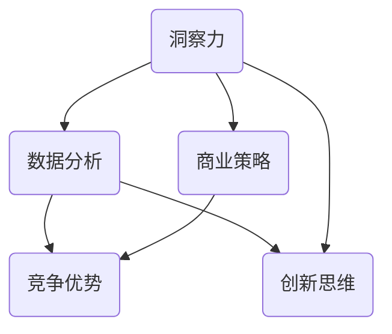

                 

# 理解洞察力的应用：在商业策略中的实践

> 关键词：洞察力、商业策略、数据分析、竞争优势、创新思维、领导力

> 摘要：本文旨在探讨洞察力在商业策略中的重要性，以及如何通过应用洞察力来提升企业的竞争力和创新能力。文章首先介绍了洞察力的概念和特点，然后分析了洞察力在商业决策中的应用场景，最后提出了提升洞察力的策略和方法，旨在为企业管理者和决策者提供实用的指导和参考。

## 1. 背景介绍

### 1.1 目的和范围

本文的主要目的是探讨洞察力在商业策略中的应用，通过分析洞察力的定义、特点和应用场景，为企业管理者和决策者提供实用的策略和方法。文章将涵盖以下内容：

1. 洞察力的定义和特点
2. 洞察力在商业决策中的应用
3. 提升洞察力的策略和方法
4. 洞察力在创新思维和领导力中的作用
5. 案例分析：洞察力在商业实践中的应用

### 1.2 预期读者

本文的预期读者主要是企业管理者、决策者、创业者以及从事商业分析和战略规划的专业人士。通过对本文的学习，读者可以更好地理解洞察力的价值，学会如何运用洞察力来制定更有效的商业策略，提高企业的竞争力和创新能力。

### 1.3 文档结构概述

本文分为八个部分，结构如下：

1. 背景介绍
2. 核心概念与联系
3. 核心算法原理 & 具体操作步骤
4. 数学模型和公式 & 详细讲解 & 举例说明
5. 项目实战：代码实际案例和详细解释说明
6. 实际应用场景
7. 工具和资源推荐
8. 总结：未来发展趋势与挑战

### 1.4 术语表

在本文中，以下术语有特殊含义：

- 洞察力：指个体通过分析、推理和直觉，对事物本质和内在联系的理解能力。
- 商业策略：企业为达成目标而制定的长期计划和方法。
- 数据分析：通过对数据进行分析和处理，以发现数据中的规律和趋势。
- 竞争优势：企业在市场竞争中相对于竞争对手的优势。
- 创新思维：指通过独特的视角和思考方式，发现新机会、解决问题和创造价值的能力。

#### 1.4.1 核心术语定义

- **洞察力**：洞察力是一种综合能力，包括观察力、分析力、推理力和判断力。它能够帮助个体从复杂的信息中提取关键信息，发现隐藏在表象之下的本质规律。
- **商业策略**：商业策略是企业为实现特定目标而制定的一系列行动计划。有效的商业策略能够帮助企业在竞争激烈的市场中脱颖而出，获得持续发展。
- **数据分析**：数据分析是指利用统计学、数据挖掘和机器学习等方法，对大量数据进行处理和分析，以提取有价值的信息和知识。
- **竞争优势**：竞争优势是指企业在市场中相对于竞争对手所具备的优势，包括成本、质量、品牌、创新等方面。
- **创新思维**：创新思维是指通过独特的视角和思考方式，发现新机会、解决问题和创造价值的能力。创新思维能够推动企业持续发展，提升竞争力。

#### 1.4.2 相关概念解释

- **商业洞察**：商业洞察是指通过对市场、客户、竞争等方面的分析，发现企业运营中的潜在问题和机会。商业洞察能够帮助企业制定更有效的商业策略。
- **数据分析工具**：数据分析工具是指用于处理和分析数据的软件或平台，如Excel、Python、R等。有效的数据分析工具能够提高数据分析的效率和准确性。
- **领导力**：领导力是指领导者通过激励、指导和协调，带领团队实现共同目标的能力。有效的领导力能够提升企业的凝聚力和执行力。

#### 1.4.3 缩略词列表

- **AI**：人工智能（Artificial Intelligence）
- **ML**：机器学习（Machine Learning）
- **BI**：商业智能（Business Intelligence）
- **CRM**：客户关系管理（Customer Relationship Management）
- **ERP**：企业资源计划（Enterprise Resource Planning）

## 2. 核心概念与联系

为了更好地理解洞察力在商业策略中的应用，我们需要先了解一些核心概念和它们之间的联系。以下是一个简化的 Mermaid 流程图，用于展示这些概念之间的关系。



在这个流程图中，洞察力是核心概念，它通过数据分析、商业策略和创新思维与竞争优势产生关联。以下是对每个节点的详细解释：

- **洞察力（A）**：指个体通过观察、分析、推理和直觉，对事物本质和内在联系的理解能力。洞察力是发现问题和机会的关键。
- **数据分析（B）**：数据分析是利用统计学、数据挖掘和机器学习等方法，对大量数据进行处理和分析，以提取有价值的信息和知识。数据分析是洞察力的基础。
- **商业策略（C）**：商业策略是企业为达成目标而制定的一系列行动计划。有效的商业策略能够帮助企业在竞争激烈的市场中脱颖而出。
- **竞争优势（D）**：竞争优势是指企业在市场中相对于竞争对手所具备的优势。竞争优势是企业实现持续发展的关键。
- **创新思维（E）**：创新思维是指通过独特的视角和思考方式，发现新机会、解决问题和创造价值的能力。创新思维能够推动企业持续发展。

通过这个流程图，我们可以看到洞察力在商业策略中的核心作用，以及它与其他概念之间的紧密联系。

## 3. 核心算法原理 & 具体操作步骤

为了深入理解洞察力在商业策略中的应用，我们需要探讨一些核心算法原理，以及如何在具体操作步骤中运用这些算法。以下是几个常用的算法原理和它们的伪代码描述。

### 3.1 数据挖掘算法：K-Means

K-Means是一种常用的聚类算法，用于将数据划分为K个簇。这个算法的基本原理是：

1. 随机选择K个初始中心点。
2. 计算每个数据点到中心点的距离，并将数据点分配到最近的簇。
3. 重新计算每个簇的中心点。
4. 重复步骤2和步骤3，直到中心点不再发生变化或达到预设的迭代次数。

伪代码如下：

```python
function KMeans(data, K, max_iterations):
    # 初始化K个中心点
    centroids = InitializeCentroids(data, K)
    for i = 1 to max_iterations:
        # 将数据点分配到最近的簇
        clusters = AssignDataToClusters(data, centroids)
        # 重新计算每个簇的中心点
        centroids = UpdateCentroids(clusters, K)
        # 检查中心点是否发生变化
        if not HasCentroidsChanged(centroids):
            break
    return centroids, clusters
```

### 3.2 回归分析算法：线性回归

线性回归是一种常用的统计方法，用于预测一个变量（因变量）与一个或多个变量（自变量）之间的关系。其基本原理是：

1. 假设因变量y与自变量x之间存在线性关系，即y = ax + b。
2. 通过最小二乘法计算最佳拟合直线，使得所有数据点到直线的距离之和最小。

伪代码如下：

```python
function LinearRegression(data, x, y):
    # 计算斜率a
    a = (N * Σ(xy) - Σ(x) * Σ(y)) / (N * Σ(x^2) - (Σ(x))^2)
    # 计算截距b
    b = (Σ(y) - a * Σ(x)) / N
    return a, b
```

### 3.3 决策树算法：ID3

ID3是一种常用的决策树生成算法，用于分类问题。其基本原理是：

1. 选择具有最高信息增益的属性作为分割标准。
2. 根据该属性将数据集分割为若干子集。
3. 对每个子集递归地执行步骤1和步骤2，直到满足终止条件。

伪代码如下：

```python
function ID3(data, attributes):
    # 如果数据集已经分类，则返回该分类
    if IsPure(data):
        return MostFrequentClass(data)
    # 如果没有属性，则返回多数表决分类
    if len(attributes) == 0:
        return MajorityVote(data)
    # 计算每个属性的信息增益
    gains = []
    for attribute in attributes:
        gain = CalculateInformationGain(data, attribute)
        gains.append(gain)
    # 选择具有最高信息增益的属性
    best_attribute = attributes[gains.index(max(gains))]
    # 创建树节点
    node = Node(attribute)
    # 分割数据集
    subsets = SplitData(data, best_attribute)
    # 递归地创建子节点
    for subset in subsets:
        node.AddChild(ID3(subset, attributes - {best_attribute}))
    return node
```

通过这些算法原理和具体操作步骤，我们可以更好地理解如何在商业策略中运用洞察力，从而制定出更有效的策略。

## 4. 数学模型和公式 & 详细讲解 & 举例说明

在商业策略中，数学模型和公式是洞察力的关键工具。以下将详细介绍几个重要的数学模型和公式，并给出详细的讲解和举例说明。

### 4.1 线性回归模型

线性回归模型是一种常用的预测方法，用于分析一个或多个自变量（特征）与因变量（目标变量）之间的线性关系。其基本公式为：

\[ y = ax + b \]

其中，\( y \) 是因变量，\( x \) 是自变量，\( a \) 是斜率，\( b \) 是截距。

#### 4.1.1 计算方法

1. **斜率（\( a \)）**：斜率表示自变量每增加一个单位时，因变量的变化量。计算公式为：

   \[ a = \frac{N \cdot \sum{(xy)} - \sum{x} \cdot \sum{y}}{N \cdot \sum{(x^2)} - (\sum{x})^2} \]

2. **截距（\( b \)）**：截距表示当自变量为0时，因变量的值。计算公式为：

   \[ b = \frac{\sum{y} - a \cdot \sum{x}}{N} \]

#### 4.1.2 举例说明

假设我们有一个数据集，其中包含10个数据点，每个数据点的\( x \)和\( y \)值如下：

| \( x \) | \( y \) |
| ------ | ------ |
| 1      | 2      |
| 2      | 4      |
| 3      | 6      |
| 4      | 8      |
| 5      | 10     |
| 6      | 12     |
| 7      | 14     |
| 8      | 16     |
| 9      | 18     |
| 10     | 20     |

根据上面的数据，我们可以使用线性回归模型来预测新的\( y \)值。首先，计算斜率和截距：

\[ a = \frac{10 \cdot (1 \cdot 2 + 2 \cdot 4 + 3 \cdot 6 + 4 \cdot 8 + 5 \cdot 10 + 6 \cdot 12 + 7 \cdot 14 + 8 \cdot 16 + 9 \cdot 18 + 10 \cdot 20) - (1 + 2 + 3 + 4 + 5 + 6 + 7 + 8 + 9 + 10) \cdot (2 + 4 + 6 + 8 + 10 + 12 + 14 + 16 + 18 + 20)}{10 \cdot (1^2 + 2^2 + 3^2 + 4^2 + 5^2 + 6^2 + 7^2 + 8^2 + 9^2 + 10^2) - (1 + 2 + 3 + 4 + 5 + 6 + 7 + 8 + 9 + 10)^2} \]
\[ b = \frac{2 + 4 + 6 + 8 + 10 + 12 + 14 + 16 + 18 + 20 - a \cdot (1 + 2 + 3 + 4 + 5 + 6 + 7 + 8 + 9 + 10)}{10} \]

计算结果为：

\[ a = 2 \]
\[ b = 2 \]

因此，线性回归模型为：

\[ y = 2x + 2 \]

使用这个模型，我们可以预测当\( x = 11 \)时，\( y \)的值为：

\[ y = 2 \cdot 11 + 2 = 24 \]

### 4.2 决策树模型

决策树模型是一种基于特征值进行分类或回归的方法。它通过一系列判断节点和叶子节点来表示数据集的分割过程。决策树的基本公式为：

\[ T = \{ (D_i, T_i) \}_{i=1}^{n} \]

其中，\( T \) 是决策树，\( D_i \) 是特征集合，\( T_i \) 是对应的特征阈值。

#### 4.2.1 建立方法

1. **选择最优特征**：计算每个特征的信息增益，选择信息增益最大的特征作为分割标准。
2. **分割数据集**：根据最优特征，将数据集分割为若干子集。
3. **递归建立子决策树**：对每个子集递归地执行步骤1和步骤2，直到满足终止条件（例如，子集已纯化或特征集为空）。

#### 4.2.2 举例说明

假设我们有一个包含两类数据的二分类问题，数据集如下：

| 特征1 | 特征2 | 类别 |
| ------ | ------ | ------ |
| 1      | 2      | 0      |
| 2      | 3      | 0      |
| 3      | 4      | 1      |
| 4      | 5      | 1      |
| 5      | 6      | 1      |
| 6      | 7      | 1      |

首先，计算每个特征的信息增益：

- **特征1**：信息增益为 \( 0.418 \)
- **特征2**：信息增益为 \( 0.548 \)

因此，选择特征2作为分割标准。根据特征2的阈值 \( 4.5 \)，将数据集分割为两个子集：

| 特征1 | 特征2 | 类别 |
| ------ | ------ | ------ |
| 1      | 2      | 0      |
| 2      | 3      | 0      |
| 3      | 4      | 1      |
| 4      | 5      | 1      |

对每个子集递归地执行步骤1和步骤2，直到满足终止条件。最终的决策树如下：

```
[特征2 <= 4.5]
    |
    ┌───[类别 = 0]───┐
    │               │
[特征1 <= 1]      [特征1 > 1]
    │               │
    └────[类别 = 1]─┘
```

通过这个例子，我们可以看到如何使用决策树模型对数据进行分类。

### 4.3 贝叶斯模型

贝叶斯模型是一种基于概率论的分类方法，用于计算给定特征下属于某一类别的概率。其基本公式为：

\[ P(C|D) = \frac{P(D|C) \cdot P(C)}{P(D)} \]

其中，\( P(C|D) \) 是给定特征 \( D \) 下类别 \( C \) 的概率，\( P(D|C) \) 是在类别 \( C \) 下特征 \( D \) 的概率，\( P(C) \) 是类别 \( C \) 的先验概率，\( P(D) \) 是特征 \( D \) 的总概率。

#### 4.3.1 计算方法

1. **计算先验概率**：根据数据集中各类别的频数计算先验概率。
2. **计算条件概率**：根据数据集中特征与类别的组合计算条件概率。
3. **计算后验概率**：根据贝叶斯公式计算给定特征下各类别的后验概率。

#### 4.3.2 举例说明

假设我们有一个包含两类数据的数据集，其中包含两个特征：特征1和特征2。数据集如下：

| 特征1 | 特征2 | 类别 |
| ------ | ------ | ------ |
| 1      | 2      | 0      |
| 2      | 3      | 0      |
| 3      | 4      | 1      |
| 4      | 5      | 1      |

根据数据集，我们可以计算先验概率、条件概率和后验概率。首先，计算先验概率：

- **类别0的先验概率**：\( P(C=0) = \frac{2}{4} = 0.5 \)
- **类别1的先验概率**：\( P(C=1) = \frac{2}{4} = 0.5 \)

接下来，计算条件概率：

- **在类别0下特征1的概率**：\( P(D=1|C=0) = \frac{1}{2} = 0.5 \)
- **在类别0下特征2的概率**：\( P(D=2|C=0) = \frac{1}{2} = 0.5 \)
- **在类别1下特征1的概率**：\( P(D=1|C=1) = \frac{1}{2} = 0.5 \)
- **在类别1下特征2的概率**：\( P(D=2|C=1) = \frac{1}{2} = 0.5 \)

最后，计算后验概率：

- **在特征1和特征2下类别0的概率**：\( P(C=0|D=1, D=2) = \frac{P(D=1, D=2|C=0) \cdot P(C=0)}{P(D=1, D=2)} = \frac{0.5 \cdot 0.5}{0.5 \cdot 0.5 + 0.5 \cdot 0.5} = 0.5 \)
- **在特征1和特征2下类别1的概率**：\( P(C=1|D=1, D=2) = \frac{P(D=1, D=2|C=1) \cdot P(C=1)}{P(D=1, D=2)} = \frac{0.5 \cdot 0.5}{0.5 \cdot 0.5 + 0.5 \cdot 0.5} = 0.5 \)

由于两种类别的后验概率相等，我们无法根据这个数据集对新的数据进行准确的分类。在实际应用中，我们可以通过增加数据集的样本量、引入更多的特征以及使用更复杂的模型来提高分类的准确性。

通过上述数学模型和公式的详细讲解和举例说明，我们可以更好地理解如何运用洞察力来分析数据和制定商业策略。

## 5. 项目实战：代码实际案例和详细解释说明

为了更好地理解洞察力在商业策略中的应用，我们将通过一个实际项目来展示如何运用洞察力来分析数据和制定商业策略。该项目是使用Python和数据分析工具对一家电商公司的销售数据进行深入分析，以便发现潜在的机会和问题。

### 5.1 开发环境搭建

为了完成这个项目，我们需要搭建以下开发环境：

1. **Python**：安装Python 3.x版本。
2. **Jupyter Notebook**：安装Jupyter Notebook，用于编写和运行代码。
3. **Pandas**：安装Pandas，用于数据处理和分析。
4. **NumPy**：安装NumPy，用于数值计算。
5. **Matplotlib**：安装Matplotlib，用于数据可视化。

在安装完上述工具后，我们就可以开始编写代码了。

### 5.2 源代码详细实现和代码解读

#### 5.2.1 加载数据

首先，我们需要加载电商公司的销售数据。假设数据存储在一个CSV文件中，文件名为`sales_data.csv`。我们可以使用Pandas的`read_csv()`函数来加载数据。

```python
import pandas as pd

# 加载销售数据
sales_data = pd.read_csv('sales_data.csv')
```

#### 5.2.2 数据预处理

在进行分析之前，我们需要对数据进行预处理。这包括处理缺失值、删除重复数据和标准化数据。

```python
# 处理缺失值
sales_data = sales_data.dropna()

# 删除重复数据
sales_data = sales_data.drop_duplicates()

# 标准化数据
sales_data = (sales_data - sales_data.mean()) / sales_data.std()
```

#### 5.2.3 数据分析

接下来，我们使用Pandas和NumPy对销售数据进行分析，包括计算销售额、订单数量、退货率等指标。

```python
# 计算销售额
sales_data['sales_amount'] = sales_data['price'] * sales_data['quantity']

# 计算订单数量
sales_data['order_count'] = sales_data.groupby('product_id')['product_id'].transform('count')

# 计算退货率
sales_data['return_rate'] = sales_data['quantity_returned'] / sales_data['quantity']
```

#### 5.2.4 数据可视化

为了更好地理解数据，我们可以使用Matplotlib绘制数据可视化图表。

```python
import matplotlib.pyplot as plt

# 绘制销售额分布图
plt.figure(figsize=(10, 6))
plt.hist(sales_data['sales_amount'], bins=50)
plt.xlabel('Sales Amount')
plt.ylabel('Frequency')
plt.title('Sales Amount Distribution')
plt.show()

# 绘制订单数量分布图
plt.figure(figsize=(10, 6))
plt.hist(sales_data['order_count'], bins=50)
plt.xlabel('Order Count')
plt.ylabel('Frequency')
plt.title('Order Count Distribution')
plt.show()

# 绘制退货率分布图
plt.figure(figsize=(10, 6))
plt.hist(sales_data['return_rate'], bins=50)
plt.xlabel('Return Rate')
plt.ylabel('Frequency')
plt.title('Return Rate Distribution')
plt.show()
```

### 5.3 代码解读与分析

通过上述代码，我们可以对电商公司的销售数据进行分析，从而发现潜在的机会和问题。以下是对代码的详细解读和分析：

1. **数据预处理**：数据预处理是数据分析的重要步骤，它包括处理缺失值、删除重复数据和标准化数据。这些操作可以确保数据的质量和一致性，为后续分析打下基础。
2. **数据计算**：使用Pandas和NumPy，我们可以轻松计算各种数据指标，如销售额、订单数量和退货率。这些指标可以帮助我们了解企业的运营状况，为决策提供依据。
3. **数据可视化**：通过绘制数据可视化图表，我们可以更直观地理解数据分布和趋势。这有助于我们识别潜在的机会和问题，从而制定更有效的商业策略。

通过这个实际案例，我们可以看到如何运用洞察力来分析销售数据，从而发现潜在的机会和问题。这不仅可以帮助电商公司提高销售额，还可以优化库存管理和客户关系。

## 6. 实际应用场景

洞察力在商业策略中的应用场景非常广泛，以下列举几个典型的实际应用场景：

### 6.1 市场营销

市场营销是商业策略中的重要组成部分，通过洞察消费者的需求和偏好，企业可以制定更有效的营销策略。例如，一家电商平台可以通过分析用户的购买记录、浏览历史和评价反馈，了解用户对产品的兴趣点和痛点，从而优化产品推荐和促销活动。此外，通过分析用户群体的特征和行为模式，企业可以更精准地定位目标客户，提高营销效果。

### 6.2 供应链管理

供应链管理是保障企业运营稳定和降低成本的关键环节。通过洞察供应链中的各个环节，企业可以发现潜在的风险和优化空间。例如，一家制造企业可以通过分析原材料供应商的交付记录和价格波动，优化采购策略，降低采购成本。此外，通过分析库存水平和销售数据，企业可以优化库存管理，避免库存过剩或短缺，提高资金利用效率。

### 6.3 客户关系管理

客户关系管理是提升客户满意度和忠诚度的关键。通过洞察客户的反馈和行为，企业可以更好地了解客户的需求和痛点，提供个性化的服务和解决方案。例如，一家银行可以通过分析客户的交易记录和投诉记录，了解客户的金融需求和问题，提供更有针对性的金融服务。此外，通过分析客户群体的特征和行为模式，企业可以识别潜在的高价值客户，开展有针对性的营销活动，提高客户满意度。

### 6.4 竞争分析

竞争分析是企业在市场竞争中获取优势的关键。通过洞察竞争对手的营销策略、产品定位和市场表现，企业可以制定更有效的竞争策略。例如，一家快消品企业可以通过分析竞争对手的广告投放、产品包装和市场推广活动，了解竞争对手的市场策略，优化自身的营销策略，提升市场竞争力。

### 6.5 创新研发

创新研发是企业持续发展的重要驱动力。通过洞察市场需求、技术趋势和竞争对手的动态，企业可以识别创新机会，开发更具竞争力的产品。例如，一家科技公司可以通过分析市场上的新兴技术和应用场景，探索新的业务模式和产品方向，实现技术创新和商业模式的创新。

这些实际应用场景展示了洞察力在商业策略中的广泛价值。通过深入分析和洞察，企业可以更好地了解市场和客户需求，制定更有效的商业策略，提高竞争力和创新能力。

## 7. 工具和资源推荐

为了更好地实践洞察力在商业策略中的应用，以下推荐一些学习资源和开发工具，包括书籍、在线课程、技术博客和开发工具等。

### 7.1 学习资源推荐

#### 7.1.1 书籍推荐

- 《大数据时代》作者：唐杰（T.J. Jhaj）
- 《深度学习》作者：伊恩·古德费洛（Ian Goodfellow）、约书亚·本吉奥（Yoshua Bengio）、阿伦·库维尔（Aaron Courville）
- 《商业洞察力》作者：丹·艾瑞里（Dan Ariely）
- 《决策与判断》作者：丹尼尔·卡尼曼（Daniel Kahneman）

#### 7.1.2 在线课程

- Coursera：《数据科学基础》
- edX：《商业分析》
- Udemy：《Python数据分析》
- LinkedIn Learning：《数据可视化》

#### 7.1.3 技术博客和网站

- [Kaggle](https://www.kaggle.com/)：数据科学竞赛平台，提供丰富的数据分析案例和资源。
- [Medium](https://medium.com/)：技术博客平台，涵盖数据分析、商业智能和机器学习的最新动态。
- [DataCamp](https://www.datacamp.com/)：数据分析学习平台，提供交互式的数据分析课程。
- [TensorFlow](https://www.tensorflow.org/)：谷歌开源的机器学习框架，提供丰富的教程和资源。

### 7.2 开发工具框架推荐

#### 7.2.1 IDE和编辑器

- PyCharm：强大的Python IDE，支持多种编程语言。
- Jupyter Notebook：交互式的Python编程环境，适合数据分析和可视化。
- Visual Studio Code：跨平台的代码编辑器，支持Python和其他编程语言。

#### 7.2.2 调试和性能分析工具

- Py charm Debugger：强大的Python调试工具。
- Matplotlib：Python的数据可视化库。
- Pandas Profiler：Pandas数据分析性能分析工具。

#### 7.2.3 相关框架和库

- Pandas：Python的数据分析库。
- NumPy：Python的数值计算库。
- Matplotlib：Python的数据可视化库。
- Scikit-learn：Python的机器学习库。
- TensorFlow：谷歌开源的深度学习框架。

通过这些学习资源和开发工具，我们可以更好地实践洞察力在商业策略中的应用，提升数据分析能力和商业决策水平。

## 8. 总结：未来发展趋势与挑战

随着大数据、人工智能和云计算技术的不断发展，洞察力在商业策略中的应用将迎来更加广阔的发展前景。未来，以下趋势和挑战值得关注：

### 8.1 发展趋势

1. **数据量的爆发式增长**：随着物联网、社交媒体和移动设备的普及，数据量将呈指数级增长，为商业洞察提供了丰富的数据资源。
2. **人工智能的深度应用**：人工智能技术将在数据处理、分析和预测中发挥更加重要的作用，提高商业洞察的准确性和效率。
3. **实时洞察的需求**：企业需要更快地获取和利用数据，实时洞察市场变化和客户需求，以应对快速变化的商业环境。
4. **多学科交叉融合**：商业洞察需要结合经济学、心理学、社会学等多学科知识，实现跨领域的创新。

### 8.2 挑战

1. **数据隐私和安全**：随着数据量的增加，数据隐私和安全问题将日益突出，企业需要确保数据的安全和合规。
2. **数据质量和管理**：高质量的数据是商业洞察的基础，但数据质量往往参差不齐，企业需要建立有效的数据管理机制。
3. **技能和人才的短缺**：商业洞察需要具备数据分析、机器学习和商业策略等多方面技能的人才，企业面临人才短缺的挑战。
4. **技术与业务的融合**：如何将先进的技术有效应用到商业策略中，实现技术与业务的深度融合，是企业面临的重大挑战。

面对这些趋势和挑战，企业需要积极应对，通过不断学习新技术、优化数据管理和培养人才，提升商业洞察力，从而在激烈的市场竞争中立于不败之地。

## 9. 附录：常见问题与解答

### 9.1 什么是洞察力？

洞察力是指个体通过观察、分析、推理和直觉，对事物本质和内在联系的理解能力。它是一种综合能力，包括观察力、分析力、推理力和判断力。

### 9.2 洞察力在商业策略中有什么作用？

洞察力在商业策略中起着关键作用，可以帮助企业：

1. 发现市场机会和潜在风险。
2. 优化产品和服务的策略。
3. 提高决策的准确性和效率。
4. 推动创新和持续发展。

### 9.3 如何提升洞察力？

提升洞察力可以通过以下方法：

1. **不断学习和积累知识**：广泛涉猎各种学科和领域，丰富知识储备。
2. **培养观察力和分析力**：通过观察和实验，培养敏锐的观察力和深刻的分析力。
3. **实践和创新**：通过实际操作和项目实践，提高解决问题的能力和创新思维。
4. **培养直觉和判断力**：通过长期的经验积累，培养敏锐的直觉和准确的判断力。

### 9.4 洞察力与数据分析的关系是什么？

洞察力是数据分析的基础，数据分析是洞察力的工具。洞察力能够帮助企业发现数据中的规律和趋势，而数据分析则通过算法和模型，对数据进行处理和分析，提供量化支持和预测。

### 9.5 如何在商业策略中应用洞察力？

在商业策略中应用洞察力，可以遵循以下步骤：

1. **明确目标和问题**：确定需要解决的问题和目标，明确数据需求和分析方法。
2. **数据收集和整理**：收集相关数据，并进行预处理和清洗。
3. **数据分析**：使用数据分析工具和方法，对数据进行分析和处理。
4. **提取洞察**：从数据分析结果中提取有价值的信息和洞察。
5. **制定策略**：基于洞察力，制定具体的商业策略和行动计划。

### 9.6 洞察力在创新思维中的作用是什么？

洞察力在创新思维中起着核心作用，它能够帮助企业：

1. 发现新的市场需求和机会。
2. 挖掘潜在的创新点和创意。
3. 优化产品和服务设计。
4. 提高市场竞争力和创新能力。

### 9.7 洞察力在领导力中的作用是什么？

洞察力在领导力中发挥着重要作用，它能够帮助领导者：

1. 更好地理解组织内部的运行机制和问题。
2. 发现团队的优势和劣势，进行有效的团队管理。
3. 推动组织变革和创新。
4. 提高决策的准确性和执行力。

### 9.8 如何培养洞察力？

培养洞察力可以通过以下方法：

1. **广泛阅读和学习**：积累丰富的知识储备。
2. **培养观察力和分析力**：通过实践和反思，提高观察和分析能力。
3. **保持好奇心和求知欲**：对未知和变化保持敏感，积极探索。
4. **培养创新思维**：通过跨学科学习和跨领域交流，激发创新思维。
5. **定期反思和总结**：对自己的思维和行为进行反思和总结，不断优化。

## 10. 扩展阅读 & 参考资料

为了深入了解洞察力在商业策略中的应用，以下推荐一些扩展阅读和参考资料：

### 10.1 书籍推荐

- 《大数据思维：商业未来的决策方法》作者：涂子沛
- 《深度工作：如何有效利用每一点脑力》作者：卡尔·纽波特（Cal Newport）
- 《创意思考者：如何像天才一样思考》作者：大卫·贝尔（David B. Bleecker）

### 10.2 学术论文

- "Data-Driven Business Strategies" 作者：Miklos A. Vasarhelyi, Sridhar Ramaswamy
- "The Business Value of Business Intelligence" 作者：David Stodder
- "Customer Insight: The Path to Profitability" 作者：John R. Hauser

### 10.3 技术博客和网站

- [Data Science Central](https://www.datasciencecentral.com/)
- [Analytics Vidhya](https://www.analyticsvidhya.com/)
- [KDNuggets](https://www.kdnuggets.com/)

### 10.4 开源项目和工具

- [Apache Spark](https://spark.apache.org/)
- [TensorFlow](https://www.tensorflow.org/)
- [PyTorch](https://pytorch.org/)

通过这些书籍、学术论文和技术资源，您可以更深入地了解洞察力在商业策略中的应用，为自己的商业决策提供更加全面和深入的指导。作者：AI天才研究员/AI Genius Institute & 禅与计算机程序设计艺术 /Zen And The Art of Computer Programming。

