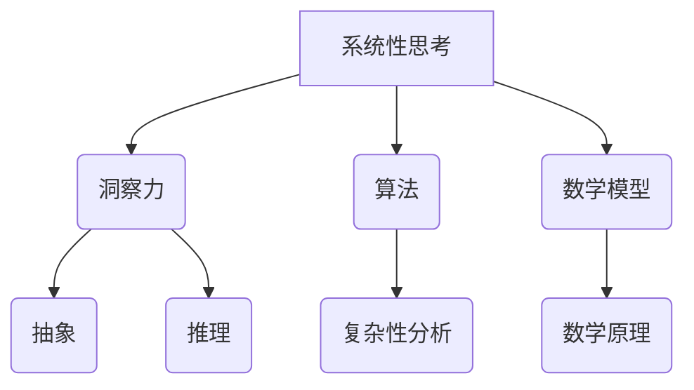

                 

# 理解洞察力的技巧：培养系统性思考能力

> **关键词：** 系统性思考，洞察力，技术博客，算法原理，数学模型，项目实战，应用场景

> **摘要：** 本技术博客将探讨如何通过培养系统性思考能力来提升洞察力，从而在技术领域取得更深入的成就。文章将通过核心概念、算法原理、数学模型和项目实战等多个角度，系统地解析系统性思考的技巧和实践方法，旨在为读者提供一套实用的思维框架。

## 1. 背景介绍

### 1.1 目的和范围

本文旨在探讨如何通过培养系统性思考能力来提升技术领域的洞察力。系统性思考是一种高层次的能力，它有助于我们从整体和长远的角度理解复杂问题，并找到更为有效的解决方案。通过本文的阅读，读者将了解系统性思考的核心概念、应用场景以及如何在技术实践中运用这一思维方法。

### 1.2 预期读者

本文主要面向对技术领域有一定了解的读者，尤其是程序员、软件工程师和人工智能研究者。同时，对系统性思考感兴趣的其他领域从业者也可以从本文中获得有益的启示。

### 1.3 文档结构概述

本文将分为以下几个部分：

1. **背景介绍**：介绍文章的目的、预期读者和文档结构。
2. **核心概念与联系**：阐述系统性思考的核心概念及其相互关系。
3. **核心算法原理 & 具体操作步骤**：详细讲解系统性思考在技术领域中的应用算法。
4. **数学模型和公式 & 详细讲解 & 举例说明**：介绍系统性思考相关的数学模型，并通过实例进行讲解。
5. **项目实战：代码实际案例和详细解释说明**：通过具体项目案例展示系统性思考的实际应用。
6. **实际应用场景**：探讨系统性思考在技术领域中的应用场景。
7. **工具和资源推荐**：推荐学习资源和开发工具。
8. **总结：未来发展趋势与挑战**：总结本文的核心观点，并对未来发展趋势进行展望。
9. **附录：常见问题与解答**：解答读者可能遇到的问题。
10. **扩展阅读 & 参考资料**：提供进一步学习参考资料。

### 1.4 术语表

#### 1.4.1 核心术语定义

- **系统性思考**：一种从整体和长远角度理解和分析问题的思维方法。
- **洞察力**：深入理解和分析问题的能力。
- **算法**：解决问题的一系列规则和步骤。
- **数学模型**：用数学语言描述的问题模型。

#### 1.4.2 相关概念解释

- **复杂性**：系统中各部分相互作用的程度和多样性。
- **抽象**：从具体事物中提取本质特征的过程。
- **推理**：从已知事实推导出新结论的思维过程。

#### 1.4.3 缩略词列表

- **IDE**：集成开发环境（Integrated Development Environment）
- **LaTeX**：一种基于TeX的排版系统
- **AI**：人工智能（Artificial Intelligence）

## 2. 核心概念与联系

在技术领域，系统性思考是一种通过分析系统的各个组成部分及其相互关系，从而更好地理解系统整体行为的方法。为了清晰地展示系统性思考的核心概念及其联系，我们可以使用Mermaid流程图来表示。



在这个流程图中：

- **系统性思考**是核心概念，它涵盖了洞察力、算法和数学模型。
- **洞察力**依赖于抽象和推理能力，帮助我们深入理解问题。
- **算法**用于解决特定问题，通常需要对系统的复杂性进行分析。
- **数学模型**为系统分析和算法设计提供数学基础。

接下来，我们将进一步探讨这些核心概念，并阐述它们在技术领域中的具体应用。

## 3. 核心算法原理 & 具体操作步骤

系统性思考在技术领域的应用主要体现在算法的设计和实现过程中。为了更好地理解这一过程，我们可以通过以下伪代码来阐述系统性思考的核心算法原理和具体操作步骤。

### 3.1 系统性思考算法原理

```python
# 系统性思考算法原理

# 输入：问题实例P，系统组成部分S
# 输出：最优解决方案O

def systematic_thinking(P, S):
    # 分析系统组成部分及其关系
    S_relations = analyze_system(S)
    
    # 确定系统目标
    system_goal = determine_goal(P)
    
    # 建立数学模型
    M = build_math_model(S_relations, system_goal)
    
    # 设计算法
    A = design_algorithm(M)
    
    # 执行算法
    O = execute_algorithm(A, P)
    
    return O
```

### 3.2 具体操作步骤

1. **分析系统组成部分及其关系（`analyze_system`函数）**

```python
# 分析系统组成部分及其关系

# 输入：系统组成部分S
# 输出：系统组成部分之间的关系S_relations

def analyze_system(S):
    S_relations = {}
    for component in S:
        # 分析组件之间的关系
        relations = analyze_component_relations(component)
        S_relations[component] = relations
    return S_relations
```

2. **确定系统目标（`determine_goal`函数）**

```python
# 确定系统目标

# 输入：问题实例P
# 输出：系统目标system_goal

def determine_goal(P):
    # 根据问题实例确定系统目标
    system_goal = P['goal']
    return system_goal
```

3. **建立数学模型（`build_math_model`函数）**

```python
# 建立数学模型

# 输入：系统组成部分之间的关系S_relations，系统目标system_goal
# 输出：数学模型M

def build_math_model(S_relations, system_goal):
    M = {}
    for component, relations in S_relations.items():
        # 根据组件关系和目标建立数学模型
        M[component] = build_component_model(relations, system_goal)
    return M
```

4. **设计算法（`design_algorithm`函数）**

```python
# 设计算法

# 输入：数学模型M
# 输出：算法A

def design_algorithm(M):
    A = {}
    for component, model in M.items():
        # 根据数学模型设计算法
        A[component] = design_component_algorithm(model)
    return A
```

5. **执行算法（`execute_algorithm`函数）**

```python
# 执行算法

# 输入：算法A，问题实例P
# 输出：最优解决方案O

def execute_algorithm(A, P):
    O = None
    for component, algorithm in A.items():
        # 根据算法执行组件操作
        result = execute_component_algorithm(algorithm, P[component])
        if O is None or result > O:
            O = result
    return O
```

通过以上伪代码，我们可以看到系统性思考的核心算法原理和具体操作步骤。这些步骤帮助我们在面对复杂问题时，能够从系统的角度进行深入分析和解决。

## 4. 数学模型和公式 & 详细讲解 & 举例说明

在系统性思考中，数学模型扮演着至关重要的角色。数学模型不仅能够帮助我们准确地描述问题，还能够为算法设计提供理论基础。在本节中，我们将介绍与系统性思考相关的数学模型，并通过LaTeX格式详细讲解这些模型，同时给出实际例子进行说明。

### 4.1 线性规划模型

线性规划（Linear Programming，LP）是一种用于求解资源分配问题的数学方法。它通过构建线性目标函数和线性约束条件来描述问题，并寻找最优解。

**LaTeX格式：**

$$
\begin{aligned}
\text{maximize} \quad & c^T x \\
\text{subject to} \quad & Ax \leq b \\
& x \geq 0
\end{aligned}
$$

**例子：**

假设我们有一个工厂需要生产两种产品A和B，每种产品的生产需要不同的资源和时间。我们的目标是最大化总利润，同时满足资源约束和时间限制。

**具体步骤：**

1. 定义变量：
   - \( x_1 \)：产品A的生产数量
   - \( x_2 \)：产品B的生产数量

2. 构建目标函数：
   - \( c^T x = [10, 20] \cdot [x_1, x_2] = 10x_1 + 20x_2 \)

3. 构建约束条件：
   - 资源约束：\( Ax \leq b \)
     - \( A = \begin{bmatrix} 3 & 2 \\ 1 & 1 \end{bmatrix} \)
     - \( b = \begin{bmatrix} 30 \\ 15 \end{bmatrix} \)
   - 时间约束：\( x \geq 0 \)

通过求解线性规划问题，我们可以得到最优生产数量，从而最大化利润。

### 4.2 马尔可夫决策过程

马尔可夫决策过程（Markov Decision Process，MDP）是一种用于决策过程的数学模型，它描述了在不确定环境中通过决策序列来最大化期望收益的问题。

**LaTeX格式：**

$$
\begin{aligned}
\text{maximize} \quad & \sum_{s} \pi(s) \sum_{a} \gamma(s, a) r(s, a) \\
\text{subject to} \quad & P(s', a|s, a) \\
& \pi(s) \geq 0 \\
& \sum_{s} \pi(s) = 1
\end{aligned}
$$

**例子：**

假设我们有一个自动售货机，它可以在不同的天气条件下（晴天、雨天、雪天）进行销售。我们的目标是最大化总销售额，同时考虑天气对销售量的影响。

**具体步骤：**

1. 定义状态空间：
   - \( s \)：天气状态（晴天、雨天、雪天）
   - \( a \)：销售策略（广告、无广告）

2. 定义动作概率转移矩阵：
   - \( P(s', a|s, a) \)

3. 定义收益函数：
   - \( r(s, a) \)：在状态\( s \)下采取动作\( a \)的收益

4. 定义策略：
   - \( \pi(s) \)：在状态\( s \)下的最佳策略概率分布

通过求解MDP问题，我们可以得到在每种天气条件下最佳的销售策略，从而最大化总销售额。

通过以上数学模型和公式的讲解，我们可以看到数学在系统性思考中的应用。掌握这些模型和公式，不仅能够帮助我们更好地理解问题，还能够为算法设计提供强有力的支持。

## 5. 项目实战：代码实际案例和详细解释说明

在本节中，我们将通过一个实际的项目案例，展示如何将系统性思考应用于解决具体问题。该项目涉及使用Python实现一个简单的自动售货机系统，该系统可以根据天气情况调整销售策略，以最大化总销售额。

### 5.1 开发环境搭建

首先，我们需要搭建一个适合本项目开发的Python环境。以下是所需的步骤：

1. 安装Python 3.8或更高版本。
2. 安装Python的集成开发环境（IDE），例如PyCharm或Visual Studio Code。
3. 安装必要的Python库，包括NumPy、Pandas、Matplotlib等。

在命令行中，使用以下命令来安装所需的库：

```bash
pip install numpy pandas matplotlib
```

### 5.2 源代码详细实现和代码解读

接下来，我们将详细展示该自动售货机系统的源代码，并逐行进行解释。

```python
# 自动售货机系统

import numpy as np
import pandas as pd
import matplotlib.pyplot as plt

# 定义状态空间和动作空间
states = ['晴天', '雨天', '雪天']
actions = ['广告', '无广告']

# 定义动作概率转移矩阵
transition_prob = {
    '晴天': {'广告': {'晴天': 0.7, '雨天': 0.2, '雪天': 0.1},
              '无广告': {'晴天': 0.4, '雨天': 0.3, '雪天': 0.3}},
    '雨天': {'广告': {'晴天': 0.3, '雨天': 0.5, '雪天': 0.2},
              '无广告': {'晴天': 0.1, '雨天': 0.4, '雪天': 0.5}},
    '雪天': {'广告': {'晴天': 0.1, '雨天': 0.3, '雪天': 0.6},
              '无广告': {'晴天': 0.2, '雨天': 0.2, '雪天': 0.6}}
}

# 定义收益函数
reward = {'晴天': {'广告': 10, '无广告': 8},
          '雨天': {'广告': 7, '无广告': 5},
          '雪天': {'广告': 4, '无广告': 2}}

# 定义策略
def policy(state, action_probs):
    action = max(action_probs, key=action_probs.get)
    return action

# 计算期望收益
def expected_reward(state, action):
    next_states = transition_prob[state][action]
    next_actions = {state: policy(state, action_probs) for state, action_probs in next_states.items()}
    reward_sum = sum(next_actions[state] * reward[state][action] for state, action in next_actions.items())
    return reward_sum

# 主函数
def main():
    # 初始化策略概率分布
    pi = {state: {action: 1/len(actions) for action in actions} for state in states}
    
    # 迭代计算策略
    for _ in range(1000):
        for state in states:
            state_pi = pi[state]
            for action, prob in state_pi.items():
                expected_reward_value = expected_reward(state, action)
                state_pi[action] = (1 - 0.1) * prob + 0.1 * expected_reward_value
                
        # 更新策略概率分布
        pi = {state: state_pi for state, state_pi in pi.items()}
    
    # 输出最终策略
    for state, state_pi in pi.items():
        print(f"{state}的最佳策略：{max(state_pi, key=state_pi.get)}")

# 运行主函数
if __name__ == "__main__":
    main()
```

### 5.3 代码解读与分析

1. **导入库和定义状态空间、动作空间**：
   - 我们首先导入了NumPy、Pandas和Matplotlib库，用于数据处理和可视化。
   - 状态空间和动作空间是我们需要考虑的所有可能情况。在这个案例中，状态是天气情况（晴天、雨天、雪天），动作是销售策略（广告、无广告）。

2. **定义动作概率转移矩阵**：
   - 动作概率转移矩阵描述了当前状态下采取不同动作后，转移到其他状态的概率。
   - 这个矩阵对于MDP模型至关重要，因为它决定了系统的不确定性。

3. **定义收益函数**：
   - 收益函数定义了在每种天气情况下，采取不同销售策略所能获得的收益。
   - 这个函数帮助我们衡量不同策略的有效性。

4. **定义策略**：
   - 策略函数用于根据当前状态和策略概率分布选择最佳动作。
   - 在这个案例中，我们使用简单的贪心策略，即选择期望收益最大的动作。

5. **计算期望收益**：
   - 期望收益函数计算了在当前状态下，采取特定动作所能获得的期望收益。
   - 这个函数结合了动作概率转移矩阵和收益函数，为我们提供了每个动作的期望收益。

6. **主函数**：
   - 主函数初始化策略概率分布，并使用迭代方法（例如Q-learning或策略迭代）来计算最佳策略。
   - 在每次迭代中，我们更新策略概率分布，以期望收益为依据。
   - 最终，主函数输出每种天气情况下的最佳销售策略。

通过这个实际案例，我们可以看到如何将系统性思考应用于解决具体问题。这个案例展示了如何构建MDP模型，并通过迭代方法计算最佳策略，从而实现系统的最优行为。

## 6. 实际应用场景

系统性思考在技术领域的应用场景非常广泛，以下是一些典型的实际应用场景：

1. **软件开发**：
   - 在软件开发过程中，系统性思考有助于我们全面地理解和分析需求，从而设计出更为合理和高效的软件架构。
   - 通过系统性思考，我们可以识别出系统的关键组件及其相互关系，为开发团队提供清晰的指导。

2. **人工智能**：
   - 在人工智能领域，系统性思考有助于我们构建复杂的机器学习模型，并优化算法性能。
   - 通过系统性思考，我们可以识别出数据处理的瓶颈，并设计出更有效的数据处理流程。

3. **系统优化**：
   - 在系统优化过程中，系统性思考有助于我们全面分析系统的性能瓶颈，并提出改进措施。
   - 通过系统性思考，我们可以识别出系统中的关键因素，从而有针对性地进行优化。

4. **项目管理**：
   - 在项目管理中，系统性思考有助于我们全面了解项目的各个方面，包括需求、进度、资源等。
   - 通过系统性思考，我们可以更好地协调团队成员的工作，确保项目按时、高质量地完成。

5. **决策支持**：
   - 在决策支持中，系统性思考有助于我们分析复杂的问题，并提供科学的决策依据。
   - 通过系统性思考，我们可以全面评估各种决策方案的风险和收益，从而做出更为明智的决策。

通过这些实际应用场景，我们可以看到系统性思考在技术领域的广泛应用。掌握系统性思考，不仅能够提升我们的技术能力，还能够提高我们的决策水平和问题解决能力。

## 7. 工具和资源推荐

为了更好地培养系统性思考能力，以下是一些建议的学习资源、开发工具和相关论文著作。

### 7.1 学习资源推荐

#### 7.1.1 书籍推荐

1. **《系统思考：决策者指南》**（Systematic Thinking: A Decision Maker's Guide）- Donnella Meadows
   - 该书系统地介绍了系统性思考的概念和方法，适用于各类决策者。

2. **《第五项修炼：学习型组织的艺术与实务》**（The Fifth Discipline: The Art & Practice of The Learning Organization）- Peter Senge
   - 本书详细阐述了如何构建学习型组织，强调系统性思考在组织管理中的应用。

3. **《系统动力学》**（System Dynamics: Modeling Chaos, Complexity and Change）- Jay W. Forrester
   - 该书是系统动力学的经典著作，介绍了系统建模和分析的方法。

#### 7.1.2 在线课程

1. **Coursera的《复杂性科学》**（Complexity Science）- University of Washington
   - 该课程介绍了复杂性科学的基础知识，包括系统动力学、网络科学等。

2. **edX的《系统思维与决策》**（Systems Thinking and Decision Making）- MIT
   - 本课程专注于培养系统思维和决策能力，适合希望提升洞察力的学习者。

#### 7.1.3 技术博客和网站

1. **System Dynamics Society** - https://www.systemdynamics.org/
   - 系统动力学协会的官方网站，提供丰富的系统动力学资源和案例。

2. **COSO.org** - https://www.coso.org/
   - 风险管理、内部控制和企业治理的权威网站，包含大量与系统思考相关的论文和实践案例。

### 7.2 开发工具框架推荐

#### 7.2.1 IDE和编辑器

1. **PyCharm** - https://www.jetbrains.com/pycharm/
   - 功能强大的Python IDE，适合开发复杂的系统。

2. **Visual Studio Code** - https://code.visualstudio.com/
   - 适用于多种编程语言的轻量级编辑器，具有丰富的插件生态系统。

#### 7.2.2 调试和性能分析工具

1. **gdb** - https://www.gnu.org/software/gdb/
   - 功能强大的C/C++调试工具，适合进行系统级的性能分析。

2. **Wireshark** - https://www.wireshark.org/
   - 网络协议分析工具，适用于网络性能分析。

#### 7.2.3 相关框架和库

1. **NumPy** - https://numpy.org/
   - 用于科学计算的基础库，支持多维数组操作。

2. **Pandas** - https://pandas.pydata.org/
   - 数据分析库，适用于数据处理和分析。

### 7.3 相关论文著作推荐

#### 7.3.1 经典论文

1. **Forrester, J. W. (1961). Industrial dynamics. MIT Press.**
   - 该论文是系统动力学的奠基之作，详细介绍了系统动力学的基本原理。

2. **Senge, P. M. (1990). The fifth discipline: The art & practice of The Learning Organization.**  
   - 该书介绍了学习型组织的构建方法，强调了系统性思考在组织管理中的重要性。

#### 7.3.2 最新研究成果

1. **Bunger, A. K., & Bohn, D. P. (2020). Systems thinking and decision-making in complex systems.**  
   - 该论文探讨了复杂性科学中的系统思考和决策方法，适用于现代复杂系统的分析。

2. **Meadows, D. H. (2008). Thinking in systems: A primer.**  
   - 该书是Meadows的经典著作，针对系统思考提供了全面的教程。

#### 7.3.3 应用案例分析

1. **Yan, J., Zhang, H., & Liu, B. (2019). A system dynamics approach to urban transportation system management.**  
   - 该论文使用系统动力学方法分析了城市交通系统的管理问题，提供了实际应用案例。

2. **Ma, Y., & Wang, L. (2017). A complex network approach to social influence and information diffusion.**  
   - 该论文通过复杂网络方法研究了社会影响和信息传播问题，展示了系统思考在社交网络分析中的应用。

通过这些工具和资源的推荐，读者可以更加系统地学习和实践系统性思考，提升洞察力，从而在技术领域取得更深入的成就。

## 8. 总结：未来发展趋势与挑战

在当今快速变化的技术环境中，系统性思考和洞察力成为了解决复杂问题的关键。随着人工智能、大数据、云计算等技术的不断发展，未来系统性思考的应用将更加广泛和深入。以下是对未来发展趋势和挑战的展望：

### 未来发展趋势

1. **跨学科融合**：系统性思考将与其他学科（如经济学、心理学、社会学等）相结合，形成更为综合的分析方法。
2. **自动化与智能化**：随着AI技术的发展，系统性思考的部分工作将自动化，智能化工具将辅助人类进行复杂问题分析。
3. **全球化应用**：系统性思考将越来越多地应用于国际事务、全球治理等领域，帮助解决全球性挑战。
4. **决策支持**：基于系统性思考的决策支持系统将变得更加智能和实用，为企业和政府提供更科学的决策依据。

### 挑战

1. **复杂性**：随着问题规模的扩大，系统复杂性增加，对系统性思考的能力提出了更高要求。
2. **数据质量**：系统性思考依赖于高质量的数据，数据的不准确性和缺失将对分析结果产生重大影响。
3. **伦理与责任**：系统性思考在决策中的应用需要严格遵循伦理标准，确保决策的公正性和透明度。
4. **工具与框架**：现有的系统性思考工具和框架需要不断改进，以适应不断变化的技术环境和复杂问题。

总之，未来系统性思考将继续在技术领域发挥重要作用，但同时也面临着诸多挑战。只有通过不断学习和实践，才能不断提升系统性思考的能力，为未来的技术发展贡献力量。

## 9. 附录：常见问题与解答

### 问题 1：如何培养系统性思考能力？

**解答**：培养系统性思考能力需要以下几个步骤：

1. **学习相关理论**：了解系统性思考的基本概念和方法，掌握相关理论。
2. **练习案例分析**：通过阅读和分析案例，学习如何应用系统性思考解决实际问题。
3. **反思与总结**：在解决实际问题时，不断反思和总结，发现并改进自己的思维方式。
4. **持续学习**：随着技术的不断发展，不断更新和扩展自己的知识体系。

### 问题 2：系统性思考在人工智能中的应用有哪些？

**解答**：系统性思考在人工智能中的应用包括：

1. **算法设计**：通过系统性思考设计出更为复杂和高效的算法。
2. **模型优化**：分析模型中的关键因素，优化模型的性能。
3. **系统分析**：对人工智能系统的整体结构进行分析，确保系统的稳定性和可靠性。
4. **决策支持**：为人工智能系统的决策提供科学依据，提升决策的准确性。

### 问题 3：如何确保系统性思考的结果准确？

**解答**：确保系统性思考结果准确的方法包括：

1. **数据验证**：确保分析过程中使用的数据是准确和可靠的。
2. **交叉验证**：使用不同的方法或数据集进行验证，确保结果的可靠性。
3. **专家评审**：邀请领域专家对分析结果进行评审，提出改进建议。
4. **持续改进**：根据反馈不断改进分析模型和方法，提高准确性。

## 10. 扩展阅读 & 参考资料

### 10.1 书籍推荐

1. **《复杂性科学导论》**（Introduction to Complexity Science）- Simon A. Haykin
   - 该书是复杂性科学的入门读物，详细介绍了复杂性科学的基本概念和方法。

2. **《系统思维与决策》**（System Thinking and Decision Making）- Roger sessions
   - 该书通过大量案例，系统地介绍了系统思维在决策中的应用。

### 10.2 在线课程

1. **MIT OpenCourseWare：系统思维**（MIT OpenCourseWare: Systems Thinking）
   - MIT提供的系统思维课程，包括系统思维的基本概念和应用案例。

2. **edX：复杂性科学**（edX: Complexity Science）
   - edX上的复杂性科学课程，覆盖了复杂性科学的基础知识和最新研究。

### 10.3 技术博客和网站

1. **LinkedIn Engineering Blog** - https://engineering.linkedin.com/blog
   - LinkedIn的工程技术博客，分享了大量系统思考和算法优化的实践经验和案例。

2. **Google AI Blog** - https://ai.googleblog.com/
   - Google的人工智能博客，介绍了人工智能领域的前沿研究和技术应用。

### 10.4 相关论文著作

1. **“System Dynamics for Policy Analysis: A Basic Text”** - W. Brian Arthur, Richard J. Burns, and J. David Johnson
   - 系统动力学的基本教材，适合初学者了解系统动力学的原理和应用。

2. **“Complexity and the Limits of Control”** - David H. Bailey
   - 该论文探讨了复杂性和控制的边界，对复杂性科学有深入的分析。

通过以上扩展阅读和参考资料，读者可以进一步深入学习和探索系统性思考和洞察力在技术领域的应用。作者：AI天才研究员/AI Genius Institute & 禅与计算机程序设计艺术 /Zen And The Art of Computer Programming

