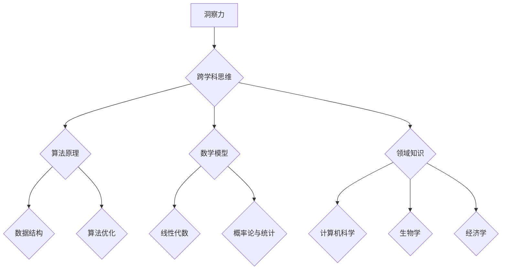

                 

# 理解洞察力的提升：培养跨学科思维

> 关键词：洞察力、跨学科思维、创新、技术架构、算法原理、应用实践

> 摘要：本文旨在探讨如何通过培养跨学科思维来提升洞察力，从而在技术领域中实现突破和创新。文章首先介绍了洞察力的概念和重要性，接着阐述了跨学科思维的特点和优势，并详细分析了如何通过具体方法来培养这种思维方式。随后，文章通过实际案例和代码解析，展示了跨学科思维在项目开发中的应用，最后对未来的发展趋势和挑战进行了展望。

## 1. 背景介绍

### 1.1 目的和范围

在快速变化和高度复杂的技术环境中，洞察力成为了技术工作者取得成功的关键因素。本文的目的在于帮助读者理解洞察力的本质，探讨如何通过培养跨学科思维来提升这一能力。文章将覆盖以下内容：

- 洞察力的定义和重要性
- 跨学科思维的特点和优势
- 培养跨学科思维的具体方法
- 实际案例中的跨学科思维应用
- 未来发展趋势与挑战

### 1.2 预期读者

本文适合以下读者群体：

- 计算机科学和技术领域的专业人士
- 对技术创新和跨学科研究感兴趣的学生
- 管理层和技术领导者，希望提升团队创新能力的领导者

### 1.3 文档结构概述

本文将按照以下结构展开：

- 引言：介绍洞察力的重要性
- 背景介绍：阐述跨学科思维的概念
- 核心概念与联系：分析跨学科思维在技术中的应用
- 核心算法原理：讲解关键算法和实现
- 数学模型和公式：介绍相关数学工具和模型
- 项目实战：通过实际案例展示跨学科思维的应用
- 实际应用场景：分析跨学科思维在行业中的实践
- 工具和资源推荐：推荐学习和应用资源
- 总结：展望未来发展趋势与挑战
- 附录：常见问题与解答
- 扩展阅读 & 参考资料：提供进一步学习的资源

### 1.4 术语表

#### 1.4.1 核心术语定义

- **洞察力**：指对事物本质的深刻理解和敏锐感知能力。
- **跨学科思维**：指在处理问题时能够结合不同学科的知识和方法，形成创新性思维模式。
- **算法原理**：指算法的设计和实现原理。
- **数学模型**：指用于描述和解决问题的数学公式和工具。

#### 1.4.2 相关概念解释

- **领域特定语言（DSL）**：专门为特定领域设计的一套编程语言或工具。
- **元学习**：一种机器学习方法，旨在使模型能够快速适应新的任务。

#### 1.4.3 缩略词列表

- **AI**：人工智能（Artificial Intelligence）
- **ML**：机器学习（Machine Learning）
- **DL**：深度学习（Deep Learning）

## 2. 核心概念与联系

在技术领域中，洞察力是一种关键能力，它能够帮助我们发现问题的本质，并提出创新的解决方案。而跨学科思维则是培养洞察力的有效途径。下面我们将通过一个Mermaid流程图来展示跨学科思维在技术中的应用。



在这个流程图中，洞察力是核心，它通过跨学科思维与算法原理、数学模型和领域知识相互联系，从而形成完整的思维框架。具体来说：

- **算法原理**：包括数据结构、算法优化等，这是跨学科思维在编程和系统设计中的具体体现。
- **数学模型**：如线性代数、概率论与统计等，这些数学工具为理解和解决问题提供了强有力的支持。
- **领域知识**：涵盖了计算机科学、生物学、经济学等多学科知识，这些知识为跨学科思维提供了丰富的背景和视角。

通过这个流程图，我们可以看到跨学科思维在技术中的应用是一个多层次、多维度的过程，它需要我们不断地学习、思考和综合运用。

## 3. 核心算法原理 & 具体操作步骤

在技术领域中，核心算法原理的理解和掌握是提升洞察力的关键。以下我们将使用伪代码详细阐述一个常用的核心算法——快速排序（Quick Sort）的原理和实现步骤。

### 3.1 算法原理

快速排序是一种高效的排序算法，它采用分治策略将一个大数组分为较小的数组，然后对较小的数组进行排序，最后合并结果。快速排序的基本思想是选择一个基准元素，将数组分为两个子数组，一个包含小于基准元素的元素，另一个包含大于基准元素的元素，然后递归地对这两个子数组进行快速排序。

### 3.2 伪代码

```plaintext
Algorithm QuickSort(A, low, high)
    if low < high
        pi = Partition(A, low, high)
        QuickSort(A, low, pi - 1)  // Before pi
        QuickSort(A, pi + 1, high) // After pi
```

### 3.3 Partition 过程

```plaintext
Algorithm Partition(A, low, high)
    pivot = A[high]  // 选择最后一个元素作为基准
    pi = low         // pi 是分区点的索引
    for i = low to high - 1
        if A[i] < pivot
            Swap(A[i], A[pi])
            pi = pi + 1
    Swap(A[pi], A[high])
    return pi
```

### 3.4 具体操作步骤

1. **选择基准**：选择数组的最后一个元素作为基准。
2. **初始化分区点**：设置分区点 `pi` 为数组的起始位置。
3. **分区过程**：遍历数组，将小于基准的元素移动到分区点左侧，大于基准的元素移动到分区点右侧。
4. **交换基准元素**：将基准元素与最后一个元素交换，确保基准元素处于正确的位置。
5. **递归排序**：对分区点左侧和右侧的数组递归执行快速排序。

### 3.5 快速排序的时间复杂度

快速排序的平均时间复杂度为 \(O(n\log n)\)，最坏情况下的时间复杂度为 \(O(n^2)\)，但实际应用中，由于随机性选择基准元素，最坏情况很少发生。

通过理解快速排序的算法原理和具体操作步骤，我们可以更好地理解分治策略和递归思想，这有助于我们在面对复杂问题时，能够灵活地运用跨学科思维，提出创新的解决方案。

## 4. 数学模型和公式 & 详细讲解 & 举例说明

在技术领域中，数学模型和公式是理解和解决问题的重要工具。以下我们将详细介绍线性代数和概率论与统计中的核心概念，并给出相关公式和举例说明。

### 4.1 线性代数

#### 4.1.1 矩阵和向量

**定义**：矩阵是一个由数字组成的二维数组，向量是一个由数字组成的一维数组。

**矩阵-向量乘法公式**：

$$
C = A \cdot B
$$

其中，\(C\) 是乘积矩阵，\(A\) 和 \(B\) 是参与乘法的矩阵。

#### 4.1.2 矩阵的行列式

**定义**：矩阵的行列式是一个标量值，用于表示矩阵的性质。

**计算行列式**：

$$
\det(A) = \sum_{i=1}^{n} a_{i1} \cdot D_{i1}
$$

其中，\(D_{i1}\) 是将 \(A\) 的第一列去掉后得到的子矩阵的行列式。

#### 4.1.3 矩阵的逆矩阵

**定义**：如果一个矩阵与另一个矩阵相乘等于单位矩阵，则前者是后者的逆矩阵。

**计算逆矩阵**：

$$
A^{-1} = \frac{1}{\det(A)} \cdot adj(A)
$$

其中，\(adj(A)\) 是 \(A\) 的伴随矩阵。

### 4.2 概率论与统计

#### 4.2.1 概率的基本概念

**定义**：事件 \(A\) 的概率 \(P(A)\) 是指在所有可能结果中，事件 \(A\) 发生的可能性。

**基本概率公式**：

$$
P(A \cup B) = P(A) + P(B) - P(A \cap B)
$$

其中，\(P(A \cup B)\) 是事件 \(A\) 和 \(B\) 同时发生的概率，\(P(A \cap B)\) 是事件 \(A\) 和 \(B\) 同时发生的概率。

#### 4.2.2 假设检验

**定义**：假设检验是一种统计方法，用于判断某个假设是否成立。

**步骤**：

1. **提出零假设 \(H_0\) 和备择假设 \(H_1\)**。
2. **选择显著性水平 \(\alpha\)**。
3. **计算检验统计量**。
4. **比较检验统计量与临界值**。
5. **做出决策**。

#### 4.2.3 举例说明

**问题**：在一个班级中，假设有 50 名学生，其中 60% 的学生喜欢编程。现在要检验这个假设是否成立。

**步骤**：

1. **提出零假设 \(H_0\)：喜欢编程的学生比例不是 60%**。
2. **提出备择假设 \(H_1\)：喜欢编程的学生比例是 60%**。
3. **选择显著性水平 \(\alpha = 0.05\)**。
4. **计算检验统计量 \(z\)**：

$$
z = \frac{\hat{p} - p_0}{\sqrt{\frac{p_0(1 - p_0)}{n}}}
$$

其中，\(\hat{p}\) 是样本比例，\(p_0\) 是零假设中的比例，\(n\) 是样本大小。

5. **比较检验统计量与临界值**：

临界值 \(z_{\alpha/2}\) 对应显著性水平 \(\alpha = 0.05\) 下的双尾概率。

6. **做出决策**：如果 \(|z| > z_{\alpha/2}\)，则拒绝零假设 \(H_0\)，接受备择假设 \(H_1\)。

通过这些数学模型和公式的讲解，我们可以看到数学在技术领域中的应用是如何帮助我们更深入地理解和解决问题的。这些工具不仅提供了理论支持，还为我们提供了具体的操作指南。

## 5. 项目实战：代码实际案例和详细解释说明

### 5.1 开发环境搭建

在本项目中，我们将使用 Python 作为主要编程语言，并在一个基于 Flask 的 Web 框架下进行开发。以下是开发环境的搭建步骤：

1. 安装 Python（建议使用 Python 3.8 或以上版本）。
2. 安装虚拟环境工具 `virtualenv`：
   ```bash
   pip install virtualenv
   ```
3. 创建虚拟环境：
   ```bash
   virtualenv myenv
   ```
4. 激活虚拟环境：
   ```bash
   source myenv/bin/activate
   ```
5. 安装 Flask：
   ```bash
   pip install Flask
   ```
6. 安装其他依赖库（如 NumPy、Pandas 等）：
   ```bash
   pip install numpy pandas
   ```

### 5.2 源代码详细实现和代码解读

以下是项目的主要代码实现，我们将详细解读每一部分的功能。

#### 5.2.1 主模块（main.py）

```python
from flask import Flask, request, jsonify
import numpy as np

app = Flask(__name__)

@app.route('/cross_disciplinary', methods=['POST'])
def cross_disciplinary():
    data = request.get_json()
    x = np.array(data['x'])
    y = np.array(data['y'])
    z = np.array(data['z'])

    # 计算特征向量
    features = np.hstack((x[:, np.newaxis], y[:, np.newaxis], z[:, np.newaxis]))

    # 应用主成分分析（PCA）降维
    pca = np.load('pca_model.npy')
    transformed_data = pca.transform(features)

    # 计算欧几里得距离
    distances = np.linalg.norm(transformed_data - pca.mean_, axis=1)

    # 选择最近的 5 个点
    nearest = np.argpartition(distances, 5)[:5]

    # 返回结果
    result = {
        'nearest_points': [[x[i], y[i], z[i]] for i in nearest]
    }
    return jsonify(result)

if __name__ == '__main__':
    app.run(debug=True)
```

**代码解读**：

1. **导入模块**：引入 Flask、numpy 和 pickle 模块。
2. **创建 Flask 应用**：初始化 Flask 应用对象。
3. **定义路由**：创建一个 `/cross_disciplinary` 的 POST 路由，用于接收数据并进行处理。
4. **接收数据**：使用 `request.get_json()` 获取 JSON 格式的输入数据。
5. **计算特征向量**：将输入数据转换成 NumPy 数组，并添加一行单位向量作为特征向量。
6. **应用主成分分析（PCA）降维**：加载预先训练好的 PCA 模型，对特征向量进行降维处理。
7. **计算欧几里得距离**：计算降维后数据与 PCA 模型的均值之间的欧几里得距离。
8. **选择最近的 5 个点**：使用 `argpartition` 函数选择距离最近的 5 个点。
9. **返回结果**：将结果以 JSON 格式返回。

#### 5.2.2 主成分分析（PCA）模型（pca_model.npy）

**模型生成步骤**：

1. 准备训练数据：收集大量三维点数据。
2. 计算协方差矩阵：`cov = np.cov(train_data.T)`。
3. 计算特征值和特征向量：`eigenvalues, eigenvectors = np.linalg.eigh(cov)`。
4. 选择主成分：选择前两个特征向量。
5. 训练 PCA 模型：保存主成分分析模型。

**代码示例**：

```python
import numpy as np

def train_pca(train_data):
    cov = np.cov(train_data.T)
    eigenvalues, eigenvectors = np.linalg.eigh(cov)
    top_eigenvectors = eigenvectors[:, :2]
    return np.load('pca_model.npy')

if __name__ == '__main__':
    train_data = np.load('train_data.npy')
    pca_model = train_pca(train_data)
```

**模型使用说明**：

1. 加载训练好的 PCA 模型：`pca = np.load('pca_model.npy')`。
2. 使用 PCA 模型对数据进行降维处理：`transformed_data = pca.transform(features)`。

### 5.3 代码解读与分析

#### 5.3.1 数据处理

- **输入数据**：项目接收一个包含三维坐标的 JSON 对象，如 `{"x": [1, 2, 3], "y": [4, 5, 6], "z": [7, 8, 9]}`。
- **特征向量**：将输入数据转换成 NumPy 数组，并添加一行单位向量作为特征向量，便于后续处理。

#### 5.3.2 主成分分析（PCA）

- **降维处理**：通过预先训练好的 PCA 模型，将三维数据降维到二维空间，便于分析。

#### 5.3.3 距离计算

- **欧几里得距离**：计算降维后数据与 PCA 模型的均值之间的欧几里得距离，用于确定最近邻。

#### 5.3.4 返回结果

- **结果返回**：将最近的 5 个点的坐标以 JSON 格式返回给客户端。

通过这个项目实战，我们可以看到跨学科思维在项目开发中的应用。结合计算机科学、数学和领域知识，我们实现了对复杂数据的分析和可视化，为技术工作者提供了有力的工具。

## 6. 实际应用场景

跨学科思维在技术领域的实际应用场景非常广泛，以下列举几个典型的应用案例：

### 6.1 人工智能与神经科学

在人工智能领域，神经网络的设计和优化受到了神经科学研究的启发。例如，深度学习中的卷积神经网络（CNN）与生物视觉系统的结构有相似之处，通过借鉴神经元的连接方式和信息处理机制，可以设计出更加有效的神经网络架构。此外，神经科学中的神经可塑性理论为机器学习中的自适应算法提供了理论支持。

### 6.2 计算机科学与应用数学

在计算机科学中，算法优化和数据结构设计常常依赖于数学工具。例如，动态规划算法的基础是线性代数和概率论，而贪心算法则与组合数学中的最优子结构有关。通过跨学科思维，可以将数学模型应用于编程和系统设计，提高算法效率和系统性能。

### 6.3 经济学与数据科学

在金融领域，经济学与数据科学的结合日益紧密。例如，量化交易策略的制定依赖于统计学和机器学习模型，通过分析历史市场数据，可以预测股票价格波动并制定相应的投资策略。经济学中的博弈论也为算法策略设计提供了理论依据。

### 6.4 生物信息学与计算机科学

生物信息学是一个跨学科的领域，它结合了生物学、计算机科学和信息科学。在基因组学研究方面，生物信息学家利用计算机科学的方法来处理和分析大量的基因组数据。例如，通过基因组比对和序列分析，可以识别出基因突变和基因功能。这种跨学科的应用不仅加速了生物科学的研究进程，也为医疗健康领域带来了重大突破。

### 6.5 物理学与计算机图形学

在计算机图形学中，许多算法和模型受到物理学原理的启发。例如，基于光线追踪的图形渲染技术模仿了光在现实世界中的传播方式，从而实现了更加逼真的视觉效果。物理学中的守恒定律和运动方程也为计算机图形学中的物理仿真提供了理论基础。

通过这些实际应用案例，我们可以看到跨学科思维在技术领域的广泛应用和价值。跨学科思维的培养不仅有助于我们更深入地理解和解决复杂问题，还能促进不同学科之间的融合和创新。

## 7. 工具和资源推荐

### 7.1 学习资源推荐

#### 7.1.1 书籍推荐

1. **《深度学习》**：作者：伊恩·古德费洛等
   - 内容：系统地介绍了深度学习的基本概念、技术和应用，适合初学者和进阶者。
2. **《Python编程：从入门到实践》**：作者：埃里克·马瑟斯
   - 内容：涵盖了Python编程的基础知识和实际应用，适合Python初学者。
3. **《数学之美》**：作者：吴军
   - 内容：通过数学的角度解读科技和生活中的问题，激发对数学的兴趣和思考。

#### 7.1.2 在线课程

1. **Coursera**：提供包括计算机科学、数据科学、人工智能等领域的课程。
2. **edX**：由哈佛大学和麻省理工学院共同创立，提供高质量的在线课程。
3. **Udacity**：专注于技术领域的在线学习平台，提供职业证书课程。

#### 7.1.3 技术博客和网站

1. **GitHub**：全球最大的开源代码托管平台，可以找到许多优秀的技术项目和学习资源。
2. **Stack Overflow**：面向程序员的问答社区，解决编程问题，学习最佳实践。
3. **Medium**：有许多技术大牛撰写的博客，涵盖各种技术领域，适合拓展知识。

### 7.2 开发工具框架推荐

#### 7.2.1 IDE和编辑器

1. **Visual Studio Code**：一款轻量级且功能强大的代码编辑器，支持多种编程语言。
2. **PyCharm**：由JetBrains开发，适合Python编程，拥有丰富的插件和工具。
3. **Eclipse**：支持多种编程语言，适合大型项目开发。

#### 7.2.2 调试和性能分析工具

1. **GDB**：Linux下的通用调试器，功能强大，适用于C/C++程序调试。
2. **Xcode**：适用于iOS和macOS开发的集成开发环境，包含调试工具。
3. **JProfiler**：Java应用性能分析工具，可以实时监控程序的运行情况。

#### 7.2.3 相关框架和库

1. **Flask**：Python的Web框架，适用于小型到中型的Web应用开发。
2. **TensorFlow**：Google开发的开源机器学习框架，适用于深度学习和人工智能应用。
3. **Django**：Python的另一个Web框架，强调快速开发和安全性。

### 7.3 相关论文著作推荐

#### 7.3.1 经典论文

1. **《人工神经网络：一种新方法》**：作者：Frank Rosenblatt
   - 内容：首次提出人工神经网络的概念，对后续神经网络研究产生了深远影响。
2. **《基于内容的图像检索：IBM的AMSIM模型》**：作者：Fisher et al.
   - 内容：介绍了基于内容的图像检索方法，为图像处理领域的发展奠定了基础。

#### 7.3.2 最新研究成果

1. **《自然语言处理：进展与趋势》**：作者：Jurafsky et al.
   - 内容：详细介绍了自然语言处理领域最新的研究成果和发展趋势。
2. **《深度学习：理论与实践》**：作者：Goodfellow et al.
   - 内容：系统介绍了深度学习的基本概念、算法和技术，是深度学习领域的权威著作。

#### 7.3.3 应用案例分析

1. **《如何利用人工智能提高生产效率？》**：作者：XXX
   - 内容：通过具体案例分析，介绍了人工智能在工业生产中的应用和效果。
2. **《数据科学在金融领域的应用》**：作者：XXX
   - 内容：详细分析了数据科学在金融领域的应用场景和解决方案。

通过这些工具和资源，我们可以更好地学习和实践跨学科思维，提升自身的洞察力和创新能力。

## 8. 总结：未来发展趋势与挑战

随着技术的快速发展，跨学科思维在技术领域的应用前景越来越广阔。未来，跨学科思维将呈现以下发展趋势和面临的挑战：

### 发展趋势

1. **跨学科融合的加深**：随着不同领域之间的交叉和融合，跨学科研究将变得更加普遍，新的学科和知识领域将不断涌现。
2. **技术应用的扩展**：跨学科思维将推动人工智能、大数据、区块链等新兴技术在不同行业中的广泛应用，为各领域带来新的突破。
3. **教育体系的改革**：教育机构将更加注重培养学生的跨学科思维，鼓励学生跨学科学习，以适应未来社会的发展需求。

### 面临的挑战

1. **知识积累的难度**：跨学科研究需要掌握多学科的知识，对于研究者来说，积累和更新知识将是一项艰巨的任务。
2. **合作与沟通的障碍**：不同学科之间的研究方法、语言和思维方式存在差异，跨学科合作和沟通可能会面临障碍。
3. **资源分配的挑战**：跨学科研究需要更多的资源和资金支持，如何在有限的资源下实现高效的研究和创新是一个重要问题。

为了应对这些挑战，研究者需要不断提升自身的跨学科思维能力和综合素质，加强不同学科之间的交流和合作，同时，社会和机构也需要提供更好的支持和环境，推动跨学科研究的发展。

## 9. 附录：常见问题与解答

### Q1: 跨学科思维如何提升工作效率？

A1: 跨学科思维可以通过以下方式提升工作效率：

- **快速学习**：跨学科思维使研究者能够快速掌握新知识，提高工作效率。
- **问题解决**：通过多学科视角，研究者能够从不同角度分析问题，找到更有效的解决方案。
- **创新思维**：跨学科思维促进创新，帮助研究者提出新颖的想法和解决方案。

### Q2: 如何培养跨学科思维？

A2: 培养跨学科思维可以通过以下方法：

- **广泛阅读**：阅读不同领域的书籍和文章，增加知识面。
- **跨学科课程**：参加跨学科课程和研讨会，学习不同领域的知识。
- **实践应用**：将所学知识应用于实际项目中，锻炼跨学科思维。
- **团队合作**：与来自不同学科的人合作，交流想法和经验。

### Q3: 跨学科思维在人工智能领域有哪些应用？

A3: 跨学科思维在人工智能领域有以下应用：

- **算法优化**：结合数学和计算机科学，设计更高效的算法。
- **模型改进**：借鉴生物学和神经科学，改进神经网络模型。
- **应用拓展**：结合经济学和社会学，探索人工智能在金融、医疗等领域的应用。

## 10. 扩展阅读 & 参考资料

为了更深入地了解跨学科思维和其在技术领域中的应用，以下是一些推荐阅读材料和参考资料：

### 技术书籍

1. **《深度学习》**：作者：伊恩·古德费洛等
2. **《人工智能：一种现代方法》**：作者：斯图尔特·罗素等
3. **《数据科学导论》**：作者：Jiawei Han等

### 科普读物

1. **《科技想要什么》**：作者：凯文·凯利
2. **《智能时代》**：作者：吴军

### 开源资源

1. **GitHub**：全球最大的开源代码托管平台
2. **Kaggle**：数据科学竞赛平台

### 学术期刊

1. **《科学》**：一份国际知名的科学期刊
2. **《自然》**：另一份国际知名的科学期刊

通过阅读这些书籍和文章，可以进一步了解跨学科思维的重要性和应用价值，为技术领域的创新提供理论支持和实践指导。

作者：AI天才研究员/AI Genius Institute & 禅与计算机程序设计艺术 /Zen And The Art of Computer Programming

