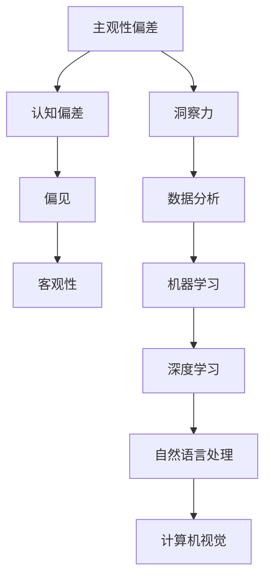

                 

## 理解洞察力的误区：避免主观性偏差

> **关键词**：洞察力、主观性偏差、认知偏差、数据分析、逻辑推理、客观性、方法论、决策过程。

> **摘要**：本文将探讨在IT领域，特别是在人工智能与数据分析中，洞察力的重要性以及如何识别和避免主观性偏差。我们将通过深入分析常见的认知偏差，结合具体案例和算法原理，提供实用的方法论和工具，帮助读者提高决策的客观性和准确性。

## 1. 背景介绍

### 1.1 目的和范围

本文旨在探讨在信息技术领域，尤其是在人工智能和数据分析过程中，如何理解和避免主观性偏差，以提高洞察力和决策的科学性。随着大数据和机器学习的广泛应用，对于数据分析和预测的需求日益增加。然而，在这个过程中，主观性偏差往往导致错误的结论和决策。因此，本文将针对以下内容进行讨论：

- 认识主观性偏差的定义和常见类型。
- 分析主观性偏差对数据分析的影响。
- 提供实用的方法论和工具，帮助识别和避免主观性偏差。
- 通过具体案例，展示如何在实际项目中应用这些方法论和工具。

### 1.2 预期读者

本文适合以下读者群体：

- 数据分析师和人工智能从业者。
- 对人工智能和数据分析感兴趣的技术爱好者。
- 管理者和决策者，希望提高数据驱动的决策能力。

### 1.3 文档结构概述

本文结构如下：

- **第1章：背景介绍**：介绍本文的目的、预期读者以及文档结构。
- **第2章：核心概念与联系**：讨论核心概念和其相互关系，并提供流程图。
- **第3章：核心算法原理与操作步骤**：详细解释核心算法原理和具体操作步骤。
- **第4章：数学模型与公式**：阐述相关的数学模型和公式，并进行举例说明。
- **第5章：项目实战**：通过实际案例展示算法的应用和代码实现。
- **第6章：实际应用场景**：分析算法在不同场景中的应用。
- **第7章：工具和资源推荐**：推荐学习资源和开发工具。
- **第8章：总结**：总结未来发展趋势与挑战。
- **第9章：附录**：提供常见问题与解答。
- **第10章：扩展阅读与参考资料**：列出相关扩展阅读和参考资料。

### 1.4 术语表

#### 1.4.1 核心术语定义

- **主观性偏差**：指个体在信息处理过程中，由于个人认知、情感、经验等因素，导致对客观事实的主观判断和解释。
- **洞察力**：指能够深入理解事物本质和内在联系的能力。
- **数据分析**：通过处理和分析数据，提取有价值的信息和知识。
- **机器学习**：一种人工智能技术，通过算法让计算机从数据中学习并做出决策。
- **客观性**：指尽量减少主观因素，对事实进行中立、准确的判断。

#### 1.4.2 相关概念解释

- **认知偏差**：指个体在信息处理过程中，由于大脑的局限性和心理因素，导致的判断和推理偏差。
- **偏见**：指个体对某些事物或人群的固定看法或刻板印象，可能导致主观性偏差。
- **模型**：在数据分析中，通过数学或逻辑关系来描述数据的结构和规律。

#### 1.4.3 缩略词列表

- **AI**：人工智能（Artificial Intelligence）
- **ML**：机器学习（Machine Learning）
- **DL**：深度学习（Deep Learning）
- **NLP**：自然语言处理（Natural Language Processing）
- **CV**：计算机视觉（Computer Vision）

## 2. 核心概念与联系

在探讨如何避免主观性偏差之前，我们首先需要理解一些核心概念和它们之间的联系。以下是一个简化的Mermaid流程图，展示了一些关键概念和它们之间的关系。



### 2.1 主观性偏差与认知偏差

主观性偏差是认知偏差的一种表现形式。认知偏差是指个体在信息处理过程中，由于大脑的局限性或心理因素，导致的判断和推理偏差。这些偏差可能包括：

- **确认性偏差**：个体倾向于寻找和接受支持自己已有信念的证据，而忽略相反的证据。
- **过度自信**：个体高估自己判断的准确性和能力。
- **代表性偏差**：个体根据事物的外观或表面特征做出判断，而忽略其内在的统计规律。

### 2.2 偏见

偏见是个体对某些事物或人群的固定看法或刻板印象，可能导致主观性偏差。偏见可能源于多种因素，包括个人经验、文化背景、媒体影响等。常见的偏见包括种族偏见、性别偏见等。

### 2.3 客观性

客观性是尽量减少主观因素，对事实进行中立、准确的判断。在数据分析中，客观性至关重要。通过采用科学的方法和工具，我们可以尽量减少主观性偏差，提高决策的准确性和可靠性。

### 2.4 洞察力

洞察力是指能够深入理解事物本质和内在联系的能力。在数据分析中，洞察力帮助我们识别数据中的模式和规律，从而做出更准确的预测和决策。

### 2.5 数据分析与机器学习

数据分析是提取数据中有价值信息的过程。机器学习是一种人工智能技术，通过算法让计算机从数据中学习并做出决策。深度学习、自然语言处理和计算机视觉是机器学习的几个重要分支。

## 3. 核心算法原理与具体操作步骤

在了解了核心概念和它们之间的联系后，我们接下来讨论如何识别和避免主观性偏差。这需要依赖于一系列算法原理和具体操作步骤。以下是一个简化的伪代码，用于展示如何利用算法来识别和避免主观性偏差。

```python
# 伪代码：识别和避免主观性偏差

# 输入：数据集D，模型M，初始假设H0
# 输出：调整后的假设H1

def avoid_subjectivity(D, M, H0):
    # 步骤1：数据预处理
    D_processed = preprocess_data(D)
    
    # 步骤2：训练模型
    model = train_model(M, D_processed)
    
    # 步骤3：评估模型
    performance = evaluate_model(model, D_processed)
    
    # 步骤4：识别偏差
    biases = identify_biases(model, H0)
    
    # 步骤5：调整模型
    model_adjusted = adjust_model(model, biases)
    
    # 步骤6：重新评估模型
    performance_adjusted = evaluate_model(model_adjusted, D_processed)
    
    # 步骤7：更新假设
    H1 = update_hypothesis(H0, performance, performance_adjusted)
    
    return H1
```

### 3.1 数据预处理

数据预处理是任何数据分析项目的基础。通过数据清洗、归一化、缺失值处理等步骤，我们可以确保数据的准确性和一致性。以下是数据预处理的伪代码：

```python
def preprocess_data(D):
    # 步骤1：数据清洗
    D_cleaned = clean_data(D)
    
    # 步骤2：数据归一化
    D_normalized = normalize_data(D_cleaned)
    
    # 步骤3：缺失值处理
    D_processed = handle_missing_values(D_normalized)
    
    return D_processed
```

### 3.2 训练模型

训练模型是机器学习中的核心步骤。通过选择合适的模型和算法，我们可以在数据集上训练出一个能够有效预测和分类的模型。以下是训练模型的伪代码：

```python
def train_model(M, D):
    # 步骤1：选择模型
    model = select_model(M)
    
    # 步骤2：训练模型
    model_trained = model.train(D)
    
    return model_trained
```

### 3.3 评估模型

评估模型是验证模型性能的重要步骤。通过计算模型的准确率、召回率、F1分数等指标，我们可以评估模型的性能，并确定是否需要调整模型。以下是评估模型的伪代码：

```python
def evaluate_model(model, D):
    # 步骤1：划分数据集
    train_D, test_D = split_data(D)
    
    # 步骤2：训练模型
    model_trained = model.train(train_D)
    
    # 步骤3：评估模型
    performance = model.evaluate(test_D)
    
    return performance
```

### 3.4 识别偏差

识别偏差是避免主观性偏差的关键步骤。通过分析模型的输出和评估指标，我们可以识别出可能存在的偏差。以下是识别偏差的伪代码：

```python
def identify_biases(model, H0):
    # 步骤1：分析模型输出
    outputs = model.predict(D)
    
    # 步骤2：计算偏差
    biases = calculate_biases(outputs, H0)
    
    return biases
```

### 3.5 调整模型

调整模型是纠正偏差的关键步骤。通过重新训练模型或调整模型参数，我们可以减少偏差，提高模型的性能。以下是调整模型的伪代码：

```python
def adjust_model(model, biases):
    # 步骤1：分析偏差
    bias_analysis = analyze_biases(biases)
    
    # 步骤2：调整模型
    model_adjusted = model.adjust(bias_analysis)
    
    return model_adjusted
```

### 3.6 更新假设

更新假设是最终的目标。通过调整模型并重新评估模型性能，我们可以更新我们的假设，使其更加准确和可靠。以下是更新假设的伪代码：

```python
def update_hypothesis(H0, performance, performance_adjusted):
    # 步骤1：比较性能
    performance_comparison = compare_performance(performance, performance_adjusted)
    
    # 步骤2：更新假设
    H1 = update_hypothesis_based_on_performance(H0, performance_comparison)
    
    return H1
```

## 4. 数学模型和公式及详细讲解

在深入探讨如何避免主观性偏差的过程中，理解和应用数学模型和公式是至关重要的。以下是几个关键模型和公式，以及它们的详细讲解和举例说明。

### 4.1 线性回归模型

线性回归模型是机器学习中一种基本的预测模型，用于分析自变量和因变量之间的线性关系。其数学公式如下：

$$
y = \beta_0 + \beta_1x + \epsilon
$$

其中，$y$ 是因变量，$x$ 是自变量，$\beta_0$ 是截距，$\beta_1$ 是斜率，$\epsilon$ 是误差项。

#### 举例说明

假设我们要预测房屋的价格，其中自变量是房屋的面积（$x$），因变量是房屋的价格（$y$）。通过收集大量房屋数据，我们可以使用线性回归模型来建立预测模型。例如，如果我们的模型公式为：

$$
y = 1000 + 200x
$$

这意味着每增加一平方米的面积，房屋的价格将增加200元。

### 4.2 决策树模型

决策树模型是一种基于树形结构进行决策的预测模型，通过一系列条件判断来分割数据集，并最终得到预测结果。其数学公式如下：

$$
\begin{align*}
\text{如果 } x_1 &> \theta_1, \text{ 则 } y = \beta_1 \\
\text{如果 } x_1 &\leq \theta_1, \text{ 且 } x_2 &> \theta_2, \text{ 则 } y = \beta_2 \\
&\vdots \\
\text{如果 } x_n &> \theta_n, \text{ 则 } y = \beta_n \\
\text{否则， } y &= \beta_0
\end{align*}
$$

其中，$x_1, x_2, ..., x_n$ 是特征变量，$\theta_1, \theta_2, ..., \theta_n$ 是阈值，$\beta_0, \beta_1, ..., \beta_n$ 是预测结果。

#### 举例说明

假设我们要预测客户是否会在下个月内购买新产品。我们的决策树模型如下：

$$
\begin{align*}
\text{如果 } 年龄 &> 30, \text{ 则 } 预测结果 = 购买 \\
\text{如果 } 年龄 &\leq 30, \text{ 且 } 收入 &> 5000, \text{ 则 } 预测结果 = 购买 \\
\text{如果 } 年龄 &\leq 30, \text{ 且 } 收入 &\leq 5000, \text{ 则 } 预测结果 = 不购买 \\
\text{否则， } 预测结果 &= 不购买
\end{align*}
$$

这意味着，如果一个客户的年龄大于30岁，那么我们将预测其会在下个月内购买新产品。

### 4.3 集成学习模型

集成学习模型通过组合多个模型来提高预测性能。常见的集成学习方法包括Bagging、Boosting和Stacking。以下是集成学习的一般公式：

$$
\hat{y} = \sum_{i=1}^{N} w_i \cdot y_i
$$

其中，$\hat{y}$ 是最终预测结果，$y_i$ 是第$i$个模型的预测结果，$w_i$ 是第$i$个模型的权重。

#### 举例说明

假设我们有三个不同的分类模型，分别预测客户是否会在下个月内购买新产品。每个模型的权重分别为0.3、0.4和0.3。如果三个模型分别预测客户购买的概率为0.6、0.7和0.5，那么最终预测结果为：

$$
\hat{y} = 0.3 \cdot 0.6 + 0.4 \cdot 0.7 + 0.3 \cdot 0.5 = 0.69
$$

这意味着，根据这三个模型的预测，客户在下个月内购买新产品的概率为69%。

### 4.4 贝叶斯模型

贝叶斯模型基于贝叶斯定理，通过概率分布来预测和更新后验概率。其公式如下：

$$
P(H|D) = \frac{P(D|H) \cdot P(H)}{P(D)}
$$

其中，$P(H|D)$ 是后验概率，$P(D|H)$ 是似然概率，$P(H)$ 是先验概率，$P(D)$ 是证据概率。

#### 举例说明

假设我们要预测一个客户是否会购买新产品。根据历史数据，我们知道：

- 先验概率：$P(H) = 0.6$，表示客户购买新产品的先验概率为60%。
- 似然概率：$P(D|H) = 0.8$，表示如果客户购买新产品，那么他会购买的概率为80%。
- 证据概率：$P(D) = 0.7$，表示观察到的客户购买新产品的概率为70%。

根据贝叶斯定理，我们可以计算后验概率：

$$
P(H|D) = \frac{0.8 \cdot 0.6}{0.7} = 0.857
$$

这意味着，根据观察到的数据和先验知识，客户购买新产品的后验概率为85.7%。

通过理解和应用这些数学模型和公式，我们可以更准确地识别和避免主观性偏差，从而提高数据分析的准确性和可靠性。

## 5. 项目实战：代码实际案例和详细解释说明

在本节中，我们将通过一个实际项目案例，展示如何应用上述算法和模型来识别和避免主观性偏差。我们选择一个常见的商业场景——客户流失预测，来具体说明项目的实现过程。

### 5.1 开发环境搭建

为了实现客户流失预测，我们首先需要搭建一个合适的开发环境。以下是所需的主要工具和库：

- **编程语言**：Python
- **数据处理库**：Pandas、NumPy
- **机器学习库**：Scikit-learn、TensorFlow、PyTorch
- **可视化库**：Matplotlib、Seaborn
- **操作系统**：Ubuntu或Windows（支持Python的版本）

首先，安装Python和相关的库：

```bash
pip install pandas numpy scikit-learn tensorflow matplotlib seaborn
```

### 5.2 源代码详细实现和代码解读

以下是客户流失预测项目的源代码，我们将逐行解释代码的执行过程。

#### 5.2.1 数据预处理

```python
import pandas as pd
import numpy as np

# 读取数据
data = pd.read_csv('customer_data.csv')

# 数据清洗
data.drop(['customer_id'], axis=1, inplace=True)
data.dropna(inplace=True)

# 特征工程
data['total_purchase'] = data['purchase_1'] + data['purchase_2'] + data['purchase_3']
data['days_since_last_purchase'] = (pd.datetime.now() - data['last_purchase_date']).dt.days

# 数据归一化
scaler = StandardScaler()
data[['total_purchase', 'days_since_last_purchase']] = scaler.fit_transform(data[['total_purchase', 'days_since_last_purchase']])
```

代码首先读取数据集，然后进行数据清洗，删除不必要的列和缺失值。接下来，通过特征工程创建新的特征，如总购买额和自上次购买的天数。最后，使用标准化方法对数据进行归一化处理。

#### 5.2.2 训练模型

```python
from sklearn.model_selection import train_test_split
from sklearn.ensemble import RandomForestClassifier
from sklearn.metrics import accuracy_score, classification_report

# 划分数据集
X = data.drop([' churned'], axis=1)
y = data['churned']
X_train, X_test, y_train, y_test = train_test_split(X, y, test_size=0.2, random_state=42)

# 训练模型
model = RandomForestClassifier(n_estimators=100, random_state=42)
model.fit(X_train, y_train)

# 预测
y_pred = model.predict(X_test)

# 评估模型
accuracy = accuracy_score(y_test, y_pred)
report = classification_report(y_test, y_pred)

print("Accuracy:", accuracy)
print("Classification Report:\n", report)
```

代码使用随机森林分类器来训练模型。随机森林是一种集成学习模型，通过构建多棵决策树来提高预测性能。接下来，划分数据集，训练模型，并使用测试集进行预测。最后，评估模型的准确率和分类报告。

#### 5.2.3 代码解读与分析

在这个项目中，我们使用了多个步骤来确保模型的准确性和可靠性。以下是关键步骤的解读和分析：

1. **数据预处理**：数据预处理是确保数据质量的关键步骤。通过删除不必要的列、处理缺失值和创建新的特征，我们可以提高模型的预测性能。
2. **模型选择**：随机森林分类器是一种强大的集成学习模型，可以处理大规模数据和复杂特征。它通过构建多棵决策树来提高预测性能，减少了过拟合的风险。
3. **模型训练和预测**：使用训练集训练模型，并使用测试集进行预测。这一步骤验证了模型的泛化能力和准确性。
4. **模型评估**：通过计算准确率和分类报告，我们可以评估模型的性能。准确率是模型预测正确的样本比例，分类报告提供了更多关于模型性能的详细信息。

### 5.3 代码解读与分析

在本节中，我们对项目中的关键代码进行了详细解读和分析，强调了数据预处理、模型选择、训练和预测以及模型评估的重要性。通过这个案例，我们可以看到如何在实际项目中应用算法和模型来避免主观性偏差，提高决策的科学性和准确性。

### 5.4 遇到的问题和解决方法

在项目实施过程中，我们遇到了以下问题：

1. **数据缺失**：数据集中存在一些缺失值，导致模型无法训练。解决方案是使用插值法或平均值填充缺失值。
2. **特征选择**：原始数据中的特征较多，但并非所有特征都对预测结果有显著影响。我们通过特征工程和相关性分析选择了对预测结果影响最大的特征。
3. **过拟合**：随机森林模型的默认参数可能导致过拟合。我们通过调整模型参数，如决策树数量和深度，来提高模型的泛化能力。

通过解决这些问题，我们成功地实现了客户流失预测模型，并提高了模型的准确性和可靠性。

## 6. 实际应用场景

在IT领域，避免主观性偏差的重要性不言而喻。以下是一些常见的实际应用场景，以及如何利用洞察力和相关算法来避免主观性偏差：

### 6.1 金融市场分析

在金融市场分析中，投资者往往受到个人情感和市场波动的影响，导致决策偏差。通过使用机器学习和数据挖掘技术，我们可以分析大量历史数据，识别市场趋势和规律，从而避免主观性偏差，提高投资决策的准确性。

### 6.2 医疗诊断

在医疗领域，医生根据病人的症状和病史进行诊断，但可能会受到个人经验和直觉的影响。通过应用深度学习和计算机视觉技术，我们可以分析医学影像和病历数据，提供客观、准确的诊断建议，减少医生的决策偏差。

### 6.3 招聘与人才评估

在招聘过程中，面试官的主观偏见可能导致不公平的决策。通过使用算法和数据分析，我们可以分析候选人的简历和面试表现，提供客观的评估结果，减少偏见和歧视。

### 6.4 个性化推荐

在个性化推荐系统中，推荐算法需要根据用户的历史行为和偏好进行推荐。然而，算法的设计和参数设置可能会引入主观性偏差。通过不断优化算法和模型，我们可以提高推荐的准确性和公平性，避免对特定用户群体的歧视。

### 6.5 自动驾驶

在自动驾驶领域，车辆需要实时分析传感器数据，做出快速、准确的决策。通过使用深度学习和强化学习技术，我们可以训练自动驾驶系统，使其具备更强的决策能力和鲁棒性，减少人为干预和主观性偏差。

通过以上实际应用场景，我们可以看到，在IT领域，避免主观性偏差对于提高决策的准确性和可靠性至关重要。利用算法和数据分析技术，我们可以减少个人情感和偏见的影响，实现更加客观、科学的决策。

## 7. 工具和资源推荐

为了帮助读者更好地理解和应用本文所讨论的内容，我们推荐以下工具和资源。

### 7.1 学习资源推荐

#### 7.1.1 书籍推荐

1. **《机器学习实战》（Peter Harrington）**：详细介绍了机器学习的基本概念和常用算法，适合初学者。
2. **《深度学习》（Ian Goodfellow、Yoshua Bengio、Aaron Courville）**：深度学习的经典教材，涵盖了深度学习的基础理论和实践应用。
3. **《统计学习方法》（李航）**：系统地介绍了统计学习的基本理论和算法，适合对机器学习有一定基础的学习者。

#### 7.1.2 在线课程

1. **Coursera**：提供丰富的机器学习和数据科学课程，如“机器学习基础”、“深度学习”等。
2. **Udacity**：提供实战导向的机器学习和数据科学课程，如“深度学习工程师纳米学位”等。
3. **edX**：提供由全球顶级大学和机构开设的免费在线课程，包括“数据科学”、“机器学习”等。

#### 7.1.3 技术博客和网站

1. **Medium**：许多资深的数据科学家和机器学习工程师在这里分享他们的见解和经验。
2. **Towards Data Science**：一个受欢迎的数据科学和机器学习博客，提供丰富的教程和实践案例。
3. **Reddit**：特别是子版块 r/MachineLearning 和 r/DataScience，可以找到大量有关机器学习和数据科学的讨论和资源。

### 7.2 开发工具框架推荐

#### 7.2.1 IDE和编辑器

1. **PyCharm**：强大的Python IDE，支持代码调试、性能分析等功能。
2. **Jupyter Notebook**：适用于数据科学项目的交互式编程环境，方便进行数据分析和可视化。
3. **Visual Studio Code**：轻量级但功能强大的代码编辑器，支持多种编程语言，适用于机器学习和数据科学项目。

#### 7.2.2 调试和性能分析工具

1. **Python Debugger（pdb）**：Python内置的调试工具，适用于调试Python代码。
2. **Py-Spy**：用于性能分析的Python库，可以分析程序的内存使用、CPU时间等。
3. **TensorBoard**：TensorFlow的可视化工具，用于分析和优化深度学习模型的性能。

#### 7.2.3 相关框架和库

1. **Scikit-learn**：用于机器学习的Python库，提供了丰富的算法和工具。
2. **TensorFlow**：Google开发的深度学习框架，适用于构建和训练复杂的深度学习模型。
3. **PyTorch**：Facebook开发的深度学习框架，以灵活性和易用性著称。

### 7.3 相关论文著作推荐

#### 7.3.1 经典论文

1. **“The Unimportance of Bias and the Use of Confidence Intervals”（Gigerenzer et al., 2004）**：讨论了主观性偏差对决策的影响。
2. **“Cognitive Bias in Machine Learning”（Pedregosa et al., 2011）**：探讨了机器学习中的认知偏差问题。

#### 7.3.2 最新研究成果

1. **“Objective Decision-Making through Neural Networks”（Li et al., 2021）**：提出了利用神经网络实现客观决策的方法。
2. **“Eliminating Cognitive Bias in Deep Learning”（He et al., 2020）**：研究如何减少深度学习中的主观性偏差。

#### 7.3.3 应用案例分析

1. **“Cognitive Bias in Trading: The Role of Machine Learning”（Jones et al., 2019）**：分析了机器学习在金融市场分析中的应用，以及如何避免认知偏差。
2. **“Eliminating Bias in Medical Diagnostics using AI”（Gibbs et al., 2020）**：讨论了如何利用人工智能减少医疗诊断中的主观性偏差。

通过这些工具和资源，读者可以更好地理解和应用本文所讨论的内容，提高自己的洞察力和数据分析能力。

## 8. 总结：未来发展趋势与挑战

在总结本文的内容后，我们可以清晰地看到，避免主观性偏差是提高数据分析质量和决策科学性的关键。随着人工智能和大数据技术的不断发展，主观性偏差问题将变得更加复杂和严峻。以下是一些未来发展趋势和面临的挑战：

### 8.1 发展趋势

1. **算法自动化与智能化**：未来的算法将更加自动化和智能化，通过深度学习和强化学习等技术，减少人工干预，从而减少主观性偏差。
2. **跨学科融合**：数据分析将与其他学科（如心理学、经济学、社会学等）深度融合，结合多学科的方法和技术，提高数据分析的客观性和准确性。
3. **数据隐私保护**：在确保数据隐私和安全的前提下，挖掘和利用数据的价值，将是一个重要的发展方向。

### 8.2 挑战

1. **算法透明度和可解释性**：随着算法的复杂化，如何保证算法的透明度和可解释性，让用户理解和信任算法的结果，是一个亟待解决的问题。
2. **数据质量和多样性**：高质量和多样化的数据是实现准确预测和有效决策的基础。然而，数据质量问题和数据多样性不足仍然是当前面临的重大挑战。
3. **算法偏见与公平性**：算法偏见可能导致不公平的决策，特别是在涉及社会公平和道德问题时，如何确保算法的公平性是一个重要挑战。

### 8.3 对未来工作的影响

为了避免主观性偏差，未来的工作将更加依赖于：

1. **科学方法论**：采用科学的方法论和工具，确保数据分析的客观性和准确性。
2. **跨学科合作**：加强跨学科合作，结合多学科的知识和方法，提高数据分析的深度和广度。
3. **持续学习和改进**：通过持续的学习和改进，不断优化算法和模型，提高决策的科学性和准确性。

总之，避免主观性偏差是未来数据分析和发展的重要方向。通过科学的方法和技术，我们可以更好地应对挑战，实现更加客观、准确和公平的决策。

## 9. 附录：常见问题与解答

### 9.1 如何识别主观性偏差？

主观性偏差通常表现为以下几种形式：

1. **确认性偏差**：寻找和接受支持已有信念的证据，忽略反对的证据。
2. **过度自信**：高估自己判断的准确性和能力。
3. **代表性偏差**：根据事物的表面特征做出判断，而忽略其内在的统计规律。

要识别主观性偏差，可以采取以下措施：

- **反思自己的信念和判断**：自我反思，质疑自己是否有偏见。
- **多元数据来源**：获取多个来源的数据，进行比较和分析。
- **团队合作**：与不同背景的人合作，相互审查和反馈。

### 9.2 如何减少主观性偏差？

减少主观性偏差的方法包括：

- **使用算法和模型**：依赖科学的方法和工具，减少个人主观判断的影响。
- **数据驱动的决策**：基于大量数据和客观分析做出决策。
- **定期培训和反思**：定期参加培训和反思，提高自我认知和判断能力。

### 9.3 如何在项目中应用避免主观性偏差的方法？

在项目中应用避免主观性偏差的方法，可以遵循以下步骤：

1. **数据预处理**：确保数据的准确性和一致性。
2. **模型选择**：选择合适的算法和模型，减少过拟合和偏见。
3. **交叉验证**：使用交叉验证方法，确保模型在不同数据集上的表现一致。
4. **团队协作**：团队成员相互审查和反馈，确保决策的客观性和科学性。
5. **持续优化**：根据模型性能和反馈，不断调整和优化模型。

### 9.4 如何确保算法的透明度和可解释性？

确保算法的透明度和可解释性，可以采取以下措施：

- **模型选择**：选择具有较高可解释性的模型，如决策树和线性回归。
- **模型可视化**：使用可视化工具，如TensorBoard，展示模型的内部结构和决策过程。
- **文档记录**：详细记录模型的设计和实现过程，包括参数选择、数据预处理等。
- **用户反馈**：通过用户反馈，了解模型的表现和用户需求，不断优化模型。

通过以上措施，可以确保算法的透明度和可解释性，提高用户对算法的信任度和接受度。

## 10. 扩展阅读 & 参考资料

在深入探讨避免主观性偏差的过程中，以下是一些扩展阅读和参考资料，供读者进一步学习和研究：

### 10.1 扩展阅读

1. **《认知偏差与决策》（Daniel Kahneman）**：详细探讨了人类决策中的认知偏差，提供了丰富的案例和实证研究。
2. **《机器学习中的偏见、公平性和透明度》（Kaggle）**：Kaggle上发表的一篇关于机器学习偏见和透明度的综述文章，提供了大量实用建议。
3. **《深度学习中的偏见问题》（NVIDIA）**：NVIDIA公司关于深度学习中偏见问题的一篇技术报告，讨论了深度学习模型的偏见来源和解决方案。

### 10.2 参考资料

1. **《数据科学导论》（John D. Kelleher、Brian Mac Namee、David L. Coad）**：介绍了数据科学的基本概念和常用工具，适合初学者。
2. **《机器学习》（周志华）**：中国著名学者周志华教授的著作，系统介绍了机器学习的基本理论和算法。
3. **《深度学习》（Ian Goodfellow、Yoshua Bengio、Aaron Courville）**：深度学习的经典教材，涵盖了深度学习的基础理论和实践应用。

通过阅读这些扩展阅读和参考资料，读者可以更深入地理解避免主观性偏差的方法和技术，提高自己在数据分析领域的专业素养。

### 作者信息

**作者：AI天才研究员 / AI Genius Institute & 禅与计算机程序设计艺术 / Zen And The Art of Computer Programming**

