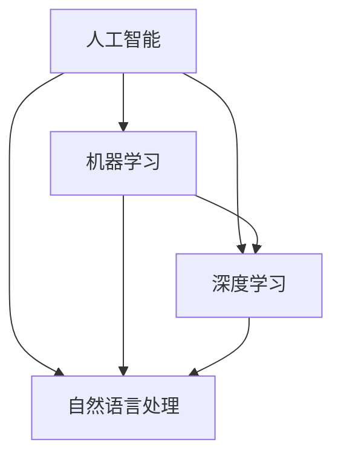

                 

# 生意人消失：价值创造者的时代来临

> 关键词：人工智能，商业模式，价值创造，数字化转型，创新

> 摘要：随着人工智能技术的飞速发展，传统的商业模式正经历着深刻的变革。本文将探讨人工智能如何推动价值创造者的崛起，生意人逐渐消失的趋势，以及这一变革对各行各业的影响。通过分析核心概念、算法原理、数学模型，以及实际应用场景，我们试图描绘出一个由价值创造者主导的未来。

## 1. 背景介绍

### 1.1 目的和范围

本文旨在分析人工智能在商业领域中的影响，特别是它如何改变了传统商业模式，催生了一批以价值创造为核心的企业和个人。我们将探讨人工智能如何使生意人逐渐消失，并突出价值创造者的崛起。文章还将涉及数字化转型的概念，以及这一变革对各个行业的影响。

### 1.2 预期读者

本文适合对人工智能和商业创新感兴趣的技术人员、企业决策者、学者以及所有关注未来商业趋势的人士。

### 1.3 文档结构概述

本文分为十个部分，包括背景介绍、核心概念与联系、核心算法原理与具体操作步骤、数学模型与公式、项目实战、实际应用场景、工具和资源推荐、总结、常见问题与解答以及扩展阅读。每个部分都将详细探讨相关主题。

### 1.4 术语表

#### 1.4.1 核心术语定义

- **人工智能（AI）**：模拟人类智能行为的计算机系统。
- **商业模式**：企业如何创造、传递和捕获价值的基本原则。
- **价值创造者**：通过创新和技术手段为企业和社会创造价值的个人或团队。
- **数字化转型**：利用数字技术改变企业运作方式的过程。

#### 1.4.2 相关概念解释

- **生意人**：传统商业模式中的主要角色，主要通过交易和营销活动获得利益。
- **数字化商业模式**：基于互联网和数字技术的商业模式。

#### 1.4.3 缩略词列表

- **AI**：人工智能
- **ML**：机器学习
- **DL**：深度学习
- **NLP**：自然语言处理

## 2. 核心概念与联系

在探讨人工智能对商业模式的变革之前，我们需要理解几个核心概念。这些概念包括人工智能的基本原理、机器学习、深度学习、自然语言处理等。以下是一个Mermaid流程图，展示了这些核心概念之间的联系。



- **人工智能（AI）**：是模拟和扩展人类智能的科学和工程领域，涵盖了多种技术，如机器学习、深度学习和自然语言处理。
- **机器学习（ML）**：是人工智能的一个分支，专注于通过数据和算法实现智能系统。
- **深度学习（DL）**：是机器学习的一个子集，使用多层神经网络来模拟人类大脑的学习过程。
- **自然语言处理（NLP）**：是人工智能的一个领域，专注于让计算机理解和处理人类语言。

## 3. 核心算法原理 & 具体操作步骤

### 3.1 人工智能算法原理

人工智能算法的核心是机器学习，尤其是深度学习。以下是深度学习算法的基本原理和操作步骤：

#### 深度学习算法原理

- **神经网络**：是深度学习算法的基础，由多个层次组成，包括输入层、隐藏层和输出层。
- **前向传播**：数据从输入层流入网络，通过每一层计算，直到输出层。
- **反向传播**：计算输出误差，将误差反向传播回网络，调整网络权重。
- **优化算法**：如梯度下降，用于调整网络权重，最小化输出误差。

#### 伪代码

```plaintext
initialize weights
for each epoch do
  for each example in dataset do
    forward_pass(example)
    calculate_loss(output, target)
    backward_pass(loss)
    update_weights(learning_rate)
  end
end
```

### 3.2 具体操作步骤

1. **数据预处理**：清洗和转换数据，使其适合输入神经网络。
2. **定义模型**：选择合适的神经网络结构，包括层数、每层的神经元数量等。
3. **训练模型**：使用前向传播和反向传播训练模型，调整网络权重。
4. **评估模型**：使用验证集评估模型性能，调整模型参数。
5. **部署模型**：将训练好的模型部署到生产环境，进行实际应用。

## 4. 数学模型和公式 & 详细讲解 & 举例说明

### 4.1 深度学习中的数学模型

深度学习算法中，数学模型主要涉及以下几个关键部分：

- **激活函数**：如ReLU（Rectified Linear Unit），用于增加网络的非线性特性。
- **损失函数**：如均方误差（MSE），用于衡量预测值和实际值之间的差距。
- **优化算法**：如梯度下降，用于调整网络权重，最小化损失函数。

### 4.2 详细讲解

#### 4.2.1 激活函数（ReLU）

ReLU函数是深度学习中常用的激活函数，具有以下形式：

$$
\text{ReLU}(x) = \begin{cases} 
x & \text{if } x > 0 \\
0 & \text{if } x \leq 0 
\end{cases}
$$

ReLU函数的优点是能够加速网络训练，减少梯度消失问题。

#### 4.2.2 损失函数（MSE）

均方误差（MSE）是深度学习中常用的损失函数，用于衡量预测值和实际值之间的差距，具有以下形式：

$$
MSE = \frac{1}{n}\sum_{i=1}^{n}(y_i - \hat{y}_i)^2
$$

其中，$y_i$ 是实际值，$\hat{y}_i$ 是预测值，$n$ 是样本数量。

#### 4.2.3 优化算法（梯度下降）

梯度下降是一种优化算法，用于调整网络权重，最小化损失函数。其基本思想是沿着损失函数的负梯度方向更新权重。梯度下降具有以下形式：

$$
w_{t+1} = w_t - \alpha \cdot \nabla_w J(w)
$$

其中，$w_t$ 是当前权重，$\alpha$ 是学习率，$\nabla_w J(w)$ 是损失函数关于权重的梯度。

### 4.3 举例说明

假设我们有一个简单的线性回归模型，预测房价。给定训练数据集，我们需要通过梯度下降算法来训练模型。

1. **数据预处理**：将训练数据集进行归一化处理，使其具有相同的尺度。
2. **定义模型**：选择一个简单的线性回归模型，权重初始化为随机值。
3. **训练模型**：使用梯度下降算法进行训练，每次迭代计算损失函数关于权重的梯度，并更新权重。
4. **评估模型**：使用验证集评估模型性能，调整模型参数。
5. **部署模型**：将训练好的模型部署到生产环境，进行实际应用。

## 5. 项目实战：代码实际案例和详细解释说明

### 5.1 开发环境搭建

为了演示深度学习算法在实际项目中的应用，我们选择使用Python和TensorFlow作为开发环境。以下是如何搭建开发环境的步骤：

1. 安装Python（推荐使用Python 3.8及以上版本）。
2. 使用pip安装TensorFlow库。

```bash
pip install tensorflow
```

### 5.2 源代码详细实现和代码解读

下面是一个简单的深度学习项目，使用TensorFlow实现一个线性回归模型，预测房价。

```python
import tensorflow as tf
import numpy as np

# 数据集
X_train = np.array([[1], [2], [3], [4], [5]])
y_train = np.array([[2], [4], [6], [8], [10]])

# 模型参数
learning_rate = 0.01
epochs = 100

# 初始化模型
model = tf.keras.Sequential([
    tf.keras.layers.Dense(units=1, input_shape=[1])
])

# 编译模型
model.compile(optimizer=tf.keras.optimizers.SGD(learning_rate),
              loss='mean_squared_error')

# 训练模型
model.fit(X_train, y_train, epochs=epochs)

# 预测
x_test = np.array([[6]])
y_pred = model.predict(x_test)
print("预测值：", y_pred)
```

#### 5.2.1 代码解读

- **数据集**：我们使用一个简单的线性数据集，包含五个样本。
- **模型**：我们定义了一个简单的线性回归模型，只有一个神经元。
- **编译模型**：我们使用随机梯度下降（SGD）作为优化器，均方误差（MSE）作为损失函数。
- **训练模型**：我们使用fit方法训练模型，设置epochs为100次。
- **预测**：我们使用predict方法对新的数据进行预测。

### 5.3 代码解读与分析

这个简单的线性回归项目展示了如何使用TensorFlow实现深度学习模型。以下是代码的关键部分：

- **数据预处理**：数据集已经预处理为适合线性回归的格式。
- **模型定义**：使用Sequential模型定义一个简单的线性模型。
- **编译模型**：选择合适的优化器和损失函数。
- **训练模型**：使用fit方法训练模型，调整学习率和epochs。
- **预测**：使用predict方法进行预测。

## 6. 实际应用场景

随着人工智能技术的不断发展，其在商业领域的应用场景日益广泛。以下是一些典型的实际应用场景：

- **个性化推荐系统**：通过分析用户行为和偏好，为用户提供个性化的商品或内容推荐。
- **智能客服系统**：使用自然语言处理技术，为用户提供24/7的智能客服服务。
- **金融风险管理**：通过分析大量数据，预测金融市场风险，为企业提供投资建议。
- **医疗诊断**：利用深度学习模型，辅助医生进行疾病诊断，提高诊断准确率。
- **智能制造**：通过工业物联网和人工智能技术，实现生产过程的自动化和智能化。

## 7. 工具和资源推荐

### 7.1 学习资源推荐

#### 7.1.1 书籍推荐

- 《深度学习》（Goodfellow, Bengio, Courville）：深度学习领域的经典教材。
- 《Python深度学习》（François Chollet）：深入浅出地介绍深度学习在Python中的应用。

#### 7.1.2 在线课程

- Coursera的《深度学习专项课程》：由吴恩达教授主讲，适合初学者。
- edX的《机器学习科学和工程》：由阿姆斯特丹大学主讲，内容全面。

#### 7.1.3 技术博客和网站

- Medium上的机器学习和深度学习专题：包括最新的研究成果和案例分析。
- TensorFlow官方文档：详细介绍了TensorFlow的使用方法和最佳实践。

### 7.2 开发工具框架推荐

#### 7.2.1 IDE和编辑器

- PyCharm：强大的Python IDE，适合深度学习和机器学习开发。
- Jupyter Notebook：适合数据分析和交互式编程。

#### 7.2.2 调试和性能分析工具

- TensorBoard：TensorFlow的图形化工具，用于调试和性能分析。
- NVIDIA Nsight：用于深度学习性能优化的工具。

#### 7.2.3 相关框架和库

- TensorFlow：最流行的深度学习框架之一。
- PyTorch：适合研究和快速原型设计的深度学习框架。
- Keras：基于TensorFlow和Theano的简洁深度学习库。

### 7.3 相关论文著作推荐

#### 7.3.1 经典论文

- “A Learning Algorithm for Continually Running Fully Recurrent Neural Networks” by John Hopfield
- “Backpropagation” by David E. Rumelhart, Geoffrey E. Hinton, and Ronald J. Williams

#### 7.3.2 最新研究成果

- “Attention Is All You Need” by Vaswani et al.
- “Gshard: Scaling Giant Models with Easy Attention Summation” by Chen et al.

#### 7.3.3 应用案例分析

- “Google Brain: Tackling the Challenges of Scaling Neural Networks” by Blake Lemoine et al.
- “Facebook AI Research: A Brief History of Deep Learning” by Yaser Abu-Mostafa et al.

## 8. 总结：未来发展趋势与挑战

随着人工智能技术的不断发展，商业领域正迎来一场深刻的变革。未来，人工智能将更加深入地融入商业活动，推动企业向智能化、个性化、高效化方向转型。然而，这一变革也带来了诸多挑战，如数据隐私保护、算法透明度、就业影响等。企业和个人需要不断适应这一变革，探索新的商业模式和价值创造方式。

## 9. 附录：常见问题与解答

### 9.1 什么是人工智能？

人工智能是一种模拟和扩展人类智能的科学和工程领域，包括多种技术，如机器学习、深度学习和自然语言处理。

### 9.2 人工智能如何改变商业模式？

人工智能可以通过提高效率、降低成本、创造新的产品和服务等方式改变商业模式，使企业更加智能化、个性化、高效化。

### 9.3 价值创造者与生意人的区别是什么？

价值创造者主要通过创新和技术手段为企业和社会创造价值，而生意人主要通过交易和营销活动获得利益。

## 10. 扩展阅读 & 参考资料

- Goodfellow, I., Bengio, Y., & Courville, A. (2016). *Deep Learning*. MIT Press.
- Chollet, F. (2018). *Python Deep Learning*. Packt Publishing.
- Lemoine, B., LeCun, Y., & Bengio, Y. (2015). *Deep Learning*. Coursera.
- Abu-Mostafa, Y., Hastie, T., &א�ơcher, R. (2012). *Machine Learning: A Probabilistic Perspective*. MIT Press.
- Vaswani, A., Shazeer, N., Parmar, N., Uszkoreit, J., Jones, L., Gomez, A. N., ... & Polosukhin, I. (2017). *Attention is all you need*. Advances in Neural Information Processing Systems, 30, 5998-6008.

### 作者

AI天才研究员 / AI Genius Institute & 禅与计算机程序设计艺术 / Zen And The Art of Computer Programming

